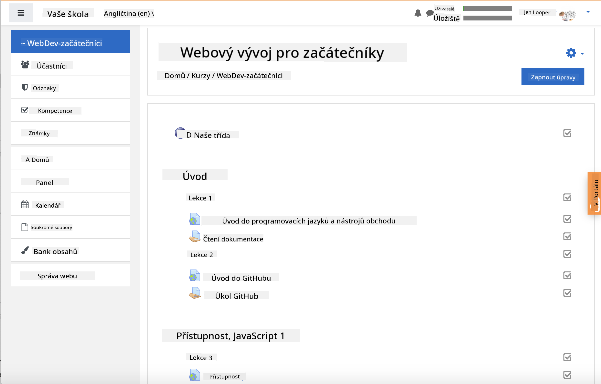

<!--
CO_OP_TRANSLATOR_METADATA:
{
  "original_hash": "75cb51f7ca9ea0b097ef4a1287e9290c",
  "translation_date": "2025-08-28T03:22:47+00:00",
  "source_file": "for-teachers.md",
  "language_code": "cs"
}
-->
## Pro pedagogy

Chtěli byste použít tento výukový plán ve své třídě? Klidně do toho!

Ve skutečnosti jej můžete použít přímo na GitHubu pomocí GitHub Classroom.

Abyste to mohli udělat, forkněte toto repozitáře. Budete muset vytvořit repozitář pro každou lekci, takže budete muset extrahovat každou složku do samostatného repozitáře. Tímto způsobem může [GitHub Classroom](https://classroom.github.com/classrooms) zpracovat každou lekci zvlášť.

Tyto [podrobné instrukce](https://github.blog/2020-03-18-set-up-your-digital-classroom-with-github-classroom/) vám poskytnou představu, jak nastavit svou třídu.

## Použití v Moodle, Canvas nebo Blackboard

Tento výukový plán skvěle funguje v těchto systémech pro správu výuky! Použijte [soubor pro nahrání do Moodle](../../../../../../../teaching-files/webdev-moodle.mbz) pro kompletní obsah, nebo vyzkoušejte [soubor Common Cartridge](../../../../../../../teaching-files/webdev-common-cartridge.imscc), který obsahuje část obsahu. Moodle Cloud nepodporuje kompletní exporty Common Cartridge, takže je lepší použít soubor pro Moodle, který lze nahrát do Canvas. Dejte nám vědět, jak můžeme tento proces zlepšit.

  
> Výukový plán v prostředí Moodle

  
> Výukový plán v prostředí Canvas

## Použití repozitáře tak, jak je

Pokud byste chtěli použít tento repozitář v jeho aktuální podobě, bez použití GitHub Classroom, je to také možné. Budete muset studentům sdělit, kterou lekci mají společně projít.

V online formátu (Zoom, Teams nebo jiném) můžete vytvořit breakout místnosti pro kvízy a mentorovat studenty, aby se připravili na učení. Poté pozvěte studenty ke kvízům a nechte je odevzdat své odpovědi jako 'issues' v určitém čase. Stejný postup můžete použít i pro úkoly, pokud chcete, aby studenti pracovali společně a veřejně.

Pokud preferujete soukromější formát, požádejte studenty, aby si forknuli výukový plán, lekci po lekci, do svých vlastních soukromých repozitářů na GitHubu a dali vám k nim přístup. Poté mohou dokončit kvízy a úkoly soukromě a odevzdat je vám prostřednictvím issues ve vašem třídním repozitáři.

Existuje mnoho způsobů, jak tento výukový plán přizpůsobit online výuce. Dejte nám vědět, co vám funguje nejlépe!

## Podělte se s námi o své názory!

Chceme, aby tento výukový plán fungoval pro vás a vaše studenty. Spojte se s námi v [Teacher corner](https://github.com/microsoft/Web-Dev-For-Beginners/discussions/categories/teacher-corner) a otevřete [**nový issue**](https://github.com/microsoft/Web-Dev-For-Beginners/issues/new/choose) pro jakékoli požadavky, chyby a zpětnou vazbu.

---

**Prohlášení**:  
Tento dokument byl přeložen pomocí služby pro automatický překlad [Co-op Translator](https://github.com/Azure/co-op-translator). Ačkoli se snažíme o přesnost, mějte prosím na paměti, že automatické překlady mohou obsahovat chyby nebo nepřesnosti. Původní dokument v jeho původním jazyce by měl být považován za autoritativní zdroj. Pro důležité informace doporučujeme profesionální lidský překlad. Neodpovídáme za žádná nedorozumění nebo nesprávné interpretace vyplývající z použití tohoto překladu.