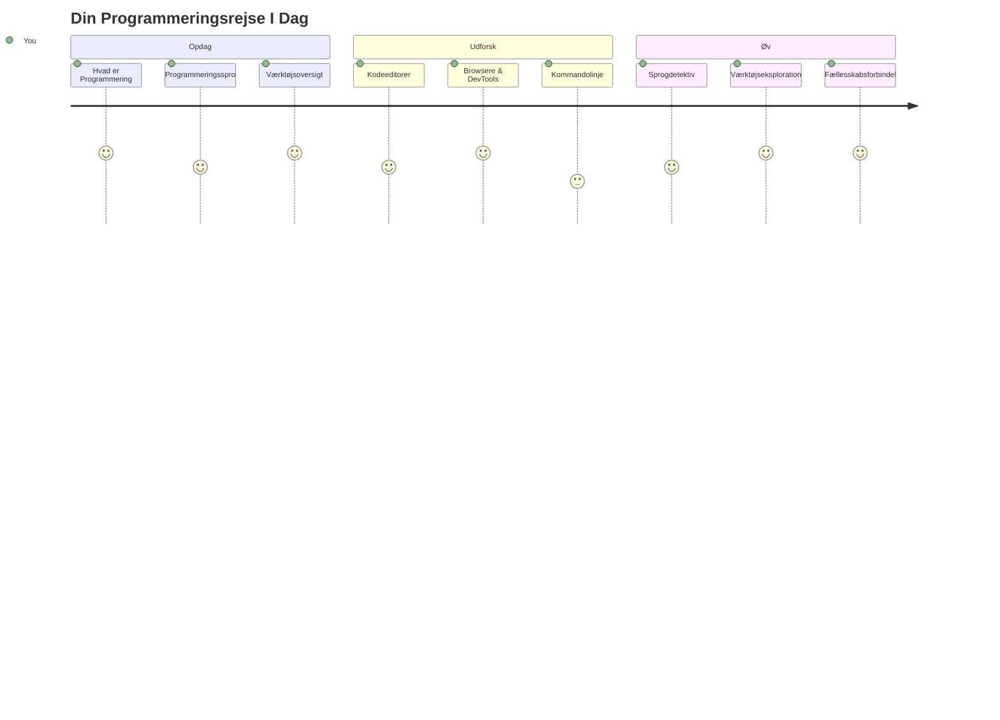
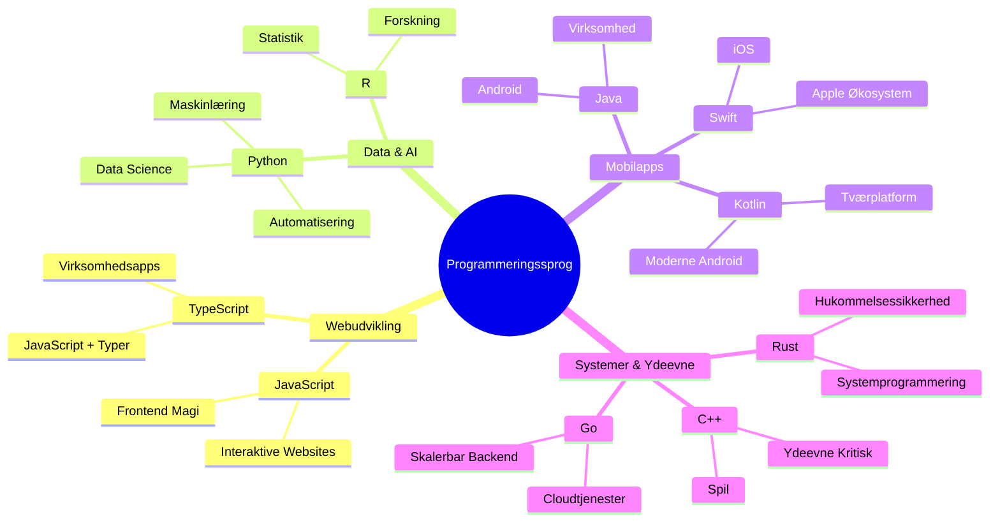
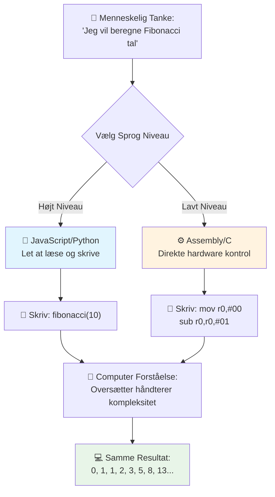
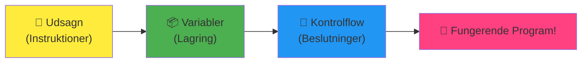
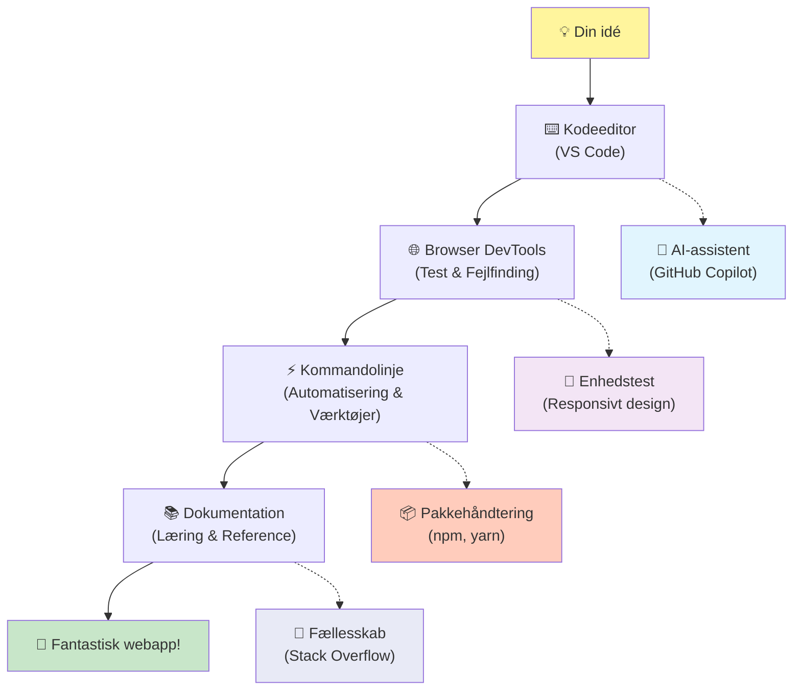
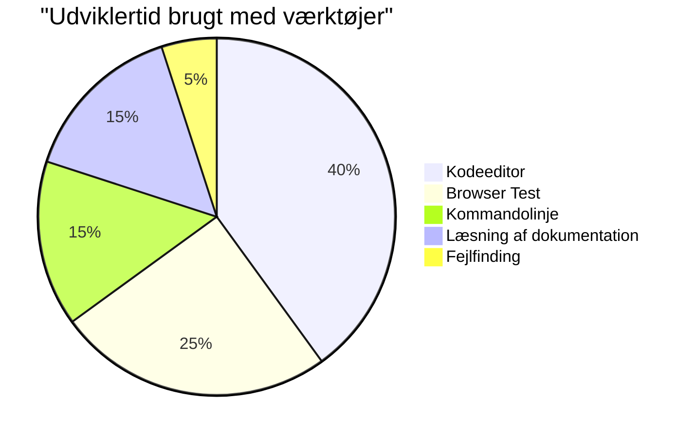
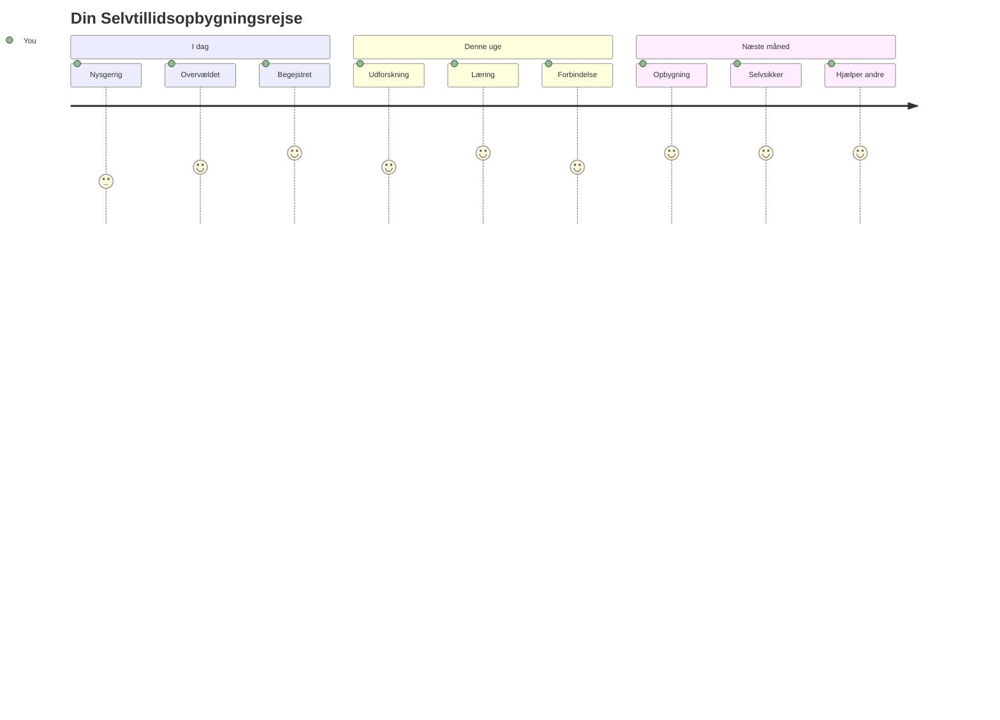

<!--
CO_OP_TRANSLATOR_METADATA:
{
  "original_hash": "d45ddcc54eb9232a76d08328b09d792e",
  "translation_date": "2026-01-07T00:03:59+00:00",
  "source_file": "1-getting-started-lessons/1-intro-to-programming-languages/README.md",
  "language_code": "da"
}
-->
# Introduktion til programmeringssprog og moderne udviklerværktøjer
 
Hej der, kommende udvikler! 👋 Må jeg fortælle dig noget, der stadig giver mig kuldegysninger hver eneste dag? Du er ved at opdage, at programmering ikke bare handler om computere – det handler om at have ægte superkræfter til at bringe dine vildeste idéer til live!

Du kender det øjeblik, hvor du bruger din yndlingsapp, og alt bare fungerer perfekt? Når du trykker på en knap, og noget helt magisk sker, som får dig til at sige "wow, hvordan gjorde de DET?" Nå, nogen ligesom dig – sandsynligvis siddende i deres yndlingskaffebar kl. 2 om natten med deres tredje espresso – skrev koden, der skabte den magi. Og her er det, der vil blæse dig væk: ved slutningen af denne lektion vil du ikke kun forstå, hvordan de gjorde det, men du vil også være ivrig efter at prøve det selv!

Se, jeg forstår fuldt ud, hvis programmering føles skræmmende lige nu. Da jeg begyndte, troede jeg ærligt talt, at du skulle være en slags matematisk geni eller have kodet siden du var fem år gammel. Men her er det, der fuldstændig ændrede min opfattelse: programmering er præcis som at lære at føre samtaler på et nyt sprog. Du starter med "hej" og "tak," så øver du dig i at bestille kaffe, og før du ved af det, har du dybe filosofiske diskussioner! Bortset fra at i dette tilfælde fører du samtaler med computere, og ærligt talt? De er de mest tålmodige samtalepartnere, du nogensinde vil møde – de dømmer aldrig dine fejl og er altid begejstrede for at prøve igen!

I dag skal vi udforske de utrolige værktøjer, der gør moderne webudvikling ikke bare mulig, men også seriøst vanedannende. Jeg taler om de nøjagtige redaktører, browsere og arbejdsprocesser, som udviklere hos Netflix, Spotify og dit yndlings indie app-studie bruger hver eneste dag. Og her er den del, der vil få dig til at lave en glad dans: de fleste af disse professionelle, branchestandard-værktøjer er helt gratis!


> Sketchnote af [Tomomi Imura](https://twitter.com/girlie_mac)


## Lad os se, hvad du allerede ved!

Inden vi hopper til det sjove, er jeg nysgerrig – hvad ved du allerede om denne programmeringsverden? Og hør, hvis du kigger på disse spørgsmål og tænker "jeg har bogstaveligt talt nul idé om noget af dette," så er det ikke bare okay, det er perfekt! Det betyder, at du er lige præcis det rigtige sted. Tænk på denne quiz som opvarmning før træning – vi varmer bare hjernemusklerne op!

[Tag pre-lektion quizzen](https://forms.office.com/r/dru4TE0U9n?origin=lprLink)


## Eventyret vi skal tage på sammen

Okay, jeg er ægte begejstret og hopper næsten af sted for at udforske det, vi skal i dag! Seriøst, jeg ville ønske, jeg kunne se dit ansigt, når nogle af disse koncepter går op for dig. Her er den utrolige rejse, vi tager sammen:

- **Hvad programmering egentlig er (og hvorfor det er det fedeste i verden!)** – Vi skal opdage, hvordan kode bogstaveligt talt er den usynlige magi, der driver alt omkring dig, fra den alarm, der på en eller anden måde ved, det er mandag morgen, til algoritmen, der perfekt kuraterer dine Netflix-anbefalinger
- **Programmeringssprog og deres fantastiske personligheder** – Forestil dig at komme til en fest, hvor hver person har helt forskellige superkræfter og måder at løse problemer på. Sådan er verden af programmeringssprog, og du vil elske at møde dem!
- **De grundlæggende byggesten, der får digital magi til at ske** – Tænk på disse som det ultimative kreative LEGO-sæt. Når du forstår, hvordan disse stykker passer sammen, vil du indse, at du bogstaveligt talt kan bygge alt, hvad din fantasi drømmer om
- **Professionelle værktøjer, der får dig til at føle, at du lige har fået udleveret en troldmandsstav** – Jeg overdriver ikke her – disse værktøjer får dig virkelig til at føle, at du har superkræfter, og det bedste? Det er de samme, som professionelle bruger!

> 💡 **Det her er sagen**: Tænk ikke engang på at prøve at huske alting i dag! Lige nu vil jeg bare have, at du mærker gnisten af begejstring over, hvad der er muligt. Detaljerne vil fastholde sig naturligt, når vi øver sammen – det er sådan, rigtig læring sker!

> Du kan tage denne lektion på [Microsoft Learn](https://docs.microsoft.com/learn/modules/web-development-101/introduction-programming/?WT.mc_id=academic-77807-sagibbon)!

## Så hvad *er* programmering egentlig?

Okay, lad os tage fat på million-dollar spørgsmålet: hvad er programmering egentlig?

Jeg vil give dig en historie, der fuldstændig ændrede min måde at tænke på det her. I sidste uge prøvede jeg at forklare min mor, hvordan hun bruger vores nye smart TV-fjernbetjening. Jeg fangede mig selv i at sige ting som "Tryk på den røde knap, men ikke den store røde knap, den lille røde knap til venstre... nej, din anden venstre... okay, nu hold den i to sekunder, ikke et, ikke tre..." Lyder det bekendt? 😅

Det er programmering! Det er kunsten at give utroligt detaljerede, trin-for-trin instruktioner til noget, der er meget kraftfuldt, men som har brug for, at alt bliver stavet ud helt præcist. Bortset fra at i stedet for at forklare det til din mor (som kan spørge "hvilken rød knap?!"), forklarer du det til en computer (som bare gør præcis, hvad du siger, selvom det, du sagde, ikke helt var det, du mente).

Her er det, der blæste mit sind, da jeg først lærte det: computere er faktisk ret simple i deres kerne. De forstår faktisk kun to ting – 1 og 0, hvilket grundlæggende bare er "ja" og "nej" eller "til" og "fra." Det er det! Men her bliver det magisk – vi behøver ikke tale i 1'ere og 0'ere, som om vi var i The Matrix. Det er her, **programmeringssprog** kommer til undsætning. De er som verdens bedste oversætter, der tager dine helt almindelige mennesketanker og omsætter dem til computersprog.

Og her er det, der stadig giver mig ægte kuldegysninger hver morgen, når jeg vågner: bogstaveligt talt *alt* digitalt i dit liv startede med nogen ligesom dig, sandsynligvis siddende i deres pyjamas med en kop kaffe, der skrev kode på deres bærbare. Det Instagram-filter, der får dig til at se fejlfri ud? Nogen kodede det. Anbefalingen, der førte dig til din nye yndlingssang? En udvikler byggede den algoritme. Appen, der hjælper dig med at dele middagsregningen med venner? Jep, nogen tænkte "det her er irriterende, det kan jeg fixe" og så... gjorde de det!

Når du lærer at programmere, tager du ikke bare en ny færdighed til dig – du bliver en del af dette utrolige fællesskab af problemløsere, der tilbringer deres dage med at tænke, "Hvad nu hvis jeg kunne bygge noget, der gør nogens dag bare en smule bedre?" Ærligt talt, er der noget sejere end det?

✅ **Sjov fakta-jagt**: Her er noget super sejt at slå op, når du har et ledigt øjeblik – hvem tror du var verdens første computerprogrammør? Jeg giver dig et hint: Det er måske ikke den, du forventer! Historien om denne person er virkelig fascinerende og viser, at programmering altid har handlet om kreativ problemløsning og at tænke uden for boksen.

### 🧠 **Check-in tid: Hvordan har du det?**

**Tag et øjeblik til at reflektere:**
- Giver idéen om "at give instruktioner til computere" mening for dig nu?
- Kan du tænke på en daglig opgave, du gerne vil automatisere med programmering?
- Hvilke spørgsmål dukker op i dit hoved om det her med programmering?

> **Husk**: Det er helt normalt, hvis nogle koncepter føles uklare lige nu. At lære programmering er som at lære et nyt sprog – det tager tid for din hjerne at bygge de neurale stier. Du gør det rigtig godt!

## Programmeringssprog er som forskellige slags magi

Okay, det her kommer til at lyde mærkeligt, men hæng på mig – programmeringssprog er meget lig forskellige slags musik. Tænk på det: Du har jazz, som er blød og improvisatorisk, rock, der er kraftfuld og ligetil, klassisk, der er elegant og struktureret, og hip-hop, der er kreativ og udtryksfuld. Hver stil har sin egen stemning, sit eget fællesskab af passionerede fans, og hver enkelt er perfekt til forskellige stemninger og lejligheder.

Programmeringssprog fungerer på præcis samme måde! Du ville ikke bruge det samme sprog til at bygge et sjovt mobilspil, som du ville bruge til at bearbejde enorme mængder klimadata – ligesom du ikke ville spille death metal til en yogatime (nå, de fleste yogatimer i hvert fald! 😄).

Men her er det, der altid blæser mig væk, hver gang jeg tænker på det: disse sprog er som at have den mest tålmodige, geniale tolk i verden siddende lige ved siden af dig. Du kan udtrykke dine idéer på en måde, der føles naturlig for din menneskehjerne, og de håndterer alt det utroligt komplekse arbejde med at oversætte det til 1'erne og 0'erne, som computere rent faktisk taler. Det er som at have en ven, der er fuldstændig flydende i både "menneskelig kreativitet" og "computerlogik" – og de bliver aldrig trætte, har aldrig kaffepauser og dømmer dig aldrig for at stille det samme spørgsmål to gange!

### Populære programmeringssprog og deres anvendelser


| Sprog | Bedst til | Hvorfor det er populært |
|----------|----------|------------------|
| **JavaScript** | Webudvikling, brugergrænseflader | Kører i browsere og driver interaktive websites |
| **Python** | Data science, automation, AI | Let at læse og lære, kraftfulde biblioteker |
| **Java** | Enterprise-applikationer, Android-apps | Platformuafhængigt, robust til store systemer |
| **C#** | Windows-applikationer, spiludvikling | Stærk Microsoft-økosystemstøtte |
| **Go** | Cloud-services, backend-systemer | Hurtigt, enkelt, designet til moderne computing |

### High-Level vs. Low-Level sprog

Okay, det her var ærligt talt det koncept, der knækkede min hjerne, da jeg først begyndte at lære, så jeg deler den analogi, der endelig fik det til at gå op for mig – og jeg håber virkelig, den hjælper dig også!

Forestil dig, at du besøger et land, hvor du ikke taler sproget, og du desperat har brug for at finde den nærmeste toilet (det har vi alle været ude for, ikke? 😅):

- **Low-level programmering** er som at lære det lokale dialekt så godt, at du kan snakke med bedstemor, der sælger frugt på hjørnet, ved hjælp af kulturelle referencer, lokalt slang og interne jokes, som kun nogen, der voksede op der, ville forstå. Super imponerende og utroligt effektivt... hvis du tilfældigvis er flydende! Men ret overvældende, når du bare prøver at finde toilettet.

- **High-level programmering** er som at have den fantastiske lokale ven, der bare forstår dig. Du kan sige "Jeg har virkelig brug for at finde et toilet" på almindeligt engelsk, og de håndterer al den kulturelle oversættelse og giver dig vejledning på en måde, der giver perfekt mening for din ikke-lokale hjerne.

I programmeringsterminologi:
- **Low-level sprog** (som Assembly eller C) lader dig føre utroligt detaljerede samtaler med computerens faktiske hardware, men du skal tænke som en maskine, hvilket... lad os bare sige, er et stort mentalt skift!
- **High-level sprog** (som JavaScript, Python eller C#) lader dig tænke som et menneske, mens de håndterer al maskinsproget bag kulisserne. Plus, de har utroligt imødekommende fællesskaber fulde af folk, der husker, hvordan det var at være ny, og som virkelig vil hjælpe!

Gæt hvilke jeg vil foreslå, du starter med? 😉 High-level sprog er som at have støttehjul, som du faktisk aldrig rigtig vil tage af, fordi de gør hele oplevelsen meget sjovere!


### Lad mig vise dig, hvorfor High-Level sprog er meget mere brugervenlige

Okay, jeg er ved at vise dig noget, der perfekt demonstrerer, hvorfor jeg forelskede mig i high-level sprog, men først – jeg har brug for, at du lover mig noget. Når du ser det første kodeeksempel, så lad være med at gå i panik! Det er meningen, det skal se skræmmende ud. Det er præcis det, jeg vil sige med det!

Vi kigger på den samme opgave skrevet i to helt forskellige stilarter. Begge skaber det, der kaldes Fibonacci-sekvensen – det er et smukt matematisk mønster, hvor hvert tal er summen af de to foregående: 0, 1, 1, 2, 3, 5, 8, 13... (Sjovt faktum: du finder dette mønster bogstaveligt talt overalt i naturen – solsikkefrøspiraler, kogler, endda hvordan galakser dannes!)

Klar til at se forskellen? Lad os gå i gang!

**High-level sprog (JavaScript) – Menneskevenligt:**

```javascript
// Trin 1: Grundlæggende Fibonacci opsætning
const fibonacciCount = 10;
let current = 0;
let next = 1;

console.log('Fibonacci sequence:');
```

**Her er, hvad denne kode gør:**
- **Deklarerer** en konstant for at angive, hvor mange Fibonacci-tal vi vil generere
- **Initialiserer** to variabler for at holde styr på det nuværende og næste tal i sekvensen
- **Sætter op** startværdierne (0 og 1), der definerer Fibonacci-mønstret
- **Viser** en overskrift for at identificere vores output

```javascript
// Trin 2: Generer sekvensen med en løkke
for (let i = 0; i < fibonacciCount; i++) {
  console.log(`Position ${i + 1}: ${current}`);
  
  // Beregn næste tal i sekvensen
  const sum = current + next;
  current = next;
  next = sum;
}
```

**Her er, hvad der sker her:**
- **Looper** gennem hver position i vores sekvens med en `for`-løkke
- **Viser** hvert tal med dets position ved hjælp af template literals
- **Beregner** det næste Fibonacci-tal ved at lægge det nuværende og næste sammen
- **Opdaterer** vores sporingsvariabler for at gå videre til næste iteration

```javascript
// Trin 3: Moderne funktionel tilgang
const generateFibonacci = (count) => {
  const sequence = [0, 1];
  
  for (let i = 2; i < count; i++) {
    sequence[i] = sequence[i - 1] + sequence[i - 2];
  }
  
  return sequence;
};

// Brugs eksempel
const fibSequence = generateFibonacci(10);
console.log(fibSequence);
```

**Her har vi:**
- **Oprettet** en genanvendelig funktion med moderne arrow-funktions-syntaks
- **Bygget** et array til at gemme hele sekvensen i stedet for at vise tal et efter et
- **Brugt** array-indeksering til at beregne hvert nyt tal fra tidligere værdier
- **Returneret** hele sekvensen for fleksibel brug i andre dele af programmet

**Low-level sprog (ARM Assembly) – Computer-venligt:**

```assembly
 area ascen,code,readonly
 entry
 code32
 adr r0,thumb+1
 bx r0
 code16
thumb
 mov r0,#00
 sub r0,r0,#01
 mov r1,#01
 mov r4,#10
 ldr r2,=0x40000000
back add r0,r1
 str r0,[r2]
 add r2,#04
 mov r3,r0
 mov r0,r1
 mov r1,r3
 sub r4,#01
 cmp r4,#00
 bne back
 end
```

Læg mærke til, hvordan JavaScript-versionen næsten læses som engelske instruktioner, mens Assembly-versionen bruger kryptiske kommandoer, der direkte styrer computerens processor. Begge løser den nøjagtige samme opgave, men høj-niveausproget er langt nemmere for mennesker at forstå, skrive og vedligeholde.

**Nøgleforskelle, du vil bemærke:**
- **Læsbarhed**: JavaScript bruger beskrivende navne som `fibonacciCount`, mens Assembly bruger kryptiske labels som `r0`, `r1`
- **Kommentarer**: Høj-niveau sprog opfordrer til forklarende kommentarer, der gør koden selvforklarende
- **Struktur**: JavaScripts logiske flow matcher, hvordan mennesker tænker over problemer trin for trin
- **Vedligeholdelse**: Opdatering af JavaScript-versionen til forskellige krav er ligetil og klart

✅ **Om Fibonacci-sekvensen**: Dette helt utroligt smukke talmønster (hvor hvert tal er summen af de to foregående: 0, 1, 1, 2, 3, 5, 8...) dukker op bogstaveligt talt *overalt* i naturen! Du finder det i solsikkespiraler, fyrrekoglemønstre, måden nautilusskaller krummer sig på, og endda i, hvordan trægrene vokser. Det er ret sindssygt, hvordan matematik og kode kan hjælpe os med at forstå og genskabe de mønstre, som naturen bruger til at skabe skønhed!


## Byggestenene, der får magien til at ske

Okay, nu hvor du har set, hvordan programmeringssprog ser ud i praksis, lad os bryde de grundlæggende dele ned, som alle programmer nogensinde skrevet består af. Tænk på disse som essentielle ingredienser i din yndlingsopskrift – når du først forstår, hvad hver enkelt gør, vil du kunne læse og skrive kode i stort set ethvert sprog!

Det er lidt ligesom at lære grammatikken i programmering. Kan du huske fra skolen, da du lærte om substantiver, verber og hvordan man sætter sætninger sammen? Programmering har sin egen version af grammatik, og for at være ærlig, så er den meget mere logisk og tilgivende end engelsk grammatik nogensinde var! 😄

### Udsagn: Trin-for-trin instruktioner

Lad os starte med **udsagn** – de er som individuelle sætninger i en samtale med din computer. Hvert udsagn fortæller computeren at gøre én bestemt ting, lidt ligesom at give vejledning: "Drej til venstre her," "Stop ved det røde lys," "Parkér der."

Det, jeg elsker ved udsagn, er hvor læsbare de som regel er. Se på dette:

```javascript
// Grundlæggende sætninger, der udfører enkeltstående handlinger
const userName = "Alex";                    
console.log("Hello, world!");              
const sum = 5 + 3;                         
```

**Her er, hvad denne kode gør:**
- **Deklarerer** en konstant variabel til at gemme en brugers navn
- **Viser** en hilsen i konsoloutputtet
- **Beregner** og gemmer resultatet af en matematisk operation

```javascript
// Udtalelser, der interagerer med websider
document.title = "My Awesome Website";      
document.body.style.backgroundColor = "lightblue";
```

**Trin for trin, sådan sker det:**
- **Ændrer** websidens titel, der vises i browserfanen
- **Skifter** baggrundsfarven på hele sidekroppen

### Variable: Dit programs hukommelsessystem

Okay, **variable** er sandelig ét af mine absolut yndlingskoncepter at undervise i, fordi de er så meget som ting, du allerede bruger hver eneste dag!

Tænk et øjeblik på din telefons kontaktliste. Du kan ikke huske alles telefonnumre – i stedet gemmer du "Mor," "Bedste Ven," eller "Pizzestedet der leverer til kl. 2," og lader telefonen huske de faktiske numre. Variable fungerer på samme måde! De er som mærkede beholdere, hvor dit program kan gemme information og hente den senere ved hjælp af et navn, der faktisk giver mening.

Her er det virkelig seje: variable kan ændre sig, mens dit program kører (deraf navnet "variable" – kan du se, hvad de gjorde dér?). Ligesom du måske opdaterer pizzastedets kontakt, når du finder et endnu bedre sted, kan variable opdateres, mens dit program lærer ny information eller når situationer ændrer sig!

Lad mig vise dig, hvor utrolig simpelt det kan være:

```javascript
// Trin 1: Oprettelse af grundlæggende variabler
const siteName = "Weather Dashboard";        
let currentWeather = "sunny";               
let temperature = 75;                       
let isRaining = false;                      
```

**Sådan forstår du disse koncepter:**
- **Gem** uforanderlige værdier i `const` variable (som sidens navn)
- **Brug** `let` til værdier, der kan ændre sig i løbet af programmet
- **Tildel** forskellige datatyper: tekststrenge, tal og booleske værdier (sand/falsk)
- **Vælg** beskrivende navne, der forklarer, hvad hver variabel indeholder

```javascript
// Trin 2: Arbejde med objekter for at gruppere relaterede data
const weatherData = {                       
  location: "San Francisco",
  humidity: 65,
  windSpeed: 12
};
```

**I ovenstående har vi:**
- **Oprettet** et objekt til at gruppere relateret vejrinformation sammen
- **Organiseret** flere datadel under ét variabelnavn
- **Brugt** nøgle-værdi-par til klart at mærke hver datadel

```javascript
// Trin 3: Brug og opdatering af variabler
console.log(`${siteName}: Today is ${currentWeather} and ${temperature}°F`);
console.log(`Wind speed: ${weatherData.windSpeed} mph`);

// Opdatering af ændrbare variabler
currentWeather = "cloudy";                  
temperature = 68;                          
```

**Lad os forstå hver del:**
- **Vis** information ved brug af template literals med `${}` syntaks
- **Adgang** til objektets egenskaber med dot-notation (`weatherData.windSpeed`)
- **Opdater** variable deklareret med `let` for at afspejle skiftende forhold
- **Kombinér** flere variable for at skabe meningsfulde beskeder

```javascript
// Trin 4: Moderne destrukturering for renere kode
const { location, humidity } = weatherData; 
console.log(`${location} humidity: ${humidity}%`);
```

**Det du skal vide:**
- **Udtræk** specifikke egenskaber fra objekter ved hjælp af destructuring assignment
- **Opret** nye variable automatisk med samme navne som objektets nøgler
- **Forenkle** kode ved at undgå gentagen dot-notation

### Kontrolflow: Lær dit program at tænke

Okay, her bliver programmering virkelig sindssyg! **Kontrolflow** er grundlæggende at lære dit program at træffe smarte beslutninger, præcis som du gør hver dag uden engang at tænke over det.

Forestil dig dette: i morges gik du sikkert igennem noget a la "Hvis det regner, tager jeg paraply med. Hvis det er koldt, tager jeg jakke på. Hvis jeg er forsinket, springer jeg morgenmad over og tager en kaffe på vejen." Din hjerne følger naturligt denne hvis-så-logik dusinvis af gange hver dag!

Det er det, der får programmer til at føles intelligente og levende i stedet for bare at følge et kedeligt, forudsigeligt script. De kan faktisk se på en situation, vurdere hvad der sker og reagere passende. Det er som at give dit program en hjerne, der kan tilpasse sig og træffe valg!

Vil du se, hvor smukt det fungerer? Lad mig vise dig:

```javascript
// Trin 1: Grundlæggende konditionel logik
const userAge = 17;

if (userAge >= 18) {
  console.log("You can vote!");
} else {
  const yearsToWait = 18 - userAge;
  console.log(`You'll be able to vote in ${yearsToWait} year(s).`);
}
```

**Her er, hvad denne kode gør:**
- **Tjekker** om brugerens alder opfylder stemmeretskravet
- **Udfører** forskellige kodeblokke baseret på betingelsens resultat
- **Beregner** og viser, hvor lang tid der er til stemmeret, hvis under 18
- **Giver** specifik, nyttig feedback for hver situation

```javascript
// Trin 2: Flere betingelser med logiske operatorer
const userAge = 17;
const hasPermission = true;

if (userAge >= 18 && hasPermission) {
  console.log("Access granted: You can enter the venue.");
} else if (userAge >= 16) {
  console.log("You need parent permission to enter.");
} else {
  console.log("Sorry, you must be at least 16 years old.");
}
```

**Nedbrydning af, hvad der sker her:**
- **Kombinerer** flere betingelser ved hjælp af `&&` (og) operatoren
- **Opretter** et hierarki af betingelser med `else if` til flere scenarier
- **Håndterer** alle mulige tilfælde med en afsluttende `else` sætning
- **Giver** klar, anvendelig feedback for hver forskellig situation

```javascript
// Trin 3: Kortfattet betingelse med ternær operator
const votingStatus = userAge >= 18 ? "Can vote" : "Cannot vote yet";
console.log(`Status: ${votingStatus}`);
```

**Husk følgende:**
- **Brug** den ternære operator (`? :`) til simple to-vej betingelser
- **Skriv** betingelsen først, efterfulgt af `?`, derefter sandt resultat, så `:`, og til sidst falsk resultat
- **Anvend** dette mønster, når du skal tildele værdier baseret på betingelser

```javascript
// Trin 4: Håndtering af flere specifikke tilfælde
const dayOfWeek = "Tuesday";

switch (dayOfWeek) {
  case "Monday":
  case "Tuesday":
  case "Wednesday":
  case "Thursday":
  case "Friday":
    console.log("It's a weekday - time to work!");
    break;
  case "Saturday":
  case "Sunday":
    console.log("It's the weekend - time to relax!");
    break;
  default:
    console.log("Invalid day of the week");
}
```

**Denne kode opnår følgende:**
- **Matcher** variabelværdi mod flere specifikke tilfælde
- **Grupperer** lignende tilfælde (hverdag vs. weekend)
- **Udfører** den korrekte kodeblok, når der findes et match
- **Inkluderer** en `default` sag for at håndtere uventede værdier
- **Bruger** `break` udsagn for at forhindre, at koden fortsætter til næste sag

> 💡 **Virkelighedsanalog**: Tænk på kontrolflow som verdens mest tålmodige GPS, der giver dig vejvisning. Den kan fx sige "Hvis der er trafik på Main Street, tag motorvejen i stedet. Hvis vejarbejde blokerer motorvejen, prøv den naturskønne rute." Programmer bruger præcis samme type betingede logik til intelligent at reagere på forskellige situationer og altid give brugerne den bedst mulige oplevelse.

### 🎯 **Begrebskontrol: Mestring af byggestenene**

**Lad os se, hvordan det går med det grundlæggende:**
- Kan du forklare forskellen mellem en variabel og et udsagn med dine egne ord?
- Tænk på en virkelig situation, hvor du ville bruge et hvis-så-valg (som i vores stemmeeksempel)
- Hvad er én ting ved programmeringslogik, der overraskede dig?

**Hurtig selvtillidsboost:**

✅ **Hvad kommer næst**: Vi skal have det absolut sjovt med at dykke dybere ned i disse koncepter, mens vi fortsætter denne utrolige rejse sammen! Lige nu skal du bare fokusere på at mærke begejstringen over alle de fantastiske muligheder foran dig. De specifikke færdigheder og teknikker vil komme helt naturligt, mens vi øver sammen – jeg lover, det bliver meget sjovere, end du måske forventer!

## Værktøjerne i faget

Okay, her bliver jeg ærligt talt så begejstret, at jeg næsten ikke kan holde det inde! 🚀 Vi skal til at tale om de utrolige værktøjer, som kommer til at få dig til at føle, at du lige har fået nøglerne til et digitalt rumskib.

Du ved, hvordan en kok har de perfekt afbalancerede knive, der føles som en forlængelse af deres hænder? Eller hvordan en musiker har den ene guitar, der synes at synge, så snart de rører ved den? Nå, udviklere har vores egen version af disse magiske værktøjer, og her kommer det, der helt sikkert vil blæse dit sind – de fleste af dem er fuldstændigt gratis!

Jeg sidder næsten og hopper på stolen over at skulle dele disse med dig, fordi de fuldstændigt har revolutioneret, hvordan vi bygger software. Vi taler om AI-drevne kodeassistenter, som kan hjælpe med at skrive din kode (jeg laver ikke sjov!), cloud-miljøer, hvor du kan bygge hele applikationer fra bogstaveligt talt hvor som helst med Wi-Fi, og fejlfindingværktøjer så sofistikerede, at de er som at have røntgensyn for dine programmer.

Og her kommer det, der stadig giver mig gåsehud: det er ikke "begynder-værktøjer," du kommer til at vokse fra. Det er nøjagtigt de samme professionelle værktøjer, som udviklere hos Google, Netflix og det indie app-studie, du elsker, bruger lige nu. Du kommer til at føle dig som en vaskeægte pro med dem!


### Kodeeditorer og IDE’er: Dine nye digitale bedste venner

Lad os tale om kodeeditorer – de er seriøst lige ved at blive dine nye yndlingssteder at hænge ud! Tænk på dem som din personlige kodningshelligdom, hvor du vil tilbringe det meste af din tid med at skabe og perfektionere dine digitale værker.

Men her er det helt magiske ved moderne editorer: de er ikke bare fine teksteditorer. Det er som at have den mest geniale, støttende kodningsmentor siddende lige ved siden af dig 24/7. De fanger dine tastefejl, før du overhovedet opdager dem, foreslår forbedringer, der får dig til at se genial ud, hjælper dig med at forstå, hvad hver eneste kodebid gør, og nogle af dem kan endda forudsige, hvad du er ved at skrive, og tilbyde at færdiggøre dine tanker!

Jeg kan huske, da jeg først opdagede auto-fuldførelse – jeg følte bogstaveligt talt, at jeg levede i fremtiden. Du begynder at skrive noget, og din editor siger, "Hey, tænkte du på denne funktion, der gør præcis det, du har brug for?" Det er som at have en tankelæser som din kodekammerat!

**Hvad gør disse editorer så utrolige?**

Moderne kodeeditorer tilbyder en imponerende række funktioner, der er designet til at øge din produktivitet:

| Funktion | Hvad den gør | Hvorfor den hjælper |
|---------|--------------|--------------|
| **Syntax Highlighting** | Farver forskellige dele af din kode | Gør koden lettere at læse og spotte fejl |
| **Auto-completion** | Foreslår kode mens du skriver | Hurtigere kodning og færre tastefejl |
| **Fejlfindingsværktøjer** | Hjælper dig med at finde og rette fejl | Spar tid på fejlretning |
| **Udvidelser** | Tilføjer specialiserede funktioner | Tilpas din editor til enhver teknologi |
| **AI-assistenter** | Foreslår kode og forklaringer | Fremskynder læring og produktivitet |

> 🎥 **Videoressource**: Vil du se disse værktøjer i praksis? Tjek denne [Tools of the Trade video](https://youtube.com/watch?v=69WJeXGBdxg) for et omfattende overblik.

#### Anbefalede editorer til webudvikling

**[Visual Studio Code](https://code.visualstudio.com/?WT.mc_id=academic-77807-sagibbon)** (Gratis)
- Mest populær blandt webudviklere
- Fremragende økosystem af udvidelser
- Indbygget terminal og Git-integration
- **Must-have udvidelser**:
  - [GitHub Copilot](https://marketplace.visualstudio.com/items?itemName=GitHub.copilot) - AI-drevne kodeforslag
  - [Live Share](https://marketplace.visualstudio.com/items?itemName=MS-vsliveshare.vsliveshare) - Realtids samarbejde
  - [Prettier](https://marketplace.visualstudio.com/items?itemName=esbenp.prettier-vscode) - Automatisk kodeformatering
  - [Code Spell Checker](https://marketplace.visualstudio.com/items?itemName=streetsidesoftware.code-spell-checker) - Fanger stavefejl i din kode

**[JetBrains WebStorm](https://www.jetbrains.com/webstorm/)** (Betalt, gratis for studerende)
- Avancerede fejlfindings- og testværktøjer
- Intelligent kodefuldførelse
- Indbygget versionskontrol

**Cloud-baserede IDE’er** (Forskellige priser)
- [GitHub Codespaces](https://github.com/features/codespaces) – Fuldt VS Code i din browser
- [Replit](https://replit.com/) – Fantastisk til læring og deling af kode
- [StackBlitz](https://stackblitz.com/) – Øjeblikkelig, full-stack webudvikling

> 💡 **Tips til opstart**: Start med Visual Studio Code – det er gratis, meget udbredt i branchen, og har et enormt fællesskab, der laver hjælpsomme tutorials og udvidelser.


### Webbrowsere: Dit hemmelige udviklingslaboratorium

Okay, gør dig klar til at få dit sind fuldstændig blæst! Du ved, hvordan du har brugt browsere til at scrolle gennem sociale medier og se videoer? Nå, det viser sig, at de hele tiden har gemt på et utroligt hemmeligt udviklingslaboratorium, der bare ventede på, at du skulle opdage det!

Hver eneste gang du højreklikker på en webside og vælger "Inspicer element," åbner du en skjult verden af udviklerværktøjer, som ærligt talt er mere kraftfulde end noget dyrt software, jeg tidligere har betalt hundredevis af kroner for. Det er som at opdage, at dit almindelige gamle køkken hele tiden har skjult et professionelt kokkelaboratorium bag en hemmelig panel!
Første gang nogen viste mig browserens DevTools, brugte jeg omkring tre timer bare på at klikke rundt og sige "VENT, KAN DEN OGSÅ DET?!" Du kan bogstaveligt talt redigere enhver hjemmeside i realtid, se præcis hvor hurtigt alt loader, teste hvordan dit site ser ud på forskellige enheder og endda debugge JavaScript som en helt pro. Det er fuldstændig vanvittigt!

**Her er hvorfor browsere er dit hemmelige våben:**

Når du skaber en hjemmeside eller webapplikation, skal du kunne se, hvordan den ser ud og opfører sig i virkeligheden. Browsere viser ikke kun dit arbejde, men giver også detaljeret feedback om ydeevne, tilgængelighed og potentielle problemer.

#### Browser Developer Tools (DevTools)

Moderne browsere indeholder omfattende udviklingsværktøjer:

| Tool Category | What It Does | Example Use Case |
|---------------|--------------|------------------|
| **Element Inspector** | Se og rediger HTML/CSS i realtid | Juster styling for at se øjeblikkelige resultater |
| **Console** | Se fejlmeddelelser og test JavaScript | Debug problemer og eksperimenter med kode |
| **Network Monitor** | Overvåg hvordan ressourcer loader | Optimer ydeevne og indlæsningstider |
| **Accessibility Checker** | Test for inklusivt design | Sikr at dit site fungerer for alle brugere |
| **Device Simulator** | Forhåndsvis på forskellige skærmstørrelser | Test responsivt design uden flere enheder |

#### Anbefalede browsere til udvikling

- **[Chrome](https://developers.google.com/web/tools/chrome-devtools/)** - Industriens standard DevTools med omfattende dokumentation
- **[Firefox](https://developer.mozilla.org/docs/Tools)** - Fremragende CSS Grid og tilgængelighedsværktøjer
- **[Edge](https://docs.microsoft.com/microsoft-edge/devtools-guide-chromium/?WT.mc_id=academic-77807-sagibbon)** - Bygget på Chromium med Microsofts udviklerressourcer

> ⚠️ **Vigtig test-tip**: Test altid dine hjemmesider i flere browsere! Det, der fungerer perfekt i Chrome, kan se anderledes ud i Safari eller Firefox. Professionelle udviklere tester på tværs af alle større browsere for at sikre en ensartet brugeroplevelse.


### Kommandolinjeværktøjer: Din adgang til udvikler-superkræfter

Okay, lad os være helt ærlige om kommandolinjen, for jeg vil have, at du hører det fra en, der virkelig forstår det. Da jeg først så den – bare den her skræmmende sorte skærm med blinkende tekst – tænkte jeg bogstaveligt talt: "Nej, absolut ikke! Det ligner noget fra en hackerfilm i 1980'erne, og jeg er bestemt ikke smart nok til det!" 😅

Men her er, hvad jeg ville ønske, nogen havde fortalt mig dengang, og hvad jeg fortæller dig lige nu: kommandolinjen er ikke skræmmende – det er faktisk som at have en direkte samtale med din computer. Tænk på det som forskellen mellem at bestille mad gennem en fancy app med billeder og menuer (som er nemt og lækkert) versus at gå ind på din yndlingslokale restaurant, hvor kokken ved præcis, hvad du kan lide og kan trylle noget perfekt frem bare ved at du siger "overrask mig med noget fantastisk."

Kommandolinjen er stedet, hvor udviklere føler sig som ægte troldmænd. Du taster et par tilsyneladende magiske ord (okay, de er bare kommandoer, men de føles magiske!), trykker enter, og BAM – du har oprettet hele projektstrukturer, installeret kraftfulde værktøjer fra hele verden eller udrullet din app til internettet, så millioner kan se den. Når du først får en smag af den kraft, er det ærligt talt ret vanedannende!

**Derfor bliver kommandolinjen dit favoritværktøj:**

Mens grafiske brugerflader er fantastiske til mange opgaver, excellerer kommandolinjen i automatisering, præcision og hastighed. Mange udviklingsværktøjer fungerer primært via kommandolinjegrænseflader, og at lære at bruge dem effektivt kan forbedre din produktivitet markant.

```bash
# Trin 1: Opret og naviger til projektmappen
mkdir my-awesome-website
cd my-awesome-website
```

**Sådan fungerer denne kode:**
- **Opret** en ny mappe kaldet "my-awesome-website" til dit projekt
- **Naviger** ind i den nyskabte mappe for at begynde arbejdet

```bash
# Trin 2: Initialiser projekt med package.json
npm init -y

# Installer moderne udviklingsværktøjer
npm install --save-dev vite prettier eslint
npm install --save-dev @eslint/js
```

**Trin for trin sker der følgende:**
- **Initialiser** et nyt Node.js-projekt med standardindstillinger ved brug af `npm init -y`
- **Installer** Vite som et moderne build-værktøj til hurtig udvikling og produktion
- **Tilføj** Prettier til automatisk kodeformatering og ESLint til kodekvalitetskontrol
- **Brug** flaget `--save-dev` for at markere disse som udviklingsafhængigheder

```bash
# Trin 3: Opret projektstruktur og filer
mkdir src assets
echo '<!DOCTYPE html><html><head><title>My Site</title></head><body><h1>Hello World</h1></body></html>' > index.html

# Start udviklingsserver
npx vite
```

**I ovenstående har vi:**
- **Organiseret** vores projekt ved at oprette separate mapper til kildekode og assets
- **Genereret** en grundlæggende HTML-fil med korrekt dokumentstruktur
- **Startet** Vite udviklingsserveren for live reload og hot module replacement

#### Vigtige kommandolinjeværktøjer til webudvikling

| Tool | Purpose | Why You Need It |
|------|---------|-----------------|
| **[Git](https://git-scm.com/)** | Versionskontrol | Spor ændringer, samarbejd med andre, backup af dit arbejde |
| **[Node.js & npm](https://nodejs.org/)** | JavaScript runtime & pakkehåndtering | Kør JavaScript uden for browsere, installer moderne udviklingsværktøjer |
| **[Vite](https://vitejs.dev/)** | Build-værktøj & dev-server | Lynhurtig udvikling med hot module replacement |
| **[ESLint](https://eslint.org/)** | Kodekvalitet | Find og ret automatisk problemer i dit JavaScript |
| **[Prettier](https://prettier.io/)** | Kodeformatering | Hold din kode konsekvent formateret og letlæselig |

#### Platformsspecifikke muligheder

**Windows:**
- **[Windows Terminal](https://docs.microsoft.com/windows/terminal/?WT.mc_id=academic-77807-sagibbon)** - Moderne, funktionsrig terminal
- **[PowerShell](https://docs.microsoft.com/powershell/?WT.mc_id=academic-77807-sagibbon)** 💻 - Kraftigt scriptingmiljø
- **[Command Prompt](https://docs.microsoft.com/windows-server/administration/windows-commands/?WT.mc_id=academic-77807-sagibbon)** 💻 - Traditonel Windows kommandolinje

**macOS:**
- **[Terminal](https://support.apple.com/guide/terminal/)** 💻 - Indbygget terminalapplikation
- **[iTerm2](https://iterm2.com/)** - Forbedret terminal med avancerede funktioner

**Linux:**
- **[Bash](https://www.gnu.org/software/bash/)** 💻 - Standard Linux shell
- **[KDE Konsole](https://docs.kde.org/trunk5/en/konsole/konsole/index.html)** - Avanceret terminalemulator

> 💻 = Forudinstalleret i operativsystemet

> 🎯 **Læringsvejledning**: Start med basis-kommandoer som `cd` (skift mappe), `ls` eller `dir` (list filer) og `mkdir` (opret mappe). Øv dig med moderne workflow-kommandoer som `npm install`, `git status` og `code .` (åbner tilhørende mappe i VS Code). Når du bliver mere komfortabel, vil du naturligt lære mere avancerede kommandoer og automatiseringsteknikker.


### Dokumentation: Din altid-tilgængelige læringsmentor

Okay, lad mig dele en lille hemmelighed, som vil få dig til at føle dig meget bedre tilpas som nybegynder: selv de mest erfarne udviklere bruger en stor del af deres tid på at læse dokumentation. Og det er ikke fordi, de ikke ved, hvad de laver – det er faktisk et tegn på visdom!

Tænk på dokumentation som at have adgang til verdens mest tålmodige, vidende lærere, der er tilgængelige døgnet rundt. Sidder du fast i et problem kl. 2 om natten? Dokumentationen er der med en varm virtuel krammer og præcis det svar, du har brug for. Vil du lære om en fed ny funktion, som alle taler om? Dokumentationen støtter dig med trin-for-trin eksempler. Forsøger du at forstå, hvorfor noget fungerer, som det gør? Gættede du det – dokumentationen er klar til at forklare det på en måde, der endelig klikker!

Her er noget, der helt ændrede mit perspektiv: webudviklingsverdenen bevæger sig utroligt hurtigt, og ingen (jeg mener absolut ingen!) kan huske alt. Jeg har set seniordom udviklere med 15+ års erfaring slå grundlæggende syntaks op, og ved du hvad? Det er ikke pinligt – det er smart! Det handler ikke om at have perfekt hukommelse; det handler om at vide, hvor man hurtigt kan finde pålidelige svar og forstå, hvordan man anvender dem.

**Her sker den virkelige magi:**

Professionelle udviklere bruger en betydelig del af deres tid på at læse dokumentation – ikke fordi de er usikre, men fordi webudviklingslandskabet udvikler sig så hurtigt, at det kræver konstant læring at følge med. God dokumentation hjælper dig med ikke bare *hvordan* man bruger noget, men også *hvorfor* og *hvornår* man bruger det.

#### Vigtige dokumentationsressourcer

**[Mozilla Developer Network (MDN)](https://developer.mozilla.org/docs/Web)**
- Guldstandarden for dokumentation af webteknologier
- Omfattende guider til HTML, CSS og JavaScript
- Indeholder browserkompatibilitetsinformation
- Har praktiske eksempler og interaktive demos

**[Web.dev](https://web.dev)** (af Google)
- Moderne bedste praksis for webudvikling
- Guides til ydeevneoptimering
- Tilgængelighed og inklusivt design principper
- Case-studier fra virkelige projekter

**[Microsoft Developer Documentation](https://docs.microsoft.com/microsoft-edge/#microsoft-edge-for-developers)**
- Udviklerressourcer til Edge browseren
- Progressive Web App guides
- Indsigter om tværplatform udvikling

**[Frontend Masters Learning Paths](https://frontendmasters.com/learn/)**
- Strukturerede læringscurricula
- Videokurser fra brancheeksperter
- Praktiske kodningsøvelser

> 📚 **Studieteknik**: Forsøg ikke at huske dokumentationen udenad – lær i stedet at navigere effektivt i den. Bogmærk ofte brugte referencer og øv dig i at bruge søgefunktioner til hurtigt at finde specifik information.

### 🔧 **Værktøjsmestring: Hvad taler til dig?**

**Tag et øjeblik og overvej:**
- Hvilket værktøj er du mest spændt på at prøve først? (Der er ikke noget forkert svar!)
- Føles kommandolinjen stadig skræmmende, eller er du nysgerrig på den?
- Kan du forestille dig at bruge browserens DevTools til at kigge bag kulisserne på dine yndlingshjemmesider?


> **Sjov indsigt**: De fleste udviklere bruger omkring 40% af deres tid i deres kodeeditor, men læg mærke til hvor meget tid, der går til test, læring og problemløsning. Programmering handler ikke kun om at skrive kode – det handler om at skabe oplevelser!

✅ **Noget at tænke over**: Her er en interessant tanke – hvordan tror du, værktøjerne til at bygge hjemmesider (udvikling) adskiller sig fra værktøjerne til at designe, hvordan de ser ud (design)? Det er som forskellen mellem en arkitekt, der designer et smukt hus, og entreprenøren, der rent faktisk bygger det. Begge er afgørende, men de har brug for forskellige værktøjskasser! Denne tankegang vil virkelig hjælpe dig med at se det større billede af, hvordan hjemmesider kommer til live.

## GitHub Copilot Agent Challenge 🚀

Brug Agent-tilstand til at løse følgende udfordring:

**Beskrivelse:** Udforsk funktionerne i en moderne kodeeditor eller IDE og demonstrer, hvordan den kan forbedre din workflow som webudvikler.

**Prompt:** Vælg en kodeeditor eller IDE (som Visual Studio Code, WebStorm eller en cloud-baseret IDE). List tre funktioner eller udvidelser, der hjælper dig med at skrive, debugge eller vedligeholde kode mere effektivt. For hver, giv en kort forklaring på, hvordan det gavner din workflow.

---

## 🚀 Udfordring

**Okay, detektiv, klar til din første sag?**

Nu hvor du har fået dette fantastiske fundament, har jeg et eventyr, der vil hjælpe dig med at se, hvor utrolig forskelligartet og fascinerende programmeringsverdenen virkelig er. Og hør her – det handler ikke om at skrive kode endnu, så ingen pres! Tænk på dig selv som en programmingssprog-detektiv på din allerførste spændende sag!

**Din mission, hvis du vælger at acceptere den:**
1. **Bliv sprogeksplorer**: Vælg tre programmeringssprog fra helt forskellige universer – måske et der bygger hjemmesider, et der skaber mobilapps og et, der bearbejder data for forskere. Find eksempler på den samme simple opgave skrevet i hvert sprog. Jeg lover, du bliver fuldstændig forbavset over, hvor forskellige de kan se ud, mens de laver præcis det samme!

2. **Opdag deres oprindelseshistorier**: Hvad gør hvert sprog specielt? Her er en fed kendsgerning – hvert eneste programmeringssprog blev skabt, fordi nogen tænkte: "Ved du hvad? Der må være en bedre måde at løse dette specifikke problem på." Kan du finde ud af, hvad de problemer var? Nogle af disse historier er virkelig fascinerende!

3. **Mød fællesskaberne**: Se på, hvor imødekommende og passionerede hvert sprogs fællesskab er. Nogle har millioner af udviklere, der deler viden og hjælper hinanden, andre er mindre, men utroligt tætte og støttende. Du vil elske at se de forskellige personligheder i disse fællesskaber!

4. **Følg din mavefornemmelse**: Hvilket sprog føles mest tilgængeligt for dig lige nu? Stress ikke over at træffe det "perfekte" valg – bare lyt til din intuition! Der findes ærligt talt ikke noget forkert svar her, og du kan altid udforske andre senere.

**Bonus detektivarbejde**: Se om du kan finde ud af, hvilke store hjemmesider eller apps der er bygget med hvert sprog. Jeg garanterer, at du bliver chokeret over, hvad der driver Instagram, Netflix eller det mobilspil, du ikke kan slippe!

> 💡 **Husk**: Du prøver ikke at blive ekspert i nogen af disse sprog i dag. Du lærer bare kvarteret at kende, inden du beslutter, hvor du vil slå dig ned. Tag dig god tid, hav det sjovt og lad din nysgerrighed føre dig!

## Lad os fejre det, du har opdaget!

Hold da op, du har suget så meget fantastisk information til dig i dag! Jeg er virkelig spændt på at se, hvor meget af denne fantastiske rejse, der er blevet hængende hos dig. Og husk – det er ikke en test, hvor du skal have alt perfekt. Det her er mere som en fejring af alt det fede, du har lært om denne fascinerende verden, du er ved at begive dig ud i!

[Tag efter-lektion quizzen](https://ff-quizzes.netlify.app/web/)
## Review & Selvstudie

**Tag dig tid til at udforske og have det sjovt med det!**

Du har dækket meget i dag, og det er noget at være stolt af! Nu kommer den sjove del – at udforske de emner, der vækkede din nysgerrighed. Husk, det her er ikke lektier – det er et eventyr!

**Dyk dybere ned i det, der begejstrer dig:**

**Prøv programmeringssprog af:**
- Besøg de officielle hjemmesider for 2-3 sprog, der fangede din opmærksomhed. Hvert sprog har sin egen personlighed og historie!
- Prøv nogle online kodelegepladser som [CodePen](https://codepen.io/), [JSFiddle](https://jsfiddle.net/), eller [Replit](https://replit.com/). Vær ikke bange for at eksperimentere – du kan ikke ødelægge noget!
- Læs om, hvordan dit yndlingssprog blev til. Alvorligt talt, nogle af oprindelseshistorierne er fascinerende og vil hjælpe dig med at forstå, hvorfor sprog fungerer, som de gør.

**Bliv fortrolig med dine nye værktøjer:**
- Download Visual Studio Code, hvis du ikke allerede har det – det er gratis, og du vil elske det!
- Brug et par minutter på at gennemse Extensions-markedet. Det er som en app-butik til din kodeeditor!
- Åbn din browsers udviklerværktøjer og klik bare rundt. Bekymr dig ikke om at forstå alt – bare bliv fortrolig med, hvad der er der.

**Bliv en del af fællesskabet:**
- Følg nogle udviklerfællesskaber på [Dev.to](https://dev.to/), [Stack Overflow](https://stackoverflow.com/), eller [GitHub](https://github.com/). Programmeringsfællesskabet er utrolig imødekommende over for nybegyndere!
- Se nogle begynder-venlige programmeringsvideoer på YouTube. Der findes mange gode skabere, som husker, hvordan det var at starte ud.
- Overvej at deltage i lokale meetups eller online fællesskaber. Tro mig, udviklere elsker at hjælpe nybegyndere!

> 🎯 **Lyt, her er hvad jeg vil have, du husker**: Du forventes ikke at blive en kode-troldmand natten over! Lige nu lærer du bare at kende denne fantastiske nye verden, du er ved at blive en del af. Tag dig tid, nyd rejsen, og husk – hver eneste udvikler, du beundrer, sad engang præcis, hvor du sidder lige nu, og følte sig begejstret og måske lidt overvældet. Det er helt normalt, og det betyder, at du gør det rigtigt!


## Opgave

[Reading the Docs](assignment.md)

> 💡 **Et lille skub til din opgave**: Jeg ville virkelig elske at se dig udforske nogle værktøjer, vi ikke har dækket endnu! Spring editorerne, browsere og kommandolinjeværktøjerne over, som vi allerede har talt om – der er et helt utroligt univers af fantastiske udviklingsværktøjer derude, som bare venter på at blive opdaget. Kig efter dem, der er aktivt vedligeholdt og har levende, hjælpsomme fællesskaber (de har som regel de bedste tutorials og de mest støttende folk, når du uundgåeligt sidder fast og har brug for en venlig hånd).

---

## 🚀 Din Programmeringsrejse Tidslinje

### ⚡ **Hvad du kan nå på de næste 5 minutter**
- [ ] Bogmærk 2-3 programmeringssprogs hjemmesider, der fangede din opmærksomhed
- [ ] Download Visual Studio Code, hvis du ikke allerede har det
- [ ] Åbn din browsers DevTools (F12) og klik rundt på en hvilken som helst hjemmeside
- [ ] Bliv medlem af et programmeringsfællesskab (Dev.to, Reddit r/webdev, eller Stack Overflow)

### ⏰ **Hvad du kan nå på denne time**
- [ ] Fuldfør quizzen efter lektionen og reflekter over dine svar
- [ ] Opsæt VS Code med GitHub Copilot-udvidelsen
- [ ] Prøv et "Hello World" eksempel i 2 forskellige programmeringssprog online
- [ ] Se en video om "En dag i livet for en udvikler" på YouTube
- [ ] Påbegynd din detektivarbejde om programmeringssprog (fra udfordringen)

### 📅 **Dit uge-lange eventyr**
- [ ] Fuldfør opgaven og udforsk 3 nye udviklingsværktøjer
- [ ] Følg 5 udviklere eller programmeringskonti på sociale medier
- [ ] Prøv at bygge noget lille i CodePen eller Replit (selv bare "Hello, [Dit Navn]!")
- [ ] Læs et udviklerblogindlæg om nogens programmeringsrejse
- [ ] Deltag i et virtuelt meetup eller se en programmeringssnak
- [ ] Begynd at lære dit valgte sprog med online tutorials

### 🗓️ **Din månedslange forvandling**
- [ ] Byg dit første lille projekt (selv en simpel webside tæller!)
- [ ] Bidrag til et open source-projekt (start med dokumentationsrettelser)
- [ ] Mentorer en, der lige er startet på deres programmeringsrejse
- [ ] Lav din udviklerportfolio-hjemmeside
- [ ] Forbind dig med lokale udviklerfællesskaber eller studiegrupper
- [ ] Begynd at planlægge dit næste læringsmål

### 🎯 **Afsluttende refleksion**

**Før du går videre, så tag et øjeblik til at fejre:**
- Hvad er én ting ved programmering, der begejstrede dig i dag?
- Hvilket værktøj eller koncept vil du udforske først?
- Hvordan føler du dig ved at starte denne programmeringsrejse?
- Hvilket spørgsmål vil du stille en udvikler lige nu?


> 🌟 **Husk**: Enhver ekspert var engang en begynder. Enhver seniorudvikler har følt sig præcis som dig lige nu – begejstret, måske lidt overvældet, og bestemt nysgerrig efter, hvad der er muligt. Du er i fantastisk selskab, og denne rejse bliver utroligt spændende. Velkommen til den vidunderlige verden af programmering! 🎉

---

<!-- CO-OP TRANSLATOR DISCLAIMER START -->
**Ansvarsfraskrivelse**:
Dette dokument er blevet oversat ved hjælp af AI-oversættelsestjenesten [Co-op Translator](https://github.com/Azure/co-op-translator). Selvom vi bestræber os på nøjagtighed, bedes du være opmærksom på, at automatiske oversættelser kan indeholde fejl eller unøjagtigheder. Det oprindelige dokument på dets oprindelige sprog bør betragtes som den autoritative kilde. For kritisk information anbefales professionel menneskelig oversættelse. Vi påtager os ikke ansvar for eventuelle misforståelser eller fejltolkninger som følge af brugen af denne oversættelse.
<!-- CO-OP TRANSLATOR DISCLAIMER END -->