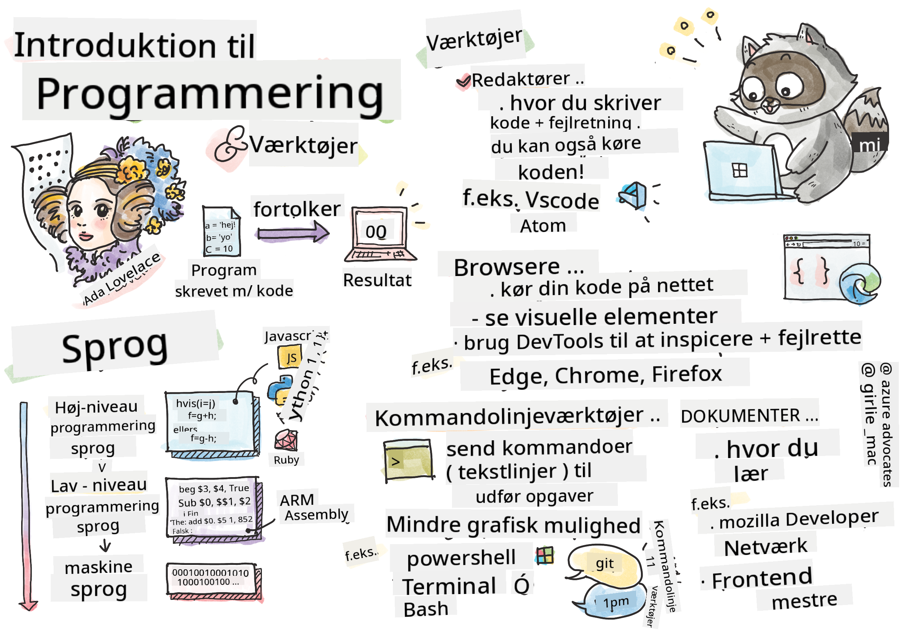

<!--
CO_OP_TRANSLATOR_METADATA:
{
  "original_hash": "2dcbb9259dee4f20a4f08d9a1aa2bd4c",
  "translation_date": "2025-08-29T08:22:39+00:00",
  "source_file": "1-getting-started-lessons/1-intro-to-programming-languages/README.md",
  "language_code": "da"
}
-->
# Introduktion til programmeringssprog og værktøjer

Denne lektion dækker grundlæggende programmeringssprog. Emnerne her gælder for de fleste moderne programmeringssprog i dag. I afsnittet 'Værktøjer' lærer du om nyttig software, der hjælper dig som udvikler.


> Sketchnote af [Tomomi Imura](https://twitter.com/girlie_mac)

## Quiz før lektionen
[Quiz før lektionen](https://forms.office.com/r/dru4TE0U9n?origin=lprLink)

## Introduktion

I denne lektion vil vi dække:

- Hvad er programmering?
- Typer af programmeringssprog
- Grundlæggende elementer i et program
- Nyttig software og værktøjer for den professionelle udvikler

> Du kan tage denne lektion på [Microsoft Learn](https://docs.microsoft.com/learn/modules/web-development-101/introduction-programming/?WT.mc_id=academic-77807-sagibbon)!

## Hvad er programmering?

Programmering (også kendt som kodning) er processen med at skrive instruktioner til en enhed som en computer eller mobil enhed. Vi skriver disse instruktioner med et programmeringssprog, som derefter bliver fortolket af enheden. Disse sæt af instruktioner kan kaldes forskellige ting, men *program*, *computerprogram*, *applikation (app)* og *eksekverbar fil* er nogle populære navne.

Et *program* kan være alt, der er skrevet med kode; hjemmesider, spil og telefonapps er programmer. Selvom det er muligt at skabe et program uden at skrive kode, bliver den underliggende logik fortolket af enheden, og den logik er sandsynligvis skrevet med kode. Et program, der *kører* eller *eksekverer* kode, udfører instruktioner. Enheden, du læser denne lektion på, kører et program for at vise den på din skærm.

✅ Lav lidt research: Hvem anses for at være verdens første computerprogrammør?

## Programmeringssprog

Programmeringssprog gør det muligt for udviklere at skrive instruktioner til en enhed. Enheder kan kun forstå binær (1'er og 0'er), og for *de fleste* udviklere er det ikke en særlig effektiv måde at kommunikere på. Programmeringssprog er køretøjet for kommunikation mellem mennesker og computere.

Programmeringssprog findes i forskellige formater og kan tjene forskellige formål. For eksempel bruges JavaScript primært til webapplikationer, mens Bash primært bruges til operativsystemer.

*Lav-niveau sprog* kræver typisk færre trin end *høj-niveau sprog* for en enhed at fortolke instruktioner. Men det, der gør høj-niveau sprog populære, er deres læsbarhed og support. JavaScript anses for at være et høj-niveau sprog.

Følgende kode illustrerer forskellen mellem et høj-niveau sprog med JavaScript og et lav-niveau sprog med ARM assembly kode.

```javascript
let number = 10
let n1 = 0, n2 = 1, nextTerm;

for (let i = 1; i <= number; i++) {
    console.log(n1);
    nextTerm = n1 + n2;
    n1 = n2;
    n2 = nextTerm;
}
```

```c
 area ascen,code,readonly
 entry
 code32
 adr r0,thumb+1
 bx r0
 code16
thumb
 mov r0,#00
 sub r0,r0,#01
 mov r1,#01
 mov r4,#10
 ldr r2,=0x40000000
back add r0,r1
 str r0,[r2]
 add r2,#04
 mov r3,r0
 mov r0,r1
 mov r1,r3
 sub r4,#01
 cmp r4,#00
 bne back
 end
```

Tro det eller ej, *de gør begge det samme*: udskriver en Fibonacci-sekvens op til 10.

✅ En Fibonacci-sekvens er [defineret](https://en.wikipedia.org/wiki/Fibonacci_number) som en række tal, hvor hvert tal er summen af de to foregående, startende fra 0 og 1. De første 10 tal i Fibonacci-sekvensen er 0, 1, 1, 2, 3, 5, 8, 13, 21 og 34.

## Elementer i et program

En enkelt instruktion i et program kaldes en *statement* og vil normalt have et tegn eller en linjeafstand, der markerer, hvor instruktionen slutter, eller *terminerer*. Hvordan et program terminerer varierer med hvert sprog.

Statements i et program kan afhænge af data, der leveres af en bruger eller andetsteds, for at udføre instruktioner. Data kan ændre, hvordan et program opfører sig, så programmeringssprog kommer med en måde at midlertidigt gemme data, så det kan bruges senere. Disse kaldes *variabler*. Variabler er statements, der instruerer en enhed til at gemme data i sin hukommelse. Variabler i programmer ligner variabler i algebra, hvor de har et unikt navn, og deres værdi kan ændre sig over tid.

Der er en chance for, at nogle statements ikke bliver eksekveret af en enhed. Dette er normalt med vilje, når det er skrevet af udvikleren, eller ved et uheld, når en uventet fejl opstår. Denne type kontrol over en applikation gør den mere robust og vedligeholdelsesvenlig. Typisk sker disse ændringer i kontrol, når visse betingelser er opfyldt. En almindelig statement, der bruges i moderne programmering til at kontrollere, hvordan et program kører, er `if..else` statement.

✅ Du vil lære mere om denne type statement i efterfølgende lektioner.

## Værktøjer

[](https://youtube.com/watch?v=69WJeXGBdxg "Værktøjer")

> 🎥 Klik på billedet ovenfor for en video om værktøjer

I dette afsnit lærer du om noget software, som du måske finder meget nyttigt, når du begynder din professionelle udviklingsrejse.

Et **udviklingsmiljø** er et unikt sæt af værktøjer og funktioner, som en udvikler ofte bruger, når de skriver software. Nogle af disse værktøjer er blevet tilpasset til en udviklers specifikke behov og kan ændre sig over tid, hvis den udvikler ændrer prioriteter i arbejde, personlige projekter eller når de bruger et andet programmeringssprog. Udviklingsmiljøer er lige så unikke som de udviklere, der bruger dem.

### Editorer

Et af de mest afgørende værktøjer til softwareudvikling er editoren. Editorer er, hvor du skriver din kode og nogle gange, hvor du kører din kode.

Udviklere stoler på editorer af flere grunde:

- *Debugging* hjælper med at finde fejl og problemer ved at gennemgå koden linje for linje. Nogle editorer har debugging-funktioner; de kan tilpasses og tilføjes til specifikke programmeringssprog.
- *Syntax highlighting* tilføjer farver og tekstformatering til kode, hvilket gør det lettere at læse. De fleste editorer tillader tilpasset syntax highlighting.
- *Extensions og integrationer* er specialiserede værktøjer for udviklere, lavet af udviklere. Disse værktøjer var ikke indbygget i den grundlæggende editor. For eksempel dokumenterer mange udviklere deres kode for at forklare, hvordan den fungerer. De kan installere en stavekontrol-udvidelse for at finde stavefejl i dokumentationen. De fleste udvidelser er beregnet til brug inden for en specifik editor, og de fleste editorer kommer med en måde at søge efter tilgængelige udvidelser.
- *Tilpasning* gør det muligt for udviklere at skabe et unikt udviklingsmiljø, der passer til deres behov. De fleste editorer er ekstremt tilpasselige og kan også give udviklere mulighed for at skabe egne udvidelser.

#### Populære editorer og webudviklingsudvidelser

- [Visual Studio Code](https://code.visualstudio.com/?WT.mc_id=academic-77807-sagibbon)
  - [Code Spell Checker](https://marketplace.visualstudio.com/items?itemName=streetsidesoftware.code-spell-checker)
  - [Live Share](https://marketplace.visualstudio.com/items?itemName=MS-vsliveshare.vsliveshare)
  - [Prettier - Code formatter](https://marketplace.visualstudio.com/items?itemName=esbenp.prettier-vscode)
- [Atom](https://atom.io/)
  - [spell-check](https://atom.io/packages/spell-check)
  - [teletype](https://atom.io/packages/teletype)
  - [atom-beautify](https://atom.io/packages/atom-beautify)
  
- [Sublimetext](https://www.sublimetext.com/)
  - [emmet](https://emmet.io/)
  - [SublimeLinter](http://www.sublimelinter.com/en/stable/)

### Browsere

Et andet afgørende værktøj er browseren. Webudviklere stoler på browseren for at se, hvordan deres kode kører på nettet. Den bruges også til at vise de visuelle elementer på en webside, der er skrevet i editoren, som HTML.

Mange browsere kommer med *udviklerværktøjer* (DevTools), der indeholder et sæt nyttige funktioner og informationer til at hjælpe udviklere med at indsamle og fange vigtig information om deres applikation. For eksempel: Hvis en webside har fejl, kan det nogle gange være nyttigt at vide, hvornår de opstod. DevTools i en browser kan konfigureres til at fange denne information.

#### Populære browsere og DevTools

- [Edge](https://docs.microsoft.com/microsoft-edge/devtools-guide-chromium/?WT.mc_id=academic-77807-sagibbon)
- [Chrome](https://developers.google.com/web/tools/chrome-devtools/)
- [Firefox](https://developer.mozilla.org/docs/Tools)

### Kommandolinjeværktøjer

Nogle udviklere foretrækker en mindre grafisk visning til deres daglige opgaver og stoler på kommandolinjen for at opnå dette. At skrive kode kræver en betydelig mængde tastning, og nogle udviklere foretrækker ikke at forstyrre deres flow på tastaturet. De vil bruge tastaturgenveje til at skifte mellem desktopvinduer, arbejde på forskellige filer og bruge værktøjer. De fleste opgaver kan udføres med en mus, men en fordel ved at bruge kommandolinjen er, at meget kan gøres med kommandolinjeværktøjer uden behov for at skifte mellem mus og tastatur. En anden fordel ved kommandolinjen er, at den kan konfigureres, og du kan gemme en brugerdefineret konfiguration, ændre den senere og importere den til andre udviklingsmaskiner. Fordi udviklingsmiljøer er så unikke for hver udvikler, vil nogle undgå at bruge kommandolinjen, nogle vil stole helt på den, og nogle foretrækker en blanding af de to.

### Populære kommandolinjevalg

Valg for kommandolinjen vil variere afhængigt af det operativsystem, du bruger.

*💻 = kommer forudinstalleret på operativsystemet.*

#### Windows

- [Powershell](https://docs.microsoft.com/powershell/scripting/overview?view=powershell-7/?WT.mc_id=academic-77807-sagibbon) 💻
- [Kommandolinje](https://docs.microsoft.com/windows-server/administration/windows-commands/windows-commands/?WT.mc_id=academic-77807-sagibbon) (også kendt som CMD) 💻
- [Windows Terminal](https://docs.microsoft.com/windows/terminal/?WT.mc_id=academic-77807-sagibbon)
- [mintty](https://mintty.github.io/)
  
#### MacOS

- [Terminal](https://support.apple.com/guide/terminal/open-or-quit-terminal-apd5265185d-f365-44cb-8b09-71a064a42125/mac) 💻
- [iTerm](https://iterm2.com/)
- [Powershell](https://docs.microsoft.com/powershell/scripting/install/installing-powershell-core-on-macos?view=powershell-7/?WT.mc_id=academic-77807-sagibbon)

#### Linux

- [Bash](https://www.gnu.org/software/bash/manual/html_node/index.html) 💻
- [KDE Konsole](https://docs.kde.org/trunk5/en/konsole/konsole/index.html)
- [Powershell](https://docs.microsoft.com/powershell/scripting/install/installing-powershell-core-on-linux?view=powershell-7/?WT.mc_id=academic-77807-sagibbon)

#### Populære kommandolinjeværktøjer

- [Git](https://git-scm.com/) (💻 på de fleste operativsystemer)
- [NPM](https://www.npmjs.com/)
- [Yarn](https://classic.yarnpkg.com/en/docs/cli/)

### Dokumentation

Når en udvikler ønsker at lære noget nyt, vil de sandsynligvis vende sig mod dokumentation for at lære, hvordan man bruger det. Udviklere stoler ofte på dokumentation for at guide dem gennem, hvordan man bruger værktøjer og sprog korrekt, og også for at få dybere viden om, hvordan det fungerer.

#### Populær dokumentation om webudvikling

- [Mozilla Developer Network (MDN)](https://developer.mozilla.org/docs/Web), fra Mozilla, udgiverne af [Firefox](https://www.mozilla.org/firefox/) browseren
- [Frontend Masters](https://frontendmasters.com/learn/)
- [Web.dev](https://web.dev), fra Google, udgiverne af [Chrome](https://www.google.com/chrome/)
- [Microsofts egne udviklerdokumenter](https://docs.microsoft.com/microsoft-edge/#microsoft-edge-for-developers), for [Microsoft Edge](https://www.microsoft.com/edge)
- [W3 Schools](https://www.w3schools.com/where_to_start.asp)

✅ Lav lidt research: Nu hvor du kender det grundlæggende i en webudviklers miljø, sammenlign det med en webdesigners miljø.

---

## 🚀 Udfordring

Sammenlign nogle programmeringssprog. Hvad er nogle af de unikke træk ved JavaScript vs. Java? Hvad med COBOL vs. Go?

## Quiz efter lektionen
[Quiz efter lektionen](https://ff-quizzes.netlify.app/web/)

## Gennemgang & Selvstudie

Undersøg lidt om de forskellige sprog, der er tilgængelige for programmøren. Prøv at skrive en linje i ét sprog og derefter omskrive den i to andre. Hvad lærte du?

## Opgave

[Læse dokumentationen](assignment.md)

---

**Ansvarsfraskrivelse**:  
Dette dokument er blevet oversat ved hjælp af AI-oversættelsestjenesten [Co-op Translator](https://github.com/Azure/co-op-translator). Selvom vi bestræber os på nøjagtighed, skal du være opmærksom på, at automatiserede oversættelser kan indeholde fejl eller unøjagtigheder. Det originale dokument på dets oprindelige sprog bør betragtes som den autoritative kilde. For kritisk information anbefales professionel menneskelig oversættelse. Vi påtager os intet ansvar for misforståelser eller fejltolkninger, der måtte opstå som følge af brugen af denne oversættelse.