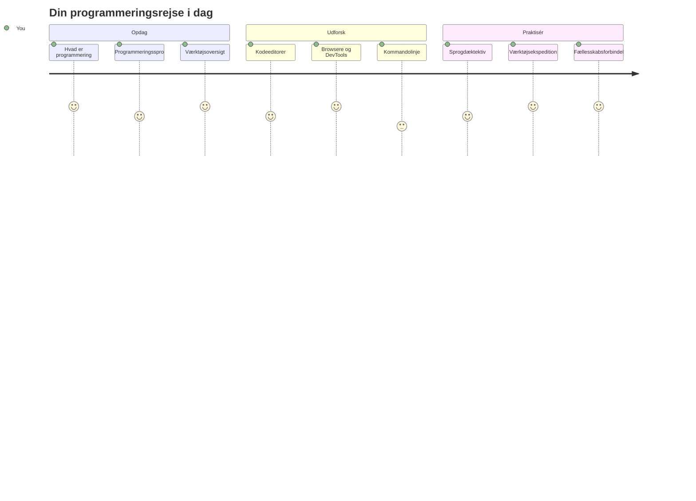
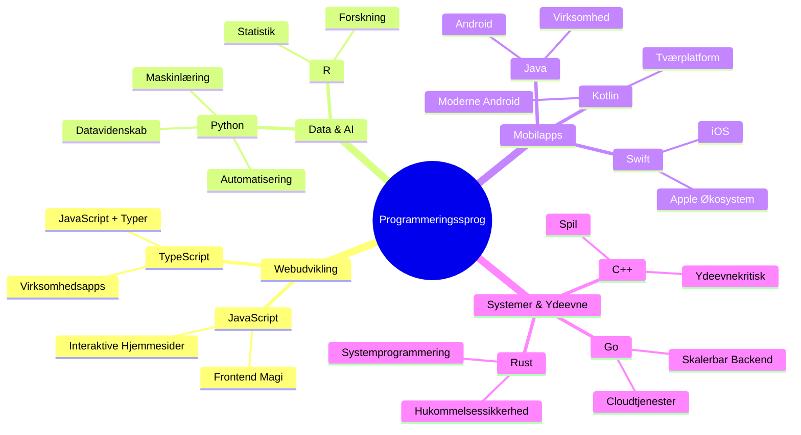
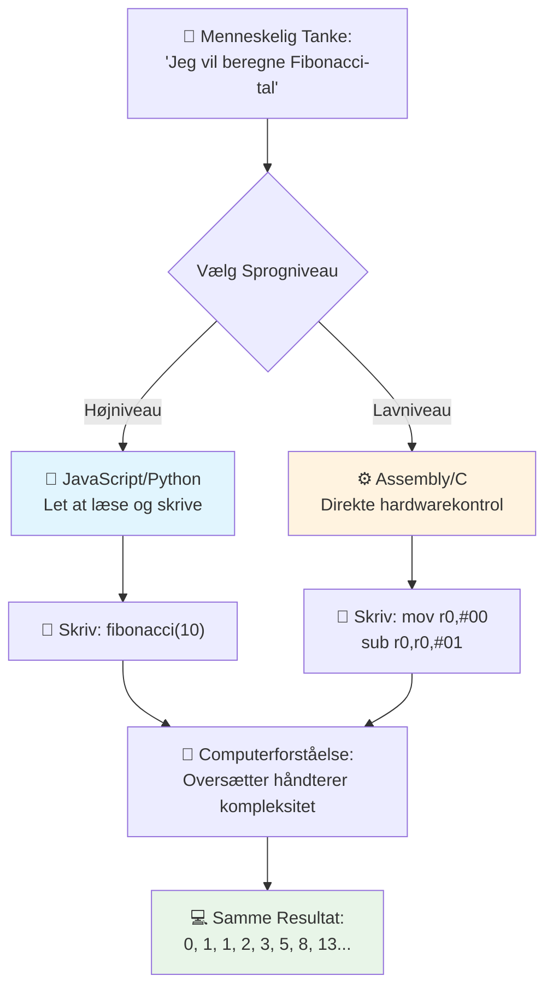
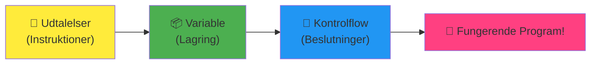
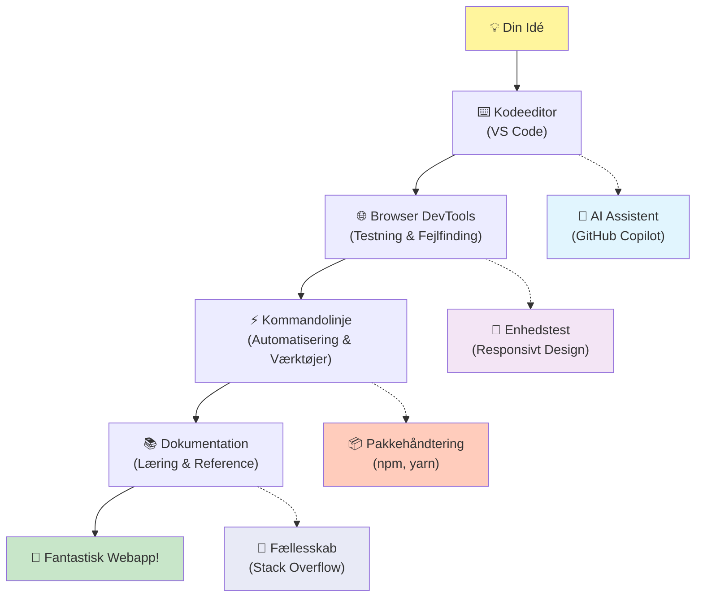
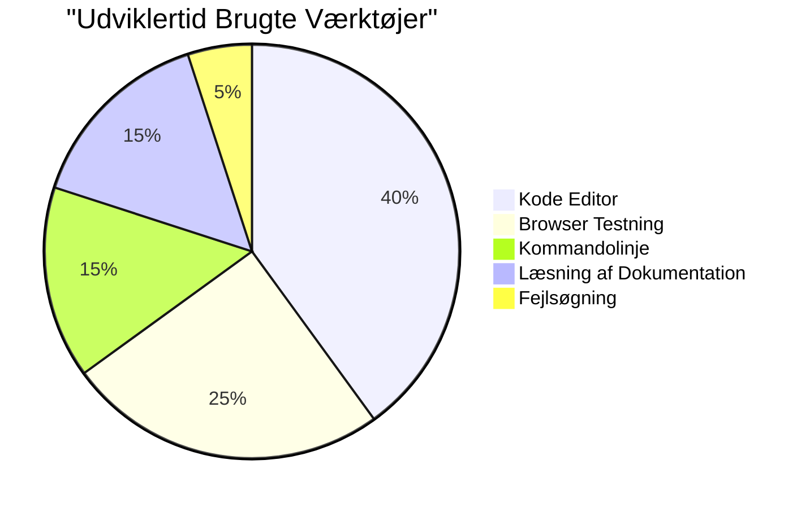
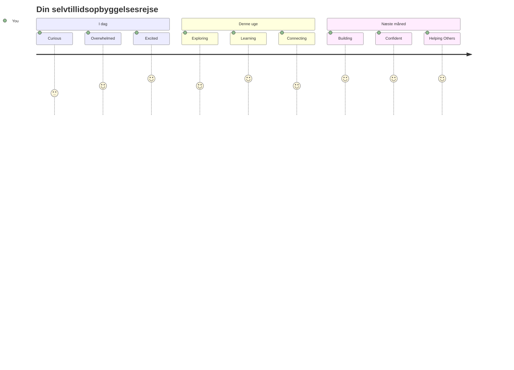

# Introduktion til Programmeringssprog og Moderne Udviklerværktøjer

Hej der, kommende udvikler! 👋 Må jeg fortælle dig noget, der stadig giver mig gåsehud hver eneste dag? Du er ved at opdage, at programmering ikke kun handler om computere – det handler om at have faktiske superkræfter til at bringe dine vildeste idéer til live!

Du kender det øjeblik, hvor du bruger din yndlingsapp, og alt bare passer perfekt sammen? Når du trykker på en knap, og der sker noget helt magisk, som får dig til at tænke "wow, hvordan gjorde de DET?" Nå, nogen lige som dig – sandsynligvis siddende i deres yndlingscafé kl. 2 om natten med deres tredje espresso – har skrevet den kode, der skabte den magi. Og her er det, der kommer til at blæse dit sind: ved slutningen af denne lektion vil du ikke kun forstå, hvordan de gjorde det, men du vil være ivrig efter at prøve det selv!

Se, jeg forstår fuldt ud, hvis programmering føles skræmmende lige nu. Da jeg startede, troede jeg ærligt talt, at man skulle være en slags matematisk geni eller have kodet siden man var fem år gammel. Men her er hvad der helt ændrede mit perspektiv: programmering er præcis som at lære at føre samtaler på et nyt sprog. Du starter med "hej" og "tak," så arbejder du dig op til at bestille kaffe, og før du ved af det, har du dybe filosofiske samtaler! Men i dette tilfælde fører du samtaler med computere, og ærligt? De er de mest tålmodige samtalepartnere, du nogensinde vil møde – de dømmer aldrig dine fejl, og de er altid spændte på at prøve igen!

I dag skal vi udforske de utrolige værktøjer, der gør moderne webudvikling ikke bare mulig, men seriøst vanedannende. Jeg taler om de præcis samme editorer, browsere og arbejdsprocesser, som udviklere hos Netflix, Spotify og dit yndlings indie app-studie bruger hver eneste dag. Og her kommer det, der får dig til at danse af glæde: de fleste af disse professionelle og industristandard værktøjer er helt gratis!


> Sketchnote af [Tomomi Imura](https://twitter.com/girlie_mac)


```mermaid
journey
    title Din programmeringsrejse i dag
    section Opdag
      Hvad er programmering: 5: You
      Programmeringssprog: 4: You
      Værktøjsoversigt: 5: You
    section Udforsk
      Kodeeditorer: 4: You
      Browsere og DevTools: 5: You
      Kommandolinje: 3: You
    section Praktisér
      Sprogdæktektiv: 4: You
      Værktøjsekspedition: 5: You
      Fællesskabsforbindelse: 5: You
```
## Lad Os Se, Hvad Du Allerede Véd!

Før vi hopper ind i det sjove, er jeg nysgerrig – hvad ved du allerede om denne programmeringsverden? Og hør, hvis du kigger på disse spørgsmål og tænker "jeg har bogstaveligt talt ikke en skid styr på det," så er det ikke bare okay, det er perfekt! Det betyder, at du er præcis det rigtige sted. Tænk på denne quiz som at strække ud før en træning – vi varmer bare de hjerne muskler op!

[Tag for-vejledningen quizzen](https://ff-quizzes.netlify.app/web/)


## Det Eventyr, Vi Skal På Sammen

Okay, jeg hopper virkelig op og ned af spænding over, hvad vi skal udforske i dag! Seriøst, jeg ville ønske, jeg kunne se dit ansigt, når nogle af disse koncepter klikker. Her er den utrolige rejse, vi tager sammen:

- **Hvad programmering egentlig er (og hvorfor det er det sejeste nogensinde!)** – Vi skal opdage, hvordan kode er den usynlige magi, der driver alt omkring dig, fra alarmen, der på en eller anden måde ved, det er mandag morgen, til algoritmen, der perfekt kuraterer dine Netflix-anbefalinger
- **Programmeringssprog og deres fantastiske personligheder** – Forestil dig at gå til en fest, hvor hver person har helt forskellige superkræfter og måder at løse problemer på. Det er sådan programmeringssprogverdenen er, og du kommer til at elske at møde dem!
- **De grundlæggende byggesten, der får digital magi til at ske** – Tænk på disse som det ultimative kreative LEGO-sæt. Når du forstår, hvordan disse stykker passer sammen, vil du indse, at du bogstaveligt talt kan bygge alt, hvad din fantasi drømmer om
- **Professionelle værktøjer, der får dig til at føle, at du lige har fået en troldmandsstav** – Jeg er ikke dramatisk her – disse værktøjer vil ægte få dig til at føle, at du har superkræfter, og det bedste af det hele? Det er de samme, som de professionelle bruger!

> 💡 **Her er sagen**: Tænk ikke engang på at prøve at huske alt i dag! Lige nu vil jeg bare have dig til at føle den gnist af spænding over, hvad der er muligt. Detaljerne vil naturligt sætte sig fast, når vi øver os sammen – sådan sker ægte læring!

> Du kan tage denne lektion på [Microsoft Learn](https://learn.microsoft.com/en-us/learn/modules/web-development-101/introduction-programming/?WT.mc_id=academic-77807-sagibbon)!

## Så Hvad Er Programmering *Egentligt*?

Okay, lad os tackle million-dollars-spørgsmålet: hvad er programmering egentlig?

Jeg vil give dig en historie, der helt ændrede, hvordan jeg tænker om det her. I sidste uge prøvede jeg at forklare min mor, hvordan man bruger vores nye smart TV-fjernbetjening. Jeg fangede mig selv i at sige ting som "Tryk på den røde knap, men ikke den store røde knap, den lille røde knap til venstre... nej, din anden venstre... okay, hold den nu i to sekunder, ikke ét, ikke tre..." Lyder det bekendt? 😅

Det er programmering! Det er kunsten at give utrolig detaljerede, trin-for-trin instruktioner til noget, der er meget kraftfuldt, men som har brug for alt stavet helt ud. Men i stedet for at forklare det til din mor (som kan spørge "hvilken rød knap?!"), forklarer du det til en computer (som bare gør præcis, hvad du siger, selvom det, du sagde, ikke helt er det, du mente).

Her er, hvad der blæste mit sind, da jeg først lærte det: computere er faktisk ret simple i deres kerne. De forstår bogstaveligt talt kun to ting – 1 og 0, som grundlæggende bare betyder "ja" og "nej" eller "tændt" og "slukket." Det er det! Men her bliver det magisk – vi behøver ikke tale i 1'ere og 0'ere, som om vi er i The Matrix. Det er her, **programmeringssprogene** kommer til undsætning. De er som verdens bedste oversætter, der tager dine helt normale, menneskelige tanker og omdanner dem til computersprog.

Og her er, hvad der stadig giver mig ægte gåsehud hver morgen, når jeg vågner: bogstaveligt talt *alt* digitalt i dit liv startede med nogen lige som dig, sandsynligvis siddende i deres pyjamas med en kop kaffe, der skrev kode på deres laptop. Det Instagram-filter, der får dig til at se fejlfri ud? Nogen kodede det. Anbefalingen, der førte dig til din nye yndlingssang? En udvikler byggede den algoritme. Appen, der hjælper dig med at dele restaurantregningen med venner? Jep, nogen tænkte "det her er irriterende, det kan jeg da fikse," og så... gjorde de det!

Når du lærer at programmere, tager du ikke bare en ny færdighed op – du bliver en del af dette utrolige fællesskab af problemløsere, der bruger deres dage på at tænke, "Hvad hvis jeg kunne bygge noget, der gør en andens dag bare lidt bedre?" Ærligt talt, findes der noget sejere end det?

✅ **Sjov Faktajagt**: Her er noget super fedt at undersøge, når du har et øjeblik i overskud – hvem tror du var verdens første computerprogrammerer? Jeg giver dig et hint: det er måske ikke den, du forventer! Historien bag denne person er helt fascinerende og viser, at programmering altid har handlet om kreativ problemløsning og at tænke ud af boksen.

### 🧠 **Tid Til Check-in: Hvordan Har Du Det?**

**Tag et øjeblik til at reflektere:**
- Giver idéen om "at give instruktioner til computere" mening for dig nu?
- Kan du tænke på en daglig opgave, du gerne vil automatisere med programmering?
- Hvilke spørgsmål bobler op i dit hoved omkring det her med programmering?

> **Husk**: Det er helt normalt, hvis nogle koncepter føles lidt uklare lige nu. At lære programmering er som at lære et nyt sprog – det tager tid for din hjerne at bygge de neurale stier. Du gør det rigtig godt!

## Programmeringssprog Er Som Forskellige Smagsvarianter af Magi

Okay, det her kommer til at lyde mærkeligt, men følg med – programmeringssprog er meget lig forskellige slags musik. Tænk over det: du har jazz, som er smooth og improvisatorisk, rock der er kraftfuld og ligetil, klassisk der er elegant og struktureret, og hip-hop der er kreativ og udtryksfuld. Hver stil har sin egen vibe, sine egne passionerede fans, og hver enkelt er perfekt til forskellige stemninger og lejligheder.

Programmeringssprog fungerer præcis på samme måde! Du ville ikke bruge det samme sprog til at bygge et sjovt mobilspil, som du ville bruge til at behandle enorme mængder klimadata, ligesom du ikke ville spille death metal til yoga (nå, i de fleste yogaklasser alligevel! 😄).

Men her er hvad der blæser mit sind hver gang, jeg tænker på det: disse sprog er som at have verdens mest tålmodige, strålende tolk siddende lige ved siden af dig. Du kan udtrykke dine idéer på en måde, der føles naturlig for din menneskehjerne, og de klarer alt det utroligt komplekse arbejde med at oversætte det til de 1'ere og 0'er, computere rent faktisk taler. Det er som at have en ven, der er perfekt flydende i både "menneskelig kreativitet" og "computerlogik" – og de bliver aldrig trætte, har aldrig brug for kaffepauser og dømmer dig aldrig for at stille samme spørgsmål to gange!

### Populære Programmeringssprog og Deres Anvendelser


```mermaid
mindmap
  root((Programmeringssprog))
    Webudvikling
      JavaScript
        Frontend Magi
        Interaktive Hjemmesider
      TypeScript
        JavaScript + Typer
        Virksomhedsapps
    Data & AI
      Python
        Datavidenskab
        Maskinlæring
        Automatisering
      R
        Statistik
        Forskning
    Mobilapps
      Java
        Android
        Virksomhed
      Swift
        iOS
        Apple Økosystem
      Kotlin
        Moderne Android
        Tværplatform
    Systemer & Ydeevne
      C++
        Spil
        Ydeevnekritisk
      Rust
        Hukommelsessikkerhed
        Systemprogrammering
      Go
        Cloudtjenester
        Skalerbar Backend
```
| Language | Bedst til | Hvorfor det er populært |
|----------|-----------|------------------------|
| **JavaScript** | Webudvikling, brugergrænseflader | Kører i browsere og driver interaktive websites |
| **Python** | Data science, automatisering, AI | Nem at læse og lære, kraftfulde biblioteker |
| **Java** | Enterprise-applikationer, Android apps | Plattformuafhængig, robust til store systemer |
| **C#** | Windows-applikationer, spiludvikling | Stærk Microsoft-økosystem support |
| **Go** | Cloud-tjenester, backend-systemer | Hurtig, enkel, designet til moderne computing |

### Høj-niveau vs. Lav-niveau Sprog

Okay, det her var ærligt talt det koncept, der brød min hjerne, da jeg først begyndte at lære, så jeg vil dele den analogi, der endelig fik det til at klikke for mig – og jeg håber virkelig, den hjælper dig også!

Forestil dig, at du besøger et land, hvor du ikke taler sproget, og du desperat skal finde det nærmeste toilet (vi har alle været der, ikke? 😅):

- **Lav-niveau programmering** er som at lære den lokale dialekt så godt, at du kan snakke med bedstemor, der sælger frugt på hjørnet, med kulturelle reference, lokal slang og interne jokes, som kun nogen, der er vokset op der, forstår. Super imponerende og utroligt effektivt... hvis du tilfældigvis er flydende! Men ret overvældende, når du bare prøver at finde et toilet.

- **Høj-niveau programmering** er som at have den fantastiske lokale ven, der bare forstår dig. Du kan sige "jeg skal virkelig finde et toilet" på almindeligt engelsk, og de klarer al kulturel oversættelse og giver dig anvisninger på en måde, der giver perfekt mening for din ikke-lokale hjerne.

I programmeringsterm:
- **Lav-niveau sprog** (som Assembly eller C) lader dig have utroligt detaljerede samtaler med computerens egentlige hardware, men du skal tænke som en maskine, hvilket er... lad os bare sige, det er et stort mentalt skifte!
- **Høj-niveau sprog** (som JavaScript, Python eller C#) lader dig tænke som et menneske, mens de håndterer alt maskin-sproget bag kulisserne. Plus, de har de her utroligt imødekommende fællesskaber fulde af mennesker, der husker, hvordan det var at være ny og virkelig gerne vil hjælpe!

Gæt hvilke jeg vil foreslå, du starter med? 😉 Høj-niveau sprog er som at have støttehjul på cyklen, som du egentlig aldrig vil fjerne, fordi de gør hele oplevelsen så meget sjovere!


```mermaid
flowchart TB
    A["👤 Menneskelig Tanke:<br/>'Jeg vil beregne Fibonacci-tal'"] --> B{Vælg Sprogniveau}
    
    B -->|Højniveau| C["🌟 JavaScript/Python<br/>Let at læse og skrive"]
    B -->|Lavniveau| D["⚙️ Assembly/C<br/>Direkte hardwarekontrol"]
    
    C --> E["📝 Skriv: fibonacci(10)"]
    D --> F["📝 Skriv: mov r0,#00<br/>sub r0,r0,#01"]
    
    E --> G["🤖 Computerforståelse:<br/>Oversætter håndterer kompleksitet"]
    F --> G
    
    G --> H["💻 Samme Resultat:<br/>0, 1, 1, 2, 3, 5, 8, 13..."]
    
    style C fill:#e1f5fe
    style D fill:#fff3e0
    style H fill:#e8f5e8
```
### Lad Mig Vise Dig, Hvorfor Høj-niveau Sprog Er Meget Venligere

Okay, jeg er ved at vise dig noget, der perfekt demonstrerer, hvorfor jeg forelskede mig i høj-niveau sprog, men først – jeg har brug for, at du lover mig noget. Når du ser det første kodeeksempel, så få ikke panik! Det er meningen, det skal se skræmmende ud. Det er præcis det punkt, jeg prøver at gøre!

Vi skal kigge på den helt samme opgave skrevet i to helt forskellige stilarter. Begge laver det, der kaldes Fibonacci-sekvensen – det er et smukt matematisk mønster, hvor hvert tal er summen af de to foregående: 0, 1, 1, 2, 3, 5, 8, 13... (Sjov fakta: du finder dette mønster overalt i naturen – solsikkekernernes spiral, koglernes mønstre, endda hvordan galakser dannes!)

Klar til at se forskellen? Lad os gå i gang!

**Høj-niveau sprog (JavaScript) – Menneskevenligt:**

```javascript
// Trin 1: Grundlæggende Fibonacci-opsætning
const fibonacciCount = 10;
let current = 0;
let next = 1;

console.log('Fibonacci sequence:');
```

**Her er, hvad denne kode gør:**
- **Deklarerer** en konstant for at angive, hvor mange Fibonacci-tal vi vil generere
- **Initierer** to variable til at spore det nuværende og næste tal i sekvensen
- **Sætter op** startværdierne (0 og 1), som definerer Fibonacci-mønsteret
- **Viser** en overskriftsbesked for at identificere vores output

```javascript
// Trin 2: Generer sekvensen med en løkke
for (let i = 0; i < fibonacciCount; i++) {
  console.log(`Position ${i + 1}: ${current}`);
  
  // Beregn næste tal i sekvensen
  const sum = current + next;
  current = next;
  next = sum;
}
```

**Her bryder vi ned, hvad der sker:**
- **Looper** gennem hver position i vores sekvens med en `for` løkke
- **Viser** hvert tal med dets position ved hjælp af template literal formatering
- **Beregner** det næste Fibonacci-tal ved at lægge nuværende og næste værdier sammen
- **Opdaterer** vores sporevariable for at gå videre til næste iteration

```javascript
// Trin 3: Moderne funktionel tilgang
const generateFibonacci = (count) => {
  const sequence = [0, 1];
  
  for (let i = 2; i < count; i++) {
    sequence[i] = sequence[i - 1] + sequence[i - 2];
  }
  
  return sequence;
};

// Brugs eksempel
const fibSequence = generateFibonacci(10);
console.log(fibSequence);
```

**I ovenstående har vi:**
- **Oprettet** en genanvendelig funktion med moderne arrow-funktions syntaks
- **Bygget** et array til at gemme den komplette sekvens i stedet for at vise et ad gangen
- **Brugt** array-indeksering til at beregne hvert nyt tal ud fra tidligere værdier
- **Returneret** den komplette sekvens for fleksibel brug i andre dele af vores program

**Lav-niveau sprog (ARM Assembly) – Computer-venligt:**

```assembly
 area ascen,code,readonly
 entry
 code32
 adr r0,thumb+1
 bx r0
 code16
thumb
 mov r0,#00
 sub r0,r0,#01
 mov r1,#01
 mov r4,#10
 ldr r2,=0x40000000
back add r0,r1
 str r0,[r2]
 add r2,#04
 mov r3,r0
 mov r0,r1
 mov r1,r3
 sub r4,#01
 cmp r4,#00
 bne back
 end
```

Bemærk, hvordan JavaScript-versionen læser næsten som engelske instruktioner, mens Assembly-versionen bruger kryptiske kommandoer, der direkte styrer computerens processor. Begge klarer den helt samme opgave, men høj-niveau sproget er meget lettere for mennesker at forstå, skrive og vedligeholde.

**Vigtige forskelle, du vil bemærke:**
- **Læsbarhed**: JavaScript bruger beskrivende navne som `fibonacciCount`, mens Assembly bruger kryptiske mærker som `r0`, `r1`
- **Kommentarer**: Høj-niveau sprog opfordrer til forklarende kommentarer, der gør koden selvforklarende
- **Struktur**: JavaScripts logiske flow matcher, hvordan mennesker tænker over problemer trin for trin
- **Vedligeholdelse**: Opdatering af JavaScript-versionen til forskellige krav er ligetil og tydelig

✅ **Om Fibonacci-sekvensen**: Dette helt utroligt smukke talmønster (hvor hvert tal er summen af de to forudgående: 0, 1, 1, 2, 3, 5, 8...) dukker bogstaveligt talt *overalt* op i naturen! Du finder det i solsikkespiraler, mønstre på fyrrekogler, hvordan nautilusskaller krummer, og endda i, hvordan trægrene vokser. Det er ret tankevækkende, hvordan matematik og kode kan hjælpe os med at forstå og genskabe de mønstre, som naturen bruger til at skabe skønhed!


## Byggestenene Der Får Magien Til At Sker

Okay, nu hvor du har set, hvordan programmeringssprog ser ud i praksis, lad os bryde de grundlæggende stykker ned, der udgør bogstaveligt talt ethvert program, der nogensinde er skrevet. Tænk på disse som de essentielle ingredienser i din yndlingsopskrift – når du først forstår, hvad hver enkelt gør, vil du kunne læse og skrive kode i stort set ethvert sprog!

Det er lidt som at lære programmets grammatik. Kan du huske i skolen, da du lærte om substantiver, verber og hvordan man sætter sætninger sammen? Programmering har sin egen version af grammatik, og ærligt talt er det meget mere logisk og tilgivende end engelsk grammatik nogensinde var! 😄

### Udsagn: Trin-for-Trin Instruktioner

Lad os starte med **udsagn** – de er som enkelte sætninger i en samtale med din computer. Hvert udsagn fortæller computeren at gøre én specifik ting, lidt som at give anvisninger: "Drej til venstre her," "Stop ved det røde lys," "Parkér på det sted."

Det jeg elsker ved udsagn, er hvor læsbare de som regel er. Se her:

```javascript
// Grundlæggende udsagn, der udfører enkelte handlinger
const userName = "Alex";                    
console.log("Hello, world!");              
const sum = 5 + 3;                         
```

**Her er, hvad denne kode gør:**
- **Deklarer** en konstant variabel til at gemme en brugers navn
- **Viser** en hilsen i konsoloutput
- **Beregner** og gemmer resultatet af en matematisk operation

```javascript
// Udtalelser, der interagerer med websteder
document.title = "My Awesome Website";      
document.body.style.backgroundColor = "lightblue";
```

**Trin for trin, er dette, der sker:**
- **Ændrer** websides titlen, som vises i browserfanen
- **Skifter** baggrundsfarven på hele sideindholdet

### Variabler: Dit Program's Hukommelsessystem

Okay, **variabler** er ærligt talt et af mine absolut yndlingsbegreber at undervise i, fordi de er så meget lig ting, du allerede bruger hver eneste dag!

Tænk på din telefons kontaktliste et øjeblik. Du husker ikke alles telefonnummer – i stedet gemmer du "Mor," "Bedste Ven," eller "Pizzariaet der leverer til kl. 2 om natten" og lader din telefon huske de faktiske numre. Variabler fungerer på nøjagtig samme måde! De er som mærkede beholdere, hvor dit program kan gemme information og hente den senere ved hjælp af et navn, der rent faktisk giver mening.

Det fede er: variabler kan ændre sig, mens dit program kører (deraf navnet "variabel" – kan du se, hvad de gjorde der?). Ligesom du måske opdaterer den pizzakontakt, når du finder et endnu bedre sted, kan variabler opdateres, mens dit program lærer nye ting, eller hvis situationer ændrer sig!

Lad mig vise dig, hvor smukt simpelt det kan være:

```javascript
// Trin 1: Oprettelse af grundlæggende variabler
const siteName = "Weather Dashboard";        
let currentWeather = "sunny";               
let temperature = 75;                       
let isRaining = false;                      
```

**Forstå disse koncepter:**
- **Gem** uforanderlige værdier i `const` variabler (som sidenavn)
- **Brug** `let` til værdier, der kan ændre sig gennem programmet
- **Tildel** forskellige datatyper: strenge (tekst), tal og booleans (sand/falsk)
- **Vælg** beskrivende navne, der forklarer, hvad hver variabel indeholder

```javascript
// Trin 2: Arbejde med objekter for at gruppere relaterede data
const weatherData = {                       
  location: "San Francisco",
  humidity: 65,
  windSpeed: 12
};
```

**Ovenfor har vi:**
- **Oprettet** et objekt til at gruppere relaterede vejrdata sammen
- **Organiseret** flere datapunkter under ét variabelnavn
- **Brugt** nøgle-værdi-par til klart at mærke hver bit info

```javascript
// Trin 3: Brug og opdatering af variabler
console.log(`${siteName}: Today is ${currentWeather} and ${temperature}°F`);
console.log(`Wind speed: ${weatherData.windSpeed} mph`);

// Opdatering af ændrbare variabler
currentWeather = "cloudy";                  
temperature = 68;                          
```

**Lad os forstå hver del:**
- **Vis** information med template literals med `${}` syntaks
- **Adgang** til objektets egenskaber med punktnotation (`weatherData.windSpeed`)
- **Opdater** variabler deklareret med `let` for at afspejle ændrende forhold
- **Kombiner** flere variabler for at skabe meningsfulde beskeder

```javascript
// Trin 4: Moderne destrukturering for renere kode
const { location, humidity } = weatherData; 
console.log(`${location} humidity: ${humidity}%`);
```

**Det du skal vide:**
- **Udpak** specifikke egenskaber fra objekter med destruktureringsopgave
- **Lav** nye variabler automatisk med samme navne som objektets nøgler
- **Forenkle** koden ved at undgå gentagen punktnotation

### Kontrolflow: Lær Dit Program At Tænke

Okay, her bliver programmering helt vildt fascinerende! **Kontrolflow** handler grundlæggende om at lære dit program at træffe smarte beslutninger, præcis som du gør hver eneste dag uden rigtig at tænke over det.

Forestil dig: i morges gik du sikkert igennem noget i stil med "Hvis det regner, tager jeg en paraply. Hvis det er koldt, tager jeg en jakke på. Hvis jeg er forsinket, springer jeg morgenmad over og køber kaffe på vejen." Din hjerne følger naturligt denne hvis-så logik dusinvis af gange dagligt!

Det er det, der får programmer til at føles intelligente og levende i stedet for bare at følge et kedeligt, forudsigeligt manuskript. De kan faktisk se på en situation, vurdere hvad der sker, og reagere passende. Det er som at give dit program en hjerne, der kan tilpasse sig og tage valg!

Vil du se, hvor smukt det fungerer? Lad mig vise dig:

```javascript
// Trin 1: Grundlæggende betinget logik
const userAge = 17;

if (userAge >= 18) {
  console.log("You can vote!");
} else {
  const yearsToWait = 18 - userAge;
  console.log(`You'll be able to vote in ${yearsToWait} year(s).`);
}
```

**Her er, hvad denne kode gør:**
- **Tjekker** om brugerens alder opfylder stemmeretten
- **Kører** forskellige kodeblokke afhængigt af betingelsens resultat
- **Beregner** og viser hvor længe, indtil stemmerettighed hvis under 18
- **Giver** specifik, nyttig feedback til hver situation

```javascript
// Trin 2: Flere betingelser med logiske operatorer
const userAge = 17;
const hasPermission = true;

if (userAge >= 18 && hasPermission) {
  console.log("Access granted: You can enter the venue.");
} else if (userAge >= 16) {
  console.log("You need parent permission to enter.");
} else {
  console.log("Sorry, you must be at least 16 years old.");
}
```

**Nedbrudt, hvad der sker her:**
- **Kombinerer** flere betingelser med operatoren `&&` (og)
- **Laver** et hierarki af betingelser med `else if` for flere scenarier
- **Håndterer** alle mulige tilfælde med en afsluttende `else` sætning
- **Giver** klart, handlingsrettet feedback til hver forskellig situation

```javascript
// Trin 3: Kortfattet betingelse med ternær operator
const votingStatus = userAge >= 18 ? "Can vote" : "Cannot vote yet";
console.log(`Status: ${votingStatus}`);
```

**Det du skal huske:**
- **Brug** den ternære operator (`? :`) til simple tovalgs-betingelser
- **Skriv** betingelsen først, efterfulgt af `?`, så sandt resultat, derefter `:`, så falsk resultat
- **Anvend** dette mønster når du skal tildele værdier baseret på betingelser

```javascript
// Trin 4: Håndtering af flere specifikke tilfælde
const dayOfWeek = "Tuesday";

switch (dayOfWeek) {
  case "Monday":
  case "Tuesday":
  case "Wednesday":
  case "Thursday":
  case "Friday":
    console.log("It's a weekday - time to work!");
    break;
  case "Saturday":
  case "Sunday":
    console.log("It's the weekend - time to relax!");
    break;
  default:
    console.log("Invalid day of the week");
}
```

**Denne kode gør følgende:**
- **Matcher** variabelværdi mod flere specifikke tilfælde
- **Grupperer** lignende tilfælde sammen (hverdag versus weekend)
- **Kører** den passende kodeblok, når der findes et match
- **Inkluderer** en `default` til at håndtere uventede værdier
- **Bruger** `break` sætninger til at forhindre kode i at fortsætte til næste tilfælde

> 💡 **Virkelighedsanalogien**: Tænk på kontrolflow som verdens mest tålmodige GPS, der giver dig rutevejledning. Den kan sige "Hvis der er trafik på Main Street, tag motorvejen i stedet. Hvis vejarbejde blokerer motorvejen, prøv den naturskønne rute." Programmer bruger netop den samme form for betinget logik til intelligent at reagere på forskellige situationer og altid give brugerne den bedst mulige oplevelse.

### 🎯 **Koncept Tjek: Byggestenernes Mesterskab**

**Lad os se, hvordan du klarer det med det grundlæggende:**
- Kan du forklare forskellen mellem en variabel og et udsagn med dine egne ord?
- Tænk på et virkeligt scenario, hvor du ville bruge en hvis-så beslutning (som vores stemmeeksempel)
- Hvad er en ting ved programmeringslogik, der overraskede dig?

**Hurtig selvtillidsboost:**

```mermaid
flowchart LR
    A["📝 Udtalelser<br/>(Instruktioner)"] --> B["📦 Variable<br/>(Lagring)"] --> C["🔀 Kontrolflow<br/>(Beslutninger)"] --> D["🎉 Fungerende Program!"]
    
    style A fill:#ffeb3b
    style B fill:#4caf50
    style C fill:#2196f3
    style D fill:#ff4081
```
✅ **Hvad der kommer næste:** Vi skal have det sjovt med at dykke endnu dybere ned i disse koncepter, mens vi fortsætter denne utrolige rejse sammen! Lige nu, fokuser bare på at mærke spændingen over alle de fantastiske muligheder foran dig. De specifikke færdigheder og teknikker vil falde naturligt på plads, når vi øver sammen – jeg lover, det bliver meget sjovere, end du måske forventer!

## Værktøjerne i Faget

Okay, her bliver jeg virkelig begejstret, jeg næsten kan dårligt holde mig! 🚀 Vi skal til at tale om de utrolige værktøjer, der kommer til at få dig til at føle, at du lige har fået nøglerne til et digitalt rumskib.

Du kender det med, at en kok har de der perfekt balancerede knive, der føles som en forlængelse af deres hænder? Eller hvordan en musiker har den ene guitar, der nærmest synger, når de rører den? Nå, udviklere har vores egen version af disse magiske værktøjer, og her kommer noget, der vil blæse dig omkuld – de fleste af dem er helt gratis!

Jeg sidder næsten og hopper i stolen af bare spænding ved tanken om at dele disse med dig, for de har fuldstændig revolutioneret måden, vi bygger software på. Vi taler om AI-drevne kodeassistenter, der kan hjælpe med at skrive din kode (jeg tager det ikke engang som en joke!), cloud-miljøer hvor du kan bygge hele applikationer fra bogstaveligt talt hvor som helst med Wi-Fi, og fejlsøgningsværktøjer så sofistikerede, at det er som at have røntgensyn for dine programmer.

Og her er det, der stadig får mig til at gysse: det er ikke “begynder-værktøjer,” som du vokser fra. Det er præcis de samme professionelle værktøjer, som udviklere hos Google, Netflix og det indie app-studie, du elsker, bruger lige nu. Du kommer til at føle dig som en vaskeægte pro ved at bruge dem!


```mermaid
graph TD
    A["💡 Din Idé"] --> B["⌨️ Kodeeditor<br/>(VS Code)"] 
    B --> C["🌐 Browser DevTools<br/>(Testning & Fejlfinding)"]
    C --> D["⚡ Kommandolinje<br/>(Automatisering & Værktøjer)"]
    D --> E["📚 Dokumentation<br/>(Læring & Reference)"]
    E --> F["🚀 Fantastisk Webapp!"]
    
    B -.-> G["🤖 AI Assistent<br/>(GitHub Copilot)"]
    C -.-> H["📱 Enhedstest<br/>(Responsivt Design)"]
    D -.-> I["📦 Pakkehåndtering<br/>(npm, yarn)"]
    E -.-> J["👥 Fællesskab<br/>(Stack Overflow)"]
    
    style A fill:#fff59d
    style F fill:#c8e6c9
    style G fill:#e1f5fe
    style H fill:#f3e5f5
    style I fill:#ffccbc
    style J fill:#e8eaf6
```
### Kodeeditorer og IDE'er: Dine Nye Digitale Bedste Venner

Lad os tale om kodeeditorer – de kommer seriøst til at blive dine nye yndlingssteder at hænge ud! Tænk på dem som dit personlige kodnings-helligdom, hvor du skal tilbringe det meste af din tid med at skabe og finpudse dine digitale kreationer.

Men her er, hvad der er helt magisk ved moderne editorer: de er ikke bare fine teksteditorer. De er som at have den mest briljante, støttende kodningsmentor siddende lige ved siden af dig 24/7. De fanger dine tastefejl, før du overhovedet opdager dem, foreslår forbedringer, der får dig til at se ud som et geni, hjælper dig med at forstå, hvad hvert eneste kodestykke gør, og nogle af dem kan endda forudsige, hvad du er ved at skrive og tilbyde at afslutte dine tanker!

Jeg kan huske, da jeg først opdagede autoudfyldning – jeg følte virkelig, at jeg var i fremtiden. Du begynder at skrive noget, og din editor siger, "Hey, tænkte du på denne funktion, der gør præcis det, du har brug for?" Det er som at have en tankelæser som din kodebuddy!

**Hvad gør disse editorer så fantastiske?**

Moderne kodeeditorer tilbyder en imponerende række funktioner designet til at øge din produktivitet:

| Funktion | Hvad Den Gør | Hvorfor Det Hjælper |
|---------|--------------|--------------|
| **Syntax Highlighting** | Farger forskellige dele af din kode | Gør koden lettere at læse og spotte fejl |
| **Autoudfyldning** | Foreslår kode, mens du skriver | Fremskynder kodning og reducerer tastefejl |
| **Fejlsøgningsværktøjer** | Hjælper med at finde og rette fejl | Spar timer på fejlfinding |
| **Udvidelser** | Tilføjer specialiserede funktioner | Tilpas din editor til enhver teknologi |
| **AI-assistenter** | Foreslår kode og forklaringer | Fremskynder læring og produktivitet |

> 🎥 **Video Ressource**: Vil du se disse værktøjer i aktion? Tjek denne [Tools of the Trade video](https://youtube.com/watch?v=69WJeXGBdxg) for en omfattende oversigt.

#### Anbefalede editorer til webudvikling

**[Visual Studio Code](https://code.visualstudio.com/?WT.mc_id=academic-77807-sagibbon)** (Gratis)
- Mest populære blandt webudviklere
- Fremragende økosystem af udvidelser
- Indbygget terminal og Git-integration
- **Nødvendige udvidelser**:
  - [GitHub Copilot](https://marketplace.visualstudio.com/items?itemName=GitHub.copilot) - AI-drevne kodeforslag
  - [Live Share](https://marketplace.visualstudio.com/items?itemName=MS-vsliveshare.vsliveshare) - Realtids samarbejde
  - [Prettier](https://marketplace.visualstudio.com/items?itemName=esbenp.prettier-vscode) - Automatisk kodeformatering
  - [Code Spell Checker](https://marketplace.visualstudio.com/items?itemName=streetsidesoftware.code-spell-checker) - Finder tastefejl i din kode

**[JetBrains WebStorm](https://www.jetbrains.com/webstorm/)** (Betalt, gratis for studerende)
- Avancerede fejlfindings- og testværktøjer
- Intelligent kodeudfyldning
- Indbygget versionskontrol

**Cloud-baserede IDE'er** (Forskellige priser)
- [GitHub Codespaces](https://github.com/features/codespaces) - Fuld VS Code i din browser
- [Replit](https://replit.com/) - Fantastisk til læring og deling af kode
- [StackBlitz](https://stackblitz.com/) - Øjeblikkelig fuldstack webudvikling

> 💡 **Tips til at komme i gang**: Start med Visual Studio Code – det er gratis, bredt brugt i branchen, og har et enormt community, der laver hjælpsomme tutorials og udvidelser.


### Webbrowsere: Dit Hemmelige Udviklingslaboratorium

Okay, gør dig klar til at få dit sind fuldstændig blæst! Du ved, hvordan du har brugt browsere til at scrolle gennem sociale medier og se videoer? Nå, det viser sig, de har gemt på dette utrolige hemmelige udviklingslaboratorium hele tiden, bare ventende på, at du skulle opdage det!

Hver gang du højreklikker på en webside og vælger "Inspicér element," åbner du en skjult verden af udviklerværktøjer, som ærligt talt er mere kraftfulde end noget dyrt software, jeg engang betalte hundredevis af kroner for. Det er som at opdage, at dit helt almindelige køkken har skjult et professionelt kokkelaboratorium bag en hemmelig panel!
Første gang nogen viste mig browser DevTools, brugte jeg omkring tre timer bare på at klikke rundt og sige "VENT, KAN DEN OGSÅ DET?!" Du kan bogstaveligt talt redigere enhver hjemmeside i realtid, se præcis hvor hurtigt alt loader, teste hvordan dit site ser ud på forskellige enheder, og endda debugge JavaScript som en total pro. Det er helt sindssygt imponerende!

**Her er hvorfor browsere er dit hemmelige våben:**

Når du laver en hjemmeside eller webapplikation, har du brug for at se, hvordan den ser ud og opfører sig i den virkelige verden. Browsere viser ikke bare dit arbejde, men giver også detaljeret feedback om ydeevne, tilgængelighed og potentielle problemer.

#### Browser Developer Tools (DevTools)

Moderne browsere inkluderer omfattende udviklingssuiter:

| Værktøjskategori | Hvad det gør | Eksempel på anvendelse |
|------------------|--------------|-----------------------|
| **Element Inspector** | Se og rediger HTML/CSS i realtid | Juster styling og se øjeblikkelige resultater |
| **Console** | Se fejlmeddelelser og test JavaScript | Debug problemer og eksperimenter med kode |
| **Network Monitor** | Overvåg hvordan ressourcer loader | Optimer ydeevne og indlæsningstider |
| **Accessibility Checker** | Test for inkluderende design | Sørg for at dit site virker for alle brugere |
| **Device Simulator** | Forhåndsvis på forskellige skærmstørrelser | Test responsivt design uden flere enheder |

#### Anbefalede browsere til udvikling

- **[Chrome](https://developers.google.com/web/tools/chrome-devtools/)** - Industriens standard DevTools med omfattende dokumentation
- **[Firefox](https://developer.mozilla.org/docs/Tools)** - Fremragende CSS Grid og tilgængelighedsværktøjer
- **[Edge](https://docs.microsoft.com/microsoft-edge/devtools-guide-chromium/?WT.mc_id=academic-77807-sagibbon)** - Bygget på Chromium med Microsofts udviklerressourcer

> ⚠️ **Vigtig test-tip**: Test altid dine hjemmesider i flere browsere! Det der virker perfekt i Chrome kan se anderledes ud i Safari eller Firefox. Professionelle udviklere tester på tværs af alle større browsere for at sikre ensartede brugeroplevelser.


### Kommando-linje værktøjer: Din adgang til udvikler-superkræfter

Okay, lad os være helt ærlige her om kommandolinjen, for jeg vil have, du hører det fra en, der virkelig forstår det. Da jeg første gang så den – bare den skræmmende sorte skærm med blinkende tekst – tænkte jeg bogstaveligt talt, "Nej, det gider jeg ikke! Det ser ud som noget fra en hackerfilm fra 1980’erne, og jeg er ikke smart nok til det!" 😅

Men her er hvad jeg ville ønske, nogen havde fortalt mig dengang, og hvad jeg fortæller dig lige nu: kommando-linjen er ikke skræmmende – det er faktisk som at have en direkte samtale med din computer. Tænk på det som forskellen mellem at bestille mad via en fancy app med billeder og menuer (som er let og behageligt) versus at gå ind på din yndlingslokale restaurant, hvor kokken ved præcis, hvad du kan lide, og kan lave noget perfekt bare fordi du siger "overrask mig med noget fantastisk."

Kommando-linjen er stedet, hvor udviklere føler sig som ægte troldmænd. Du skriver et par tilsyneladende magiske ord (okay, det er bare kommandoer, men de føles magiske!), trykker enter, og BOOM – du har oprettet hele projektstrukturer, installeret kraftfulde værktøjer fra hele verden eller udrullet din app på nettet, så millioner kan se den. Når du først smager på den magt, er det ærligt talt ret vanedannende!

**Hvorfor kommando-linjen bliver dit favoritværktøj:**

Mens grafiske brugerflader er gode til mange opgaver, excellerer kommandolinjen i automatisering, præcision og hastighed. Mange udviklingsværktøjer arbejder primært via kommandolinjegrænseflader, og at lære at bruge dem effektivt kan dramatisk forbedre din produktivitet.

```bash
# Trin 1: Opret og naviger til projektmappen
mkdir my-awesome-website
cd my-awesome-website
```

**Her er hvad denne kode gør:**
- **Opretter** en ny mappe kaldet "my-awesome-website" til dit projekt
- **Skifter** ind i den nyskabte mappe for at begynde at arbejde

```bash
# Trin 2: Initialiser projektet med package.json
npm init -y

# Installer moderne udviklingsværktøjer
npm install --save-dev vite prettier eslint
npm install --save-dev @eslint/js
```

**Trin for trin, her sker følgende:**
- **Initialiserer** et nyt Node.js projekt med standardindstillinger ved hjælp af `npm init -y`
- **Installerer** Vite som et moderne build-værktøj til hurtig udvikling og produktion
- **Tilføjer** Prettier for automatisk kodeformatering og ESLint for kodekvalitetskontrol
- **Bruger** flaget `--save-dev` for at markere disse som kun udviklingsafhængigheder

```bash
# Trin 3: Opret projektstruktur og filer
mkdir src assets
echo '<!DOCTYPE html><html><head><title>My Site</title></head><body><h1>Hello World</h1></body></html>' > index.html

# Start udviklingsserver
npx vite
```

**I ovenstående har vi:**
- **Organiseret** vores projekt ved at oprette separate mapper til kildekode og ressourcer
- **Genereret** en grundlæggende HTML-fil med korrekt dokumentstruktur
- **Startet** Vite udviklingsserveren til live genindlæsning og hot module replacement

#### Vigtige kommandolinjeværktøjer til webudvikling

| Værktøj | Formål | Hvorfor du har brug for det |
|---------|--------|-----------------------------|
| **[Git](https://git-scm.com/)** | Versionsstyring | Spor ændringer, samarbejd med andre, sikkerhedskopier dit arbejde |
| **[Node.js & npm](https://nodejs.org/)** | JavaScript runtime & pakkehåndtering | Kør JavaScript udenfor browsere, installer moderne udviklingsværktøjer |
| **[Vite](https://vitejs.dev/)** | Bygge-værktøj & dev server | Lynhurtig udvikling med hot module replacement |
| **[ESLint](https://eslint.org/)** | Kodekvalitet | Find og ret automatisk problemer i din JavaScript |
| **[Prettier](https://prettier.io/)** | Kodeformatering | Hold din kode ensartet formatteret og læsbar |

#### Platform-specifikke muligheder

**Windows:**
- **[Windows Terminal](https://docs.microsoft.com/windows/terminal/?WT.mc_id=academic-77807-sagibbon)** - Moderne, funktionsrig terminal
- **[PowerShell](https://docs.microsoft.com/powershell/?WT.mc_id=academic-77807-sagibbon)** 💻 - Kraftfuldt scriptingmiljø
- **[Command Prompt](https://learn.microsoft.com/windows-server/administration/windows-commands/windows-commands)** 💻 - Traditionel Windows kommandolinje

**macOS:**
- **[Terminal](https://support.apple.com/guide/terminal/)** 💻 - Indbygget terminalapplikation
- **[iTerm2](https://iterm2.com/)** - Forbedret terminal med avancerede funktioner

**Linux:**
- **[Bash](https://www.gnu.org/software/bash/)** 💻 - Standard Linux shell
- **[KDE Konsole](https://docs.kde.org/trunk5/en/konsole/konsole/index.html)** - Avanceret terminalemulator

> 💻 = Forudinstalleret på operativsystemet

> 🎯 **Læringsvejledning**: Start med grundlæggende kommandoer som `cd` (skift mappe), `ls` eller `dir` (vis filer), og `mkdir` (opret mappe). Øv dig med moderne workflow-kommandoer som `npm install`, `git status`, og `code .` (åbner nuværende mappe i VS Code). Når du bliver mere fortrolig, vil du naturligt lære mere avancerede kommandoer og automatiseringsteknikker.


### Dokumentation: Din altid-tilgængelige læringsmentor

Okay, lad mig dele en lille hemmelighed, som vil få dig til at føle dig meget bedre som begynder: selv de mest erfarne udviklere bruger en stor del af deres tid på at læse dokumentation. Og det er ikke fordi, de ikke ved, hvad de laver – det er faktisk et tegn på visdom!

Tænk på dokumentation som at have adgang til verdens mest tålmodige, vidende undervisere, der er tilgængelige døgnet rundt. Står du fast på et problem kl. 2 om natten? Dokumentationen er der med et varmt virtuelt kram og præcis det svar, du har brug for. Vil du lære om en fed ny funktion, som alle taler om? Dokumentationen dækker dig med trin-for-trin eksempler. Prøver du at forstå, hvorfor noget fungerer, som det gør? Du gættede rigtigt – dokumentationen er klar til at forklare det på en måde, som endelig får det til at give mening!

Her er noget, der fuldstændig ændrede min opfattelse: webudviklingsverdenen bevæger sig utroligt hurtigt, og ingen (jeg mener absolut ingen!) kan huske alting udenad. Jeg har set seniorudviklere med 15+ års erfaring slå op i grundlæggende syntaks, og ved du hvad? Det er ikke pinligt – det er smart! Det handler ikke om at have et perfekt hukommelse; det handler om at vide, hvor man hurtigt kan finde pålidelige svar og forstå, hvordan man anvender dem.

**Det er her, den rigtige magi sker:**

Professionelle udviklere bruger en betydelig del af deres tid på at læse dokumentation – ikke fordi de ikke ved, hvad de laver, men fordi webudviklingslandskabet udvikler sig så hurtigt, at det kræver kontinuerlig læring at følge med. God dokumentation hjælper dig til ikke bare at forstå *hvordan* man bruger noget, men *hvorfor* og *hvornår* man skal bruge det.

#### Vigtige dokumentationsressourcer

**[Mozilla Developer Network (MDN)](https://developer.mozilla.org/docs/Web)**
- Guldstandarden for webteknologidokumentation
- Omfattende guides til HTML, CSS og JavaScript
- Inkluderer browserkompatibilitetsinformation
- Har praktiske eksempler og interaktive demoer

**[Web.dev](https://web.dev)** (af Google)
- Moderne best practices for webudvikling
- Guides til performanceoptimering
- Tilgængelighed og principper for inkluderende design
- Case-studier fra virkelige projekter

**[Microsoft Developer Documentation](https://docs.microsoft.com/microsoft-edge/#microsoft-edge-for-developers)**
- Udviklerressourcer til Edge browseren
- Guides til Progressive Web Apps
- Indsigt i krydsplatform-udvikling

**[Frontend Masters Learning Paths](https://frontendmasters.com/learn/)**
- Strukturerede læringsforløb
- Videokurser fra brancheeksperter
- Praktiske kodeøvelser

> 📚 **Studie-strategi**: Prøv ikke at lære dokumentationen udenad – lær i stedet, hvordan du navigerer effektivt i den. Bogmærk ofte brugte referencer og øv dig i at bruge søgefunktioner for hurtigt at finde specifik information.

### 🔧 **Værktøjsmestring: Hvad taler mest til dig?**

**Tag et øjeblik til at overveje:**
- Hvilket værktøj glæder du dig mest til at prøve først? (Der er ikke noget forkert svar!)
- Føles kommandolinjen stadig skræmmende, eller er du nysgerrig på den?
- Kan du forestille dig at bruge browser DevTools til at kigge bag kulisserne på dine yndlingshjemmesider?


```mermaid
pie title "Udviklertid Brugte Værktøjer"
    "Kode Editor" : 40
    "Browser Testning" : 25
    "Kommandolinje" : 15
    "Læsning af Dokumentation" : 15
    "Fejlsøgning" : 5
```
> **Sjov observation**: De fleste udviklere bruger omkring 40 % af deres tid i deres kodeeditor, men læg mærke til, hvor meget tid der går til test, læring og problemløsning. Programmering handler ikke kun om at skrive kode – det handler om at skabe oplevelser!

✅ **Til eftertanke**: Her er noget interessant at tænke over – hvordan tror du, at værktøjerne til at bygge hjemmesider (udvikling) adskiller sig fra værktøjerne til at designe, hvordan de ser ud (design)? Det er som forskellen mellem en arkitekt, der tegner et flot hus, og entreprenøren, der rent faktisk bygger det. Begge er vigtige, men de har brug for forskellige værktøjskasser! Denne slags tankegang vil virkelig hjælpe dig med at se det store billede af, hvordan hjemmesider bliver til.

## GitHub Copilot Agent udfordring 🚀

Brug Agent-tilstand til at løse følgende udfordring:

**Beskrivelse:** Udforsk funktionerne i en moderne kodeeditor eller IDE, og demonstrer hvordan det kan forbedre din workflow som webudvikler.

**Prompt:** Vælg en kodeeditor eller IDE (som Visual Studio Code, WebStorm, eller en cloud-baseret IDE). List tre funktioner eller udvidelser, der hjælper dig med at skrive, debugge eller vedligeholde kode mere effektivt. For hver, giv en kort forklaring på, hvordan det gavner din workflow.

---

## 🚀 Udfordring

**Okay, detektiv, klar til din første sag?**

Nu hvor du har fået dette fantastiske fundament, har jeg et eventyr, der vil hjælpe dig med at se, hvor utrolig mangfoldig og fascinerende programmeringsverdenen egentlig er. Og hør lige – det handler ikke om at skrive kode endnu, så ingen pres! Tænk på dig selv som en sprogdigger-detekektiv på din allerførste spændende sag!

**Din mission, hvis du vælger at påtage dig den:**
1. **Bliv en sprog-udforsker**: Vælg tre programmeringssprog fra helt forskellige verdener – måske et der bygger hjemmesider, et der skaber mobilapps, og et der behandler data for forskere. Find eksempler på den samme enkle opgave skrevet i hvert sprog. Jeg lover, du bliver totalt forbavset over, hvor forskellige de kan se ud, selvom de gør præcis det samme!

2. **Opdag deres oprindelseshistorier**: Hvad gør hvert sprog specielt? Her er en fed ting – hvert eneste programmeringssprog blev skabt, fordi nogen tænkte: "Ved du hvad? Der må være en bedre måde at løse netop dette problem på." Kan du finde ud af, hvad de problemer var? Nogle af de historier er virkelig fascinerende!

3. **Mød fællesskaberne**: Undersøg hvor imødekommende og passionerede hvert sprogs fællesskab er. Nogle har millioner af udviklere, der deler viden og hjælper hinanden, andre er mindre men meget tætte og støttende. Du vil elske at se de forskellige personligheder, disse fællesskaber har!

4. **Følg din mavefornemmelse**: Hvilket sprog føles mest tilgængeligt for dig lige nu? Bekymr dig ikke om at træffe det "perfekte" valg – lyt bare til din intuition! Der er ærligt talt ikke noget forkert svar, og du kan altid udforske de andre senere.

**Bonus detektivarbejde**: Se om du kan opdage, hvilke store hjemmesider eller apps, der er bygget med hvert sprog. Jeg garanterer, du bliver chokeret over at lære, hvad der driver Instagram, Netflix eller det mobilspil, du ikke kan stoppe med at spille!

> 💡 **Husk**: Du prøver ikke at blive ekspert i nogen af disse sprog i dag. Du lærer bare kvarteret at kende, før du beslutter, hvor du vil slå dig ned. Tag dig god tid, hav det sjovt, og lad din nysgerrighed guide dig!

## Lad os fejre, hvad du har opdaget!

Hold da op, du har optaget så meget fantastisk information i dag! Jeg er oprigtigt spændt på at se, hvor meget af denne fantastiske rejse, der er blevet hængende hos dig. Og husk – det her er ikke en test, hvor du skal have det hele perfekt. Det er mere som en fejring af alt det seje, du har lært om denne fascinerende verden, du er ved at dykke ned i!

[Tag quizzen efter lektionen](https://ff-quizzes.netlify.app/web/)

## Review & Selvstudie

**Tag dig tid til at udforske og have det sjovt med det!**
Du har dækket meget i dag, og det er noget, du kan være stolt af! Nu kommer den sjove del – at udforske de emner, der vækkede din nysgerrighed. Husk, dette er ikke lektier – det er et eventyr!

**Dyk dybere ned i det, der begejstrer dig:**

**Kom i gang med programmeringssprog:**
- Besøg de officielle hjemmesider for 2-3 sprog, der fangede din opmærksomhed. Hvert sprog har sin egen personlighed og historie!
- Prøv nogle online kode-legerum som [CodePen](https://codepen.io/), [JSFiddle](https://jsfiddle.net/), eller [Replit](https://replit.com/). Vær ikke bange for at eksperimentere – du kan ikke ødelægge noget!
- Læs om, hvordan dit yndlingssprog blev til. Seriøst, nogle af disse oprindelseshistorier er fascinerende og vil hjælpe dig med at forstå, hvorfor sprog fungerer, som de gør.

**Bliv fortrolig med dine nye værktøjer:**
- Download Visual Studio Code, hvis du ikke allerede har det – det er gratis, og du kommer til at elske det!
- Brug et par minutter på at kigge rundt i Extensions-markedet. Det er som en app-butik til din kodeeditor!
- Åbn din browsers Developer Tools og klik bare rundt. Bare rolig, hvis du ikke forstår det hele – bare lær, hvad der findes der.

**Bliv en del af fællesskabet:**
- Følg nogle udviklerfællesskaber på [Dev.to](https://dev.to/), [Stack Overflow](https://stackoverflow.com/), eller [GitHub](https://github.com/). Programmeringsfællesskabet er utrolig imødekommende for nybegyndere!
- Se nogle begynder-venlige programmeringsvideoer på YouTube. Der er så mange gode skabere derude, der husker, hvordan det er at være ny.
- Overvej at deltage i lokale meetups eller online fællesskaber. Tro mig, udviklere elsker at hjælpe nybegyndere!

> 🎯 **Lyt, her er hvad jeg vil have dig til at huske**: Du forventes ikke at blive en kode-magi’er natten over! Lige nu lærer du bare denne fantastiske nye verden at kende, som du snart bliver en del af. Tag dig tid, nyd rejsen, og husk – hver eneste udvikler, du beundrer, har engang siddet præcis, hvor du sidder lige nu, følt sig begejstret og måske lidt overvældet. Det er helt normalt, og det betyder, at du gør det rigtigt!


## Opgave

[Reading the Docs](assignment.md)

> 💡 **Et lille skub til din opgave**: Jeg ville virkelig elske at se dig udforske nogle værktøjer, vi ikke har dækket endnu! Spring redaktørerne, browsere og kommandolinjeværktøjer over, som vi allerede har talt om – der findes et helt fantastisk univers af udviklingsværktøjer, der bare venter på at blive opdaget. Kig efter dem, der bliver aktivt vedligeholdt og har levende, hjælpsomme fællesskaber (de har som regel de bedste tutorials og de mest støttende mennesker, når du uundgåeligt sidder fast og har brug for en venlig hånd).

---

## 🚀 Din Programmeringsrejse Tidslinje

### ⚡ **Det kan du gøre de næste 5 minutter**
- [ ] Bogmærk 2-3 hjemmesider for programmeringssprog, der fangede din opmærksomhed
- [ ] Download Visual Studio Code, hvis du ikke har gjort det endnu
- [ ] Åbn din browsers DevTools (F12) og klik rundt på en hvilken som helst hjemmeside
- [ ] Bliv medlem af et programmeringsfællesskab (Dev.to, Reddit r/webdev, eller Stack Overflow)

### ⏰ **Det kan du nå på den næste time**
- [ ] Gennemfør quizzen efter lektionen og reflekter over dine svar
- [ ] Installer GitHub Copilot-udvidelsen i VS Code
- [ ] Prøv et "Hello World"-eksempel i 2 forskellige programmeringssprog online
- [ ] Se en "En dag i en udviklers liv"-video på YouTube
- [ ] Start din detektiv-arbejde med programmeringssprog (fra udfordringen)

### 📅 **Dit uge-lange eventyr**
- [ ] Fuldfør opgaven og udforsk 3 nye udviklingsværktøjer
- [ ] Følg 5 udviklere eller programmeringskonti på sociale medier
- [ ] Prøv at bygge noget lille i CodePen eller Replit (selv bare "Hello, [Dit Navn]!")
- [ ] Læs et blogindlæg fra en udvikler om deres programmeringsrejse
- [ ] Deltag i et virtuelt meetup eller se en programmeringssnak
- [ ] Begynd at lære dit valgte sprog med online tutorials

### 🗓️ **Din måned-lange forvandling**
- [ ] Byg dit første lille projekt (selv en enkel hjemmeside tæller!)
- [ ] Bidrag til et open source-projekt (start med dokumentationsrettelser)
- [ ] Mentorér en, der lige er startet på deres programmeringsrejse
- [ ] Opret dit udviklerportefølje-websted
- [ ] Forbind dig med lokale udviklerfællesskaber eller studiegrupper
- [ ] Begynd at planlægge din næste læringsmilepæl

### 🎯 **Endelig refleksion**

**Før du går videre, tag et øjeblik til at fejre:**
- Hvad er én ting ved programmering, der begejstrede dig i dag?
- Hvilket værktøj eller koncept vil du udforske først?
- Hvordan har du det med at starte denne programmeringsrejse?
- Hvilket spørgsmål vil du gerne stille en udvikler lige nu?


```mermaid
journey
    title Din selvtillidsopbyggelsesrejse
    section I dag
      Curious: 3: You
      Overwhelmed: 4: You
      Excited: 5: You
    section Denne uge
      Exploring: 4: You
      Learning: 5: You
      Connecting: 4: You
    section Næste måned
      Building: 5: You
      Confident: 5: You
      Helping Others: 5: You
```
> 🌟 **Husk**: Enhver ekspert har engang været nybegynder. Enhver seniorudvikler har følt præcis, som du gør lige nu – begejstret, måske lidt overvældet, og bestemt nysgerrig på, hvad der er muligt. Du er i fantastisk selskab, og denne rejse kommer til at blive helt utrolig. Velkommen til den vidunderlige verden af programmering! 🎉

---

<!-- CO-OP TRANSLATOR DISCLAIMER START -->
**Ansvarsfraskrivelse**:  
Dette dokument er blevet oversat ved hjælp af AI-oversættelsestjenesten [Co-op Translator](https://github.com/Azure/co-op-translator). Selvom vi bestræber os på nøjagtighed, bedes du være opmærksom på, at automatiserede oversættelser kan indeholde fejl eller unøjagtigheder. Det oprindelige dokument på dets modersmål bør betragtes som den autoritative kilde. For kritisk information anbefales professionel menneskelig oversættelse. Vi påtager os intet ansvar for misforståelser eller fejltolkninger, der opstår som følge af brugen af denne oversættelse.
<!-- CO-OP TRANSLATOR DISCLAIMER END -->