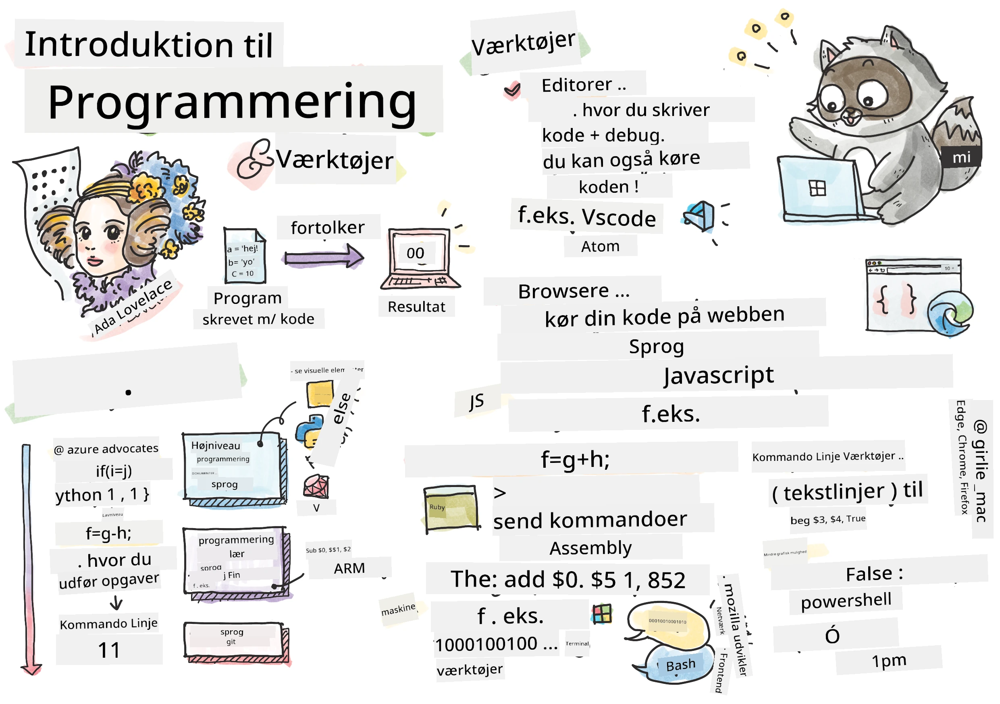
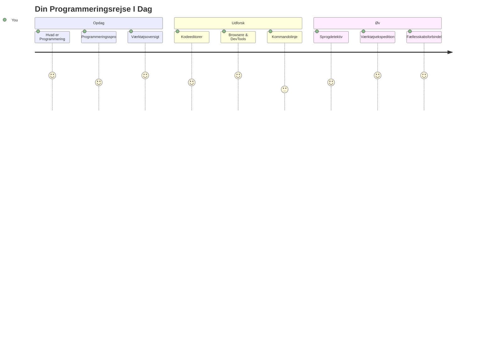
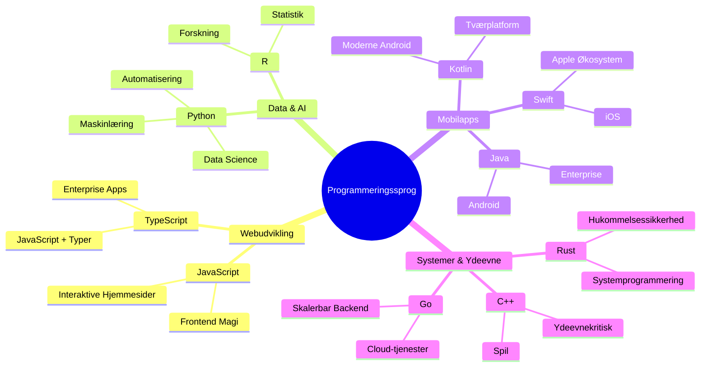
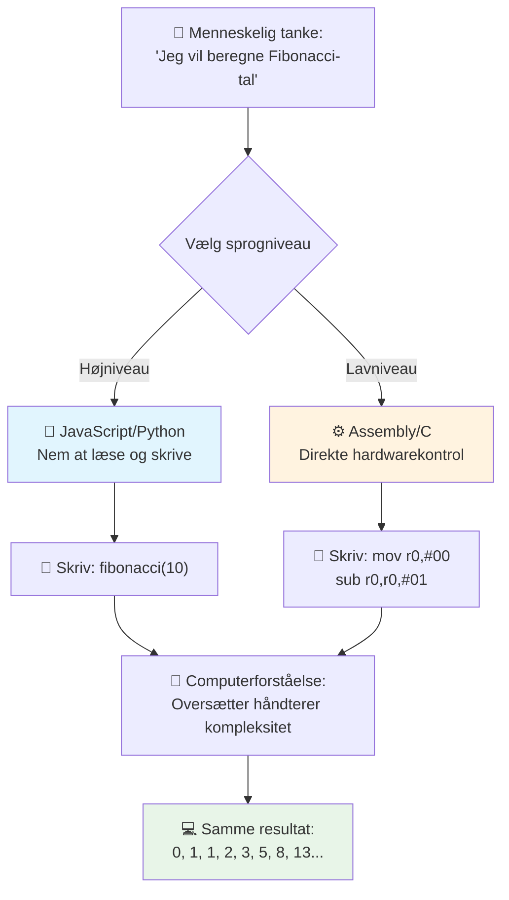
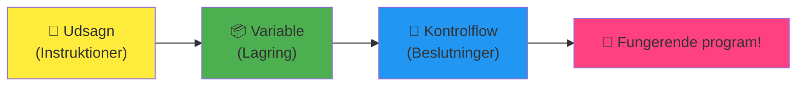
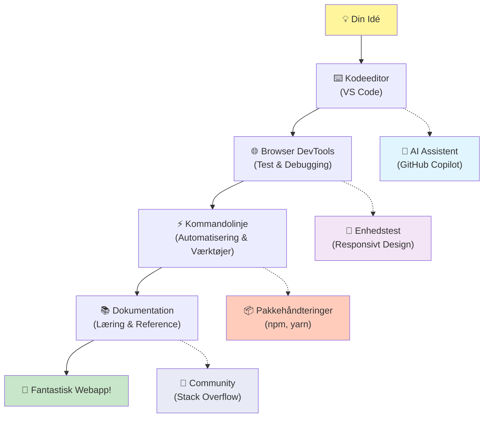
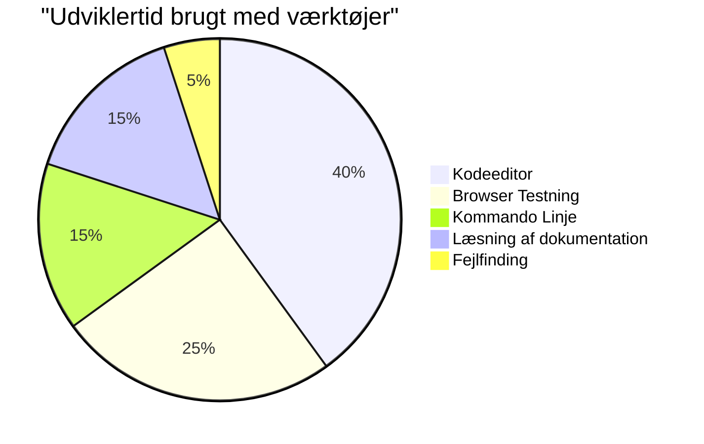
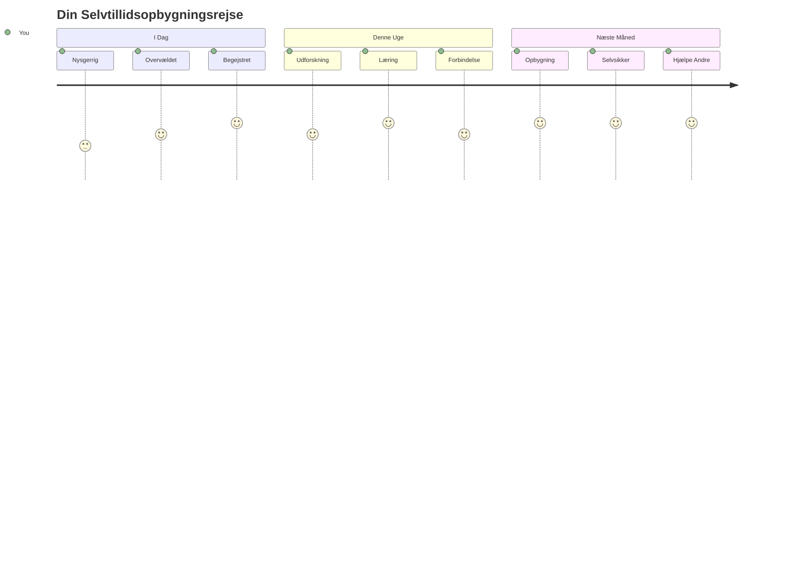

# Introduktion til programmeringssprog og moderne udviklerværktøjer
 
Hej der, fremtidige udvikler! 👋 Må jeg fortælle dig noget, der stadig giver mig kuldegysninger hver eneste dag? Du er ved at opdage, at programmering ikke kun handler om computere – det handler om at have egentlige superkræfter til at bringe dine vildeste idéer til live!

Du kender det øjeblik, hvor du bruger din yndlingsapp, og alt bare klikker perfekt? Når du trykker på en knap, og der sker noget helt magisk, som får dig til at sige "wow, hvordan gjorde de DET?" Nå, så er det en person ligesom dig – sandsynligvis sidder de i deres yndlingscafé kl. 2 om natten med deres tredje espresso – som skrev koden, der skabte den magi. Og her kommer noget, der vil blæse dig omkuld: når vi er færdige med denne lektion, vil du ikke kun forstå, hvordan de gjorde det, men du vil være helt ivrig efter selv at prøve!

Se, jeg forstår det godt, hvis programmering føles intimiderende lige nu. Da jeg begyndte, troede jeg ærligt talt, at man skulle være en slags matematisk geni eller have kodet siden, man var fem år gammel. Men her er det, der helt ændrede mit perspektiv: programmering er præcis som at lære at føre samtaler på et nyt sprog. Du starter med "hej" og "tak," så lærer du at bestille kaffe, og inden du ved af det, fører du dybe filosofiske samtaler! Bortset fra at i dette tilfælde fører du samtaler med computere, og helt seriøst? De er de mest tålmodige samtalepartnere, du nogensinde vil møde – de dømmer aldrig dine fejl og er altid begejstrede for at prøve igen!

I dag skal vi udforske de utrolige værktøjer, der gør moderne webudvikling ikke bare muligt, men decideret vanedannende. Jeg taler om præcis de samme editorer, browsere og arbejdsgange, som udviklere hos Netflix, Spotify og dit yndlings indie app-studie bruger hver eneste dag. Og her kommer den del, der får dig til at danse af glæde: de fleste af disse professionelle, branchestandard værktøjer er fuldstændig gratis!


> Sketchnote af [Tomomi Imura](https://twitter.com/girlie_mac)


```mermaid
journey
    title Din Programmeringsrejse I Dag
    section Opdag
      Hvad er Programmering: 5: You
      Programmeringssprog: 4: You
      Værktøjsoversigt: 5: You
    section Udforsk
      Kodeeditorer: 4: You
      Browsere & DevTools: 5: You
      Kommandolinje: 3: You
    section Øv
      Sprogdetektiv: 4: You
      Værktøjsekspedition: 5: You
      Fællesskabsforbindelse: 5: You
```
## Lad os se, hvad du allerede ved!

Før vi springer ud i det sjove, er jeg nysgerrig – hvad ved du allerede om denne programmeringsverden? Og hør, hvis du kigger på disse spørgsmål og tænker "jeg har bogstaveligt talt nul idé om noget som helst af det her," så er det ikke bare i orden, det er perfekt! Det betyder, at du er helt det rigtige sted. Tænk på denne quiz som opvarmning før træning – vi varmer bare hjerne musklerne op!

[Tag pre-lesson quizzen](https://ff-quizzes.netlify.app/web/)


## Eventyret, vi snart skal på sammen

Okay, jeg er virkelig begejstret for, hvad vi skal udforske i dag! Seriøst, jeg ville ønske, jeg kunne se dit ansigt, når nogle af disse koncepter klikker for dig. Her er den utrolige rejse, vi tager sammen:

- **Hvad programmering egentlig er (og hvorfor det er det fedeste overhovedet!)** – Vi skal opdage, hvordan kode bogstaveligt talt er den usynlige magi, der driver alt omkring dig, fra det vækkeur, der på en eller anden måde ved, det er mandag morgen, til algoritmen, der perfekt kuraterer dine Netflix-anbefalinger
- **Programmeringssprog og deres fantastiske personligheder** – Forestil dig at gå til en fest, hvor hver person har helt forskellige superkræfter og måder at løse problemer på. Sådan er programmeringssprogenes verden, og du kommer til at elske at møde dem!
- **De grundlæggende byggesten, der skaber digital magi** – Tænk på disse som det ultimative kreative LEGO sæt. Når du forstår, hvordan disse brikker passer sammen, vil du indse, at du bogstaveligt talt kan bygge alt, hvad din fantasi drømmer om
- **Professionelle værktøjer, der får dig til at føle, at du lige har fået en troldmandsstav** – Jeg overdriver ikke – disse værktøjer vil virkelig få dig til at føle, at du har superkræfter, og det bedste? Det er de samme, som profferne bruger!

> 💡 **Her er sagen**: Tænk ikke engang på at forsøge at huske alt i dag! Lige nu vil jeg bare have, at du mærker den gnist af begejstring for, hvad der er muligt. Detaljerne sidder naturligt fast, mens vi øver sammen – sådan sker rigtig læring!

> Du kan tage denne lektion på [Microsoft Learn](https://learn.microsoft.com/en-us/learn/modules/web-development-101/introduction-programming/?WT.mc_id=academic-77807-sagibbon)!

## Hvad er programmering egentlig?

Okay, lad os tage milliondollarsspørgsmålet: hvad er programmering egentlig?

Jeg vil fortælle dig en historie, der helt ændrede, hvordan jeg ser det. I sidste uge prøvede jeg at forklare min mor, hvordan hun bruger vores nye smart TV-fjernbetjening. Jeg fangede mig selv i at sige ting som "Tryk på den røde knap, men ikke den store røde knap, den lille røde knap til venstre... nej, din anden venstre... okay, hold den nu i to sekunder, ikke et, ikke tre..." Lyder det bekendt? 😅

Det er programmering! Det er kunsten at give utrolig detaljerede, trin-for-trin instruktioner til noget, der er meget kraftfuldt, men som skal have alt stavet helt præcist ud. Bortset fra at i stedet for at forklare det til din mor (som kan spørge "hvilken rød knap?!"), forklarer du det til en computer (der bare gør præcis, hvad du siger, selvom det, du sagde, ikke helt er det, du mente).

Her er, hvad der blæste mig omkuld, da jeg lærte det første gang: computere er faktisk ret simple i deres kerne. De forstår bogstaveligt talt kun to ting – 1 og 0, som grundlæggende bare betyder "ja" og "nej" eller "til" og "fra." Det er det! Men her bliver det magisk – vi behøver ikke at tale i 1'ere og 0'ere som i The Matrix. Det er her, **programmeringssprogene** kommer ind som superhelte. De er som den bedste oversætter i verden, der tager dine helt normale mennesketanker og omsætter dem til computersprog.

Og her er noget, der stadig giver mig virkelige kuldegysninger hver morgen, når jeg vågner: bogstaveligt talt *alt* digitalt i dit liv startede med en person ligesom dig, sikkert siddende i pyjamas med en kop kaffe til at skrive kode på deres laptop. Den Instagram-filter, der får dig til at se fejlfri ud? Nogen skrev den kode. Anbefalingen, der førte dig til din nye yndlingssang? En udvikler byggede den algoritme. Appen, der hjælper dig med at dele regninger til middag med venner? Yep, nogen tænkte "det her er irriterende, det kan jeg fixe" – og så gjorde de det!

Når du lærer at programmere, så lærer du ikke bare en ny færdighed – du bliver en del af et utrolig fællesskab af problemløsere, der bruger deres dage på at tænke: "Hvad nu hvis jeg kunne bygge noget, der gør nogens dag bare en lille smule bedre?" Ærligt talt, er der noget sejere end det?

✅ **Sjov fakta-jagt**: Her er noget super sejt at slå op, når du har et øjeblik til overs – hvem tror du var verdens første computerprogrammør? Jeg giver dig et hint: det er måske ikke den, du forventer! Historien bag denne person er absolut fascinerende og viser, at programmering altid har handlet om kreativ problemløsning og at tænke ud af boksen.

### 🧠 **Tjek-ind tid: Hvordan har du det?**

**Tag et øjeblik til at reflektere:**
- Giver idéen om "at give instruktioner til computere" mening for dig nu?
- Kan du tænke på en daglig opgave, du gerne vil automatisere med programmering?
- Hvilke spørgsmål bobler op i dit hoved om det her programmeringshalløj?

> **Husk**: Det er helt normalt, hvis nogle koncepter føles lidt uklare lige nu. At lære programmering er som at lære et nyt sprog – det tager tid for din hjerne at bygge de neurale forbindelser. Du gør det rigtig godt!

## Programmeringssprog er som forskellige slags magi

Okay, det her kommer måske til at lyde mærkeligt, men hæng på mig – programmeringssprog er meget lig forskellige slags musik. Tænk på det: du har jazz, som er smooth og improviserende, rock der er kraftfuld og ligetil, klassisk der er elegant og struktureret, og hip-hop der er kreativ og udtryksfuld. Hver stil har sin egen stemning, sit eget passionerede fællesskab, og hver er perfekt til forskellige stemninger og lejligheder.

Programmeringssprog fungerer helt på samme måde! Du ville ikke bruge det samme sprog til at bygge et sjovt mobilspil, som du bruger til at bearbejde massive mængder klimadata, ligesom du ikke ville spille death metal til en yogatime (nå, de fleste yogatimer i hvert fald! 😄).

Men her er det, der absolut blæser mig omkuld hver gang jeg tænker på det: disse sprog er som at have den mest tålmodige, brillante tolk i verden siddende lige ved siden af dig. Du kan udtrykke dine idéer på en måde, der føles naturlig for din menneskehjerne, og de håndterer alt det utroligt komplekse arbejde med at oversætte det til de 1'ere og 0'ere, som computere rent faktisk taler. Det er som at have en ven, der er perfekt flydende i både "menneskelig kreativitet" og "computerlogik" – og som aldrig bliver træt, aldrig har kaffepauser og aldrig dømmer dig for at stille det samme spørgsmål to gange!

### Populære programmeringssprog og deres anvendelser


```mermaid
mindmap
  root((Programmeringssprog))
    Webudvikling
      JavaScript
        Frontend Magi
        Interaktive Hjemmesider
      TypeScript
        JavaScript + Typer
        Enterprise Apps
    Data & AI
      Python
        Data Science
        Maskinlæring
        Automatisering
      R
        Statistik
        Forskning
    Mobilapps
      Java
        Android
        Enterprise
      Swift
        iOS
        Apple Økosystem
      Kotlin
        Moderne Android
        Tværplatform
    Systemer & Ydeevne
      C++
        Spil
        Ydeevnekritisk
      Rust
        Hukommelsessikkerhed
        Systemprogrammering
      Go
        Cloud-tjenester
        Skalerbar Backend
```
| Sprog | Bedst til | Hvorfor det er populært |
|----------|----------|------------------|
| **JavaScript** | Webudvikling, brugerinterfaces | Kører i browsere og driver interaktive websites |
| **Python** | Data science, automatisering, AI | Let at læse og lære, kraftfulde biblioteker |
| **Java** | Virksomhedsapplikationer, Android apps | Platform-uafhængigt, robust til store systemer |
| **C#** | Windows-applikationer, spiludvikling | Stærk Microsoft-økosystemstøtte |
| **Go** | Cloud-tjenester, backend-systemer | Hurtigt, simpelt, designet til moderne computing |

### Høj-niveau vs. Lav-niveau sprog

Okay, det her var ærligt talt det koncept, der brød min hjerne, da jeg først begyndte at lære, så jeg vil dele den analogi, der endelig fik det til at klikke for mig – og jeg håber virkelig, det hjælper dig også!

Forestil dig, at du besøger et land, hvor du ikke taler sproget, og du desperat skal finde det nærmeste toilet (det har vi alle prøvet, ikke? 😅):

- **Lav-niveau programmering** er som at lære det lokale dialekt så godt, at du kan chatte med bedstemor, der sælger frugt på hjørnet, med kulturelle referencer, lokalt slang og interne jokes, som kun en, der er opvokset der, ville forstå. Super imponerende og utroligt effektivt ... hvis du tilfældigvis er flydende! Men ret overvældende, når du bare prøver at finde et toilet.

- **Høj-niveau programmering** er som at have den fantastiske lokale ven, der bare forstår dig. Du kan sige "jeg skal virkelig finde et toilet" på entydigt dansk (eller engelsk), og de håndterer hele den kulturelle oversættelse og giver dig anvisninger på en måde, der giver perfekt mening for din ikke-lokale hjerne.

I programmering betyder det:
- **Lav-niveau sprog** (som Assembly eller C) lader dig føre utrolig detaljerede samtaler med computerens egentlige hardware, men du skal tænke som en maskine, hvilket… godt, lad os bare sige, det er et stort mentalt skift!
- **Høj-niveau sprog** (som JavaScript, Python eller C#) lader dig tænke som et menneske, mens de håndterer alle maskinsprogets ting bag kulisserne. Plus har de disse utroligt imødekommende fællesskaber fulde af folk, der husker, hvordan det var at være ny og oprigtigt vil hjælpe!

Gæt hvilke, jeg vil foreslå, du starter med? 😉 Høj-niveau sprog er som at have træningshjul på, som du aldrig rigtig vil tage af, fordi det gør hele oplevelsen så meget mere fornøjelig!


```mermaid
flowchart TB
    A["👤 Menneskelig tanke:<br/>'Jeg vil beregne Fibonacci-tal'"] --> B{Vælg sprogniveau}
    
    B -->|Højniveau| C["🌟 JavaScript/Python<br/>Nem at læse og skrive"]
    B -->|Lavniveau| D["⚙️ Assembly/C<br/>Direkte hardwarekontrol"]
    
    C --> E["📝 Skriv: fibonacci(10)"]
    D --> F["📝 Skriv: mov r0,#00<br/>sub r0,r0,#01"]
    
    E --> G["🤖 Computerforståelse:<br/>Oversætter håndterer kompleksitet"]
    F --> G
    
    G --> H["💻 Samme resultat:<br/>0, 1, 1, 2, 3, 5, 8, 13..."]
    
    style C fill:#e1f5fe
    style D fill:#fff3e0
    style H fill:#e8f5e8
```
### Lad mig vise dig, hvorfor høj-niveau sprog er så meget mere venlige

Okay, jeg er lige ved at vise dig noget, der perfekt demonstrerer, hvorfor jeg forelskede mig i høj-niveau sprog, men først – jeg har brug for, at du lover mig noget. Når du ser det første kodeeksempel, så få ikke panik! Det er meningen, det skal se lidt skræmmende ud. Det er netop pointen!

Vi skal kigge på den helt samme opgave skrevet i to helt forskellige stilarter. Begge skaber det, der kaldes Fibonacci-sekvensen – det er et smukt matematisk mønster, hvor hvert tal er summen af de to forrige: 0, 1, 1, 2, 3, 5, 8, 13... (Sjovt faktum: du finder dette mønster bogstaveligt talt overalt i naturen – solsikkekerner spiraler, kogler, selv hvordan galakser dannes!)

Klar til at se forskellen? Lad os gå i gang!

**Høj-niveau sprog (JavaScript) – Menneskevenligt:**

```javascript
// Trin 1: Grundlæggende Fibonacci opsætning
const fibonacciCount = 10;
let current = 0;
let next = 1;

console.log('Fibonacci sequence:');
```

**Det her gør koden:**
- **Deklarerer** en konstant for at angive, hvor mange Fibonacci-tal vi vil generere
- **Initialiserer** to variabler for at holde styr på de nuværende og næste tal i sekvensen
- **Sætter op** startværdierne (0 og 1), som definerer Fibonacci-mønstret
- **Viser** en overskrift til at identificere vores output

```javascript
// Trin 2: Generer sekvensen med en løkke
for (let i = 0; i < fibonacciCount; i++) {
  console.log(`Position ${i + 1}: ${current}`);
  
  // Beregn næste tal i sekvensen
  const sum = current + next;
  current = next;
  next = sum;
}
```

**Hvad der sker her:**
- **Looper** gennem hver position i vores sekvens med en `for`-løkke
- **Viser** hvert tal med dets position ved brug af en template literal-formattering
- **Beregner** det næste Fibonacci-tal ved at lægge nuværende og næste værdier sammen
- **Opdaterer** vores sporingsvariabler til at gå videre til næste iteration

```javascript
// Trin 3: Moderne funktionel tilgang
const generateFibonacci = (count) => {
  const sequence = [0, 1];
  
  for (let i = 2; i < count; i++) {
    sequence[i] = sequence[i - 1] + sequence[i - 2];
  }
  
  return sequence;
};

// Brugs eksempel
const fibSequence = generateFibonacci(10);
console.log(fibSequence);
```

**I ovenstående har vi:**
- **Oprettet** en genanvendelig funktion ved brug af moderne arrow function-syntaks
- **Bygget** et array til at gemme hele sekvensen i stedet for at vise talene ét ad gangen
- **Brugt** array-indeksering til at beregne hvert nyt tal ud fra tidligere værdier
- **Returneret** hele sekvensen for fleksibel brug i andre dele af vores program

**Lav-niveau sprog (ARM Assembly) – Computer-venligt:**

```assembly
 area ascen,code,readonly
 entry
 code32
 adr r0,thumb+1
 bx r0
 code16
thumb
 mov r0,#00
 sub r0,r0,#01
 mov r1,#01
 mov r4,#10
 ldr r2,=0x40000000
back add r0,r1
 str r0,[r2]
 add r2,#04
 mov r3,r0
 mov r0,r1
 mov r1,r3
 sub r4,#01
 cmp r4,#00
 bne back
 end
```

Læg mærke til, hvordan JavaScript-versionen nærmest læser som engelske instruktioner, mens Assembly-versionen bruger kryptiske kommandoer, der direkte styrer computerens processor. Begge udfører nøjagtigt samme opgave, men høj-niveau sproget er langt lettere for mennesker at forstå, skrive og vedligeholde.

**Nøgleforskelle, du vil bemærke:**
- **Læsbarhed**: JavaScript bruger beskrivende navne som `fibonacciCount`, mens Assembly bruger kryptiske labels som `r0`, `r1`
- **Kommentarer**: Højniveausprog opfordrer til forklarende kommentarer, som gør koden selvdokumenterende
- **Struktur**: JavaScripts logiske flow matcher, hvordan mennesker tænker over problemer trin for trin
- **Vedligeholdelse**: Opdatering af JavaScript-versionen til forskellige krav er ligetil og klart

✅ **Om Fibonacci-sekvensen**: Dette absolut smukke talmønster (hvor hvert tal svarer til summen af de to foregående: 0, 1, 1, 2, 3, 5, 8...) optræder bogstaveligt talt *overalt* i naturen! Du finder det i solsikkespiraler, koglernes mønstre, hvordan nautilusskaller krummer, og endda i måden trægrene vokser på. Det er ret fantastiskt, hvordan matematik og kode kan hjælpe os med at forstå og genskabe de mønstre, som naturen bruger til at skabe skønhed!


## Byggestenene, Der Får Magien Til At Ske

Okay, nu hvor du har set, hvordan programmeringssprog ser ud i aktion, lad os bryde de fundamentale dele ned, der udgør bogstaveligt talt ethvert program, der nogensinde er skrevet. Tænk på disse som de grundlæggende ingredienser i din yndlingsopskrift – når du forstår, hvad hvert element gør, vil du kunne læse og skrive kode i stort set ethvert sprog!

Det er lidt ligesom at lære grammatik for programmering. Kan du huske i skolen, da du lærte om substantiver, verber og at sætte sætninger sammen? Programmering har sin egen version af grammatik, og ærligt talt er den langt mere logisk og tilgivende end engelsk grammatik nogensinde var! 😄

### Statements: Trin-for-trin instruktionerne

Lad os starte med **statements** – de er som individuelle sætninger i en samtale med din computer. Hvert statement fortæller computeren at gøre én bestemt ting, lidt ligesom at give anvisninger: "Drej til venstre her," "Stop ved det røde lys," "Parkingér på det sted."

Det jeg elsker ved statements er, hvor læselige de normalt er. Se lige her:

```javascript
// Grundlæggende udsagn, der udfører enkeltstående handlinger
const userName = "Alex";                    
console.log("Hello, world!");              
const sum = 5 + 3;                         
```

**Sådan fungerer denne kode:**
- **Deklarer** en konstant variabel til at gemme en brugers navn
- **Viser** en hilsen til konsoloutput
- **Beregner** og gemmer resultatet af en matematisk operation

```javascript
// Udtalelser, der interagerer med websider
document.title = "My Awesome Website";      
document.body.style.backgroundColor = "lightblue";
```

**Trin for trin, her sker følgende:**
- **Ændrer** websiden titlen, som vises i browserfanen
- **Ændrer** baggrundsfarven på hele sidelegemet

### Variabler: Dit programs hukommelsessystem

Okay, **variabler** er ærligt talt et af mine absolut yndlingskoncepter at lære fra mig, fordi de er så meget som ting, du allerede bruger hver eneste dag!

Tænk på din telefons kontaktliste et øjeblik. Du husker ikke alles telefonnumre – i stedet gemmer du "Mor," "Bedste ven," eller "Pizzasted der leverer til kl. 2 om natten" og lader din telefon huske de faktiske numre. Variabler fungerer præcis på samme måde! De er som mærkede beholdere, hvor dit program kan gemme information og hente det senere ved hjælp af et navn, der rent faktisk giver mening.

Her er det, der er virkelig sejt: variabler kan ændre sig, mens dit program kører (deraf navnet "variabel" – kan du se hvad de gjorde der?). Ligesom du måske opdaterer den pizzakontakt, når du finder et endnu bedre sted, kan variabler opdateres, efterhånden som dit program lærer ny information eller som situationer ændrer sig!

Lad mig vise dig, hvor smukt simpelt det kan være:

```javascript
// Trin 1: Oprettelse af grundlæggende variabler
const siteName = "Weather Dashboard";        
let currentWeather = "sunny";               
let temperature = 75;                       
let isRaining = false;                      
```

**Forståelse af disse koncepter:**
- **Gemmer** uforanderlige værdier i `const` variabler (som webstedets navn)
- **Bruger** `let` til værdier, der kan ændre sig gennem dit program
- **Tildeler** forskellige datatyper: strenge (tekst), tal og booleans (sand/falsk)
- **Vælger** beskrivende navne, som forklarer, hvad hver variabel indeholder

```javascript
// Trin 2: Arbejde med objekter for at gruppere relaterede data
const weatherData = {                       
  location: "San Francisco",
  humidity: 65,
  windSpeed: 12
};
```

**Ovenfor har vi:**
- **Oprettet** et objekt til at samle relaterede vejrdata sammen
- **Organiseret** flere data under ét variabelnavn
- **Brugt** nøgle-værdi-par for klart at mærke hver del af informationen

```javascript
// Trin 3: Brug og opdatering af variabler
console.log(`${siteName}: Today is ${currentWeather} and ${temperature}°F`);
console.log(`Wind speed: ${weatherData.windSpeed} mph`);

// Opdatering af ændringsbare variabler
currentWeather = "cloudy";                  
temperature = 68;                          
```

**Lad os forstå hver del:**
- **Viser** information ved hjælp af template literals med `${}` syntaks
- **Adgang** til objektets egenskaber via dot notation (`weatherData.windSpeed`)
- **Opdaterer** variabler deklareret med `let` for at afspejle skiftende forhold
- **Kombinerer** flere variabler for at skabe meningsfulde beskeder

```javascript
// Trin 4: Moderne destructuring for renere kode
const { location, humidity } = weatherData; 
console.log(`${location} humidity: ${humidity}%`);
```

**Det, du skal vide:**
- **Udtrækker** specifikke egenskaber fra objekter ved hjælp af destructuring assignment
- **Opretter** nye variabler automatisk med samme navne som objektets nøgler
- **Forenkler** kode ved at undgå gentagen dot notation

### Kontrolflow: Lærer dit program at tænke

Okay, nu bliver programmering virkelig tankevækkende! **Kontrolflow** er i bund og grund at lære dit program, hvordan det kan tage smarte beslutninger, præcis som du gør hver eneste dag uden at tænke over det.

Forestil dig dette: i morges gik du sikkert igennem noget i stil med "Hvis det regner, tager jeg en paraply med. Hvis det er koldt, tager jeg en jakke på. Hvis jeg er forsinket, springer jeg morgenmaden over og tager kaffen på vejen." Din hjerne følger automatisk denne hvis-så logik dusinvis af gange hver dag!

Det er det, der får programmer til at føles intelligente og levende i stedet for bare at følge en kedelig, forudsigelig instruktion. De kan faktisk kigge på en situation, evaluere hvad der sker, og reagere passende. Det er som at give dit program en hjerne, der kan tilpasse sig og træffe valg!

Vil du se, hvor smukt det fungerer? Lad mig vise dig:

```javascript
// Trin 1: Grundlæggende betinget logik
const userAge = 17;

if (userAge >= 18) {
  console.log("You can vote!");
} else {
  const yearsToWait = 18 - userAge;
  console.log(`You'll be able to vote in ${yearsToWait} year(s).`);
}
```

**Sådan fungerer denne kode:**
- **Tjekker** om brugerens alder opfylder stemmeretskravet
- **Udfører** forskellige kodeblokke baseret på betingelsens resultat
- **Beregner** og viser hvor længe der er til stemmeberettigelse, hvis under 18
- **Giver** specifik, hjælpsom feedback for hver situation

```javascript
// Trin 2: Flere betingelser med logiske operatorer
const userAge = 17;
const hasPermission = true;

if (userAge >= 18 && hasPermission) {
  console.log("Access granted: You can enter the venue.");
} else if (userAge >= 16) {
  console.log("You need parent permission to enter.");
} else {
  console.log("Sorry, you must be at least 16 years old.");
}
```

**Her er en nedbrydning af, hvad der sker:**
- **Kombinerer** flere betingelser med `&&` (og) operatoren
- **Opretter** et hierarki af betingelser ved hjælp af `else if` for flere scenarier
- **Håndterer** alle mulige tilfælde med en sidste `else` erklæring
- **Giver** klar, handlingsorienteret feedback for hver situation

```javascript
// Trin 3: Kortfattet betingelse med ternær operator
const votingStatus = userAge >= 18 ? "Can vote" : "Cannot vote yet";
console.log(`Status: ${votingStatus}`);
```

**Det skal du huske:**
- **Bruger** ternary-operatoren (`? :`) til simple to-valgs betingelser
- **Skriver** først betingelsen, efterfulgt af `?`, derefter sandt resultat, så `:`, og falsk resultat
- **Anvender** dette mønster, når du skal tildele værdier baseret på betingelser

```javascript
// Trin 4: Håndtering af flere specifikke tilfælde
const dayOfWeek = "Tuesday";

switch (dayOfWeek) {
  case "Monday":
  case "Tuesday":
  case "Wednesday":
  case "Thursday":
  case "Friday":
    console.log("It's a weekday - time to work!");
    break;
  case "Saturday":
  case "Sunday":
    console.log("It's the weekend - time to relax!");
    break;
  default:
    console.log("Invalid day of the week");
}
```

**Denne kode opnår følgende:**
- **Matcher** variabelværdien mod flere specifikke tilfælde
- **Grupperer** lignende tilfælde sammen (hverdag vs. weekend)
- **Udfører** den passende kodeblok, når et match findes
- **Inkluderer** en `default` case for at håndtere uventede værdier
- **Bruger** `break` statements for at forhindre kode i at fortsætte til næste case

> 💡 **Virkelighedsanalog**: Tænk på kontrolflow som verdens mest tålmodige GPS, der giver dig anvisninger. Den kan sige "Hvis der er trafik på Hovedgaden, så tag motorvejen i stedet. Hvis vejarbejde blokerer motorvejen, prøv den naturskønne rute." Programmer bruger præcis samme type betingede logik for at reagere intelligent på forskellige situationer og altid give brugerne den bedst mulige oplevelse.

### 🎯 **Konceptkontrol: Byggesten mesterskab**

**Lad os se, hvordan det går med grundlæggende forståelse:**
- Kan du forklare forskellen på en variabel og et statement med dine egne ord?
- Tænk på en virkelighedssituation, hvor du vil bruge en hvis-så beslutning (som vores stemmeretseksempel)
- Hvad er én ting ved programmeringslogik, der overraskede dig?

**Hurtig selvtillids-booster:**

```mermaid
flowchart LR
    A["📝 Udsagn<br/>(Instruktioner)"] --> B["📦 Variable<br/>(Lagring)"] --> C["🔀 Kontrolflow<br/>(Beslutninger)"] --> D["🎉 Fungerende program!"]
    
    style A fill:#ffeb3b
    style B fill:#4caf50
    style C fill:#2196f3
    style D fill:#ff4081
```
✅ **Hvad der kommer næste gang**: Vi kommer til at have det helt vildt sjovt med at dykke dybere ned i disse koncepter, mens vi fortsætter denne utrolige rejse sammen! Lige nu skal du bare fokusere på at føle den begejstring over alle de fantastiske muligheder, der venter forude. De specifikke færdigheder og teknikker kommer helt naturligt, når vi øver os sammen – jeg lover, det bliver meget sjovere, end du måske forventer!

## Værktøjer i faget

Okay, nu bliver jeg ærligt talt så begejstret, at jeg næsten ikke kan styre mig! 🚀 Vi skal til at tale om de utrolige værktøjer, der får dig til at føle, at du lige har fået nøglerne til et digitalt rumskib.

Du ved, hvordan en kok har de perfekt afbalancerede knive, som føles som forlængelser af hænderne? Eller hvordan en musiker har den ene guitar, der nærmest synger, fra det øjeblik, den røres? Nå, udviklere har vores egen version af disse magiske værktøjer, og her er, hvad der virkelig vil blæse dig omkuld – de fleste af dem er helt gratis!

Jeg sidder nærmest og hopper i stolen, fordi jeg glæder mig til at dele dem med dig, da de fuldstændigt har revolutioneret, hvordan vi bygger software. Vi taler om AI-drevne kodningsassistenter, der kan hjælpe med at skrive din kode (jeg mener det virkelig!), cloud-miljøer, hvor du kan bygge hele applikationer fra bogstaveligt talt hvor som helst med Wi-Fi, og fejlfindingsværktøjer så sofistikerede, at det er som at have røntgensyn til dine programmer.

Og her kommer delen, der stadig giver mig gåsehud: det er ikke "begynder-værktøjer," som du hurtigt kommer til at vokse fra. Det er præcis de samme professionelle værktøjer, som udviklere hos Google, Netflix og det indie app-studie, du elsker, bruger lige nu. Du kommer til at føle dig som en helt professionel, når du bruger dem!


```mermaid
graph TD
    A["💡 Din Idé"] --> B["⌨️ Kodeeditor<br/>(VS Code)"] 
    B --> C["🌐 Browser DevTools<br/>(Test & Debugging)"]
    C --> D["⚡ Kommandolinje<br/>(Automatisering & Værktøjer)"]
    D --> E["📚 Dokumentation<br/>(Læring & Reference)"]
    E --> F["🚀 Fantastisk Webapp!"]
    
    B -.-> G["🤖 AI Assistent<br/>(GitHub Copilot)"]
    C -.-> H["📱 Enhedstest<br/>(Responsivt Design)"]
    D -.-> I["📦 Pakkehåndteringer<br/>(npm, yarn)"]
    E -.-> J["👥 Community<br/>(Stack Overflow)"]
    
    style A fill:#fff59d
    style F fill:#c8e6c9
    style G fill:#e1f5fe
    style H fill:#f3e5f5
    style I fill:#ffccbc
    style J fill:#e8eaf6
```
### Kodeeditorer og IDE'er: Dine nye digitale bedste venner

Lad os tale om kodeeditorer – de er alvorligt lige ved at blive dine nye yndlingssteder at hænge ud! Tænk på dem som dit personlige kodehelligdom, hvor du vil tilbringe det meste af din tid med at skabe og perfektionere dine digitale kreationer.

Men her er det, der er helt magisk ved moderne editorer: de er ikke bare fine teksteditorer. De er som at have den mest geniale, støttende kode-mentor siddende lige ved siden af dig døgnet rundt. De fanger dine tastefejl, før du overhovedet opdager dem, foreslår forbedringer, der får dig til at se ud som et geni, hjælper dig med at forstå, hvad hvert kodeelement gør, og nogle af dem kan endda forudsige, hvad du er ved at skrive og tilbyde at færdiggøre dine tanker!

Jeg husker, da jeg først opdagede autoudfyldning – jeg følte virkelig, at jeg levede i fremtiden. Du begynder at skrive noget, og din editor siger, "Hej, tænkte du på denne funktion, der gør præcis, hvad du har brug for?" Det er som at have en tankelæser som din kodebuddy!

**Hvad gør disse editorer så fantastiske?**

Moderne kodeeditorer byder på et imponerende udvalg af funktioner designet til at øge din produktivitet:

| Funktion | Hvad den gør | Hvorfor det hjælper |
|---------|--------------|--------------|
| **Syntax Highlighting** | Farver forskellige dele af din kode | Gør kode nemmere at læse og opdage fejl |
| **Auto-completion** | Foreslår kode, mens du skriver | Fremskynder kodningen og reducerer tastefejl |
| **Debugging Tools** | Hjælper med at finde og rette fejl | Sparrer timer på fejlsøgning |
| **Extensions** | Tilføjer specialiserede funktioner | Tilpas din editor til enhver teknologi |
| **AI Assistants** | Foreslår kode og forklaringer | Fremskynder læring og produktivitet |

> 🎥 **Videoressource**: Vil du se disse værktøjer i aktion? Tjek denne [Tools of the Trade video](https://youtube.com/watch?v=69WJeXGBdxg) for et omfattende overblik.

#### Anbefalede editorer til webudvikling

**[Visual Studio Code](https://code.visualstudio.com/?WT.mc_id=academic-77807-sagibbon)** (Gratis)
- Mest populær blandt webudviklere
- Fremragende økosystem for udvidelser
- Indbygget terminal og Git-integration
- **Must-have udvidelser**:
  - [GitHub Copilot](https://marketplace.visualstudio.com/items?itemName=GitHub.copilot) - AI-drevne kodeforslag
  - [Live Share](https://marketplace.visualstudio.com/items?itemName=MS-vsliveshare.vsliveshare) - Realtids-samarbejde
  - [Prettier](https://marketplace.visualstudio.com/items?itemName=esbenp.prettier-vscode) - Automatisk kodeformatering
  - [Code Spell Checker](https://marketplace.visualstudio.com/items?itemName=streetsidesoftware.code-spell-checker) - Fang stavefejl i din kode

**[JetBrains WebStorm](https://www.jetbrains.com/webstorm/)** (Betalt, gratis for studerende)
- Avancerede fejlfindings- og testværktøjer
- Intelligent kodeautofuldførelse
- Indbygget versionskontrol

**Cloud-baserede IDE'er** (Forskellige priser)
- [GitHub Codespaces](https://github.com/features/codespaces) - Fuld VS Code i din browser
- [Replit](https://replit.com/) - Fantastisk til læring og deling af kode
- [StackBlitz](https://stackblitz.com/) - Øjeblikkelig, fuld-stack webudvikling

> 💡 **Kom godt i gang-tip**: Start med Visual Studio Code – det er gratis, bredt brugt i industrien og har et enormt community, der skaber nyttige tutorials og udvidelser.


### Webbrowsere: Dit hemmelige udviklingslaboratorium

Okay, gør dig klar til at få dit sind fuldstændigt blæst! Du ved, hvordan du har brugt browsere til at scrolle på sociale medier og se videoer? Nå, det viser sig, at de har gemt dette utrolige hemmelige udviklingslaboratorium hele tiden og bare ventet på, at du skulle opdage det!

Hver eneste gang du højreklikker på en webside og vælger "Inspicér element," åbner du en skjult verden af udviklerværktøjer, som ærligt talt er mere kraftfulde end noget dyrt software, jeg tidligere har betalt hundredevis af kroner for. Det er som at opdage, at dit helt almindelige køkken har gemt et professionelt kokkelaboratorium bag en hemmelig panel!
Første gang nogen viste mig browserens DevTools, brugte jeg næsten tre timer bare på at klikke rundt og sige "VENT, KAN DEN OGSÅ DET?!" Du kan bogstaveligt talt redigere enhver hjemmeside i realtid, se præcis hvor hurtigt alt indlæses, teste hvordan dit site ser ud på forskellige enheder og endda fejlfinde JavaScript som en ægte pro. Det er helt sindssygt!

**Her er hvorfor browsere er dit hemmelige våben:**

Når du laver en hjemmeside eller webapplikation, skal du kunne se, hvordan den ser ud og opfører sig i den virkelige verden. Browsere viser ikke kun dit arbejde, de giver også detaljeret feedback om ydeevne, tilgængelighed og potentielle problemer.

#### Browser Developer Tools (DevTools)

Moderne browsere indeholder omfattende udviklingsværktøjer:

| Tool Category | What It Does | Example Use Case |
|---------------|--------------|------------------|
| **Element Inspector** | Se og rediger HTML/CSS i realtid | Juster stil og se resultater med det samme |
| **Console** | Se fejlmeddelelser og test JavaScript | Fejlret problemer og eksperimenter med kode |
| **Network Monitor** | Følg hvordan ressourcer indlæses | Optimer ydeevne og indlæsningstider |
| **Accessibility Checker** | Test for inklusivt design | Sikr at dit site virker for alle brugere |
| **Device Simulator** | Forhåndsvis på forskellige skærmstørrelser | Test responsivt design uden flere enheder |

#### Anbefalede browsere til udvikling

- **[Chrome](https://developers.google.com/web/tools/chrome-devtools/)** - Industriens standard DevTools med omfattende dokumentation
- **[Firefox](https://developer.mozilla.org/docs/Tools)** - Fremragende CSS Grid og tilgængelighedsværktøjer
- **[Edge](https://docs.microsoft.com/microsoft-edge/devtools-guide-chromium/?WT.mc_id=academic-77807-sagibbon)** - Bygget på Chromium med Microsofts udviklerressourcer

> ⚠️ **Vigtig testtip**: Test altid dine hjemmesider i flere browsere! Det der virker perfekt i Chrome, kan se anderledes ud i Safari eller Firefox. Professionelle udviklere tester på tværs af alle større browsere for at sikre ensartede brugeroplevelser.


### Kommandolinjeværktøjer: Din adgang til udvikler-superkræfter

Okay, lad os være helt ærlige omkring kommandolinjen, for jeg vil have, at du hører dette fra en, der virkelig forstår det. Da jeg først så den – bare den skræmmende sorte skærm med blinkende tekst – tænkte jeg bogstaveligt talt, "Nej, slet ikke! Det ligner noget fra en hackerfilm i 1980’erne, og jeg er bestemt ikke klog nok til det her!" 😅

Men her er hvad jeg ville ønske nogen havde fortalt mig dengang, og som jeg fortæller dig nu: kommandolinjen er ikke skræmmende – det er faktisk som at have en direkte samtale med din computer. Tænk på det som forskellen mellem at bestille mad via en fancy app med billeder og menuer (som er nemt og lækkert) versus at gå ind på din lokale yndlingsrestaurant, hvor kokken præcis ved, hvad du kan lide, og kan trylle noget perfekt frem bare fordi du siger "overrask mig med noget fantastisk."

Kommandolinjen er stedet, udviklere går til for at føle sig som rene troldmænd. Du skriver et par tilsyneladende magiske ord (okay, det er bare kommandoer, men de føles magiske!), trykker enter, og BOOM – du har oprettet komplette projektstrukturer, installeret kraftfulde værktøjer fra hele verden eller deployet din app til internettet, så millioner kan se den. Når du først får smag for den magt, er det ærligt talt ret vanedannende!

**Derfor bliver kommandolinjen dit favoritværktøj:**

Mens grafiske brugergrænseflader er gode til mange opgaver, er kommandolinjen suveræn til automatisering, præcision og hastighed. Mange udviklingsværktøjer kører primært via kommandolinjen, og at lære at bruge dem effektivt kan forbedre din produktivitet markant.

```bash
# Trin 1: Opret og naviger til projektmappen
mkdir my-awesome-website
cd my-awesome-website
```

**Dette kodeeksempel gør:**
- **Opretter** en ny mappe kaldet "my-awesome-website" til dit projekt
- **Navigerer** ind i den nyskabte mappe for at begynde arbejdet

```bash
# Trin 2: Initialiser projekt med package.json
npm init -y

# Installer moderne udviklingsværktøjer
npm install --save-dev vite prettier eslint
npm install --save-dev @eslint/js
```

**Trin for trin, her sker der:**
- **Initialiserer** et nyt Node.js projekt med standardindstillinger via `npm init -y`
- **Installerer** Vite som et moderne build-værktøj til hurtig udvikling og produktion
- **Tilføjer** Prettier til automatisk kodeformatering og ESLint til kodekvalitetstjek
- **Bruger** `--save-dev` flaget for at markere disse som udviklingsafhængigheder

```bash
# Trin 3: Opret projektstruktur og filer
mkdir src assets
echo '<!DOCTYPE html><html><head><title>My Site</title></head><body><h1>Hello World</h1></body></html>' > index.html

# Start udviklingsserver
npx vite
```

**I ovenstående har vi:**
- **Organiseret** vores projekt med separate mapper til kildekode og assets
- **Genereret** en basal HTML-fil med korrekt dokumentstruktur
- **Startet** Vite udviklingsserveren til live reload og hot module replacement

#### Væsentlige kommandolinjeværktøjer til webudvikling

| Tool | Purpose | Why You Need It |
|------|---------|-----------------|
| **[Git](https://git-scm.com/)** | Versionsstyring | Spor ændringer, samarbejd med andre, sikkerhedskopiér dit arbejde |
| **[Node.js & npm](https://nodejs.org/)** | JavaScript runtime & pakkestyring | Kør JavaScript udenfor browseren, installer moderne udviklingsværktøjer |
| **[Vite](https://vitejs.dev/)** | Bygge- og udviklingsserver | Lynhurtig udvikling med hot module replacement |
| **[ESLint](https://eslint.org/)** | Kodekvalitet | Find og rette problemer i din JavaScript automatisk |
| **[Prettier](https://prettier.io/)** | Kodeformatering | Hold din kode konsekvent formateret og læsbar |

#### Platformspecifikke muligheder

**Windows:**
- **[Windows Terminal](https://docs.microsoft.com/windows/terminal/?WT.mc_id=academic-77807-sagibbon)** - Moderne og funktionsrig terminal
- **[PowerShell](https://docs.microsoft.com/powershell/?WT.mc_id=academic-77807-sagibbon)** 💻 - Kraftfuldt scripting-miljø
- **[Command Prompt](https://docs.microsoft.com/windows-server/administration/windows-commands/?WT.mc_id=academic-77807-sagibbon)** 💻 - Traditionel Windows kommandolinje

**macOS:**
- **[Terminal](https://support.apple.com/guide/terminal/)** 💻 - Indbygget terminalapplikation
- **[iTerm2](https://iterm2.com/)** - Forbedret terminal med avancerede funktioner

**Linux:**
- **[Bash](https://www.gnu.org/software/bash/)** 💻 - Standard Linux shell
- **[KDE Konsole](https://docs.kde.org/trunk5/en/konsole/konsole/index.html)** - Avanceret terminalemulator

> 💻 = Forudinstalleret på operativsystemet

> 🎯 **Læringsvejledning**: Begynd med grundlæggende kommandoer som `cd` (skift mappe), `ls` eller `dir` (list filer), og `mkdir` (opret mappe). Øv dig med moderne workflow-kommandoer som `npm install`, `git status` og `code .` (åbner nuværende mappe i VS Code). Når du bliver mere tryg, vil du naturligt lære mere avancerede kommandoer og automatiseringsteknikker.


### Dokumentation: Din altid-tilgængelige læringsmentor

Okay, jeg vil dele en lille hemmelighed, der vil få dig til at føle dig meget bedre som begynder: selv de mest erfarne udviklere bruger en stor del af deres tid på at læse dokumentation. Og det er ikke fordi de ikke ved, hvad de laver – det er faktisk et tegn på visdom!

Tænk på dokumentation som at have adgang til verdens mest tålmodige, vidende lærere, som er tilgængelige 24/7. Sidder du fast med et problem klokken 2 om natten? Dokumentationen er der med et virtuelt varmt kram og præcis det svar, du har brug for. Vil du lære om en smart ny funktion, som alle taler om? Dokumentationen hjælper dig med trin-for-trin eksempler. Prøver du at forstå, hvorfor noget virker, som det gør? Gæt engang – dokumentationen forklarer det på en måde, der endelig får det til at klikke!

Her er noget, der ændrede mit perspektiv totalt: webudviklingsverdenen bevæger sig utrolig hurtigt, og ingen (jeg mener virkelig ingen!) kan huske det hele udenad. Jeg har set erfarne udviklere med 15+ års erfaring slå helt basal syntaks op, og ved du hvad? Det er ikke pinligt – det er smart! Det handler ikke om perfekt hukommelse; det handler om at vide, hvor man hurtigt finder pålidelige svar og kan anvende dem.

**Her sker den sande magi:**

Professionelle udviklere bruger en stor del af deres tid på at læse dokumentation – ikke fordi de ikke ved, hvad de laver, men fordi webudviklingslandskabet udvikler sig så hurtigt, at det kræver kontinuerlig læring at følge med. God dokumentation hjælper dig med ikke bare at forstå *hvordan* man bruger noget, men også *hvorfor* og *hvornår* man skal bruge det.

#### Væsentlige dokumentationsressourcer

**[Mozilla Developer Network (MDN)](https://developer.mozilla.org/docs/Web)**
- Guldstandarden for webteknologi-dokumentation
- Omfattende guides til HTML, CSS og JavaScript
- Indeholder browserkompatibilitetsinformation
- Har praktiske eksempler og interaktive demoer

**[Web.dev](https://web.dev)** (af Google)
- Moderne bedste praksis for webudvikling
- Guides til performanceoptimering
- Principper for tilgængelighed og inklusivt design
- Cases fra virkelige projekter

**[Microsoft Developer Documentation](https://docs.microsoft.com/microsoft-edge/#microsoft-edge-for-developers)**
- Udviklerressourcer til Edge-browseren
- Progressive Web App-guides
- Indsigter i cross-platform udvikling

**[Frontend Masters Learning Paths](https://frontendmasters.com/learn/)**
- Strukturerede læringsforløb
- Videokurser fra brancheeksperter
- Hands-on kodeøvelser

> 📚 **Studietips**: Forsøg ikke at huske dokumentationen udenad – lær i stedet at navigere i den effektivt. Bogmærk ofte brugte referencer og øv dig i at bruge søgefunktionerne til hurtigt at finde specifik information.

### 🔧 **Værktøjsmestring: Hvad taler mest til dig?**

**Tag et øjeblik til at overveje:**
- Hvilket værktøj glæder du dig mest til at prøve først? (Der findes ikke et forkert svar!)
- Føles kommandolinjen stadig intimiderende, eller er du nysgerrig på den?
- Kan du forestille dig at bruge browser DevTools til at kigge bag kulisserne på dine yndlingshjemmesider?


```mermaid
pie title "Udviklertid brugt med værktøjer"
    "Kodeeditor" : 40
    "Browser Testning" : 25
    "Kommando Linje" : 15
    "Læsning af dokumentation" : 15
    "Fejlfinding" : 5
```
> **Sjov indsigt**: De fleste udviklere bruger omkring 40 % af deres tid i deres kodeeditor, men det er interessant at bemærke, hvor meget tid der går til test, læring og problemløsning. Programmering handler ikke bare om at skrive kode – det handler om at skabe oplevelser!

✅ **Noget at tænke over**: Overvej hvordan værktøjerne til at bygge hjemmesider (udvikling) adskiller sig fra værktøjer til at designe, hvordan de ser ud (design). Det er som forskellen på en arkitekt, der designer et smukt hus, og entreprenøren, der rent faktisk bygger det. Begge dele er afgørende, men kræver forskellige værktøjskasser! Den slags tanker vil virkelig hjælpe dig med at se det større billede af, hvordan hjemmesider bliver til.

## GitHub Copilot Agent Udfordring 🚀

Brug Agent-tilstanden til at løse følgende udfordring:

**Beskrivelse:** Udforsk funktionerne i en moderne kodeeditor eller IDE og demonstrer, hvordan den kan forbedre din arbejdsgang som webudvikler.

**Prompt:** Vælg en kodeeditor eller IDE (som Visual Studio Code, WebStorm eller en cloud-baseret IDE). Angiv tre funktioner eller udvidelser, der hjælper dig med at skrive, fejlfinde eller vedligeholde kode mere effektivt. For hver, giv en kort forklaring på, hvordan det gavner din arbejdsgang.

---

## 🚀 Udfordring

**Okay, detektiv, klar til din første sag?**

Nu hvor du har fået dette fantastiske fundament, har jeg et eventyr, som vil hjælpe dig med at se, hvor utroligt mangfoldig og fascinerende programmeringsverdenen er. Og hør her – det handler ikke om at skrive kode endnu, så tag det helt roligt! Tænk på dig selv som en programmeringssprogsdetektiv på din allerførste spændende sag!

**Din mission, hvis du vælger at acceptere den:**
1. **Bliv en sprogeventyrer**: Vælg tre programmeringssprog fra helt forskellige verdener – måske ét til websites, ét til mobilapps og ét til databehandling for forskere. Find eksempler på den samme simple opgave skrevet i hvert sprog. Jeg lover, du bliver helt overrasket over, hvor forskelligt de kan se ud, selvom de laver præcis det samme!

2. **Opdag deres oprindelseshistorier**: Hvad gør hvert sprog unikt? Her er en fed kendsgerning – hvert enkelt programmeringssprog blev skabt, fordi nogen tænkte, "Ved du hvad? Der må være en bedre måde at løse dette specifikke problem." Kan du finde ud af, hvad disse problemer var? Nogle af historierne er virkelig spændende!

3. **Mød fællesskaberne**: Se, hvor imødekommende og passionerede hvert sprogs fællesskab er. Nogle har millioner af udviklere, der deler viden og hjælper hinanden, andre er mindre, men utrolig sammentømrede og støttende. Du kommer til at elske at opleve de forskellige personligheder i disse fællesskaber!

4. **Følg din mavefornemmelse**: Hvilket sprog føles mest tilgængeligt for dig lige nu? Stress ikke over at træffe det "perfekte" valg – lyt bare til din instinkt! Der findes ærligt talt ikke et forkert svar her, og du kan altid udforske andre senere.

**Bonusdetektivarbejde**: Se om du kan finde ud af, hvilke store hjemmesider eller apps der er bygget med hvert sprog. Jeg lover, du bliver chokeret over at lære, hvad der driver Instagram, Netflix eller det mobilspil, du ikke kan stoppe med at spille!

> 💡 **Husk**: Du behøver ikke blive ekspert i nogen af disse sprog i dag. Du skal bare lære kvarteret at kende, inden du beslutter dig for, hvor du vil slå dig ned. Tag dig god tid, hav det sjovt, og lad din nysgerrighed føre dig!

## Lad os fejre, hvad du har opdaget!

Hold da op, du har fanget så mange utrolige informationer i dag! Jeg er virkelig spændt på at se, hvor meget af denne fantastiske rejse, der sidder fast hos dig. Og husk – dette er ikke en test, hvor du skal gøre det perfekt. Det er mere en fejring af alt det seje, du har lært om denne fascinerende verden, du er på vej ind i!

[Tag quizzen efter lektionen](https://ff-quizzes.netlify.app/web/)

## Gennemgang & Selvstudie

**Tag dig tid til at udforske og have det sjovt med det!**
Du har dækket meget i dag, og det er noget, du kan være stolt af! Nu kommer den sjove del – at udforske de emner, der vækkede din nysgerrighed. Husk, dette er ikke lektier – det er et eventyr!

**Dyk dybere ned i det, der begejstrer dig:**

**Kom i gang med programmeringssprog:**
- Besøg de officielle hjemmesider for 2-3 sprog, der fangede din interesse. Hvert enkelte har sin egen personlighed og historie!
- Prøv nogle online kode-legeredskaber som [CodePen](https://codepen.io/), [JSFiddle](https://jsfiddle.net/), eller [Replit](https://replit.com/). Vær ikke bange for at eksperimentere – du kan ikke ødelægge noget!
- Læs om, hvordan dit yndlingssprog blev til. Seriøst, nogle af disse oprindelseshistorier er fascinerende og vil hjælpe dig med at forstå, hvorfor sprog fungerer, som de gør.

**Bliv komfortabel med dine nye værktøjer:**
- Download Visual Studio Code, hvis du ikke allerede har gjort det – det er gratis, og du kommer til at elske det!
- Brug et par minutter på at browse gennem Extensions-markedet. Det er som en app-butik til din kodeeditor!
- Åbn din browsers Developer Tools og klik rundt. Bekymr dig ikke om at forstå alt – bare bliv fortrolig med, hvad der er der.

**Deltag i fællesskabet:**
- Følg nogle udviklerfællesskaber på [Dev.to](https://dev.to/), [Stack Overflow](https://stackoverflow.com/), eller [GitHub](https://github.com/). Programmeringsfællesskabet er utroligt imødekommende overfor nybegyndere!
- Se nogle begynder-venlige kodevideoer på YouTube. Der er så mange gode skabere, som husker, hvordan det er at være ny.
- Overvej at deltage i lokale meetups eller online fællesskaber. Tro mig, udviklere elsker at hjælpe nybegyndere!

> 🎯 **Lyt, her er hvad jeg vil have dig til at huske**: Du forventes ikke at blive en kode-mester natten over! Lige nu lærer du bare dette fantastiske nye univers at kende, som du snart skal være en del af. Tag dig god tid, nyd rejsen, og husk – hver eneste udvikler, du beundrer, sad engang lige præcis, hvor du er nu, følte sig spændt og måske lidt overvældet. Det er helt normalt, og det betyder, at du gør det rigtigt!


## Opgave

[Reading the Docs](assignment.md)

> 💡 **Et lille skub til din opgave**: Jeg vil virkelig gerne se dig udforske nogle værktøjer, vi ikke har dækket endnu! Spring editorerne, browsere og kommandolinjeværktøjer over, som vi allerede har talt om – der er et helt utroligt univers af fantastiske udviklingsværktøjer derude, som bare venter på at blive opdaget. Kig efter dem, der aktivt bliver vedligeholdt og har levende, hjælpsomme fællesskaber (de har som regel de bedste tutorials og de mest støttende folk, når du uundgåeligt sidder fast og har brug for en venlig hånd).

---

## 🚀 Din Programmeringsrejse Tidslinje

### ⚡ **Det kan du nå på de næste 5 minutter**
- [ ] Bogmærk 2-3 programmeringssprogshjemmesider, der fangede din interesse
- [ ] Download Visual Studio Code, hvis du ikke allerede har gjort det
- [ ] Åbn din browsers DevTools (F12) og klik rundt på en vilkårlig hjemmeside
- [ ] Deltag i et programmeringsfællesskab (Dev.to, Reddit r/webdev eller Stack Overflow)

### ⏰ **Det kan du nå på en time**
- [ ] Gennemfør quizzen efter lektionen og tænk over dine svar
- [ ] Sæt VS Code op med GitHub Copilot-udvidelsen
- [ ] Prøv et "Hello World"-eksempel i to forskellige programmeringssprog online
- [ ] Se en video om "En dag i en udviklers liv" på YouTube
- [ ] Start din programmeringssprogsdetektiv-arbejde (fra udfordringen)

### 📅 **Dit uge-lange eventyr**
- [ ] Gennemfør opgaven og udforsk 3 nye udviklingsværktøjer
- [ ] Følg 5 udviklere eller programmeringskonti på sociale medier
- [ ] Prøv at bygge noget lille i CodePen eller Replit (selv bare "Hello, [Dit Navn]!")
- [ ] Læs et udvikler-blogindlæg om nogens kode-rejse
- [ ] Deltag i et virtuelt meetup eller se en programmeringssnak
- [ ] Begynd at lære dit valgte sprog med online tutorials

### 🗓️ **Din måned-lange forvandling**
- [ ] Byg dit første lille projekt (selv en simpel hjemmeside tæller!)
- [ ] Bidrag til et open-source projekt (start med dokumentationsrettelser)
- [ ] Mentorér en, der lige er startet på deres programmeringsrejse
- [ ] Lav din udvikler-portfolio hjemmeside
- [ ] Forbind med lokale udviklerfællesskaber eller studiegrupper
- [ ] Begynd at planlægge din næste læringsmilepæl

### 🎯 **Sidste refleksionscheck**

**Før du går videre, tag et øjeblik til at fejre:**
- Hvad er én ting om programmering, der begejstrede dig i dag?
- Hvilket værktøj eller koncept vil du udforske først?
- Hvordan har du det med at starte denne programmeringsrejse?
- Hvad er et spørgsmål, du gerne vil stille en udvikler lige nu?


```mermaid
journey
    title Din Selvtillidsopbygningsrejse
    section I Dag
      Nysgerrig: 3: You
      Overvældet: 4: You
      Begejstret: 5: You
    section Denne Uge
      Udforskning: 4: You
      Læring: 5: You
      Forbindelse: 4: You
    section Næste Måned
      Opbygning: 5: You
      Selvsikker: 5: You
      Hjælpe Andre: 5: You
```
> 🌟 **Husk**: Enhver ekspert har engang været nybegynder. Enhver seniorudvikler har engang følt præcis som du gør lige nu – spændt, måske lidt overvældet, og helt sikkert nysgerrig efter, hvad der er muligt. Du er i fantastisk selskab, og denne rejse bliver utroligt spændende. Velkommen til den vidunderlige verden af programmering! 🎉

---

<!-- CO-OP TRANSLATOR DISCLAIMER START -->
**Ansvarsfraskrivelse**:  
Dette dokument er blevet oversat ved hjælp af AI-oversættelsestjenesten [Co-op Translator](https://github.com/Azure/co-op-translator). Selvom vi bestræber os på nøjagtighed, bedes du være opmærksom på, at automatiserede oversættelser kan indeholde fejl eller unøjagtigheder. Det oprindelige dokument på dets modersmål bør betragtes som den autoritative kilde. For kritisk information anbefales professionel menneskelig oversættelse. Vi påtager os intet ansvar for misforståelser eller fejltolkninger, der måtte opstå som følge af brugen af denne oversættelse.
<!-- CO-OP TRANSLATOR DISCLAIMER END -->