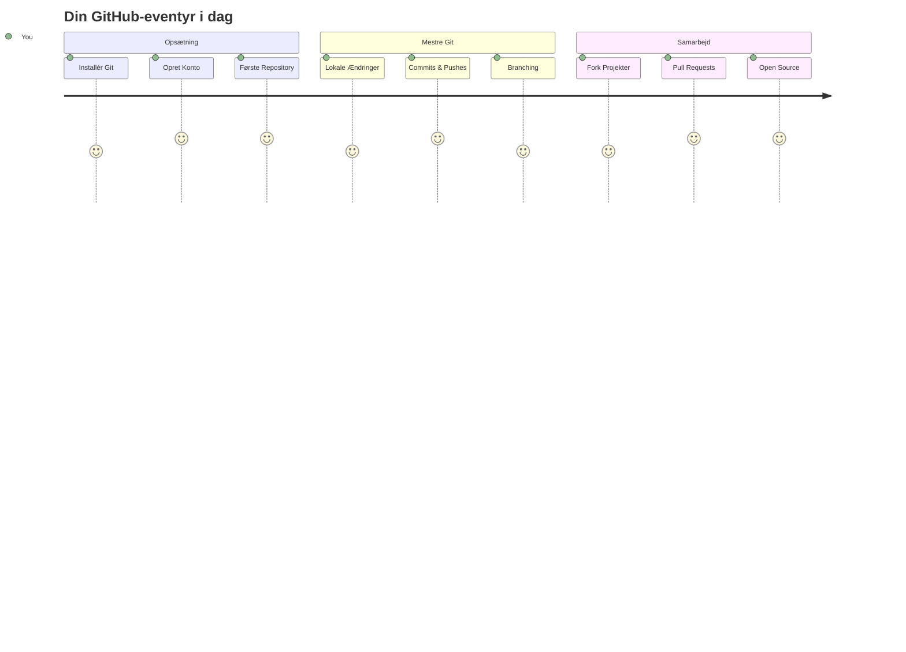
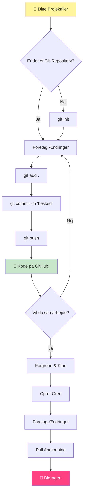
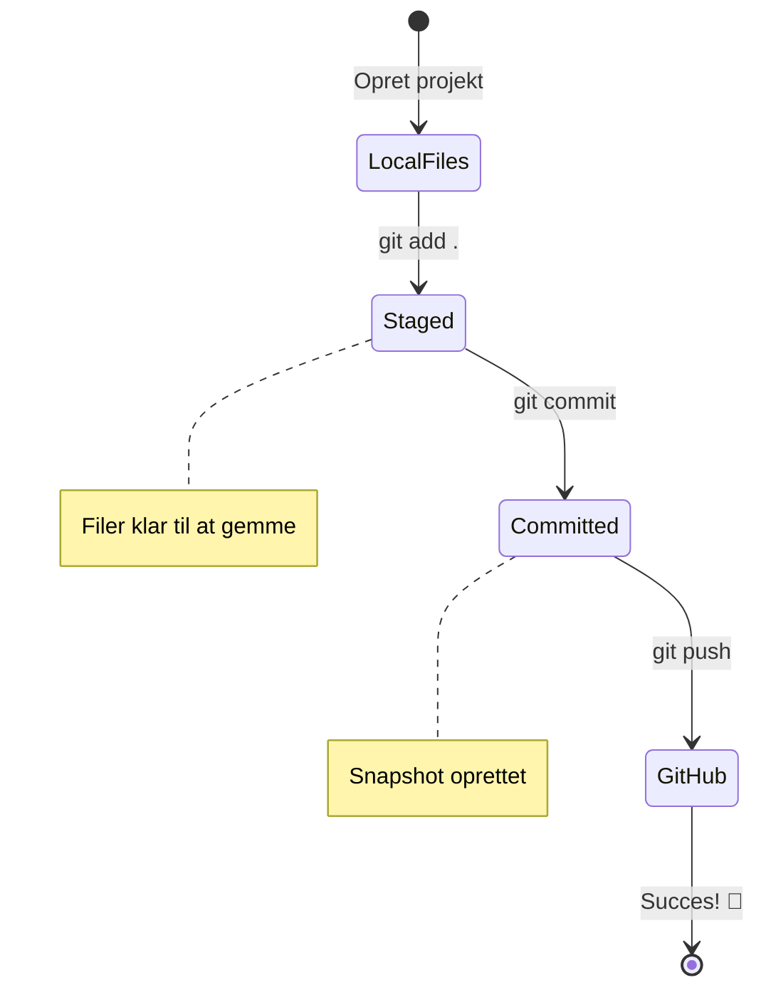
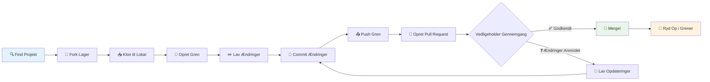
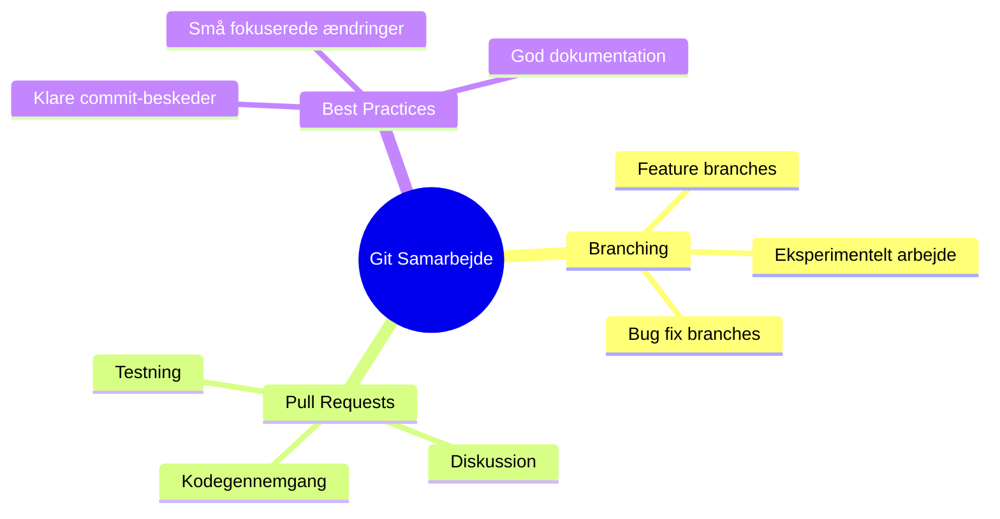
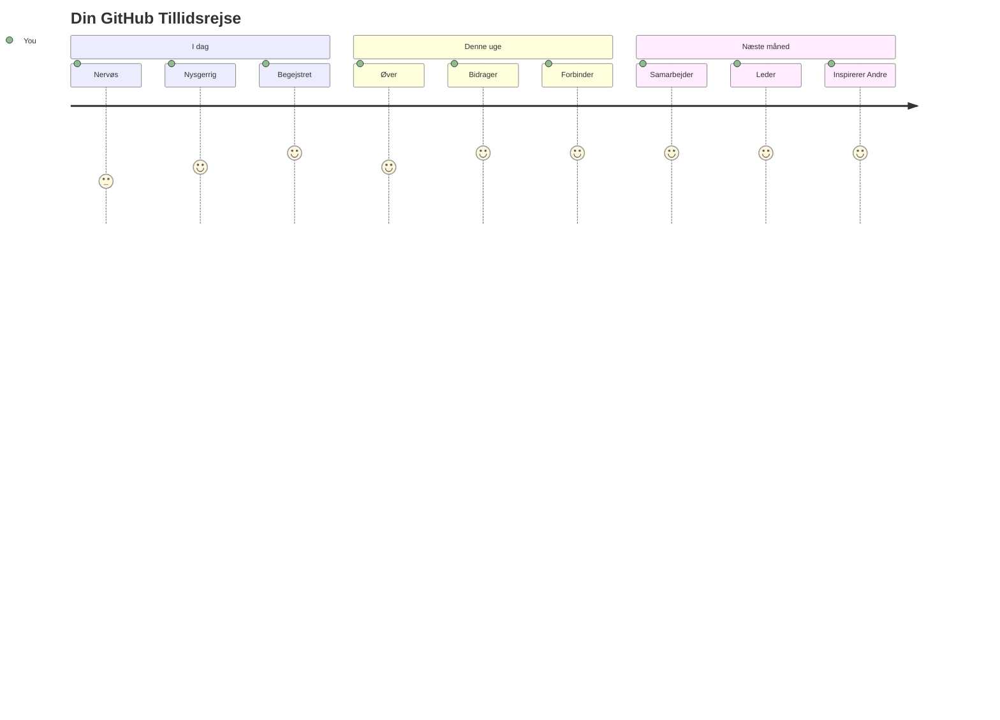

<!--
CO_OP_TRANSLATOR_METADATA:
{
  "original_hash": "5c383cc2cc23bb164b06417d1c107a44",
  "translation_date": "2026-01-07T00:06:45+00:00",
  "source_file": "1-getting-started-lessons/2-github-basics/README.md",
  "language_code": "da"
}
-->
# Introduktion til GitHub

Hej der, kommende udvikler! 👋 Klar til at slutte dig til millioner af programmører rundt om i verden? Jeg er virkelig begejstret for at introducere dig til GitHub – tænk på det som et socialt medie for programmører, bortset fra at i stedet for at dele billeder af din frokost, deler vi kode og bygger utrolige ting sammen!

Her er hvad der virkelig blæser mig omkuld: hver app på din telefon, hver hjemmeside du besøger, og de fleste af de værktøjer, du vil lære at bruge, er bygget af teams af udviklere, der samarbejder på platforme ligesom GitHub. Den musik-app du elsker? Nogen som dig har bidraget til den. Det spil du ikke kan lægge fra dig? Jep, sandsynligvis bygget med GitHub samarbejde. Og nu SKAL DU til at lære, hvordan du bliver en del af det fantastiske fællesskab!

Jeg ved, det måske føles som meget i starten – pokkers, jeg husker at stirre på min første GitHub-side med tanken "Hvad pokker betyder det hele?" Men her er sagen: hver eneste udvikler startede præcis hvor du er lige nu. Når denne lektion er slut, vil du have dit helt eget GitHub repository (tænk på det som dit personlige projektudstilling i skyen), og du vil vide, hvordan du gemmer dit arbejde, deler det med andre og endda bidrager til projekter, som millioner af mennesker bruger.

Vi tager denne rejse sammen, skridt for skridt. Ingen hast, intet pres – bare dig, mig og nogle virkelig fede værktøjer, som snart bliver dine nye bedste venner!


> Sketchnote af [Tomomi Imura](https://twitter.com/girlie_mac)


## For-forelæsning quiz
[For-forelæsning quiz](https://ff-quizzes.netlify.app)

## Introduktion

Før vi dykker ned i det virkelig spændende, lad os gøre din computer klar til noget GitHub-magisk! Tænk på det som at organisere dine kunstmaterialer inden du går i gang med et mesterværk – at have de rigtige værktøjer klar gør alting så meget nemmere og meget sjovere.

Jeg vil guide dig igennem hvert opsætningsskridt personligt, og jeg lover, det er slet ikke så skræmmende, som det måske ser ud ved første øjekast. Hvis noget ikke klikker med det samme, er det helt normalt! Jeg husker at sætte mit første udviklingsmiljø op og følte, det var som at forsøge at læse gamle hieroglyffer. Hver eneste udvikler har været præcis hvor du er lige nu, og spekuleret på, om de gjorde det rigtigt. Spoiler alert: hvis du er her og lærer, gør du det allerede rigtigt! 🌟

I denne lektion vil vi dække:

- sporing af det arbejde du laver på din maskine
- arbejde på projekter med andre
- hvordan du bidrager til open source software

### Forudsætninger

Lad os gøre din computer klar til noget GitHub-magisk! Bare rolig – denne opsætning skal du kun gøre én gang, og så er du klar til hele din kodningsrejse.

Okay, lad os starte med fundamentet! Først skal vi tjekke, om Git allerede er installeret på din computer. Git er dybest set som at have en super klog assistent, der husker hver eneste ændring, du laver i din kode – meget bedre end at hamre på Ctrl+S hvert andet sekund (vi har alle prøvet det!).

Lad os se, om Git allerede er installeret ved at skrive denne magiske kommando i din terminal:
`git --version`

Hvis Git ikke er der endnu, ingen bekymringer! Bare gå til [download Git](https://git-scm.com/downloads) og hent det. Når du har installeret det, skal du introducere Git til dig ordentligt:

> 💡 **Første opsætning**: Disse kommandoer fortæller Git, hvem du er. Denne information bliver knyttet til hver commit, du laver, så vælg et navn og en e-mail, du er komfortabel med at dele offentligt.

```bash
git config --global user.name "your-name"
git config --global user.email "your-email"
```

For at tjekke om Git allerede er konfigureret kan du skrive:
```bash
git config --list
```

Du får også brug for en GitHub-konto, en kodeeditor (f.eks. Visual Studio Code), og du skal åbne din terminal (eller: kommandoprompt).

Gå til [github.com](https://github.com/) og opret en konto, hvis du ikke allerede har en, eller log ind og udfyld din profil.

💡 **Moderne tip**: Overvej at opsætte [SSH keys](https://docs.github.com/en/authentication/connecting-to-github-with-ssh) eller bruge [GitHub CLI](https://cli.github.com/) for nemmere autentificering uden adgangskoder.

✅ GitHub er ikke det eneste kode lager i verden; der findes andre, men GitHub er det mest kendte

### Forberedelse

Du skal bruge både en mappe med et kodeprojekt på din lokale maskine (bærbar eller PC), og et offentligt repository på GitHub, som vil tjene som et eksempel på, hvordan man bidrager til andres projekter.

### Sådan beskytter du din kode

Lad os tale lidt om sikkerhed – men bare rolig, vi vil ikke overvælde dig med skræmmende ting! Tænk på disse sikkerhedspraksisser som at låse din bil eller dit hus. Det er simple vaner, der bliver naturlige og beskytter dit hårde arbejde.

Vi viser dig moderne, sikre måder at arbejde med GitHub på helt fra starten. På den måde udvikler du gode vaner, som vil tjene dig godt i hele din kodningskarriere.

Når du arbejder med GitHub, er det vigtigt at følge bedste sikkerhedspraksis:

| Sikkerhedsområde | Bedste praksis | Hvorfor det er vigtigt |
|------------------|----------------|-----------------------|
| **Autentificering** | Brug SSH keys eller Personlige adgangstokens | Adgangskoder er mindre sikre og på vej ud |
| **To-faktor-autentificering** | Aktivér 2FA på din GitHub-konto | Tilføjer et ekstra lag af beskyttelse for kontoen |
| **Repository sikkerhed** | Committ aldrig følsomme oplysninger | API-nøgler og adgangskoder må aldrig være i offentlige repos |
| **Afhængighedsstyring** | Aktivér Dependabot til opdateringer | Holder dine afhængigheder sikre og opdaterede |

> ⚠️ **Kritisk sikkerhedsadvarsel**: Committ aldrig API-nøgler, adgangskoder eller andre følsomme oplysninger til nogen repository. Brug miljøvariabler og `.gitignore` filer til at beskytte følsomme data.

**Moderne autentificeringsopsætning:**

```bash
# Generer SSH-nøgle (moderne ed25519-algoritme)
ssh-keygen -t ed25519 -C "your_email@example.com"

# Konfigurer Git til at bruge SSH
git remote set-url origin git@github.com:username/repository.git
```

> 💡 **Pro-tip**: SSH keys eliminerer behovet for gentagne adgangskodeindtastninger og er mere sikre end traditionelle autentificeringsmetoder.

---

## Administrer din kode som en professionel

Okay, HER er det, det virkelig bliver spændende! 🎉 Vi skal til at lære, hvordan du sporer og administrerer din kode som profferne, og ærligt talt, det her er en af mine yndlingsting at undervise i, fordi det ændrer virkelig spillet.

Forestil dig det: du skriver en fantastisk historie, og du vil holde styr på hvert udkast, hver genial redigering og hvert "vent, det er genialt!" øjeblik undervejs. Det er præcis, hvad Git gør for din kode! Det er som at have den mest utrolige tidsrejsende notesbog, der husker ALT – hver tastaturtryk, hver ændring, hvert "oops, det brød alt" øjeblik, som du øjeblikkeligt kan fortryde.

Jeg vil være ærlig – det kan føles overvældende i starten. Da jeg begyndte, tænkte jeg "Hvorfor kan jeg ikke bare gemme mine filer som normalt?" Men tro mig på dette: når Git klikker for dig (og det vil det!), vil du få et af de der lyskugle-øjeblikke, hvor du tænker "Hvordan kunne jeg NOGENSINDE kode uden dette?" Det er som at opdage, du kan flyve, når du har gået alle steder hele dit liv!

Lad os sige, du har en mappe lokalt med et kodeprojekt, og du vil begynde at spore din udvikling med git - versionsstyringssystemet. Nogle sammenligner at bruge git med at skrive et kærlighedsbrev til dit fremtidige jeg. Når du læser dine commit-beskeder dage, uger eller måneder senere, kan du huske, hvorfor du tog en beslutning eller "rulle tilbage" en ændring – det kræver selvfølgelig, at du skriver gode "commit-beskeder".


### Opgave: Opret dit første repository!

> 🎯 **Din mission (og jeg er så glad på dine vegne!)**: Vi skal sammen oprette dit allerførste GitHub-repository! Når vi er færdige her, vil du have dit eget lille hjørne af internettet, hvor din kode bor, og du vil have lavet din første "commit" (det er udviklersprog for at gemme dit arbejde på en virkelig smart måde).
>
> Det her er virkelig et særligt øjeblik – du er ved at officielt blive en del af det globale udviklerfællesskab! Jeg husker stadig spændingen ved at oprette mit første repo og tænke "Wow, jeg gør det virkelig!"

Lad os tage denne rejse sammen, trin for trin. Tag dig god tid med hvert trin – der er ingen præmie for at skynde sig, og jeg lover, at hvert enkelt trin vil give mening. Husk, at hver eneste kodestjerne, du beundrer, engang sad præcis hvor du sidder nu, klar til at oprette deres første repository. Hvor fedt er det?

> Se video
> 
> [](https://www.youtube.com/watch?v=9R31OUPpxU4)

**Lad os gøre det sammen:**

1. **Opret dit repository på GitHub**. Gå til GitHub.com og se efter den lysegrønne **New** knap (eller **+** ikonet øverst til højre). Klik på den og vælg **New repository**.

   Her er hvad du skal gøre:
   1. Giv dit repository et navn – vælg noget meningsfuldt for dig!
   1. Tilføj en beskrivelse, hvis du vil (det hjælper andre med at forstå, hvad dit projekt handler om)
   1. Beslut om det skal være offentligt (alle kan se det) eller privat (kun for dig)
   1. Jeg anbefaler at du sætter kryds i boksen for at tilføje en README-fil – det er som forsiden af dit projekt
   1. Klik **Create repository** og fejre – du har lige oprettet dit første repo! 🎉

2. **Naviger til din projektmappe**. Lad os nu åbne din terminal (bare rolig, det er ikke så skræmmende som det ser ud!). Vi skal fortælle din computer, hvor dine projektfiler er. Skriv denne kommando:

   ```bash
   cd [name of your folder]
   ```

   **Hvad vi gør her:**
   - Vi siger dybest set "Hej computer, tag mig til min projektmappe"
   - Det er som at åbne en bestemt mappe på dit skrivebord, men vi gør det med tekstkommandoer
   - Erstat `[name of your folder]` med det faktiske navn på din projektmappe

3. **Gør din mappe til et Git repository**. Det er her magien sker! Skriv:

   ```bash
   git init
   ```

   **Her er hvad der lige skete (ret fedt!):**
   - Git har lige oprettet en skjult `.git` mappe i dit projekt – du kan ikke se den, men den er der!
   - Din almindelige mappe er nu et "repository", der kan spore hver ændring, du laver
   - Tænk på det som at give din mappe superkræfter til at huske alt

4. **Se hvad der sker**. Lad os se, hvad Git tænker om dit projekt lige nu:

   ```bash
   git status
   ```

   **Forstå hvad Git fortæller dig:**
   
   Du kan måske se noget, der ligner dette:

   ```output
   Changes not staged for commit:
   (use "git add <file>..." to update what will be committed)
   (use "git restore <file>..." to discard changes in working directory)

        modified:   file.txt
        modified:   file2.txt
   ```

   **Bare rolig! Her er hvad det betyder:**
   - Filer i **rødt** er filer, der har ændringer, men ikke er klar til at blive gemt endnu
   - Filer i **grønt** (når du ser dem) er klar til at blive gemt
   - Git er hjælpsom ved at fortælle dig præcis, hvad du kan gøre næste

   > 💡 **Pro-tip**: `git status` kommandoen er din bedste ven! Brug den når som helst du er forvirret over, hvad der foregår. Det er som at spørge Git "Hej, hvad sker der lige nu?"

5. **Gør dine filer klar til at blive gemt** (det kaldes "staging"):

   ```bash
   git add .
   ```

   **Hvad vi lige gjorde:**
   - Vi sagde til Git "Hey, jeg vil inkludere ALLE mine filer i næste gemning"
   - `.` betyder "alt i denne mappe"
   - Nu er dine filer "staged" og klar til næste skridt

   **Vil du være mere selektiv?** Du kan tilføje kun udvalgte filer:

   ```bash
   git add [file or folder name]
   ```

   **Hvorfor vil du gøre det?**
   - Nogle gange vil du gemme relaterede ændringer sammen
   - Det hjælper dig med at organisere dit arbejde i logiske bidder
   - Gør det nemmere at forstå, hvad der ændrede sig og hvornår

   **Skiftede du mening?** Bare rolig! Du kan fjerne filer fra staging sådan her:

   ```bash
   # Fjern alt fra staging-området
   git reset
   
   # Fjern kun én fil fra staging-området
   git reset [file name]
   ```

   Bare rolig – det sletter ikke dit arbejde, det tager bare filerne ud af "klar til at gemme" bunken.

6. **Gem dit arbejde permanent** (lav din første commit!):

   ```bash
   git commit -m "first commit"
   ```

   **🎉 Tillykke! Du har lige lavet din første commit!**
   
   **Her er hvad der lige skete:**
   - Git tog et "snapshot" af alle dine staged filer på dette præcise tidspunkt
   - Din commit-besked "first commit" forklarer, hvad dette gemmepunkt går ud på
   - Git gav dette snapshot en unik ID, så du altid kan finde det igen
   - Du er officielt begyndt at spore dit projekts historie!

   > 💡 **Fremtidige commit-beskeder**: Vær mere beskrivende næste gang! I stedet for "updated stuff" prøv "Tilføj kontaktformular på forsiden" eller "Fix navigation menu bug". Dit fremtidige jeg vil takke dig!

7. **Forbind dit lokale projekt til GitHub**. Lige nu findes dit projekt kun på din computer. Lad os forbinde det til dit GitHub-repository, så du kan dele det med verden!

   Gå først til din GitHub-repository side og kopier URL’en. Kom så tilbage her og skriv:

   ```bash
   git remote add origin https://github.com/username/repository_name.git
   ```
   
   (Erstat den URL med den faktiske URL til dit repository!)

   **Hvad vi lige gjorde:**
   - Vi har oprettet en forbindelse mellem dit lokale projekt og dit GitHub-repositorium
   - "Origin" er bare et kælenavn for dit GitHub-repositorium – det er som at tilføje en kontakt til din telefon
   - Nu ved din lokale Git, hvor den skal sende din kode, når du er klar til at dele den

   💡 **Nemmere måde**: Hvis du har GitHub CLI installeret, kan du gøre det med én kommando:
   ```bash
   gh repo create my-repo --public --push --source=.
   ```

8. **Send din kode til GitHub** (det store øjeblik!):

   ```bash
   git push -u origin main
   ```

   **🚀 Det er det! Du uploader din kode til GitHub!**
   
   **Hvad sker der:**
   - Dine commits rejser fra din computer til GitHub
   - `-u` flaget opretter en permanent forbindelse, så fremtidige pushes bliver nemmere
   - "main" er navnet på din primære branch (ligesom hovedmappen)
   - Efter dette kan du bare skrive `git push` for fremtidige uploads!

   💡 **Hurtig note**: Hvis din branch hedder noget andet (som "master"), brug det navn i stedet. Du kan tjekke med `git branch --show-current`.

9. **Din nye daglige kode-rytme** (her bliver det vanedannende!):

   Fra nu af, hver gang du laver ændringer i dit projekt, har du denne simple tre-trins dans:

   ```bash
   git add .
   git commit -m "describe what you changed"
   git push
   ```

   **Dette bliver din kodehjerterytme:**
   - Lav nogle fantastiske ændringer til din kode ✨
   - Stage dem med `git add` ("Hey Git, læg mærke til disse ændringer!")
   - Gem dem med `git commit` og en beskrivende besked (fremtidige dig takker dig!)
   - Del dem med verden med `git push` 🚀
   - Gentag – seriøst, det bliver ligeså naturligt som at trække vejret!

   Jeg elsker denne arbejdsgang, fordi det er som at have flere gemmepunkter i et videospil. Lavede du en ændring, du elsker? Commit den! Vil du prøve noget risikabelt? Intet problem – du kan altid gå tilbage til din sidste commit, hvis ting går galt!

   > 💡 **Tip**: Du vil måske også bruge en `.gitignore` fil for at forhindre, at filer du ikke ønsker at tracke, dukker op på GitHub – som den noter-fil, du gemmer i samme mappe, men som ikke hører hjemme i et offentligt repo. Du kan finde templates til `.gitignore` filer på [.gitignore templates](https://github.com/github/gitignore) eller lave en via [gitignore.io](https://www.toptal.com/developers/gitignore).

### 🧠 **Første Repository Check-in: Hvordan Føltes Det?**

**Tag et øjeblik til at fejre og reflektere:**
- Hvordan føltes det at se din kode dukke op på GitHub for første gang?
- Hvilket trin føltes mest forvirrende, og hvilket føltes overraskende nemt?
- Kan du forklare forskellen mellem `git add`, `git commit` og `git push` med dine egne ord?


> **Husk**: Selv erfarne udviklere glemmer somme tider præcist kommandoerne. At denne arbejdsgang bliver til muskler kræver øvelse – du gør det godt!

#### Moderne Git arbejdsgange

Overvej at bruge disse moderne praksisser:

- **Konventionelle Commit-beskeder**: Brug et standardiseret format som `feat:`, `fix:`, `docs:`, osv. Læs mere på [conventionalcommits.org](https://www.conventionalcommits.org/)
- **Atome commits**: Hver commit repræsenterer en enkelt logisk ændring
- **Hyppige commits**: Commit ofte med beskrivende beskeder i stedet for store, sjældne commits

#### Commit-beskeder

En god Git commit-overskrift færdiggør denne sætning:
Hvis anvendt, vil denne commit <din overskrift her>

Brug imperativ, nutid: "ændre" ikke "ændret" eller "ændringer". 
Som i overskriften, brug også i brødteksten (valgfri) imperativ nutid. Brødteksten skal inkludere motivationen for ændringen og kontrastere med tidligere opførsel. Du forklarer `hvorfor`, ikke `hvordan`.

✅ Tag et par minutter til at surfe rundt på GitHub. Kan du finde en virkelig god commit-besked? Kan du finde en virkelig minimal én? Hvilken information synes du er mest vigtig og nyttig at formidle i en commit-besked?

## Arbejde med Andre (Den Sjove Del!)

Hold fast i din hat, for HER bliver GitHub rent magisk! 🪄 Du har mestret at styre din egen kode, men nu dykker vi ned i min absolut yndlingsdel – samarbejde med fantastiske folk fra hele verden.

Forestil dig dette: Du vågner op i morgen og ser, at nogen i Tokyo forbedrede din kode, mens du sov. Så retter nogen i Berlin en fejl, du har siddet fast i. Om eftermiddagen har en udvikler i São Paulo tilføjet en funktion, du aldrig engang havde tænkt på. Det er ikke science fiction – det er bare en tirsdag i GitHub-universet!

Det, der virkelig begejstrer mig, er at de samarbejdsevner, du er ved at lære? Det er præcis de samme arbejdsgange, som teams hos Google, Microsoft og dine yndlings-startups bruger hver dag. Du lærer ikke bare et sejt værktøj – du lærer det hemmelige sprog, der får hele softwareverdenen til at fungere sammen.

Seriøst, når du oplever suset ved at få nogen til at merge din første pull request, forstår du, hvorfor udviklere bliver så passionerede omkring open source. Det er som at være en del af verdens største, mest kreative teamprojekt!

> Se video
>
> [](https://www.youtube.com/watch?v=bFCM-PC3cu8)

Hovedårsagen til at lægge ting på GitHub var at gøre det muligt at samarbejde med andre udviklere.


I dit repository, gå til `Insights > Community` for at se, hvordan dit projekt sammenlignes med anbefalede community-standarder.

Vil du gøre dit repository professionelt og indbydende? Gå til dit repository og klik på `Insights > Community`. Denne seje funktion viser dig, hvordan dit projekt sammenlignes med, hvad GitHub-fællesskabet anser for "gode repository-praksisser."

> 🎯 **Få dit projekt til at skinne**: Et godt organiseret repository med god dokumentation er som en ren, indbydende butiksvindue. Det fortæller folk, at du tager dit arbejde seriøst og får andre til at ville bidrage!

**Her er hvad der gør et repository fantastisk:**

| Hvad der skal tilføjes | Hvorfor det er vigtigt | Hvad det gør for dig |
|------------------------|------------------------|---------------------|
| **Beskrivelse** | Det første indtryk tæller! | Folk ved med det samme, hvad dit projekt gør |
| **README** | Dit projekts forside | Som en venlig guide for nye besøgende |
| **Bidragsretningslinjer** | Viser at du byder hjælp velkommen | Folk ved præcis, hvordan de kan hjælpe dig |
| **Adfærdskodeks** | Skaber et venligt miljø | Alle føler sig velkomne til at deltage |
| **Licens** | Juridisk klarhed | Andre ved, hvordan de må bruge din kode |
| **Sikkerhedspolitik** | Viser, at du tager ansvar | Demonstrerer professionelle praksisser |

> 💡 **Pro Tip**: GitHub tilbyder templates til alle disse filer. Når du opretter et nyt repository, kan du flueben i for automatisk at generere disse filer.

**Moderne GitHub-funktioner at udforske:**

🤖 **Automation & CI/CD:**
- **GitHub Actions** til automatiseret test og deployment
- **Dependabot** til automatiske opdateringer af afhængigheder

💬 **Community & Projektstyring:**
- **GitHub Discussions** til samtaler i fællesskabet ud over issues
- **GitHub Projects** til kanban-stil projektstyring
- **Branch-beskyttelsesregler** for at håndhæve kodekvalitetsstandarder


Alle disse ressourcer hjælper med onboarding af nye teammedlemmer. Og det er typisk det, nye bidragsydere kigger på, før de kigger på din kode, for at finde ud af, om dit projekt er det rette sted for dem at bruge deres tid.

✅ README-filer, selvom de tager tid at forberede, bliver ofte negligeret af travle vedligeholdere. Kan du finde et eksempel på en særlig beskrivende en? Bemærk: der findes nogle [værktøjer til at hjælpe med at skabe gode README-filer](https://www.makeareadme.com/), som du måske vil prøve.

### Opgave: Merge noget kode

Bidragsdokumenter hjælper folk med at bidrage til projektet. Det forklarer, hvilke slags bidrag du leder efter, og hvordan processen fungerer. Bidragsydere skal igennem en række trin for at kunne bidrage til dit repo på GitHub:


1. **Fork dit repo** Du vil nok gerne have, at folk _forker_ dit projekt. At forke betyder at lave en kopi af dit repository på deres egen GitHub-profil.
1. **Clone** Derfra kloner de projektet til deres lokale maskine. 
1. **Opret en branch** Du vil bede dem om at oprette en _branch_ til deres arbejde. 
1. **Fokusér ændringen på ét område** Bed bidragsydere om at koncentrere deres bidrag om ét ting ad gangen – på den måde er chancerne for, at du kan _merge_ deres arbejde, højere. Forestil dig, at de laver en fejlrettelse, tilføjer en ny funktion og opdaterer flere tests – hvad hvis du vil, eller kun kan implementere 2 ud af 3, eller 1 ud af 3 ændringer?

✅ Forestil dig en situation, hvor branches er særligt afgørende for at skrive og levere god kode. Hvilke brugsscenarier kan du komme i tanke om?

> Bemærk, vær den forandring du ønsker at se i verden, og lav også branches til dit eget arbejde. Alle commits du laver, bliver lavet på den branch, du i øjeblikket er “tjekket ud” til. Brug `git status` for at se, hvilken branch det er.

Lad os se på en bidragsyder-arbejdsgang. Antag, at bidragsyderen allerede har _forket_ og _klonet_ repoet, så de har et Git repo klar til arbejde på deres lokale maskine:

1. **Opret en branch** Brug kommandoen `git branch` til at oprette en branch, der indeholder de ændringer, de vil bidrage med:

   ```bash
   git branch [branch-name]
   ```

   > 💡 **Moderne tilgang**: Du kan også oprette og skifte til den nye branch med én kommando:
   ```bash
   git switch -c [branch-name]
   ```

1. **Skift til arbejdsbranch** Skift til den angivne branch og opdater arbejdsområdet med `git switch`:

   ```bash
   git switch [branch-name]
   ```

   > 💡 **Moderne note**: `git switch` er den moderne erstatning for `git checkout` ved brancheskift. Det er tydeligere og sikrere for begyndere.

1. **Arbejd** Nu skal du tilføje dine ændringer. Glem ikke at fortælle Git om det med følgende kommandoer:

   ```bash
   git add .
   git commit -m "my changes"
   ```

   > ⚠️ **Kvalitet på commit-beskeden**: Sørg for at give din commit et godt navn, både for din egen skyld og for maintaineren af det repo, du hjælper med. Vær konkret omkring, hvad du ændrede!

1. **Kombinér dit arbejde med `main` branchen** På et tidspunkt er du færdig med at arbejde, og du ønsker at kombinere dit arbejde med `main` branchen. `main` kan være ændret i mellemtiden, så sørg først for at opdatere den til den nyeste version med følgende kommandoer:

   ```bash
   git switch main
   git pull
   ```

   Nu vil du sikre, at eventuelle _konflikter_, situationer hvor Git ikke let kan _kombinere_ ændringerne, sker i din arbejdsbranch. Derfor kør følgende kommandoer:

   ```bash
   git switch [branch_name]
   git merge main
   ```

   `git merge main` kommandoen henter alle ændringer fra `main` ind i din branch. Forhåbentlig kan du bare fortsætte. Hvis ikke, vil VS Code fortælle dig, hvor Git er _forvirret_, og så kan du ændre de berørte filer for at angive, hvilket indhold der er mest korrekt.

   💡 **Moderne alternativ**: Overvej at bruge `git rebase` for en renere historik:
   ```bash
   git rebase main
   ```
   Dette "afspiller" dine commits oven på den nyeste main-branch og skaber en lineær historik.

1. **Send dit arbejde til GitHub** At sende dit arbejde til GitHub indebærer to ting. Pushe din branch til dit repo og derefter oprette en PR, Pull Request.

   ```bash
   git push --set-upstream origin [branch-name]
   ```

   Ovenstående kommando opretter branchen på dit forkede repo.

### 🤝 **Samarbejdsevner Check: Klar til at arbejde med andre?**

**Lad os se, hvordan du føler om samarbejde:**
- Giver ideen om forking og pull requests mening for dig nu?
- Hvad er én ting ved at arbejde med branches, som du gerne vil øve mere?
- Hvor tryg føler du dig ved at bidrage til andres projekter?


> **Selvtillidsboost**: Hver eneste udvikler, du beundrer, var engang nervøs for deres første pull request. GitHub-fællesskabet er utroligt imødekommende overfor nye!

1. **Åbn en PR** Dernæst vil du åbne en PR. Det gør du ved at navigere til det forkede repo på GitHub. Du vil se en indikation på GitHub, hvor det spørger, om du vil oprette en ny PR, klik på den, og du kommer til et interface, hvor du kan ændre commit-besked titel og give en mere passende beskrivelse. Nu vil maintaineren af det repo, du forkede, se denne PR og _finger kryds_ de vil sætte pris på og _merge_ din PR. Du er nu en bidragsyder, yay :)

   💡 **Moderne tip**: Du kan også oprette PRs vha. GitHub CLI:
   ```bash
   gh pr create --title "Your PR title" --body "Description of changes"
   ```

   🔧 **Bedste praksis for PRs**:
   - Link til relaterede issues med nøgleord som "Fixes #123"
   - Tilføj screenshots for UI-ændringer
   - Anmod om specifikke reviewers
   - Brug draft PRs til arbejde under udvikling
   - Sørg for at alle CI checks er bestået, før du anmoder om review
1. **Ryd op**. Det betragtes som god praksis at _rydde op_ efter du med succes har flettet en PR. Du vil gerne rydde op både i din lokale gren og den gren, du har pushet til GitHub. Lad os først slette den lokalt med følgende kommando:

   ```bash
   git branch -d [branch-name]
   ```

   Sørg for at gå til GitHub-siden for den forkede repo bagefter og fjern den remote gren, du lige har pushet til den.

`Pull request` virker som et mærkeligt udtryk, fordi du egentlig vil pushe dine ændringer til projektet. Men vedligeholderen (projektets ejer) eller kerne teamet skal overveje dine ændringer, før de flettes med projektets "main" gren, så du anmoder egentlig en vedligeholder om at træffe en beslutning om ændringen.

En pull request er stedet at sammenligne og diskutere forskellene, der introduceres på en gren med anmeldelser, kommentarer, integrerede tests og mere. En god pull request følger omtrent de samme regler som en commit-besked. Du kan tilføje en reference til et issue i issues-trackeren, når dit arbejde for eksempel løser et problem. Dette gøres med en `#` efterfulgt af nummeret på dit issue. For eksempel `#97`.

🤞Fingre krydsede for, at alle checks passerer, og at projektets ejer(e) fletter dine ændringer ind i projektet🤞

Opdater din aktuelle lokale arbejdsgren med alle nye commits fra den tilsvarende remote gren på GitHub:

`git pull`

## Bidrage til Open Source (Din Chance for at Gøre en Forskel!)

Er du klar til noget, der vil blæse dit sind helt væk? 🤯 Lad os tale om at bidrage til open source-projekter – og jeg får gåsehud bare ved at tænke på at dele dette med dig!

Dette er din chance for at blive en del af noget virkelig ekstraordinært. Forestil dig at forbedre de værktøjer, som millioner af udviklere bruger hver dag, eller at rette en fejl i en app, som dine venner elsker. Det er ikke bare en drøm – det er det, open source-bidrag handler om!

Her er hvad der giver mig kuldegysninger hver gang, jeg tænker på det: hvert eneste værktøj, du har lært med – din kodeeditor, de frameworks vi skal udforske, selv browseren du læser dette i – startede med nogen præcis som dig, som lavede deres allerførste bidrag. Den fantastiske udvikler, der byggede din yndlings VS Code-udvidelse? De var engang en begynder, der klikkede på "create pull request" med rystende hænder, ligesom du er ved at gøre nu.

Og her kommer det smukkeste: open source-fællesskabet er som internettets største gruppe-kram. De fleste projekter leder aktivt efter nye mennesker og har issues markeret med "good first issue" specifikt for folk som dig! Vedligeholdere bliver oprigtigt begejstrede, når de ser nye bidragydere, fordi de husker deres egne første skridt.

```mermaid
flowchart TD
    A[🔍 Udforsk GitHub] --> B[🏷️ Find "god første opgave"]
    B --> C[📖 Læs bidragsvejledning]
    C --> D[🍴 Fork repository]
    D --> E[💻 Opsæt lokal miljø]
    E --> F[🌿 Opret feature-branch]
    F --> G[✨ Lav dit bidrag]
    G --> H[🧪 Test dine ændringer]
    H --> I[📝 Skriv klar commit]
    I --> J[📤 Push & opret PR]
    J --> K[💬 Engager dig i feedback]
    K --> L[🎉 Merged! Du er en bidragyder!]
    L --> M[🌟 Find næste opgave]
    
    style A fill:#e1f5fe
    style L fill:#c8e6c9
    style M fill:#fff59d
```
Du lærer ikke bare at kode her – du forbereder dig på at slutte dig til en global familie af skabere, der vågner op hver dag og tænker "Hvordan kan vi gøre den digitale verden en smule bedre?" Velkommen til klubben! 🌟

Først, lad os finde et repository (eller **repo**) på GitHub, som interesserer dig, og som du gerne vil bidrage til med en ændring. Du vil gerne kopiere dets indhold til din maskine.

✅ En god måde at finde 'begynder-venlige' repos er at [søgge efter tagget 'good-first-issue'](https://github.blog/2020-01-22-browse-good-first-issues-to-start-contributing-to-open-source/).


Der er flere måder at kopiere kode på. En måde er at "klone" indholdet af repositoryet, ved brug af HTTPS, SSH, eller GitHub CLI (Command Line Interface).

Åbn din terminal og klon repositoryet således:
```bash
# Bruger HTTPS
git clone https://github.com/ProjectURL

# Bruger SSH (kræver opsætning af SSH-nøgle)
git clone git@github.com:username/repository.git

# Bruger GitHub CLI
gh repo clone username/repository
```

For at arbejde på projektet, skift til den rigtige mappe:
`cd ProjectURL`

Du kan også åbne hele projektet med:
- **[GitHub Codespaces](https://github.com/features/codespaces)** - GitHubs sky-udviklingsmiljø med VS Code i browseren
- **[GitHub Desktop](https://desktop.github.com/)** - En GUI-applikation til Git-operationer  
- **[GitHub.dev](https://github.dev)** - Tryk på `.` tasten på et vilkårligt GitHub repo for at åbne VS Code i browseren
- **VS Code** med GitHub Pull Requests-udvidelsen

Endelig kan du downloade koden i en zip-mappe.

### Et par flere interessante ting om GitHub

Du kan stjerne, overvåge og/eller "forke" ethvert offentligt repository på GitHub. Du kan finde dine stjernemarkerede repositories i dropdown-menuen øverst til højre. Det er som bogmærker, men til kode.

Projekter har en issue tracker, for det meste på GitHub under fanen "Issues" medmindre andet er angivet, hvor folk diskuterer problemer relateret til projektet. Og tabben Pull Requests er hvor folk diskuterer og gennemgår igangværende ændringer.

Projekter kan også have diskussioner i fora, mailinglister eller chatkanaler som Slack, Discord eller IRC.

🔧 **Moderne GitHub funktioner**:
- **GitHub Discussions** - Indbygget forum til fællesskabs-samtaler
- **GitHub Sponsors** - Støt vedligeholdere økonomisk  
- **Security tab** - Sårbarhedsrapporter og sikkerhedsadvarsler
- **Actions tab** - Se automatiserede workflows og CI/CD pipelines
- **Insights tab** - Analyse af bidragydere, commits og projektsundhed
- **Projects tab** - GitHubs indbyggede projektstyringsværktøjer

✅ Kig lidt rundt i dit nye GitHub repo og prøv et par ting, som at redigere indstillinger, tilføje information til dit repo, oprette et projekt (som et Kanban board), og sætte GitHub Actions op til automation. Der er meget, du kan gøre!

---

## 🚀 Udfordring

Okay, det er tid til at teste dine skinnende nye GitHub superkræfter! 🚀 Her er en udfordring, der vil få det hele til at falde på plads på den mest tilfredsstillende måde:

Tag en ven (eller et familiemedlem, der altid spørger, hvad du laver med alt det "computerhalløj") og gå på en fælles kodningsrejse sammen! Her sker den ægte magi – opret et projekt, lad dem forke det, lav nogle grene, og flet ændringer som de professionelle, du er ved at blive.

Jeg vil ikke lyve – I kommer sikkert til at grine på et tidspunkt (især når I begge forsøger at ændre den samme linje), måske klø jer i hovedet i forvirring, men I får helt sikkert de fantastiske "aha!"-øjeblikke, der gør alt læringen værd. Plus, der er noget særligt ved at dele den første succesfulde fletning med en anden – det er som en lille fejring af, hvor langt du er kommet!

Har du ikke en kodebuddy endnu? Intet problem! GitHub-fællesskabet er fyldt med utroligt imødekommende mennesker, der husker, hvordan det var at være ny. Kig efter repositories med mærket "good first issue" – de siger egentlig "Hej begyndere, kom og lær med os!" Ganske fantastisk, ikke?

## Post-forelæsning quiz
[Post-lecture quiz](https://ff-quizzes.netlify.app/web/en/)

## Gennemgå & Bliv ved med at lære

Puha! 🎉 Se bare på dig – du har lige mestret GitHub-grundlæggende som en ægte mester! Hvis din hjerne føles lidt fyldt lige nu, er det helt normalt og faktisk et godt tegn. Du har lige lært værktøjer, som det tog mig uger at føle mig tryg ved, da jeg startede.

Git og GitHub er utroligt kraftfulde (altså, seriøst kraftfulde), og hver udvikler jeg kender – inklusiv dem der nu virker som troldmænd – måtte øve sig og snuble lidt, før det hele faldt på plads. Det faktum, at du har klaret denne lektion, betyder, at du allerede er godt på vej til at mestre nogle af de vigtigste værktøjer i en udviklers værktøjskasse.

Her er nogle helt fantastiske ressourcer til at hjælpe dig med at øve og blive endnu sejere:

- [Contributing to open source software guide](https://opensource.guide/how-to-contribute/#how-to-submit-a-contribution) – Din køreplan til at gøre en forskel
- [Git cheatsheet](https://training.github.com/downloads/github-git-cheat-sheet/) – Hav denne ved hånden til hurtig reference!

Og husk: øvelse gør fremskridt, ikke perfektion! Jo mere du bruger Git og GitHub, desto mere naturligt bliver det. GitHub har lavet nogle fantastiske interaktive kurser, der lader dig øve i et sikkert miljø:

- [Introduction to GitHub](https://github.com/skills/introduction-to-github)
- [Communicate using Markdown](https://github.com/skills/communicate-using-markdown)  
- [GitHub Pages](https://github.com/skills/github-pages)
- [Managing merge conflicts](https://github.com/skills/resolve-merge-conflicts)

**Føler du dig eventyrlysten? Prøv disse moderne værktøjer:**
- [GitHub CLI documentation](https://cli.github.com/manual/) – Til når du vil føle dig som en kommandolinjemagi
- [GitHub Codespaces documentation](https://docs.github.com/en/codespaces) – Kode i skyen!
- [GitHub Actions documentation](https://docs.github.com/en/actions) – Automatiser alle tingene
- [Git best practices](https://www.atlassian.com/git/tutorials/comparing-workflows) – Opgrader dit workflow-spil

## GitHub Copilot Agent Udfordring 🚀

Brug Agent-tilstand til at gennemføre følgende udfordring:

**Beskrivelse:** Opret et samarbejds-baseret webudviklingsprojekt, der demonstrerer den fulde GitHub-workflow, du har lært i denne lektion. Denne udfordring vil hjælpe dig med at øve repository-oprettelse, samarbejdsfunktioner og moderne Git-workflows i en realistisk scenarie.

**Prompt:** Opret et nyt offentligt GitHub-repository til et simpelt "Web Development Resources" projekt. Repositoryet bør inkludere en velstruktureret README.md-fil, der lister nyttige webudviklingsværktøjer og ressourcer, organiseret efter kategorier (HTML, CSS, JavaScript osv.). Opsæt repositoryet med passende fællesskabsstandarder inklusive en licens, bidragsretningslinjer og en adfærdskodeks. Opret mindst to feature-branches: en til tilføjelse af CSS-ressourcer og en anden til JavaScript-ressourcer. Lav commits til hver gren med beskrivende commit-beskeder, og opret derefter pull requests for at flette ændringerne tilbage til main. Aktivér GitHub-funktioner som Issues, Discussions, og opsæt en grundlæggende GitHub Actions workflow for automatiserede checks.

## Opgave

Din mission, hvis du vælger at acceptere den: Gennemfør [Introduction to GitHub](https://github.com/skills/introduction-to-github) kurset på GitHub Skills. Dette interaktive kursus lader dig øve alt, hvad du har lært, i et sikkert, vejledt miljø. Derudover får du et fedt badge, når du er færdig! 🏅

**Klar til flere udfordringer?**
- Opsæt SSH-autentificering til din GitHub-konto (ingen flere adgangskoder!)
- Prøv at bruge GitHub CLI til dine daglige Git-operationer
- Opret et repository med en GitHub Actions workflow
- Udforsk GitHub Codespaces ved at åbne dette repository i en cloud-baseret editor

---

## 🚀 Din GitHub Mesterskabs Tidslinje

### ⚡ **Hvad du kan gøre inden for de næste 5 minutter**
- [ ] Stjerne dette repository og 3 andre projekter, der interesserer dig
- [ ] Opsæt to-faktor autentificering på din GitHub-konto
- [ ] Opret en simpel README til dit første repository
- [ ] Følg 5 udviklere, hvis arbejde inspirerer dig

### 🎯 **Hvad du kan nå på den næste time**
- [ ] Fuldfør quizzen efter lektionen og reflekter over din GitHub-rejse
- [ ] Opsæt SSH-nøgler for adgangskodefri GitHub autentificering
- [ ] Lav din første meningsfulde commit med en fremragende commit-besked
- [ ] Udforsk GitHubs "Explore"-fane for at opdage trending projekter
- [ ] Øv dig i at forke et repository og lave en lille ændring

### 📅 **Din ugelange GitHub-oplevelse**
- [ ] Fuldfør GitHub Skills-kurserne (Introduction to GitHub, Markdown)
- [ ] Lav din første pull request til et open source-projekt
- [ ] Opsæt en GitHub Pages-side til at fremvise dit arbejde
- [ ] Deltag i GitHub Discussions om projekter, du interesserer dig for
- [ ] Opret et repository med passende fællesskabsstandarder (README, Licens osv.)
- [ ] Prøv GitHub Codespaces til cloud-baseret udvikling

### 🌟 **Din månedslange forvandling**
- [ ] Bidrag til 3 forskellige open source-projekter
- [ ] Vær mentor for nogen, der er nye til GitHub (giv videre!)
- [ ] Opsæt automatiserede workflows med GitHub Actions
- [ ] Byg en portfolio, der viser dine GitHub-bidrag
- [ ] Deltag i Hacktoberfest eller lignende fællesskabsbegivenheder
- [ ] Bliv vedligeholder af dit eget projekt, som andre bidrager til

### 🎓 **Endelig GitHub Mesterskabs Check-in**

**Fejr hvor langt du er nået:**
- Hvad er dit yndlingsaspekt ved at bruge GitHub?
- Hvilken samarbejdsfunktion begejstrer dig mest?
- Hvor selvsikker føler du dig i forhold til at bidrage til open source nu?
- Hvilket projekt vil du gerne bidrage til som det første?


> 🌍 **Velkommen til det globale udviklerfællesskab!** Du har nu værktøjerne til at samarbejde med millioner af udviklere verden over. Dit første bidrag kan virke lille, men husk – hvert stort open source-projekt startede med nogen, der lavede deres allerførste commit. Spørgsmålet er ikke, om du vil gøre en forskel, men hvilket fantastisk projekt der først vil få gavn af dit unikke perspektiv! 🚀

Husk: enhver ekspert har engang været begynder. Du klarer det! 💪

---

<!-- CO-OP TRANSLATOR DISCLAIMER START -->
**Ansvarsfraskrivelse**:
Dette dokument er oversat ved hjælp af AI-oversættelsestjenesten [Co-op Translator](https://github.com/Azure/co-op-translator). Selvom vi bestræber os på nøjagtighed, skal du være opmærksom på, at automatiske oversættelser kan indeholde fejl eller unøjagtigheder. Det oprindelige dokument på originalsproget bør betragtes som den autoritative kilde. For kritisk information anbefales professionel menneskelig oversættelse. Vi påtager os intet ansvar for misforståelser eller fejltolkninger, der opstår som følge af brugen af denne oversættelse.
<!-- CO-OP TRANSLATOR DISCLAIMER END -->