<!--
CO_OP_TRANSLATOR_METADATA:
{
  "original_hash": "7f2c48e04754724123ea100a822765e5",
  "translation_date": "2026-01-07T00:01:22+00:00",
  "source_file": "1-getting-started-lessons/3-accessibility/README.md",
  "language_code": "da"
}
-->
# Oprettelse af Tilgængelige Websider


> Sketchnote af [Tomomi Imura](https://twitter.com/girlie_mac)

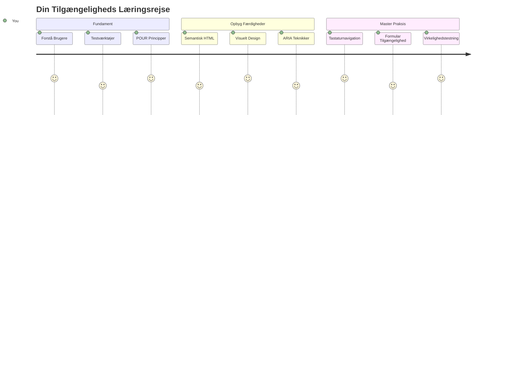
## For-forelæsning Quiz
[For-forelæsning quiz](https://ff-quizzes.netlify.app/web/)

> Internettets styrke er i dets universalitet. Adgang for alle uanset handicap er et essentielt aspekt.
>
> \- Sir Timothy Berners-Lee, W3C-direktør og opfinder af World Wide Web

Her er noget, der måske overrasker dig: når du bygger tilgængelige websites, hjælper du ikke kun mennesker med handicap—du gør faktisk internettet bedre for alle!

Har du nogensinde lagt mærke til de nedkørsler ved fortovene? De blev oprindeligt designet til kørestole, men de hjælper nu mennesker med barnevogne, leveringsfolk med vogne, rejsende med kufferter på hjul og cyklister også. Det er præcis sådan tilgængeligt webdesign fungerer—løsninger, der hjælper én gruppe, ender ofte med at gavne alle. Ret sejt, ikke?

I denne lektion skal vi udforske, hvordan man skaber websites, der virkelig fungerer for alle, uanset hvordan de browser nettet. Du vil opdage praktiske teknikker, der allerede er indbygget i webstandarder, få praktisk erfaring med testværktøjer, og se hvordan tilgængelighed gør dine sites mere brugervenlige for alle brugere.

Ved slutningen af denne lektion vil du have selvtillid til at gøre tilgængelighed til en naturlig del af din udviklingsarbejdsgang. Klar til at udforske hvordan gennemtenkte designvalg kan åbne nettet for milliarder af brugere? Lad os gå i gang!

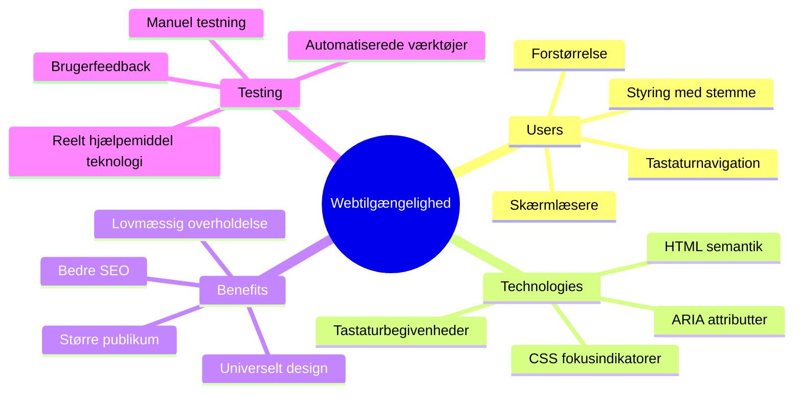
> Du kan tage denne lektion på [Microsoft Learn](https://docs.microsoft.com/learn/modules/web-development-101/accessibility/?WT.mc_id=academic-77807-sagibbon)!

## Forståelse af Hjælpemidler

Før vi springer ud i kodningen, lad os tage et øjeblik til at forstå, hvordan folk med forskellige evner faktisk oplever nettet. Det er ikke bare teori—forståelse af disse virkelige navigationsmønstre vil gøre dig til en meget bedre udvikler!

Hjælpemidler er ret fantastiske værktøjer, der hjælper mennesker med handicap med at interagere med websites på måder, der måske overrasker dig. Når du først er kommet ind i, hvordan disse teknologier fungerer, bliver det meget mere intuitivt at skabe tilgængelige weboplevelser. Det er som at lære at se din kode gennem en anden persons øjne.

### Skærmlæsere

[Skærmlæsere](https://en.wikipedia.org/wiki/Screen_reader) er ret avancerede teknologier, der omdanner digital tekst til tale eller braille-output. Selvom de primært bruges af personer med synsnedsættelse, er de også super hjælpsomme for brugere med læringsvanskeligheder som dysleksi.

Jeg kan godt lide at tænke på en skærmlæser som en rigtig smart oplæser, der læser en bog for dig. Den læser indhold højt i en logisk rækkefølge, annoncerer interaktive elementer som "knap" eller "link," og giver tastaturgenveje til at hoppe rundt på en side. Men her er sagen—skærmlæsere kan kun udføre deres magi, hvis vi bygger websites med korrekt struktur og meningsfuldt indhold. Der kommer du ind som udvikler!

**Populære skærmlæsere på tværs af platforme:**
- **Windows**: [NVDA](https://www.nvaccess.org/about-nvda/) (gratis og mest populær), [JAWS](https://webaim.org/articles/jaws/), [Narrator](https://support.microsoft.com/windows/complete-guide-to-narrator-e4397a0d-ef4f-b386-d8ae-c172f109bdb1/?WT.mc_id=academic-77807-sagibbon) (indbygget)
- **macOS/iOS**: [VoiceOver](https://support.apple.com/guide/voiceover/welcome/10) (indbygget og meget kapabel)
- **Android**: [TalkBack](https://support.google.com/accessibility/android/answer/6283677) (indbygget)
- **Linux**: [Orca](https://wiki.gnome.org/Projects/Orca) (gratis og open-source)

**Sådan navigerer skærmlæsere webindhold:**

Skærmlæsere tilbyder flere navigationsmetoder, der gør browsing effektivt for erfarne brugere:
- **Sekventiel læsning**: Læser indhold fra top til bund, som når man følger en bog
- **Landemarkering navigation**: Hop mellem sidesektioner (header, nav, main, footer)
- **Overskriftsnavigation**: Spring mellem overskrifter for at forstå sidestrukturen
- **Linklister**: Genererer en liste over alle links for hurtig adgang
- **Formkontroller**: Naviger direkte mellem inputfelter og knapper

> 💡 **Her er noget, der blæste mig bagover**: 68% af skærmlæserbrugere navigerer primært via overskrifter ([WebAIM Survey](https://webaim.org/projects/screenreadersurvey9/#finding)). Det betyder, at din overskriftsstruktur er som et kort for brugerne—når du får det rigtigt, hjælper du bogstaveligt talt folk med hurtigere at finde rundt i dit indhold!

### Byg din testarbejdsgang

Her er noget godt nyt—effektiv tilgængelighedstest behøver ikke være overvældende! Du vil gerne kombinere automatiserede værktøjer (de er fantastiske til at fange åbenlyse problemer) med noget praktisk testning. Her er en systematisk tilgang, som jeg har fundet fanger flest problemer uden at tage hele din dag.

**Nødvendig manuel testarbejdsgang:**

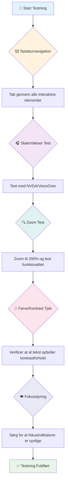
**Trin-for-trin test-checkliste:**
1. **Tastaturnavigation**: Brug kun Tab, Shift+Tab, Enter, Space og piletaster
2. **Test med skærmlæser**: Aktivér NVDA, VoiceOver eller Narrator og naviger med lukkede øjne
3. **Zoom test**: Test ved 200% og 400% zoom niveauer
4. **Farvekontrastkontrol**: Tjek al tekst og UI-komponenter
5. **Test fokusindikator**: Sørg for at alle interaktive elementer har synlige fokus-tilstande

✅ **Start med Lighthouse**: Åbn din browsers DevTools, kør en Lighthouse-tilgængelighedsaudit, og brug resultaterne til at guide din manuelle testindsats.

### Zoom- og forstørrelsesværktøjer

Du kender det sikkert—nogle gange kniber du fingrene for at zoome på din telefon, når teksten er for lille, eller squinter på din laptop i stærkt sollys? Mange brugere er afhængige af forstørrelsesværktøjer for at gøre indhold læseligt hver eneste dag. Dette inkluderer personer med nedsat syn, ældre voksne og alle, der nogensinde har prøvet at læse et website udendørs.

Moderne zoom-teknologier har udviklet sig ud over bare at gøre ting større. Forståelse af hvordan disse værktøjer fungerer, vil hjælpe dig med at skabe responsive designs, der forbliver funktionelle og flotte ved alle forstørrelsesniveauer.

**Moderne browseres zoom-muligheder:**
- **Sidezoom**: Skalerer alt indhold proportionalt (tekst, billeder, layout) - dette er den foretrukne metode
- **Tekst-zoom**: Forøger skriftstørrelsen mens originalt layout bevares
- **Knib-til-zoom**: Mobil gestus til midlertidig forstørrelse
- **Browser support**: Alle moderne browsere understøtter zoom op til 500% uden at bryde funktionalitet

**Specialiseret forstørrelsessoftware:**
- **Windows**: [Magnifier](https://support.microsoft.com/windows/use-magnifier-to-make-things-on-the-screen-easier-to-see-414948ba-8b1c-d3bd-8615-0e5e32204198) (indbygget), [ZoomText](https://www.freedomscientific.com/training/zoomtext/getting-started/)
- **macOS/iOS**: [Zoom](https://www.apple.com/accessibility/mac/vision/) (indbygget med avancerede funktioner)

> ⚠️ **Designovervejelse**: WCAG kræver, at indhold forbliver funktionelt ved zoom på 200%. På dette niveau bør vandret rulning være minimal, og alle interaktive elementer skal forblive tilgængelige.

✅ **Test dit responsive design**: Zoom din browser til 200% og 400%. Tilpasser dit layout sig elegant? Kan du stadig få adgang til al funktionalitet uden overdreven rulning?

## Moderne Tilgængelighedstestværktøjer

Nu hvor du forstår, hvordan folk navigerer på nettet med hjælpemidler, lad os udforske værktøjerne, der hjælper dig med at bygge og teste tilgængelige websites.

Tænk på det sådan: automatiserede værktøjer er gode til at fange åbenlyse problemer (som manglende alt-tekst), mens praktisk testning hjælper dig med at sikre, at dit site føles godt at bruge i virkeligheden. Sammen giver de dig tillid til, at dine sites fungerer for alle.

### Farvekontrasttest

Her er noget godt nyt: farvekontrast er et af de mest almindelige tilgængelighedsproblemer, men det er også et af de nemmeste at rette. God kontrast gavner alle—fra brugere med synsnedsættelse til folk, der prøver at læse deres telefon på stranden.

**WCAG krav til kontrast:**

| Teksttype | WCAG AA (Minimum) | WCAG AAA (Forbedret) |
|-----------|-------------------|---------------------|
| **Normal tekst** (under 18pt) | 4.5:1 kontrastforhold | 7:1 kontrastforhold |
| **Stor tekst** (18pt+ eller 14pt+ fed) | 3:1 kontrastforhold | 4.5:1 kontrastforhold |
| **UI-komponenter** (knapper, formulargrænser) | 3:1 kontrastforhold | 3:1 kontrastforhold |

**Nødvendige testværktøjer:**
- [Colour Contrast Analyser](https://www.tpgi.com/color-contrast-checker/) - Desktop app med farvevælger
- [WebAIM Contrast Checker](https://webaim.org/resources/contrastchecker/) - Webbaseret med øjeblikkelig feedback
- [Stark](https://www.getstark.co/) - Designplugin til Figma, Sketch, Adobe XD
- [Accessible Colors](https://accessible-colors.com/) - Find tilgængelige farvepaletter

✅ **Skab bedre farvepaletter**: Start med dine brandfarver og brug kontrastkontrollere til at skabe tilgængelige variationer. Dokumentér disse som dit designsystems tilgængelige farvetoner.

### Omfattende tilgængelighedsauditering

Den mest effektive tilgængelighedstest kombinerer flere tilgange. Intet enkelt værktøj fanger alt, så det at opbygge en testrutine med forskellige metoder sikrer grundig dækning.

**Browserbaseret testning (indbygget i DevTools):**
- **Chrome/Edge**: Lighthouse tilgængelighedsaudit + Accessibility-panel
- **Firefox**: Accessibility Inspector med detaljeret trævisning
- **Safari**: Audit-faneblad i Web Inspector med VoiceOver-simulering

**Professionelle testudvidelser:**
- [axe DevTools](https://www.deque.com/axe/devtools/) - Branche-standard automatiseret test
- [WAVE](https://wave.webaim.org/extension/) - Visuel feedback med fejlmarkering
- [Accessibility Insights](https://accessibilityinsights.io/) - Microsofts omfattende testsuite

**Kommando-linje og CI/CD-integration:**
- [axe-core](https://github.com/dequelabs/axe-core) - JavaScript-bibliotek til automatiseret test
- [Pa11y](https://pa11y.org/) - Kommandolinjeværktøj til tilgængelighedstest
- [Lighthouse CI](https://github.com/GoogleChrome/lighthouse-ci) - Automatiseret tilgængelighedsscorer

> 🎯 **Testmål**: Sigter efter en Lighthouse tilgængelighedsscore på 95+ som baseline. Husk, automatiserede værktøjer fanger kun ca. 30-40% af tilgængelighedsproblemerne—manuel test er stadig essentiel!

### 🧠 **Testfærdigheder Check: Klar til at finde problemer?**

**Lad os se, hvordan du har det med tilgængelighedstest:**
- Hvilken testmetode virker mest tilgængelig for dig lige nu?
- Kan du forestille dig at bruge kun tastaturnavigation en hel dag?
- Hvad er en tilgængelighedsbarriere, du personligt har oplevet online?

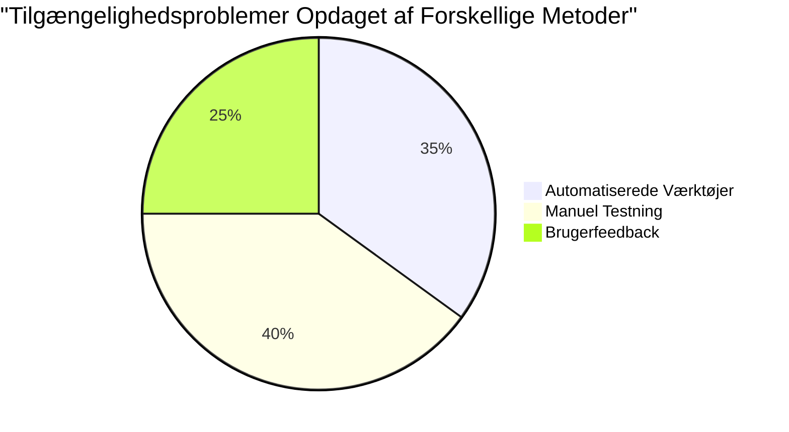
> **Selvtillidsboost**: Professionelle tilgængelighedstestere bruger denne eksakte kombination af metoder. Du lærer branches standard praksis!

## Byg Tilgængelighed fra Grundlaget

Nøglen til tilgængelighedssucces er at bygge den ind i dit fundament fra dag ét. Jeg ved, det er fristende at tænke "Jeg tilføjer tilgængelighed senere," men det er som at forsøge at tilføje en rampe til et hus, efter det allerede er bygget. Muligt? Ja. Let? Ikke rigtig.

Tænk på tilgængelighed som planlægning af et hus—det er meget lettere at inkludere kørestolsadgang i dine arkitektoniske planer fra starten end at skulle tilføje det bagefter.

### POUR principperne: Dit tilgængelighedsfundament

Web Content Accessibility Guidelines (WCAG) er bygget op omkring fire grundlæggende principper, der staver POUR. Bare rolig—det er ikke tørre akademiske begreber! De er faktisk praktiske retningslinjer til at gøre indhold, der fungerer for alle.

Når du først har styr på POUR, bliver det meget mere intuitivt at træffe beslutninger om tilgængelighed. Det er som at have en mental tjekliste, der guider dine designvalg. Lad os gennemgå dem:

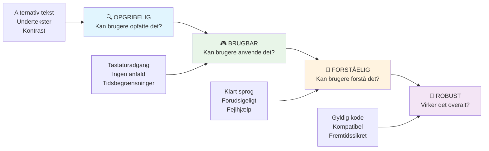
**🔍 Perceptible (Opfatteligt)**: Information skal kunne præsenteres på måder, som brugere kan opfatte gennem deres tilgængelige sanser

- Giv tekstalternativer for ikke-tekstligt indhold (billeder, videoer, lyd)
- Sørg for tilstrækkelig farvekontrast for al tekst og UI-komponenter
- Tilbyd billedtekster og transskriptioner for multimedieindhold
- Design indhold, der forbliver funktionelt ved op til 200% størrelse
- Brug flere sensoriske karakteristika (ikke kun farve) til at formidle information

**🎮 Operable (Betjeneligt)**: Alle grænsefladekomponenter skal kunne betjenes via tilgængelige inputmetoder

- Gør al funktionalitet tilgængelig via tastaturnavigation
- Giv brugerne tilstrækkelig tid til at læse og interagere med indhold
- Undgå indhold, der kan forårsage anfald eller vestibulære lidelser
- Hjælp brugere med effektiv navigation med klar struktur og landemærker
- Sørg for, at interaktive elementer har passende mål (mindst 44px)

**📖 Understandable (Forståeligt)**: Information og interface skal være klare og letforståelige

- Brug klart, enkelt sprog, der passer til din målgruppe
- Sørg for, at indhold vises og fungerer på forudsigelige, konsistente måder
- Giv klare instruktioner og fejlbeskeder ved brugerinput
- Hjælp brugere med at forstå og rette fejl i formularer
- Organisér indhold med logisk læserækkefølge og informationshierarki

**💪 Robust (Robust)**: Indhold skal fungere pålideligt på tværs af forskellige teknologier og hjælpemidler

- **Brug gyldig, semantisk HTML som dit fundament**
- **Sørg for kompatibilitet med nuværende og fremtidige hjælpemidler**
- **Følg webstandarder og bedste praksis for markup**
- **Test på tværs af forskellige browsere, enheder og hjælpemidler**
- **Strukturer indhold, så det nedbrydes pænt, når avancerede funktioner ikke understøttes**

### 🎯 **POUR-principper Check: At få det til at hænge fast**

**Hurtig refleksion over grundlaget:**
- Kan du tænke på en webfunktion, der fejler hvert af POUR-principperne?
- Hvilket princip føles mest naturligt for dig som udvikler?
- Hvordan kan disse principper forbedre design for alle, ikke kun brugere med handicap?

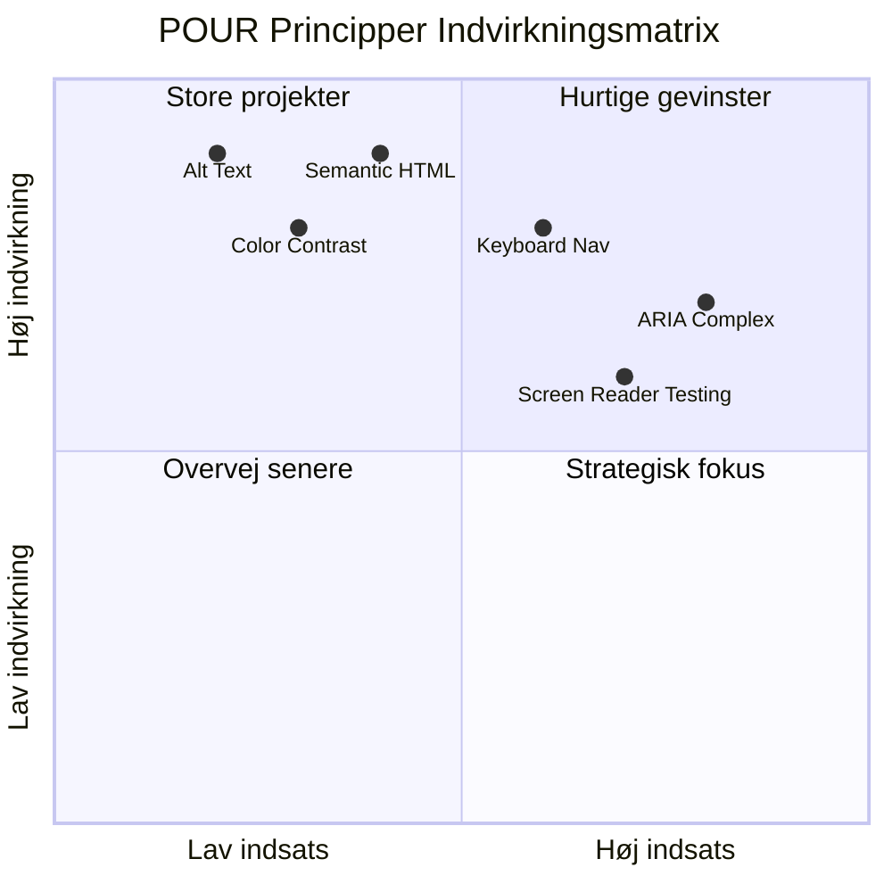
> **Husk**: Start med høj-impact, lav-indsats forbedringer. Semantisk HTML og alt-tekst giver dig det største tilgængelighedsboost for mindst indsats!

## Skabe tilgængeligt visuelt design

Godt visuelt design og tilgængelighed går hånd i hånd. Når du designer med tilgængelighed i tankerne, opdager du ofte, at disse begrænsninger fører til renere, mere elegante løsninger, der gavner alle brugere.

Lad os udforske, hvordan du skaber visuelt tiltalende designs, der fungerer for alle, uanset deres visuelle evner eller de forhold, de ser dit indhold under.

### Farve og visuelle tilgængelighedsstrategier

Farve er et stærkt kommunikationsmiddel, men det bør aldrig være den eneste måde, du formidler vigtig information på. Design ud over farve skaber mere robuste, inkluderende oplevelser, der fungerer i flere situationer.

**Design for farvesynet forskelle:**

Omtrent 8 % af mænd og 0,5 % af kvinder har en eller anden form for farvesynsforskel (ofte kaldet "farveblindhed"). De mest almindelige typer er:
- **Deuteranopi**: Vanskeligheder med at skelne rød og grøn
- **Protanopi**: Rød fremstår mere svag
- **Tritanopi**: Vanskeligheder med blå og gul (sjældent)

**Inklusive farvestrategier:**

```css
/* ❌ Bad: Using only color to indicate status */
.error { color: red; }
.success { color: green; }

/* ✅ Good: Color plus icons and context */
.error {
  color: #d32f2f;
  border-left: 4px solid #d32f2f;
}
.error::before {
  content: "⚠️";
  margin-right: 8px;
}

.success {
  color: #2e7d32;
  border-left: 4px solid #2e7d32;
}
.success::before {
  content: "✅";
  margin-right: 8px;
}
```

**Udover grundlæggende kontrastkrav:**
- Test dine farvevalg med farveblindhedssimulatorer
- Brug mønstre, teksturer eller former sammen med farvekodning
- Sørg for, at interaktive tilstande forbliver genkendelige uden farve
- Overvej, hvordan dit design ser ud i højkontrast-tilstand

✅ **Test din farvetilgængelighed**: Brug værktøjer som [Coblis](https://www.color-blindness.com/coblis-color-blindness-simulator/) for at se, hvordan dit site fremstår for brugere med forskellige typer farvesyn.

### Fokusindikatorer og interaktionsdesign

Fokusindikatorer er det digitale svar på en markør—de viser tastaturbrugere, hvor de er på siden. Godt designede fokusindikatorer forbedrer oplevelsen for alle ved at gøre interaktioner klare og forudsigelige.

**Moderne bedste praksis for fokusindikatorer:**

```css
/* Enhanced focus styles that work across browsers */
button:focus-visible {
  outline: 2px solid #0066cc;
  outline-offset: 2px;
  box-shadow: 0 0 0 4px rgba(0, 102, 204, 0.25);
}

/* Remove focus outline for mouse users, preserve for keyboard users */
button:focus:not(:focus-visible) {
  outline: none;
}

/* Focus-within for complex components */
.card:focus-within {
  box-shadow: 0 0 0 3px rgba(74, 144, 164, 0.5);
  border-color: #4A90A4;
}

/* Ensure focus indicators meet contrast requirements */
.custom-focus:focus-visible {
  outline: 3px solid #ffffff;
  outline-offset: 2px;
  box-shadow: 0 0 0 6px #000000;
}
```

**Krav til fokusindikatorer:**
- **Synlighed**: Skal have mindst 3:1 kontrastforhold til omgivelserne
- **Bredde**: Minimum 2px tykkelse omkring hele elementet
- **Vedholdenhed**: Skal forblive synlig, indtil fokus flyttes andetsteds
- **Distinktion**: Skal visuelt adskille sig fra andre UI-tilstande

> 💡 **Design Tip**: Gode fokusindikatorer bruger ofte en kombination af outline, box-shadow og farveændringer for at sikre synlighed på forskellige baggrunde og i forskellige kontekster.

✅ **Auditér fokusindikatorer**: Tab dig igennem dit website og bemærk, hvilke elementer der har klare fokusindikatorer. Er nogen svære at se eller helt manglende?

### Semantisk HTML: Fundamentet for tilgængelighed

Semantisk HTML er som at give hjælpemidler et GPS-system til dit website. Når du bruger de rigtige HTML-elementer til deres tilsigtede formål, giver du grundlæggende skærmlæsere, tastaturer og andre hjælpemidler et detaljeret kort over, hvordan brugere effektivt navigerer.

Her er en analogi, der virkelig ramte plet for mig: semantisk HTML er forskellen mellem et velorganiseret bibliotek med klare kategorier og hjælpsomme skilte versus et lager, hvor bøger er spredt tilfældigt. Begge steder har de samme bøger, men hvilket sted ville du helst prøve at finde noget i? Præcis!

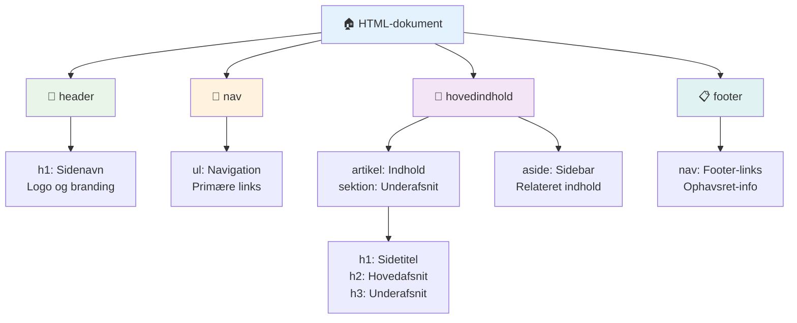
**Byggesten til tilgængelig sidestruktur:**

```html
<!-- Landmark elements provide page navigation structure -->
<header>
  <h1>Your Site Name</h1>
  <nav aria-label="Main navigation">
    <ul>
      <li><a href="/home">Home</a></li>
      <li><a href="/about">About</a></li>
      <li><a href="/services">Services</a></li>
    </ul>
  </nav>
</header>

<main>
  <article>
    <header>
      <h1>Article Title</h1>
      <p>Published on <time datetime="2024-10-14">October 14, 2024</time></p>
    </header>
    
    <section>
      <h2>First Section</h2>
      <p>Content that relates to this section...</p>
    </section>
    
    <section>
      <h2>Second Section</h2>
      <p>More related content...</p>
    </section>
  </article>
  
  <aside>
    <h2>Related Links</h2>
    <nav aria-label="Related articles">
      <ul>
        <li><a href="/related-1">First related article</a></li>
        <li><a href="/related-2">Second related article</a></li>
      </ul>
    </nav>
  </aside>
</main>

<footer>
  <p>&copy; 2024 Your Site Name. All rights reserved.</p>
  <nav aria-label="Footer links">
    <ul>
      <li><a href="/privacy">Privacy Policy</a></li>
      <li><a href="/contact">Contact Us</a></li>
    </ul>
  </nav>
</footer>
```

**Hvorfor semantisk HTML transformerer tilgængelighed:**

| Semantisk Element | Formål | Skærmlæser Fordel |
|-------------------|---------|-------------------|
| `<header>` | Side- eller sektionoverskrift | "Banner landmark" - hurtig navigation til toppen |
| `<nav>` | Navigationslinks | "Navigation landmark" - liste over nav sektioner |
| `<main>` | Primært sideindhold | "Main landmark" - spring direkte til indhold |
| `<article>` | Selvstændigt indhold | Marker artiklens grænser |
| `<section>` | Tematiske indholdsgrupper | Giver indholdsstruktur |
| `<aside>` | Relateret sideløbende indhold | "Complementary landmark" |
| `<footer>` | Side- eller sektionsfod | "Contentinfo landmark" |

**Skærmlæser-superkræfter med semantisk HTML:**
- **Landmark-navigation**: Hop mellem større sidesektioner øjeblikkeligt
- **Overskriftsoversigt**: Generer indholdsfortegnelse ud fra din overskriftsstruktur
- **Elementlister**: Opret lister over alle links, knapper eller formularfelter
- **Kontekstbevidsthed**: Forstå relationer mellem indholdssektioner

> 🎯 **Hurtig test**: Prøv at navigere på dit site med en skærmlæser ved hjælp af landmark-genveje (D for landmark, H for heading, K for link i NVDA/JAWS). Giver navigationen mening?

### 🏗️ **Semantisk HTML Mestringscheck: Byg stærke fundamenter**

**Lad os evaluere din semantiske forståelse:**
- Kan du identificere landemærker på en webside bare ved at se HTML’en?
- Hvordan ville du forklare forskellen mellem `<section>` og `<div>` til en ven?
- Hvad er det første, du ville tjekke, hvis en skærmlæserbruger rapporterede navigationsproblemer?

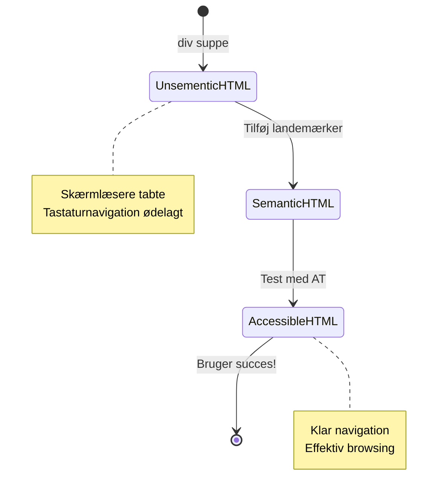
> **Pro-indblik**: God semantisk HTML løser cirka 70 % af tilgængelighedsproblemer automatisk. Mestring af dette fundament bringer dig rigtig langt!

✅ **Auditér din semantiske struktur**: Brug tilgængelighedspanelet i din browsers DevTools for at se tilgængelighedstræet og sikre, at dit markup skaber en logisk struktur.

### Overskriftshierarki: Skabe en logisk indholdsoversigt

Overskrifter er absolut afgørende for tilgængeligt indhold—de er som rygraden, der holder det hele sammen. Skærmlæserbrugere stoler kraftigt på overskrifter for at forstå og navigere dit indhold. Tænk på det som at give en indholdsfortegnelse til din side.

**Her er den gyldne regel for overskrifter:**
Spring aldrig niveauer over. Bevæg dig altid logisk fra `<h1>` til `<h2>` til `<h3>` og så videre. Kan du huske at lave dispositioner i skolen? Det er præcis det samme princip—du ville ikke springe fra "I. Hovedpunkt" direkte til "C. Under-underpunkt" uden "A. Underpunkt" imellem, vel?

**Perfekt eksempel på overskriftsstruktur:**

```html
<!-- ✅ Excellent: Logical, hierarchical progression -->
<main>
  <h1>Complete Guide to Web Accessibility</h1>
  
  <section>
    <h2>Understanding Screen Readers</h2>
    <p>Introduction to screen reader technology...</p>
    
    <h3>Popular Screen Reader Software</h3>
    <p>NVDA, JAWS, and VoiceOver comparison...</p>
    
    <h3>Testing with Screen Readers</h3>
    <p>Step-by-step testing instructions...</p>
  </section>
  
  <section>
    <h2>Color and Contrast Guidelines</h2>
    <p>Designing with sufficient contrast...</p>
    
    <h3>WCAG Contrast Requirements</h3>
    <p>Understanding the different contrast levels...</p>
    
    <h3>Testing Tools and Techniques</h3>
    <p>Tools for verifying contrast ratios...</p>
  </section>
</main>
```

```html
<!-- ❌ Problematic: Skipping levels, inconsistent structure -->
<h1>Page Title</h1>
<h3>Subsection</h3> <!-- Skipped h2 -->
<h2>This should come before h3</h2>
<h1>Another main heading?</h1> <!-- Multiple h1s -->
```

**Overskrifts bedste praksis:**
- **Én `<h1>` per side**: Typisk dit hovedsideoverskrift eller primære indhold
- **Logisk progression**: Spring aldrig niveauer over (h1 → h2 → h3, ikke h1 → h3)
- **Meningsfuldt indhold**: Gør overskrifter forståelige, også ude af kontekst
- **Visuel styling med CSS**: Brug CSS til udseende, HTML-niveauer til struktur

**Statistik for skærmlæsernavigation:**
- 68 % af skærmlæserbrugere navigerer via overskrifter ([WebAIM Survey](https://webaim.org/projects/screenreadersurvey9/#finding))
- Brugere forventer at finde en logisk overskriftsoversigt
- Overskrifter giver den hurtigste måde at forstå sidestrukturen

> 💡 **Pro Tips**: Brug browser-udvidelser som "HeadingsMap" til at visualisere din overskriftsstruktur. Den skal læses som en velorganiseret indholdsfortegnelse.

✅ **Test din overskriftsstruktur**: Brug en skærmlæsers overskriftsnavigation (H-tasten i NVDA) til at hoppe gennem dine overskrifter. Fortæller progressionen logisk historien om dit indhold?

### Avancerede teknikker for visuel tilgængelighed

Ud over grundlæggende kontrast og farve findes der avancerede teknikker, som hjælper med at skabe virkelig inkluderende visuelle oplevelser. Disse metoder sikrer, at dit indhold fungerer under forskellige betragtningsforhold og hjælpemidler.

**Væsentlige strategier for visuel kommunikation:**

- **Multimodal feedback**: Kombiner visuelle, tekstuelle og undertiden lydmæssige signaler
- **Progressiv afsløring**: Præsenter information i fordøjelige bidder
- **Konsistente interaktionsmønstre**: Brug velkendte UI-konventioner
- **Responsiv typografi**: Skaler tekst passende på tværs af enheder
- **Indlæsnings- og fejltilstande**: Giv klar feedback for alle brugerhandlinger

**CSS-værktøjer til forbedret tilgængelighed:**

```css
/* Screen reader only text - visually hidden but accessible */
.sr-only {
  position: absolute;
  width: 1px;
  height: 1px;
  padding: 0;
  margin: -1px;
  overflow: hidden;
  clip: rect(0, 0, 0, 0);
  white-space: nowrap;
  border: 0;
}

/* Skip link for keyboard navigation */
.skip-link {
  position: absolute;
  top: -40px;
  left: 6px;
  background: #000000;
  color: #ffffff;
  padding: 8px 16px;
  text-decoration: none;
  border-radius: 4px;
  font-weight: bold;
  transition: top 0.3s ease;
  z-index: 1000;
}

.skip-link:focus {
  top: 6px;
}

/* Reduced motion respect */
@media (prefers-reduced-motion: reduce) {
  .skip-link {
    transition: none;
  }
  
  * {
    animation-duration: 0.01ms !important;
    animation-iteration-count: 1 !important;
    transition-duration: 0.01ms !important;
  }
}

/* High contrast mode support */
@media (prefers-contrast: high) {
  .button {
    border: 2px solid;
  }
}
```

> 🎯 **Tilgængelighedsmønster**: "Skip link" er essentielt for tastaturbrugere. Det bør være det første fokuserbare element på din side og springe direkte til hovedindholdsområdet.

✅ **Implementér skip navigation**: Tilføj skip links til dine sider og test dem ved at trykke på Tab lige når siden indlæses. De skal dukke op og give mulighed for at hoppe til hovedindholdet.

## Skriv meningsfuld linktekst

Links er grundlæggende internettets motorveje, men dårligt skrevne linktekster er som vejskilte, der bare siger "Sted" i stedet for "Downtown Chicago." Ikke særlig hjælpsomt, vel?

Her er noget, der blæste mig omkuld, da jeg først lærte det: Skærmlæsere kan udtrække alle links fra en side og vise dem som én lang liste. Forestil dig, hvis nogen gav dig et register over alle links på din side. Ville hvert link give mening alene? Det er testen, din linktekst skal bestå!

### Forståelse af linknavigationsmønstre

Skærmlæsere tilbyder kraftfulde linknavigationsfunktioner, der er afhængige af veldesignet linktekst:

**Metoder til linknavigation:**
- **Sekventiel læsning**: Links læses i kontekst som en del af indholdsflow
- **Linklistegenerering**: Alle sidelinks sammenstillet i en søgbar liste
- **Hurtig navigation**: Hop mellem links med tastaturgenveje (K i NVDA)
- **Søgefunktion**: Find specifikke links ved at skrive delvise tekster

**Hvorfor kontekst er vigtig:**
Når skærmlæserbrugere genererer en linkliste, ser de noget i retning af:
- "Download rapport"
- "Læs mere"
- "Klik her"
- "Privatlivspolitik"
- "Klik her"

Kun to af disse links giver nyttig information, når de læses ude af kontekst!

> 📊 **Brugerpåvirkning**: Skærmlæserbrugere scanner linklister for hurtigt at forstå sideindhold. Generisk linktekst tvinger dem til at navigere tilbage til hvert links kontekst, hvilket betydeligt forsinker deres browsingoplevelse.

### Almindelige fejl i linktekst, du bør undgå

Hvis du forstår, hvad der ikke virker, kan du genkende og rette tilgængelighedsproblemer i eksisterende indhold.

**❌ Generisk linktekst, der ikke giver kontekst:**

```html
<!-- Meaningless when read from a link list -->
<p>Our sustainability efforts are detailed in our recent report. 
   <a href="/sustainability-2024.pdf">Click here</a> to view it.</p>

<!-- Repeated generic text throughout the page -->
<div class="article-card">
  <h3>Web Accessibility Guide</h3>
  <p>Learn the fundamentals...</p>
  <a href="/accessibility-guide">Read more</a>
</div>
<div class="article-card">
  <h3>Color Contrast Tips</h3>
  <p>Improve your design...</p>
  <a href="/color-contrast">Read more</a>
</div>

<!-- URLs as link text (difficult for screen readers to announce) -->
<p>Visit https://www.w3.org/WAI/WCAG21/quickref/ for WCAG guidelines.</p>

<!-- Vague action words -->
<a href="/contact">Go</a> | <a href="/about">See</a> | <a href="/help">View</a>
```

**Hvorfor disse mønstre fejler:**
- **"Klik her"** fortæller brugerne intet om destinationen
- **"Læs mere"** gentaget flere gange skaber forvirring
- **Rå URL’er** er svære for skærmlæsere at udtale klart
- **Enkeltord** som "Gå" eller "Se" mangler beskrivende kontekst

### Skriv fremragende linktekst

Beskrivende linktekst gavner alle—seende brugere kan hurtigt scanne links, og skærmlæserbrugere forstår destinationerne med det samme.

**✅ Klare, beskrivende linktekst eksempler:**

```html
<!-- Descriptive text that explains the destination -->
<p>Our comprehensive <a href="/sustainability-2024.pdf">2024 sustainability report (PDF, 2.1MB)</a> details our environmental initiatives.</p>

<!-- Specific, unique link text for each card -->
<div class="article-card">
  <h3>Web Accessibility Guide</h3>
  <p>Learn the fundamentals of inclusive design...</p>
  <a href="/accessibility-guide">Read our complete web accessibility guide</a>
</div>
<div class="article-card">
  <h3>Color Contrast Tips</h3>
  <p>Improve your design with better color choices...</p>
  <a href="/color-contrast">Explore color contrast best practices</a>
</div>

<!-- Meaningful text instead of raw URLs -->
<p>The <a href="https://www.w3.org/WAI/WCAG21/quickref/">WCAG 2.1 Quick Reference guide</a> provides comprehensive accessibility guidelines.</p>

<!-- Descriptive action links -->
<a href="/contact">Contact our support team</a> | 
<a href="/about">About our company</a> | 
<a href="/help">Get help with your account</a>
```

**Bedste praksis for linktekst:**
- **Vær specifik**: "Download det kvartalsvise finansielle rapport" versus "Download"
- **Inkluder filtype og størrelse**: "(PDF, 1,2MB)" for downloadbare filer
- **Nævn hvis links åbnes eksternt**: "(åbner i nyt vindue)" hvor relevant
- **Brug aktivt sprog**: "Kontakt os" versus "Kontakt side"
- **Hold det kort**: Sigter efter 2-8 ord, når muligt

### Avancerede mønstre for linktilgængelighed

Nogle gange kræver visuelle designbegrænsninger eller tekniske krav særlige løsninger. Her er avancerede teknikker til almindeligt udfordrende scenarier:

**Brug af ARIA til forbedret kontekst:**

```html
<!-- When button text must be short but needs more context -->
<a href="/report.pdf" 
   aria-label="Download 2024 annual financial report, PDF format, 2.3MB">
  Download Report
</a>

<!-- When the full context comes from surrounding content -->
<h3 id="sustainability-heading">Sustainability Initiative</h3>
<p>Our efforts to reduce environmental impact...</p>
<a href="/sustainability-details" 
   aria-labelledby="sustainability-heading"
   aria-describedby="sustainability-summary">
  Learn more
</a>
<p id="sustainability-summary">Detailed breakdown of our 2024 environmental goals and achievements</p>
```

**Angivelse af filtyper og eksterne destinationer:**

```html
<!-- Method 1: Include information in visible link text -->
<a href="/annual-report.pdf">
  Download our 2024 annual report (PDF, 2.3MB)
</a>

<!-- Method 2: Use screen reader-only text for file details -->
<a href="/annual-report.pdf">
  Download our 2024 annual report
  <span class="sr-only">(PDF format, 2.3MB)</span>
</a>

<!-- Method 3: External link indication -->
<a href="https://example.com" 
   target="_blank" 
   aria-describedby="external-link-warning">
  Visit external resource
</a>
<span id="external-link-warning" class="sr-only">
  (opens in new window)
</span>

<!-- Method 4: Using CSS for visual indicators -->
<a href="https://example.com" class="external-link">
  External resource
</a>
```

```css
/* Visual indicator for external links */
.external-link::after {
  content: " ↗";
  font-size: 0.8em;
  color: #666;
}

/* Screen reader announcement for external links */
.external-link::before {
  content: "External link: ";
  position: absolute;
  left: -10000px;
  width: 1px;
  height: 1px;
  overflow: hidden;
}
```

> ⚠️ **Vigtigt**: Når du bruger `target="_blank"`, skal du altid informere brugerne om, at linket åbner i et nyt vindue eller faneblad. Uventede navigation ændringer kan være forvirrende.

✅ **Test din linkkontekst**: Brug din browsers udviklerværktøjer til at generere en liste over alle links på din side. Kan du forstå formålet med hvert link uden nogen omgivende kontekst?

## ARIA: Superkraft til HTML-tilgængelighed

[Accessible Rich Internet Applications (ARIA)](https://developer.mozilla.org/docs/Web/Accessibility/ARIA) er som en universel oversætter mellem dine komplekse webapplikationer og hjælpemidler. Når HTML alene ikke kan udtrykke alt, hvad dine interaktive komponenter gør, træder ARIA til for at udfylde hullerne.

Jeg tænker på ARIA som at tilføje hjælpsomme noter til din HTML—lidt ligesom sceneanvisninger i et skuespil, der hjælper skuespillere med at forstå deres roller og relationer.

**Her er den vigtigste regel om ARIA**: Brug altid semantisk HTML først, og tilføj ARIA for at forbedre det. Tænk på ARIA som krydderi, ikke hovedretten. Det skal tydeliggøre og forbedre din HTML-struktur, aldrig erstatte den. Få fundamentet på plads først!

### Strategisk ARIA-implementering

ARIA er kraftfuld, men med magt følger ansvar. Forkert ARIA kan gøre tilgængelighed værre end slet ingen ARIA. Her er hvornår og hvordan du bruger det effektivt:

**✅ Brug ARIA når:**
- Du skaber brugerdefinerede interaktive widgets (akkordeoner, faner, karuseller)
- Du bygger dynamisk indhold, der ændres uden sidegenindlæsning
- Du giver ekstra kontekst til komplekse UI-relationer
- Du angiver indlæsningsstatus eller live opdateringer
- Du skaber app-lignende grænseflader med brugerdefinerede kontroller

**❌ Undgå ARIA når:**
- Standard HTML-elementer allerede giver den nødvendige semantik
- Du er usikker på, hvordan du implementerer det korrekt
- Det duplikerer information allerede givet af semantisk HTML
- Du ikke har testet med reelle hjælpemidler

> 🎯 **ARIA’s gyldne regel**: "Ændr ikke semantik, medmindre det er absolut nødvendigt, sikr altid tastaturtilgængelighed, og test med reelle hjælpemidler."
**De fem kategorier af ARIA:**

1. **Roller**: Hvad er dette element? (`button`, `tab`, `dialog`)
2. **Egenskaber**: Hvad er dets funktioner? (`aria-required`, `aria-haspopup`)
3. **Tilstande**: Hvad er dets aktuelle tilstand? (`aria-expanded`, `aria-checked`)
4. **Landemærker**: Hvor befinder det sig i sidens struktur? (`banner`, `navigation`, `main`)
5. **Live regioner**: Hvordan skal ændringer meddeles? (`aria-live`, `aria-atomic`)

### Væsentlige ARIA mønstre til moderne webapps

Disse mønstre løser de mest almindelige tilgængelighedsudfordringer i interaktive webapplikationer:

**Navngivning og beskrivelse af elementer:**

```html
<!-- aria-label: Provides accessible name when visible text isn't sufficient -->
<button aria-label="Close newsletter subscription dialog">×</button>

<!-- aria-labelledby: References existing text as the accessible name -->
<section aria-labelledby="news-heading">
  <h2 id="news-heading">Latest News</h2>
  <!-- news content -->
</section>

<!-- aria-describedby: Links to additional descriptive text -->
<input type="password" 
       aria-describedby="pwd-requirements pwd-strength"
       required>
<div id="pwd-requirements">
  Password must contain at least 8 characters, including uppercase, lowercase, and numbers.
</div>
<div id="pwd-strength" aria-live="polite">
  <!-- Dynamic password strength indicator -->
</div>
```

**Live regioner til dynamisk indhold:**

```html
<!-- Polite announcements (don't interrupt current speech) -->
<div aria-live="polite" id="status-updates">
  <!-- Status messages appear here -->
</div>

<!-- Assertive announcements (interrupt and announce immediately) -->
<div aria-live="assertive" id="urgent-alerts">
  <!-- Error messages and critical alerts -->
</div>

<!-- Loading states with live regions -->
<button id="submit-btn" aria-describedby="loading-status">
  Submit Application
</button>
<div id="loading-status" aria-live="polite" aria-atomic="true">
  <!-- "Processing your application..." appears here -->
</div>
```

**Eksempel på interaktiv widget (akkordion):**

```html
<div class="accordion">
  <h3>
    <button aria-expanded="false" 
            aria-controls="panel-1" 
            id="accordion-trigger-1"
            class="accordion-trigger">
      Accessibility Guidelines
    </button>
  </h3>
  <div id="panel-1" 
       role="region"
       aria-labelledby="accordion-trigger-1" 
       hidden>
    <p>WCAG 2.1 provides comprehensive guidelines...</p>
  </div>
</div>
```

```javascript
// JavaScript til at håndtere tilstandsforløb for akkordeon
function toggleAccordion(trigger) {
  const panel = document.getElementById(trigger.getAttribute('aria-controls'));
  const isExpanded = trigger.getAttribute('aria-expanded') === 'true';
  
  // Skift tilstand
  trigger.setAttribute('aria-expanded', !isExpanded);
  panel.hidden = isExpanded;
  
  // Meddel ændring til skærmlæsere
  const status = document.getElementById('status-updates');
  status.textContent = isExpanded ? 'Section collapsed' : 'Section expanded';
}
```

### Bedste praksis for ARIA-implementering

ARIA er kraftfuldt, men kræver omhyggelig implementering. At følge disse retningslinjer hjælper med at sikre, at din ARIA forbedrer i stedet for at begrænse tilgængeligheden:

**🛡️ Kerneprincipper:**

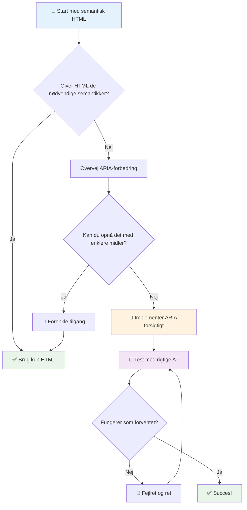
1. **Semantisk HTML først**: Foretræk altid `<button>` frem for `<div role="button">`
2. **Bryd ikke semantik**: Overstyr aldrig eksisterende HTML-betydning (undgå `<h1 role="button">`)
3. **Oprethold tastaturtilgængelighed**: Alle interaktive ARIA-elementer skal være fuldt tilgængelige med tastatur
4. **Test med rigtige brugere**: ARIA-understøttelse varierer betydeligt mellem hjælpemidler
5. **Start enkelt**: Komplekse ARIA-implementeringer har større risiko for fejl

**🔍 Testarbejdsgang:**

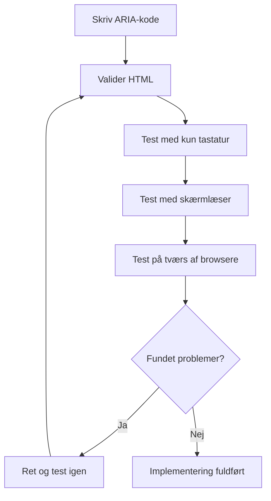
**🚫 Almindelige ARIA-fejl, der skal undgås:**

- **Modstridende information**: Modsig ikke HTML-semantik
- **Over-mærkning**: For meget ARIA-information overvælder brugere
- **Statisk ARIA**: At glemme at opdatere ARIA-tilstande ved indholdsændringer
- **Utestede implementeringer**: ARIA, der fungerer i teorien, men fejler i praksis
- **Manglende tastaturunderstøttelse**: ARIA-roller uden tilsvarende tastaturinteraktioner

> 💡 **Testressourcer**: Brug værktøjer som [accessibility-checker](https://www.npmjs.com/package/accessibility-checker) til automatisk ARIA-validering, men test altid med ægte skærmlæsere for den komplette oplevelse.

### 🎭 **ARIA Færdighedstest: Klar til komplekse interaktioner?**

**Vurder din ARIA-tillid:**
- Hvornår ville du vælge ARIA frem for semantisk HTML? (Tip: næsten aldrig!)
- Kan du forklare, hvorfor `<div role="button">` normalt er dårligere end `<button>`?
- Hvad er det vigtigste at huske ved ARIA-testning?

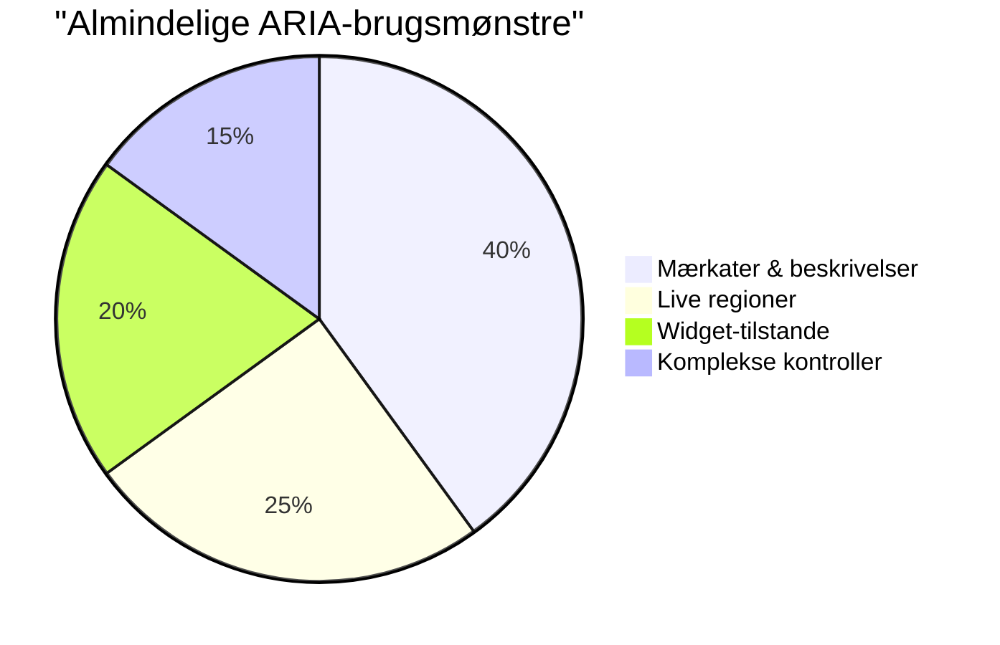
> **Nøgleindsigt**: Det meste ARIA brug er til mærkning og beskrivelse af elementer. Komplekse widget-mønstre er meget mindre almindelige, end man måske tror!

✅ **Lær fra eksperter**: Studér [ARIA Authoring Practices Guide](https://w3c.github.io/aria-practices/) for gennemtestede mønstre og implementeringer af komplekse interaktive widgets.

## Gøre billeder og medier tilgængelige

Visuelt og lydligt indhold er essentielle dele af moderne weberfaringer, men de kan skabe barrierer, hvis de ikke implementeres omhyggeligt. Målet er at sikre, at informationen og den følelsesmæssige effekt af dine medier når frem til alle brugere. Når du først har styr på det, bliver det en naturlig vane.

Forskellige medietyper kræver forskellige tilgængelighedstilgange. Det er som madlavning—du ville ikke behandle en delikat fisk på samme måde som en kraftig bøf. At forstå disse forskelle hjælper dig med at vælge den rette løsning til hver situation.

### Strategisk billedtilgængelighed

Hvert billede på dit websted tjener et formål. At forstå dette formål hjælper dig med at skrive bedre alternativ tekst og skabe mere inkluderende oplevelser.

**De fire billedtyper og deres alt-tekst strategier:**

**Informationsbilleder** - formidler vigtig information:
```html

```

**Dekorative billeder** - rent visuelt uden informationsværdi:
```html

```

**Funktionelle billeder** - tjener som knapper eller styringselementer:
```html
<button>
  
</button>
```

**Komplekse billeder** - diagrammer, grafer, infografikker:
```html

<div id="chart-description">
  <p>Detailed description: Sales data shows a steady increase across all quarters...</p>
</div>
```

### Video- og lydtilgængelighed

**Videokrav:**
- **Undertekster**: Tekstversion af talt indhold og lydeffekter
- **Lydkommentarer**: Beskrivelse af visuelle elementer for blinde brugere
- **Transskriptioner**: Fuld tekstversion af alt lyd- og visuelt indhold

```html
<video controls>
  <source src="video.mp4" type="video/mp4">
  <track kind="captions" src="captions.vtt" srclang="en" label="English">
  <track kind="descriptions" src="descriptions.vtt" srclang="en" label="Audio descriptions">
</video>
```

**Lydkrav:**
- **Transskriptioner**: Tekstversion af alt talt indhold
- **Visuelle indikatorer**: For lydindhold uden video, giv visuelle tegn

### Moderne billedteknikker

**Brug af CSS til dekorative billeder:**
```css
.hero-section {
  background-image: url('decorative-hero.jpg');
  /* Decorative images in CSS don't need alt text */
}
```

**Responsive billeder med tilgængelighed:**
```html
<picture>
  <source media="(min-width: 800px)" srcset="large-chart.png">
  <source media="(min-width: 400px)" srcset="medium-chart.png">
  
</picture>
```

✅ **Test billedtilgængelighed**: Brug en skærmlæser til at navigere på en side med billeder. Får du nok information til at forstå indholdet?

## Tastaturnavigation og fokusstyring

Mange brugere navigerer på nettet udelukkende med tastatur. Det inkluderer personer med motoriske handicap, powerbrugere, som finder tastaturer hurtigere end mus, og alle andre, hvis musen er ude af funktion. At sikre at dit site fungerer godt med tastaturinput er essentielt og gør ofte siden mere effektiv for alle.

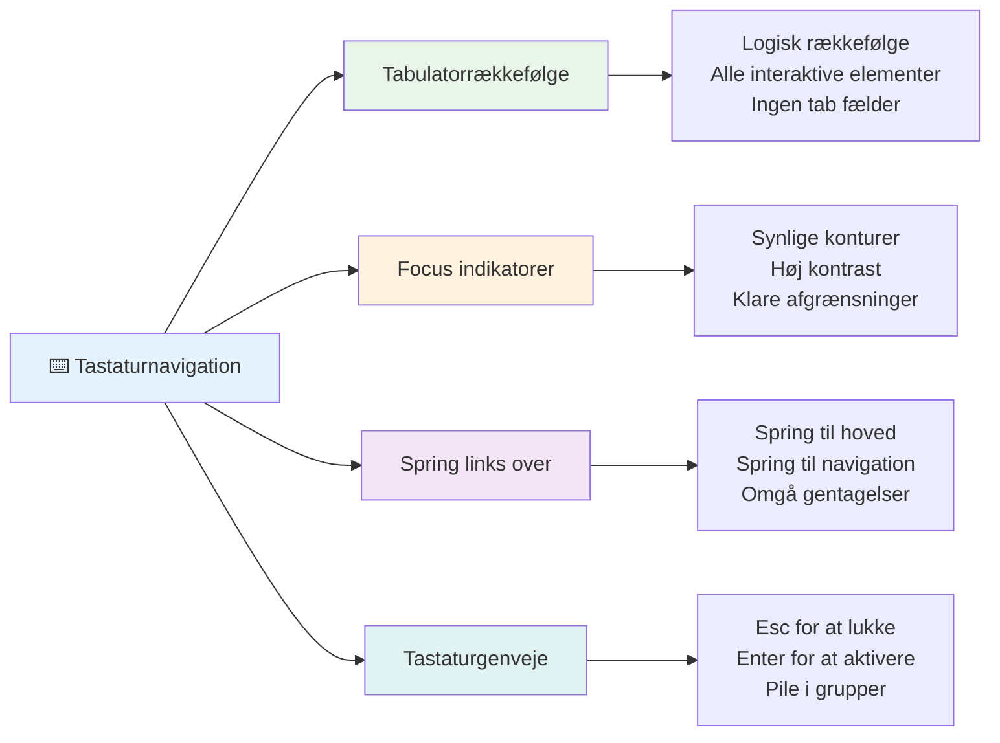
### Væsentlige tastaturnavigationsmønstre

**Standard tastaturinteraktioner:**
- **Tab**: Flyt fokus fremad gennem interaktive elementer
- **Shift + Tab**: Flyt fokus bagud
- **Enter**: Aktivér knapper og links
- **Mellemrum**: Aktivér knapper, sæt kryds i checkbokse
- **Piletaster**: Navigér indenfor komponentgrupper (radioknapper, menuer)
- **Escape**: Luk modaler, dropdowns eller annuller handlinger

### Bedste praksis for fokusstyring

**Synlige fokusindikatorer:**
```css
/* Ensure focus is always visible */
button:focus-visible {
  outline: 2px solid #4A90A4;
  outline-offset: 2px;
}

/* Custom focus styles for different components */
.card:focus-within {
  box-shadow: 0 0 0 3px rgba(74, 144, 164, 0.5);
}
```

**Spring-links for effektiv navigation:**
```html
<a href="#main-content" class="skip-link">Skip to main content</a>
<a href="#navigation" class="skip-link">Skip to navigation</a>

<nav id="navigation">
  <!-- navigation content -->
</nav>
<main id="main-content">
  <!-- main content -->
</main>
```

**Korrekt tab-rækkefølge:**
```html
<!-- Use semantic HTML for natural tab order -->
<form>
  <label for="name">Name:</label>
  <input type="text" id="name" tabindex="0">
  
  <label for="email">Email:</label>
  <input type="email" id="email" tabindex="0">
  
  <button type="submit" tabindex="0">Submit</button>
</form>
```

### Fokusfængsel i modaler

Når modaldialoger åbnes, skal fokus være fanget indenfor modalen:

```javascript
// Moderne fokusfældeimplementering
function trapFocus(element) {
  const focusableElements = element.querySelectorAll(
    'button, [href], input, select, textarea, [tabindex]:not([tabindex="-1"])'
  );
  
  const firstElement = focusableElements[0];
  const lastElement = focusableElements[focusableElements.length - 1];

  element.addEventListener('keydown', (e) => {
    if (e.key === 'Tab') {
      if (e.shiftKey && document.activeElement === firstElement) {
        e.preventDefault();
        lastElement.focus();
      } else if (!e.shiftKey && document.activeElement === lastElement) {
        e.preventDefault();
        firstElement.focus();
      }
    }
    
    if (e.key === 'Escape') {
      closeModal();
    }
  });
  
  // Fokusér på det første element, når modal åbnes
  firstElement.focus();
}
```

✅ **Test tastaturnavigation**: Prøv at navigere på dit website kun med Tab-tasten. Kan du nå alle interaktive elementer? Er fokusrækkefølgen logisk? Er fokusindikatorerne tydeligt synlige?

## Formularers tilgængelighed

Formularer er afgørende for brugerinteraktion og kræver særlig opmærksomhed på tilgængeligheden.

### Label og formkontrol-tilknytning

**Hver formkontrol skal have en label:**
```html
<!-- Explicit labeling (preferred) -->
<label for="username">Username:</label>
<input type="text" id="username" name="username" required>

<!-- Implicit labeling -->
<label>
  Password:
  <input type="password" name="password" required>
</label>

<!-- Using aria-label when visual label isn't desired -->
<input type="search" aria-label="Search products" placeholder="Search...">
```

### Fejlhåndtering og validering

**Tilgængelige fejlmeddelelser:**
```html
<label for="email">Email Address:</label>
<input type="email" id="email" name="email" 
       aria-describedby="email-error" 
       aria-invalid="true" required>
<div id="email-error" role="alert">
  Please enter a valid email address
</div>
```

**Bedste praksis for formularvalidering:**
- Brug `aria-invalid` til at angive ugyldige felter
- Giv klare, specifikke fejlmeddelelser
- Brug `role="alert"` til vigtige fejlmeddelelser
- Vis fejl både straks og ved formularindsendelse

### Fieldsets og gruppering

**Grupper relaterede formkontroller:**
```html
<fieldset>
  <legend>Shipping Address</legend>
  <label for="street">Street Address:</label>
  <input type="text" id="street" name="street">
  
  <label for="city">City:</label>
  <input type="text" id="city" name="city">
</fieldset>

<fieldset>
  <legend>Preferred Contact Method</legend>
  <input type="radio" id="contact-email" name="contact" value="email">
  <label for="contact-email">Email</label>
  
  <input type="radio" id="contact-phone" name="contact" value="phone">
  <label for="contact-phone">Phone</label>
</fieldset>
```

## Din tilgængelighedsrejse: Nøglepunkter

Tillykke! Du har netop erhvervet den grundlæggende viden for at skabe virkelig inkluderende weberfaringer. Det er ret spændende! Webtilgængelighed handler ikke bare om at krydse bokse af—det handler om at anerkende de mange måder folk interagerer med digitalt indhold på og designe til den fantastiske kompleksitet.

Du er nu en del af et voksende fællesskab af udviklere, der forstår, at god design fungerer for alle. Velkommen i klubben!

**🎯 Dit tilgængelighedsværktøj inkluderer nu:**

| Kerneprincip | Implementering | Effekt |
|--------------|----------------|--------|
| **Semantisk HTML Fundament** | Brug passende HTML-elementer til deres tiltænkte formål | Skærmlæsere kan navigere effektivt, tastaturer virker automatisk |
| **Inklusivt visuelt design** | Tilstrækkelig kontrast, meningsfuld farvebrug, synlige fokusindikatorer | Klar for alle under enhver lysforhold |
| **Beskrivende indhold** | Meningsfuld linktekst, alt-tekst, overskrifter | Brugere forstår indhold uden visuel kontekst |
| **Tastaturtilgængelighed** | Tab-rækkefølge, tastaturgenveje, fokusstyring | Motorisk tilgængelighed og effektivitet for avancerede brugere |
| **ARIA-forbedring** | Strategisk brug til at udfylde semantiske huller | Komplekse applikationer fungerer med hjælpemidler |
| **Omfattende testning** | Automatiserede værktøjer + manuel verifikation + ægte brugertest | Opdag problemer før de påvirker brugere |

**🚀 Dine næste skridt:**

1. **Indbyg tilgængelighed i din arbejdsgang**: Gør testning til en naturlig del af din udviklingsproces
2. **Lær af rigtige brugere**: Opsøg feedback fra personer, der bruger hjælpemidler
3. **Hold dig opdateret**: Tilgængelighedsteknikker udvikler sig med nye teknologier og standarder
4. **Fortal for inklusion**: Del din viden og gør tilgængelighed til et teamprioritet

> 💡 **Husk**: Tilgængelighedsbegrænsninger fører ofte til innovative, elegante løsninger, der gavner alle. Kantafskæringer, undertekster og stemmekommandoer startede alle som tilgængelighedsfunktioner og blev mainstream forbedringer.

**Forretningscasen er krystalklar**: Tilgængelige websites når flere brugere, rangerer bedre i søgemaskiner, har lavere vedligeholdelsesomkostninger og undgår juridiske risici. Men ærligt? Den egentlige grund til at bekymre sig om tilgængelighed går meget dybere. Tilgængelige websites legemliggør de bedste værdier på nettet—åbenhed, inklusivitet og idéen om, at alle fortjener lige adgang til information.

Du er nu rustet til at bygge webtjenester, der er inkluderende for fremtiden. Hvert tilgængeligt site, du skaber, gør internettet til et mere venligt sted for alle. Det er ret fantastisk, når man tænker over det!

## Yderligere ressourcer

Fortsæt din tilgængelighedsrejse med disse essentielle ressourcer:

**📚 Officielle standarder og retningslinjer:**
- [WCAG 2.1 Guidelines](https://www.w3.org/WAI/WCAG21/quickref/) - Den officielle tilgængelighedsstandard med hurtig reference
- [ARIA Authoring Practices Guide](https://w3c.github.io/aria-practices/) - Omfattende mønstre for interaktive widgets
- [WebAIM Guidelines](https://webaim.org/) - Praktisk, begyndervenlig tilgængelighedsguide

**🛠️ Værktøjer og testressourcer:**
- [axe DevTools](https://www.deque.com/axe/devtools/) - Industri-standard til tilgængelighedstest
- [A11y Project Checklist](https://www.a11yproject.com/checklist/) - Trin-for-trin tilgængelighedsverifikation
- [Accessibility Insights](https://accessibilityinsights.io/) - Microsofts omfattende testpakke
- [Color Oracle](https://colororacle.org/) - Farveblindhedssimulator til design-testning

**🎓 Læring og fællesskab:**
- [WebAIM Screen Reader Survey](https://webaim.org/projects/screenreadersurvey9/) - Ægte brugerpræferencer og adfærd
- [Inclusive Components](https://inclusive-components.design/) - Moderne tilgængelige komponentmønstre
- [A11y Coffee](https://a11y.coffee/) - Hurtige tips og indsigter om tilgængelighed
- [Web Accessibility Initiative (WAI)](https://www.w3.org/WAI/) - W3Cs omfattende tilgængelighedsressourcer

**🎥 Praktisk læring:**
- [Accessibility Developer Guide](https://www.accessibility-developer-guide.com/) - Praktiske implementeringsvejledninger
- [Deque University](https://dequeuniversity.com/) - Professionelle tilgængelighedskurser

## GitHub Copilot Agent Udfordring 🚀

Brug Agent-tilstand til at gennemføre følgende udfordring:

**Beskrivelse:** Skab en tilgængelig modal dialog-komponent, der demonstrerer korrekt fokusstyring, ARIA-attributter og tastaturnavigationsmønstre.

**Prompt:** Byg en komplet modal dialog-komponent med HTML, CSS og JavaScript, der inkluderer: korrekt fokusfængsel, ESC-tast til lukning, klik udenfor til lukning, ARIA-attributter for skærmlæsere og synlige fokusindikatorer. Modal-dialogen skal indeholde en formular med korrekte labels og fejlhåndtering. Sørg for, at komponenten opfylder WCAG 2.1 AA standarder.


## 🚀 Udfordring

Tag denne HTML og omskriv den, så den bliver så tilgængelig som muligt, i henhold til de strategier du har lært.

```html
<!DOCTYPE html>
<html lang="en">
  <head>
    <meta charset="UTF-8">
    <meta name="viewport" content="width=device-width, initial-scale=1.0">
    <title>Turtle Ipsum - The World's Premier Turtle Fan Club</title>
    <link href='../assets/style.css' rel='stylesheet' type='text/css'>
  </head>
  <body>
    <header class="site-header">
      <h1 class="site-title">Turtle Ipsum</h1>
      <p class="site-subtitle">The World's Premier Turtle Fan Club</p>
    </header>
    
    <nav class="main-nav" aria-label="Main navigation">
      <h2 class="nav-header">Resources</h2>
      <ul class="nav-list">
        <li><a href="https://www.youtube.com/watch?v=CMNry4PE93Y">"I like turtles" video</a></li>
        <li><a href="https://en.wikipedia.org/wiki/Turtle">Basic turtle information</a></li>
        <li><a href="https://en.wikipedia.org/wiki/Turtles_(chocolate)">Chocolate turtles candy</a></li>
      </ul>
    </nav>
    
    <main class="main-content">
      <article>
        <h1>Welcome to Turtle Ipsum</h1>
        <p class="intro">
          <a href="/about">Learn more about our turtle community</a> and discover fascinating facts about these amazing creatures.
        </p>
        <p class="article-text">
          Turtle ipsum dolor sit amet, consectetur adipiscing elit, sed do eiusmod tempor incididunt ut labore et dolore magna aliqua. Ut enim ad minim veniam, quis nostrud exercitation ullamco laboris nisi ut aliquip ex ea commodo consequat. Duis aute irure dolor in reprehenderit in voluptate velit esse cillum dolore eu fugiat nulla pariatur. Excepteur sint occaecat cupidatat non proident, sunt in culpa qui officia deserunt mollit anim id est laborum.
        </p>
      </article>
    </main>
    
    <footer class="footer">
      <section class="newsletter-signup">
        <h2>Stay Updated</h2>
        <button type="button" onclick="showNewsletterForm()">Sign up for turtle news</button>
      </section>
      
      <nav class="footer-nav" aria-label="Footer navigation">
        <h2>Site Pages</h2>
        <ul>
          <li><a href="../">Home</a></li>
          <li><a href="../semantic">Semantic HTML example</a></li>
        </ul>
      </nav>
      
      <p class="footer-copyright">&copy; 2024 Instrument. All rights reserved.</p>
    </footer>
  </body>
</html>
```

**Nøglerforbedringer foretaget:**
- Tilføjet korrekt semantisk HTML-struktur
- Rettet overskriftshierarki (én enkelt h1, logisk progression)
- Tilføjet meningsfuld linktekst i stedet for "klik her"
- Inkluderet korrekte ARIA-labels til navigation
- Tilføjet lang-attribut og korrekte meta-tags
- Brugte button-element til interaktive elementer
- Struktureret fodnoteindhold med korrekte landemærker

## Quiz efter forelæsning
[Quiz efter forelæsning](https://ff-quizzes.netlify.app/web/en/)

## Gennemgang & Selvstudie

Mange regeringer har love vedrørende tilgængelighedskrav. Læs op på dit hjemlands tilgængelighedslove. Hvad dækkes, og hvad gør ikke? Et eksempel er [denne regeringshjemmeside](https://accessibility.blog.gov.uk/).

## Opgave

[Analyser et ikke-tilgængeligt website](assignment.md)

Credits: [Turtle Ipsum](https://github.com/Instrument/semantic-html-sample) af Instrument

---

## 🚀 Din tidslinje for tilgængelighedsmesterskab

### ⚡ **Hvad du kan gøre i de næste 5 minutter**
- [ ] Installer axe DevTools-udvidelsen i din browser
- [ ] Kør en Lighthouse tilgængelighedsaudit på dit yndlingswebsite
- [ ] Prøv at navigere på et hvilket som helst website kun med Tab-tasten
- [ ] Test din browsers indbyggede skærmlæser (Narrator/VoiceOver)

### 🎯 **Hvad du kan nå denne time**
- [ ] Gennemfør quizzen efter lektionen og reflekter over tilgængelighedsindsigter
- [ ] Øv dig i at skrive meningsfuld alt-tekst til 10 forskellige billeder
- [ ] Auditér en hjemmesides overskriftsstruktur med HeadingsMap-udvidelsen
- [ ] Ret tilgængelighedsproblemer fundet i udfordrings-HTML'en
- [ ] Test farvekontrast på dit nuværende projekt med WebAIMs værktøj

### 📅 **Din ugelange tilgængelighedsrejse**
- [ ] Gennemfør opgaven med at analysere et ikke-tilgængeligt website
- [ ] Opsæt dit udviklingsmiljø med værktøjer til tilgængelighedstestning
- [ ] Øv tastaturnavigation på 5 forskellige komplekse hjemmesider
- [ ] Byg en simpel formular med korrekte etiketter, fejlhåndtering og ARIA
- [ ] Deltag i et tilgængelighedsfællesskab (A11y Slack, WebAIM forum)
- [ ] Se rigtige brugere med handicap navigere på hjemmesider (YouTube har gode eksempler)

### 🌟 **Din månedslange forvandling**
- [ ] Integrer tilgængelighedstestning i din udviklingsarbejdsgang
- [ ] Bidrag til et open source-projekt ved at rette tilgængelighedsproblemer
- [ ] Gennemfør brugervenlighedstest med en, der bruger hjælpemidler
- [ ] Byg et tilgængeligt komponentbibliotek til dit team
- [ ] Vær fortalervirksomhed for tilgængelighed på din arbejdsplads eller i dit fællesskab
- [ ] Mentor en, der er ny i tilgængelighedskoncepter

### 🏆 **Endelig tilgængelighedsmester-gennemgang**

**Fejr din tilgængelighedsrejse:**
- Hvad er det mest overraskende, du har lært om, hvordan folk bruger nettet?
- Hvilket tilgængelighedsprincip passer bedst til din udviklingsstil?
- Hvordan har det ændret dit perspektiv på design at lære om tilgængelighed?
- Hvad er den første tilgængelighedsforbedring, du vil lave på et rigtigt projekt?

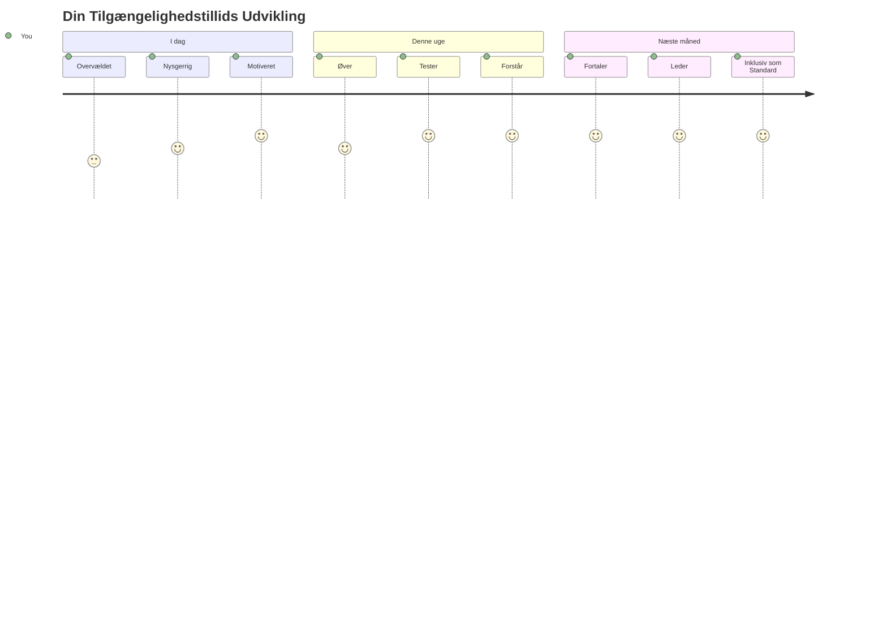
> 🌍 **Du er nu en tilgængelighedsmester!** Du forstår, at gode weboplevelser fungerer for alle, uanset hvordan de får adgang til nettet. Hver tilgængelig funktion, du bygger, gør internettet mere inkluderende. Webben har brug for udviklere som dig, der ser tilgængelighed ikke som en begrænsning, men som en mulighed for at skabe bedre oplevelser for alle brugere. Velkommen til bevægelsen! 🎉

---

<!-- CO-OP TRANSLATOR DISCLAIMER START -->
**Ansvarsfraskrivelse**:
Dette dokument er blevet oversat ved hjælp af AI-oversættelsestjenesten [Co-op Translator](https://github.com/Azure/co-op-translator). Selvom vi bestræber os på nøjagtighed, skal du være opmærksom på, at automatiserede oversættelser kan indeholde fejl eller unøjagtigheder. Det oprindelige dokument på dets modersmål bør betragtes som den autoritative kilde. For kritisk information anbefales professionel menneskelig oversættelse. Vi påtager os ikke ansvar for eventuelle misforståelser eller fejltolkninger, der opstår som følge af brugen af denne oversættelse.
<!-- CO-OP TRANSLATOR DISCLAIMER END -->