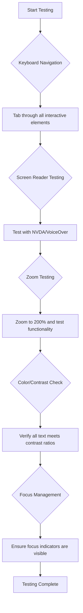
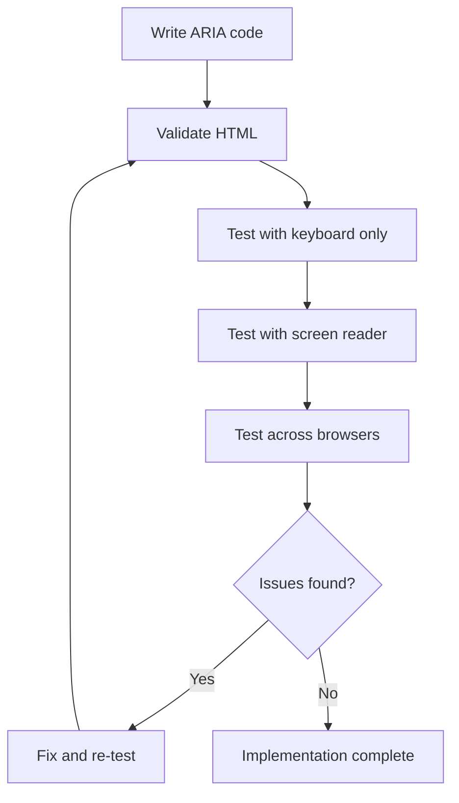

<!--
CO_OP_TRANSLATOR_METADATA:
{
  "original_hash": "90b19cde5b79b29e91babd3138cd8035",
  "translation_date": "2025-10-23T21:57:06+00:00",
  "source_file": "1-getting-started-lessons/3-accessibility/README.md",
  "language_code": "da"
}
-->
# Oprettelse af tilgængelige websider


> Sketchnote af [Tomomi Imura](https://twitter.com/girlie_mac)

## Quiz før lektionen
[Quiz før lektionen](https://ff-quizzes.netlify.app/web/)

> Webben er stærk på grund af dens universelle karakter. Adgang for alle, uanset handicap, er en essentiel del.
>
> \- Sir Timothy Berners-Lee, W3C-direktør og opfinder af World Wide Web

Her er noget, der måske vil overraske dig: Når du bygger tilgængelige websites, hjælper du ikke kun mennesker med handicap – du gør faktisk webben bedre for alle!

Har du nogensinde lagt mærke til de små ramper ved gadehjørner? De blev oprindeligt designet til kørestole, men nu hjælper de også folk med barnevogne, leveringsarbejdere med vogne, rejsende med rullekufferter og cyklister. Det er præcis sådan, tilgængeligt webdesign fungerer – løsninger, der hjælper én gruppe, ender ofte med at gavne alle. Ret sejt, ikke?

I denne lektion vil vi udforske, hvordan man skaber websites, der virkelig fungerer for alle, uanset hvordan de bruger nettet. Du vil opdage praktiske teknikker, der allerede er indbygget i webstandarder, få hands-on erfaring med testværktøjer og se, hvordan tilgængelighed gør dine sider mere brugervenlige for alle.

Ved slutningen af denne lektion vil du have selvtillid til at gøre tilgængelighed til en naturlig del af din udviklingsproces. Klar til at udforske, hvordan gennemtænkte designvalg kan åbne webben for milliarder af brugere? Lad os komme i gang!

> Du kan tage denne lektion på [Microsoft Learn](https://docs.microsoft.com/learn/modules/web-development-101/accessibility/?WT.mc_id=academic-77807-sagibbon)!

## Forståelse af hjælpemidler

Før vi begynder at kode, lad os tage et øjeblik til at forstå, hvordan mennesker med forskellige evner faktisk oplever webben. Dette er ikke bare teori – at forstå disse navigationsmønstre i den virkelige verden vil gøre dig til en meget bedre udvikler!

Hjælpemidler er ret fantastiske værktøjer, der hjælper mennesker med handicap med at interagere med websites på måder, der kan overraske dig. Når du først forstår, hvordan disse teknologier fungerer, bliver det meget mere intuitivt at skabe tilgængelige weboplevelser. Det er som at lære at se din kode gennem en andens øjne.

### Skærmlæsere

[Skærmlæsere](https://en.wikipedia.org/wiki/Screen_reader) er ret sofistikerede teknologier, der konverterer digital tekst til tale eller punktskrift. Selvom de primært bruges af personer med synshandicap, er de også meget nyttige for brugere med indlæringsvanskeligheder som dysleksi.

Jeg kan godt lide at tænke på en skærmlæser som en virkelig smart fortæller, der læser en bog højt for dig. Den læser indholdet højt i en logisk rækkefølge, annoncerer interaktive elementer som "knap" eller "link" og giver tastaturgenveje til at navigere rundt på en side. Men her er sagen – skærmlæsere kan kun udføre deres magi, hvis vi bygger websites med korrekt struktur og meningsfuldt indhold. Det er her, du som udvikler kommer ind i billedet!

**Populære skærmlæsere på tværs af platforme:**
- **Windows**: [NVDA](https://www.nvaccess.org/about-nvda/) (gratis og mest populær), [JAWS](https://webaim.org/articles/jaws/), [Narrator](https://support.microsoft.com/windows/complete-guide-to-narrator-e4397a0d-ef4f-b386-d8ae-c172f109bdb1/?WT.mc_id=academic-77807-sagibbon) (indbygget)
- **macOS/iOS**: [VoiceOver](https://support.apple.com/guide/voiceover/welcome/10) (indbygget og meget kapabel)
- **Android**: [TalkBack](https://support.google.com/accessibility/android/answer/6283677) (indbygget)
- **Linux**: [Orca](https://wiki.gnome.org/Projects/Orca) (gratis og open-source)

**Hvordan skærmlæsere navigerer webindhold:**

Skærmlæsere tilbyder flere navigationsmetoder, der gør browsing effektiv for erfarne brugere:
- **Sekventiel læsning**: Læser indhold fra top til bund, som at følge en bog
- **Landmark-navigation**: Hopper mellem sektioner på siden (header, nav, main, footer)
- **Overskriftsnavigation**: Springer mellem overskrifter for at forstå sidens struktur
- **Linklister**: Genererer en liste over alle links for hurtig adgang
- **Formularfelter**: Navigerer direkte mellem inputfelter og knapper

> 💡 **Her er noget, der blæste mig omkuld**: 68% af skærmlæserbrugere navigerer primært via overskrifter ([WebAIM Survey](https://webaim.org/projects/screenreadersurvey9/#finding)). Det betyder, at din overskriftsstruktur er som et kort for brugerne – når du gør det rigtigt, hjælper du bogstaveligt talt folk med at finde rundt i dit indhold hurtigere!

### Opbygning af din testarbejdsgang

Her er gode nyheder – effektiv tilgængelighedstestning behøver ikke at være overvældende! Du vil gerne kombinere automatiserede værktøjer (de er fantastiske til at fange åbenlyse problemer) med noget hands-on testning. Her er en systematisk tilgang, som jeg har fundet ud af fanger de fleste problemer uden at tage hele din dag:

**Essentiel manuel testarbejdsgang:**



**Trin-for-trin testtjekliste:**
1. **Tastaturnavigation**: Brug kun Tab, Shift+Tab, Enter, Space og piletaster
2. **Skærmlæsertest**: Aktiver NVDA, VoiceOver eller Narrator og naviger med lukkede øjne
3. **Zoomtest**: Test ved 200% og 400% zoomniveauer
4. **Farvekontrastverifikation**: Tjek al tekst og UI-komponenter
5. **Fokusindikator-test**: Sørg for, at alle interaktive elementer har synlige fokusmarkeringer

✅ **Start med Lighthouse**: Åbn din browsers DevTools, kør en Lighthouse-tilgængelighedsaudit, og brug resultaterne til at fokusere på dine manuelle testområder.

### Zoom- og forstørrelsesværktøjer

Du ved, hvordan du nogle gange zoomer ind på din telefon, når teksten er for lille, eller kniber øjnene sammen på din laptops skærm i stærkt sollys? Mange brugere er afhængige af forstørrelsesværktøjer for at gøre indhold læsbart hver eneste dag. Dette inkluderer personer med nedsat syn, ældre voksne og alle, der nogensinde har prøvet at læse en hjemmeside udendørs.

Moderne zoomteknologier er udviklet ud over blot at gøre ting større. At forstå, hvordan disse værktøjer fungerer, vil hjælpe dig med at skabe responsive designs, der forbliver funktionelle og attraktive på ethvert forstørrelsesniveau.

**Moderne browser-zoomfunktioner:**
- **Sidezoom**: Skalerer alt indhold proportionalt (tekst, billeder, layout) - dette er den foretrukne metode
- **Kun tekstzoom**: Øger skrifttypestørrelsen, mens den oprindelige layout bevares
- **Pinch-to-zoom**: Mobilgestik til midlertidig forstørrelse
- **Browserstøtte**: Alle moderne browsere understøtter zoom op til 500% uden at bryde funktionaliteten

**Specialiseret forstørrelsessoftware:**
- **Windows**: [Magnifier](https://support.microsoft.com/windows/use-magnifier-to-make-things-on-the-screen-easier-to-see-414948ba-8b1c-d3bd-8615-0e5e32204198) (indbygget), [ZoomText](https://www.freedomscientific.com/training/zoomtext/getting-started/)
- **macOS/iOS**: [Zoom](https://www.apple.com/accessibility/mac/vision/) (indbygget med avancerede funktioner)

> ⚠️ **Designovervejelse**: WCAG kræver, at indhold forbliver funktionelt, når det zoomes til 200%. På dette niveau bør horisontal scrolling være minimal, og alle interaktive elementer bør forblive tilgængelige.

✅ **Test dit responsive design**: Zoom din browser til 200% og 400%. Tilpasser dit layout sig elegant? Kan du stadig få adgang til alle funktioner uden overdreven scrolling?

## Moderne tilgængelighedstestværktøjer

Nu hvor du forstår, hvordan folk navigerer på nettet med hjælpemidler, lad os udforske de værktøjer, der hjælper dig med at bygge og teste tilgængelige websites.

Tænk på det sådan: automatiserede værktøjer er gode til at fange åbenlyse problemer (som manglende alt-tekst), mens hands-on testning hjælper dig med at sikre, at dit site føles godt at bruge i den virkelige verden. Sammen giver de dig selvtillid til, at dine sites fungerer for alle.

### Farvekontrasttest

Her er gode nyheder: farvekontrast er et af de mest almindelige tilgængelighedsproblemer, men det er også et af de nemmeste at løse. God kontrast gavner alle – fra brugere med synshandicap til folk, der prøver at læse deres telefoner på stranden.

**WCAG-kontrastkrav:**

| Teksttype | WCAG AA (Minimum) | WCAG AAA (Forbedret) |
|-----------|-------------------|---------------------|
| **Normal tekst** (under 18pt) | 4.5:1 kontrastforhold | 7:1 kontrastforhold |
| **Stor tekst** (18pt+ eller 14pt+ fed) | 3:1 kontrastforhold | 4.5:1 kontrastforhold |
| **UI-komponenter** (knapper, formularrammer) | 3:1 kontrastforhold | 3:1 kontrastforhold |

**Essentielle testværktøjer:**
- [Colour Contrast Analyser](https://www.tpgi.com/color-contrast-checker/) - Desktop-app med farvevælger
- [WebAIM Contrast Checker](https://webaim.org/resources/contrastchecker/) - Webbaseret med øjeblikkelig feedback
- [Stark](https://www.getstark.co/) - Designværktøjs-plugin til Figma, Sketch, Adobe XD
- [Accessible Colors](https://accessible-colors.com/) - Find tilgængelige farvepaletter

✅ **Byg bedre farvepaletter**: Start med dine brandfarver og brug kontrasttestere til at skabe tilgængelige variationer. Dokumentér disse som en del af dit designsystems tilgængelige farvetokens.

### Omfattende tilgængelighedsaudit

Den mest effektive tilgængelighedstest kombinerer flere tilgange. Intet enkelt værktøj fanger alt, så opbygning af en testrutine med forskellige metoder sikrer grundig dækning.

**Browserbaseret test (indbygget i DevTools):**
- **Chrome/Edge**: Lighthouse-tilgængelighedsaudit + Tilgængelighedspanel
- **Firefox**: Tilgængelighedsinspektør med detaljeret trævisning
- **Safari**: Audit-fane i Web Inspector med VoiceOver-simulering

**Professionelle testudvidelser:**
- [axe DevTools](https://www.deque.com/axe/devtools/) - Industri-standard automatiseret test
- [WAVE](https://wave.webaim.org/extension/) - Visuel feedback med fejlmarkering
- [Accessibility Insights](https://accessibilityinsights.io/) - Microsofts omfattende testværktøj

**Kommandolinje og CI/CD-integration:**
- [axe-core](https://github.com/dequelabs/axe-core) - JavaScript-bibliotek til automatiseret test
- [Pa11y](https://pa11y.org/) - Kommandolinje tilgængelighedstestværktøj
- [Lighthouse CI](https://github.com/GoogleChrome/lighthouse-ci) - Automatiseret tilgængelighedsscore

> 🎯 **Testmål**: Stræb efter en Lighthouse-tilgængelighedsscore på 95+ som din baseline. Husk, automatiserede værktøjer fanger kun omkring 30-40% af tilgængelighedsproblemer – manuel testning er stadig essentiel!

## Byg tilgængelighed fra bunden

Nøglen til succes med tilgængelighed er at indarbejde det i din grundstruktur fra dag ét. Jeg ved, det kan være fristende at tænke "Jeg tilføjer tilgængelighed senere," men det er som at prøve at tilføje en rampe til et hus, efter det allerede er bygget. Muligt? Ja. Let? Ikke rigtig.

Tænk på tilgængelighed som planlægning af et hus – det er meget nemmere at inkludere kørestolsadgang i dine oprindelige arkitektplaner end at eftermontere alt senere.

### POUR-principperne: Din tilgængelighedsfundament

Web Content Accessibility Guidelines (WCAG) er bygget omkring fire grundlæggende principper, der staver POUR. Bare rolig – dette er ikke tørre akademiske begreber! De er faktisk praktiske retningslinjer for at skabe indhold, der fungerer for alle.

Når du får styr på POUR, bliver det meget mere intuitivt at træffe tilgængelighedsbeslutninger. Det er som at have en mental tjekliste, der guider dine designvalg. Lad os bryde det ned:

**🔍 Opfatteligt**: Information skal præsenteres på måder, som brugere kan opfatte gennem deres tilgængelige sanser

- Giv tekstalternativer til ikke-tekstindhold (billeder, videoer, lyd)
- Sørg for tilstrækkelig farvekontrast for al tekst og UI-komponenter
- Tilbyd undertekster og transskriptioner til multimedieindhold
- Design indhold, der forbliver funktionelt, når det forstørres op til 200%
- Brug flere sensoriske karakteristika (ikke kun farve) til at formidle information

**🎮 Operabelt**: Alle grænsefladekomponenter skal kunne betjenes via tilgængelige inputmetoder

- Gør al funktionalitet tilgængelig via tastaturnavigation
- Giv brugerne tilstrækkelig tid til at læse og interagere med indhold
- Undgå indhold, der forårsager anfald eller vestibulære lidelser
- Hjælp brugere med at navigere effektivt med klar struktur og landemærker
- Sørg for, at interaktive elementer har tilstrækkelige målstørrelser (minimum 44px)

**📖 Forståeligt**: Information og UI-betjening skal være klar og forståelig

- Brug klart, enkelt sprog, der passer til din målgruppe
- Sørg for, at indhold vises og fungerer på forudsigelige, konsistente måder
- Giv klare instruktioner og fejlmeddelelser for brugerinput
- Hjælp brugere med at forstå og rette fejl i formularer
- Organiser indhold med logisk læserækkefølge og informationshierarki

**💪 Robust**: Indhold skal fungere pålideligt på tværs af forskellige teknologier og hjælpemidler

- Brug gyldig, semantisk HTML som din grundstruktur
- Sørg for kompatibilitet med nuværende og fremtidige hjælpemidler
- Følg webstandarder og bedste praksis for markup
- Test på tværs af forskellige browsere, enheder og hjælpemidler
- Strukturér indhold, så det nedgraderes elegant, når avancerede funktioner ikke understøttes

## Skabelse af tilgængeligt visuelt design

Godt visuelt design og tilgængelighed går hånd i hånd. Når du designer med tilgængelighed i tankerne, opdager du ofte, at disse begrænsninger fører til renere, mere elegante løsninger, der gavner alle brugere.

Lad os udforske, hvordan man skaber visuelt tiltalende designs, der fungerer for alle, uanset deres visuelle evner eller de forhold, hvorunder de ser dit indhold.

### Farve- og visuelle tilgængelighedsstrategier
Farver er stærke til kommunikation, men de bør aldrig være den eneste måde, du formidler vigtig information på. Design ud over farver skaber mere robuste og inkluderende oplevelser, der fungerer i flere situationer.

**Design for forskelle i farvesyn:**

Omkring 8% af mænd og 0,5% af kvinder har en form for forskel i farvesyn (ofte kaldet "farveblindhed"). De mest almindelige typer er:
- **Deuteranopia**: Vanskeligheder med at skelne mellem rød og grøn
- **Protanopia**: Rød fremstår mere dæmpet
- **Tritanopia**: Vanskeligheder med blå og gul (sjælden)

**Inklusive farvestrategier:**

```css
/* ❌ Bad: Using only color to indicate status */
.error { color: red; }
.success { color: green; }

/* ✅ Good: Color plus icons and context */
.error {
  color: #d32f2f;
  border-left: 4px solid #d32f2f;
}
.error::before {
  content: "⚠️";
  margin-right: 8px;
}

.success {
  color: #2e7d32;
  border-left: 4px solid #2e7d32;
}
.success::before {
  content: "✅";
  margin-right: 8px;
}
```

**Ud over grundlæggende kontrastkrav:**
- Test dine farvevalg med farveblind-simulatorer
- Brug mønstre, teksturer eller former sammen med farvekodning
- Sørg for, at interaktive tilstande forbliver genkendelige uden farver
- Overvej, hvordan dit design ser ud i højkontrasttilstand

✅ **Test din farveadgang**: Brug værktøjer som [Coblis](https://www.color-blindness.com/coblis-color-blindness-simulator/) for at se, hvordan dit websted ser ud for brugere med forskellige typer farvesyn.

### Fokusindikatorer og interaktionsdesign

Fokusindikatorer er den digitale ækvivalent til en markør – de viser tastaturbrugere, hvor de befinder sig på siden. Veludformede fokusindikatorer forbedrer oplevelsen for alle ved at gøre interaktioner klare og forudsigelige.

**Moderne bedste praksis for fokusindikatorer:**

```css
/* Enhanced focus styles that work across browsers */
button:focus-visible {
  outline: 2px solid #0066cc;
  outline-offset: 2px;
  box-shadow: 0 0 0 4px rgba(0, 102, 204, 0.25);
}

/* Remove focus outline for mouse users, preserve for keyboard users */
button:focus:not(:focus-visible) {
  outline: none;
}

/* Focus-within for complex components */
.card:focus-within {
  box-shadow: 0 0 0 3px rgba(74, 144, 164, 0.5);
  border-color: #4A90A4;
}

/* Ensure focus indicators meet contrast requirements */
.custom-focus:focus-visible {
  outline: 3px solid #ffffff;
  outline-offset: 2px;
  box-shadow: 0 0 0 6px #000000;
}
```

**Krav til fokusindikatorer:**
- **Synlighed**: Skal have mindst 3:1 kontrastforhold med omkringliggende elementer
- **Bredde**: Minimum 2px tykkelse rundt om hele elementet
- **Vedholdenhed**: Skal forblive synlig, indtil fokus flyttes
- **Adskillelse**: Skal være visuelt forskellig fra andre UI-tilstande

> 💡 **Designtip**: Gode fokusindikatorer bruger ofte en kombination af kontur, box-shadow og farveændringer for at sikre synlighed på forskellige baggrunde og kontekster.

✅ **Auditér fokusindikatorer**: Tab dig gennem dit websted og bemærk, hvilke elementer der har klare fokusindikatorer. Er nogle svære at se eller helt mangler?

### Semantisk HTML: Fundamentet for tilgængelighed

Semantisk HTML er som at give hjælpemidler et GPS-system til dit websted. Når du bruger de rigtige HTML-elementer til deres tilsigtede formål, giver du skærmlæsere, tastaturer og andre værktøjer et detaljeret kort, der hjælper brugerne med at navigere effektivt.

Her er en analogi, der virkelig gav mening for mig: semantisk HTML er forskellen mellem et velorganiseret bibliotek med klare kategorier og nyttige skilte versus et lager, hvor bøgerne er spredt tilfældigt. Begge steder har de samme bøger, men hvor ville du helst prøve at finde noget? Præcis!

**Byggestenene i en tilgængelig sidestruktur:**

```html
<!-- Landmark elements provide page navigation structure -->
<header>
  <h1>Your Site Name</h1>
  <nav aria-label="Main navigation">
    <ul>
      <li><a href="/home">Home</a></li>
      <li><a href="/about">About</a></li>
      <li><a href="/services">Services</a></li>
    </ul>
  </nav>
</header>

<main>
  <article>
    <header>
      <h1>Article Title</h1>
      <p>Published on <time datetime="2024-10-14">October 14, 2024</time></p>
    </header>
    
    <section>
      <h2>First Section</h2>
      <p>Content that relates to this section...</p>
    </section>
    
    <section>
      <h2>Second Section</h2>
      <p>More related content...</p>
    </section>
  </article>
  
  <aside>
    <h2>Related Links</h2>
    <nav aria-label="Related articles">
      <ul>
        <li><a href="/related-1">First related article</a></li>
        <li><a href="/related-2">Second related article</a></li>
      </ul>
    </nav>
  </aside>
</main>

<footer>
  <p>&copy; 2024 Your Site Name. All rights reserved.</p>
  <nav aria-label="Footer links">
    <ul>
      <li><a href="/privacy">Privacy Policy</a></li>
      <li><a href="/contact">Contact Us</a></li>
    </ul>
  </nav>
</footer>
```

**Hvorfor semantisk HTML transformerer tilgængelighed:**

| Semantisk element | Formål | Fordel for skærmlæsere |
|------------------|---------|----------------------|
| `<header>` | Side- eller sektionens overskrift | "Banner-landmærke" - hurtig navigation til toppen |
| `<nav>` | Navigationslinks | "Navigationslandmærke" - liste over navigationssektioner |
| `<main>` | Primært sideindhold | "Hovedlandmærke" - spring direkte til indhold |
| `<article>` | Selvstændigt indhold | Angiver artikelgrænser |
| `<section>` | Tematiske indholdsgrupper | Giver indholdsstruktur |
| `<aside>` | Relateret sideindhold | "Komplementært landmærke" |
| `<footer>` | Side- eller sektionens fodnote | "Contentinfo-landmærke" |

**Skærmlæser-superkræfter med semantisk HTML:**
- **Landmærkenavigation**: Spring mellem større sektioner på siden øjeblikkeligt
- **Overskriftsoversigt**: Generer en indholdsfortegnelse fra din overskriftsstruktur
- **Elementlister**: Opret lister over alle links, knapper eller formularfelter
- **Kontekstforståelse**: Forstå relationer mellem indholdssektioner

> 🎯 **Hurtig test**: Prøv at navigere på dit websted med en skærmlæser ved hjælp af landmærkegenveje (D for landmærke, H for overskrift, K for link i NVDA/JAWS). Giver navigationen mening?

✅ **Auditér din semantiske struktur**: Brug tilgængelighedspanelet i din browsers DevTools til at se tilgængelighedstræet og sikre, at din markup skaber en logisk struktur.

### Overskriftsstruktur: Skab en logisk indholdsoversigt

Overskrifter er helt afgørende for tilgængeligt indhold – de er som rygraden, der holder det hele sammen. Skærmlæserbrugere er stærkt afhængige af overskrifter for at forstå og navigere i dit indhold. Tænk på det som at give en indholdsfortegnelse for din side.

**Her er den gyldne regel for overskrifter:**
Spring aldrig niveauer over. Gå altid logisk frem fra `<h1>` til `<h2>` til `<h3>` osv. Kan du huske, da du lavede dispositioner i skolen? Det er præcis samme princip – du ville ikke springe fra "I. Hovedpunkt" direkte til "C. Under-underpunkt" uden et "A. Underpunkt" imellem, vel?

**Eksempel på perfekt overskriftsstruktur:**

```html
<!-- ✅ Excellent: Logical, hierarchical progression -->
<main>
  <h1>Complete Guide to Web Accessibility</h1>
  
  <section>
    <h2>Understanding Screen Readers</h2>
    <p>Introduction to screen reader technology...</p>
    
    <h3>Popular Screen Reader Software</h3>
    <p>NVDA, JAWS, and VoiceOver comparison...</p>
    
    <h3>Testing with Screen Readers</h3>
    <p>Step-by-step testing instructions...</p>
  </section>
  
  <section>
    <h2>Color and Contrast Guidelines</h2>
    <p>Designing with sufficient contrast...</p>
    
    <h3>WCAG Contrast Requirements</h3>
    <p>Understanding the different contrast levels...</p>
    
    <h3>Testing Tools and Techniques</h3>
    <p>Tools for verifying contrast ratios...</p>
  </section>
</main>
```

```html
<!-- ❌ Problematic: Skipping levels, inconsistent structure -->
<h1>Page Title</h1>
<h3>Subsection</h3> <!-- Skipped h2 -->
<h2>This should come before h3</h2>
<h1>Another main heading?</h1> <!-- Multiple h1s -->
```

**Bedste praksis for overskrifter:**
- **Én `<h1>` pr. side**: Typisk din hovedsidetitel eller primære indholdsoverskrift
- **Logisk progression**: Spring aldrig niveauer over (h1 → h2 → h3, ikke h1 → h3)
- **Beskrivende indhold**: Gør overskrifter meningsfulde, når de læses uden kontekst
- **Visuel styling med CSS**: Brug CSS til udseende, HTML-niveauer til struktur

**Statistikker om skærmlæsernavigation:**
- 68% af skærmlæserbrugere navigerer via overskrifter ([WebAIM Survey](https://webaim.org/projects/screenreadersurvey9/#finding))
- Brugere forventer at finde en logisk overskriftsstruktur
- Overskrifter giver den hurtigste måde at forstå sidestrukturen på

> 💡 **Pro Tip**: Brug browserudvidelser som "HeadingsMap" til at visualisere din overskriftsstruktur. Den bør læses som en velorganiseret indholdsfortegnelse.

✅ **Test din overskriftsstruktur**: Brug en skærmlæsers overskriftsnavigation (H-tasten i NVDA) til at springe gennem dine overskrifter. Fortæller progressionen historien om dit indhold logisk?

### Avancerede visuelle tilgængelighedsteknikker

Ud over de grundlæggende krav til kontrast og farver er der sofistikerede teknikker, der hjælper med at skabe virkelig inkluderende visuelle oplevelser. Disse metoder sikrer, at dit indhold fungerer under forskellige visningsforhold og med hjælpemidler.

**Vigtige strategier for visuel kommunikation:**

- **Multimodal feedback**: Kombiner visuelle, tekstuelle og nogle gange lydmæssige signaler
- **Progressiv afsløring**: Præsenter information i fordøjelige bidder
- **Konsistente interaktionsmønstre**: Brug velkendte UI-konventioner
- **Responsiv typografi**: Skaler tekst passende på tværs af enheder
- **Indlæsnings- og fejltilstande**: Giv klar feedback for alle brugerhandlinger

**CSS-værktøjer til forbedret tilgængelighed:**

```css
/* Screen reader only text - visually hidden but accessible */
.sr-only {
  position: absolute;
  width: 1px;
  height: 1px;
  padding: 0;
  margin: -1px;
  overflow: hidden;
  clip: rect(0, 0, 0, 0);
  white-space: nowrap;
  border: 0;
}

/* Skip link for keyboard navigation */
.skip-link {
  position: absolute;
  top: -40px;
  left: 6px;
  background: #000000;
  color: #ffffff;
  padding: 8px 16px;
  text-decoration: none;
  border-radius: 4px;
  font-weight: bold;
  transition: top 0.3s ease;
  z-index: 1000;
}

.skip-link:focus {
  top: 6px;
}

/* Reduced motion respect */
@media (prefers-reduced-motion: reduce) {
  .skip-link {
    transition: none;
  }
  
  * {
    animation-duration: 0.01ms !important;
    animation-iteration-count: 1 !important;
    transition-duration: 0.01ms !important;
  }
}

/* High contrast mode support */
@media (prefers-contrast: high) {
  .button {
    border: 2px solid;
  }
}
```

> 🎯 **Tilgængelighedsmønster**: "Skip link" er afgørende for tastaturbrugere. Det bør være det første fokuserbare element på din side og springe direkte til hovedindholdet.

✅ **Implementér skip navigation**: Tilføj skip links til dine sider og test dem ved at trykke på Tab, så snart siden indlæses. De bør dukke op og give dig mulighed for at springe til hovedindholdet.

## Skab meningsfuld linktekst

Links er i bund og grund internettets motorveje, men dårligt skrevet linktekst er som vejskilte, der bare siger "Sted" i stedet for "Indre København." Ikke særlig hjælpsomt, vel?

Her er noget, der virkelig overraskede mig, da jeg først lærte det: skærmlæsere kan udtrække alle links fra en side og vise dem som én stor liste. Forestil dig, hvis nogen gav dig en oversigt over alle links på din side. Ville hvert enkelt give mening alene? Det er testen, din linktekst skal bestå!

### Forstå linknavigationsmønstre

Skærmlæsere tilbyder kraftfulde linknavigationsfunktioner, der afhænger af veludformet linktekst:

**Linknavigationsmetoder:**
- **Sekventiel læsning**: Links læses i kontekst som en del af indholdsflowet
- **Generering af linklister**: Alle sidens links samlet i en søgbar oversigt
- **Hurtig navigation**: Spring mellem links ved hjælp af tastaturgenveje (K i NVDA)
- **Søgefunktionalitet**: Find specifikke links ved at skrive delvis tekst

**Hvorfor kontekst betyder noget:**
Når skærmlæserbrugere genererer en linkliste, ser de noget som dette:
- "Download rapport"
- "Lær mere"
- "Klik her"
- "Privatlivspolitik"
- "Klik her"

Kun to af disse links giver nyttig information, når de læses uden kontekst!

> 📊 **Brugerindvirkning**: Skærmlæserbrugere scanner linklister for hurtigt at forstå sideindhold. Generisk linktekst tvinger dem til at navigere tilbage til hver links kontekst, hvilket betydeligt forsinker deres browsingoplevelse.

### Almindelige fejl i linktekst, der skal undgås

At forstå, hvad der ikke fungerer, hjælper dig med at genkende og rette tilgængelighedsproblemer i eksisterende indhold.

**❌ Generisk linktekst, der ikke giver kontekst:**

```html
<!-- Meaningless when read from a link list -->
<p>Our sustainability efforts are detailed in our recent report. 
   <a href="/sustainability-2024.pdf">Click here</a> to view it.</p>

<!-- Repeated generic text throughout the page -->
<div class="article-card">
  <h3>Web Accessibility Guide</h3>
  <p>Learn the fundamentals...</p>
  <a href="/accessibility-guide">Read more</a>
</div>
<div class="article-card">
  <h3>Color Contrast Tips</h3>
  <p>Improve your design...</p>
  <a href="/color-contrast">Read more</a>
</div>

<!-- URLs as link text (difficult for screen readers to announce) -->
<p>Visit https://www.w3.org/WAI/WCAG21/quickref/ for WCAG guidelines.</p>

<!-- Vague action words -->
<a href="/contact">Go</a> | <a href="/about">See</a> | <a href="/help">View</a>
```

**Hvorfor disse mønstre fejler:**
- **"Klik her"** fortæller ikke brugerne noget om destinationen
- **"Læs mere"** gentaget flere gange skaber forvirring
- **Rå URL'er** er svære for skærmlæsere at udtale klart
- **Enkeltord** som "Gå" eller "Se" mangler beskrivende kontekst

### Skriv fremragende linktekst

Beskrivende linktekst gavner alle – seende brugere kan hurtigt scanne links, og skærmlæserbrugere forstår destinationer med det samme.

**✅ Klare, beskrivende eksempler på linktekst:**

```html
<!-- Descriptive text that explains the destination -->
<p>Our comprehensive <a href="/sustainability-2024.pdf">2024 sustainability report (PDF, 2.1MB)</a> details our environmental initiatives.</p>

<!-- Specific, unique link text for each card -->
<div class="article-card">
  <h3>Web Accessibility Guide</h3>
  <p>Learn the fundamentals of inclusive design...</p>
  <a href="/accessibility-guide">Read our complete web accessibility guide</a>
</div>
<div class="article-card">
  <h3>Color Contrast Tips</h3>
  <p>Improve your design with better color choices...</p>
  <a href="/color-contrast">Explore color contrast best practices</a>
</div>

<!-- Meaningful text instead of raw URLs -->
<p>The <a href="https://www.w3.org/WAI/WCAG21/quickref/">WCAG 2.1 Quick Reference guide</a> provides comprehensive accessibility guidelines.</p>

<!-- Descriptive action links -->
<a href="/contact">Contact our support team</a> | 
<a href="/about">About our company</a> | 
<a href="/help">Get help with your account</a>
```

**Bedste praksis for linktekst:**
- **Vær specifik**: "Download kvartalsrapporten" vs. "Download"
- **Inkluder filtype og størrelse**: "(PDF, 1,2MB)" for downloadbare filer
- **Nævn, hvis links åbner eksternt**: "(åbner i nyt vindue)" når det er relevant
- **Brug aktivt sprog**: "Kontakt os" vs. "Kontakt side"
- **Hold det kort**: Stræb efter 2-8 ord, når det er muligt

### Avancerede tilgængelighedsmønstre for links

Nogle gange kræver visuelle designbegrænsninger eller tekniske krav særlige løsninger. Her er sofistikerede teknikker til almindelige udfordrende scenarier:

**Brug af ARIA for forbedret kontekst:**

```html
<!-- When button text must be short but needs more context -->
<a href="/report.pdf" 
   aria-label="Download 2024 annual financial report, PDF format, 2.3MB">
  Download Report
</a>

<!-- When the full context comes from surrounding content -->
<h3 id="sustainability-heading">Sustainability Initiative</h3>
<p>Our efforts to reduce environmental impact...</p>
<a href="/sustainability-details" 
   aria-labelledby="sustainability-heading"
   aria-describedby="sustainability-summary">
  Learn more
</a>
<p id="sustainability-summary">Detailed breakdown of our 2024 environmental goals and achievements</p>
```

**Angivelse af filtyper og eksterne destinationer:**

```html
<!-- Method 1: Include information in visible link text -->
<a href="/annual-report.pdf">
  Download our 2024 annual report (PDF, 2.3MB)
</a>

<!-- Method 2: Use screen reader-only text for file details -->
<a href="/annual-report.pdf">
  Download our 2024 annual report
  <span class="sr-only">(PDF format, 2.3MB)</span>
</a>

<!-- Method 3: External link indication -->
<a href="https://example.com" 
   target="_blank" 
   aria-describedby="external-link-warning">
  Visit external resource
</a>
<span id="external-link-warning" class="sr-only">
  (opens in new window)
</span>

<!-- Method 4: Using CSS for visual indicators -->
<a href="https://example.com" class="external-link">
  External resource
</a>
```

```css
/* Visual indicator for external links */
.external-link::after {
  content: " ↗";
  font-size: 0.8em;
  color: #666;
}

/* Screen reader announcement for external links */
.external-link::before {
  content: "External link: ";
  position: absolute;
  left: -10000px;
  width: 1px;
  height: 1px;
  overflow: hidden;
}
```

> ⚠️ **Vigtigt**: Når du bruger `target="_blank"`, skal du altid informere brugerne om, at linket åbner i et nyt vindue eller en ny fane. Uventede navigationsændringer kan være forvirrende.

✅ **Test din linkkontekst**: Brug din browsers udviklerværktøjer til at generere en liste over alle links på din side. Kan du forstå formålet med hvert link uden nogen omkringliggende kontekst?

## ARIA: Supercharging HTML-tilgængelighed

[Accessible Rich Internet Applications (ARIA)](https://developer.mozilla.org/docs/Web/Accessibility/ARIA) er som at have en universel oversætter mellem dine komplekse webapplikationer og hjælpemidler. Når HTML alene ikke kan udtrykke alt, hvad dine interaktive komponenter gør, træder ARIA til for at udfylde hullerne.

Jeg kan godt lide at tænke på ARIA som at tilføje nyttige kommentarer til din HTML – lidt som sceneanvisninger i et teatermanuskript, der hjælper skuespillerne med at forstå deres roller og relationer.

**Her er den vigtigste regel om ARIA**: Brug altid semantisk HTML først, og tilføj derefter ARIA for at forbedre det. Tænk på ARIA som krydderi, ikke hovedretten. Det bør præcisere og forbedre din HTML-struktur, aldrig erstatte den. Få fundamentet på plads først!

### Strategisk implementering af ARIA

ARIA er kraftfuldt, men med stor magt følger stort ansvar. Forkert brug af ARIA kan gøre tilgængeligheden værre end ingen ARIA overhovedet. Her er, hvornår og hvordan du bruger det effektivt:

**✅ Brug ARIA når:**
- Du opretter brugerdefinerede interaktive widgets (akkordioner, faner, karuseller)
- Du bygger dynamisk indhold, der ændres uden sideopdateringer
- Du giver yderligere kontekst for komplekse UI-relationer
- Du angiver indlæsningsstatus eller live-indholdsopdateringer
- Du skaber app-lignende grænseflader med brugerdefinerede kontroller

**❌ Undgå ARIA når:**
- Standard HTML-elementer allerede giver de nødvendige semantikker
- Du er usikker på, hvordan du implementerer det korrekt
- Det duplikerer information, der allerede er givet af semantisk HTML
- Du ikke har testet med faktiske hjælpemidler

> 🎯 **ARIA's gyldne regel**: "Ændr ikke semantikken, medmindre du absolut skal, sørg altid for tastaturtilgængelighed, og test med rigtige hjælpemidler."

**De fem kategorier af ARIA:**

1. **Roller**: Hvad er dette element? (`button`, `tab`, `dialog`)
2. **Egenskaber**: Hvad er dets funktioner? (`aria-required`, `aria-haspopup`)
3. **Tilstande**: Hvad er dets aktuelle tilstand? (`aria-expanded`, `aria-checked`)
4. **Landmærker**: Hvor er det i sidestrukturen? (`banner`, `navigation`, `main`)
5. **Live-regioner**: Hvordan skal ændringer annonceres? (`aria-live`, `aria-atomic`)

### Vigtige ARIA-mønstre for moderne webapps

Disse mønstre løser de mest almindelige tilgængelighedsudfordringer i interaktive webapplikationer:

**Navngivning og beskrivelse af elementer:**

```html
<!-- aria-label: Provides accessible name when visible text isn't sufficient -->
<button aria-label="Close newsletter subscription dialog">×</button>

<!-- aria-labelledby: References existing text as the accessible name -->
<section aria-labelledby="news-heading">
  <h2 id="news-heading">Latest News</h2>
  <!-- news content -->
</section>

<!-- aria-describedby: Links to additional descriptive text -->
<input type="password" 
       aria-describedby="pwd-requirements pwd-strength"
       required>
<div id="pwd-requirements">
  Password must contain at least 8 characters, including uppercase, lowercase, and numbers.
</div>
<div id="pwd-strength" aria-live="polite">
  <!-- Dynamic password strength indicator -->
</div>
```

**Live-regioner for dynamisk indhold:**

```html
<!-- Polite announcements (don't interrupt current speech) -->
<div aria-live="polite" id="status-updates">
  <!-- Status messages appear here -->
</div>

<!-- Assertive announcements (interrupt and announce immediately) -->
<div aria-live="assertive" id="urgent-alerts">
  <!-- Error messages and critical alerts -->
</div>

<!-- Loading states with live regions -->
<button id="submit-btn" aria-describedby="loading-status">
  Submit Application
</button>
<div id="loading-status" aria-live="polite" aria-atomic="true">
  <!-- "Processing your application..." appears here -->
</div>
```

**Eksempel på interaktiv widget (akkordion):**

```html
<div class="accordion">
  <h3>
    <button aria-expanded="false" 
            aria-controls="panel-1" 
            id="accordion-trigger-1"
            class="accordion-trigger">
      Accessibility Guidelines
    </button>
  </h3>
  <div id="panel-1" 
       role="region"
       aria-labelledby="accordion-trigger-1" 
       hidden>
    <p>WCAG 2.1 provides comprehensive guidelines...</p>
  </div>
</div>
```

```javascript
// JavaScript to manage accordion state
function toggleAccordion(trigger) {
  const panel = document.getElementById(trigger.getAttribute('aria-controls'));
  const isExpanded = trigger.getAttribute('aria-expanded') === 'true';
  
  // Toggle states
  trigger.setAttribute('aria-expanded', !isExpanded);
  panel.hidden = isExpanded;
  
  // Announce change to screen readers
  const status = document.getElementById('status-updates');
  status.textContent = isExpanded ? 'Section collapsed' : 'Section expanded';
}
```

### Bedste praksis for ARIA-implementering

ARIA er kraftfuldt, men kræver omhyggelig implementering. Hvis du følger disse retningslinjer, sikrer du, at din ARIA forbedrer i stedet for at hæmme tilgængeligheden:

**🛡️ Grundprincipper:**

1. **Semantisk HTML først**: Foretræk altid `<button>` frem for `<div role="button">`
2. **Bryder ikke semantikken**: Overstyr aldrig eksisterende HTML-betydning (undgå `<h1 role="button">`)
3. **Bevar tastaturtilgængelighed**: Alle interaktive ARIA-elementer skal være fuldt tastaturtilgængelige
4. **Test med rigtige brugere**: ARIA-support varierer betydeligt mellem hjælpemidler
5. **Start simpelt**: Komplekse ARIA-implementeringer har større risiko for fejl

**🔍 Testarbejdsgang:**



**🚫 Almindelige ARIA-fejl, der bør undgås:**

- **Modstridende information**: Undgå at modarbejde HTML-semantik
- **Overmærkning**: For meget ARIA-information kan forvirre brugere
- **Statisk ARIA**: Glemmer at opdatere ARIA-tilstande, når indhold ændres
- **Utestede implementeringer**: ARIA, der fungerer i teorien, men fejler i praksis
- **Manglende tastatursupport**: ARIA-roller uden tilsvarende tastaturinteraktioner

> 💡 **Testressourcer**: Brug værktøjer som [accessibility-checker](https://www.npmjs.com/package/accessibility-checker) til automatisk ARIA-validering, men test altid med rigtige skærmlæsere for en komplet oplevelse.

✅ **Lær af eksperterne**: Undersøg [ARIA Authoring Practices Guide](https://w3c.github.io/aria-practices/) for gennemprøvede mønstre og implementeringer af komplekse interaktive widgets.

## Gør billeder og medier tilgængelige

Visuelt og auditivt indhold er essentielle dele af moderne weboplevelser, men de kan skabe barrierer, hvis de ikke implementeres med omtanke. Målet er at sikre, at informationen og den følelsesmæssige effekt af dine medier når alle brugere. Når du først har styr på det, bliver det en naturlig del af processen.

Forskellige typer medier kræver forskellige tilgængelighedsmetoder. Det er som madlavning—du ville ikke behandle en delikat fisk på samme måde som en solid bøf. At forstå disse forskelle hjælper dig med at vælge den rette løsning til hver situation.

### Strategisk billedtilgængelighed

Hvert billede på din hjemmeside har et formål. At forstå dette formål hjælper dig med at skrive bedre alternativ tekst og skabe mere inkluderende oplevelser.

**De fire typer billeder og deres strategier for alt-tekst:**

**Informative billeder** - formidler vigtig information:
```html

```

**Dekorative billeder** - rent visuelle uden informationsværdi:
```html

```

**Funktionelle billeder** - fungerer som knapper eller kontroller:
```html
<button>
  
</button>
```

**Komplekse billeder** - grafer, diagrammer, infografik:
```html

<div id="chart-description">
  <p>Detailed description: Sales data shows a steady increase across all quarters...</p>
</div>
```

### Video- og lydtilgængelighed

**Videokrav:**
- **Undertekster**: Tekstversion af talte indhold og lydeffekter
- **Lydbeskrivelser**: Fortælling af visuelle elementer for blinde brugere
- **Transskriptioner**: Fuld tekstversion af alt lyd- og visuelt indhold

```html
<video controls>
  <source src="video.mp4" type="video/mp4">
  <track kind="captions" src="captions.vtt" srclang="en" label="English">
  <track kind="descriptions" src="descriptions.vtt" srclang="en" label="Audio descriptions">
</video>
```

**Lydkrav:**
- **Transskriptioner**: Tekstversion af alt talt indhold
- **Visuelle indikatorer**: For lydindhold alene, giv visuelle signaler

### Moderne billedteknikker

**Brug af CSS til dekorative billeder:**
```css
.hero-section {
  background-image: url('decorative-hero.jpg');
  /* Decorative images in CSS don't need alt text */
}
```

**Responsive billeder med tilgængelighed:**
```html
<picture>
  <source media="(min-width: 800px)" srcset="large-chart.png">
  <source media="(min-width: 400px)" srcset="medium-chart.png">
  
</picture>
```

✅ **Test billedtilgængelighed**: Brug en skærmlæser til at navigere på en side med billeder. Får du nok information til at forstå indholdet?

## Tastaturnavigation og fokusstyring

Mange brugere navigerer på nettet udelukkende med deres tastatur. Dette inkluderer personer med motoriske handicap, erfarne brugere, der finder tastaturer hurtigere end mus, og alle, hvis mus er holdt op med at fungere. At sikre, at din side fungerer godt med tastaturinput, er essentielt og gør ofte din side mere effektiv for alle.

### Grundlæggende tastaturnavigationsmønstre

**Standard tastaturinteraktioner:**
- **Tab**: Flyt fokus fremad gennem interaktive elementer
- **Shift + Tab**: Flyt fokus baglæns
- **Enter**: Aktivér knapper og links
- **Space**: Aktivér knapper, markér afkrydsningsfelter
- **Piletaster**: Naviger inden for komponentgrupper (radioknapper, menuer)
- **Escape**: Luk modaler, dropdowns eller annuller handlinger

### Bedste praksis for fokusstyring

**Synlige fokusindikatorer:**
```css
/* Ensure focus is always visible */
button:focus-visible {
  outline: 2px solid #4A90A4;
  outline-offset: 2px;
}

/* Custom focus styles for different components */
.card:focus-within {
  box-shadow: 0 0 0 3px rgba(74, 144, 164, 0.5);
}
```

**Skip-links for effektiv navigation:**
```html
<a href="#main-content" class="skip-link">Skip to main content</a>
<a href="#navigation" class="skip-link">Skip to navigation</a>

<nav id="navigation">
  <!-- navigation content -->
</nav>
<main id="main-content">
  <!-- main content -->
</main>
```

**Korrekt tab-rækkefølge:**
```html
<!-- Use semantic HTML for natural tab order -->
<form>
  <label for="name">Name:</label>
  <input type="text" id="name" tabindex="0">
  
  <label for="email">Email:</label>
  <input type="email" id="email" tabindex="0">
  
  <button type="submit" tabindex="0">Submit</button>
</form>
```

### Fokusfangst i modaler

Når modale dialoger åbnes, bør fokus være fanget inden for modalet:

```javascript
// Modern focus trap implementation
function trapFocus(element) {
  const focusableElements = element.querySelectorAll(
    'button, [href], input, select, textarea, [tabindex]:not([tabindex="-1"])'
  );
  
  const firstElement = focusableElements[0];
  const lastElement = focusableElements[focusableElements.length - 1];

  element.addEventListener('keydown', (e) => {
    if (e.key === 'Tab') {
      if (e.shiftKey && document.activeElement === firstElement) {
        e.preventDefault();
        lastElement.focus();
      } else if (!e.shiftKey && document.activeElement === lastElement) {
        e.preventDefault();
        firstElement.focus();
      }
    }
    
    if (e.key === 'Escape') {
      closeModal();
    }
  });
  
  // Focus first element when modal opens
  firstElement.focus();
}
```

✅ **Test tastaturnavigation**: Prøv at navigere på din hjemmeside ved kun at bruge Tab-tasten. Kan du nå alle interaktive elementer? Er fokusrækkefølgen logisk? Er fokusindikatorer tydeligt synlige?

## Formular-tilgængelighed

Formularer er afgørende for brugerinteraktion og kræver særlig opmærksomhed på tilgængelighed.

### Etiketter og formularkontrol-association

**Hver formularkontrol skal have en etiket:**
```html
<!-- Explicit labeling (preferred) -->
<label for="username">Username:</label>
<input type="text" id="username" name="username" required>

<!-- Implicit labeling -->
<label>
  Password:
  <input type="password" name="password" required>
</label>

<!-- Using aria-label when visual label isn't desired -->
<input type="search" aria-label="Search products" placeholder="Search...">
```

### Fejlhåndtering og validering

**Tilgængelige fejlmeddelelser:**
```html
<label for="email">Email Address:</label>
<input type="email" id="email" name="email" 
       aria-describedby="email-error" 
       aria-invalid="true" required>
<div id="email-error" role="alert">
  Please enter a valid email address
</div>
```

**Bedste praksis for formularvalidering:**
- Brug `aria-invalid` til at indikere ugyldige felter
- Giv klare, specifikke fejlmeddelelser
- Brug `role="alert"` til vigtige fejlmeddelelser
- Vis fejl både med det samme og ved formularindsendelse

### Fieldsets og gruppering

**Grupper relaterede formularkontroller:**
```html
<fieldset>
  <legend>Shipping Address</legend>
  <label for="street">Street Address:</label>
  <input type="text" id="street" name="street">
  
  <label for="city">City:</label>
  <input type="text" id="city" name="city">
</fieldset>

<fieldset>
  <legend>Preferred Contact Method</legend>
  <input type="radio" id="contact-email" name="contact" value="email">
  <label for="contact-email">Email</label>
  
  <input type="radio" id="contact-phone" name="contact" value="phone">
  <label for="contact-phone">Phone</label>
</fieldset>
```

## Din tilgængelighedsrejse: Vigtige pointer

Tillykke! Du har netop fået den grundlæggende viden til at skabe virkelig inkluderende weboplevelser. Det er ret spændende! Webtilgængelighed handler ikke kun om at opfylde krav—det handler om at anerkende de mange måder, folk interagerer med digitalt indhold på og designe til den fantastiske kompleksitet.

Du er nu en del af et voksende fællesskab af udviklere, der forstår, at godt design fungerer for alle. Velkommen til klubben!

**🎯 Dit tilgængelighedsværktøjssæt inkluderer nu:**

| Grundprincip | Implementering | Effekt |
|--------------|----------------|--------|
| **Semantisk HTML-grundlag** | Brug korrekte HTML-elementer til deres tilsigtede formål | Skærmlæsere kan navigere effektivt, tastaturer fungerer automatisk |
| **Inklusivt visuelt design** | Tilstrækkelig kontrast, meningsfuld farvebrug, synlige fokusindikatorer | Tydeligt for alle under alle lysforhold |
| **Beskrivende indhold** | Meningsfuld linktekst, alt-tekst, overskrifter | Brugere forstår indhold uden visuel kontekst |
| **Tastaturtilgængelighed** | Tab-rækkefølge, tastaturgenveje, fokusstyring | Motorisk tilgængelighed og effektivitet for erfarne brugere |
| **ARIA-forbedring** | Strategisk brug til at udfylde semantiske huller | Komplekse applikationer fungerer med hjælpemidler |
| **Omfattende test** | Automatiske værktøjer + manuel verifikation + test med rigtige brugere | Fang problemer, før de påvirker brugerne |

**🚀 Dine næste skridt:**

1. **Integrer tilgængelighed i din arbejdsgang**: Gør test til en naturlig del af din udviklingsproces
2. **Lær af rigtige brugere**: Søg feedback fra personer, der bruger hjælpemidler
3. **Hold dig opdateret**: Tilgængelighedsteknikker udvikler sig med nye teknologier og standarder
4. **Advokér for inklusion**: Del din viden og gør tilgængelighed til en prioritet i teamet

> 💡 **Husk**: Tilgængelighedsbegrænsninger fører ofte til innovative, elegante løsninger, der gavner alle. Ramper, undertekster og stemmekontrol startede som tilgængelighedsfunktioner og blev mainstream forbedringer.

**Den forretningsmæssige fordel er krystalklar**: Tilgængelige hjemmesider når flere brugere, rangerer bedre på søgemaskiner, har lavere vedligeholdelsesomkostninger og undgår juridiske risici. Men ærligt? Den virkelige grund til at bekymre sig om tilgængelighed går meget dybere. Tilgængelige hjemmesider repræsenterer de bedste værdier på nettet—åbenhed, inklusivitet og ideen om, at alle fortjener lige adgang til information.

Du er nu klar til at bygge fremtidens inkluderende web. Hver tilgængelig hjemmeside, du skaber, gør internettet til et mere imødekommende sted for alle. Det er ret fantastisk, når man tænker over det!

## Yderligere ressourcer

Fortsæt din tilgængelighedslæringsrejse med disse essentielle ressourcer:

**📚 Officielle standarder og retningslinjer:**
- [WCAG 2.1 Guidelines](https://www.w3.org/WAI/WCAG21/quickref/) - Den officielle tilgængelighedsstandard med hurtig reference
- [ARIA Authoring Practices Guide](https://w3c.github.io/aria-practices/) - Omfattende mønstre for interaktive widgets
- [WebAIM Guidelines](https://webaim.org/) - Praktisk, brugervenlig tilgængelighedsvejledning

**🛠️ Værktøjer og testressourcer:**
- [axe DevTools](https://www.deque.com/axe/devtools/) - Industriens standard for tilgængelighedstest
- [A11y Project Checklist](https://www.a11yproject.com/checklist/) - Trin-for-trin tilgængelighedsverifikation
- [Accessibility Insights](https://accessibilityinsights.io/) - Microsofts omfattende testværktøj
- [Color Oracle](https://colororacle.org/) - Farveblindhedssimulator til design-test

**🎓 Læring og fællesskab:**
- [WebAIM Screen Reader Survey](https://webaim.org/projects/screenreadersurvey9/) - Rigtige brugeres præferencer og adfærd
- [Inclusive Components](https://inclusive-components.design/) - Moderne tilgængelige komponentmønstre
- [A11y Coffee](https://a11y.coffee/) - Hurtige tips og indsigter om tilgængelighed
- [Web Accessibility Initiative (WAI)](https://www.w3.org/WAI/) - W3C's omfattende tilgængelighedsressourcer

**🎥 Praktisk læring:**
- [Accessibility Developer Guide](https://www.accessibility-developer-guide.com/) - Praktisk implementeringsvejledning
- [Deque University](https://dequeuniversity.com/) - Professionelle kurser i tilgængelighed

## GitHub Copilot Agent Challenge 🚀

Brug Agent-tilstand til at fuldføre følgende udfordring:

**Beskrivelse:** Opret en tilgængelig modal dialogkomponent, der demonstrerer korrekt fokusstyring, ARIA-attributter og tastaturnavigationsmønstre.

**Prompt:** Byg en komplet modal dialogkomponent med HTML, CSS og JavaScript, der inkluderer: korrekt fokusfangst, ESC-tast til at lukke, klik udenfor for at lukke, ARIA-attributter til skærmlæsere og synlige fokusindikatorer. Modalet skal indeholde en formular med korrekte etiketter og fejlhåndtering. Sørg for, at komponenten opfylder WCAG 2.1 AA-standarder.


## 🚀 Udfordring

Tag denne HTML og omskriv den, så den er så tilgængelig som muligt, baseret på de strategier, du har lært.

```html
<!DOCTYPE html>
<html lang="en">
  <head>
    <meta charset="UTF-8">
    <meta name="viewport" content="width=device-width, initial-scale=1.0">
    <title>Turtle Ipsum - The World's Premier Turtle Fan Club</title>
    <link href='../assets/style.css' rel='stylesheet' type='text/css'>
  </head>
  <body>
    <header class="site-header">
      <h1 class="site-title">Turtle Ipsum</h1>
      <p class="site-subtitle">The World's Premier Turtle Fan Club</p>
    </header>
    
    <nav class="main-nav" aria-label="Main navigation">
      <h2 class="nav-header">Resources</h2>
      <ul class="nav-list">
        <li><a href="https://www.youtube.com/watch?v=CMNry4PE93Y">"I like turtles" video</a></li>
        <li><a href="https://en.wikipedia.org/wiki/Turtle">Basic turtle information</a></li>
        <li><a href="https://en.wikipedia.org/wiki/Turtles_(chocolate)">Chocolate turtles candy</a></li>
      </ul>
    </nav>
    
    <main class="main-content">
      <article>
        <h1>Welcome to Turtle Ipsum</h1>
        <p class="intro">
          <a href="/about">Learn more about our turtle community</a> and discover fascinating facts about these amazing creatures.
        </p>
        <p class="article-text">
          Turtle ipsum dolor sit amet, consectetur adipiscing elit, sed do eiusmod tempor incididunt ut labore et dolore magna aliqua. Ut enim ad minim veniam, quis nostrud exercitation ullamco laboris nisi ut aliquip ex ea commodo consequat. Duis aute irure dolor in reprehenderit in voluptate velit esse cillum dolore eu fugiat nulla pariatur. Excepteur sint occaecat cupidatat non proident, sunt in culpa qui officia deserunt mollit anim id est laborum.
        </p>
      </article>
    </main>
    
    <footer class="footer">
      <section class="newsletter-signup">
        <h2>Stay Updated</h2>
        <button type="button" onclick="showNewsletterForm()">Sign up for turtle news</button>
      </section>
      
      <nav class="footer-nav" aria-label="Footer navigation">
        <h2>Site Pages</h2>
        <ul>
          <li><a href="../">Home</a></li>
          <li><a href="../semantic">Semantic HTML example</a></li>
        </ul>
      </nav>
      
      <p class="footer-copyright">&copy; 2024 Instrument. All rights reserved.</p>
    </footer>
  </body>
</html>
```

**Vigtige forbedringer foretaget:**
- Tilføjet korrekt semantisk HTML-struktur
- Rettet overskriftsstruktur (en enkelt h1, logisk progression)
- Tilføjet meningsfuld linktekst i stedet for "klik her"
- Inkluderet korrekte ARIA-etiketter til navigation
- Tilføjet lang-attribut og korrekte meta-tags
- Brugte knapelement til interaktive elementer
- Struktureret footer-indhold med korrekte landemærker

## Quiz efter forelæsning
[Quiz efter forelæsning](https://ff-quizzes.netlify.app/web/en/)

## Gennemgang & Selvstudie

Mange lande har love om tilgængelighedskrav. Læs op på dit hjemlands tilgængelighedslove. Hvad er dækket, og hvad er ikke? Et eksempel er [denne regeringshjemmeside](https://accessibility.blog.gov.uk/).

## Opgave
 
[Analyser en ikke-tilgængelig hjemmeside](assignment.md)

Credits: [Turtle Ipsum](https://github.com/Instrument/semantic-html-sample) af Instrument

---

**Ansvarsfraskrivelse**:  
Dette dokument er blevet oversat ved hjælp af AI-oversættelsestjenesten [Co-op Translator](https://github.com/Azure/co-op-translator). Selvom vi bestræber os på nøjagtighed, skal du være opmærksom på, at automatiserede oversættelser kan indeholde fejl eller unøjagtigheder. Det originale dokument på dets oprindelige sprog bør betragtes som den autoritative kilde. For kritisk information anbefales professionel menneskelig oversættelse. Vi er ikke ansvarlige for eventuelle misforståelser eller fejltolkninger, der opstår som følge af brugen af denne oversættelse.