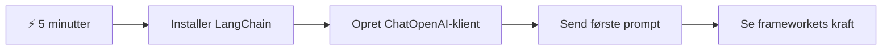
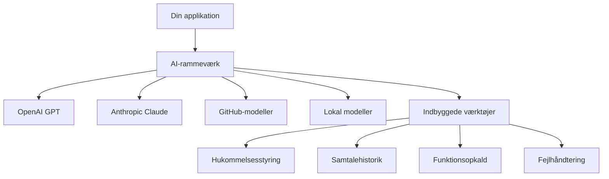
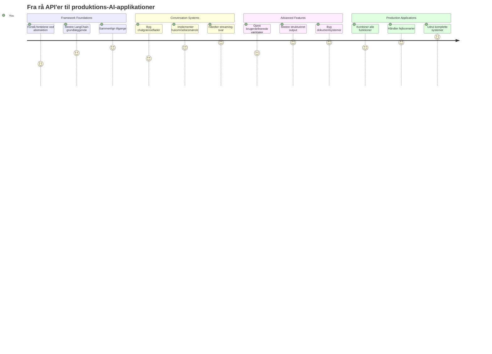
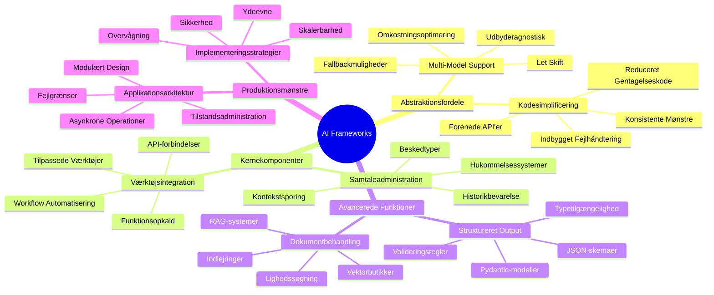
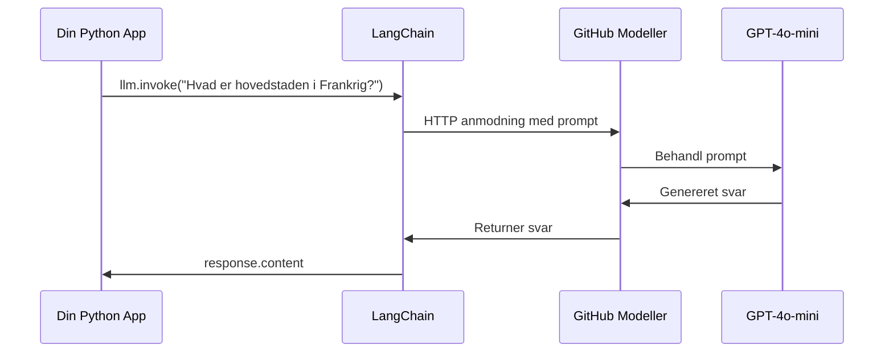
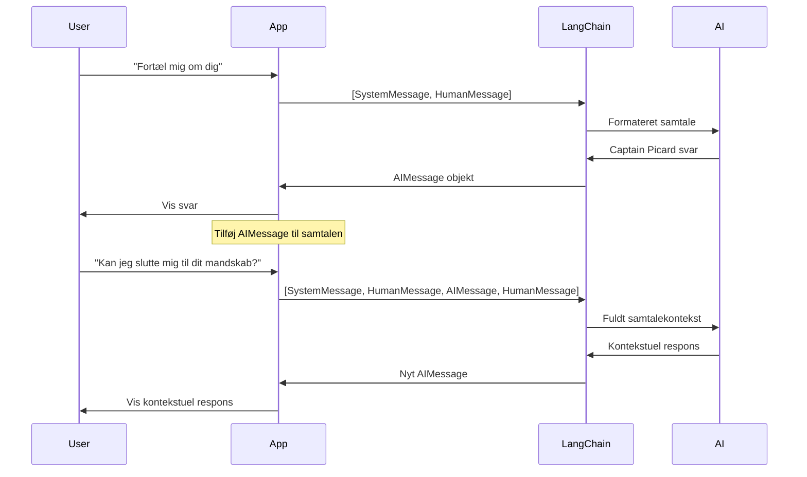
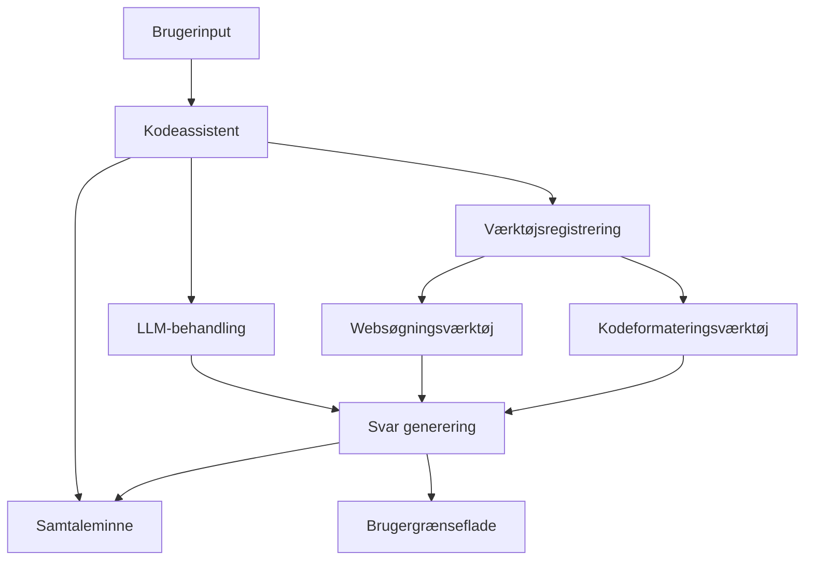
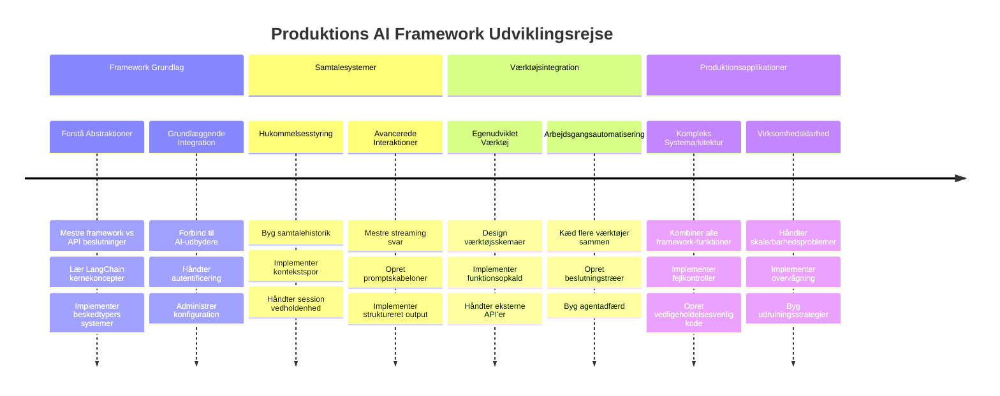
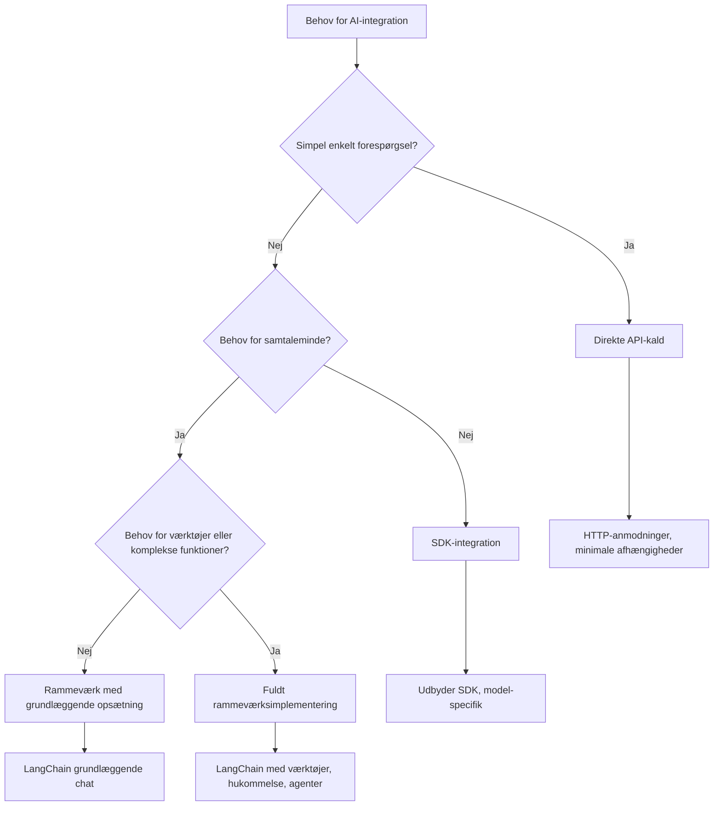

<!--
CO_OP_TRANSLATOR_METADATA:
{
  "original_hash": "3925b6a1c31c60755eaae4d578232c25",
  "translation_date": "2026-01-06T23:21:28+00:00",
  "source_file": "10-ai-framework-project/README.md",
  "language_code": "da"
}
-->
# AI-rammeværk

Har du nogensinde følt dig overvældet ved at bygge AI-applikationer fra bunden? Du er ikke alene! AI-rammeværk er som at have en schweizerkniv til AI-udvikling – de er kraftfulde værktøjer, der kan spare dig tid og hovedpiner, når du bygger intelligente applikationer. Tænk på et AI-rammeværk som et velorganiseret bibliotek: det tilbyder forbyggede komponenter, standardiserede API'er og smarte abstraktioner, så du kan fokusere på at løse problemer i stedet for at kæmpe med implementeringsdetaljer.

I denne lektion vil vi udforske, hvordan rammeværker som LangChain kan gøre det, der tidligere var komplekse AI-integrationsopgaver, til ren og læsbar kode. Du vil opdage, hvordan du tackler virkelighedsnære udfordringer som at holde styr på samtaler, implementere værktøjskald og jonglere forskellige AI-modeller gennem én samlet grænseflade.

Når vi er færdige, vil du vide, hvornår du skal vælge rammeværker frem for rå API-kald, hvordan du effektivt bruger deres abstraktioner, og hvordan du bygger AI-applikationer, der er klar til virkelighedens brug. Lad os udforske, hvad AI-rammeværk kan gøre for dine projekter.

## ⚡ Hvad du kan nå på de næste 5 minutter

**Hurtig start-rute for travle udviklere**


- **Minut 1**: Installer LangChain: `pip install langchain langchain-openai`
- **Minut 2**: Opsæt dit GitHub-token og importer ChatOpenAI-klienten
- **Minut 3**: Opret en simpel samtale med system- og menneskebeskeder
- **Minut 4**: Tilføj et grundlæggende værktøj (som en add-funktion) og se AI-værktøjskald
- **Minut 5**: Oplev forskellen mellem rå API-kald og rammeværksabstraktion

**Hurtig testkode**:
```python
from langchain_openai import ChatOpenAI
from langchain_core.messages import SystemMessage, HumanMessage

llm = ChatOpenAI(
    api_key=os.environ["GITHUB_TOKEN"],
    base_url="https://models.github.ai/inference",
    model="openai/gpt-4o-mini"
)

response = llm.invoke([
    SystemMessage(content="You are a helpful coding assistant"),
    HumanMessage(content="Explain Python functions briefly")
])
print(response.content)
```

**Hvorfor det betyder noget**: På 5 minutter vil du opleve, hvordan AI-rammeværk forvandler kompleks AI-integration til simple metodekald. Dette er fundamentet, der driver produktionsklare AI-applikationer.

## Hvorfor vælge et rammeværk?

Så du er klar til at bygge en AI-app – fantastisk! Men sagen er den: du har flere forskellige veje at gå, og hver har sine fordele og ulemper. Det er lidt ligesom at vælge mellem at gå, cykle eller køre for at komme et sted hen – de vil alle bringe dig derhen, men oplevelsen (og indsatsen) vil være helt forskellig.

Lad os bryde de tre hovedmåder ned, som du kan integrere AI i dine projekter:

| Tilgang | Fordele | Bedst til | Overvejelser |
|----------|------------|----------|--------------|
| **Direkte HTTP-forespørgsler** | Fuld kontrol, ingen afhængigheder | Simple forespørgsler, læringsgrundlag | Mere omstændig kode, manuel fejlbehandling |
| **SDK-integration** | Mindre boilerplate, modelspecifik optimering | Applikationer med én model | Begrænset til specifikke udbydere |
| **AI-rammeværk** | Enheds-API, indbyggede abstraktioner | Multi-model-applikationer, komplekse workflows | Læringskurve, potentiel overabstraktion |

### Rammeværkets fordele i praksis


**Hvorfor rammeværk er vigtige:**
- **Forener** flere AI-udbydere under én grænseflade
- **Håndterer** samtalememorien automatisk
- **Tilbyder** færdigbyggede værktøjer til almindelige opgaver som embeddings og funktionskald
- **Styrer** fejlbehandling og genforsøg-logik
- **Gør** komplekse workflows til læsbare metodekald

> 💡 **Pro Tip**: Brug rammeværk, når du skifter mellem forskellige AI-modeller eller bygger komplekse funktioner som agenter, hukommelse eller værktøjskald. Hold dig til direkte API’er, når du lærer det grundlæggende eller bygger simple, fokuserede applikationer.

**Bundlinjen**: Som når man vælger mellem en håndværkers specialværktøj og et komplet værksted, handler det om at matche værktøjet til opgaven. Rammeværk excellerer til komplekse, funktionsrige applikationer, mens direkte API’er fungerer godt til mere ligetil brug.

## 🗺️ Din læringsrejse mod mestring af AI-rammeværk


**Din rejsemål**: Når du er færdig med denne lektion, har du mestret AI-rammeværksudvikling og kan bygge sofistikerede, produktionsklare AI-applikationer, der kan måle sig med kommercielle AI-assistenter.

## Introduktion

I denne lektion lærer vi at:

- Bruge et almindeligt AI-rammeværk.
- Løse almindelige problemer som chat-samtaler, brug af værktøjer, hukommelse og kontekst.
- Udnytte dette til at bygge AI-apps.

## 🧠 AI-rammeværksudviklingsøkosystem


**Kerneprincip**: AI-rammeværk abstraherer kompleksitet og tilbyder stærke abstraktioner til samtalehåndtering, værktøjsintegration og dokumentbehandling, hvilket gør det muligt for udviklere at bygge sofistikerede AI-applikationer med ren og vedligeholdelig kode.

## Din første AI-prompt

Lad os starte med det grundlæggende ved at skabe din første AI-applikation, der sender et spørgsmål og får et svar tilbage. Som Archimedes, der opdagede forskydningsprincippet i sit bad, fører de enkleste observationer sommetider til de mest kraftfulde indsigter – og rammeværk gør disse indsigter tilgængelige.

### Opsætning af LangChain med GitHub-modeller

Vi vil bruge LangChain til at forbinde til GitHub Models, hvilket er ret fedt, fordi det giver dig gratis adgang til forskellige AI-modeller. Det bedste? Du behøver kun nogle få simple konfigurationsparametre for at komme i gang:

```python
from langchain_openai import ChatOpenAI
import os

llm = ChatOpenAI(
    api_key=os.environ["GITHUB_TOKEN"],
    base_url="https://models.github.ai/inference",
    model="openai/gpt-4o-mini",
)

# Send en simpel prompt
response = llm.invoke("What's the capital of France?")
print(response.content)
```

**Lad os bryde ned, hvad der sker her:**
- **Opretter** en LangChain-klient ved hjælp af klassen `ChatOpenAI` – dette er din port til AI!
- **Konfigurerer** forbindelsen til GitHub Models med dit autentifikationstoken
- **Angiver** hvilken AI-model der skal bruges (`gpt-4o-mini`) – tænk på det som at vælge din AI-assistent
- **Sender** dit spørgsmål med `invoke()`-metoden – her sker magien
- **Ekstraherer** og viser svaret – voilà, du chatter med AI!

> 🔧 **Opsætningsnotat**: Hvis du bruger GitHub Codespaces, er du heldig – `GITHUB_TOKEN` er allerede opsat for dig! Arbejder du lokalt? Ingen problemer, du skal blot oprette et personligt adgangstoken med de rette tilladelser.

**Forventet output:**
```text
The capital of France is Paris.
```


## Opbygning af samtale-AI

Det første eksempel demonstrerer det grundlæggende, men det er kun en enkelt udveksling – du stiller et spørgsmål, får et svar, og det var det. I virkelige applikationer vil du have, at din AI husker, hvad I har talt om, ligesom Watson og Holmes byggede deres efterforskende samtaler over tid.

Her bliver LangChain særligt nyttigt. Det tilbyder forskellige beskedtyper, der hjælper med at strukturere samtaler og lader dig give din AI en personlighed. Du vil bygge chatoplevelser, der bevarer kontekst og karakter.

### Forståelse af beskedtyper

Tænk på disse beskedtyper som forskellige "hatte", som deltagerne bærer i en samtale. LangChain bruger forskellige beskedklasser til at holde styr på, hvem der siger hvad:

| Beskedtype | Formål | Eksempel på brug |
|--------------|---------|------------------|
| `SystemMessage` | Definerer AI-personlighed og adfærd | "Du er en hjælpsom kodeassistent" |
| `HumanMessage` | Repræsenterer brugerinput | "Forklar, hvordan funktioner virker" |
| `AIMessage` | Gemmer AI's svar | Tidligere AI-svar i samtalen |

### Opret din første samtale

Lad os skabe en samtale, hvor vores AI antager en specifik rolle. Vi lader den indtage rollen som kaptajn Picard – en karakter kendt for sin diplomatiske visdom og lederskab:

```python
messages = [
    SystemMessage(content="You are Captain Picard of the Starship Enterprise"),
    HumanMessage(content="Tell me about you"),
]
```

**Nedbrydning af denne samtaleopsætning:**
- **Etablerer** AI'ens rolle og personlighed gennem `SystemMessage`
- **Giver** den første brugerforespørgsel via `HumanMessage`
- **Skaber** et grundlag for en samtale med flere omgange

Den fulde kode til dette eksempel ser sådan ud:

```python
from langchain_core.messages import HumanMessage, SystemMessage
from langchain_openai import ChatOpenAI
import os

llm = ChatOpenAI(
    api_key=os.environ["GITHUB_TOKEN"],
    base_url="https://models.github.ai/inference",
    model="openai/gpt-4o-mini",
)

messages = [
    SystemMessage(content="You are Captain Picard of the Starship Enterprise"),
    HumanMessage(content="Tell me about you"),
]


# virker
response  = llm.invoke(messages)
print(response.content)
```

Du bør se et resultat svarende til:

```text
I am Captain Jean-Luc Picard, the commanding officer of the USS Enterprise (NCC-1701-D), a starship in the United Federation of Planets. My primary mission is to explore new worlds, seek out new life and new civilizations, and boldly go where no one has gone before. 

I believe in the importance of diplomacy, reason, and the pursuit of knowledge. My crew is diverse and skilled, and we often face challenges that test our resolve, ethics, and ingenuity. Throughout my career, I have encountered numerous species, grappled with complex moral dilemmas, and have consistently sought peaceful solutions to conflicts.

I hold the ideals of the Federation close to my heart, believing in the importance of cooperation, understanding, and respect for all sentient beings. My experiences have shaped my leadership style, and I strive to be a thoughtful and just captain. How may I assist you further?
```

For at bevare kontinuiteten i samtalen (i stedet for at nulstille konteksten hver gang) skal du fortsætte med at tilføje svar til din beskedliste. Ligesom mundtlige traditioner, der bevarede historier på tværs af generationer, bygger denne tilgang varig hukommelse:

```python
from langchain_core.messages import HumanMessage, SystemMessage
from langchain_openai import ChatOpenAI
import os

llm = ChatOpenAI(
    api_key=os.environ["GITHUB_TOKEN"],
    base_url="https://models.github.ai/inference",
    model="openai/gpt-4o-mini",
)

messages = [
    SystemMessage(content="You are Captain Picard of the Starship Enterprise"),
    HumanMessage(content="Tell me about you"),
]


# virker
response  = llm.invoke(messages)

print(response.content)

print("---- Next ----")

messages.append(response)
messages.append(HumanMessage(content="Now that I know about you, I'm Chris, can I be in your crew?"))

response  = llm.invoke(messages)

print(response.content)

```

Ret smart, ikke? Hvad der sker her, er, at vi kalder LLM to gange – først med bare vores oprindelige to beskeder, men så igen med hele samtalehistorikken. Det er som om, AI’en virkelig følger med i vores chat!

Når du kører denne kode, vil du få et andet svar, der lyder noget i retning af:

```text
Welcome aboard, Chris! It's always a pleasure to meet those who share a passion for exploration and discovery. While I cannot formally offer you a position on the Enterprise right now, I encourage you to pursue your aspirations. We are always in need of talented individuals with diverse skills and backgrounds. 

If you are interested in space exploration, consider education and training in the sciences, engineering, or diplomacy. The values of curiosity, resilience, and teamwork are crucial in Starfleet. Should you ever find yourself on a starship, remember to uphold the principles of the Federation: peace, understanding, and respect for all beings. Your journey can lead you to remarkable adventures, whether in the stars or on the ground. Engage!
```


Det tager jeg som et måske ;)

## Streaming svar

Har du nogensinde lagt mærke til, hvordan ChatGPT ser ud til at "skrive" sine svar i realtid? Det er streaming i aktion. Som at se en dygtig kalligraf arbejde – hvor tegnene dukker op streg for streg i stedet for at materialisere sig øjeblikkeligt – gør streaming interaktionen mere naturlig og giver øjeblikkelig feedback.

### Implementering af streaming med LangChain

```python
from langchain_openai import ChatOpenAI
import os

llm = ChatOpenAI(
    api_key=os.environ["GITHUB_TOKEN"],
    base_url="https://models.github.ai/inference",
    model="openai/gpt-4o-mini",
    streaming=True
)

# Stream svaret
for chunk in llm.stream("Write a short story about a robot learning to code"):
    print(chunk.content, end="", flush=True)
```

**Hvorfor streaming er fedt:**
- **Viser** indhold, mens det bliver skabt – ikke mere akavet venten!
- **Får** brugerne til at føle, at der rent faktisk sker noget
- **Føles** hurtigere, selv om det teknisk set ikke er det
- **Lader** brugerne begynde at læse, mens AI’en stadig "tænker"

> 💡 **Brugeroplevelsestip**: Streaming gør sig virkelig godt, når du arbejder med længere svar som kodeforklaringer, kreativ skrivning eller detaljerede vejledninger. Dine brugere vil elske at se fremskridtene i stedet for at stirre på en tom skærm!

### 🎯 Pædagogisk gennemgang: Fordele ved rammeværksabstraktion

**Pause og refleksion**: Du har lige oplevet styrken ved AI-rammeværksabstraktioner. Sammenlign, hvad du har lært, med rå API-kald fra tidligere lektioner.

**Hurtig selvevaluering**:
- Kan du forklare, hvordan LangChain forenkler samtalehåndtering sammenlignet med manuelt beskedsoverblik?
- Hvad er forskellen på `invoke()`- og `stream()`-metoderne, og hvornår vil du bruge dem hver især?
- Hvordan forbedrer rammeværkets beskedtyper kodens organisering?

**Virkelighedsforbindelse**: De abstraheringsmønstre, du har lært (beskedtyper, streaminggrænseflader, samtaleminde), bruges i alle større AI-applikationer – fra ChatGPT’s interface til GitHub Copilot’s kodeassistance. Du mestrer de samme arkitektoniske mønstre, som professionelle AI-udviklingsteams benytter.

**Udfordrende spørgsmål**: Hvordan ville du designe en rammeværksabstraktion for håndtering af forskellige AI-modeludbydere (OpenAI, Anthropic, Google) gennem en enkelt grænseflade? Overvej fordele og ulemper.

## Prompt-templates

Prompt-templates fungerer som de retoriske strukturer, der bruges i klassisk oratorik – tænk på, hvordan Cicero ville tilpasse sine talepatterner til forskellige publikum, mens han bevarer den samme overbevisende ramme. De lader dig skabe genanvendelige prompts, hvor du kan udskifte forskellige informationer uden at skulle omskrive alt fra bunden. Når du har sat templaten op, skal du bare udfylde variablerne med de værdier, du har brug for.

### Oprettelse af genanvendelige prompts

```python
from langchain_core.prompts import ChatPromptTemplate

# Definer en skabelon til kodeforklaringer
template = ChatPromptTemplate.from_messages([
    ("system", "You are an expert programming instructor. Explain concepts clearly with examples."),
    ("human", "Explain {concept} in {language} with a practical example for {skill_level} developers")
])

# Brug skabelonen med forskellige værdier
questions = [
    {"concept": "functions", "language": "JavaScript", "skill_level": "beginner"},
    {"concept": "classes", "language": "Python", "skill_level": "intermediate"},
    {"concept": "async/await", "language": "JavaScript", "skill_level": "advanced"}
]

for question in questions:
    prompt = template.format_messages(**question)
    response = llm.invoke(prompt)
    print(f"Topic: {question['concept']}\n{response.content}\n---\n")
```

**Hvorfor du vil elske at bruge templates:**
- **Holder** dine prompts konsistente på tværs af hele din app
- **Ingen mere** rodet strengsammenkædning – bare rene, simple variabler
- **Din AI** opfører sig forudsigeligt, fordi strukturen er ensartet
- **Opdateringer** er lette – ændr templaten én gang, og det er fikset overalt

## Struktureret output

Er du nogensinde blevet frustreret over at skulle parse AI-svar, der kommer tilbage som ustruktureret tekst? Struktureret output er som at lære din AI den systematiske tilgang, som Linnaeus brugte til biologisk klassifikation – organiseret, forudsigeligt og let at arbejde med. Du kan bede om JSON, specifikke datastrukturer eller et hvilket som helst format, du har brug for.

### Definering af output-skemaer

```python
from langchain_core.prompts import ChatPromptTemplate
from langchain_core.output_parsers import JsonOutputParser
from pydantic import BaseModel, Field

class CodeReview(BaseModel):
    score: int = Field(description="Code quality score from 1-10")
    strengths: list[str] = Field(description="List of code strengths")
    improvements: list[str] = Field(description="List of suggested improvements")
    overall_feedback: str = Field(description="Summary feedback")

# Opsæt parseren
parser = JsonOutputParser(pydantic_object=CodeReview)

# Opret prompt med formateringsinstruktioner
prompt = ChatPromptTemplate.from_messages([
    ("system", "You are a code reviewer. {format_instructions}"),
    ("human", "Review this code: {code}")
])

# Formatér prompten med instruktioner
chain = prompt | llm | parser

# Hent struktureret svar
code_sample = """
def calculate_average(numbers):
    return sum(numbers) / len(numbers)
"""

result = chain.invoke({
    "code": code_sample,
    "format_instructions": parser.get_format_instructions()
})

print(f"Score: {result['score']}")
print(f"Strengths: {', '.join(result['strengths'])}")
```

**Hvorfor struktureret output er en game-changer:**
- **Ikke mere** gætteri om, hvilket format du får – det er konsekvent hver gang
- **Kan** kobles direkte til dine databaser og API’er uden ekstra arbejde
- **Fanger** underlige AI-svar, før de ødelægger din app
- **Gør** din kode renere, fordi du ved præcis, hvad du arbejder med

## Værktøjskald

Nu når vi til en af de mest kraftfulde funktioner: værktøjer. Det er sådan, du giver din AI praktiske evner ud over samtale. Ligesom middelalderlige laug udviklede specialiserede værktøjer til specifikke håndværk, kan du udstyre din AI med fokuserede instrumenter. Du beskriver, hvilke værktøjer der er tilgængelige, og når nogen anmoder om noget, der matcher, kan din AI handle.

### Brug af Python

Lad os tilføje nogle værktøjer som følger:

```python
from typing_extensions import Annotated, TypedDict

class add(TypedDict):
    """Add two integers."""

    # Annotationer skal have typen og kan valgfrit inkludere en standardværdi og beskrivelse (i den rækkefølge).
    a: Annotated[int, ..., "First integer"]
    b: Annotated[int, ..., "Second integer"]

tools = [add]

functions = {
    "add": lambda a, b: a + b
}
```

Så hvad sker der her? Vi opretter en køreplan for et værktøj kaldet `add`. Ved at arve fra `TypedDict` og bruge de smarte `Annotated`-typer for `a` og `b` giver vi LLM et klart billede af, hvad dette værktøj gør, og hvad det har brug for. Ordbogen `functions` er som vores værktøjskasse – den fortæller vores kode præcis, hvad den skal gøre, når AI’en beslutter at bruge et bestemt værktøj.

Lad os se, hvordan vi kalder LLM med dette værktøj næste gang:

```python
llm = ChatOpenAI(
    api_key=os.environ["GITHUB_TOKEN"],
    base_url="https://models.github.ai/inference",
    model="openai/gpt-4o-mini",
)

llm_with_tools = llm.bind_tools(tools)
```

Her kalder vi `bind_tools` med vores `tools`-array, og dermed har LLM `llm_with_tools` nu kendskab til dette værktøj.

For at bruge denne nye LLM kan vi skrive følgende kode:

```python
query = "What is 3 + 12?"

res = llm_with_tools.invoke(query)
if(res.tool_calls):
    for tool in res.tool_calls:
        print("TOOL CALL: ", functions[tool["name"]](../../../10-ai-framework-project/**tool["args"]))
print("CONTENT: ",res.content)
```

Nu hvor vi kalder `invoke` på denne nye LLM, der har værktøjer, bliver egenskaben `tool_calls` muligvis udfyldt. Hvis det sker, har ethvert identificeret værktøj en `name`- og `args`-egenskab, som identificerer, hvilket værktøj der skal kaldes og med hvilke argumenter. Den fulde kode ser således ud:

```python
from langchain_core.messages import HumanMessage, SystemMessage
from langchain_openai import ChatOpenAI
import os
from typing_extensions import Annotated, TypedDict

class add(TypedDict):
    """Add two integers."""

    # Anmærkninger skal have typen og kan valgfrit inkludere en standardværdi og beskrivelse (i den rækkefølge).
    a: Annotated[int, ..., "First integer"]
    b: Annotated[int, ..., "Second integer"]

tools = [add]

functions = {
    "add": lambda a, b: a + b
}

llm = ChatOpenAI(
    api_key=os.environ["GITHUB_TOKEN"],
    base_url="https://models.github.ai/inference",
    model="openai/gpt-4o-mini",
)

llm_with_tools = llm.bind_tools(tools)

query = "What is 3 + 12?"

res = llm_with_tools.invoke(query)
if(res.tool_calls):
    for tool in res.tool_calls:
        print("TOOL CALL: ", functions[tool["name"]](../../../10-ai-framework-project/**tool["args"]))
print("CONTENT: ",res.content)
```

Når du kører denne kode, skulle du se output lignende:

```text
TOOL CALL:  15
CONTENT: 
```

AI’en undersøgte "What is 3 + 12" og genkendte dette som en opgave for værktøjet `add`. Ligesom en dygtig bibliotekar ved, hvilket referenceværk man skal konsultere afhængigt af spørgsmålets type, traf den denne afgørelse ud fra værktøjets navn, beskrivelse og feltspecifikationer. Resultatet på 15 kommer fra vores `functions`-ordbog, der udfører værktøjet:

```python
print("TOOL CALL: ", functions[tool["name"]](../../../10-ai-framework-project/**tool["args"]))
```

### Et mere interessant værktøj, der kalder en web-API
At lægge tal sammen demonstrerer konceptet, men rigtige værktøjer udfører typisk mere komplekse operationer, som at kalde web-API'er. Lad os udvide vores eksempel, så AI henter indhold fra internettet - på samme måde som telegrafister engang forbandt fjerne steder:

```python
class joke(TypedDict):
    """Tell a joke."""

    # Annotationer skal have typen og kan valgfrit indeholde en standardværdi og beskrivelse (i den rækkefølge).
    category: Annotated[str, ..., "The joke category"]

def get_joke(category: str) -> str:
    response = requests.get(f"https://api.chucknorris.io/jokes/random?category={category}", headers={"Accept": "application/json"})
    if response.status_code == 200:
        return response.json().get("value", f"Here's a {category} joke!")
    return f"Here's a {category} joke!"

functions = {
    "add": lambda a, b: a + b,
    "joke": lambda category: get_joke(category)
}

query = "Tell me a joke about animals"

# resten af koden er den samme
```

Hvis du nu kører denne kode, vil du få et svar, der siger noget i retning af:

```text
TOOL CALL:  Chuck Norris once rode a nine foot grizzly bear through an automatic car wash, instead of taking a shower.
CONTENT:  
```

```mermaid
flowchart TD
    A[Brugerforespørgsel: "Fortæl mig en vittighed om dyr"] --> B[LangChain Analyse]
    B --> C{Værktøj tilgængeligt?}
    C -->|Ja| D[Vælg vittighedsværktøj]
    C -->|Nej| E[Generer direkte svar]
    
    D --> F[Udtræk parametre]
    F --> G[Ring til joke(kategori="dyr")]
    G --> H[API-anmodning til chucknorris.io]
    H --> I[Returner vittighedsindhold]
    I --> J[Vis for bruger]
    
    E --> K[AI-genereret svar]
    K --> J
    
    subgraph "Værktøjsdefinitionslag"
        L[TypedDict Skema]
        M[Funktionsimplementering]
        N[Parameter validering]
    end
    
    D --> L
    F --> N
    G --> M
```
Her er koden i sin helhed:

```python
from langchain_openai import ChatOpenAI
import requests
import os
from typing_extensions import Annotated, TypedDict

class add(TypedDict):
    """Add two integers."""

    # Anmærkninger skal have typen og kan valgfrit inkludere en standardværdi og beskrivelse (i den rækkefølge).
    a: Annotated[int, ..., "First integer"]
    b: Annotated[int, ..., "Second integer"]

class joke(TypedDict):
    """Tell a joke."""

    # Anmærkninger skal have typen og kan valgfrit inkludere en standardværdi og beskrivelse (i den rækkefølge).
    category: Annotated[str, ..., "The joke category"]

tools = [add, joke]

def get_joke(category: str) -> str:
    response = requests.get(f"https://api.chucknorris.io/jokes/random?category={category}", headers={"Accept": "application/json"})
    if response.status_code == 200:
        return response.json().get("value", f"Here's a {category} joke!")
    return f"Here's a {category} joke!"

functions = {
    "add": lambda a, b: a + b,
    "joke": lambda category: get_joke(category)
}

llm = ChatOpenAI(
    api_key=os.environ["GITHUB_TOKEN"],
    base_url="https://models.github.ai/inference",
    model="openai/gpt-4o-mini",
)

llm_with_tools = llm.bind_tools(tools)

query = "Tell me a joke about animals"

res = llm_with_tools.invoke(query)
if(res.tool_calls):
    for tool in res.tool_calls:
        # print("VÆRKTØJSKALD: ", tool)
        print("TOOL CALL: ", functions[tool["name"]](../../../10-ai-framework-project/**tool["args"]))
print("CONTENT: ",res.content)
```

## Embeddings og dokumentbehandling

Embeddings repræsenterer en af de mest elegante løsninger i moderne AI. Forestil dig, at du kan tage et hvilket som helst tekststykke og konvertere det til numeriske koordinater, der fanger dets betydning. Det er præcis, hvad embeddings gør - de omdanner tekst til punkter i et flerdimensionelt rum, hvor lignende begreber samles. Det er som at have et koordinatsystem for idéer, der minder om, hvordan Mendeleev organiserede det periodiske system efter atomare egenskaber.

### Oprettelse og brug af embeddings

```python
from langchain_openai import OpenAIEmbeddings
from langchain_community.vectorstores import FAISS
from langchain_community.document_loaders import TextLoader
from langchain.text_splitter import CharacterTextSplitter

# Initialiser indlejringer
embeddings = OpenAIEmbeddings(
    api_key=os.environ["GITHUB_TOKEN"],
    base_url="https://models.github.ai/inference",
    model="text-embedding-3-small"
)

# Indlæs og del dokumenter
loader = TextLoader("documentation.txt")
documents = loader.load()

text_splitter = CharacterTextSplitter(chunk_size=1000, chunk_overlap=0)
texts = text_splitter.split_documents(documents)

# Opret vektorlager
vectorstore = FAISS.from_documents(texts, embeddings)

# Udfør søgning efter lighed
query = "How do I handle user authentication?"
similar_docs = vectorstore.similarity_search(query, k=3)

for doc in similar_docs:
    print(f"Relevant content: {doc.page_content[:200]}...")
```

### Dokumentindlæsere til forskellige formater

```python
from langchain_community.document_loaders import (
    PyPDFLoader,
    CSVLoader,
    JSONLoader,
    WebBaseLoader
)

# Indlæs forskellige dokumenttyper
pdf_loader = PyPDFLoader("manual.pdf")
csv_loader = CSVLoader("data.csv")
json_loader = JSONLoader("config.json")
web_loader = WebBaseLoader("https://example.com/docs")

# Behandl alle dokumenter
all_documents = []
for loader in [pdf_loader, csv_loader, json_loader, web_loader]:
    docs = loader.load()
    all_documents.extend(docs)
```

**Det kan du gøre med embeddings:**
- **Bygge** søgning, der faktisk forstår, hvad du mener, ikke bare nøgleordsmatch
- **Skabe** AI, der kan besvare spørgsmål om dine dokumenter
- **Lave** anbefalingssystemer, som foreslår virkelig relevant indhold
- **Automatisk** organisere og kategorisere dit indhold

```mermaid
flowchart LR
    A[Dokumenter] --> B[Tekstopdeler]
    B --> C[Opret Indlejringer]
    C --> D[Vektorlager]
    
    E[Brugerforespørgsel] --> F[Forespørgselsindlejring]
    F --> G[Lighedssøgning]
    G --> D
    D --> H[Relevante Dokumenter]
    H --> I[AI Svar]
    
    subgraph "Vektorrum"
        J[Dokument A: [0.1, 0.8, 0.3...]]
        K[Dokument B: [0.2, 0.7, 0.4...]]
        L[Forespørgsel: [0.15, 0.75, 0.35...]]
    end
    
    C --> J
    C --> K
    F --> L
    G --> J
    G --> K
```
## Opbygning af en komplet AI-applikation

Nu integrerer vi alt, hvad du har lært, i en omfattende applikation - en kodeassistent, der kan svare på spørgsmål, bruge værktøjer og bevare samtaleminder. Ligesom trykpressen kombinerede eksisterende teknologier (flytbar type, blæk, papir og tryk) til noget banebrydende, vil vi kombinere vores AI-komponenter til noget praktisk og brugbart.

### Komplekt applikationseksempel

```python
from langchain_openai import ChatOpenAI, OpenAIEmbeddings
from langchain_core.prompts import ChatPromptTemplate
from langchain_core.messages import HumanMessage, SystemMessage, AIMessage
from langchain_community.vectorstores import FAISS
from typing_extensions import Annotated, TypedDict
import os
import requests

class CodingAssistant:
    def __init__(self):
        self.llm = ChatOpenAI(
            api_key=os.environ["GITHUB_TOKEN"],
            base_url="https://models.github.ai/inference",
            model="openai/gpt-4o-mini"
        )
        
        self.conversation_history = [
            SystemMessage(content="""You are an expert coding assistant. 
            Help users learn programming concepts, debug code, and write better software.
            Use tools when needed and maintain a helpful, encouraging tone.""")
        ]
        
        # Definer værktøjer
        self.setup_tools()
    
    def setup_tools(self):
        class web_search(TypedDict):
            """Search for programming documentation or examples."""
            query: Annotated[str, "Search query for programming help"]
        
        class code_formatter(TypedDict):
            """Format and validate code snippets."""
            code: Annotated[str, "Code to format"]
            language: Annotated[str, "Programming language"]
        
        self.tools = [web_search, code_formatter]
        self.llm_with_tools = self.llm.bind_tools(self.tools)
    
    def chat(self, user_input: str):
        # Tilføj brugermeddelelse til samtale
        self.conversation_history.append(HumanMessage(content=user_input))
        
        # Få AI-svar
        response = self.llm_with_tools.invoke(self.conversation_history)
        
        # Håndter kald til værktøjer, hvis nogen
        if response.tool_calls:
            for tool_call in response.tool_calls:
                tool_result = self.execute_tool(tool_call)
                print(f"🔧 Tool used: {tool_call['name']}")
                print(f"📊 Result: {tool_result}")
        
        # Tilføj AI-svar til samtale
        self.conversation_history.append(response)
        
        return response.content
    
    def execute_tool(self, tool_call):
        tool_name = tool_call['name']
        args = tool_call['args']
        
        if tool_name == 'web_search':
            return f"Found documentation for: {args['query']}"
        elif tool_name == 'code_formatter':
            return f"Formatted {args['language']} code: {args['code'][:50]}..."
        
        return "Tool execution completed"

# Brugs eksempel
assistant = CodingAssistant()

print("🤖 Coding Assistant Ready! Type 'quit' to exit.\n")

while True:
    user_input = input("You: ")
    if user_input.lower() == 'quit':
        break
    
    response = assistant.chat(user_input)
    print(f"🤖 Assistant: {response}\n")
```

**Applikationsarkitektur:**


**Nøglefunktioner vi har implementeret:**
- **Husker** hele din samtale for kontekstuel kontinuitet
- **Udfører handlinger** via værktøjskald, ikke bare samtale
- **Følger** forudsigelige interaktionsmønstre
- **Håndterer** fejlhåndtering og komplekse arbejdsgange automatisk

### 🎯 Pædagogisk status: Produktionsarkitektur for AI

**Forståelse af arkitektur**: Du har bygget en komplet AI-applikation, der kombinerer samtalestyring, værktøjskald og strukturerede arbejdsgange. Dette repræsenterer AI-applikationsudvikling på produktionsniveau.

**Nøglebegreber, der er mestret**:
- **Klassesbaseret arkitektur**: Organiseret, vedligeholdelig AI-applikationsstruktur
- **Værktøjsintegration**: Tilpasset funktionalitet ud over samtale
- **Hukommelsesstyring**: Vedvarende samtalekontekst
- **Fejlhåndtering**: Robust applikationsadfærd

**Branchens forbindelse**: De arkitekturmønstre, du har implementeret (samtaleklasser, værktøjssystemer, hukommelsesstyring), er de samme mønstre, der anvendes i virksomheders AI-applikationer som Slack’s AI-assistent, GitHub Copilot og Microsoft Copilot. Du bygger med professionel arkitekturtænkning.

**Refleksionsspørgsmål**: Hvordan ville du udvide denne applikation til at håndtere flere brugere, vedvarende lagring eller integration med eksterne databaser? Overvej udfordringer med skalerbarhed og tilstandsstyring.

## Opgave: Byg din egen AI-drevne studieassistent

**Mål**: Skab en AI-applikation, der hjælper studerende med at lære programmeringskoncepter ved at give forklaringer, kodeeksempler og interaktive quizzer.

### Krav

**Kernefunktioner (påkrævet):**
1. **Samtaleinterface**: Implementer et chatsystem, der bevarer kontekst på tværs af flere spørgsmål
2. **Uddannelsesværktøjer**: Lav mindst to værktøjer, der hjælper med læring:
   - Værktøj til kodeforklaring
   - Quizgenerator til koncepter
3. **Personlig læring**: Brug systembeskeder til at tilpasse svar til forskellige færdighedsniveauer
4. **Svarformatering**: Implementer struktureret output til quizspørgsmål

### Implementeringstrin

**Trin 1: Opsæt dit miljø**
```bash
pip install langchain langchain-openai
```

**Trin 2: Grundlæggende chatfunktionalitet**
- Opret en `StudyAssistant`-klasse
- Implementer samtaleminde
- Tilføj personlighedskonfiguration til uddannelsesstøtte

**Trin 3: Tilføj uddannelsesværktøjer**
- **Kodeforklarer**: Opdeler kode i forståelige dele
- **Quizgenerator**: Opretter spørgsmål om programmeringskoncepter
- **Fremskridtssporer**: Holder styr på dækkede emner

**Trin 4: Forbedrede funktioner (valgfrit)**
- Implementer streaming-svar for bedre brugeroplevelse
- Tilføj dokumentindlæsning for at inkorporere kursusmaterialer
- Opret embeddings til lighedsbaseret indholdshentning

### Evalueringskriterier

| Funktion | Fremragende (4) | God (3) | Tilfredsstillende (2) | Skal forbedres (1) |
|---------|---------------|----------|------------------|----------------|
| **Samtaleflow** | Naturlige, kontekstfølsomme svar | God kontekstbevarelse | Grundlæggende samtale | Ingen hukommelse mellem udvekslinger |
| **Værktøjsintegration** | Flere nyttige værktøjer fungerer problemfrit | 2+ værktøjer implementeret korrekt | 1-2 grundlæggende værktøjer | Værktøjer ikke funktionelle |
| **Kodekvalitet** | Ren, veldokumenteret, fejlhåndtering | God struktur, noget dokumentation | Grundlæggende funktionalitet virker | Dårlig struktur, ingen fejlhåndtering |
| **Uddannelsesmæssig værdi** | Virkelig hjælpsom til læring, adaptiv | God læringsstøtte | Grundlæggende forklaringer | Begrænset pædagogisk værdi |

### Eksempelkodestruktur

```python
class StudyAssistant:
    def __init__(self, skill_level="beginner"):
        # Initialiser LLM, værktøjer og samtalehukommelse
        pass
    
    def explain_code(self, code, language):
        # Værktøj: Forklar hvordan kode fungerer
        pass
    
    def generate_quiz(self, topic, difficulty):
        # Værktøj: Opret øvelsesspørgsmål
        pass
    
    def chat(self, user_input):
        # Hovedsamtalegrænseflade
        pass

# Eksempel på anvendelse
assistant = StudyAssistant(skill_level="intermediate")
response = assistant.chat("Explain how Python functions work")
```

**Bonusudfordringer:**
- Tilføj stemmeinput/-output-muligheder
- Implementer et webinterface med Streamlit eller Flask
- Opret en vidensbase fra kursusmaterialer ved hjælp af embeddings
- Tilføj fremskridtssporing og personlige læringsforløb

## 📈 Din tidslinje for mestring af AI-frameworkudvikling


**🎓 Eksamenstrin**: Du har med succes mestret AI-frameworkudvikling ved brug af de samme værktøjer og mønstre, der driver moderne AI-applikationer. Disse færdigheder repræsenterer frontlinjen i AI-applikationsudvikling og forbereder dig på at bygge intelligente systemer på virksomhedsplan.

**🔄 Næste niveau kapaciteter**:
- Klar til at udforske avancerede AI-arkitekturer (agenter, multi-agent systemer)
- Forberedt til at bygge RAG-systemer med vektordatabaser
- Udstyret til at skabe multimodale AI-applikationer
- Fundament lagt til skalerbarhed og optimering af AI-applikationer

## Resumé

🎉 Du har nu mestret grundlæggende AI-frameworkudvikling og lært at bygge sofistikerede AI-applikationer med LangChain. Ligesom at fuldføre en omfattende læreplads har du opnået et stort sæt færdigheder. Lad os gennemgå, hvad du har opnået.

### Hvad du har lært

**Kerneframework-koncepter:**
- **Framework-fordele**: Forstå hvornår man vælger frameworks frem for direkte API-kald
- **LangChain basics**: Opsætning og konfiguration af AI-modelforbindelser
- **Beskedtyper**: Brug af `SystemMessage`, `HumanMessage` og `AIMessage` til strukturerede samtaler

**Avancerede funktioner:**
- **Værktøjskald**: Oprettelse og integration af tilpassede værktøjer for forbedret AI-funktionalitet
- **Samtaleminde**: Vedligeholdelse af kontekst over flere samtaletrin
- **Streaming-svar**: Implementering af realtidsresponslevering
- **Promptskabeloner**: Opbygning af genanvendelige, dynamiske prompts
- **Struktureret output**: Sikring af konsistente, parsebare AI-svar
- **Embeddings**: Opbygning af semantisk søgning og dokumentbehandlingsfunktioner

**Praktiske anvendelser:**
- **Opbygning af komplette apps**: Kombination af flere funktioner til produktionsklare applikationer
- **Fejlhåndtering**: Implementering af robust fejlstyring og validering
- **Værktøjsintegration**: Oprettelse af specialværktøjer, der udvider AI’s muligheder

### Vigtige pointer

> 🎯 **Husk**: AI-frameworks som LangChain er i bund og grund dine kompleksitetsskjulende, feature-rige bedste venner. De er perfekte, når du har brug for samtaleminde, værktøjskald eller vil arbejde med flere AI-modeller uden at miste forstanden.

**Beslutningsframework for AI-integration:**


### Hvor går du hen herfra?

**Begynd at bygge nu:**
- Tag disse koncepter og byg noget, der begejstrer DIG!
- Eksperimentér med forskellige AI-modeller via LangChain - det er som at have en legeplads med AI-modeller
- Lav værktøjer, der løser reelle problemer, du møder i dit arbejde eller projekter

**Klar til næste niveau?**
- **AI-agenter**: Byg AI-systemer, der faktisk kan planlægge og udføre komplekse opgaver selvstændigt
- **RAG (Retrieval-Augmented Generation)**: Kombinér AI med dine egne vidensbaser til superkraftfulde applikationer
- **Multimodal AI**: Arbejd med tekst, billeder og lyd samlet - mulighederne er uendelige!
- **Produktionsdrift**: Lær, hvordan du skalerer dine AI-apps og overvåger dem i den virkelige verden

**Deltag i fællesskabet:**
- LangChain-fællesskabet er fremragende til at holde sig opdateret og lære bedst praksis
- GitHub Models giver dig adgang til banebrydende AI-funktioner - perfekt til eksperimenter
- Øv dig med forskellige brugsscenarier - hvert projekt lærer dig noget nyt

Du har nu viden til at bygge intelligente, samtalebaserede applikationer, der kan hjælpe folk med at løse rigtige problemer. Ligesom renæssancens håndværkere, der forenede kunstnerisk vision med teknisk dygtighed, kan du nu fusionere AI-kapaciteter med praktisk anvendelse. Spørgsmålet er: hvad vil du skabe? 🚀

## GitHub Copilot Agent Challenge 🚀

Brug Agent-tilstand til at løse følgende udfordring:

**Beskrivelse:** Byg en avanceret AI-drevet kodegennemgangsassistent, der kombinerer flere LangChain-funktioner inklusive værktøjskald, struktureret output og samtaleminde for at give omfattende feedback på kodeindsendelser.

**Prompt:** Opret en CodeReviewAssistant-klasse, der implementerer:
1. Et værktøj til analyse af kodekompleksitet og forslag til forbedringer
2. Et værktøj til kontrol af kode i forhold til best practices
3. Struktureret output ved brug af Pydantic-modeller for konsistent gennemgangsformat
4. Samtaleminde til at spore gennemgangssessioner
5. Et hovedchatinterface, der kan håndtere kodeindsendelser og levere detaljeret, handlingsrettet feedback

Assistenten skal kunne gennemgå kode i flere programmeringssprog, bevare kontekst på tværs af flere kodeindsendelser i en session og levere både resumébedømmelser og detaljerede forbedringsforslag.

Læs mere om [agent-tilstand](https://code.visualstudio.com/blogs/2025/02/24/introducing-copilot-agent-mode) her.

---

<!-- CO-OP TRANSLATOR DISCLAIMER START -->
**Ansvarsfraskrivelse**:
Dette dokument er blevet oversat ved hjælp af AI-oversættelsestjenesten [Co-op Translator](https://github.com/Azure/co-op-translator). Selvom vi bestræber os på nøjagtighed, bedes du være opmærksom på, at automatiserede oversættelser kan indeholde fejl eller unøjagtigheder. Det oprindelige dokument på dets modersmål bør betragtes som den autoritative kilde. For kritisk information anbefales professionel menneskelig oversættelse. Vi påtager os intet ansvar for eventuelle misforståelser eller fejltolkninger, der opstår som følge af brugen af denne oversættelse.
<!-- CO-OP TRANSLATOR DISCLAIMER END -->