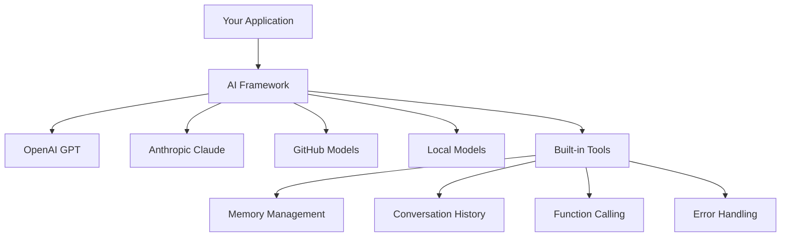
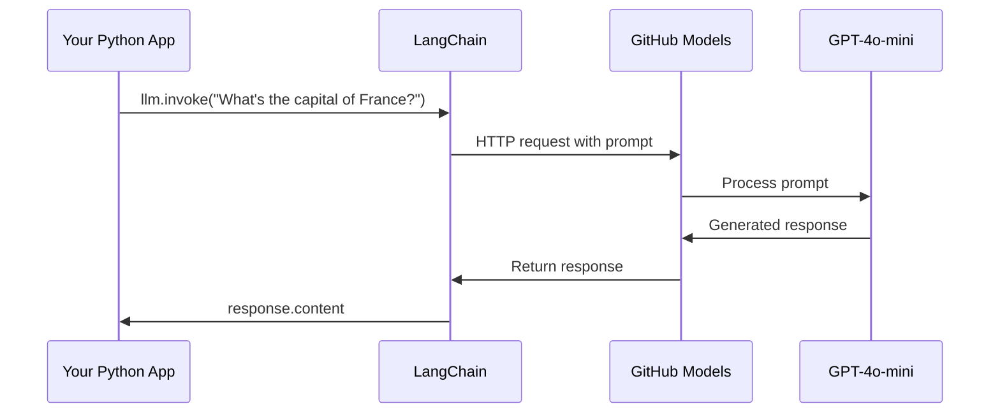
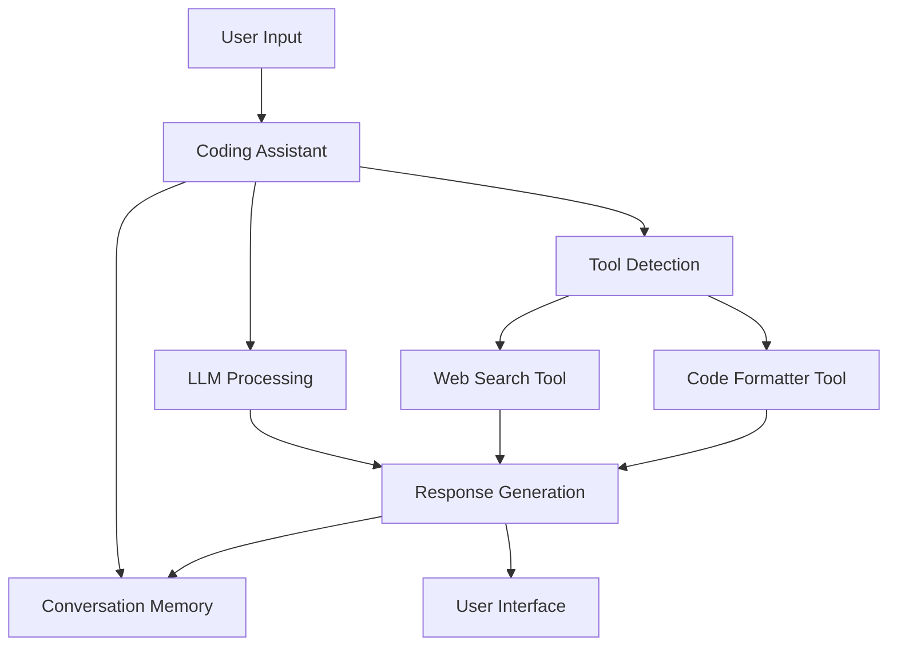
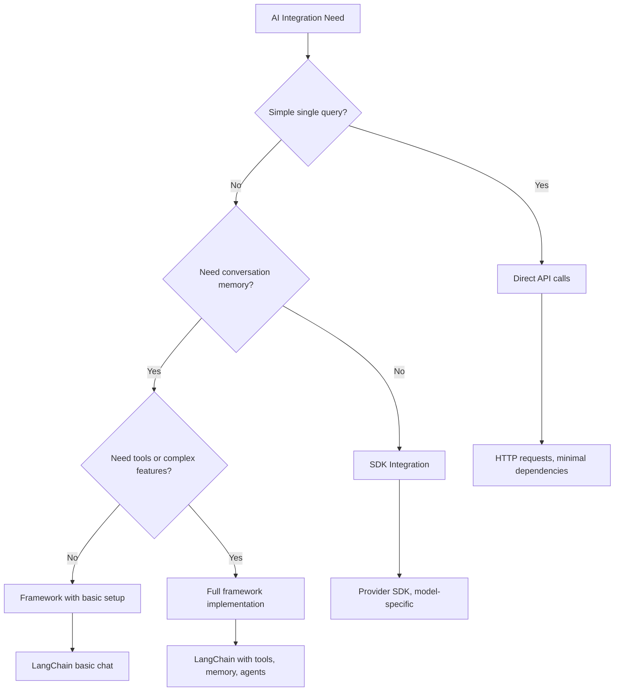

<!--
CO_OP_TRANSLATOR_METADATA:
{
  "original_hash": "e2c4ae5688e34b4b8b09d52aec56c79e",
  "translation_date": "2025-10-23T21:59:53+00:00",
  "source_file": "10-ai-framework-project/README.md",
  "language_code": "da"
}
-->
# AI Framework

Har du nogensinde følt dig overvældet af at skulle bygge AI-applikationer fra bunden? Du er ikke alene! AI-frameworks er som en schweizerkniv for AI-udvikling - kraftfulde værktøjer, der kan spare dig tid og besvær, når du bygger intelligente applikationer. Tænk på et AI-framework som et velorganiseret bibliotek: det tilbyder forudbyggede komponenter, standardiserede API'er og smarte abstraktioner, så du kan fokusere på at løse problemer i stedet for at kæmpe med implementeringsdetaljer.

I denne lektion vil vi udforske, hvordan frameworks som LangChain kan forvandle tidligere komplekse AI-integrationer til ren og overskuelig kode. Du vil opdage, hvordan du kan tackle virkelige udfordringer som at holde styr på samtaler, implementere værktøjskald og jonglere med forskellige AI-modeller gennem én samlet grænseflade.

Når vi er færdige, vil du vide, hvornår du skal vælge frameworks frem for rå API-kald, hvordan du bruger deres abstraktioner effektivt, og hvordan du bygger AI-applikationer, der er klar til brug i den virkelige verden. Lad os udforske, hvad AI-frameworks kan gøre for dine projekter.

## Hvorfor vælge et framework?

Så du er klar til at bygge en AI-app - fantastisk! Men her er sagen: du har flere forskellige veje, du kan tage, og hver har sine egne fordele og ulemper. Det er lidt som at vælge mellem at gå, cykle eller køre for at komme et sted hen - de vil alle få dig derhen, men oplevelsen (og indsatsen) vil være helt forskellig.

Lad os bryde de tre hovedmåder ned, som du kan integrere AI i dine projekter:

| Metode | Fordele | Bedst til | Overvejelser |
|--------|---------|----------|--------------|
| **Direkte HTTP-anmodninger** | Fuld kontrol, ingen afhængigheder | Enkle forespørgsler, lære grundprincipper | Mere omfattende kode, manuel fejlbehandling |
| **SDK-integration** | Mindre boilerplate, model-specifik optimering | Applikationer med én model | Begrænset til specifikke udbydere |
| **AI-frameworks** | Samlet API, indbyggede abstraktioner | Apps med flere modeller, komplekse arbejdsgange | Læringskurve, potentiel over-abstraktion |

### Fordele ved frameworks i praksis



**Hvorfor frameworks er vigtige:**
- **Samler** flere AI-udbydere under én grænseflade
- **Håndterer** samtaleminde automatisk
- **Tilbyder** færdiglavede værktøjer til almindelige opgaver som embeddings og funktionskald
- **Administrerer** fejlbehandling og retry-logik
- **Forvandler** komplekse arbejdsgange til overskuelige metodekald

> 💡 **Pro Tip**: Brug frameworks, når du skifter mellem forskellige AI-modeller eller bygger komplekse funktioner som agenter, hukommelse eller værktøjskald. Hold dig til direkte API'er, når du lærer det grundlæggende eller bygger enkle, fokuserede applikationer.

**Konklusion**: Ligesom valget mellem en håndværkers specialværktøjer og et komplet værksted handler det om at matche værktøjet til opgaven. Frameworks er fremragende til komplekse, funktionsrige applikationer, mens direkte API'er fungerer godt til enkle anvendelser.

## Introduktion

I denne lektion vil vi lære at:

- Bruge et almindeligt AI-framework.
- Løse almindelige problemer som chatsamtaler, værktøjsbrug, hukommelse og kontekst.
- Udnytte dette til at bygge AI-applikationer.

## Din første AI-prompt

Lad os starte med det grundlæggende ved at oprette din første AI-applikation, der sender et spørgsmål og får et svar tilbage. Ligesom Archimedes, der opdagede opdriftens princip i sit bad, kan de enkleste observationer føre til de mest kraftfulde indsigter - og frameworks gør disse indsigter tilgængelige.

### Opsætning af LangChain med GitHub-modeller

Vi vil bruge LangChain til at forbinde til GitHub-modeller, hvilket er ret fedt, fordi det giver dig gratis adgang til forskellige AI-modeller. Det bedste? Du behøver kun nogle få enkle konfigurationsparametre for at komme i gang:

```python
from langchain_openai import ChatOpenAI
import os

llm = ChatOpenAI(
    api_key=os.environ["GITHUB_TOKEN"],
    base_url="https://models.github.ai/inference",
    model="openai/gpt-4o-mini",
)

# Send a simple prompt
response = llm.invoke("What's the capital of France?")
print(response.content)
```

**Lad os bryde ned, hvad der sker her:**
- **Opretter** en LangChain-klient ved hjælp af klassen `ChatOpenAI` - dette er din adgang til AI!
- **Konfigurerer** forbindelsen til GitHub-modeller med din autentificeringstoken
- **Angiver** hvilken AI-model der skal bruges (`gpt-4o-mini`) - tænk på det som at vælge din AI-assistent
- **Sender** dit spørgsmål ved hjælp af metoden `invoke()` - her sker magien
- **Ekstraherer** og viser svaret - og voilà, du chatter med AI!

> 🔧 **Opsætningsnotat**: Hvis du bruger GitHub Codespaces, er du heldig - `GITHUB_TOKEN` er allerede sat op for dig! Arbejder du lokalt? Bare rolig, du skal blot oprette en personlig adgangstoken med de rigtige tilladelser.

**Forventet output:**
```text
The capital of France is Paris.
```



## Bygning af samtale-AI

Det første eksempel demonstrerer det grundlæggende, men det er kun en enkelt udveksling - du stiller et spørgsmål, får et svar, og det er det. I virkelige applikationer vil du have, at din AI husker, hvad du har diskuteret, ligesom Watson og Holmes byggede deres undersøgende samtaler op over tid.

Her bliver LangChain særligt nyttig. Det tilbyder forskellige beskedtyper, der hjælper med at strukturere samtaler og giver dig mulighed for at give din AI en personlighed. Du vil bygge chatoplevelser, der opretholder kontekst og karakter.

### Forståelse af beskedtyper

Tænk på disse beskedtyper som forskellige "roller", som deltagerne har i en samtale. LangChain bruger forskellige beskedklasser til at holde styr på, hvem der siger hvad:

| Beskedtype | Formål | Eksempel på brug |
|------------|--------|------------------|
| `SystemMessage` | Definerer AI's personlighed og adfærd | "Du er en hjælpsom kodeassistent" |
| `HumanMessage` | Repræsenterer brugerinput | "Forklar hvordan funktioner fungerer" |
| `AIMessage` | Gemmer AI-svar | Tidligere AI-svar i samtalen |

### Oprettelse af din første samtale

Lad os oprette en samtale, hvor vores AI antager en bestemt rolle. Vi får den til at indtage rollen som Captain Picard - en karakter kendt for sin diplomatiske visdom og lederskab:

```python
messages = [
    SystemMessage(content="You are Captain Picard of the Starship Enterprise"),
    HumanMessage(content="Tell me about you"),
]
```

**Gennemgang af denne samtaleopsætning:**
- **Etablerer** AI's rolle og personlighed gennem `SystemMessage`
- **Giver** den første brugerforespørgsel via `HumanMessage`
- **Skaber** grundlaget for en samtale med flere ture

Den fulde kode for dette eksempel ser sådan ud:

```python
from langchain_core.messages import HumanMessage, SystemMessage
from langchain_openai import ChatOpenAI
import os

llm = ChatOpenAI(
    api_key=os.environ["GITHUB_TOKEN"],
    base_url="https://models.github.ai/inference",
    model="openai/gpt-4o-mini",
)

messages = [
    SystemMessage(content="You are Captain Picard of the Starship Enterprise"),
    HumanMessage(content="Tell me about you"),
]


# works
response  = llm.invoke(messages)
print(response.content)
```

Du bør se et resultat, der ligner:

```text
I am Captain Jean-Luc Picard, the commanding officer of the USS Enterprise (NCC-1701-D), a starship in the United Federation of Planets. My primary mission is to explore new worlds, seek out new life and new civilizations, and boldly go where no one has gone before. 

I believe in the importance of diplomacy, reason, and the pursuit of knowledge. My crew is diverse and skilled, and we often face challenges that test our resolve, ethics, and ingenuity. Throughout my career, I have encountered numerous species, grappled with complex moral dilemmas, and have consistently sought peaceful solutions to conflicts.

I hold the ideals of the Federation close to my heart, believing in the importance of cooperation, understanding, and respect for all sentient beings. My experiences have shaped my leadership style, and I strive to be a thoughtful and just captain. How may I assist you further?
```

For at opretholde samtalekontinuitet (i stedet for at nulstille konteksten hver gang) skal du fortsætte med at tilføje svar til din beskedliste. Ligesom de mundtlige traditioner, der bevarede historier gennem generationer, bygger denne tilgang en varig hukommelse:

```python
from langchain_core.messages import HumanMessage, SystemMessage
from langchain_openai import ChatOpenAI
import os

llm = ChatOpenAI(
    api_key=os.environ["GITHUB_TOKEN"],
    base_url="https://models.github.ai/inference",
    model="openai/gpt-4o-mini",
)

messages = [
    SystemMessage(content="You are Captain Picard of the Starship Enterprise"),
    HumanMessage(content="Tell me about you"),
]


# works
response  = llm.invoke(messages)

print(response.content)

print("---- Next ----")

messages.append(response)
messages.append(HumanMessage(content="Now that I know about you, I'm Chris, can I be in your crew?"))

response  = llm.invoke(messages)

print(response.content)

```

Ret smart, ikke? Det, der sker her, er, at vi kalder LLM to gange - først med kun vores første to beskeder, men derefter igen med hele samtalehistorikken. Det er som om, AI'en faktisk følger med i vores chat!

Når du kører denne kode, får du et andet svar, der lyder noget i retning af:

```text
Welcome aboard, Chris! It's always a pleasure to meet those who share a passion for exploration and discovery. While I cannot formally offer you a position on the Enterprise right now, I encourage you to pursue your aspirations. We are always in need of talented individuals with diverse skills and backgrounds. 

If you are interested in space exploration, consider education and training in the sciences, engineering, or diplomacy. The values of curiosity, resilience, and teamwork are crucial in Starfleet. Should you ever find yourself on a starship, remember to uphold the principles of the Federation: peace, understanding, and respect for all beings. Your journey can lead you to remarkable adventures, whether in the stars or on the ground. Engage!
```

Det tager jeg som et måske ;)

## Streaming-svar

Har du nogensinde bemærket, hvordan ChatGPT ser ud til at "skrive" sine svar i realtid? Det er streaming i aktion. Ligesom at se en dygtig kalligraf arbejde - se tegnene dukke op streg for streg i stedet for at materialisere sig med det samme - gør streaming interaktionen mere naturlig og giver øjeblikkelig feedback.

### Implementering af streaming med LangChain

```python
from langchain_openai import ChatOpenAI
import os

llm = ChatOpenAI(
    api_key=os.environ["GITHUB_TOKEN"],
    base_url="https://models.github.ai/inference",
    model="openai/gpt-4o-mini",
    streaming=True
)

# Stream the response
for chunk in llm.stream("Write a short story about a robot learning to code"):
    print(chunk.content, end="", flush=True)
```

**Hvorfor streaming er fantastisk:**
- **Viser** indhold, mens det bliver skabt - ikke mere akavet ventetid!
- **Får** brugerne til at føle, at der faktisk sker noget
- **Føles** hurtigere, selv når det teknisk set ikke er det
- **Lader** brugerne begynde at læse, mens AI stadig "tænker"

> 💡 **Brugeroplevelse Tip**: Streaming er virkelig effektivt, når du arbejder med længere svar som kodeforklaringer, kreativ skrivning eller detaljerede vejledninger. Dine brugere vil elske at se fremskridt i stedet for at stirre på en tom skærm!

## Prompt-skabeloner

Prompt-skabeloner fungerer som de retoriske strukturer, der blev brugt i klassisk retorik - tænk på, hvordan Cicero ville tilpasse sine taleformer til forskellige publikum, mens han bevarede den samme overbevisende ramme. De giver dig mulighed for at skabe genanvendelige prompts, hvor du kan udskifte forskellige oplysninger uden at skulle omskrive alt fra bunden. Når du har oprettet skabelonen, skal du bare fylde variablerne med de nødvendige værdier.

### Oprettelse af genanvendelige prompts

```python
from langchain_core.prompts import ChatPromptTemplate

# Define a template for code explanations
template = ChatPromptTemplate.from_messages([
    ("system", "You are an expert programming instructor. Explain concepts clearly with examples."),
    ("human", "Explain {concept} in {language} with a practical example for {skill_level} developers")
])

# Use the template with different values
questions = [
    {"concept": "functions", "language": "JavaScript", "skill_level": "beginner"},
    {"concept": "classes", "language": "Python", "skill_level": "intermediate"},
    {"concept": "async/await", "language": "JavaScript", "skill_level": "advanced"}
]

for question in questions:
    prompt = template.format_messages(**question)
    response = llm.invoke(prompt)
    print(f"Topic: {question['concept']}\n{response.content}\n---\n")
```

**Hvorfor du vil elske at bruge skabeloner:**
- **Holder** dine prompts konsistente i hele din app
- **Ingen flere** rodede strengsammenkædninger - bare rene, enkle variabler
- **Din AI** opfører sig forudsigeligt, fordi strukturen forbliver den samme
- **Opdateringer** er nemme - ændr skabelonen én gang, og det er rettet overalt

## Struktureret output

Har du nogensinde været frustreret over at skulle analysere AI-svar, der kommer tilbage som ustruktureret tekst? Struktureret output er som at lære din AI at følge den systematiske tilgang, som Linnaeus brugte til biologisk klassifikation - organiseret, forudsigelig og nem at arbejde med. Du kan anmode om JSON, specifikke datastrukturer eller ethvert format, du har brug for.

### Definere outputskemaer

```python
from langchain_core.prompts import ChatPromptTemplate
from langchain_core.output_parsers import JsonOutputParser
from pydantic import BaseModel, Field

class CodeReview(BaseModel):
    score: int = Field(description="Code quality score from 1-10")
    strengths: list[str] = Field(description="List of code strengths")
    improvements: list[str] = Field(description="List of suggested improvements")
    overall_feedback: str = Field(description="Summary feedback")

# Set up the parser
parser = JsonOutputParser(pydantic_object=CodeReview)

# Create prompt with format instructions
prompt = ChatPromptTemplate.from_messages([
    ("system", "You are a code reviewer. {format_instructions}"),
    ("human", "Review this code: {code}")
])

# Format the prompt with instructions
chain = prompt | llm | parser

# Get structured response
code_sample = """
def calculate_average(numbers):
    return sum(numbers) / len(numbers)
"""

result = chain.invoke({
    "code": code_sample,
    "format_instructions": parser.get_format_instructions()
})

print(f"Score: {result['score']}")
print(f"Strengths: {', '.join(result['strengths'])}")
```

**Hvorfor struktureret output er en game-changer:**
- **Ingen flere** gæt om, hvilket format du får tilbage - det er konsekvent hver gang
- **Plugs** direkte ind i dine databaser og API'er uden ekstra arbejde
- **Fanger** mærkelige AI-svar, før de ødelægger din app
- **Gør** din kode renere, fordi du ved præcis, hvad du arbejder med

## Værktøjskald

Nu når vi til en af de mest kraftfulde funktioner: værktøjer. Dette er, hvordan du giver din AI praktiske evner ud over samtale. Ligesom hvordan middelalderlige laug udviklede specialværktøjer til specifikke håndværk, kan du udstyre din AI med fokuserede instrumenter. Du beskriver, hvilke værktøjer der er tilgængelige, og når nogen anmoder om noget, der matcher, kan din AI tage handling.

### Brug af Python

Lad os tilføje nogle værktøjer som så:

```python
from typing_extensions import Annotated, TypedDict

class add(TypedDict):
    """Add two integers."""

    # Annotations must have the type and can optionally include a default value and description (in that order).
    a: Annotated[int, ..., "First integer"]
    b: Annotated[int, ..., "Second integer"]

tools = [add]

functions = {
    "add": lambda a, b: a + b
}
```

Så hvad sker der her? Vi opretter en skabelon for et værktøj kaldet `add`. Ved at arve fra `TypedDict` og bruge de smarte `Annotated` typer for `a` og `b`, giver vi LLM et klart billede af, hvad dette værktøj gør, og hvad det har brug for. Ordbogen `functions` er som vores værktøjskasse - den fortæller vores kode præcis, hvad der skal gøres, når AI'en beslutter sig for at bruge et specifikt værktøj.

Lad os se, hvordan vi kalder LLM med dette værktøj næste gang:

```python
llm = ChatOpenAI(
    api_key=os.environ["GITHUB_TOKEN"],
    base_url="https://models.github.ai/inference",
    model="openai/gpt-4o-mini",
)

llm_with_tools = llm.bind_tools(tools)
```

Her kalder vi `bind_tools` med vores `tools` array, og dermed har LLM `llm_with_tools` nu kendskab til dette værktøj.

For at bruge denne nye LLM kan vi skrive følgende kode:

```python
query = "What is 3 + 12?"

res = llm_with_tools.invoke(query)
if(res.tool_calls):
    for tool in res.tool_calls:
        print("TOOL CALL: ", functions[tool["name"]](../../../10-ai-framework-project/**tool["args"]))
print("CONTENT: ",res.content)
```

Nu hvor vi kalder `invoke` på denne nye LLM, der har værktøjer, kan egenskaben `tool_calls` blive udfyldt. Hvis det er tilfældet, har ethvert identificeret værktøj en `name` og `args` egenskab, der identificerer, hvilket værktøj der skal kaldes og med hvilke argumenter. Den fulde kode ser sådan ud:

```python
from langchain_core.messages import HumanMessage, SystemMessage
from langchain_openai import ChatOpenAI
import os
from typing_extensions import Annotated, TypedDict

class add(TypedDict):
    """Add two integers."""

    # Annotations must have the type and can optionally include a default value and description (in that order).
    a: Annotated[int, ..., "First integer"]
    b: Annotated[int, ..., "Second integer"]

tools = [add]

functions = {
    "add": lambda a, b: a + b
}

llm = ChatOpenAI(
    api_key=os.environ["GITHUB_TOKEN"],
    base_url="https://models.github.ai/inference",
    model="openai/gpt-4o-mini",
)

llm_with_tools = llm.bind_tools(tools)

query = "What is 3 + 12?"

res = llm_with_tools.invoke(query)
if(res.tool_calls):
    for tool in res.tool_calls:
        print("TOOL CALL: ", functions[tool["name"]](../../../10-ai-framework-project/**tool["args"]))
print("CONTENT: ",res.content)
```

Når du kører denne kode, bør du se output, der ligner:

```text
TOOL CALL:  15
CONTENT: 
```

AI'en undersøgte "Hvad er 3 + 12" og genkendte dette som en opgave for værktøjet `add`. Ligesom hvordan en dygtig bibliotekar ved, hvilken reference der skal konsulteres baseret på typen af spørgsmål, tog den denne beslutning ud fra værktøjets navn, beskrivelse og felt-specifikationer. Resultatet på 15 kommer fra vores ordbog `functions`, der udfører værktøjet:

```python
print("TOOL CALL: ", functions[tool["name"]](../../../10-ai-framework-project/**tool["args"]))
```

### Et mere interessant værktøj, der kalder et web-API

At lægge tal sammen demonstrerer konceptet, men rigtige værktøjer udfører typisk mere komplekse operationer, som at kalde web-API'er. Lad os udvide vores eksempel, så AI'en kan hente indhold fra internettet - ligesom hvordan telegrafoperatører engang forbandt fjerne steder:

```python
class joke(TypedDict):
    """Tell a joke."""

    # Annotations must have the type and can optionally include a default value and description (in that order).
    category: Annotated[str, ..., "The joke category"]

def get_joke(category: str) -> str:
    response = requests.get(f"https://api.chucknorris.io/jokes/random?category={category}", headers={"Accept": "application/json"})
    if response.status_code == 200:
        return response.json().get("value", f"Here's a {category} joke!")
    return f"Here's a {category} joke!"

functions = {
    "add": lambda a, b: a + b,
    "joke": lambda category: get_joke(category)
}

query = "Tell me a joke about animals"

# the rest of the code is the same
```

Nu, hvis du kører denne kode, vil du få et svar, der siger noget i retning af:

```text
TOOL CALL:  Chuck Norris once rode a nine foot grizzly bear through an automatic car wash, instead of taking a shower.
CONTENT:  
```

Her er koden i sin helhed:

```python
from langchain_openai import ChatOpenAI
import requests
import os
from typing_extensions import Annotated, TypedDict

class add(TypedDict):
    """Add two integers."""

    # Annotations must have the type and can optionally include a default value and description (in that order).
    a: Annotated[int, ..., "First integer"]
    b: Annotated[int, ..., "Second integer"]

class joke(TypedDict):
    """Tell a joke."""

    # Annotations must have the type and can optionally include a default value and description (in that order).
    category: Annotated[str, ..., "The joke category"]

tools = [add, joke]

def get_joke(category: str) -> str:
    response = requests.get(f"https://api.chucknorris.io/jokes/random?category={category}", headers={"Accept": "application/json"})
    if response.status_code == 200:
        return response.json().get("value", f"Here's a {category} joke!")
    return f"Here's a {category} joke!"

functions = {
    "add": lambda a, b: a + b,
    "joke": lambda category: get_joke(category)
}

llm = ChatOpenAI(
    api_key=os.environ["GITHUB_TOKEN"],
    base_url="https://models.github.ai/inference",
    model="openai/gpt-4o-mini",
)

llm_with_tools = llm.bind_tools(tools)

query = "Tell me a joke about animals"

res = llm_with_tools.invoke(query)
if(res.tool_calls):
    for tool in res.tool_calls:
        # print("TOOL CALL: ", tool)
        print("TOOL CALL: ", functions[tool["name"]](../../../10-ai-framework-project/**tool["args"]))
print("CONTENT: ",res.content)
```

## Embeddings og dokumentbehandling

Embeddings repræsenterer en af de mest elegante løsninger i moderne AI. Forestil dig, hvis du kunne tage et hvilket som helst stykke tekst og konvertere det til numeriske koordinater, der fanger dets betydning. Det er præcis, hvad embeddings gør - de transformerer tekst til punkter i et multidimensionelt rum, hvor lignende begreber samles. Det er som at have et koordinatsystem for ideer, der minder om, hvordan Mendeleev organiserede det periodiske system efter atomare egenskaber.

### Oprettelse og brug af embeddings

```python
from langchain_openai import OpenAIEmbeddings
from langchain_community.vectorstores import FAISS
from langchain_community.document_loaders import TextLoader
from langchain.text_splitter import CharacterTextSplitter

# Initialize embeddings
embeddings = OpenAIEmbeddings(
    api_key=os.environ["GITHUB_TOKEN"],
    base_url="https://models.github.ai/inference",
    model="text-embedding-3-small"
)

# Load and split documents
loader = TextLoader("documentation.txt")
documents = loader.load()

text_splitter = CharacterTextSplitter(chunk_size=1000, chunk_overlap=0)
texts = text_splitter.split_documents(documents)

# Create vector store
vectorstore = FAISS.from_documents(texts, embeddings)

# Perform similarity search
query = "How do I handle user authentication?"
similar_docs = vectorstore.similarity_search(query, k=3)

for doc in similar_docs:
    print(f"Relevant content: {doc.page_content[:200]}...")
```

### Dokumentindlæsere til forskellige formater

```python
from langchain_community.document_loaders import (
    PyPDFLoader,
    CSVLoader,
    JSONLoader,
    WebBaseLoader
)

# Load different document types
pdf_loader = PyPDFLoader("manual.pdf")
csv_loader = CSVLoader("data.csv")
json_loader = JSONLoader("config.json")
web_loader = WebBaseLoader("https://example.com/docs")

# Process all documents
all_documents = []
for loader in [pdf_loader, csv_loader, json_loader, web_loader]:
    docs = loader.load()
    all_documents.extend(docs)
```

**Hvad du kan gøre med embeddings:**
- **Byg** søgning, der faktisk forstår, hvad du mener, ikke kun nøgleord
- **Skab** AI, der kan besvare spørgsmål om dine dokumenter
- **Lav** anbefalingssystemer, der foreslår virkelig relevant indhold
- **Organiser** og kategoriser automatisk dit indhold

## Bygning af en komplet AI-applikation

Nu vil vi integrere alt, hvad du har lært, i en omfattende applikation - en kodeassistent, der kan besvare spørgsmål, bruge værktøjer og opretholde samtaleminde. Ligesom hvordan trykpressen kombinerede eksisterende teknologier (bevægelige typer, blæk, papir og tryk) til noget transformerende, vil vi kombinere vores AI-komponenter til noget praktisk og nyttigt.

### Komplet applikationseksempel

```python
from langchain_openai import ChatOpenAI, OpenAIEmbeddings
from langchain_core.prompts import ChatPromptTemplate
from langchain_core.messages import HumanMessage, SystemMessage, AIMessage
from langchain_community.vectorstores import FAISS
from typing_extensions import Annotated, TypedDict
import os
import requests

class CodingAssistant:
    def __init__(self):
        self.llm = ChatOpenAI(
            api_key=os.environ["GITHUB_TOKEN"],
            base_url="https://models.github.ai/inference",
            model="openai/gpt-4o-mini"
        )
        
        self.conversation_history = [
            SystemMessage(content="""You are an expert coding assistant. 
            Help users learn programming concepts, debug code, and write better software.
            Use tools when needed and maintain a helpful, encouraging tone.""")
        ]
        
        # Define tools
        self.setup_tools()
    
    def setup_tools(self):
        class web_search(TypedDict):
            """Search for programming documentation or examples."""
            query: Annotated[str, "Search query for programming help"]
        
        class code_formatter(TypedDict):
            """Format and validate code snippets."""
            code: Annotated[str, "Code to format"]
            language: Annotated[str, "Programming language"]
        
        self.tools = [web_search, code_formatter]
        self.llm_with_tools = self.llm.bind_tools(self.tools)
    
    def chat(self, user_input: str):
        # Add user message to conversation
        self.conversation_history.append(HumanMessage(content=user_input))
        
        # Get AI response
        response = self.llm_with_tools.invoke(self.conversation_history)
        
        # Handle tool calls if any
        if response.tool_calls:
            for tool_call in response.tool_calls:
                tool_result = self.execute_tool(tool_call)
                print(f"🔧 Tool used: {tool_call['name']}")
                print(f"📊 Result: {tool_result}")
        
        # Add AI response to conversation
        self.conversation_history.append(response)
        
        return response.content
    
    def execute_tool(self, tool_call):
        tool_name = tool_call['name']
        args = tool_call['args']
        
        if tool_name == 'web_search':
            return f"Found documentation for: {args['query']}"
        elif tool_name == 'code_formatter':
            return f"Formatted {args['language']} code: {args['code'][:50]}..."
        
        return "Tool execution completed"

# Usage example
assistant = CodingAssistant()

print("🤖 Coding Assistant Ready! Type 'quit' to exit.\n")

while True:
    user_input = input("You: ")
    if user_input.lower() == 'quit':
        break
    
    response = assistant.chat(user_input)
    print(f"🤖 Assistant: {response}\n")
```

**Applikationsarkitektur:**



**Nøglefunktioner vi har implementeret:**
- **Husker** hele din samtale for kontekstkontinuitet
- **Udfører handlinger** gennem værktøjskald, ikke kun samtale
- **Følger** forudsigelige interaktionsmønstre
- **Administrerer** fejlbehandling og komplekse arbejdsgange automatisk

## Opgave: Byg din egen AI-drevne studieassistent

**Mål**: Opret en AI-applikation, der hjælper studerende med at lære programmeringskoncepter ved at give forklaringer, kodeeksempler og interaktive quizzer.

### Krav

**Kernefunktioner (påkrævet):**
1. **Samtalegrænseflade**: Implementer et chatsystem, der opretholder kontekst på tværs af flere spørgsmål
2. **Uddannelsesværktøjer**: Opret mindst to værktøjer, der hjælper med læring:
   - Værktøj til kodeforklaring
   - Generator til konceptquiz
3. **Personlig læring**: Brug systemmeddelelser til at tilpasse svar til forskellige færdighedsniveauer  
4. **Svarformatering**: Implementer struktureret output til quizspørgsmål  

### Implementeringstrin  

**Trin 1: Opsæt dit miljø**  
```bash
pip install langchain langchain-openai
```
  
**Trin 2: Grundlæggende chatfunktionalitet**  
- Opret en `StudyAssistant`-klasse  
- Implementer samtaleminde  
- Tilføj personlighedskonfiguration til pædagogisk støtte  

**Trin 3: Tilføj undervisningsværktøjer**  
- **Kodeforklarer**: Bryder kode ned i forståelige dele  
- **Quizgenerator**: Skaber spørgsmål om programmeringskoncepter  
- **Fremskridtssporing**: Holder styr på dækkede emner  

**Trin 4: Avancerede funktioner (valgfrit)**  
- Implementer streaming-svar for bedre brugeroplevelse  
- Tilføj dokumentindlæsning for at integrere kursusmateriale  
- Opret embeddings til indholdsgenkendelse baseret på lighed  

### Evalueringskriterier  

| Funktion | Fremragende (4) | God (3) | Tilfredsstillende (2) | Kræver arbejde (1) |  
|----------|-----------------|---------|-----------------------|--------------------|  
| **Samtaleflow** | Naturlige, kontekstbevidste svar | God kontekstbevarelse | Grundlæggende samtale | Ingen hukommelse mellem udvekslinger |  
| **Værktøjsintegration** | Flere nyttige værktøjer fungerer problemfrit | 2+ værktøjer implementeret korrekt | 1-2 grundlæggende værktøjer | Værktøjer fungerer ikke |  
| **Kodekvalitet** | Ren, veldokumenteret, fejlhåndtering | God struktur, noget dokumentation | Grundlæggende funktionalitet fungerer | Dårlig struktur, ingen fejlhåndtering |  
| **Uddannelsesmæssig værdi** | Virkelig nyttig for læring, tilpasset | God læringsstøtte | Grundlæggende forklaringer | Begrænset uddannelsesmæssig fordel |  

### Eksempel på kodestruktur  

```python
class StudyAssistant:
    def __init__(self, skill_level="beginner"):
        # Initialize LLM, tools, and conversation memory
        pass
    
    def explain_code(self, code, language):
        # Tool: Explain how code works
        pass
    
    def generate_quiz(self, topic, difficulty):
        # Tool: Create practice questions
        pass
    
    def chat(self, user_input):
        # Main conversation interface
        pass

# Example usage
assistant = StudyAssistant(skill_level="intermediate")
response = assistant.chat("Explain how Python functions work")
```
  
**Bonusudfordringer:**  
- Tilføj stemmeinput/output-funktioner  
- Implementer en webgrænseflade ved hjælp af Streamlit eller Flask  
- Opret en vidensbase fra kursusmateriale ved hjælp af embeddings  
- Tilføj fremskridtssporing og personlige læringsforløb  

## Resumé  

🎉 Du har nu mestret grundlæggende AI-rammeudvikling og lært, hvordan man bygger sofistikerede AI-applikationer ved hjælp af LangChain. Som at fuldføre en omfattende lærlingeuddannelse har du erhvervet en betydelig værktøjskasse af færdigheder. Lad os gennemgå, hvad du har opnået.  

### Hvad du har lært  

**Kernekoncepter for rammer:**  
- **Fordele ved rammer**: Forståelse af, hvornår man skal vælge rammer frem for direkte API-kald  
- **Grundlæggende om LangChain**: Opsætning og konfiguration af AI-modelforbindelser  
- **Meddelelsestyper**: Brug af `SystemMessage`, `HumanMessage` og `AIMessage` til strukturerede samtaler  

**Avancerede funktioner:**  
- **Værktøjskald**: Oprettelse og integration af brugerdefinerede værktøjer til forbedrede AI-funktioner  
- **Samtaleminde**: Bevare kontekst på tværs af flere samtaleomgange  
- **Streaming-svar**: Implementering af realtidslevering af svar  
- **Promptskabeloner**: Opbygning af genanvendelige, dynamiske prompts  
- **Struktureret output**: Sikring af konsistente, parsebare AI-svar  
- **Embeddings**: Oprettelse af semantisk søgning og dokumentbehandlingsfunktioner  

**Praktiske anvendelser:**  
- **Opbygning af komplette apps**: Kombinere flere funktioner til produktionsklare applikationer  
- **Fejlhåndtering**: Implementering af robust fejlstyring og validering  
- **Værktøjsintegration**: Oprettelse af brugerdefinerede værktøjer, der udvider AI-funktioner  

### Vigtige pointer  

> 🎯 **Husk**: AI-rammer som LangChain er i bund og grund dine kompleksitetsskjulende, funktionsfyldte bedste venner. De er perfekte, når du har brug for samtaleminde, værktøjskald eller ønsker at arbejde med flere AI-modeller uden at miste overblikket.  

**Beslutningsramme for AI-integration:**  


  
### Hvor går du hen herfra?  

**Begynd at bygge med det samme:**  
- Tag disse koncepter og byg noget, der begejstrer DIG!  
- Eksperimenter med forskellige AI-modeller gennem LangChain - det er som en legeplads for AI-modeller  
- Skab værktøjer, der løser reelle problemer, du står over for i dit arbejde eller projekter  

**Klar til næste niveau?**  
- **AI-agenter**: Byg AI-systemer, der faktisk kan planlægge og udføre komplekse opgaver på egen hånd  
- **RAG (Retrieval-Augmented Generation)**: Kombiner AI med dine egne vidensbaser for superkraftige applikationer  
- **Multi-modal AI**: Arbejd med tekst, billeder og lyd sammen - mulighederne er uendelige!  
- **Produktionsimplementering**: Lær hvordan du skalerer dine AI-apps og overvåger dem i den virkelige verden  

**Bliv en del af fællesskabet:**  
- LangChain-fællesskabet er fantastisk til at holde sig opdateret og lære bedste praksis  
- GitHub Models giver dig adgang til avancerede AI-funktioner - perfekt til eksperimenter  
- Bliv ved med at øve dig med forskellige anvendelsesscenarier - hvert projekt vil lære dig noget nyt  

Du har nu viden til at bygge intelligente, samtalebaserede applikationer, der kan hjælpe folk med at løse reelle problemer. Ligesom renæssancens håndværkere, der kombinerede kunstnerisk vision med teknisk dygtighed, kan du nu kombinere AI-funktioner med praktisk anvendelse. Spørgsmålet er: hvad vil du skabe? 🚀  

## GitHub Copilot Agent-udfordring 🚀  

Brug Agent-tilstand til at fuldføre følgende udfordring:  

**Beskrivelse:** Byg en avanceret AI-drevet kodegennemgangsassistent, der kombinerer flere LangChain-funktioner, herunder værktøjskald, struktureret output og samtaleminde for at give omfattende feedback på kodeindsendelser.  

**Prompt:** Opret en CodeReviewAssistant-klasse, der implementerer:  
1. Et værktøj til at analysere kodekompleksitet og foreslå forbedringer  
2. Et værktøj til at kontrollere kode mod bedste praksis  
3. Struktureret output ved hjælp af Pydantic-modeller for konsistent gennemgangsformat  
4. Samtaleminde til at spore gennemgangssessioner  
5. En hovedchatgrænseflade, der kan håndtere kodeindsendelser og give detaljeret, handlingsrettet feedback  

Assistenten skal kunne gennemgå kode i flere programmeringssprog, bevare kontekst på tværs af flere kodeindsendelser i en session og give både sammenfattende vurderinger og detaljerede forbedringsforslag.  

Læs mere om [agent mode](https://code.visualstudio.com/blogs/2025/02/24/introducing-copilot-agent-mode) her.  

---

**Ansvarsfraskrivelse**:  
Dette dokument er blevet oversat ved hjælp af AI-oversættelsestjenesten [Co-op Translator](https://github.com/Azure/co-op-translator). Selvom vi bestræber os på nøjagtighed, skal du være opmærksom på, at automatiserede oversættelser kan indeholde fejl eller unøjagtigheder. Det originale dokument på dets oprindelige sprog bør betragtes som den autoritative kilde. For kritisk information anbefales professionel menneskelig oversættelse. Vi er ikke ansvarlige for eventuelle misforståelser eller fejltolkninger, der opstår som følge af brugen af denne oversættelse.