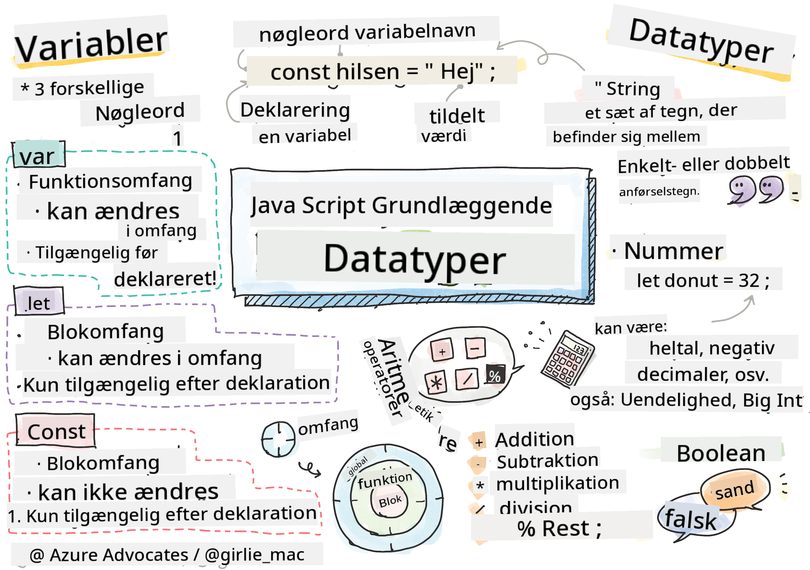

<!--
CO_OP_TRANSLATOR_METADATA:
{
  "original_hash": "b95fdd8310ef467305015ece1b0f9411",
  "translation_date": "2025-08-29T08:17:07+00:00",
  "source_file": "2-js-basics/1-data-types/README.md",
  "language_code": "da"
}
-->
# JavaScript Grundlæggende: Datatyper


> Sketchnote af [Tomomi Imura](https://twitter.com/girlie_mac)

## Quiz før lektionen
[Quiz før lektionen](https://ff-quizzes.netlify.app/web/)

Denne lektion dækker det grundlæggende i JavaScript, sproget der giver interaktivitet på nettet.

> Du kan tage denne lektion på [Microsoft Learn](https://docs.microsoft.com/learn/modules/web-development-101-variables/?WT.mc_id=academic-77807-sagibbon)!

[](https://youtube.com/watch?v=JNIXfGiDWM8 "Variabler i JavaScript")

[](https://youtube.com/watch?v=AWfA95eLdq8 "Datatyper i JavaScript")

> 🎥 Klik på billederne ovenfor for videoer om variabler og datatyper

Lad os starte med variabler og de datatyper, der fylder dem!

## Variabler

Variabler gemmer værdier, som kan bruges og ændres i din kode.

At oprette og **deklarere** en variabel har følgende syntaks **[nøgleord] [navn]**. Det består af to dele:

- **Nøgleord**. Nøgleord kan være `let` eller `var`.  

✅ Nøgleordet `let` blev introduceret i ES6 og giver din variabel en såkaldt _blokscope_. Det anbefales, at du bruger `let` frem for `var`. Vi vil dække blokscope mere detaljeret i fremtidige dele.
- **Variabelnavnet**, dette er et navn, du selv vælger.

### Opgave - arbejde med variabler

1. **Deklarer en variabel**. Lad os deklarere en variabel ved hjælp af nøgleordet `let`:

    ```javascript
    let myVariable;
    ```

   `myVariable` er nu blevet deklareret ved hjælp af nøgleordet `let`. Det har i øjeblikket ingen værdi.

1. **Tildel en værdi**. Gem en værdi i en variabel med operatoren `=`, efterfulgt af den forventede værdi.

    ```javascript
    myVariable = 123;
    ```

   > Bemærk: brugen af `=` i denne lektion betyder, at vi bruger en "tildelingsoperator", som bruges til at sætte en værdi til en variabel. Det angiver ikke lighed.

   `myVariable` er nu blevet *initialiseret* med værdien 123.

1. **Refaktorér**. Erstat din kode med følgende erklæring.

    ```javascript
    let myVariable = 123;
    ```

    Ovenstående kaldes en _eksplicit initialisering_, når en variabel deklareres og tildeles en værdi på samme tid.

1. **Ændr variabelværdien**. Ændr variabelværdien på følgende måde:

   ```javascript
   myVariable = 321;
   ```

   Når en variabel er deklareret, kan du ændre dens værdi på ethvert tidspunkt i din kode med operatoren `=` og den nye værdi.

   ✅ Prøv det! Du kan skrive JavaScript direkte i din browser. Åbn et browservindue og navigér til Developer Tools. I konsollen finder du en prompt; skriv `let myVariable = 123`, tryk på return, og skriv derefter `myVariable`. Hvad sker der? Bemærk, du vil lære mere om disse begreber i efterfølgende lektioner.

## Konstanter

Deklaration og initialisering af en konstant følger de samme principper som en variabel, med undtagelse af nøgleordet `const`. Konstanter deklareres typisk med store bogstaver.

```javascript
const MY_VARIABLE = 123;
```

Konstanter ligner variabler, med to undtagelser:

- **Skal have en værdi**. Konstanter skal initialiseres, ellers opstår der en fejl, når koden køres.
- **Referencen kan ikke ændres**. Referencen for en konstant kan ikke ændres, når den er initialiseret, ellers opstår der en fejl, når koden køres. Lad os se på to eksempler:
   - **Enkel værdi**. Følgende er IKKE tilladt:
   
      ```javascript
      const PI = 3;
      PI = 4; // not allowed
      ```
 
   - **Objektreferencen er beskyttet**. Følgende er IKKE tilladt.
   
      ```javascript
      const obj = { a: 3 };
      obj = { b: 5 } // not allowed
      ```

    - **Objektværdien er ikke beskyttet**. Følgende ER tilladt:
    
      ```javascript
      const obj = { a: 3 };
      obj.a = 5;  // allowed
      ```

      Ovenstående ændrer værdien af objektet, men ikke selve referencen, hvilket gør det tilladt.

   > Bemærk, en `const` betyder, at referencen er beskyttet mod gen-tildeling. Værdien er dog ikke _uændret_ og kan ændres, især hvis det er en kompleks konstruktion som et objekt.

## Datatyper

Variabler kan gemme mange forskellige typer værdier, som tal og tekst. Disse forskellige typer værdier kaldes **datatyper**. Datatyper er en vigtig del af softwareudvikling, fordi de hjælper udviklere med at træffe beslutninger om, hvordan koden skal skrives, og hvordan softwaren skal fungere. Desuden har nogle datatyper unikke funktioner, der hjælper med at transformere eller udtrække yderligere information fra en værdi.

✅ Datatyper kaldes også JavaScript-dataprimitiver, da de er de mest grundlæggende datatyper, som sproget tilbyder. Der er 7 primitive datatyper: string, number, bigint, boolean, undefined, null og symbol. Tag et øjeblik til at visualisere, hvad hver af disse primitiver kan repræsentere. Hvad er en `zebra`? Hvad med `0`? `true`?

### Tal

I det foregående afsnit var værdien af `myVariable` en tal-datatype.

`let myVariable = 123;`

Variabler kan gemme alle typer tal, inklusive decimaler eller negative tal. Tal kan også bruges med aritmetiske operatorer, som dækkes i [næste afsnit](../../../../2-js-basics/1-data-types).

### Aritmetiske operatorer

Der er flere typer operatorer, der kan bruges til at udføre aritmetiske funktioner, og nogle er listet her:

| Symbol | Beskrivelse                                                              | Eksempel                          |
| ------ | ------------------------------------------------------------------------ | --------------------------------- |
| `+`    | **Addition**: Beregner summen af to tal                                  | `1 + 2 //forventet svar er 3`     |
| `-`    | **Subtraktion**: Beregner forskellen mellem to tal                       | `1 - 2 //forventet svar er -1`    |
| `*`    | **Multiplikation**: Beregner produktet af to tal                         | `1 * 2 //forventet svar er 2`     |
| `/`    | **Division**: Beregner kvotienten af to tal                              | `1 / 2 //forventet svar er 0.5`   |
| `%`    | **Rest**: Beregner resten fra divisionen af to tal                       | `1 % 2 //forventet svar er 1`     |

✅ Prøv det! Prøv en aritmetisk operation i din browsers konsol. Overrasker resultaterne dig?

### Strings

Strings er sæt af tegn, der er placeret mellem enkelt- eller dobbeltanførselstegn.

- `'Dette er en string'`
- `"Dette er også en string"`
- `let myString = 'Dette er en stringværdi gemt i en variabel';`

Husk at bruge anførselstegn, når du skriver en string, ellers vil JavaScript antage, at det er et variabelnavn.

### Formatering af strings

Strings er tekstuelle og vil kræve formatering fra tid til anden.

For at **konkatenere** to eller flere strings, eller sætte dem sammen, bruges operatoren `+`.

```javascript
let myString1 = "Hello";
let myString2 = "World";

myString1 + myString2 + "!"; //HelloWorld!
myString1 + " " + myString2 + "!"; //Hello World!
myString1 + ", " + myString2 + "!"; //Hello, World!

```

✅ Hvorfor er `1 + 1 = 2` i JavaScript, men `'1' + '1' = 11?` Tænk over det. Hvad med `'1' + 1`?

**Template literals** er en anden måde at formatere strings på, bortset fra at der bruges backticks i stedet for anførselstegn. Alt, der ikke er almindelig tekst, skal placeres i placeholders `${ }`. Dette inkluderer eventuelle variabler, der kan være strings.

```javascript
let myString1 = "Hello";
let myString2 = "World";

`${myString1} ${myString2}!` //Hello World!
`${myString1}, ${myString2}!` //Hello, World!
```

Du kan opnå dine formateringsmål med begge metoder, men template literals vil respektere eventuelle mellemrum og linjeskift.

✅ Hvornår ville du bruge en template literal frem for en almindelig string?

### Booleans

Booleans kan kun have to værdier: `true` eller `false`. Booleans kan hjælpe med at træffe beslutninger om, hvilke linjer kode der skal køres, når visse betingelser er opfyldt. I mange tilfælde hjælper [operatorer](../../../../2-js-basics/1-data-types) med at sætte værdien af en Boolean, og du vil ofte bemærke og skrive variabler, der initialiseres eller deres værdier opdateres med en operator.

- `let myTrueBool = true`
- `let myFalseBool = false`

✅ En variabel kan betragtes som 'truthy', hvis den evalueres til en boolean `true`. Interessant nok er [alle værdier i JavaScript truthy, medmindre de er defineret som falsy](https://developer.mozilla.org/docs/Glossary/Truthy).

---

## 🚀 Udfordring

JavaScript er berygtet for sine overraskende måder at håndtere datatyper på. Undersøg lidt om disse 'gotchas'. For eksempel: case sensitivity kan drille! Prøv dette i din konsol: `let age = 1; let Age = 2; age == Age` (resulterer i `false` -- hvorfor?). Hvilke andre gotchas kan du finde?

## Quiz efter lektionen
[Quiz efter lektionen](https://ff-quizzes.netlify.app)

## Gennemgang & Selvstudie

Tag et kig på [denne liste over JavaScript-øvelser](https://css-tricks.com/snippets/javascript/) og prøv en. Hvad lærte du?

## Opgave

[Øvelse med datatyper](assignment.md)

---

**Ansvarsfraskrivelse**:  
Dette dokument er blevet oversat ved hjælp af AI-oversættelsestjenesten [Co-op Translator](https://github.com/Azure/co-op-translator). Selvom vi bestræber os på nøjagtighed, skal du være opmærksom på, at automatiserede oversættelser kan indeholde fejl eller unøjagtigheder. Det originale dokument på dets oprindelige sprog bør betragtes som den autoritative kilde. For kritisk information anbefales professionel menneskelig oversættelse. Vi påtager os intet ansvar for misforståelser eller fejltolkninger, der måtte opstå som følge af brugen af denne oversættelse.