<!--
CO_OP_TRANSLATOR_METADATA:
{
  "original_hash": "672b0bb6e8b431075f3bdb7130590d2d",
  "translation_date": "2026-01-06T23:29:50+00:00",
  "source_file": "2-js-basics/1-data-types/README.md",
  "language_code": "da"
}
-->
# JavaScript Grundlæggende: Datatyper

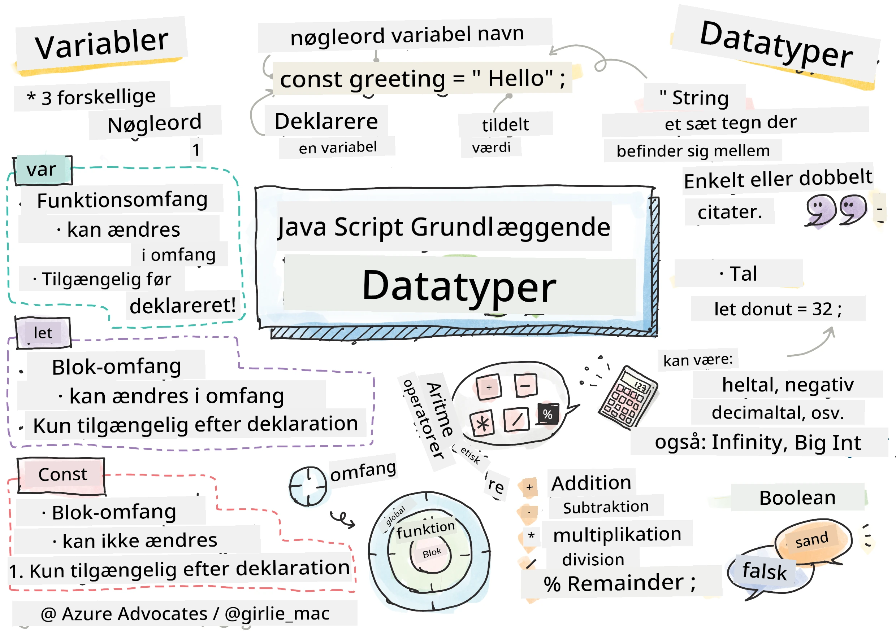
> Sketchnote af [Tomomi Imura](https://twitter.com/girlie_mac)

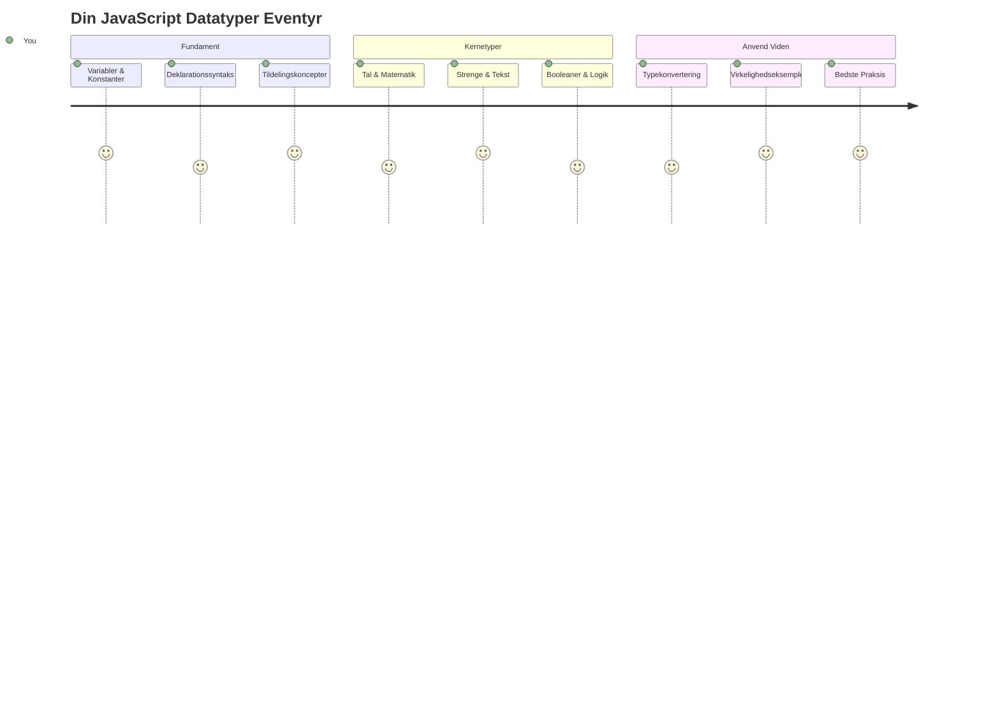
Datatyper er et af de grundlæggende begreber i JavaScript, som du vil støde på i hvert program, du skriver. Tænk på datatyper som filsystemet brugt af gamle bibliotekarer i Alexandria – de havde specifikke steder til ruller med poesi, matematik og historiske optegnelser. JavaScript organiserer information på en lignende måde med forskellige kategorier til forskellige slags data.

I denne lektion vil vi udforske de kerne-datatyper, der får JavaScript til at fungere. Du vil lære at håndtere tal, tekst, sand/falsk-værdier og forstå, hvorfor det er vigtigt at vælge den rette type til dine programmer. Disse koncepter kan virke abstrakte i starten, men med øvelse bliver de en anden natur.

At forstå datatyper vil gøre alt andet i JavaScript meget klarere. Ligesom arkitekter skal forstå forskellige byggematerialer, før de bygger en katedral, vil disse grundprincipper støtte alt, hvad du bygger fremover.

## Forud-forelæsning Quiz
[Forud-forelæsning quiz](https://ff-quizzes.netlify.app/web/)

Denne lektion dækker det grundlæggende i JavaScript, sproget der skaber interaktivitet på nettet.

> Du kan tage denne lektion på [Microsoft Learn](https://docs.microsoft.com/learn/modules/web-development-101-variables/?WT.mc_id=academic-77807-sagibbon)!

[](https://youtube.com/watch?v=JNIXfGiDWM8 "Variables in JavaScript")

[](https://youtube.com/watch?v=AWfA95eLdq8 "Data Types in JavaScript")

> 🎥 Klik på billederne ovenfor for videoer om variabler og datatyper

Lad os starte med variabler og de datatyper, der udfylder dem!

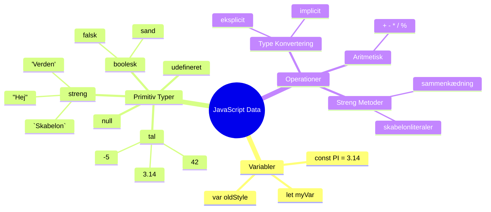
## Variabler

Variabler er grundlæggende byggesten i programmering. Ligesom de mærkede krukker, som middelalderlige alkymister brugte til at opbevare forskellige stoffer, tillader variabler dig at gemme information og give den et beskrivende navn, så du kan referere til det senere. Skal du huske en persons alder? Gem den i en variabel kaldet `age`. Vil du holde styr på en brugers navn? Gem det i en variabel kaldet `userName`.

Vi vil fokusere på den moderne tilgang til at oprette variabler i JavaScript. De teknikker, du lærer her, repræsenterer års sprogets udvikling og bedste praksis udviklet af programmeringsfællesskabet.

Oprettelse og **deklarering** af en variabel har følgende syntaks **[keyword] [name]**. Det består af to dele:

- **Nøgleord**. Brug `let` til variabler, der kan ændres, eller `const` til værdier, der forbliver den samme.
- **Variabelnavnet**, dette er et beskrivende navn, du vælger selv.

✅ Nøgleordet `let` blev introduceret i ES6 og giver din variabel et såkaldt _blokscope_. Det anbefales, at du bruger `let` eller `const` i stedet for det ældre `var`-nøgleord. Vi vil dække blokscope mere detaljeret i fremtidige dele.

### Opgave - arbejde med variabler

1. **Deklarer en variabel**. Lad os starte med at oprette vores første variabel:

    ```javascript
    let myVariable;
    ```

   **Hvad dette opnår:**
   - Dette fortæller JavaScript at oprette et lagersted kaldet `myVariable`
   - JavaScript tildeler plads i hukommelsen til denne variabel
   - Variablen har i øjeblikket ingen værdi (undefined)

2. **Giv den en værdi**. Lad os nu putte noget i vores variabel:

    ```javascript
    myVariable = 123;
    ```

   **Sådan fungerer tildeling:**
   - Operatoren `=` tildeler værdien 123 til vores variabel
   - Variablen indeholder nu denne værdi i stedet for værende undefined
   - Du kan referere til denne værdi i hele din kode ved at bruge `myVariable`

   > Bemærk: brugen af `=` i denne lektion betyder, at vi bruger en "tildelingsoperator", som bruges til at sætte en værdi til en variabel. Det betyder ikke lighed.

3. **Gør det den smarte måde**. Faktisk, lad os kombinere de to trin:

    ```javascript
    let myVariable = 123;
    ```

    **Denne tilgang er mere effektiv:**
    - Du deklarerer variablen og tildeler en værdi i en enkelt erklæring
    - Dette er standardpraksis blandt udviklere
    - Det reducerer kodelængden samtidig med at klarheden bevares

4. **Skift mening**. Hvad hvis vi vil gemme et andet tal?

   ```javascript
   myVariable = 321;
   ```

   **Forståelse af gen-tildeling:**
   - Variablen indeholder nu 321 i stedet for 123
   - Den tidligere værdi erstattes – variabler gemmer kun én værdi ad gangen
   - Denne mutabilitet er den vigtigste egenskab ved variabler erklæret med `let`

   ✅ Prøv det! Du kan skrive JavaScript direkte i din browser. Åbn et browservindue og naviger til Udviklerværktøjer. I konsollen finder du en prompt; skriv `let myVariable = 123`, tryk enter, og skriv derefter `myVariable`. Hvad sker der? Du vil lære mere om disse koncepter i efterfølgende lektioner.

### 🧠 **Master Check af Variabler: Bliv Fortrolig**

**Lad os se, hvordan du har det med variabler:**
- Kan du forklare forskellen mellem at deklarere og tildele en variabel?
- Hvad sker der, hvis du prøver at bruge en variabel, før du har erklæret den?
- Hvornår vil du vælge `let` over `const` for en variabel?

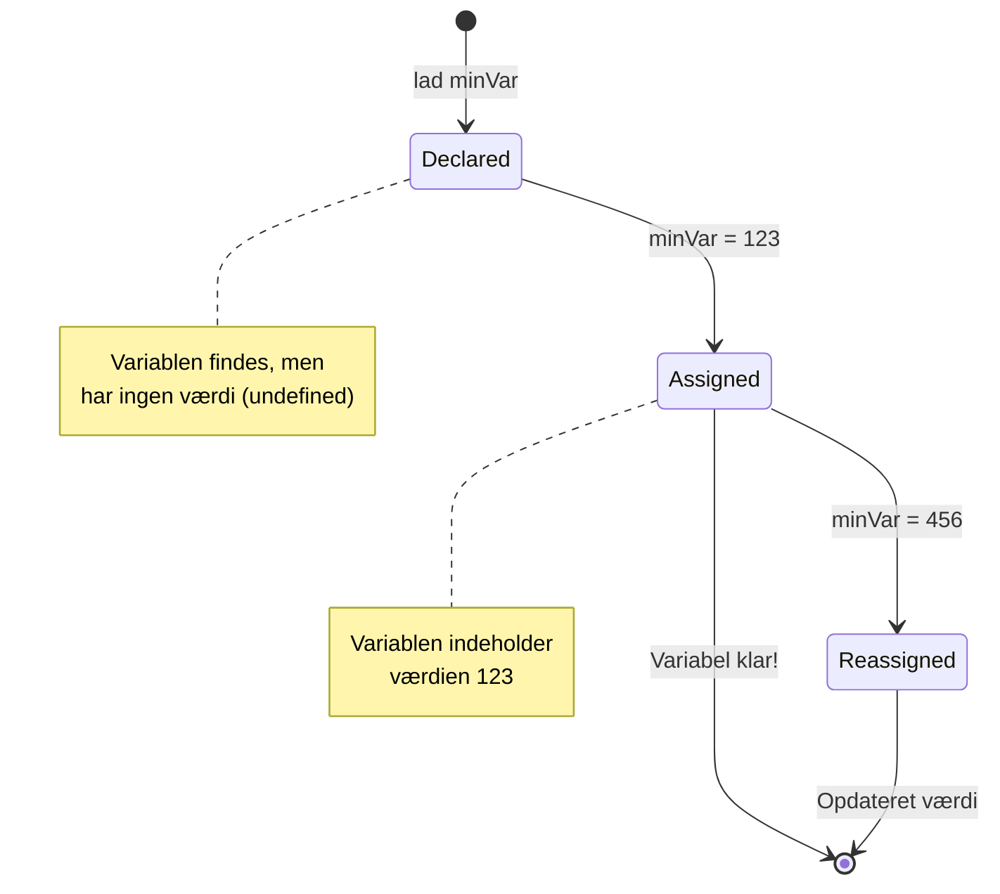
> **Hurtigt tip**: Tænk på variabler som mærkede opbevaringsbokse. Du opretter boksen (`let`), lægger noget i den (`=`), og kan senere erstatte indholdet, hvis det er nødvendigt!

## Konstanter

Nogle gange skal du gemme information, der aldrig må ændres under programmets udførelse. Tænk på konstanter som de matematiske principper, som Euklid etablerede i oldtidens Grækenland – når de først var bevist og dokumenteret, forblev de faste for al fremtidig brug.

Konstanter fungerer ligesom variabler, men med en vigtig begrænsning: når du først har tildelt deres værdi, kan den ikke ændres. Denne uforanderlighed hjælper med at forhindre utilsigtede ændringer af kritiske værdier i dit program.

Deklaration og initialisering af en konstant følger samme koncept som for en variabel, med undtagelse af nøgleordet `const`. Konstanter erklæres typisk med store bogstaver.

```javascript
const MY_VARIABLE = 123;
```

**Dette er, hvad koden gør:**
- **Opretter** en konstant med navnet `MY_VARIABLE` med værdien 123
- **Bruger** store bogstaver som navngivningskonvention for konstanter
- **Forhindrer** enhver fremtidig ændring af denne værdi

Konstanter har to hovedregler:

- **Du skal give dem en værdi med det samme** – tomme konstanter er ikke tilladt!
- **Du kan aldrig ændre den værdi** – JavaScript vil kaste en fejl, hvis du prøver. Lad os se, hvad jeg mener:

   **Simpel værdi** – Følgende er IKKE tilladt:
   
      ```javascript
      const PI = 3;
      PI = 4; // ikke tilladt
      ```

   **Husk dette:**
   - **Forsøg** på at gen-tildele en konstant vil forårsage en fejl
   - **Beskytter** vigtige værdier mod utilsigtede ændringer
   - **Sikrer** at værdien forbliver konsistent gennem hele dit program
 
   **Objektreferencen er beskyttet** – Følgende er IKKE tilladt:
   
      ```javascript
      const obj = { a: 3 };
      obj = { b: 5 } // ikke tilladt
      ```

   **Forstå disse koncepter:**
   - **Forhindrer** at hele objektet bliver erstattet med et nyt
   - **Beskytter** referencen til det oprindelige objekt
   - **Opholder** objektets identitet i hukommelsen

    **Objektets værdi er ikke beskyttet** – Følgende ER tilladt:
    
      ```javascript
      const obj = { a: 3 };
      obj.a = 5;  // tilladt
      ```

      **Her er, hvad der sker:**
      - **Ændrer** værdien af en egenskab inde i objektet
      - **Beholder** den samme objektreference
      - **Viser** at objektets indhold kan ændres, mens referencen forbliver konstant

   > Bemærk, en `const` betyder, at referencen er beskyttet mod gen-tildeling. Værdien er dog ikke _uforanderlig_ og kan ændre sig, især hvis det er en kompleks konstruktion som et objekt.

## Datatyper

JavaScript organiserer information i forskellige kategorier kaldet datatyper. Dette koncept spejler, hvordan gamle lærde kategoriserede viden – Aristoteles skelnede mellem forskellige typer af ræsonnement, vel vidende, at logiske principper ikke kunne anvendes ensartet på poesi, matematik og naturfilosofi.

Datatyper er vigtige, fordi forskellige operationer arbejder med forskellige slags information. Ligesom du ikke kan udføre aritmetik på en persons navn eller alfabetisere en matematisk ligning, kræver JavaScript den passende datatype til hver operation. At forstå dette forhindrer fejl og gør din kode mere pålidelig.

Variabler kan gemme mange forskellige typer værdier, som tal og tekst. Disse forskellige værdityper kaldes for **datatyper**. Datatyper er en vigtig del af softwareudvikling, fordi de hjælper udviklere med at træffe beslutninger om, hvordan koden skal skrives, og hvordan softwaren skal køre. Derudover har nogle datatyper unikke egenskaber, der hjælper med at transformere eller udvinde yderligere information fra en værdi.

✅ Datatyper kaldes også JavaScript data-primitiver, da de er de lavest-niveau datatyper, som sproget tilbyder. Der er 7 primitive datatyper: string, number, bigint, boolean, undefined, null og symbol. Brug et øjeblik på at visualisere, hvad hver af disse primitive kunne repræsentere. Hvad er en `zebra`? Hvad med `0`? `true`?

### Tal

Tal er den mest ligetil datatype i JavaScript. Uanset om du arbejder med heltal som 42, decimaltal som 3.14, eller negative tal som -5, håndterer JavaScript dem ensartet.

Kan du huske vores variabel fra tidligere? Det 123, vi gemte, var faktisk en tal-datatype:

```javascript
let myVariable = 123;
```

**Nøglekarakteristika:**
- JavaScript genkender automatisk numeriske værdier
- Du kan udføre matematiske operationer med disse variabler
- Ingen eksplicit typeangivelse er nødvendig

Variabler kan gemme alle typer tal, inklusive decimaltal eller negative tal. Tal kan også bruges med aritmetiske operatorer, som dækkes i [næste sektion](../../../../2-js-basics/1-data-types).

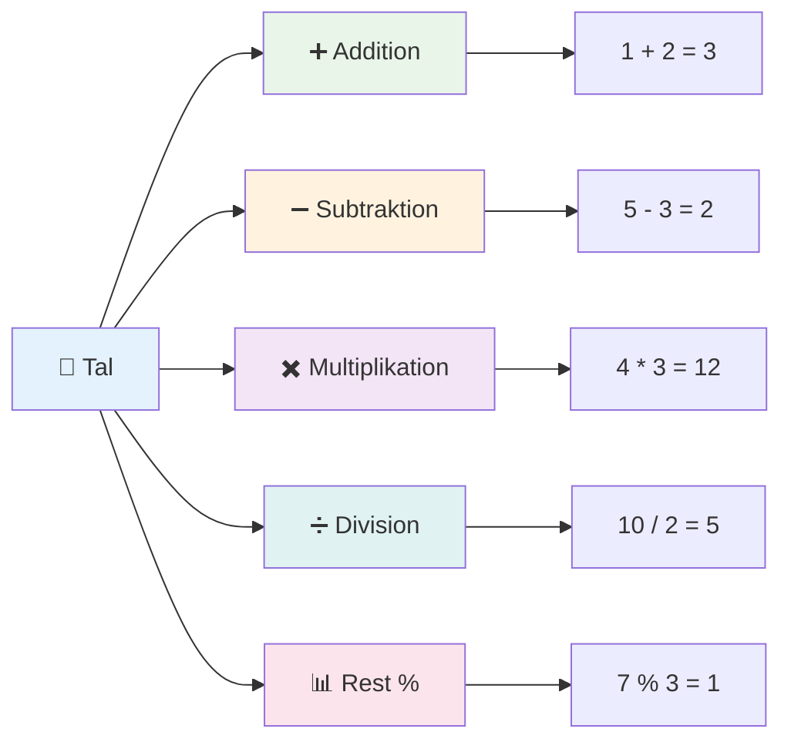
### Aritmetiske Operatorer

Aritmetiske operatorer giver dig mulighed for at udføre matematiske beregninger i JavaScript. Disse operatorer følger de samme principper som matematikere har brugt i århundreder – de samme symboler, der optrådte i værker af lærde som Al-Khwarizmi, som udviklede algebraisk notation.

Operatorerne fungerer som forventet fra traditionel matematik: plus for addition, minus for subtraktion, osv.

Der er flere typer operatorer, som du kan bruge til aritmetiske funktioner, og nogle er her listet:

| Symbol | Beskrivelse                                                          | Eksempel                          |
| ------ | ------------------------------------------------------------------- | -------------------------------- |
| `+`    | **Addition**: Beregner summen af to tal                             | `1 + 2 //forventet svar er 3`    |
| `-`    | **Subtraktion**: Beregner forskellen mellem to tal                  | `1 - 2 //forventet svar er -1`   |
| `*`    | **Multiplikation**: Beregner produktet af to tal                    | `1 * 2 //forventet svar er 2`    |
| `/`    | **Division**: Beregner kvotienten af to tal                         | `1 / 2 //forventet svar er 0.5`  |
| `%`    | **Resterende**: Beregner resten fra divisionen af to tal            | `1 % 2 //forventet svar er 1`    |

✅ Prøv det! Prøv en aritmetisk operation i din browsers konsol. Overrasker resultaterne dig?

### 🧮 **Matematikfærdighedscheck: Regn med Selvsikkerhed**

**Test din aritmetiske forståelse:**
- Hvad er forskellen mellem `/` (division) og `%` (rest)?
- Kan du forudsige, hvad `10 % 3` er? (Hint: det er ikke 3,33...)
- Hvorfor kunne restoperatoren være nyttig i programmering?

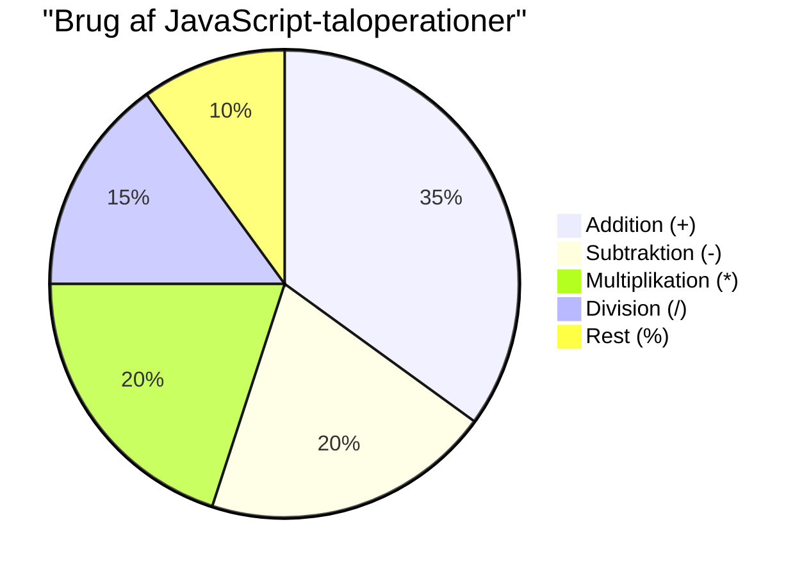
> **Virkelighedsindsigt**: Restoperatoren (%) er super nyttig til at tjekke, om tal er lige/ulige, skabe mønstre eller cykle gennem arrays!

### Strenge

I JavaScript repræsenteres tekstdata som strenge. Begrebet "streng" kommer fra idéen om tegn sat sammen i sekvens, ligesom skribenter i middelalderlige klostre ville forbinde bogstaver for at danne ord og sætninger i deres manuskripter.

Strenge er grundlæggende for webudvikling. Hver tekst, der vises på et website – brugernavne, knap-etiketter, fejlmeddelelser, indhold – håndteres som strengdata. At forstå strenge er essentielt for at skabe funktionelle brugerflader.

Strenge er sæt af tegn, der befinder sig mellem enkelt- eller dobbeltanførselstegn.

```javascript
'This is a string'
"This is also a string"
let myString = 'This is a string value stored in a variable';
```

**Forstå disse koncepter:**
- **Bruger** enten enkeltanførselstegn `'` eller dobbeltanførselstegn `"` til at definere strenge
- **Gemmer** tekstdata, som kan inkludere bogstaver, tal og symboler
- **Tildeler** strengværdier til variabler til senere brug
- **Kræver** anførselstegn for at skelne tekst fra variabelnavne

Husk at bruge anførselstegn, når du skriver en streng, ellers vil JavaScript antage, det er et variabelnavn.

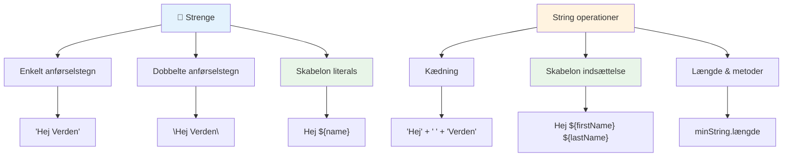
### Formatering af Strenge

Strengmanipulation giver dig mulighed for at kombinere tekstdele, inkorporere variabler og skabe dynamisk indhold, der reagerer på programmets tilstand. Denne teknik gør det muligt at konstruere tekst programmatisk.

Ofte skal du sammenkæde flere strenge – denne proces kaldes konkatenering.
For at **sammenkæde** to eller flere strenge, eller forbinde dem sammen, brug `+` operatoren.

```javascript
let myString1 = "Hello";
let myString2 = "World";

myString1 + myString2 + "!"; //HejVerden!
myString1 + " " + myString2 + "!"; //Hej Verden!
myString1 + ", " + myString2 + "!"; //Hej, Verden!
```

**Trin for trin, her er hvad der sker:**
- **Kombinerer** flere strenge ved brug af `+` operatoren
- **Forbinder** strenge direkte sammen uden mellemrum i det første eksempel
- **Tilføjer** mellemrumstegn `" "` mellem strenge for læsbarhed
- **Indsætter** tegnsætning som kommaer for at skabe korrekt formatering

✅ Hvorfor er `1 + 1 = 2` i JavaScript, men `'1' + '1' = 11?` Tænk over det. Hvad med `'1' + 1`?

**Template literals** er en anden måde at formatere strenge på, bortset fra at backtick bruges i stedet for citationstegn. Alt der ikke er almindelig tekst, skal placeres inden i pladsholdere `${ }`. Dette inkluderer eventuelle variable, som kan være strenge.

```javascript
let myString1 = "Hello";
let myString2 = "World";

`${myString1} ${myString2}!` //Hej Verden!
`${myString1}, ${myString2}!` //Hej, Verden!
```

**Lad os forstå hver del:**
- **Bruger** backticks `` ` `` i stedet for almindelige citationstegn til at lave template literals
- **Indlejrer** variable direkte ved brug af `${}` pladsholder-syntaks
- **Bevarer** mellemrum og formatering nøjagtigt som skrevet
- **Tilbyder** en renere måde at skabe komplekse strenge med variable på

Du kan opnå dine formateringsmål med begge metoder, men template literals vil respektere ethvert mellemrum og linjeskift.

✅ Hvornår ville du bruge en template literal kontra en almindelig streng?

### 🔤 **Kontrol af strengfærdigheder: Tillid til tekstopredigering**

**Evaluer dine strengfærdigheder:**
- Kan du forklare, hvorfor `'1' + '1'` er lig med `'11'` i stedet for `2`?
- Hvilken strengmetode synes du er mest læsbar: sammenkædning eller template literals?
- Hvad sker der, hvis du glemmer citaterne omkring en streng?

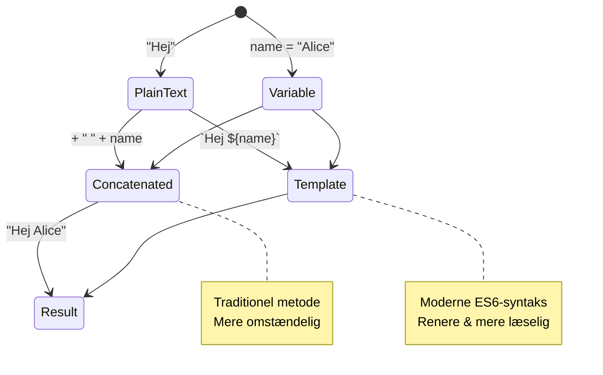
> **Pro tip**: Template literals foretrækkes som regel til kompleks strengbygning, fordi de er mere læsbare og håndterer flersporede strenge smukt!

### Booleans

Booleans repræsenterer den simpleste form for data: de kan kun indeholde en af to værdier – `true` eller `false`. Dette binære logiksystem kan føres tilbage til George Boole, en matematiker fra det 19. århundrede, som udviklede boolsk algebra.

På trods af deres enkelhed er booleans essentielle for programlogikken. De gør det muligt for din kode at træffe beslutninger baseret på betingelser – om en bruger er logget ind, om en knap blev klikket, eller om bestemte kriterier er opfyldt.

Booleans kan kun have to værdier: `true` eller `false`. Booleans kan hjælpe med at træffe beslutninger om, hvilke kode linjer der skal køre, når visse betingelser opfyldes. I mange tilfælde hjælper [operatorer](../../../../2-js-basics/1-data-types) med at sætte værdien af en Boolean, og du vil ofte bemærke og skrive variable, der initialiseres eller får opdateret deres værdier med en operator.

```javascript
let myTrueBool = true;
let myFalseBool = false;
```

**I ovenstående har vi:**
- **Oprettet** en variabel, der gemmer den boolske værdi `true`
- **Demonstreret** hvordan man gemmer den boolske værdi `false`
- **Brugt** de præcise nøgleord `true` og `false` (ingen citationstegn nødvendig)
- **Forberedt** disse variable til brug i betingede udsagn

✅ En variabel kan betragtes som 'truthy', hvis den evalueres til en boolsk `true`. Interessant nok er [alle værdier truthy undtagen dem, der er defineret som falsy](https://developer.mozilla.org/docs/Glossary/Truthy) i JavaScript.

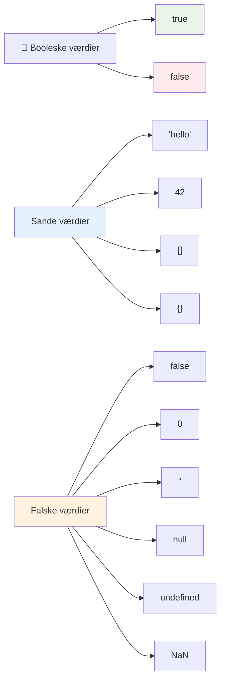
### 🎯 **Boolean logik test: Beslutningstagningsevner**

**Test din forståelse af booleans:**
- Hvorfor tror du, JavaScript har "truthy" og "falsy" værdier ud over blot `true` og `false`?
- Kan du forudsige, hvilken af disse er falsy: `0`, `"0"`, `[]`, `"false"`?
- Hvordan kan booleans være nyttige til at kontrollere programflow?

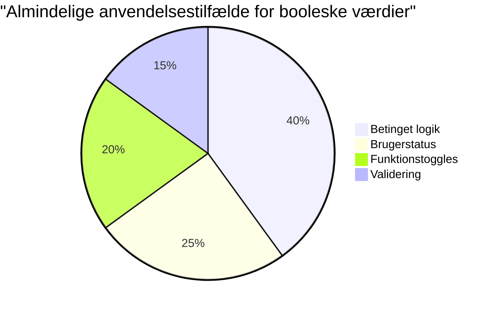
> **Husk**: I JavaScript er kun 6 værdier falsy: `false`, `0`, `""`, `null`, `undefined`, og `NaN`. Alt andet er truthy!

---

## 📊 **Dit data-type værktøjssæt - resume**

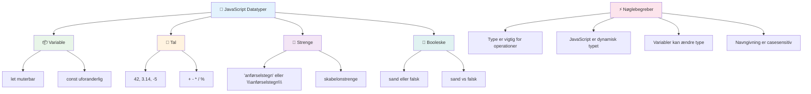
## GitHub Copilot Agent Udfordring 🚀

Brug Agent-tilstand til at fuldføre den følgende udfordring:

**Beskrivelse:** Opret en personlig informationsmanager, der demonstrerer alle de JavaScript-datatyper, du har lært i denne lektion, mens den håndterer virkelige data scenarier.

**Prompt:** Byg et JavaScript-program, der opretter et brugerprofilobjekt med: en persons navn (streng), alder (nummer), status som studerende (boolean), yndlingsfarver som et array og et adresseobjekt med gade, by og postnummer-egenskaber. Inkluder funktioner til at vise profilinformationen og opdatere individuelle felter. Sørg for at demonstrere strengsammenkædning, template literals, aritmetiske operationer med alder og boolean-logik for studerendes status.

Lær mere om [agent mode](https://code.visualstudio.com/blogs/2025/02/24/introducing-copilot-agent-mode) her.

## 🚀 Udfordring

JavaScript har nogle adfærdsmønstre, som kan overraske udviklere. Her er et klassisk eksempel at udforske: prøv at skrive dette i din browserkonsol: `let age = 1; let Age = 2; age == Age` og observer resultatet. Det returnerer `false` – kan du afgøre hvorfor?

Dette repræsenterer en af de mange JavaScript-adfærd, det er værd at forstå. Fortrolighed med disse finurligheder vil hjælpe dig med at skrive mere pålidelig kode og fejlfinde mere effektivt.

## Quiz efter lektionen
[Post-lecture quiz](https://ff-quizzes.netlify.app)

## Gennemgang og Selvstudie

Tag et kig på [denne liste med JavaScript øvelser](https://css-tricks.com/snippets/javascript/) og prøv en. Hvad lærte du?

## Opgave

[Data Types Practice](assignment.md)

## 🚀 Din JavaScript Data Types Mestringstidslinje

### ⚡ **Hvad du kan gøre inden for de næste 5 minutter**
- [ ] Åbn din browserkonsol og opret 3 variable med forskellige datatyper
- [ ] Prøv udfordringen: `let age = 1; let Age = 2; age == Age` og find ud af hvorfor det er falsk
- [ ] Øv sammenkædning af strenge med dit navn og yndlingstal
- [ ] Test hvad der sker, når du lægger et tal til en streng

### 🎯 **Hvad du kan opnå i denne time**
- [ ] Færdiggør quizzen efter lektionen og gennemgå eventuelle forvirrende koncepter
- [ ] Opret en mini lommeregner, der lægger sammen, trækker fra, ganger og dividerer to tal
- [ ] Byg en simpel navneformatterer ved hjælp af template literals
- [ ] Udforsk forskellene mellem `==` og `===` sammenligningsoperatorer
- [ ] Øv dig i at konvertere mellem forskellige datatyper

### 📅 **Din ugelange JavaScript Grundlæggende**
- [ ] Færdiggør opgaven med selvtillid og kreativitet
- [ ] Opret et personligt profilobjekt ved brug af alle lærte datatyper
- [ ] Øv dig med [JavaScript-øvelser fra CSS-Tricks](https://css-tricks.com/snippets/javascript/)
- [ ] Byg en simpel formular-valideringsfunktion ved hjælp af boolean-logik
- [ ] Eksperimenter med array- og objekt-datatyper (forhåndsvisning af kommende lektioner)
- [ ] Deltag i et JavaScript-community og stil spørgsmål om datatyper

### 🌟 **Din månedlange transformation**
- [ ] Integrer datatypologiforståelse i større programmeringsprojekter
- [ ] Forstå hvornår og hvorfor man bruger hver datatype i virkelige applikationer
- [ ] Hjælp andre begyndere med at forstå JavaScript-grundlæggende
- [ ] Byg en lille applikation, der håndterer forskellige typer brugerdata
- [ ] Udforsk avancerede datatypebegreber som typecoercion og streng lighed
- [ ] Bidrag til open source JavaScript-projekter med dokumentationsforbedringer

### 🧠 **Afsluttende Mestringskontrol af Datatyper**

**Fejr din JavaScript-grundlæggende:**
- Hvilken datatype overraskede dig mest med sin opførsel?
- Hvor tryg føler du dig ved at forklare variable versus konstanter til en ven?
- Hvad er det mest interessante, du har opdaget om JavaScripts typesystem?
- Hvilken virkelighedsnær applikation kan du forestille dig at bygge med disse grundlæggende koncepter?

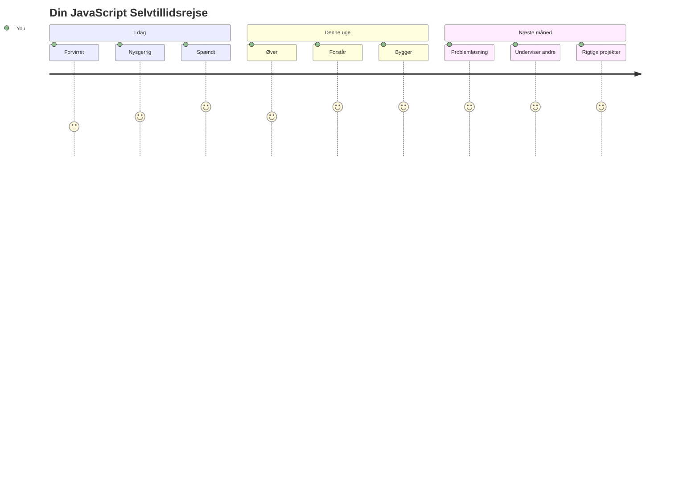
> 💡 **Du har bygget fundamentet!** At forstå datatyper er som at lære alfabetet, før du skriver historier. Enhver JavaScript-program, du nogensinde skriver, vil bruge disse grundlæggende koncepter. Du har nu byggeklodserne til at skabe interaktive hjemmesider, dynamiske applikationer og løse virkelige problemer med kode. Velkommen til den vidunderlige verden af JavaScript! 🎉

---

<!-- CO-OP TRANSLATOR DISCLAIMER START -->
**Ansvarsfraskrivelse**:
Dette dokument er blevet oversat ved hjælp af AI-oversættelsestjenesten [Co-op Translator](https://github.com/Azure/co-op-translator). Selvom vi bestræber os på nøjagtighed, bedes du være opmærksom på, at automatiserede oversættelser kan indeholde fejl eller unøjagtigheder. Det oprindelige dokument på originalsproget bør betragtes som den autoritative kilde. For kritisk information anbefales professionel menneskelig oversættelse. Vi er ikke ansvarlige for eventuelle misforståelser eller fejltolkninger, der opstår som følge af brugen af denne oversættelse.
<!-- CO-OP TRANSLATOR DISCLAIMER END -->