<!--
CO_OP_TRANSLATOR_METADATA:
{
  "original_hash": "71f7d7dafa1c7194d79ddac87f669ff9",
  "translation_date": "2026-01-06T23:28:31+00:00",
  "source_file": "2-js-basics/2-functions-methods/README.md",
  "language_code": "da"
}
-->
# JavaScript Grundlæggende: Metoder og Funktioner


> Sketchnote af [Tomomi Imura](https://twitter.com/girlie_mac)

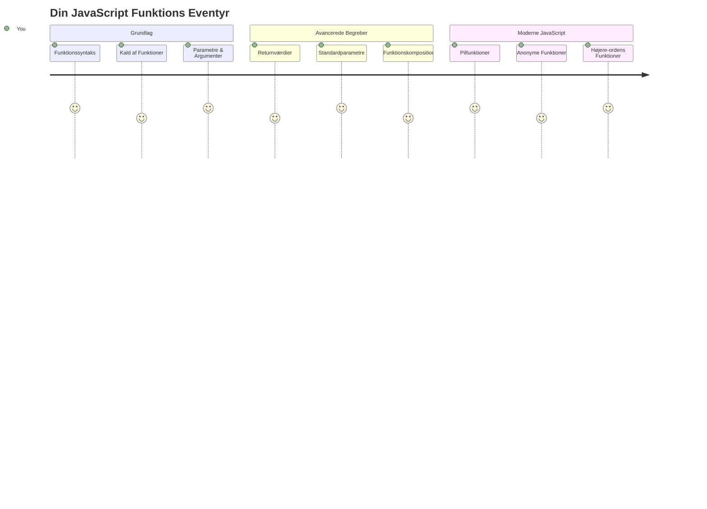
## For-forelæsning Quiz
[For-forelæsning quiz](https://ff-quizzes.netlify.app)

At skrive den samme kode igen og igen er en af programmeringens mest almindelige frustrationer. Funktioner løser dette problem ved at lade dig pakke kode ind i genanvendelige blokke. Tænk på funktioner som de standardiserede dele, der gjorde Henry Fords samlebånd revolutionerende – når du først har skabt en pålidelig komponent, kan du bruge den, hvor det end er nødvendigt uden at bygge den fra bunden.

Funktioner giver dig mulighed for at samle kode stykker, så du kan genbruge dem gennem hele dit program. I stedet for at kopiere og indsætte den samme logik alle steder, kan du oprette en funktion en gang og kalde den, når det er nødvendigt. Denne tilgang holder din kode organiseret og gør opdateringer meget nemmere.

I denne lektion lærer du, hvordan du opretter dine egne funktioner, sender information til dem og får nyttige resultater retur. Du vil opdage forskellen mellem funktioner og metoder, lære moderne syntaksmetoder og se, hvordan funktioner kan arbejde sammen med andre funktioner. Vi bygger disse koncepter trin for trin.

[](https://youtube.com/watch?v=XgKsD6Zwvlc "Methods and Functions")

> 🎥 Klik på billedet ovenfor for en video om metoder og funktioner.

> Du kan tage denne lektion på [Microsoft Learn](https://docs.microsoft.com/learn/modules/web-development-101-functions/?WT.mc_id=academic-77807-sagibbon)!

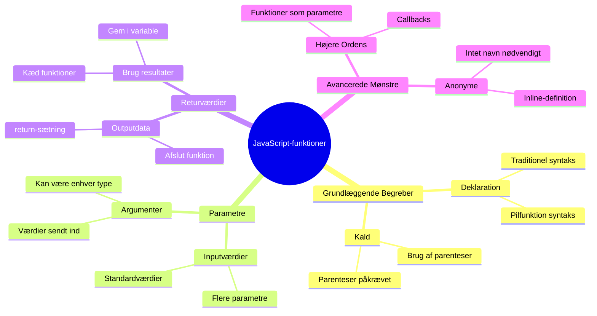
## Funktioner

En funktion er en selvstændig kodeblok, der udfører en specifik opgave. Den indkapsler logik, som du kan køre, når det er nødvendigt.

I stedet for at skrive den samme kode flere gange i dit program, kan du pakke den ind i en funktion og kalde denne funktion, når du har brug for det. Denne tilgang holder din kode ren og gør opdateringer meget nemmere. Overvej hvor svært det ville være at vedligeholde, hvis du skulle ændre logik spredt over 20 forskellige steder i din kodebase.

Det er vigtigt at navngive dine funktioner beskrivende. En godt navngivet funktion kommunikerer sit formål klart – når du ser `cancelTimer()`, forstår du straks, hvad den gør, ligesom en klart mærket knap fortæller dig præcis, hvad der sker, når du klikker på den.

## Oprettelse og kald af en funktion

Lad os se på, hvordan man opretter en funktion. Syntaksen følger et konsekvent mønster:

```javascript
function nameOfFunction() { // funktionsdefinition
 // funktionsdefinition/krop
}
```

Lad os bryde det ned:
- `function` nøgleordet fortæller JavaScript "Hey, jeg laver en funktion!"
- `nameOfFunction` er, hvor du giver din funktion et beskrivende navn
- Parentesserne `()` er, hvor du kan tilføje parametre (det vender vi tilbage til snart)
- Krøllede parenteser `{}` indeholder den faktiske kode, der kører, når du kalder funktionen

Lad os lave en simpel hilsensfunktion for at se det i praksis:

```javascript
function displayGreeting() {
  console.log('Hello, world!');
}
```

Denne funktion udskriver "Hello, world!" til konsollen. Når du har defineret den, kan du bruge den så mange gange, som du har brug for.

For at udføre (eller "kalde") din funktion, skriv dens navn efterfulgt af parenteser. JavaScript tillader dig at definere din funktion før eller efter du kalder den – JavaScript motoren håndterer udførelsesrækkefølgen.

```javascript
// kalder vores funktion
displayGreeting();
```

Når du kører denne linje, eksekveres al koden inde i din `displayGreeting` funktion, og "Hello, world!" vises i browserens konsol. Du kan kalde denne funktion gentagne gange.

### 🧠 **Grundlæggende Funktionstjek: Byg Dine Første Funktioner**

**Lad os se, hvordan du føler dig med grundlæggende funktioner:**
- Kan du forklare, hvorfor vi bruger krøllede parenteser `{}` i funktionsdefinitioner?
- Hvad sker der, hvis du skriver `displayGreeting` uden parenteserne?
- Hvorfor kan det være nyttigt at kalde den samme funktion flere gange?

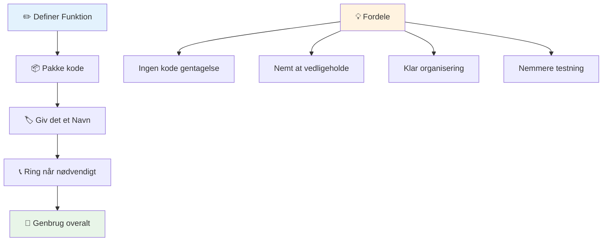
> **Bemærk:** Du har brugt **metoder** gennem disse lektioner. `console.log()` er en metode – i bund og grund en funktion, som tilhører `console` objektet. Den vigtigste forskel er, at metoder er bundet til objekter, mens funktioner står selvstændigt. Mange udviklere bruger disse termer i daglig tale ombytteligt.

### Bedste praksis for funktioner

Her er et par tips til at hjælpe dig med at skrive gode funktioner:

- Giv dine funktioner klare, beskrivende navne – din fremtidige version vil takke dig!
- Brug **camelCase** til flersprogede navne (f.eks. `calculateTotal` i stedet for `calculate_total`)
- Hold hver funktion fokuseret på at gøre én ting godt

## At sende information til en funktion

Vores `displayGreeting` funktion er begrænset – den kan kun vise "Hello, world!" til alle. Parametre tillader os at gøre funktioner mere fleksible og nyttige.

**Parametre** fungerer som pladsholdere, hvor du kan indsætte forskellige værdier hver gang, du bruger funktionen. På den måde kan den samme funktion arbejde med forskellig information ved hvert kald.

Du opremser parametre inde i parenteserne, når du definerer din funktion, adskilt med kommaer, hvis der er flere:

```javascript
function name(param, param2, param3) {

}
```

Hver parameter fungerer som en pladsholder – når nogen kalder din funktion, giver de egentlige værdier, der sættes ind i disse pladsholdere.

Lad os opdatere vores hilsensfunktion, så den tager imod et navn:

```javascript
function displayGreeting(name) {
  const message = `Hello, ${name}!`;
  console.log(message);
}
```

Bemærk hvordan vi bruger backticks (`` ` ``) og `${}` til at indsætte navnet direkte i vores besked – dette kaldes en template literal, og det er en rigtig praktisk måde at bygge strenge med variable blandet ind.

Nu kan vi, når vi kalder vores funktion, sende et hvilket som helst navn:

```javascript
displayGreeting('Christopher');
// viser "Hej, Christopher!" når det køres
```

JavaScript tager strengen `'Christopher'`, tildeler den til `name` parameteren og skaber den personlige besked "Hello, Christopher!"

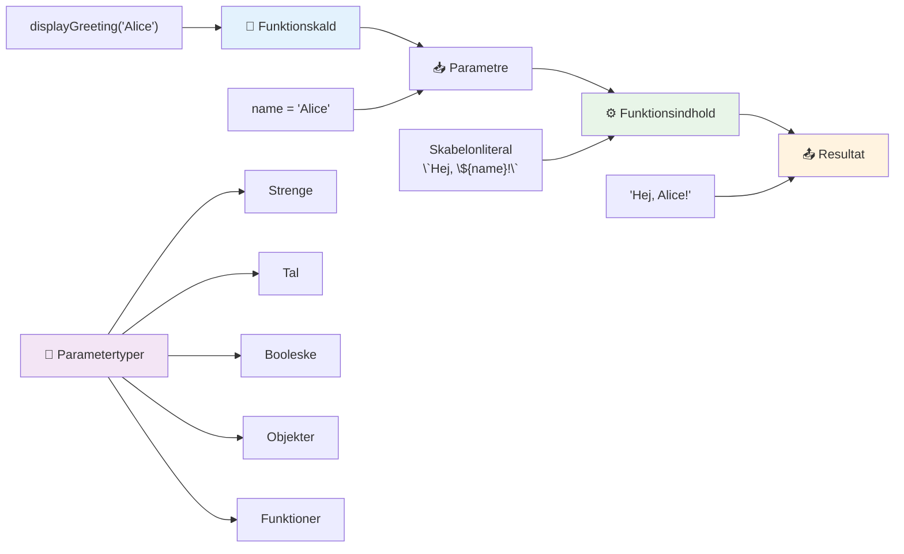
## Standardværdier

Hvad hvis vi vil gøre nogle parametre valgfrie? Det er her standardværdier kommer ind i billedet!

Lad os sige, at vi vil lade folk tilpasse hilsens ord, men hvis de ikke angiver noget, bruger vi bare "Hello" som en standard. Du kan opsætte standardværdier ved at bruge lighedstegn, ligesom når du sætter en variabel:

```javascript
function displayGreeting(name, salutation='Hello') {
  console.log(`${salutation}, ${name}`);
}
```

Her er `name` stadig påkrævet, men `salutation` har en backup værdi på `'Hello'`, hvis ingen giver en anden hilsen.

Nu kan vi kalde denne funktion på to forskellige måder:

```javascript
displayGreeting('Christopher');
// viser "Hej, Christopher"

displayGreeting('Christopher', 'Hi');
// viser "Hej, Christopher"
```

Ved det første kald bruger JavaScript standarden "Hello", da vi ikke har angivet en hilsen. Ved det andet kald bruger den vores brugerdefinerede "Hi" i stedet. Denne fleksibilitet gør funktioner tilpasningsdygtige til forskellige scenarier.

### 🎛️ **Parametre Mester Check: Gør Funktioner Fleksible**

**Test din forståelse af parametre:**
- Hvad er forskellen mellem en parameter og et argument?
- Hvorfor er standardværdier nyttige i programmering i den virkelige verden?
- Kan du forudsige, hvad der sker, hvis du sender flere argumenter end parametre?

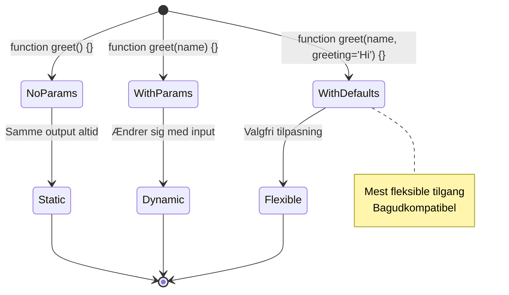
> **Pro tip**: Standardparametre gør dine funktioner mere brugervenlige. Brugere kan hurtigt komme i gang med fornuftige standardindstillinger, men kan stadig tilpasse, når det er nødvendigt!

## Returnerede værdier

Vores funktioner hidtil har bare udskrevet beskeder til konsollen, men hvad hvis du ønsker, at en funktion skal beregne noget og give dig resultatet tilbage?

Det er her **returnerede værdier** kommer ind i billedet. I stedet for bare at vise noget, kan en funktion give dig en værdi tilbage, som du kan gemme i en variabel eller bruge andre steder i din kode.

For at sende en værdi tilbage bruger du nøgleordet `return` efterfulgt af det, du ønsker at returnere:

```javascript
return myVariable;
```

Her er noget vigtigt: Når en funktion rammer en `return` erklæring, stopper den øjeblikkeligt med at køre og sender den værdi tilbage til den, som kaldte den.

Lad os ændre vores hilsensfunktion, så den returnerer beskeden i stedet for at udskrive den:

```javascript
function createGreetingMessage(name) {
  const message = `Hello, ${name}`;
  return message;
}
```

Nu skaber denne funktion beskeden og sender den tilbage til os i stedet for at udskrive den.

For at bruge den returnerede værdi kan vi gemme den i en variabel ligesom enhver anden værdi:

```javascript
const greetingMessage = createGreetingMessage('Christopher');
```

Nu indeholder `greetingMessage` "Hello, Christopher" og vi kan bruge den hvor som helst i vores kode – til at vise den på en webside, inkludere den i en email eller sende den til en anden funktion.

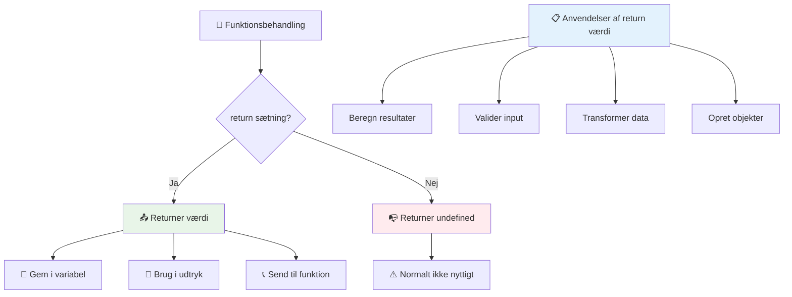
### 🔄 **Returnerede Værdier Check: Få Resultater Tilbage**

**Evaluer din forståelse af returnerede værdier:**
- Hvad sker der med kode efter en `return` erklæring i en funktion?
- Hvorfor er det ofte bedre at returnere værdier end bare at udskrive til konsollen?
- Kan en funktion returnere forskellige typer værdier (streng, tal, boolsk)?

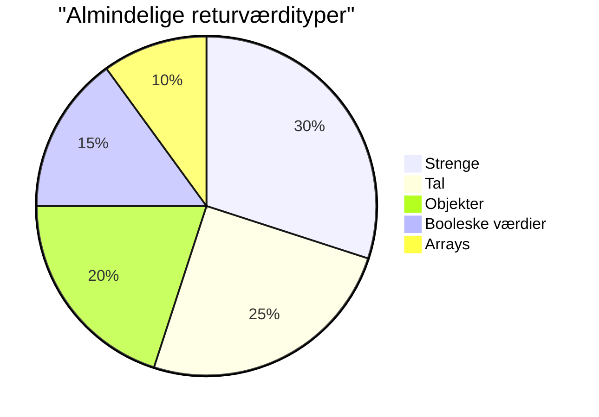
> **Vigtig indsigt**: Funktioner, der returnerer værdier, er mere alsidige, fordi den, der kalder funktionen, beslutter, hvad der skal gøres med resultatet. Dette gør din kode mere modulær og genanvendelig!

## Funktioner som parametre for funktioner

Funktioner kan sendes som parametre til andre funktioner. Selvom dette koncept kan virke komplekst til at starte med, er det en kraftfuld funktion, der muliggør fleksible programmeringsmønstre.

Dette mønster er super almindeligt, når du vil sige "når noget sker, gør dette andet." For eksempel "når timeren slutter, kør denne kode" eller "når brugeren klikker på knappen, kald denne funktion."

Lad os se på `setTimeout`, som er en indbygget funktion, der venter et bestemt tidsrum og så kører noget kode. Vi skal fortælle den, hvilken kode den skal køre – perfekt brug af at sende en funktion!

Prøv denne kode – efter 3 sekunder ser du en besked:

```javascript
function displayDone() {
  console.log('3 seconds has elapsed');
}
// timer værdien er i millisekunder
setTimeout(displayDone, 3000);
```

Bemærk hvordan vi sender `displayDone` (uden parenteser) til `setTimeout`. Vi kalder ikke funktionen selv – vi overgiver den til `setTimeout` og siger "kald denne om 3 sekunder."

### Anonyme funktioner

Nogle gange har du brug for en funktion til bare én ting og vil ikke give den et navn. Tænk over det – hvis du kun bruger en funktion én gang, hvorfor så fylde din kode med et ekstra navn?

JavaScript lader dig oprette **anonyme funktioner** – funktioner uden navne, som du kan definere lige dér, hvor du har brug for dem.

Sådan kan vi omskrive vores timer-eksempel med en anonym funktion:

```javascript
setTimeout(function() {
  console.log('3 seconds has elapsed');
}, 3000);
```

Dette opnår det samme resultat, men funktionen er defineret direkte inden i `setTimeout` kaldet, hvilket eliminerer behovet for en separat funktionsdeklaration.

### Fat arrow funktioner

Moderne JavaScript har en endnu kortere måde at skrive funktioner på kaldet **arrow functions**. De bruger `=>` (som ligner en pil – forstår du?) og er super populære blandt udviklere.

Arrow-funktioner lader dig springe `function` nøgleordet over og skrive mere koncis kode.

Her er vores timer-eksempel med en arrow-funktion:

```javascript
setTimeout(() => {
  console.log('3 seconds has elapsed');
}, 3000);
```

`()` er hvor parametrene går (tomt i dette tilfælde), derefter kommer pilen `=>`, og til sidst funktionskroppen i krøllede parenteser. Dette giver den samme funktionalitet med en mere koncis syntaks.

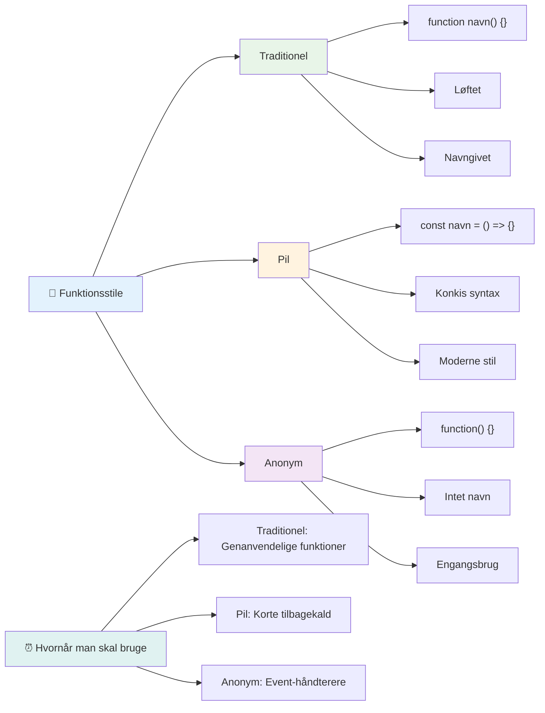
### Hvornår skal man bruge hvilken strategi

Hvornår skal du bruge hvilken tilgang? En praktisk tommelfingerregel: Hvis du vil bruge funktionen flere gange, giv den et navn og definer den separat. Hvis det er til ét specifikt formål, kan du overveje en anonym funktion. Både arrow-funktioner og traditionel syntaks er gyldige valg, selvom arrow-funktioner er udbredte i moderne JavaScript-kodebaser.

### 🎨 **Funktion Styles Mester Check: Vælg den Rigtige Syntaks**

**Test din syntaksforståelse:**
- Hvornår foretrækker du måske arrow functions fremfor traditionel funktionssyntaks?
- Hvad er hovedfordelen ved anonyme funktioner?
- Kan du tænke på en situation, hvor en navngivet funktion er bedre end en anonym?

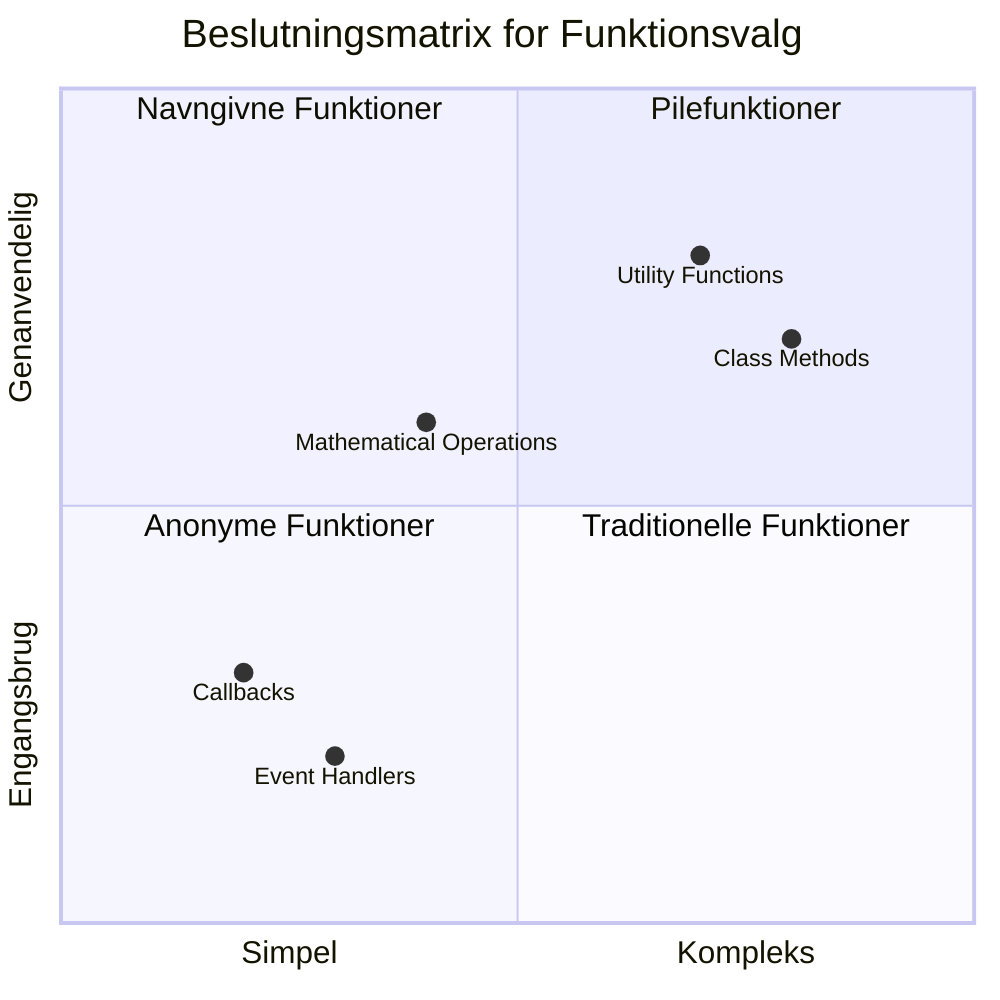
> **Moderne trend**: Arrow functions bliver standardvalget for mange udviklere på grund af deres koncise syntaks, men traditionelle funktioner har stadig deres plads!

---


## 🚀 Udfordring

Kan du formulere forskellen på funktioner og metoder i én sætning? Giv det et forsøg!

## GitHub Copilot Agent Udfordring 🚀

Brug Agent-tilstand til at løse følgende udfordring:

**Beskrivelse:** Opret et hjælpemiddel bibliotek af matematiske funktioner, der demonstrerer forskellige funktionskoncepter dækket i denne lektion, inklusive parametre, standardværdier, returnerede værdier og arrow funktioner.

**Prompt:** Opret en JavaScript-fil kaldet `mathUtils.js`, som indeholder følgende funktioner:
1. En funktion `add` der tager to parametre og returnerer summen
2. En funktion `multiply` med standard parameter værdier (anden parameter standard til 1)
3. En arrow funktion `square`, der tager et tal og returnerer dets kvadrat
4. En funktion `calculate` som accepterer en anden funktion som parameter og to tal, og derefter anvender funktionen på tallene
5. Demonstrer kald af hver funktion med passende testcases

Læs mere om [agent mode](https://code.visualstudio.com/blogs/2025/02/24/introducing-copilot-agent-mode) her.

## Efter-forelæsning Quiz
[Efter-forelæsning quiz](https://ff-quizzes.netlify.app)

## Gennemgang & Selvstudium

Det er værd at [læse lidt mere om arrow-funktioner](https://developer.mozilla.org/docs/Web/JavaScript/Reference/Functions/Arrow_functions), da de i stigende grad bruges i kodebaser. Øv dig i at skrive en funktion og derefter omskrive den med denne syntaks.

## Opgave

[Sjov med Funktioner](assignment.md)

---

## 🧰 **Dit JavaScript Funktionsværktøjssæt Resumé**

```mermaid
graph TD
    A["🎯 JavaScript Funktioner"] --> B["📋 Funktionsdeklaration"]
    A --> C["📥 Parametre"]
    A --> D["📤 Returværdier"]
    A --> E["🎨 Moderne Syntaks"]
    
    B --> B1["function navn() {}"]
    B --> B2["Beskrivende navngivning"]
    B --> B3["Genanvendelige kodeblokke"]
    
    C --> C1["Input data"]
    C --> C2["Standardværdier"]
    C --> C3["Flere parametre"]
    
    D --> D1["return sætning"]
    D --> D2["Afslut funktion"]
    D --> D3["Send data tilbage"]
    
    E --> E1["Pilestrengsfunktioner: () =>"]
    E --> E2["Anonyme funktioner"]
    E --> E3["Højereordensfunktioner"]
    
    F["⚡ Nøglefordele"] --> F1["Kodegenbrug"]
    F --> F2["Bedre organisering"]
    F --> F3["Nemmere testning"]
    F --> F4["Modulært design"]
    
    style A fill:#e3f2fd
    style B fill:#e8f5e8
    style C fill:#fff3e0
    style D fill:#f3e5f5
    style E fill:#e0f2f1
    style F fill:#fce4ec
```
---

## 🚀 Din JavaScript Funktionsmester Tidslinje

### ⚡ **Hvad du kan gøre i de næste 5 minutter**
- [ ] Skriv en simpel funktion, der returnerer dit yndlingstal
- [ ] Opret en funktion med to parametre, der lægger dem sammen
- [ ] Prøv at konvertere en traditionel funktion til arrow function-syntaks
- [ ] Øv udfordringen: forklar forskellen mellem funktioner og metoder

### 🎯 **Hvad du kan nå denne time**
- [ ] Færdiggør quizzen efter lektionen og gennemgå eventuelle forvirrende begreber
- [ ] Byg matematikværktøjsbiblioteket fra GitHub Copilot-udfordringen
- [ ] Opret en funktion, der bruger en anden funktion som parameter
- [ ] Øv dig i at skrive funktioner med standardparametre
- [ ] Eksperimenter med template literals i funktionsreturværdier

### 📅 **Din uge-lange funktionsmestring**
- [ ] Færdiggør opgaven "Sjov med funktioner" med kreativitet
- [ ] Refaktorer noget gentaget kode, du har skrevet, til genanvendelige funktioner
- [ ] Byg en lille lommeregner kun ved hjælp af funktioner (ingen globale variabler)
- [ ] Øv arrow functions med array-metoder som `map()` og `filter()`
- [ ] Opret en samling af hjælpefunktioner til almindelige opgaver
- [ ] Studer højereordensfunktioner og funktionelle programmeringskoncepter

### 🌟 **Din månedslange transformation**
- [ ] Mestre avancerede funktionskoncepter som closures og scope
- [ ] Byg et projekt, der i høj grad bruger funktionskomposition
- [ ] Bidrag til open source ved at forbedre funktionsdokumentation
- [ ] Lær en anden om funktioner og forskellige syntaksstile
- [ ] Udforsk funktionelle programmeringsparadigmer i JavaScript
- [ ] Opret et personligt bibliotek af genanvendelige funktioner til fremtidige projekter

### 🏆 **Endelig funktionsmester tjek-ind**

**Fejr din funktionsmestring:**
- Hvad er den mest nyttige funktion, du har skabt indtil nu?
- Hvordan har det at lære om funktioner ændret din måde at tænke på kodeorganisation?
- Hvilken funktionssyntaks foretrækker du og hvorfor?
- Hvilket virkeligt problem ville du løse ved at skrive en funktion?

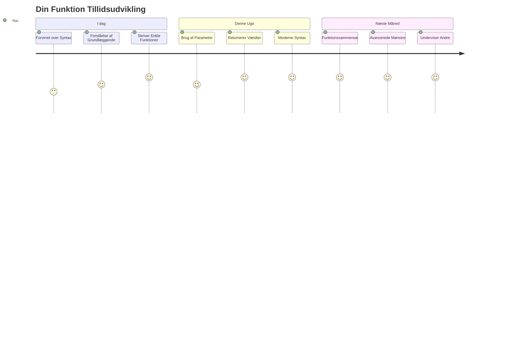
> 🎉 **Du har mestret et af programmeringens mest magtfulde koncepter!** Funktioner er byggestenene til større programmer. Enhver applikation, du nogensinde bygger, vil bruge funktioner til at organisere, genbruge og strukturere kode. Du forstår nu, hvordan du pakker logik ind i genanvendelige komponenter, hvilket gør dig til en mere effektiv og dygtig programmør. Velkommen til verden af modulær programmering! 🚀

---

<!-- CO-OP TRANSLATOR DISCLAIMER START -->
**Ansvarsfraskrivelse**:
Dette dokument er blevet oversat ved hjælp af AI-oversættelsestjenesten [Co-op Translator](https://github.com/Azure/co-op-translator). Selvom vi bestræber os på nøjagtighed, skal du være opmærksom på, at automatiserede oversættelser kan indeholde fejl eller unøjagtigheder. Det oprindelige dokument på dets modersmål bør betragtes som den autoritative kilde. For vigtig information anbefales professionel menneskelig oversættelse. Vi påtager os intet ansvar for misforståelser eller fejltolkninger, der opstår som følge af brugen af denne oversættelse.
<!-- CO-OP TRANSLATOR DISCLAIMER END -->