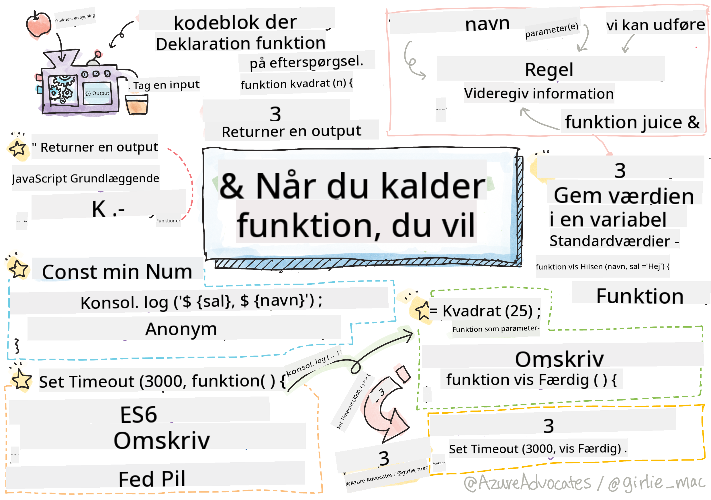

<!--
CO_OP_TRANSLATOR_METADATA:
{
  "original_hash": "ec43b53e8e015cdabfd3ad877b3c28e5",
  "translation_date": "2025-10-23T21:52:49+00:00",
  "source_file": "2-js-basics/2-functions-methods/README.md",
  "language_code": "da"
}
-->
# JavaScript Grundlæggende: Metoder og Funktioner


> Sketchnote af [Tomomi Imura](https://twitter.com/girlie_mac)

## Quiz før lektionen
[Quiz før lektionen](https://ff-quizzes.netlify.app)

At skrive den samme kode igen og igen er en af de mest frustrerende ting ved programmering. Funktioner løser dette problem ved at lade dig pakke kode ind i genanvendelige blokke. Tænk på funktioner som de standardiserede dele, der gjorde Henry Fords samlebånd revolutionerende – når du først har skabt en pålidelig komponent, kan du bruge den hvor som helst uden at skulle bygge den fra bunden igen.

Funktioner giver dig mulighed for at samle stykker af kode, så du kan genbruge dem i hele dit program. I stedet for at kopiere og indsætte den samme logik overalt, kan du oprette en funktion én gang og kalde den, når det er nødvendigt. Denne tilgang holder din kode organiseret og gør opdateringer meget nemmere.

I denne lektion lærer du, hvordan du opretter dine egne funktioner, sender information til dem og får nyttige resultater tilbage. Du vil opdage forskellen mellem funktioner og metoder, lære moderne syntaksmetoder og se, hvordan funktioner kan arbejde sammen med andre funktioner. Vi bygger disse koncepter trin for trin.

[](https://youtube.com/watch?v=XgKsD6Zwvlc "Metoder og Funktioner")

> 🎥 Klik på billedet ovenfor for en video om metoder og funktioner.

> Du kan tage denne lektion på [Microsoft Learn](https://docs.microsoft.com/learn/modules/web-development-101-functions/?WT.mc_id=academic-77807-sagibbon)!

## Funktioner

En funktion er en selvstændig blok af kode, der udfører en specifik opgave. Den indkapsler logik, som du kan udføre, når det er nødvendigt.

I stedet for at skrive den samme kode flere gange i dit program, kan du pakke den ind i en funktion og kalde den funktion, når du har brug for det. Denne tilgang holder din kode ren og gør opdateringer meget nemmere. Tænk på, hvor besværligt det ville være at ændre logik, der var spredt over 20 forskellige steder i din kodebase.

Det er vigtigt at give dine funktioner beskrivende navne. En godt navngivet funktion kommunikerer dens formål klart – når du ser `cancelTimer()`, forstår du straks, hvad den gør, ligesom en tydeligt mærket knap fortæller dig præcis, hvad der vil ske, når du klikker på den.

## Oprettelse og kald af en funktion

Lad os undersøge, hvordan man opretter en funktion. Syntaksen følger et konsekvent mønster:

```javascript
function nameOfFunction() { // function definition
 // function definition/body
}
```

Lad os bryde det ned:
- Nøgleordet `function` fortæller JavaScript "Hey, jeg opretter en funktion!"
- `nameOfFunction` er, hvor du giver din funktion et beskrivende navn
- Parenteserne `()` er, hvor du kan tilføje parametre (det kommer vi snart til)
- Krøllede parenteser `{}` indeholder den faktiske kode, der kører, når du kalder funktionen

Lad os oprette en simpel hilsningsfunktion for at se dette i praksis:

```javascript
function displayGreeting() {
  console.log('Hello, world!');
}
```

Denne funktion udskriver "Hello, world!" til konsollen. Når du først har defineret den, kan du bruge den så mange gange, som du har brug for.

For at udføre (eller "kalde") din funktion skal du skrive dens navn efterfulgt af parenteser. JavaScript tillader dig at definere din funktion før eller efter, du kalder den – JavaScript-motoren håndterer eksekveringsrækkefølgen.

```javascript
// calling our function
displayGreeting();
```

Når du kører denne linje, udfører den al koden inde i din `displayGreeting`-funktion og viser "Hello, world!" i din browsers konsol. Du kan kalde denne funktion gentagne gange.

> **Note:** Du har brugt **metoder** gennem hele disse lektioner. `console.log()` er en metode – i bund og grund en funktion, der tilhører `console`-objektet. Den væsentlige forskel er, at metoder er knyttet til objekter, mens funktioner står selvstændigt. Mange udviklere bruger disse termer ombytteligt i uformelle samtaler.

### Bedste praksis for funktioner

Her er nogle tips til at hjælpe dig med at skrive gode funktioner:

- Giv dine funktioner klare, beskrivende navne – din fremtidige selv vil takke dig!
- Brug **camelCasing** til navne med flere ord (som `calculateTotal` i stedet for `calculate_total`)
- Hold hver funktion fokuseret på at gøre én ting godt

## At sende information til en funktion

Vores `displayGreeting`-funktion er begrænset – den kan kun vise "Hello, world!" for alle. Parametre giver os mulighed for at gøre funktioner mere fleksible og nyttige.

**Parametre** fungerer som pladsholdere, hvor du kan indsætte forskellige værdier hver gang du bruger funktionen. På denne måde kan den samme funktion arbejde med forskellig information ved hver kald.

Du angiver parametre inden for parenteserne, når du definerer din funktion, og adskiller flere parametre med kommaer:

```javascript
function name(param, param2, param3) {

}
```

Hver parameter fungerer som en pladsholder – når nogen kalder din funktion, giver de faktiske værdier, der indsættes i disse pladser.

Lad os opdatere vores hilsningsfunktion til at acceptere en persons navn:

```javascript
function displayGreeting(name) {
  const message = `Hello, ${name}!`;
  console.log(message);
}
```

Bemærk, hvordan vi bruger backticks (`` ` ``) og `${}` til at indsætte navnet direkte i vores besked – dette kaldes en template literal, og det er en virkelig praktisk måde at bygge strenge med variabler blandet ind.

Nu, når vi kalder vores funktion, kan vi sende ethvert navn:

```javascript
displayGreeting('Christopher');
// displays "Hello, Christopher!" when run
```

JavaScript tager strengen `'Christopher'`, tildeler den til parameteren `name` og skaber den personlige besked "Hello, Christopher!"

## Standardværdier

Hvad hvis vi vil gøre nogle parametre valgfrie? Det er her, standardværdier kommer til nytte!

Lad os sige, at vi vil give folk mulighed for at tilpasse hilsningsordet, men hvis de ikke angiver et, bruger vi bare "Hello" som en reserve. Du kan opsætte standardværdier ved at bruge lighedstegnet, ligesom når du sætter en variabel:

```javascript
function displayGreeting(name, salutation='Hello') {
  console.log(`${salutation}, ${name}`);
}
```

Her er `name` stadig påkrævet, men `salutation` har en reserveværdi på `'Hello'`, hvis ingen angiver en anden hilsen.

Nu kan vi kalde denne funktion på to forskellige måder:

```javascript
displayGreeting('Christopher');
// displays "Hello, Christopher"

displayGreeting('Christopher', 'Hi');
// displays "Hi, Christopher"
```

Ved det første kald bruger JavaScript standardværdien "Hello", da vi ikke angav en hilsen. Ved det andet kald bruger den vores tilpassede "Hi" i stedet. Denne fleksibilitet gør funktioner tilpasningsdygtige til forskellige scenarier.

## Returneringsværdier

Vores funktioner indtil videre har bare udskrevet beskeder til konsollen, men hvad hvis du vil have en funktion til at beregne noget og give dig resultatet tilbage?

Det er her **returneringsværdier** kommer ind. I stedet for bare at vise noget kan en funktion give dig en værdi, som du kan gemme i en variabel eller bruge i andre dele af din kode.

For at sende en værdi tilbage bruger du nøgleordet `return` efterfulgt af det, du vil returnere:

```javascript
return myVariable;
```

Her er noget vigtigt: når en funktion rammer en `return`-sætning, stopper den straks med at køre og sender den værdi tilbage til den, der kaldte den.

Lad os ændre vores hilsningsfunktion til at returnere beskeden i stedet for at udskrive den:

```javascript
function createGreetingMessage(name) {
  const message = `Hello, ${name}`;
  return message;
}
```

Nu, i stedet for at udskrive hilsningen, skaber denne funktion beskeden og giver den tilbage til os.

For at bruge den returnerede værdi kan vi gemme den i en variabel, ligesom enhver anden værdi:

```javascript
const greetingMessage = createGreetingMessage('Christopher');
```

Nu indeholder `greetingMessage` "Hello, Christopher", og vi kan bruge den hvor som helst i vores kode – til at vise den på en webside, inkludere den i en e-mail eller sende den til en anden funktion.

## Funktioner som parametre for funktioner

Funktioner kan sendes som parametre til andre funktioner. Selvom dette koncept kan virke komplekst i starten, er det en kraftfuld funktion, der muliggør fleksible programmeringsmønstre.

Dette mønster er meget almindeligt, når du vil sige "når noget sker, gør dette andet." For eksempel, "når timeren er færdig, kør denne kode" eller "når brugeren klikker på knappen, kald denne funktion."

Lad os se på `setTimeout`, som er en indbygget funktion, der venter en vis tid og derefter kører noget kode. Vi skal fortælle den, hvilken kode der skal køres – perfekt brugsscenarie til at sende en funktion!

Prøv denne kode – efter 3 sekunder vil du se en besked:

```javascript
function displayDone() {
  console.log('3 seconds has elapsed');
}
// timer value is in milliseconds
setTimeout(displayDone, 3000);
```

Bemærk, hvordan vi sender `displayDone` (uden parenteser) til `setTimeout`. Vi kalder ikke funktionen selv – vi giver den videre til `setTimeout` og siger "kald denne om 3 sekunder."

### Anonyme funktioner

Nogle gange har du brug for en funktion til kun én ting og vil ikke give den et navn. Tænk over det – hvis du kun bruger en funktion én gang, hvorfor så fylde din kode med et ekstra navn?

JavaScript lader dig oprette **anonyme funktioner** – funktioner uden navne, som du kan definere lige der, hvor du har brug for dem.

Her er, hvordan vi kan omskrive vores timer-eksempel ved hjælp af en anonym funktion:

```javascript
setTimeout(function() {
  console.log('3 seconds has elapsed');
}, 3000);
```

Dette opnår det samme resultat, men funktionen er defineret direkte inden for `setTimeout`-kaldet, hvilket eliminerer behovet for en separat funktionsdeklaration.

### Fed pil-funktioner

Moderne JavaScript har en endnu kortere måde at skrive funktioner på, kaldet **pil-funktioner**. De bruger `=>` (som ligner en pil – forstået?) og er super populære blandt udviklere.

Pil-funktioner lader dig springe nøgleordet `function` over og skrive mere kortfattet kode.

Her er vores timer-eksempel ved hjælp af en pil-funktion:

```javascript
setTimeout(() => {
  console.log('3 seconds has elapsed');
}, 3000);
```

`()` er, hvor parametre ville gå (tom i dette tilfælde), derefter kommer pilen `=>`, og til sidst funktionskroppen i krøllede parenteser. Dette giver samme funktionalitet med mere kortfattet syntaks.

### Hvornår skal man bruge hver strategi

Hvornår skal du bruge hver tilgang? En praktisk retningslinje: Hvis du vil bruge funktionen flere gange, skal du give den et navn og definere den separat. Hvis det er til én specifik brug, kan du overveje en anonym funktion. Både pil-funktioner og traditionel syntaks er gyldige valg, selvom pil-funktioner er udbredte i moderne JavaScript-kodebaser.

---


## 🚀 Udfordring

Kan du formulere forskellen mellem funktioner og metoder i én sætning? Prøv det!

## GitHub Copilot Agent Udfordring 🚀

Brug Agent-tilstand til at fuldføre følgende udfordring:

**Beskrivelse:** Opret et hjælpebibliotek med matematiske funktioner, der demonstrerer forskellige funktionelle koncepter, der er dækket i denne lektion, herunder parametre, standardværdier, returneringsværdier og pil-funktioner.

**Opgave:** Opret en JavaScript-fil kaldet `mathUtils.js`, der indeholder følgende funktioner:
1. En funktion `add`, der tager to parametre og returnerer deres sum
2. En funktion `multiply` med standardparameter-værdier (anden parameter har som standard værdien 1)
3. En pil-funktion `square`, der tager et tal og returnerer dets kvadrat
4. En funktion `calculate`, der accepterer en anden funktion som parameter og to tal, og derefter anvender funktionen på disse tal
5. Demonstrer kald af hver funktion med passende testcases

Læs mere om [agent mode](https://code.visualstudio.com/blogs/2025/02/24/introducing-copilot-agent-mode) her.

## Quiz efter lektionen
[Quiz efter lektionen](https://ff-quizzes.netlify.app)

## Gennemgang & Selvstudie

Det er værd at [læse lidt mere om pil-funktioner](https://developer.mozilla.org/docs/Web/JavaScript/Reference/Functions/Arrow_functions), da de i stigende grad bruges i kodebaser. Øv dig i at skrive en funktion og derefter omskrive den med denne syntaks.

## Opgave

[Leg med Funktioner](assignment.md)

---

**Ansvarsfraskrivelse**:  
Dette dokument er blevet oversat ved hjælp af AI-oversættelsestjenesten [Co-op Translator](https://github.com/Azure/co-op-translator). Selvom vi bestræber os på nøjagtighed, skal du være opmærksom på, at automatiserede oversættelser kan indeholde fejl eller unøjagtigheder. Det originale dokument på dets oprindelige sprog bør betragtes som den autoritative kilde. For kritisk information anbefales professionel menneskelig oversættelse. Vi er ikke ansvarlige for eventuelle misforståelser eller fejltolkninger, der opstår som følge af brugen af denne oversættelse.