# JavaScript Basics: At træffe beslutninger

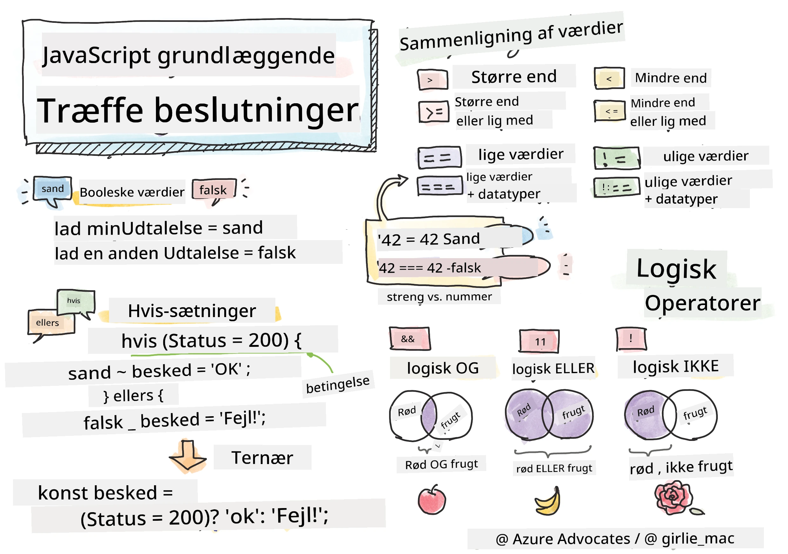

> Sketchnote af [Tomomi Imura](https://twitter.com/girlie_mac)

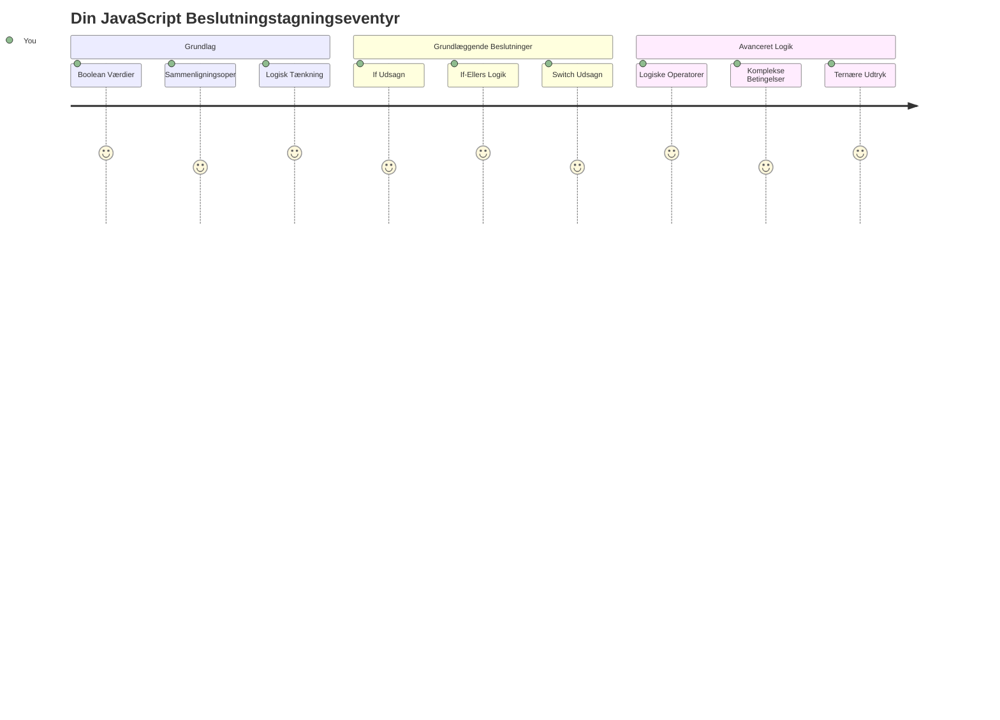
Har du nogensinde spekuleret på, hvordan applikationer træffer smarte beslutninger? Som hvordan et navigationssystem vælger den hurtigste rute, eller hvordan en termostat beslutter, hvornår varmen skal tændes? Dette er det grundlæggende koncept bag beslutningstagning i programmering.

Ligesom Charles Babbages Analytical Engine var designet til at følge forskellige sekvenser af operationer baseret på betingelser, skal moderne JavaScript-programmer træffe valg baseret på varierende omstændigheder. Denne evne til at forgrene sig og træffe beslutninger er, hvad der forvandler statisk kode til responsive, intelligente applikationer.

I denne lektion lærer du, hvordan du implementerer betinget logik i dine programmer. Vi vil udforske betingede udsagn, sammenligningsoperatorer og logiske udtryk, der giver din kode mulighed for at evaluere situationer og reagere passende.

## For-forelæsning quiz

[For-forelæsning quiz](https://ff-quizzes.netlify.app/web/quiz/11)

Evnen til at træffe beslutninger og styre programflow er en grundlæggende del af programmering. Dette afsnit dækker, hvordan du styrer udførelsesvejen for dine JavaScript-programmer ved hjælp af booleske værdier og betinget logik.

[](https://youtube.com/watch?v=SxTp8j-fMMY "Making Decisions")

> 🎥 Klik på billedet ovenfor for en video om at træffe beslutninger.

> Du kan tage denne lektion på [Microsoft Learn](https://docs.microsoft.com/learn/modules/web-development-101-if-else/?WT.mc_id=academic-77807-sagibbon)!

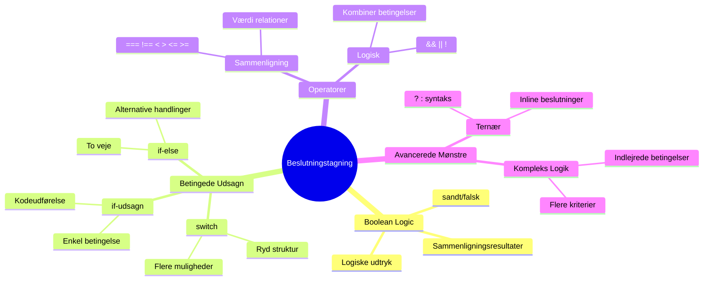
## En kort opsummering af Booleans

Før vi udforsker beslutningstagning, lad os genbesøge booleske værdier fra vores tidligere lektion. Navngivet efter matematikeren George Boole, repræsenterer disse værdier binære tilstande – enten `true` eller `false`. Der er ingen tvetydighed, intet midtpunkt.

Disse binære værdier danner fundamentet for al beregningslogik. Hver beslutning, dit program træffer, reduceres til sidst til en boolesk evaluering.

At oprette booleske variable er ligetil:

```javascript
let myTrueBool = true;
let myFalseBool = false;
```

Dette opretter to variable med eksplicitte booleske værdier.

✅ Booleans er opkaldt efter den engelske matematiker, filosof og logiker George Boole (1815–1864).

## Sammenligningsoperatorer og Booleans

I praksis vil du sjældent sætte booleske værdier manuelt. I stedet genererer du dem ved at evaluere betingelser: "Er dette tal større end det andet?" eller "Er disse værdier ens?"

Sammenligningsoperatorer muliggør disse evalueringer. De sammenligner værdier og returnerer booleske resultater baseret på forholdet mellem operanderne.

| Symbol | Beskrivelse                                                                                                                                                   | Eksempel           |
| ------ | ------------------------------------------------------------------------------------------------------------------------------------------------------------- | ------------------ |
| `<`    | **Mindre end**: Sammenligner to værdier og returnerer den booleske `true`, hvis værdien til venstre er mindre end værdien til højre                           | `5 < 6 // true`    |
| `<=`   | **Mindre end eller lig med**: Sammenligner to værdier og returnerer den booleske `true`, hvis værdien til venstre er mindre end eller lig med værdien til højre | `5 <= 6 // true`   |
| `>`    | **Større end**: Sammenligner to værdier og returnerer den booleske `true`, hvis værdien til venstre er større end værdien til højre                            | `5 > 6 // false`   |
| `>=`   | **Større end eller lig med**: Sammenligner to værdier og returnerer den booleske `true`, hvis værdien til venstre er større end eller lig med værdien til højre | `5 >= 6 // false`  |
| `===`  | **Streng lighed**: Sammenligner to værdier og returnerer den booleske `true`, hvis værdierne til højre og venstre er lige og af samme datatype                | `5 === 6 // false` |
| `!==`  | **Ulighed**: Sammenligner to værdier og returnerer det modsatte booleske resultat af, hvad en streng lighedsoperator ville returnere                          | `5 !== 6 // true`  |

✅ Test din viden ved at skrive nogle sammenligninger i din browsers konsol. Overrasker nogen af de returnerede værdier dig?

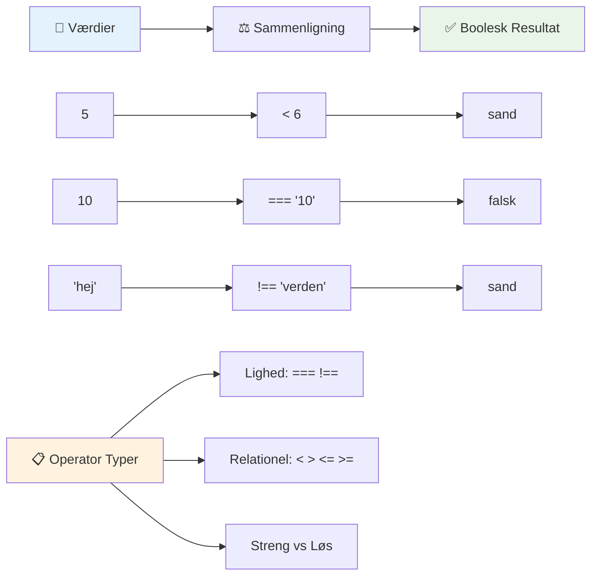
### 🧠 **Sammenligningsmesterskab: Forståelse af boolesk logik**

**Test din forståelse af sammenligninger:**
- Hvorfor tror du, at `===` (streng lighed) generelt foretrækkes frem for `==` (løs lighed)?
- Kan du forudsige, hvad `5 === '5'` returnerer? Hvad med `5 == '5'`?
- Hvad er forskellen mellem `!==` og `!=`?

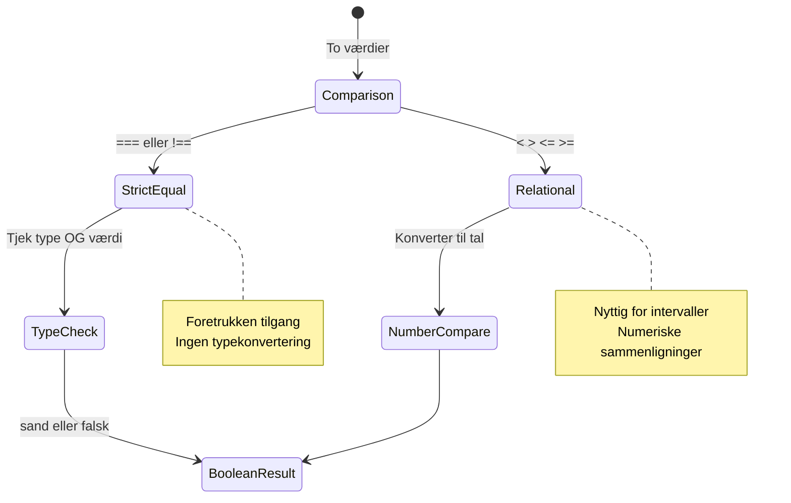
> **Pro tip**: Brug altid `===` og `!==` til lighedstjek, medmindre du specifikt har brug for typekonvertering. Dette forhindrer uventet adfærd!

## If-udsagn

`if`-udsagnet er som at stille et spørgsmål i din kode. "Hvis denne betingelse er sand, så gør dette." Det er sandsynligvis det vigtigste værktøj, du vil bruge til at træffe beslutninger i JavaScript.

Sådan fungerer det:

```javascript
if (condition) {
  // Betingelsen er sand. Koden i denne blok vil køre.
}
```

Betingelsen kommer inden i parenteserne, og hvis den er `true`, kører JavaScript koden inden i de krøllede parenteser. Hvis den er `false`, springer JavaScript hele blokken over.

Du vil ofte bruge sammenligningsoperatorer til at skabe disse betingelser. Lad os se et praktisk eksempel:

```javascript
let currentMoney = 1000;
let laptopPrice = 800;

if (currentMoney >= laptopPrice) {
  // Betingelsen er sand. Koden i denne blok vil blive kørt.
  console.log("Getting a new laptop!");
}
```

Da `1000 >= 800` evaluerer til `true`, kører koden inden i blokken og viser "Getting a new laptop!" i konsollen.

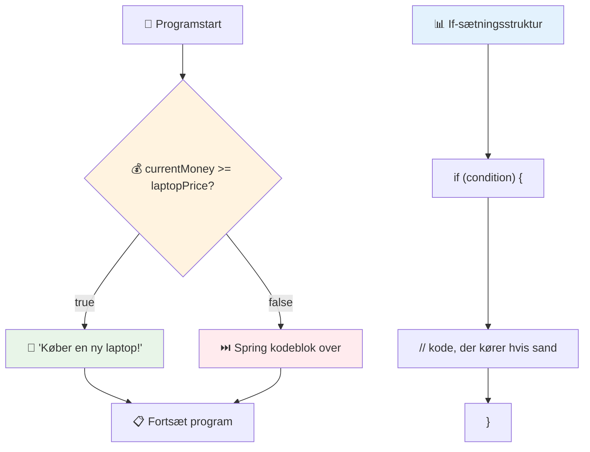
## If..Else-udsagn

Men hvad hvis du vil have dit program til at gøre noget andet, når betingelsen er falsk? Det er her, `else` kommer ind – det er som at have en backupplan.

`else`-udsagnet giver dig en måde at sige "hvis denne betingelse ikke er sand, så gør dette i stedet."

```javascript
let currentMoney = 500;
let laptopPrice = 800;

if (currentMoney >= laptopPrice) {
  // Betingelsen er sand. Koden i dette blok vil køre.
  console.log("Getting a new laptop!");
} else {
  // Betingelsen er falsk. Koden i dette blok vil køre.
  console.log("Can't afford a new laptop, yet!");
}
```

Nu da `500 >= 800` er `false`, springer JavaScript den første blok over og kører `else`-blokken i stedet. Du vil se "Can't afford a new laptop, yet!" i konsollen.

✅ Test din forståelse af denne kode og følgende kode ved at køre den i en browserkonsol. Ændr værdierne af variablerne currentMoney og laptopPrice for at ændre den returnerede `console.log()`.

### 🎯 **If-Else-logik Check: Forgreningsveje**

**Evaluer din forståelse af betinget logik:**
- Hvad sker der, hvis `currentMoney` præcis er lig med `laptopPrice`?
- Kan du komme i tanke om et scenarie fra den virkelige verden, hvor if-else-logik ville være nyttig?
- Hvordan kunne du udvide dette til at håndtere flere prisniveauer?

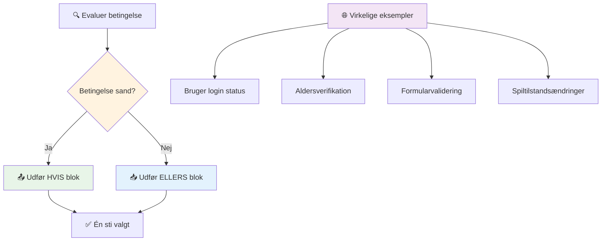
> **Nøgleindsigt**: If-else sikrer, at præcis én sti vælges. Det garanterer, at dit program altid har et svar på enhver betingelse!

## Switch-udsagn

Nogle gange skal du sammenligne én værdi med flere muligheder. Selvom du kunne kæde flere `if..else`-udsagn sammen, bliver denne tilgang hurtigt uhåndterlig. `switch`-udsagnet giver en renere struktur til at håndtere flere diskrete værdier.

Konceptet minder om de mekaniske koblingssystemer, der blev brugt i tidlige telefoncentraler – én inputværdi bestemmer, hvilken specifik vej udførelsen følger.

```javascript
switch (expression) {
  case x:
    // kodeblok
    break;
  case y:
    // kodeblok
    break;
  default:
    // kodeblok
}
```

Sådan er det struktureret:
- JavaScript evaluerer udtrykket én gang
- Den gennemgår hver `case` for at finde et match
- Når den finder et match, kører den den kodeblok
- `break` fortæller JavaScript at stoppe og forlade switch
- Hvis ingen cases matcher, kører den `default`-blokken (hvis du har en)

```javascript
// Program ved hjælp af switch-sætning for ugedag
let dayNumber = 2;
let dayName;

switch (dayNumber) {
  case 1:
    dayName = "Monday";
    break;
  case 2:
    dayName = "Tuesday";
    break;
  case 3:
    dayName = "Wednesday";
    break;
  default:
    dayName = "Unknown day";
    break;
}
console.log(`Today is ${dayName}`);
```

I dette eksempel ser JavaScript, at `dayNumber` er `2`, finder det matchende `case 2`, sætter `dayName` til "Tuesday" og bryder derefter ud af switch. Resultatet? "Today is Tuesday" bliver logget til konsollen.

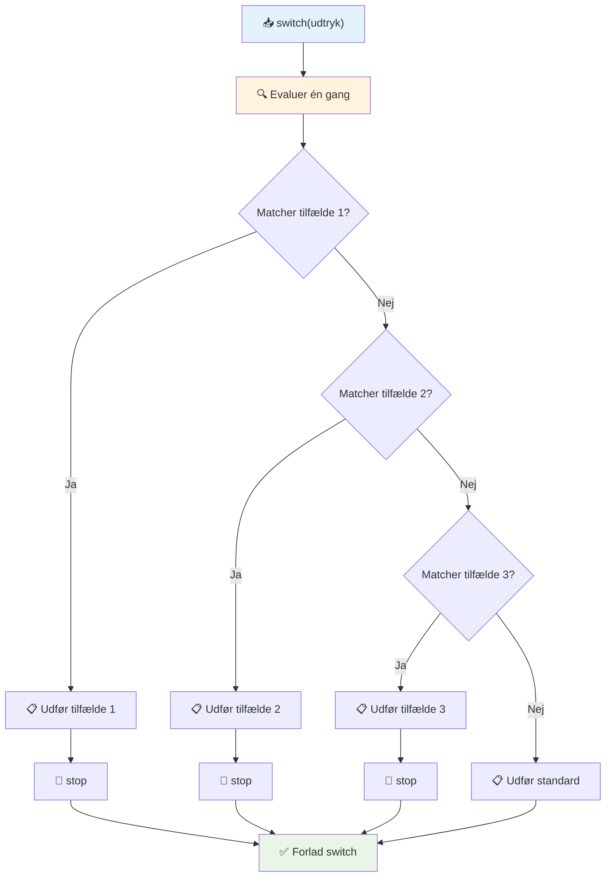
✅ Test din forståelse af denne kode og følgende kode ved at køre dem i en browserkonsol. Ændr værdien af variablen a for at ændre det returnerede `console.log()`.

### 🔄 **Switch-udsagnsmesterskab: Flere muligheder**

**Test din forståelse af switch:**
- Hvad sker der, hvis du glemmer et `break`-udsagn?
- Hvornår bruger du `switch` i stedet for flere `if-else`-udsagn?
- Hvorfor er `default`-casen nyttig, selvom du tror, du har dækket alle muligheder?

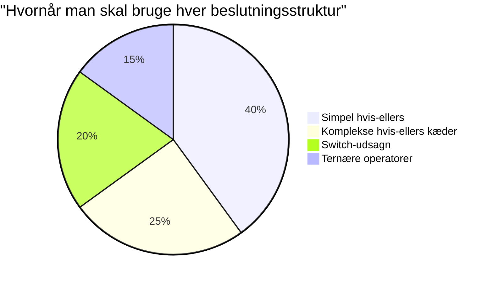
> **Bedste praksis**: Brug `switch`, når du sammenligner én variabel med flere specifikke værdier. Brug `if-else` til intervalkontrol eller komplekse betingelser!

## Logiske operatorer og Booleans

Komplekse beslutninger kræver ofte, at flere betingelser evalueres samtidigt. Ligesom boolsk algebra giver matematikere mulighed for at kombinere logiske udtryk, giver programmering logiske operatorer til at forbinde flere booleske betingelser.

Disse operatorer muliggør sofistikeret betinget logik ved at kombinere simple sande/falske evalueringer.

| Symbol | Beskrivelse                                                                                     | Eksempel                                                                 |
| ------ | ----------------------------------------------------------------------------------------------- | ----------------------------------------------------------------------- |
| `&&`   | **Logisk OG**: Sammenligner to booleske udtryk. Returnerer sandt **kun** hvis begge sider er sande | `(5 > 3) && (5 < 10) // Begge sider er sande. Returnerer true`          |
| `\|\|` | **Logisk ELLER**: Sammenligner to booleske udtryk. Returnerer sandt, hvis mindst den ene side er sand | `(5 > 10) \|\| (5 < 10) // Den ene side er falsk, den anden sand. Returnerer true` |
| `!`    | **Logisk IKKE**: Returnerer det modsatte af et boolesk udtryk                                 | `!(5 > 10) // 5 er ikke større end 10, så "!" gør det sandt`            |

Disse operatorer lader dig kombinere betingelser på nyttige måder:
- OG (`&&`) betyder, at begge betingelser skal være sande
- ELLER (`||`) betyder, at mindst én betingelse skal være sand  
- IKKE (`!`) vender sandt til falsk (og omvendt)

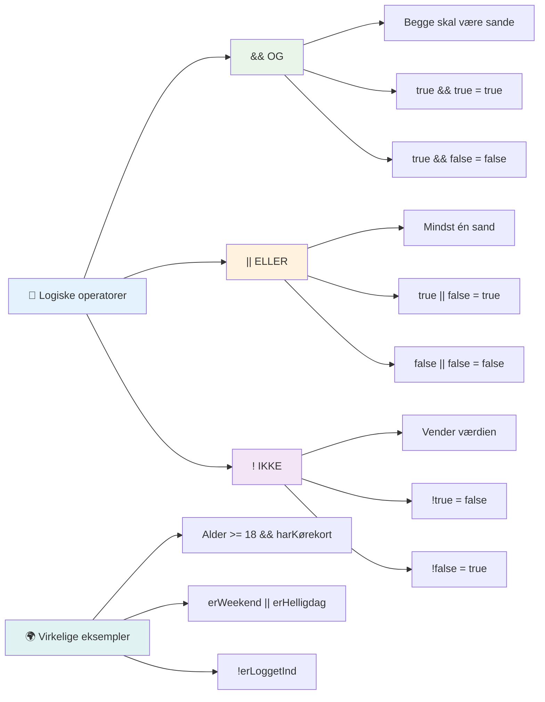
## Betingelser og beslutninger med logiske operatorer

Lad os se disse logiske operatorer i aktion med et mere realistisk eksempel:

```javascript
let currentMoney = 600;
let laptopPrice = 800;
let laptopDiscountPrice = laptopPrice - (laptopPrice * 0.2); // Laptoppris med 20 procent rabat

if (currentMoney >= laptopPrice || currentMoney >= laptopDiscountPrice) {
  // Tilstanden er sand. Koden i denne blok vil køre.
  console.log("Getting a new laptop!");
} else {
  // Tilstanden er falsk. Koden i denne blok vil køre.
  console.log("Can't afford a new laptop, yet!");
}
```

I dette eksempel: beregner vi en 20% rabatpris (640), og evaluerer derefter, om vores tilgængelige midler dækker enten fuld pris ELLER rabatprisen. Da 600 opfylder rabatprisens tærskel på 640, evalueres betingelsen til sand.

### 🧮 **Logiske operatorer Check: Kombinere betingelser**

**Test din forståelse af logiske operatorer:**
- I udtrykket `A && B`, hvad sker der, hvis A er falsk? Bliver B overhovedet evalueret?
- Kan du tænke på en situation, hvor du ville bruge alle tre operatorer (&&, ||, !) sammen?
- Hvad er forskellen på `!user.isActive` og `user.isActive !== true`?

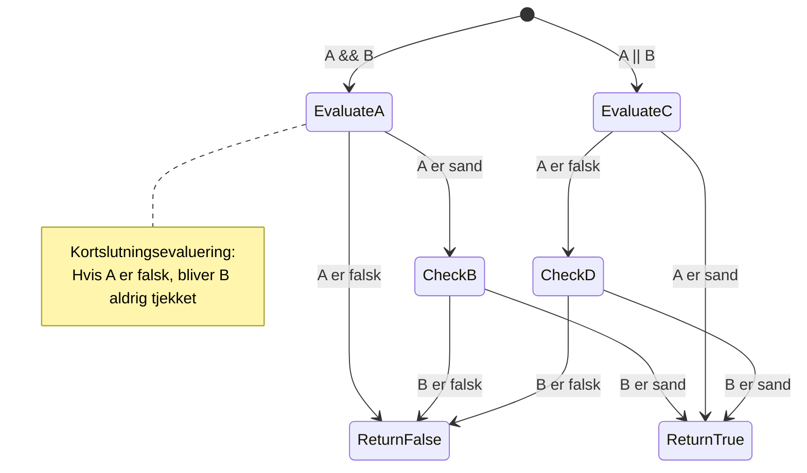
> **Performance tip**: JavaScript bruger "short-circuit evaluation" – i `A && B`, hvis A er falsk, bliver B slet ikke evalueret. Brug dette til din fordel!

### Negationsoperator

Nogle gange er det lettere at tænke i, hvornår noget IKKE er sandt. Som i stedet for at spørge "Er brugeren logget ind?", vil du måske spørge "Er brugeren IKKE logget ind?" Udråbstegnsoperatoren (`!`) vender logikken for dig.

```javascript
if (!condition) {
  // kører hvis betingelsen er falsk
} else {
  // kører hvis betingelsen er sand
}
```

`!`-operatoren er som at sige "det modsatte af..." – hvis noget er `true`, gør `!` det til `false`, og omvendt.

### Ternære udtryk

Til simple betingede tildelinger tilbyder JavaScript **ternæroperatoren**. Denne korte syntaks tillader dig at skrive et betinget udtryk på én linje, nyttigt når du skal tildele én af to værdier baseret på en betingelse.

```javascript
let variable = condition ? returnThisIfTrue : returnThisIfFalse;
```

Det læses som et spørgsmål: "Er denne betingelse sand? Hvis ja, brug denne værdi. Hvis nej, brug den værdi."

Nedenfor er et mere håndgribeligt eksempel:

```javascript
let firstNumber = 20;
let secondNumber = 10;
let biggestNumber = firstNumber > secondNumber ? firstNumber : secondNumber;
```

✅ Tag et øjeblik til at læse denne kode et par gange. Forstår du, hvordan disse operatorer virker?

Denne linje siger: "Er `firstNumber` større end `secondNumber`? Hvis ja, sæt `firstNumber` i `biggestNumber`. Hvis nej, sæt `secondNumber` i `biggestNumber`."

Den ternære operator er bare en kortere måde at skrive det traditionelle `if..else`-udsagn på:

```javascript
let biggestNumber;
if (firstNumber > secondNumber) {
  biggestNumber = firstNumber;
} else {
  biggestNumber = secondNumber;
}
```

Begge tilgange giver identiske resultater. Den ternære operator tilbyder kortfattethed, mens den traditionelle if-else-struktur kan være mere læsbar ved komplekse betingelser.

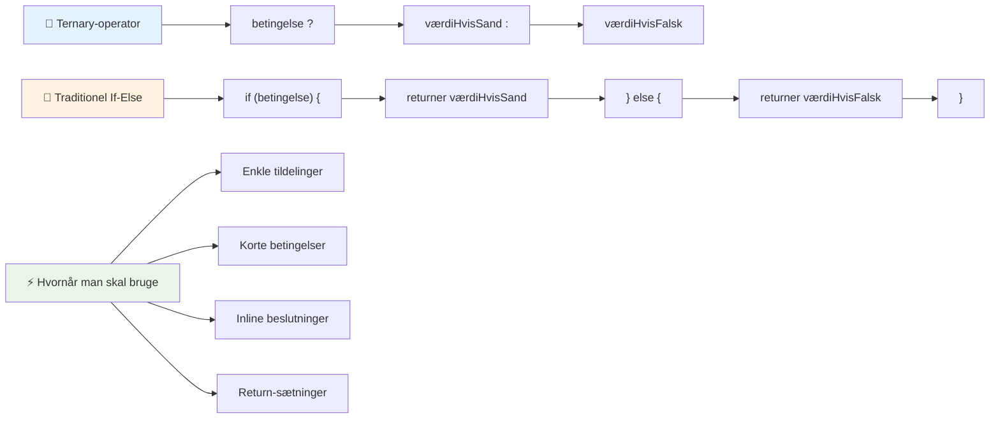
---


## 🚀 Udfordring

Lav et program, der først er skrevet med logiske operatorer, og omskriv det derefter ved brug af et ternært udtryk. Hvad foretrækker du som syntaks?

---

## GitHub Copilot Agent Udfordring 🚀

Brug Agent-tilstand til at løse følgende udfordring:

**Beskrivelse:** Opret en omfattende karakterberegner, som demonstrerer flere beslutningstagningselementer fra denne lektion, inklusive if-else-udsagn, switch-udsagn, logiske operatorer og ternære udtryk.

**Prompt:** Skriv et JavaScript-program, der tager en elevs numeriske score (0-100) og bestemmer den tilsvarende karakter efter følgende kriterier:
- A: 90-100
- B: 80-89  
- C: 70-79
- D: 60-69
- F: Under 60

Krav:
1. Brug et if-else-udsagn til at bestemme karakteren
2. Brug logiske operatorer til at tjekke, om den studerende består (karakter >= 60) OG har udmærkelse (karakter >= 90)  
3. Brug en switch-sætning til at give specifik feedback for hver bogstavkarakter  
4. Brug en ternær operator til at afgøre, om den studerende er berettiget til næste kursus (karakter >= 70)  
5. Inkluder inputvalidering for at sikre, at scoren er mellem 0 og 100  

Test dit program med forskellige scores, inklusive grænsetilfælde som 59, 60, 89, 90 og ugyldige input.  

Lær mere om [agent mode](https://code.visualstudio.com/blogs/2025/02/24/introducing-copilot-agent-mode) her.  


## Post-Lecture Quiz  

[Post-lecture quiz](https://ff-quizzes.netlify.app/web/quiz/12)  

## Review & Self Study  

Læs mere om de mange tilgængelige operatorer for brugeren [på MDN](https://developer.mozilla.org/docs/Web/JavaScript/Reference/Operators).  

Gå igennem Josh Comeaus vidunderlige [operator lookup](https://joshwcomeau.com/operator-lookup/)!  

## Assignment  

[Operators](assignment.md)  

---  

## 🧠 **Din beslutningstagning værktøjskasse - Resumé**  

```mermaid
graph TD
    A["🎯 JavaScript Beslutninger"] --> B["🔍 Boolean Logik"]
    A --> C["📊 Betingede Udsagn"]
    A --> D["🔗 Logiske Operatorer"]
    A --> E["⚡ Avancerede Mønstre"]
    
    B --> B1["true/false værdier"]
    B --> B2["Sammenligningsoperatorer"]
    B --> B3["Sandhedsbegreber"]
    
    C --> C1["if udsagn"]
    C --> C2["if-else kæder"]
    C --> C3["switch udsagn"]
    
    D --> D1["&& (OG)"]
    D --> D2["|| (ELLER)"]
    D --> D3["! (IKKE)"]
    
    E --> E1["Ternær operator"]
    E --> E2["Kortslutningsvurdering"]
    E --> E3["Komplekse betingelser"]
    
    F["💡 Nøgleprincipper"] --> F1["Klare læselige betingelser"]
    F --> F2["Konsistent sammenligningsstil"]
    F --> F3["Korrekt operatorpræcedens"]
    F --> F4["Effektiv vurderingsrækkefølge"]
    
    style A fill:#e3f2fd
    style B fill:#e8f5e8
    style C fill:#fff3e0
    style D fill:#f3e5f5
    style E fill:#e0f2f1
    style F fill:#fce4ec
```  
---  

## 🚀 Din JavaScript beslutningstagning mesterskab tidslinje  

### ⚡ **Hvad du kan gøre de næste 5 minutter**  
- [ ] Øv sammenligningsoperatorer i din browserkonsol  
- [ ] Skriv en simpel if-else sætning, der tjekker din alder  
- [ ] Prøv udfordringen: omskriv en if-else med en ternær operator  
- [ ] Test hvad der sker med forskellige "truthy" og "falsy" værdier  

### 🎯 **Hvad du kan opnå denne time**  
- [ ] Fuldfør post-lektion quizzen og gennemgå forvirrende koncepter  
- [ ] Byg den omfattende karakterberegner fra GitHub Copilot-udfordringen  
- [ ] Skab et simpelt beslutningstræ til et virkeligt scenarie (som at vælge hvad du skal have på)  
- [ ] Øv dig i at kombinere flere betingelser med logiske operatorer  
- [ ] Eksperimentér med switch-sætninger til forskellige brugstilfælde  

### 📅 **Din uge-lange logik-mesterskab**  
- [ ] Fuldfør operators-opgaven med kreative eksempler  
- [ ] Byg en mini quiz-applikation med forskellige betingede strukturer  
- [ ] Skab en formularvalidator, der tjekker flere inputbetingelser  
- [ ] Øv Josh Comeaus [operator lookup](https://joshwcomeau.com/operator-lookup/) øvelser  
- [ ] Refaktor eksisterende kode til at bruge mere passende betingede strukturer  
- [ ] Studér short-circuit evaluering og performance-implikationer  

### 🌟 **Din månedslange transformation**  
- [ ] Mestre komplekse indlejrede betingelser og bevare kode-læselighed  
- [ ] Byg en applikation med sofistikeret beslutningstagning logik  
- [ ] Bidrag til open source ved at forbedre betinget logik i eksisterende projekter  
- [ ] Lær en anden om forskellige betingede strukturer og hvornår hver skal bruges  
- [ ] Udforsk funktionelle programmeringsmetoder til betinget logik  
- [ ] Skab en personlig referenceguide for bedste praksis i betingelser  

### 🏆 **Endelig beslutningstagning mester Check-in**  

**Fejr dit logiske tankemesterværk:**  
- Hvad er den mest komplekse beslutningslogik, du med succes har implementeret?  
- Hvilken betinget struktur føles mest naturlig for dig og hvorfor?  
- Hvordan har det at lære om logiske operatorer ændret din problemløsnings-tilgang?  
- Hvilken virkelighedsbaseret applikation ville have fordel af sofistikeret beslutningstagning logik?  

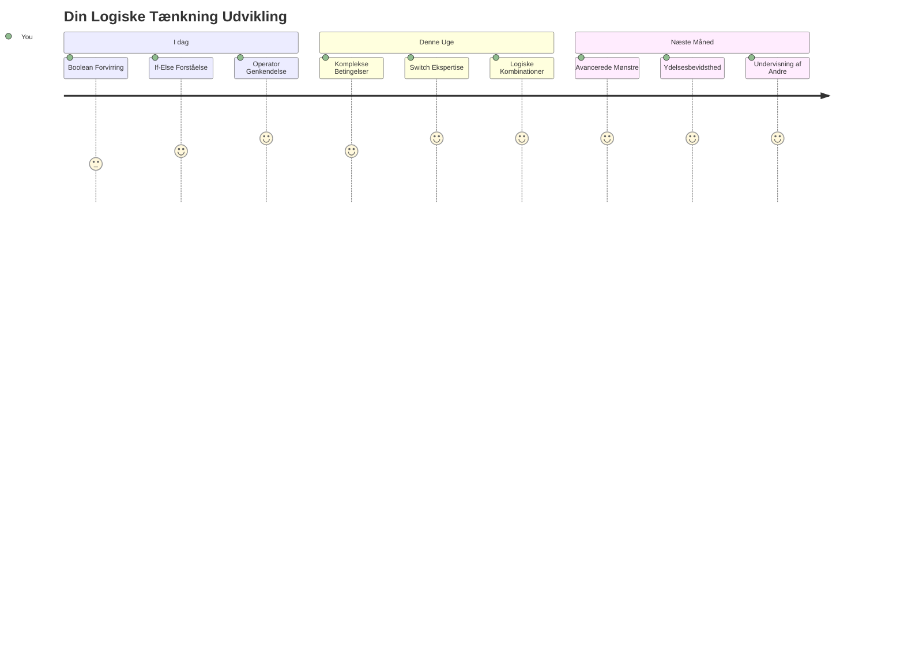
> 🧠 **Du har mestret kunsten i digital beslutningstagning!** Enhver interaktiv applikation er afhængig af betinget logik for intelligent at kunne reagere på brugerhandlinger og skiftende betingelser. Du forstår nu, hvordan du får dine programmer til at tænke, evaluere og vælge passende svar. Dette logiske fundament vil drive enhver dynamisk applikation, du bygger! 🎉

---

<!-- CO-OP TRANSLATOR DISCLAIMER START -->
**Ansvarsfraskrivelse**:
Dette dokument er blevet oversat ved hjælp af AI-oversættelsestjenesten [Co-op Translator](https://github.com/Azure/co-op-translator). Selvom vi bestræber os på nøjagtighed, bedes du være opmærksom på, at automatiserede oversættelser kan indeholde fejl eller unøjagtigheder. Det oprindelige dokument på dets modersmål bør betragtes som den autoritative kilde. Ved kritisk information anbefales professionel menneskelig oversættelse. Vi påtager os intet ansvar for misforståelser eller fejltolkninger, der opstår som følge af brugen af denne oversættelse.
<!-- CO-OP TRANSLATOR DISCLAIMER END -->