# JavaScript Basics: Arrays and Loops

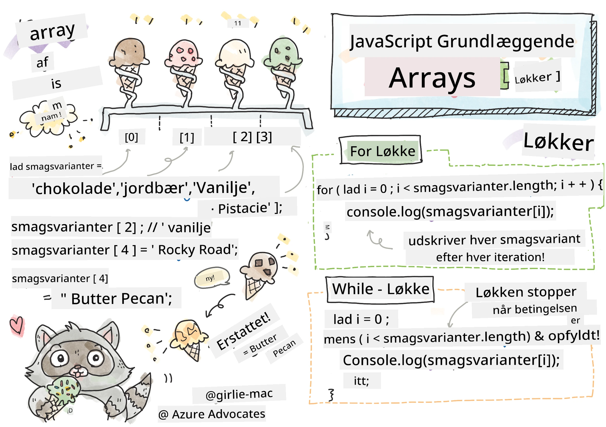
> Sketchnote af [Tomomi Imura](https://twitter.com/girlie_mac)

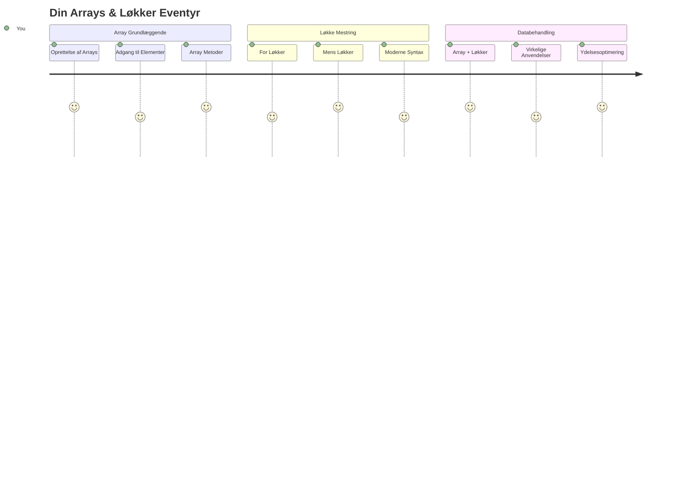
## Pre-Lecture Quiz
[Pre-lecture quiz](https://ff-quizzes.netlify.app/web/quiz/13)

Har du nogensinde spekuleret på, hvordan hjemmesider holder styr på varer i indkøbskurven eller viser din venneoversigt? Det er her arrays og løkker kommer ind i billedet. Arrays er som digitale beholdere, der rummer flere stykker information, mens løkker giver dig mulighed for at arbejde med alle disse data effektivt uden gentagende kode.

Sammen danner disse to begreber fundamentet for håndtering af information i dine programmer. Du vil lære at bevæge dig fra manuelt at skrive hvert enkelt trin til at skabe smart, effektiv kode, der hurtigt kan behandle hundredvis eller endda tusindvis af elementer.

Ved slutningen af denne lektion vil du forstå, hvordan du kan udføre komplekse databehandlingsopgaver med bare få linjer kode. Lad os udforske disse essentielle programmeringskoncepter.

[](https://youtube.com/watch?v=1U4qTyq02Xw "Arrays")

[](https://www.youtube.com/watch?v=Eeh7pxtTZ3k "Loops")

> 🎥 Klik på billederne ovenfor for videoer om arrays og løkker.

> Du kan tage denne lektion på [Microsoft Learn](https://docs.microsoft.com/learn/modules/web-development-101-arrays/?WT.mc_id=academic-77807-sagibbon)!

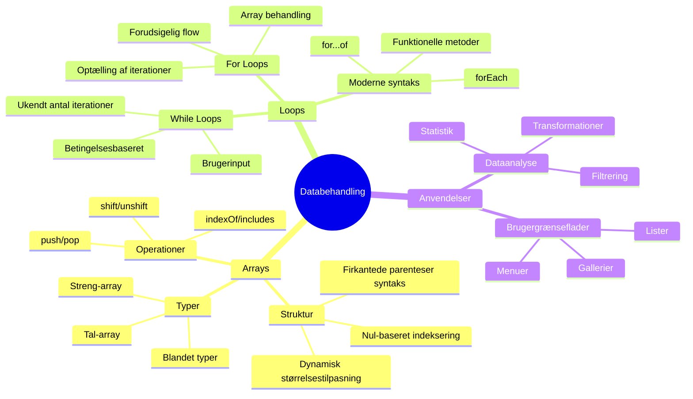
## Arrays

Tænk på arrays som et digitalt arkivskab – i stedet for at opbevare ét dokument pr. skuffe, kan du organisere flere relaterede elementer i en enkelt, struktureret beholder. I programmering giver arrays dig mulighed for at gemme flere stykker information i én organiseret pakke.

Uanset om du bygger et fotogalleri, administrerer en opgaveliste eller holder styr på high scores i et spil, giver arrays fundamentet for dataorganisering. Lad os se, hvordan de fungerer.

✅ Arrays er overalt omkring os! Kan du tænke på et eksempel fra virkeligheden på et array, som f.eks. et solcellepanel-array?

### Oprettelse af Arrays

At oprette et array er super nemt – brug bare firkantede parenteser!

```javascript
// Tomt array - som en tom indkøbskurv, der venter på varer
const myArray = [];
```

**Hvad sker der her?**
Du har lige oprettet en tom beholder ved hjælp af de firkantede parenteser `[]`. Tænk på det som en tom bibliotekshylde – den er klar til at indeholde de bøger, du vil organisere der.

Du kan også udfylde dit array med startværdier med det samme:

```javascript
// Din isbutiks smagsmenu
const iceCreamFlavors = ["Chocolate", "Strawberry", "Vanilla", "Pistachio", "Rocky Road"];

// En brugers profilinfo (blandende forskellige typer data)
const userData = ["John", 25, true, "developer"];

// Testresultater for din yndlingsklasse
const scores = [95, 87, 92, 78, 85];
```

**Seje ting at bemærke:**
- Du kan gemme tekst, tal eller endda sand/falsk-værdier i samme array
- Bare adskil hvert element med et komma – nemt!
- Arrays er perfekte til at holde relaterede oplysninger samlet

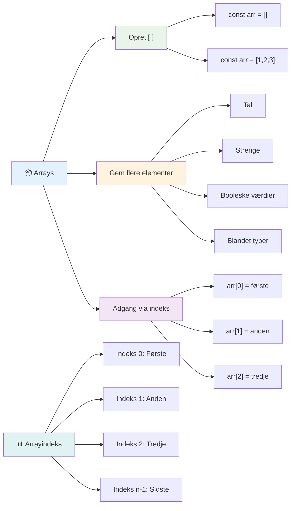
### Array-indeksering

Her er noget, der kan virke usædvanligt i starten: arrays nummererer deres elementer begyndende fra 0, ikke 1. Denne nul-baserede indeksering stammer fra, hvordan computerhukommelse fungerer – det har været en programmeringskonvention siden de tidlige dage med programmeringssprog som C. Hver plads i arrayet får sit eget adressenummer kaldet et **indeks**.

| Indeks | Værdi | Beskrivelse |
|--------|--------|-------------|
| 0      | "Chokolade" | Første element |
| 1      | "Jordbær" | Andet element |
| 2      | "Vanilje" | Tredje element |
| 3      | "Pistacie" | Fjerde element |
| 4      | "Rocky Road" | Femte element |

✅ Overrasker det dig, at arrays starter ved nul-indekset? I nogle programmeringssprog starter indekser ved 1. Der er en interessant historie omkring dette, som du kan [læse om på Wikipedia](https://en.wikipedia.org/wiki/Zero-based_numbering).

**Tilgang til array-elementer:**

```javascript
const iceCreamFlavors = ["Chocolate", "Strawberry", "Vanilla", "Pistachio", "Rocky Road"];

// Få adgang til individuelle elementer ved hjælp af kantede parenteser
console.log(iceCreamFlavors[0]); // "Chokolade" - første element
console.log(iceCreamFlavors[2]); // "Vanilje" - tredje element
console.log(iceCreamFlavors[4]); // "Rocky Road" - sidste element
```

**Nedbrydning af, hvad der sker her:**
- **Bruger** firkantet parentesnotation med indeksnummer for at få adgang til elementer
- **Returnerer** værdien, der er gemt på den specifikke position i arrayet
- **Begynder** tælling fra 0, hvilket gør det første element til indeks 0

**Ændring af array-elementer:**

```javascript
// Ændr en eksisterende værdi
iceCreamFlavors[4] = "Butter Pecan";
console.log(iceCreamFlavors[4]); // "Butter Pecan"

// Tilføj et nyt element i slutningen
iceCreamFlavors[5] = "Cookie Dough";
console.log(iceCreamFlavors[5]); // "Cookie Dough"
```

**I ovenstående har vi:**
- **Ændret** elementet ved indeks 4 fra "Rocky Road" til "Butter Pecan"
- **Tilføjet** et nyt element "Cookie Dough" ved indeks 5
- **Udvidet** arrayets længde automatisk, når der tilføjes ud over de nuværende grænser

### Array-længde og almindelige metoder

Arrays kommer med indbyggede egenskaber og metoder, der gør det meget nemmere at arbejde med data.

**Find array-længde:**

```javascript
const iceCreamFlavors = ["Chocolate", "Strawberry", "Vanilla", "Pistachio", "Rocky Road"];
console.log(iceCreamFlavors.length); // 5

// Længde opdateres automatisk efterhånden som arrayet ændres
iceCreamFlavors.push("Mint Chip");
console.log(iceCreamFlavors.length); // 6
```

**Vigtige ting at huske:**
- **Returnerer** det samlede antal elementer i arrayet
- **Opdateres** automatisk, når elementer tilføjes eller fjernes
- **Giver** en dynamisk optælling, der er nyttig til løkker og validering

**Væsentlige array-metoder:**

```javascript
const fruits = ["apple", "banana", "orange"];

// Tilføj elementer
fruits.push("grape");           // Tilføjer til slut: ["apple", "banana", "orange", "grape"]
fruits.unshift("strawberry");   // Tilføjer til begyndelsen: ["strawberry", "apple", "banana", "orange", "grape"]

// Fjern elementer
const lastFruit = fruits.pop();        // Fjerner og returnerer "grape"
const firstFruit = fruits.shift();     // Fjerner og returnerer "strawberry"

// Find elementer
const index = fruits.indexOf("banana"); // Returnerer 1 (positionen af "banana")
const hasApple = fruits.includes("apple"); // Returnerer sandt
```

**Forstå disse metoder:**
- **Tilføjer** elementer med `push()` (til slutningen) og `unshift()` (til begyndelsen)
- **Fjerner** elementer med `pop()` (fra slutningen) og `shift()` (fra begyndelsen)
- **Finder** elementer med `indexOf()` og tjekker eksistens med `includes()`
- **Returnerer** nyttige værdier som fjernede elementer eller positionsindekser

✅ Prøv det selv! Brug din browsers konsol til at oprette og manipulere dit eget array.

### 🧠 **Grundlæggende om Arrays: Organisering af dine data**

**Test din forståelse af arrays:**
- Hvorfor tror du, arrays tæller fra 0 i stedet for 1?
- Hvad sker der, hvis du prøver at tilgå et indeks, der ikke findes (som `arr[100]` i et 5-element array)?
- Kan du tænke på tre virkelige situationer, hvor arrays ville være nyttige?

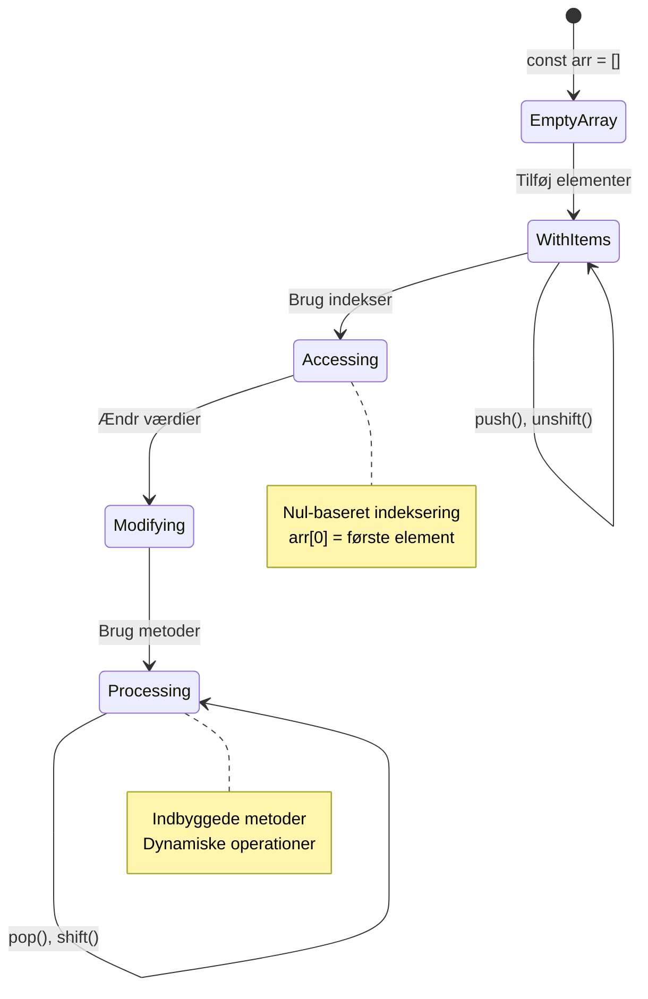
> **Virkelighedsindsigt**: Arrays er overalt i programmering! Sociale medier feeds, indkøbskurve, fotogallerier, spillelister – de er alle arrays bag scenen!

## Løkker

Tænk på den berømte straf i Charles Dickens’ romaner, hvor elever skulle skrive linjer gentagne gange på en tavle. Forestil dig, at du kunne instruere nogen bare at "skriv denne sætning 100 gange" og få det gjort automatisk. Det er præcis, hvad løkker gør for din kode.

Løkker er som at have en utrættelig assistent, der kan gentage opgaver uden fejl. Uanset om du skal tjekke hver vare i en indkøbskurv eller vise alle billeder i et album, håndterer løkker gentagelsen effektivt.

JavaScript tilbyder flere typer løkker at vælge imellem. Lad os undersøge hver enkelt og forstå, hvornår de skal bruges.

```mermaid
flowchart TD
    A["🔄 Looptyper"] --> B["For-løkke"]
    A --> C["While-løkke"]
    A --> D["For...of-løkke"]
    A --> E["forEach-metoden"]
    
    B --> B1["Kendte iterationer"]
    B --> B2["Tæller-baseret"]
    B --> B3["for(init; betingelse; inkrement)"]
    
    C --> C1["Ukendte iterationer"]
    C --> C2["Betingelses-baseret"]
    C --> C3["while(betingelse)"]
    
    D --> D1["Moderne ES6+"]
    D --> D2["Array-iteration"]
    D --> D3["for(item af array)"]
    
    E --> E1["Funktionel stil"]
    E --> E2["Array-metode"]
    E --> E3["array.forEach(callback)"]
    
    F["⏰ Hvornår man bruger"] --> F1["For: Tælling, indekser"]
    F --> F2["While: Brugerinput, søgning"]
    F --> F3["For...of: Simpel iteration"]
    F --> F4["forEach: Funktionel programmering"]
    
    style A fill:#e3f2fd
    style B fill:#e8f5e8
    style C fill:#fff3e0
    style D fill:#f3e5f5
    style E fill:#e0f2f1
    style F fill:#fce4ec
```
### For Løkke

`for`-løkke er som at sætte et ur – du ved præcis, hvor mange gange du vil have noget til at ske. Den er super organiseret og forudsigelig, hvilket gør den perfekt, når du arbejder med arrays eller har brug for at tælle ting.

**Struktur for For Løkke:**

| Komponent | Formål | Eksempel |
|-----------|---------|----------|
| **Initialisering** | Sætter startpunkt | `let i = 0` |
| **Betingelse** | Hvornår den fortsætter | `i < 10` |
| **Inkrement** | Hvordan den opdateres | `i++` |

```javascript
// Tæller fra 0 til 9
for (let i = 0; i < 10; i++) {
  console.log(`Count: ${i}`);
}

// Mere praktisk eksempel: behandling af scores
const testScores = [85, 92, 78, 96, 88];
for (let i = 0; i < testScores.length; i++) {
  console.log(`Student ${i + 1}: ${testScores[i]}%`);
}
```

**Trin for trin, hvad der sker:**
- **Initialiserer** tællervariablen `i` til 0 i starten
- **Tjekker** betingelsen `i < 10` før hver gennemkørsel
- **Udfører** kodeblokken, når betingelsen er sand
- **Forøger** `i` med 1 efter hver gennemkørsel med `i++`
- **Stopper** når betingelsen bliver falsk (når `i` når 10)

✅ Kør denne kode i en browserkonsol. Hvad sker der, hvis du laver små ændringer i tælleren, betingelsen eller inkrement-udtrykket? Kan du få den til at køre baglæns og lave en nedtælling?

### 🗓️ **For Løkke Færdighedstest: Kontrolleret Gentagelse**

**Vurdér din forståelse af for-løkken:**
- Hvad er de tre dele af en for-løkke, og hvad gør hver del?
- Hvordan ville du løbe gennem et array baglæns?
- Hvad sker der, hvis du glemmer inkrement-delen (`i++`)?

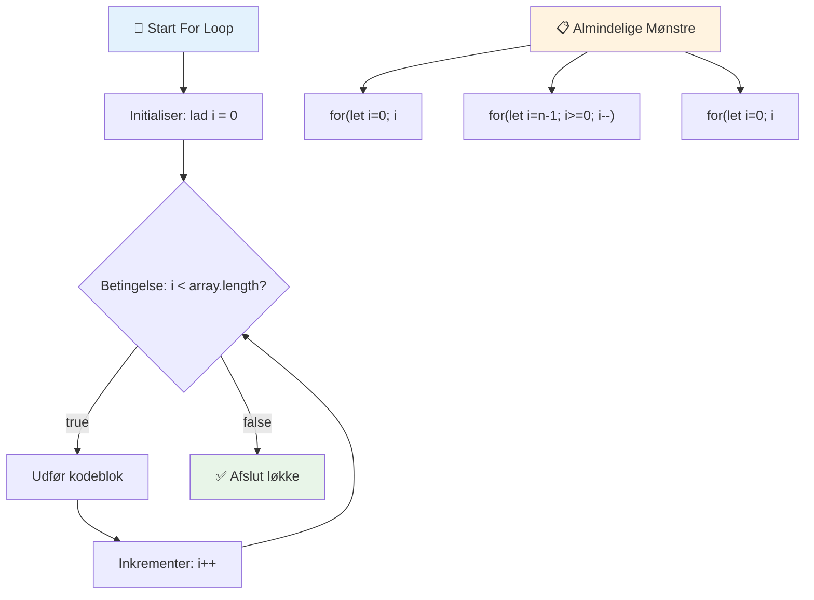
> **Loop-indsigt**: For-løkker er perfekte, når du ved præcis, hvor mange gange noget skal gentages. De er det mest almindelige valg til behandling af arrays!

### While Løkke

`while`-løkke er som at sige "bliv ved med at gøre dette indtil..." – du ved måske ikke præcist, hvor mange gange den kører, men du ved, hvornår den skal stoppe. Den er perfekt til ting som at bede en bruger om input, indtil de giver det, du har brug for, eller søge gennem data, indtil du finder det, du leder efter.

**Karakteristika for While Løkke:**
- **Fortsætter** med at køre så længe betingelsen er sand
- **Kræver** manuel styring af eventuelle tællervariabler
- **Tjekker** betingelsen før hver iteration
- **Risikerer** uendelige løkker, hvis betingelsen aldrig bliver falsk

```javascript
// Grundlæggende tælleeksempel
let i = 0;
while (i < 10) {
  console.log(`While count: ${i}`);
  i++; // Glem ikke at øge!
}

// Mere praktisk eksempel: behandling af brugerinput
let userInput = "";
let attempts = 0;
const maxAttempts = 3;

while (userInput !== "quit" && attempts < maxAttempts) {
  userInput = prompt(`Enter 'quit' to exit (attempt ${attempts + 1}):`);
  attempts++;
}

if (attempts >= maxAttempts) {
  console.log("Maximum attempts reached!");
}
```

**Forstå disse eksempler:**
- **Håndterer** tællervariablen `i` manuelt inde i løkkens krop
- **Forøger** tælleren for at forhindre uendelige løkker
- **Demonstrerer** praktisk brug med brugerinput og forsøg-begrænsning
- **Inkluderer** sikkerhedsforanstaltninger for at forhindre uendelig udførelse

### ♾️ **While Løkke Visdomstest: Betingelsesbaseret Gentagelse**

**Test din forståelse af while-løkker:**
- Hvad er hovedfaren ved at bruge while-løkker?
- Hvornår ville du vælge en while-løkke frem for en for-løkke?
- Hvordan kan du forhindre uendelige løkker?

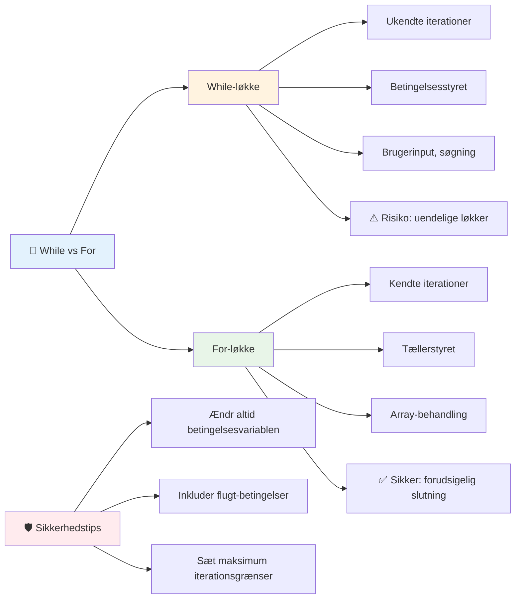
> **Sikkerhed først**: While-løkker er kraftfulde, men kræver omhyggelig betingelsesstyring. Sørg altid for, at din løkkebetingelse til sidst bliver falsk!

### Moderne Loop-alternativer

JavaScript tilbyder moderne løkkesyntakser, der kan gøre din kode mere læsbar og mindre fejlbehæftet.

**For...of Løkke (ES6+):**

```javascript
const colors = ["red", "green", "blue", "yellow"];

// Moderne tilgang - renere og sikrere
for (const color of colors) {
  console.log(`Color: ${color}`);
}

// Sammenlign med traditionel for-løkke
for (let i = 0; i < colors.length; i++) {
  console.log(`Color: ${colors[i]}`);
}
```

**Vigtige fordele ved for...of:**
- **Eliminerer** indekshåndtering og potentielle off-by-one fejl
- **Giver** direkte adgang til array-elementer
- **Forbedrer** kode-læsbarhed og reducerer syntaks-kompleksitet

**forEach Metode:**

```javascript
const prices = [9.99, 15.50, 22.75, 8.25];

// Brug af forEach til funktionel programmeringsstil
prices.forEach((price, index) => {
  console.log(`Item ${index + 1}: $${price.toFixed(2)}`);
});

// forEach med pilefunktioner til simple operationer
prices.forEach(price => console.log(`Price: $${price}`));
```

**Det du skal vide om forEach:**
- **Udfører** en funktion for hvert array-element
- **Giver** både elementværdien og indekset som parametre
- **Kan ikke** afbrydes tidligt (i modsætning til traditionelle løkker)
- **Returnerer** undefined (opretter ikke et nyt array)

✅ Hvorfor ville du vælge en for-løkke fremfor en while-løkke? 17K seere havde det samme spørgsmål på StackOverflow, og nogle af meningene [kan være interessante for dig](https://stackoverflow.com/questions/39969145/while-loops-vs-for-loops-in-javascript).

### 🎨 **Moderne Løkkesyntaks Test: Omfavn ES6+**

**Vurder din moderne JavaScript-forståelse:**
- Hvad er fordelene ved `for...of` i forhold til traditionelle for-løkker?
- Hvornår ville du stadig foretrække traditionelle for-løkker?
- Hvad er forskellen mellem `forEach` og `map`?

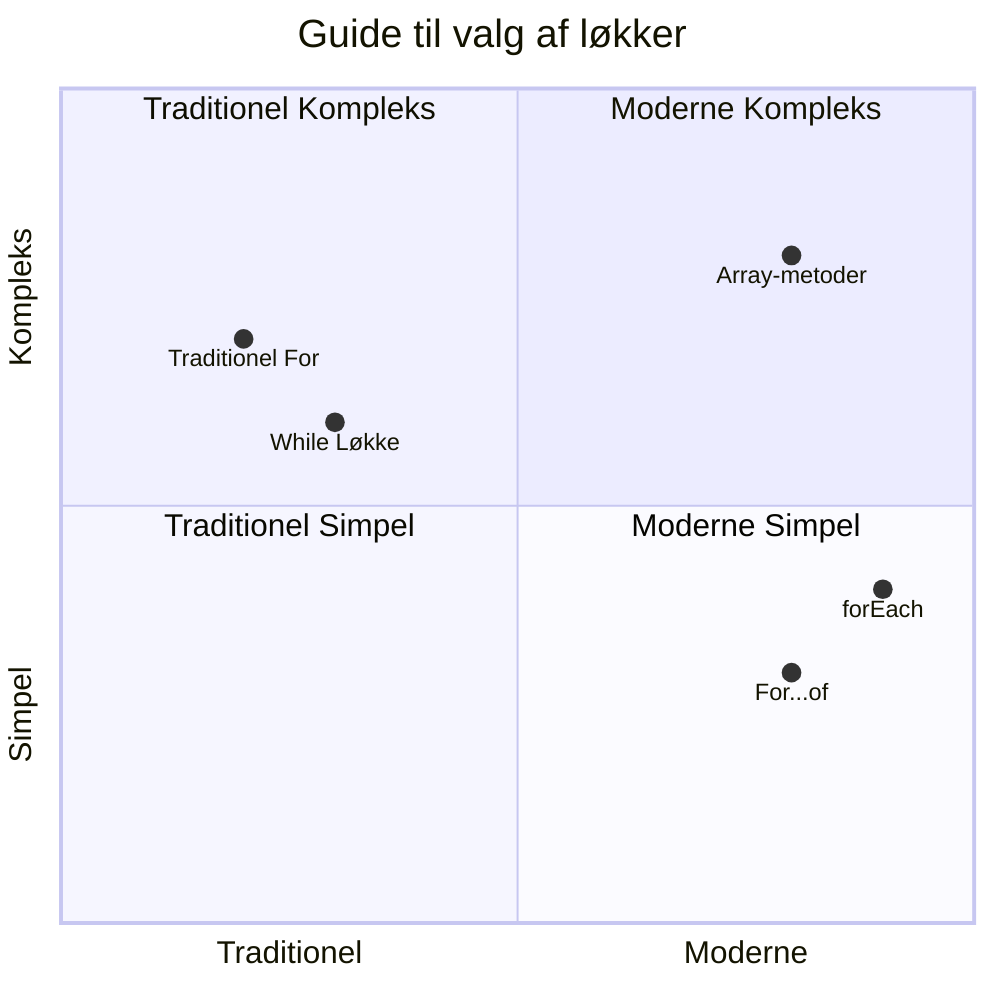
> **Moderne trend**: ES6+ syntakser som `for...of` og `forEach` bliver den foretrukne tilgang til array-iteration, fordi det er renere og mindre fejlbehæftet!

## Løkker og Arrays

Kombinationen af arrays med løkker skaber kraftfulde muligheder for databehandling. Dette par er fundamentalt for mange programmeringsopgaver, fra at vise lister til at beregne statistikker.

**Traditionel Array-behandling:**

```javascript
const iceCreamFlavors = ["Chocolate", "Strawberry", "Vanilla", "Pistachio", "Rocky Road"];

// Klassisk for-løkke tilgang
for (let i = 0; i < iceCreamFlavors.length; i++) {
  console.log(`Flavor ${i + 1}: ${iceCreamFlavors[i]}`);
}

// Moderne for...of tilgang
for (const flavor of iceCreamFlavors) {
  console.log(`Available flavor: ${flavor}`);
}
```

**Lad os forstå hver tilgang:**
- **Bruger** array-længde egenskaben til at bestemme løkkens grænser
- **Tilgår** elementer via indeks i traditionelle for-løkker
- **Giver** direkte elementadgang i for...of løkker
- **Behandler** hvert array-element præcist én gang

**Praktisk eksempel på databehandling:**

```javascript
const studentGrades = [85, 92, 78, 96, 88, 73, 89];
let total = 0;
let highestGrade = studentGrades[0];
let lowestGrade = studentGrades[0];

// Behandl alle karakterer med en enkelt løkke
for (let i = 0; i < studentGrades.length; i++) {
  const grade = studentGrades[i];
  total += grade;
  
  if (grade > highestGrade) {
    highestGrade = grade;
  }
  
  if (grade < lowestGrade) {
    lowestGrade = grade;
  }
}

const average = total / studentGrades.length;
console.log(`Average: ${average.toFixed(1)}`);
console.log(`Highest: ${highestGrade}`);
console.log(`Lowest: ${lowestGrade}`);
```

**Sådan fungerer denne kode:**
- **Initialiserer** sporingsvariabler for sum og yderpunkter
- **Behandler** hver karakter med en enkelt effektiv løkke
- **Akkumulerer** totalen til gennemsnitsberegning
- **Sporer** højeste og laveste værdier under iterationen
- **Beregner** endelige statistikker efter løkkens afslutning

✅ Eksperimentér med at løbe gennem et array, du selv har lavet, i din browsers konsol.

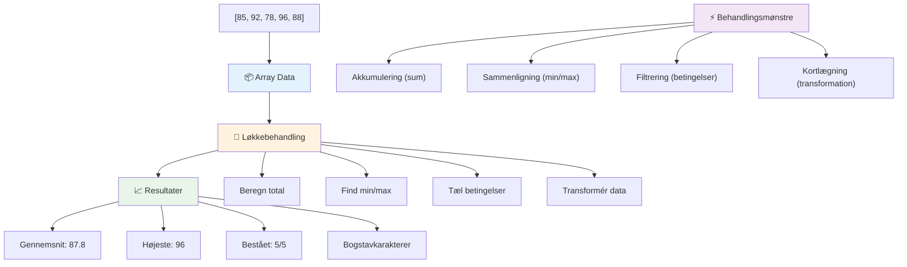
---

## GitHub Copilot Agent Challenge 🚀

Brug Agent-tilstanden til at løse følgende udfordring:

**Beskrivelse:** Byg en omfattende databehandlingsfunktion, der kombinerer arrays og løkker til at analysere et datasæt og generere meningsfulde indsigter.

**Prompt:** Opret en funktion kaldet `analyzeGrades`, som tager et array af elevkarakterobjekter (hver indeholder navn- og score-egenskaber) og returnerer et objekt med statistik inklusive højeste score, laveste score, gennemsnitsscore, antallet af elever, der bestod (score >= 70), og et array med navne på elever, der har scoret over gennemsnittet. Brug mindst to forskellige løkketyper i din løsning.

Læs mere om [agent mode](https://code.visualstudio.com/blogs/2025/02/24/introducing-copilot-agent-mode) her.

## 🚀 Udfordring
JavaScript tilbyder flere moderne array-metoder, der kan erstatte traditionelle løkker til specifikke opgaver. Udforsk [forEach](https://developer.mozilla.org/docs/Web/JavaScript/Reference/Global_Objects/Array/forEach), [for-of](https://developer.mozilla.org/docs/Web/JavaScript/Reference/Statements/for...of), [map](https://developer.mozilla.org/docs/Web/JavaScript/Reference/Global_Objects/Array/map), [filter](https://developer.mozilla.org/docs/Web/JavaScript/Reference/Global_Objects/Array/filter) og [reduce](https://developer.mozilla.org/docs/Web/JavaScript/Reference/Global_Objects/Array/reduce).

**Din udfordring:** Refaktorér eksemplet med elevkarakterer ved hjælp af mindst tre forskellige array-metoder. Bemærk, hvor meget renere og mere læselig koden bliver med moderne JavaScript-syntaks.

## Quiz efter forelæsning
[Quiz efter forelæsning](https://ff-quizzes.netlify.app/web/quiz/14)


## Gennemgang & Selvstudium

Arrays i JavaScript har mange metoder knyttet til sig, som er ekstremt nyttige til datamanipulation. [Læs om disse metoder](https://developer.mozilla.org/docs/Web/JavaScript/Reference/Global_Objects/Array) og prøv nogle af dem (som push, pop, slice og splice) på et array, du selv opretter.

## Opgave

[Loop an Array](assignment.md)

---

## 📊 **Din oversigt over Arrays & Loops værktøjer**

```mermaid
graph TD
    A["🎯 Arrays & Løkker Mestring"] --> B["📦 Array Grundlæggende"]
    A --> C["🔄 Løkketyper"]
    A --> D["🔗 Databehandling"]
    A --> E["🎨 Moderne Teknikker"]
    
    B --> B1["Oprettelse: [ ]"]
    B --> B2["Indeksering: arr[0]"]
    B --> B3["Metoder: push, pop"]
    B --> B4["Egenskaber: længde"]
    
    C --> C1["For: Kendte iterationer"]
    C --> C2["While: Betingelsesbaseret"]
    C --> C3["For...of: Direkte adgang"]
    C --> C4["forEach: Funktionel"]
    
    D --> D1["Statistik beregning"]
    D --> D2["Datatransformation"]
    D --> D3["Filtrering & søgning"]
    D --> D4["Realtidsbehandling"]
    
    E --> E1["Pilefunktioner"]
    E --> E2["Metodekædning"]
    E --> E3["Destrukturering"]
    E --> E4["Skabelonlitteraler"]
    
    F["💡 Nøglefordele"] --> F1["Effektiv datahåndtering"]
    F --> F2["Reduceret kodegentagelse"]
    F --> F3["Skalerbare løsninger"]
    F --> F4["Renere syntaks"]
    
    style A fill:#e3f2fd
    style B fill:#e8f5e8
    style C fill:#fff3e0
    style D fill:#f3e5f5
    style E fill:#e0f2f1
    style F fill:#fce4ec
```
---

## 🚀 Din tidslinje for mestring af Arrays & Loops

### ⚡ **Hvad du kan nå de næste 5 minutter**
- [ ] Opret et array med dine yndlingsfilm og få adgang til specifikke elementer
- [ ] Skriv en for-løkke, der tæller fra 1 til 10
- [ ] Prøv udfordringen med moderne array-metoder fra lektionen
- [ ] Øv array-indeksering i din browser-konsol

### 🎯 **Hvad du kan opnå denne time**
- [ ] Fuldfør quizzen efter lektionen og gennemgå eventuelle udfordrende koncepter
- [ ] Byg den omfattende karakteranalysator fra GitHub Copilot-udfordringen
- [ ] Opret en simpel indkøbskurv, der tilføjer og fjerner varer
- [ ] Øv dig i at konvertere mellem forskellige løkke-typer
- [ ] Eksperimenter med array-metoder som `push`, `pop`, `slice` og `splice`

### 📅 **Din en-ugers rejse i databehandling**
- [ ] Fuldfør opgaven "Loop an Array" med kreative forbedringer
- [ ] Byg en to-do-liste applikation ved hjælp af arrays og loops
- [ ] Opret en simpel statistikberegner til numeriske data
- [ ] Øv dig med [MDN array-metoder](https://developer.mozilla.org/docs/Web/JavaScript/Reference/Global_Objects/Array)
- [ ] Byg en fotogalleri- eller musikafspilningsliste-grænseflade
- [ ] Udforsk funktionel programmering med `map`, `filter` og `reduce`

### 🌟 **Din månedslange transformation**
- [ ] Mestring af avancerede array-operationer og performanceoptimering
- [ ] Byg et komplet dashboard til datavisualisering
- [ ] Bidrag til open source-projekter inden for databehandling
- [ ] Lær en anden om arrays og loops med praktiske eksempler
- [ ] Opret et personligt bibliotek med genanvendelige data-behandlingsfunktioner
- [ ] Udforsk algoritmer og datastrukturer baseret på arrays

### 🏆 **Endelig check-in for mester i databehandling**

**Fejr din mestring af arrays og loops:**
- Hvad er den mest nyttige array-operation, du har lært til virkelige anvendelser?
- Hvilken type løkke føles mest naturlig for dig, og hvorfor?
- Hvordan har forståelsen af arrays og loops ændret din tilgang til organisering af data?
- Hvilken kompleks databehandlingsopgave vil du gerne tage fat på næste gang?

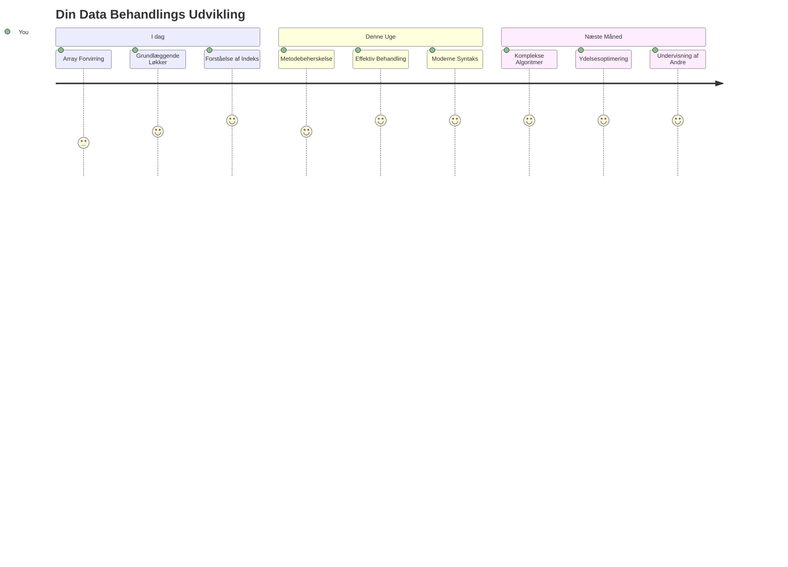
> 📦 **Du har låst op for kraften i dataorganisering og -behandling!** Arrays og loops er grundlaget for næsten alle applikationer, du nogensinde vil bygge. Fra simple lister til kompleks dataanalyse har du nu værktøjerne til at håndtere information effektivt og elegant. Hver dynamisk hjemmeside, mobilapp og datadrevet applikation bygger på disse fundamentale koncepter. Velkommen til verdenen af skalerbar databehandling! 🎉

---

<!-- CO-OP TRANSLATOR DISCLAIMER START -->
**Ansvarsfraskrivelse**:  
Dette dokument er blevet oversat ved hjælp af AI-oversættelsestjenesten [Co-op Translator](https://github.com/Azure/co-op-translator). Mens vi bestræber os på nøjagtighed, skal du være opmærksom på, at automatiserede oversættelser kan indeholde fejl eller unøjagtigheder. Det oprindelige dokument på dets oprindelige sprog bør betragtes som den autoritative kilde. For kritisk information anbefales professionel menneskelig oversættelse. Vi påtager os intet ansvar for misforståelser eller fejltolkninger, der opstår som følge af brugen af denne oversættelse.
<!-- CO-OP TRANSLATOR DISCLAIMER END -->