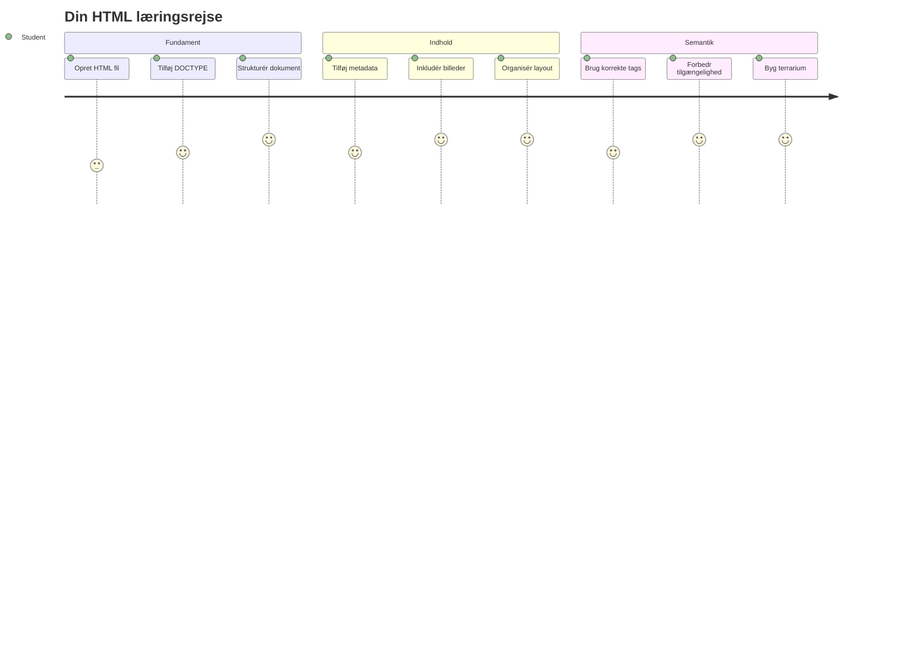
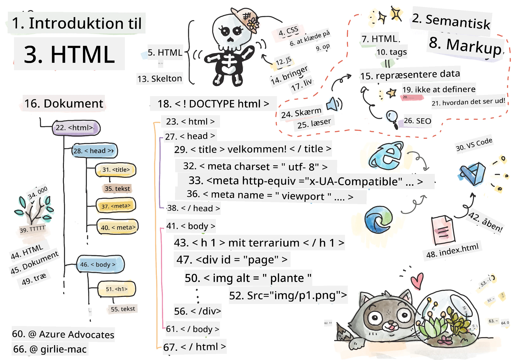
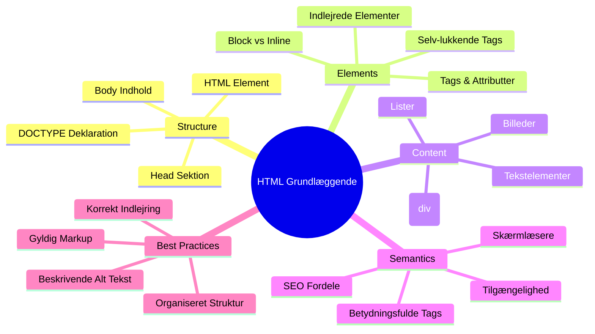
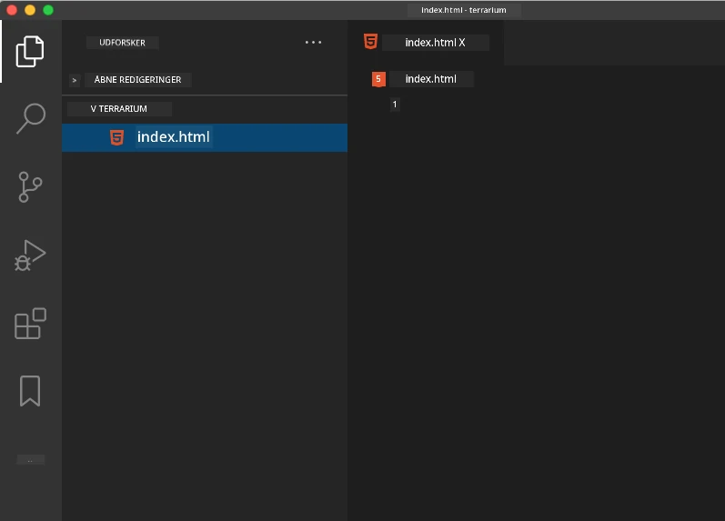
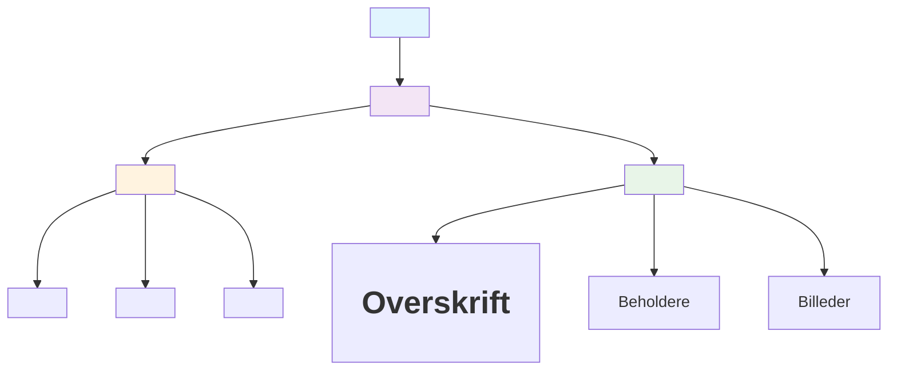
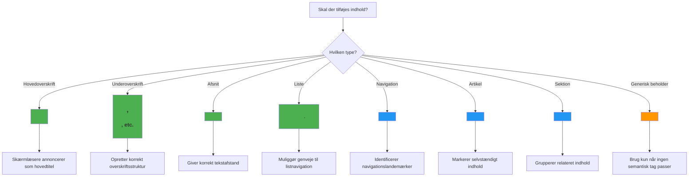
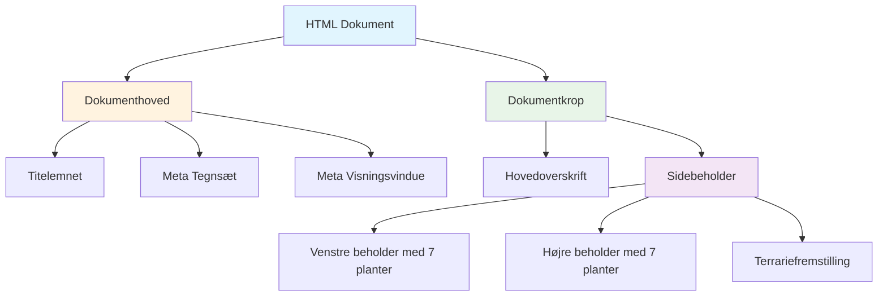
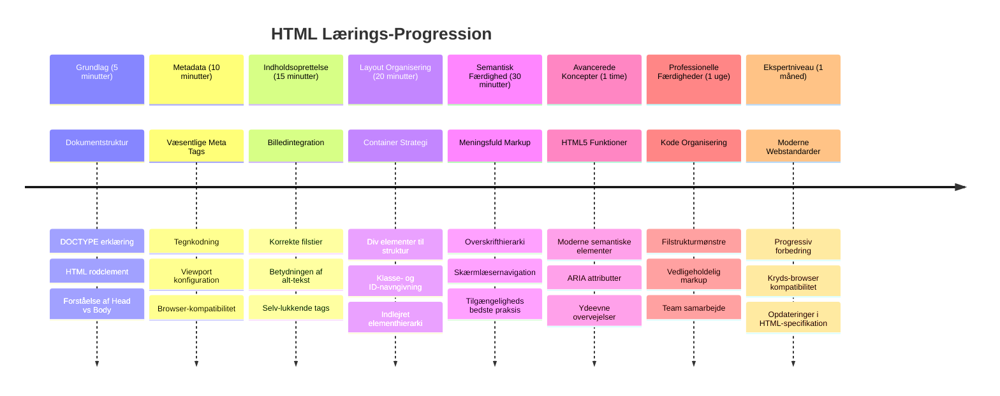

<!--
CO_OP_TRANSLATOR_METADATA:
{
  "original_hash": "3fcfa99c4897e051b558b5eaf1e8cc74",
  "translation_date": "2026-01-06T23:57:01+00:00",
  "source_file": "3-terrarium/1-intro-to-html/README.md",
  "language_code": "da"
}
-->
# Terrarium Projekt Del 1: Introduktion til HTML



> Sketchnote af [Tomomi Imura](https://twitter.com/girlie_mac)

HTML, eller HyperText Markup Language, er fundamentet for enhver hjemmeside, du nogensinde har besøgt. Tænk på HTML som skelettet, der giver struktur til websider – det definerer, hvor indholdet skal være, hvordan det organiseres, og hvad hvert enkelt element repræsenterer. Mens CSS senere "pynter" din HTML med farver og layouts, og JavaScript bringer det til live med interaktivitet, giver HTML den essentielle struktur, som gør alt andet muligt.

I denne lektion vil du lave HTML-strukturen til en virtuel terrariumgrænseflade. Dette hands-on projekt vil lære dig grundlæggende HTML-koncepter, samtidig med at du bygger noget visuelt engagerende. Du lærer, hvordan du organiserer indhold ved hjælp af semantiske elementer, arbejder med billeder og laver fundamentet for en interaktiv webapplikation.

Ved slutningen af denne lektion vil du have en fungerende HTML-side, der viser plantebilleder i organiserede kolonner, klar til styling i næste lektion. Vær ikke bekymret, hvis det ser grundlæggende ud til at starte med – det er præcis, hvad HTML skal gøre, før CSS tilføjer det visuelle finish.


## Forud-forelæsningstest

[Forud-forelæsningstest](https://ff-quizzes.netlify.app/web/quiz/15)

> 📺 **Se og lær**: Tjek denne hjælpsomme videooversigt
> 
> [](https://www.youtube.com/watch?v=1TvxJKBzhyQ)

## Opsætning af dit projekt

Før vi dykker ned i HTML-koden, lad os sætte et passende arbejdsområde op til dit terrariumprojekt. At skabe en organiseret filstruktur fra starten er en vigtig vane, der vil gavne dig gennem hele din webudviklingsrejse.

### Opgave: Opret din projektstruktur

Du skal oprette en dedikeret mappe til dit terrariumprojekt og tilføje din første HTML-fil. Her er to metoder, du kan bruge:

**Mulighed 1: Brug af Visual Studio Code**
1. Åbn Visual Studio Code
2. Klik på "File" → "Open Folder" eller brug `Ctrl+K, Ctrl+O` (Windows/Linux) eller `Cmd+K, Cmd+O` (Mac)
3. Opret en ny mappe kaldet `terrarium` og vælg den
4. I Explorer-panelet, klik på ikonet "New File"
5. Navngiv din fil `index.html`



**Mulighed 2: Brug af terminalkommandoer**
```bash
mkdir terrarium
cd terrarium
touch index.html
code index.html
```

**Det er, hvad disse kommandoer gør:**
- **Opretter** en ny mappe kaldet `terrarium` til dit projekt
- **Navigerer** ind i terrarium-mappen
- **Opretter** en tom fil ved navn `index.html`
- **Åbner** filen i Visual Studio Code til redigering

> 💡 **Pro-tip**: Filnavnet `index.html` er specielt i webudvikling. Når nogen besøger en hjemmeside, søger browseren automatisk efter `index.html` som standard side at vise. Det betyder, at en URL som `https://mysite.com/projects/` automatisk åbner `index.html`-filen i `projects`-mappen uden at skulle specificere filnavnet i URL’en.

## Forståelse af HTML-dokumentstruktur

Hvert HTML-dokument følger en specifik struktur, som browsere skal forstå og vise korrekt. Tænk på denne struktur som et formelt brev – det har nødvendige elementer i en bestemt rækkefølge, som hjælper modtageren (i dette tilfælde browseren) med at behandle indholdet korrekt.


Lad os starte med at tilføje det essentielle fundament, som hvert HTML-dokument har brug for.

### DOCTYPE-deklarationen og rootelementet

De første to linjer i en hvilken som helst HTML-fil fungerer som dokumentets "introduktion" til browseren:

```html
<!DOCTYPE html>
<html></html>
```

**Sådan fungerer denne kode:**
- **Deklarerer** dokumenttypen som HTML5 ved hjælp af `<!DOCTYPE html>`
- **Opretter** root-`<html>` elementet, som skal indeholde alt sideindhold
- **Etablerer** moderne webstandarder for korrekt browsers rendering
- **Sikrer** konsistent visning på tværs af forskellige browsere og enheder

> 💡 **VS Code-tip**: Hold musen over en HTML-tag i VS Code for at se nyttige oplysninger fra MDN Web Docs, inklusive brugseksempler og browserkompatibilitet.

> 📚 **Lær mere**: DOCTYPE-deklarationen forhindrer browsere i at gå i "quirks mode", som blev brugt til at understøtte meget gamle hjemmesider. Moderne webudvikling bruger den simple `<!DOCTYPE html>`-deklaration for at sikre [standard-kompatibel rendering](https://developer.mozilla.org/docs/Web/HTML/Quirks_Mode_and_Standards_Mode).

### 🔄 **Pædagogisk status**
**Pause og refleksion**: Før du fortsætter, skal du sikre dig, at du forstår:
- ✅ Hvorfor hvert HTML-dokument har brug for en DOCTYPE-deklaration
- ✅ Hvad `<html>`-root-elementet indeholder
- ✅ Hvordan denne struktur hjælper browsere med at vise sider korrekt

**Hurtig selvtest**: Kan du forklare med dine egne ord, hvad "standard-kompatibel rendering" betyder?

## Tilføjelse af essentiel dokumentmetadata

`<head>`-sektionen i et HTML-dokument indeholder vigtig information, som browsere og søgemaskiner har brug for, men som besøgende ikke ser direkte på siden. Tænk på det som "bag kulisserne"-informationen, der hjælper din webside med at fungere korrekt og vises rigtigt på forskellige enheder og platforme.

Denne metadata fortæller browserne, hvordan de skal vise din side, hvilken tegnkodning der skal bruges, og hvordan forskellige skærmstørrelser håndteres – alt sammen essentielt for at lave professionelle, tilgængelige websider.

### Opgave: Tilføj sidehovedet

Indsæt denne `<head>`-sektion mellem dine åbnings- og lukningstags `<html>`:

```html
<head>
	<title>Welcome to my Virtual Terrarium</title>
	<meta charset="utf-8" />
	<meta http-equiv="X-UA-Compatible" content="IE=edge" />
	<meta name="viewport" content="width=device-width, initial-scale=1" />
</head>
```

**Hvad hvert element gør:**
- **Sætter** sidetitlen, som vises i browsertabs og søgeresultater
- **Specificerer** UTF-8 tegnkodning for korrekt visning af tekst verden over
- **Sikrer** kompatibilitet med moderne versioner af Internet Explorer
- **Konfigurerer** responsivt design ved at sætte viewport til at matche enhedens bredde
- **Styrer** startzoom for at vise indhold i naturlig størrelse

> 🤔 **Tænk over dette**: Hvad ville der ske, hvis du satte en viewport meta-tag som denne: `<meta name="viewport" content="width=600">`? Det ville tvinge siden til altid at være 600 pixels bred, hvilket bryder det responsive design! Læs mere om [korrekt viewport-konfiguration](https://developer.mozilla.org/docs/Web/HTML/Viewport_meta_tag).

## Bygning af dokumentets krop

`<body>`-elementet indeholder alt synligt indhold på din webside – alt brugerne vil se og interagere med. Mens `<head>`-sektionen giver instruktioner til browseren, indeholder `<body>`-sektionen det faktiske indhold: tekst, billeder, knapper og andre elementer, der udgør brugerfladen.

Lad os tilføje kroppens struktur og forstå, hvordan HTML-tags arbejder sammen for at skabe meningsfuldt indhold.

### Forståelse af HTML-tagstruktur

HTML bruger parrede tags til at definere elementer. De fleste tags har en åbnings-tag som `<p>` og en luknings-tag som `</p>`, med indhold imellem: `<p>Hello, world!</p>`. Det skaber et afsnitselement, der indeholder teksten "Hello, world!".

### Opgave: Tilføj body-elementet

Opdater din HTML-fil til at inkludere `<body>`-elementet:

```html
<!DOCTYPE html>
<html>
	<head>
		<title>Welcome to my Virtual Terrarium</title>
		<meta charset="utf-8" />
		<meta http-equiv="X-UA-Compatible" content="IE=edge" />
		<meta name="viewport" content="width=device-width, initial-scale=1" />
	</head>
	<body></body>
</html>
```

**Denne komplette struktur giver:**
- **Etablerer** det grundlæggende HTML5-dokumentrammeværk
- **Inkluderer** vigtig metadata for korrekt browser-gengivelse
- **Skaber** en tom krop klar til dit synlige indhold
- **Følger** moderne webudviklings bedste praksis

Nu er du klar til at tilføje de synlige elementer i dit terrarium. Vi bruger `<div>`-elementer som containere til at organisere forskellige sektioner af indhold, og ``-elementer til at vise plantebilleder.

### Arbejde med billeder og layoutcontainere

Billeder er specielle i HTML, fordi de bruger "self-closing" tags. I modsætning til elementer som `<p></p>`, der omslutter indhold, indeholder ``-taget al den nødvendige information i selve tagget ved hjælp af attributter som `src` for billedfilens sti og `alt` for tilgængelighed.

Før du tilføjer billeder til din HTML, skal du organisere dine projektfiler korrekt ved at oprette en billedmappe og tilføje plantegrafikkerne.

**Først, sæt dine billeder op:**
1. Opret en mappe kaldet `images` inde i din terrariumprojektmappe
2. Download plantebillederne fra [løsningsmappen](../../../../3-terrarium/solution/images) (14 plantebilleder i alt)
3. Kopier alle plantebilleder ind i din nye `images`-mappe

### Opgave: Opret plantevisningslayoutet

Tilføj nu plantebillederne organiseret i to kolonner mellem dine `<body></body>`-tags:

```html
<div id="page">
	<div id="left-container" class="container">
		<div class="plant-holder">
			
		</div>
		<div class="plant-holder">
			
		</div>
		<div class="plant-holder">
			
		</div>
		<div class="plant-holder">
			
		</div>
		<div class="plant-holder">
			
		</div>
		<div class="plant-holder">
			
		</div>
		<div class="plant-holder">
			
		</div>
	</div>
	<div id="right-container" class="container">
		<div class="plant-holder">
			
		</div>
		<div class="plant-holder">
			
		</div>
		<div class="plant-holder">
			
		</div>
		<div class="plant-holder">
			
		</div>
		<div class="plant-holder">
			
		</div>
		<div class="plant-holder">
			
		</div>
		<div class="plant-holder">
			
		</div>
	</div>
</div>
```

**Her sker der trin for trin i koden:**
- **Opretter** en hovedside-container med `id="page"` til at holde alt indhold
- **Etablerer** to kolonnecontainere: `left-container` og `right-container`
- **Organiserer** 7 planter i venstre kolonne og 7 planter i højre kolonne
- **Omslutter** hvert plantebillede i en `plant-holder` div til individuel placering
- **Anvender** konsekvente klassenavne til CSS-styling i næste lektion
- **Tildeler** unikke ID’er til hvert plantebillede til JavaScript-interaktion senere
- **Indeholder** korrekte filstier, der peger på billedmappen

> 🤔 **Overvej dette**: Bemærk, at alle billeder i øjeblikket har samme alt-tekst "plant". Det er ikke optimalt for tilgængelighed. Brugere med skærmlæsere vil høre "plant" gentaget 14 gange uden at vide, hvilken specifik plante hvert billede viser. Kan du tænke på bedre, mere beskrivende alt-tekster for hvert billede?

> 📝 **HTML-elementtyper**: `<div>`-elementer er "blokniveau" og fylder hele bredden, mens `<span>`-elementer er "inline" og kun fylder nødvendig bredde. Hvad tror du der ville ske, hvis du ændrede alle disse `<div>`-tags til `<span>`-tags?

### 🔄 **Pædagogisk status**
**Strukturforståelse**: Tag et øjeblik til at gennemgå din HTML-struktur:
- ✅ Kan du identificere hovedcontainerne i dit layout?
- ✅ Forstår du, hvorfor hvert billede har en unik ID?
- ✅ Hvordan vil du beskrive formålet med `plant-holder` div’erne?

**Visuel inspektion**: Åbn din HTML-fil i en browser. Du burde se:
- En basal liste af plantebilleder
- Billeder organiseret i to kolonner
- Simpelt, ustylet layout

**Husk**: Dette simple udseende er præcis, hvordan HTML skal se ud, før CSS styling!

Med denne markup tilføjet vil planterne vises på skærmen, selvom de endnu ikke ser polerede ud – det er hvad CSS er til i næste lektion! For nu har du et solidt HTML-fundament, der korrekt organiserer dit indhold og følger bedste praksis for tilgængelighed.

## Brug af semantisk HTML til tilgængelighed

Semantisk HTML betyder at vælge HTML-elementer baseret på deres betydning og formål, ikke kun deres udseende. Når du bruger semantisk markup, kommunikerer du indholdets struktur og betydning til browsere, søgemaskiner og hjælpemetoder som skærmlæsere.


Denne tilgang gør dine hjemmesider mere tilgængelige for brugere med handicap og hjælper søgemaskiner med bedre at forstå dit indhold. Det er et grundlæggende princip i moderne webudvikling, der skaber bedre oplevelser for alle.

### Tilføj en semantisk sidetitel

Lad os tilføje en ordentlig overskrift til din terrariumsside. Indsæt denne linje lige efter dit åbnings-tag `<body>`:

```html
<h1>My Terrarium</h1>
```

**Hvorfor semantisk markup betyder noget:**
- **Hjælper** skærmlæsere med at navigere og forstå sidestrukturen
- **Forbedrer** søgemaskineoptimering (SEO) ved at tydeliggøre indholdshierarkiet
- **Forstærker** tilgængelighed for brugere med syns- eller kognitive forskelle
- **Skaber** bedre brugeroplevelser på tværs af alle enheder og platforme
- **Følger** webstandarder og bedste praksis til professionel udvikling

**Eksempler på semantiske vs. ikke-semantiske valg:**

| Formål | ✅ Semantisk valg | ❌ Ikke-semantisk valg |
|---------|-------------------|------------------------|
| Hovedoverskrift | `<h1>Titel</h1>` | `<div class="big-text">Titel</div>` |
| Navigation | `<nav><ul><li></li></ul></nav>` | `<div class="menu"><div></div></div>` |
| Knap | `<button>Klik på mig</button>` | `<span onclick="...">Klik på mig</span>` |
| Artikelindhold | `<article><p></p></article>` | `<div class="content"><div></div></div>` |

> 🎥 **Se det i praksis**: Se [hvordan skærmlæsere interagerer med websider](https://www.youtube.com/watch?v=OUDV1gqs9GA) for at forstå, hvorfor semantisk markup er afgørende for tilgængelighed. Bemærk, hvordan korrekt HTML-struktur hjælper brugere med at navigere effektivt.

## Oprettelse af terrariumcontaineren

Lad os nu tilføje HTML-strukturen til selve terrariet – glasbeholderen, hvor planter til sidst skal placeres. Denne sektion demonstrerer et vigtigt koncept: HTML giver struktur, men uden CSS-styling vil disse elementer endnu ikke være synlige.

Terrarium-markup’en bruger beskrivende klassenavne, som vil gøre CSS-styling intuitivt og vedligeholdeligt i næste lektion.

### Opgave: Tilføj terrariumstrukturen

Indsæt denne markup ovenover det sidste `</div>` tag (før lukningstagen for sidecontaineren):

```html
<div id="terrarium">
	<div class="jar-top"></div>
	<div class="jar-walls">
		<div class="jar-glossy-long"></div>
		<div class="jar-glossy-short"></div>
	</div>
	<div class="dirt"></div>
	<div class="jar-bottom"></div>
</div>
```

**Forståelse af denne terrariumstruktur:**
- **Opretter** en hovedterrarium-container med et unikt ID til styling
- **Definerer** separate elementer for hver visuel komponent (top, vægge, jord, bund)
- **Indeholder** indlejrede elementer til glasrefleksionseffekter (glansfulde elementer)
- **Bruger** beskrivende klassenavne, som tydeligt angiver hvert elements formål
- **Forbereder** strukturen til CSS-styling, der vil skabe glasterrariumets udseende

> 🤔 **Lægger du mærke til noget?**: Selvom du har tilføjet denne markup, ser du ikke noget nyt på siden! Dette illustrerer perfekt, hvordan HTML leverer struktur, mens CSS står for udseendet. Disse `<div>`-elementer findes, men har endnu ingen visuel styling – det kommer i næste lektion!


### 🔄 **Pædagogisk Tjek-ind**
**Beherskelse af HTML-struktur**: Før du går videre, sørg for at du kan:
- ✅ Forklare forskellen mellem HTML-struktur og visuelt udseende
- ✅ Identificere semantiske vs. ikke-semantiske HTML-elementer
- ✅ Beskrive hvordan korrekt markup gavner tilgængelighed
- ✅ Genkende den komplette dokumenttræsstruktur

**Test din forståelse**: Prøv at åbne din HTML-fil i en browser med JavaScript slået fra og CSS fjernet. Dette viser dig den rene semantiske struktur, du har skabt!

---

## GitHub Copilot Agent-udfordring

Brug Agent-tilstand til at fuldføre følgende udfordring:

**Beskrivelse:** Opret en semantisk HTML-struktur til en planteplejevejledning, der kan tilføjes til terrariumprojektet.

**Prompt:** Opret en semantisk HTML-sektion, der inkluderer en hovedoverskrift "Plant Care Guide", tre undersektioner med overskrifterne "Watering", "Light Requirements" og "Soil Care", hver med et afsnit om planteplejeinformation. Brug korrekte semantiske HTML-tags som `<section>`, `<h2>`, `<h3>`, og `<p>` til at strukturere indholdet passende.

Lær mere om [agent mode](https://code.visualstudio.com/blogs/2025/02/24/introducing-copilot-agent-mode) her.

## Udforsk HTML-historie-udfordring

**Lær om webudviklingens evolution**

HTML har udviklet sig betydeligt siden Tim Berners-Lee skabte den første webbrowser hos CERN i 1990. Nogle ældre tags som `<marquee>` er nu forældede, fordi de ikke fungerer godt med moderne tilgængelighedsstandarder og responsive designprincipper.

**Prøv dette eksperiment:**
1. Pak midlertidigt din `<h1>`-titel ind i et `<marquee>`-tag: `<marquee><h1>My Terrarium</h1></marquee>`
2. Åbn din side i en browser og observer den rullende effekt
3. Overvej hvorfor dette tag blev forældet (hint: tænk på brugeroplevelse og tilgængelighed)
4. Fjern `<marquee>`-taget og vend tilbage til semantisk markup

**Refleksionsspørgsmål:**
- Hvordan kan en rullende titel påvirke brugere med synshandicap eller følsomhed over for bevægelse?
- Hvilke moderne CSS-teknikker kan opnå lignende visuelle effekter mere tilgængeligt?
- Hvorfor er det vigtigt at bruge gældende webstandarder frem for forældede elementer?

Udforsk mere om [forældede og udgåede HTML-elementer](https://developer.mozilla.org/docs/Web/HTML/Element#Obsolete_and_deprecated_elements) for at forstå, hvordan webstandarder udvikler sig for at forbedre brugeroplevelsen.


## Quiz efter lektionen

[Post-lecture quiz](https://ff-quizzes.netlify.app/web/quiz/16)

## Gennemgang og selvstudie

**Dyk dybere ned i din HTML-viden**

HTML har dannet fundamentet for nettet i over 30 år, og er gået fra et simpelt dokumentmarkup-sprog til en avanceret platform for at bygge interaktive applikationer. Forståelsen af denne udvikling hjælper dig med at værdsætte moderne webstandarder og træffe bedre udviklingsbeslutninger.

**Anbefalede læringsveje:**

1. **HTML-historie og udvikling**
   - Undersøg tidslinjen fra HTML 1.0 til HTML5
   - Udforsk hvorfor visse tags blev forældede (tilgængelighed, mobilvenlighed, vedligeholdelse)
   - Undersøg nye funktioner og forslag til HTML

2. **Dybdegående semantisk HTML**
   - Studér den komplette liste over [HTML5 semantiske elementer](https://developer.mozilla.org/docs/Web/HTML/Element)
   - Øv dig i at identificere hvornår du skal bruge `<article>`, `<section>`, `<aside>` og `<main>`
   - Lær om ARIA-attributter til forbedret tilgængelighed

3. **Moderne webudvikling**
   - Udforsk [at bygge responsive websites](https://docs.microsoft.com/learn/modules/build-simple-website/?WT.mc_id=academic-77807-sagibbon) på Microsoft Learn
   - Forstå hvordan HTML integreres med CSS og JavaScript
   - Lær om webperformance og SEO bedste praksis

**Refleksionsspørgsmål:**
- Hvilke forældede HTML-tags opdagede du, og hvorfor blev de fjernet?
- Hvilke nye HTML-funktioner foreslås til fremtidige versioner?
- Hvordan bidrager semantisk HTML til webtilgængelighed og SEO?

### ⚡ **Hvad du kan nå på de næste 5 minutter**
- [ ] Åbn DevTools (F12) og inspicer HTML-strukturen på dit yndlingswebsite
- [ ] Opret en simpel HTML-fil med grundlæggende tags: `<h1>`, `<p>`, og ``
- [ ] Valider din HTML med W3C HTML-validator online
- [ ] Prøv at tilføje en kommentar til din HTML ved hjælp af `<!-- comment -->`

### 🎯 **Hvad du kan opnå i denne time**
- [ ] Gennemfør quizzen efter lektionen og gennemgå koncepter om semantisk HTML
- [ ] Byg en simpel hjemmeside om dig selv med korrekt HTML-struktur
- [ ] Eksperimenter med forskellige overskriftsniveauer og tekstformaterings-tags
- [ ] Tilføj billeder og links for at øve multimediaintegration
- [ ] Undersøg HTML5-funktioner, du ikke har prøvet endnu

### 📅 **Din ugelange HTML-rejse**
- [ ] Færdiggør terrariumprojekt-øvelsen med semantisk markup
- [ ] Opret en tilgængelig hjemmeside med ARIA-labels og roller
- [ ] Øv formoprettelse med forskellige input-typer
- [ ] Udforsk HTML5 APIs som localStorage eller geolocation
- [ ] Studér responsive HTML-mønstre og mobile-first design
- [ ] Gennemgå andre udvikleres HTML-kode for bedste praksis

### 🌟 **Dit månedlange webgrundlag**
- [ ] Byg en porteføljeside, der viser dit HTML-mesterskab
- [ ] Lær HTML-templating med et framework som Handlebars
- [ ] Bidrag til open source-projekter ved at forbedre HTML-dokumentation
- [ ] Mestre avancerede HTML-koncepter som custom elements
- [ ] Integrer HTML med CSS-frameworks og JavaScript-biblioteker
- [ ] Vær mentor for andre, der lærer HTML-grundlaget

## 🎯 Din HTML-mesterskabstidslinje


### 🛠️ Din HTML-værktøjssamling

Efter at have gennemført denne lektion har du nu:
- **Dokumentstruktur**: Fuld HTML5-fundament med korrekt DOCTYPE
- **Semantisk markup**: Meningsfulde tags, der forbedrer tilgængelighed og SEO
- **Billedeintegration**: Korrekt filorganisering og brug af alt-tekster
- **Layoutcontainere**: Strategisk brug af divs med beskrivende klassenavne
- **Tilgængelighedsbevidsthed**: Forståelse for skærmlæsere og navigation
- **Moderne standarder**: Aktuelle HTML5-praksisser og viden om forældede tags
- **Projekts фундамент**: Solid base til CSS-styling og JavaScript-interaktivitet

**Næste skridt**: Din HTML-struktur er klar til CSS-styling! Det semantiske fundament, du har bygget, vil gøre næste lektion meget nemmere at forstå.


## Opgave

[Øv dig i HTML: Byg en blogmodel](assignment.md)

---

<!-- CO-OP TRANSLATOR DISCLAIMER START -->
**Ansvarsfraskrivelse**:
Dette dokument er blevet oversat ved hjælp af AI-oversættelsestjenesten [Co-op Translator](https://github.com/Azure/co-op-translator). Selvom vi bestræber os på nøjagtighed, bedes du være opmærksom på, at automatiske oversættelser kan indeholde fejl eller unøjagtigheder. Det oprindelige dokument på dets modersmål bør betragtes som den autoritative kilde. For kritisk information anbefales professionel menneskelig oversættelse. Vi påtager os intet ansvar for misforståelser eller fejltolkninger, der måtte opstå ved brug af denne oversættelse.
<!-- CO-OP TRANSLATOR DISCLAIMER END -->