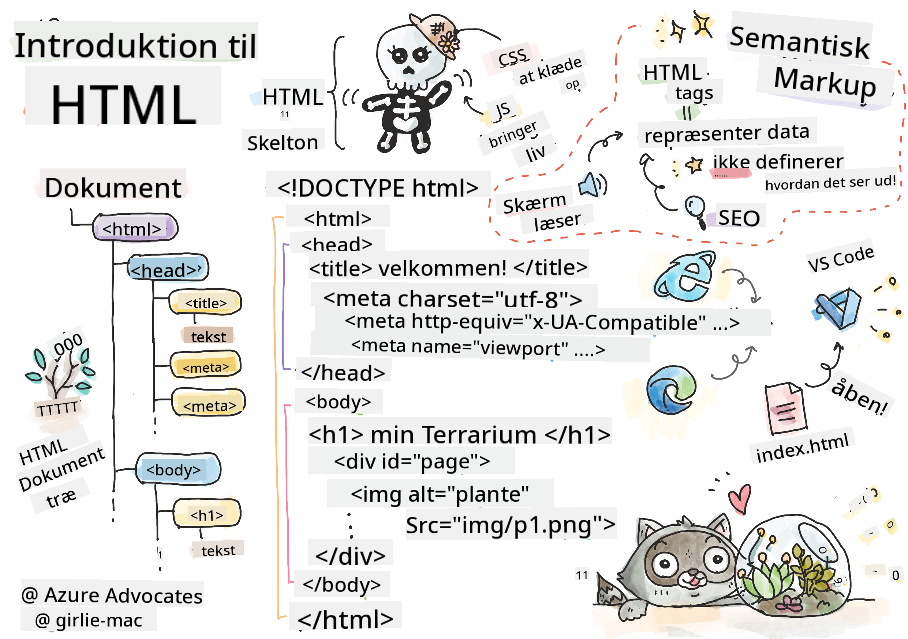

<!--
CO_OP_TRANSLATOR_METADATA:
{
  "original_hash": "46a0639e719b9cf1dfd062aa24cad639",
  "translation_date": "2025-08-26T21:30:22+00:00",
  "source_file": "3-terrarium/1-intro-to-html/README.md",
  "language_code": "da"
}
-->
# Terrarium Projekt Del 1: Introduktion til HTML


> Sketchnote af [Tomomi Imura](https://twitter.com/girlie_mac)

## Quiz før lektionen

[Quiz før lektionen](https://ff-quizzes.netlify.app/web/quiz/15)


> Se videoen

> 
> [](https://www.youtube.com/watch?v=1TvxJKBzhyQ)

### Introduktion

HTML, eller HyperText Markup Language, er 'skelettet' på nettet. Hvis CSS 'klæder' din HTML på, og JavaScript giver det liv, så er HTML kroppen i din webapplikation. HTML's syntaks afspejler endda denne idé, da den inkluderer "head", "body" og "footer" tags.

I denne lektion skal vi bruge HTML til at opbygge 'skelettet' af vores virtuelle terrariums interface. Det vil have en titel og tre kolonner: en højre og en venstre kolonne, hvor de trækbare planter befinder sig, og et midterområde, som vil være det egentlige glaslignende terrarium. Når vi er færdige med denne lektion, vil du kunne se planterne i kolonnerne, men interfacet vil se lidt mærkeligt ud; bare rolig, i næste sektion tilføjer vi CSS-stilarter til interfacet for at få det til at se bedre ud.

### Opgave

På din computer skal du oprette en mappe kaldet 'terrarium' og inde i den en fil kaldet 'index.html'. Du kan gøre dette i Visual Studio Code efter at have oprettet din terrarium-mappe ved at åbne et nyt VS Code-vindue, klikke på 'open folder' og navigere til din nye mappe. Klik på den lille 'file'-knap i Explorer-panelet og opret den nye fil:


Eller

Brug disse kommandoer i din git bash:
* `mkdir terrarium`
* `cd terrarium`
* `touch index.html`
* `code index.html` eller `nano index.html`

> index.html-filer angiver for en browser, at det er standardfilen i en mappe; URL'er som `https://anysite.com/test` kan være bygget ved hjælp af en mappestruktur, der inkluderer en mappe kaldet `test` med `index.html` indeni; `index.html` behøver ikke at vises i en URL.

---

## DocType og html-tags

Den første linje i en HTML-fil er dens doctype. Det er lidt overraskende, at du skal have denne linje helt øverst i filen, men den fortæller ældre browsere, at browseren skal gengive siden i standardtilstand og følge den aktuelle HTML-specifikation.

> Tip: I VS Code kan du holde musen over et tag og få information om dets brug fra MDN Reference guides.

Den anden linje skal være `<html>`-taggets åbningstag, efterfulgt af dets lukketag `</html>`. Disse tags er roden af dit interface.

### Opgave

Tilføj disse linjer øverst i din `index.html`-fil:

```HTML
<!DOCTYPE html>
<html></html>
```

✅ Der er nogle forskellige tilstande, der kan bestemmes ved at sætte DocType med en forespørgselsstreng: [Quirks Mode og Standards Mode](https://developer.mozilla.org/docs/Web/HTML/Quirks_Mode_and_Standards_Mode). Disse tilstande blev brugt til at understøtte virkelig gamle browsere, som normalt ikke bruges i dag (Netscape Navigator 4 og Internet Explorer 5). Du kan holde dig til standard doctype-deklarationen.

---

## Dokumentets 'head'

'Head'-området i HTML-dokumentet inkluderer vigtig information om din webside, også kendt som [metadata](https://developer.mozilla.org/docs/Web/HTML/Element/meta). I vores tilfælde fortæller vi webserveren, som denne side vil blive sendt til for at blive gengivet, disse fire ting:

-   sidens titel
-   metadata om siden, herunder:
    -   'character set', som fortæller, hvilken tegnkodning der bruges på siden
    -   browserinformation, herunder `x-ua-compatible`, som angiver, at IE=edge-browseren understøttes
    -   information om, hvordan viewporten skal opføre sig, når den indlæses. Ved at sætte viewporten til at have en initial scale på 1 kontrolleres zoomniveauet, når siden først indlæses.

### Opgave

Tilføj et 'head'-blok til dit dokument mellem åbning og lukning af `<html>`-tags.

```html
<head>
	<title>Welcome to my Virtual Terrarium</title>
	<meta charset="utf-8" />
	<meta http-equiv="X-UA-Compatible" content="IE=edge" />
	<meta name="viewport" content="width=device-width, initial-scale=1" />
</head>
```

✅ Hvad ville der ske, hvis du satte et viewport meta-tag som dette: `<meta name="viewport" content="width=600">`? Læs mere om [viewport](https://developer.mozilla.org/docs/Web/HTML/Viewport_meta_tag).

---

## Dokumentets `body`

### HTML-tags

I HTML tilføjer du tags til din .html-fil for at oprette elementer på en webside. Hvert tag har normalt et åbningstag og et lukketag, som dette: `<p>hello</p>` for at angive et afsnit. Opret kroppens interface ved at tilføje et sæt `<body>`-tags inden for `<html>`-tagparret; din markup ser nu sådan ud:

### Opgave

```html
<!DOCTYPE html>
<html>
	<head>
		<title>Welcome to my Virtual Terrarium</title>
		<meta charset="utf-8" />
		<meta http-equiv="X-UA-Compatible" content="IE=edge" />
		<meta name="viewport" content="width=device-width, initial-scale=1" />
	</head>
	<body></body>
</html>
```

Nu kan du begynde at opbygge din side. Normalt bruger du `<div>`-tags til at oprette de separate elementer på en side. Vi opretter en række `<div>`-elementer, som vil indeholde billeder.

### Billeder

Et HTML-tag, der ikke behøver et lukketag, er ``-tagget, fordi det har et `src`-element, der indeholder al den information, siden har brug for til at gengive elementet.

Opret en mappe i din app kaldet `images`, og tilføj alle billederne fra [source code folder](../../../../3-terrarium/solution/images); (der er 14 billeder af planter).

### Opgave

Tilføj disse plantebilleder i to kolonner mellem `<body></body>`-tags:

```html
<div id="page">
	<div id="left-container" class="container">
		<div class="plant-holder">
			
		</div>
		<div class="plant-holder">
			
		</div>
		<div class="plant-holder">
			
		</div>
		<div class="plant-holder">
			
		</div>
		<div class="plant-holder">
			
		</div>
		<div class="plant-holder">
			
		</div>
		<div class="plant-holder">
			
		</div>
	</div>
	<div id="right-container" class="container">
		<div class="plant-holder">
			
		</div>
		<div class="plant-holder">
			
		</div>
		<div class="plant-holder">
			
		</div>
		<div class="plant-holder">
			
		</div>
		<div class="plant-holder">
			
		</div>
		<div class="plant-holder">
			
		</div>
		<div class="plant-holder">
			
		</div>
	</div>
</div>
```

> Bemærk: Spans vs. Divs. Divs betragtes som 'block'-elementer, og Spans er 'inline'. Hvad ville der ske, hvis du ændrede disse divs til spans?

Med denne markup vises planterne nu på skærmen. Det ser ret dårligt ud, fordi de endnu ikke er stylet med CSS, og det gør vi i næste lektion.

Hvert billede har alt-tekst, der vises, selvom du ikke kan se eller gengive et billede. Dette er en vigtig attribut at inkludere for tilgængelighed. Lær mere om tilgængelighed i fremtidige lektioner; for nu skal du huske, at alt-attributten giver alternativ information for et billede, hvis en bruger af en eller anden grund ikke kan se det (på grund af langsom forbindelse, en fejl i src-attributten, eller hvis brugeren bruger en skærmlæser).

✅ Bemærkede du, at hvert billede har den samme alt-tekst? Er dette god praksis? Hvorfor eller hvorfor ikke? Kan du forbedre denne kode?

---

## Semantisk markup

Generelt er det at foretrække at bruge meningsfuld 'semantik', når du skriver HTML. Hvad betyder det? Det betyder, at du bruger HTML-tags til at repræsentere den type data eller interaktion, de er designet til. For eksempel bør hovedtitelteksten på en side bruge et `<h1>`-tag.

Tilføj følgende linje lige under dit åbningstag `<body>`:

```html
<h1>My Terrarium</h1>
```

At bruge semantisk markup, som at have overskrifter som `<h1>` og uordnede lister som `<ul>`, hjælper skærmlæsere med at navigere gennem en side. Generelt bør knapper skrives som `<button>`, og lister bør være `<li>`. Selvom det _er muligt_ at bruge specielt stylet `<span>`-elementer med klik-håndterere til at efterligne knapper, er det bedre for handicappede brugere at bruge teknologier til at bestemme, hvor på en side en knap befinder sig, og interagere med den, hvis elementet vises som en knap. Af denne grund bør du forsøge at bruge semantisk markup så meget som muligt.

✅ Tag et kig på en skærmlæser og [hvordan den interagerer med en webside](https://www.youtube.com/watch?v=OUDV1gqs9GA). Kan du se, hvorfor ikke-semantisk markup kan frustrere brugeren?

## Terrariet

Den sidste del af dette interface involverer at oprette markup, der vil blive stylet til at skabe et terrarium.

### Opgave:

Tilføj denne markup over det sidste `</div>`-tag:

```html
<div id="terrarium">
	<div class="jar-top"></div>
	<div class="jar-walls">
		<div class="jar-glossy-long"></div>
		<div class="jar-glossy-short"></div>
	</div>
	<div class="dirt"></div>
	<div class="jar-bottom"></div>
</div>
```

✅ Selvom du har tilføjet denne markup til skærmen, ser du absolut intet blive gengivet. Hvorfor?

---

## 🚀Udfordring

Der er nogle vilde 'ældre' tags i HTML, som stadig er sjove at lege med, selvom du ikke bør bruge forældede tags som [disse tags](https://developer.mozilla.org/docs/Web/HTML/Element#Obsolete_and_deprecated_elements) i din markup. Kan du stadig bruge det gamle `<marquee>`-tag til at få h1-titlen til at rulle horisontalt? (hvis du gør det, så husk at fjerne det bagefter)

## Quiz efter lektionen

[Quiz efter lektionen](https://ff-quizzes.netlify.app/web/quiz/16)

## Gennemgang & Selvstudie

HTML er det 'prøvede og sande' byggesystem, der har hjulpet med at opbygge nettet til, hvad det er i dag. Lær lidt om dets historie ved at studere nogle gamle og nye tags. Kan du finde ud af, hvorfor nogle tags blev forældede og andre tilføjet? Hvilke tags kunne blive introduceret i fremtiden?

Lær mere om at bygge sider til nettet og mobile enheder på [Microsoft Learn](https://docs.microsoft.com/learn/modules/build-simple-website/?WT.mc_id=academic-77807-sagibbon).


## Opgave

[Øv dig i HTML: Byg en blogmockup](assignment.md)

---

**Ansvarsfraskrivelse**:  
Dette dokument er blevet oversat ved hjælp af AI-oversættelsestjenesten [Co-op Translator](https://github.com/Azure/co-op-translator). Selvom vi bestræber os på at opnå nøjagtighed, skal du være opmærksom på, at automatiserede oversættelser kan indeholde fejl eller unøjagtigheder. Det originale dokument på dets oprindelige sprog bør betragtes som den autoritative kilde. For kritisk information anbefales professionel menneskelig oversættelse. Vi påtager os ikke ansvaret for eventuelle misforståelser eller fejltolkninger, der måtte opstå som følge af brugen af denne oversættelse.