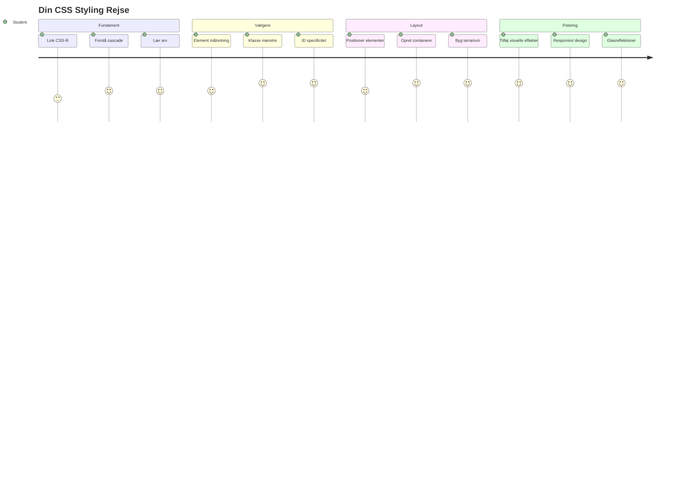
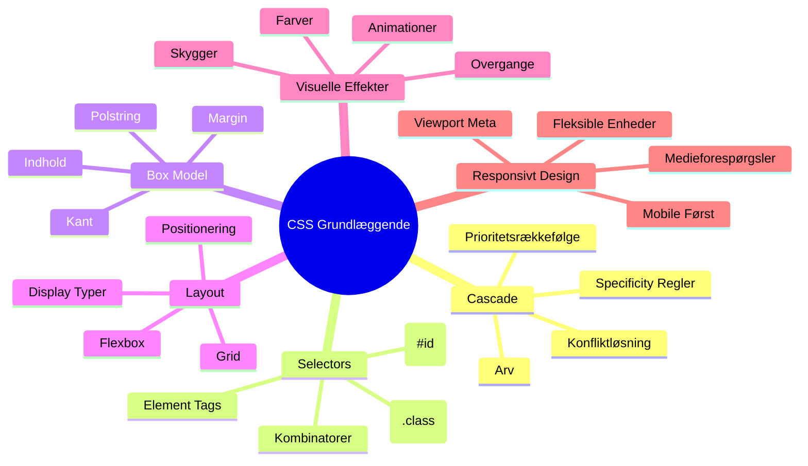
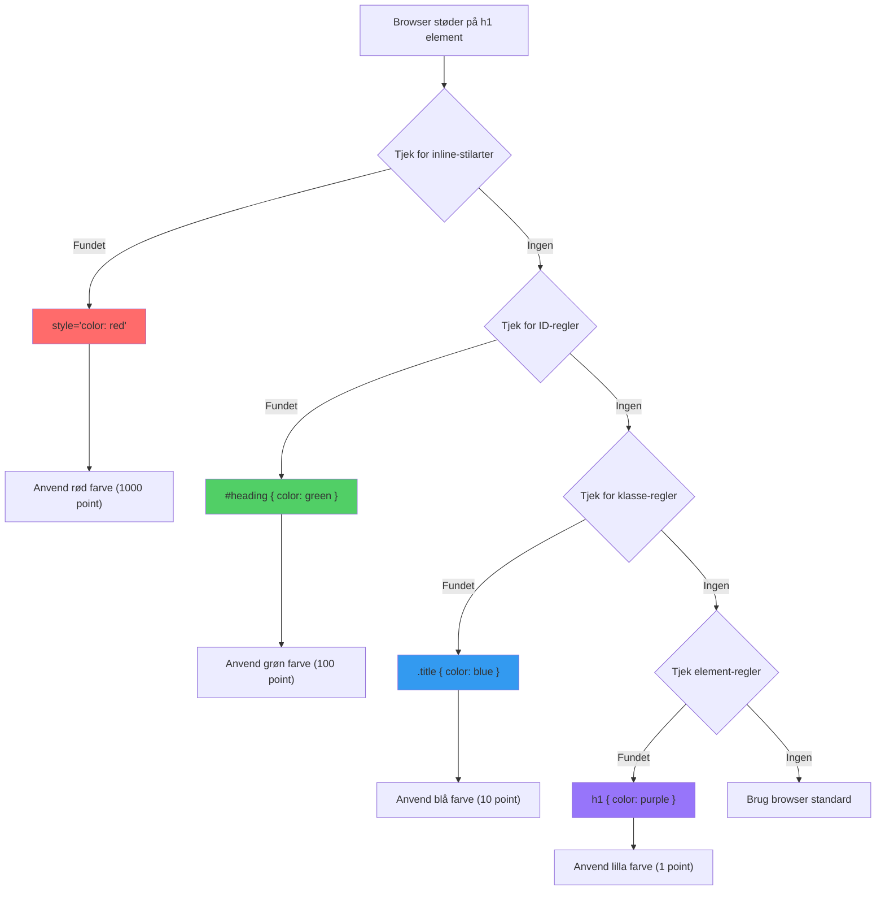
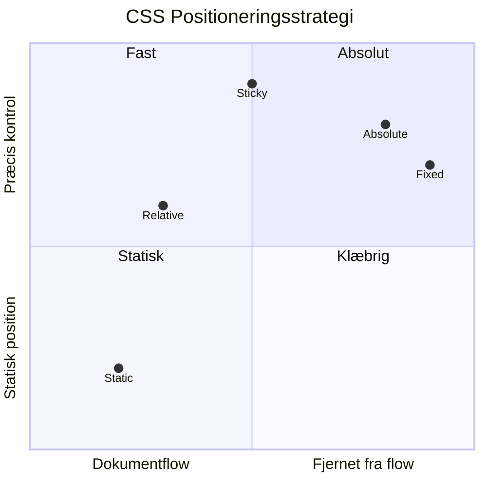
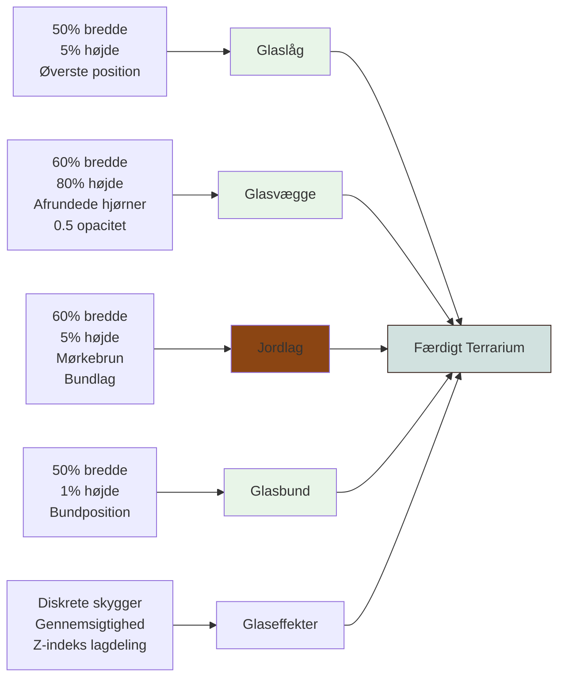
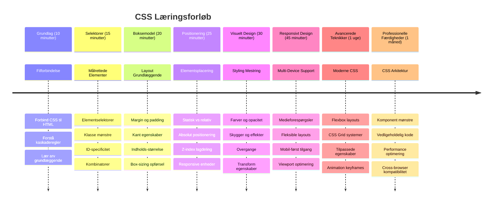

<!--
CO_OP_TRANSLATOR_METADATA:
{
  "original_hash": "e39f3a4e3bcccf94639e3af1248f8a4d",
  "translation_date": "2026-01-06T23:59:57+00:00",
  "source_file": "3-terrarium/2-intro-to-css/README.md",
  "language_code": "da"
}
-->
# Terrarium Projekt Del 2: Introduktion til CSS



> Sketchnote af [Tomomi Imura](https://twitter.com/girlie_mac)

Kan du huske, hvordan dit HTML-terrarium så temmelig grundlæggende ud? CSS er stedet, hvor vi forvandler den enkle struktur til noget visuelt tiltalende.

Hvis HTML er som at bygge rammen til et hus, så er CSS alt det, der får det til at føles som et hjem – malefarverne, møblernes placering, belysningen og hvordan rummene flyder sammen. Tænk på, hvordan Versailles-paladset startede som en simpel jagtlodge, men med omhyggelig opmærksomhed på dekoration og layout blev det til et af verdens mest fantastiske bygninger.

I dag vil vi forvandle dit terrarium fra funktionelt til poleret. Du vil lære at placere elementer præcist, lave layouts der tilpasser sig forskellige skærmstørrelser, og skabe det visuelle udtryk, som gør hjemmesider engagerende.

Ved slutningen af denne lektion vil du se, hvordan strategisk CSS-styling dramatisk kan forbedre dit projekt. Lad os tilføre lidt stil til dit terrarium.


## Forud-forelæsning quiz

[Forud-forelæsningsquiz](https://ff-quizzes.netlify.app/web/quiz/17)

## Kom godt i gang med CSS

CSS bliver ofte betragtet som blot at "gøre ting pæne," men det tjener et langt bredere formål. CSS er som at være instruktør på en film – du kontrollerer ikke kun, hvordan alt ser ud, men også hvordan det bevæger sig, reagerer på interaktion og tilpasser sig forskellige situationer.

Moderne CSS er utroligt kapabelt. Du kan skrive kode, som automatisk justerer layouts til telefoner, tablets og desktopcomputere. Du kan skabe glatte animationer, der guider brugerens opmærksomhed, hvor det er nødvendigt. Resultaterne kan være ret imponerende, når alt spiller sammen.

> 💡 **Pro Tip**: CSS udvikler sig konstant med nye funktioner og muligheder. Tjek altid [CanIUse.com](https://caniuse.com) for at verificere browserunderstøttelse for nyere CSS-funktioner, før du bruger dem i produktionsprojekter.

**Her er, hvad vi vil opnå i denne lektion:**
- **Skabe** et komplet visuelt design til dit terrarium ved hjælp af moderne CSS-teknikker
- **Udforske** grundlæggende koncepter som cascade, arv og CSS-selektorer
- **Implementere** responsive positionerings- og layoutstrategier
- **Bygge** terrarium-beholderen ved hjælp af CSS-former og styling

### Forudsætning

Du skal have færdiggjort HTML-strukturen til dit terrarium fra den forrige lektion og have den klar til at blive stylet.

> 📺 **Video Ressource**: Se denne hjælpsomme videovejledning
>
> [](https://www.youtube.com/watch?v=6yIdOIV9p1I)

### Opsætning af din CSS-fil

Før vi kan begynde at style, skal vi forbinde CSS til vores HTML. Denne forbindelse fortæller browseren, hvor den kan finde stylinginstruktionerne til vores terrarium.

I din terrarium-mappe, opret en ny fil kaldet `style.css`, og link den derefter i din HTML-dokus `<head>` sektion:

```html
<link rel="stylesheet" href="./style.css" />
```

**Her er, hvad denne kode gør:**
- **Opretter** en forbindelse mellem dine HTML- og CSS-filer
- **Fortæller** browseren at hente og anvende stilarterne fra `style.css`
- **Bruger** `rel="stylesheet"` attributten for at angive, at det er en CSS-fil
- **Refererer** filstien med `href="./style.css"`

## Forståelse af CSS Cascade

Har du nogensinde undret dig over, hvorfor CSS kaldes "Cascading" Style Sheets? Stilarter strømmer ned som et vandfald, og nogle gange kommer de i konflikt med hinanden.

Tænk på, hvordan militær kommando virker – en general ordre kunne sige "alle tropper skal have grøn uniform," men en specifik ordre til din enhed kunne sige "bær ceremoni-blåt til begivenheden." Den mere specifikke instruktion har forrang. CSS følger lignende logik, og at forstå denne hierarki gør fejlfinding meget lettere.

### Eksperiment med kaskadeprioritet

Lad os se kaskaden i aktion ved at skabe en stil konflikt. Først tilføj en inline style til din `<h1>` tag:

```html
<h1 style="color: red">My Terrarium</h1>
```

**Hvad denne kode gør:**
- **Anvender** en rød farve direkte på `<h1>` elementet ved brug af inline-styling
- **Bruger** `style` attributten til at indlejre CSS direkte i HTML
- **Skaber** den højeste prioriterede regler for netop dette element

Dernæst tilføj denne regel til din `style.css` fil:

```css
h1 {
  color: blue;
}
```

**I ovenstående har vi:**
- **Defineret** en CSS-regel, der målretter alle `<h1>` elementer
- **Sat** tekstfarven til blå ved brug af ekstern stylesheet
- **Skabt** en lavere prioriteret regel i forhold til inline styles

✅ **Videnstjek**: Hvilken farve vises i din webapp? Hvorfor vinder netop den farve? Kan du tænke på situationer, hvor du vil tilsidesætte stilarter?


> 💡 **CSS Prioritetsorden (højeste til laveste):**
> 1. **Inline styles** (style attribut)
> 2. **IDs** (#myId)
> 3. **Klasser** (.myClass) og attributter
> 4. **Element-selektorer** (h1, div, p)
> 5. **Browserstandarder**

## CSS Arv i praksis

CSS arv fungerer som genetik – elementer arver visse egenskaber fra deres forældrelementer. Hvis du sætter font-familien på `<body>` elementet, bruger al tekst inden i automatisk den samme font. Det minder om, hvordan Habsburg familiens karakteristiske kæbelinje optrådte gennem generationer uden at skulle specificeres for hver enkelt.

Men ikke alt arves. Tekststile som skrifttyper og farver arves, mens layout-egenskaber som margin og rammer ikke gør. Ligesom børn kan arve fysiske træk, men ikke deres forældres tøjstil.

### Observering af font-arv

Lad os se arv i praksis ved at sætte en font-familie på `<body>` elementet:

```css
body {
  font-family: 'Segoe UI', Tahoma, Geneva, Verdana, sans-serif;
}
```

**Hvad der sker her:**
- **Sætter** font-familien for hele siden ved at målrette `<body>` elementet
- **Bruger** en font-stak med fallback muligheder for bedre browser-kompatibilitet
- **Anvender** moderne systemfonte, der ser godt ud på forskellige operativsystemer
- **Sikrer** at alle børnelementer arver denne font, medmindre de specifikt overskrives

Åbn din browsers udviklerværktøjer (F12), gå til Elements fanen, og undersøg dit `<h1>` element. Du vil se, at det arver font-familien fra body:


✅ **Eksperimenter**: Prøv at sætte andre arvelige egenskaber på `<body>` som `color`, `line-height` eller `text-align`. Hvad sker der med din overskrift og andre elementer?

> 📝 **Arvelige egenskaber inkluderer**: `color`, `font-family`, `font-size`, `line-height`, `text-align`, `visibility`
>
> **Ikke-arvelige egenskaber inkluderer**: `margin`, `padding`, `border`, `width`, `height`, `position`

### 🔄 **Pædagogisk Tjek-ind**
**CSS Grundlæggende Forståelse**: Før du går videre til selektorer, skal du kunne:
- ✅ Forklare forskellen mellem cascade og arv
- ✅ Forudsige hvilken stil der vinder i en specifik konflikt
- ✅ Identificere hvilke egenskaber der arves fra forældrelementer
- ✅ Korrekt forbinde CSS-filer til HTML

**Hurtig Test**: Hvis du har disse stilarter, hvilken farve får et `<h1>` inde i en `<div class="special">`?
```css
div { color: blue; }
.special { color: green; }
h1 { color: red; }
```
*Svar: Rød (element-selektor målretter direkte h1)*

## Mestre CSS Selektorer

CSS selektorer er din måde at målrette specifikke elementer til styling. De fungerer som at give præcise anvisninger – i stedet for at sige "huset", kan du sige "det blå hus med den røde dør på Maple Street."

CSS tilbyder forskellige måder at være specifik på, og at vælge den rigtige selektor er som at vælge det rigtige værktøj til opgaven. Nogle gange skal du style alle døre i nabolaget, og andre gange kun en enkelt bestemt dør.

### Element-selektorer (tags)

Element-selektorer målretter HTML-elementer på deres tag-navn. De er perfekte til at sætte basale stilarter, som gælder bredt på din side:

```css
body {
  font-family: 'Segoe UI', Tahoma, Geneva, Verdana, sans-serif;
  margin: 0;
  padding: 0;
}

h1 {
  color: #3a241d;
  text-align: center;
  font-size: 2.5rem;
  margin-bottom: 1rem;
}
```

**Disse stilarter betyder:**
- **Sætter** en ensartet typografi på hele siden med `body` selektoren
- **Fjerner** standard browser-marginer og padding for bedre kontrol
- **Styler** alle overskriftselementer med farve, justering og afstand
- **Bruger** `rem` enheder til skalerbar og tilgængelig skriftstørrelse

Mens element-selektorer fungerer godt til generel styling, har du brug for mere specifikke selektorer for at style individuelle komponenter som planterne i dit terrarium.

### ID-selektorer til unikke elementer

ID-selektorer bruger `#` symbolet og målretter elementer med specifikke `id` attributter. Da IDs skal være unikke på en side, er de perfekte til at style individuelle, særlige elementer som vores venstre og højre plantebeholdere.

Lad os lave stilen til terrariets sidecontainere, hvor planterne skal bo:

```css
#left-container {
  background-color: #f5f5f5;
  width: 15%;
  left: 0;
  top: 0;
  position: absolute;
  height: 100vh;
  padding: 1rem;
  box-sizing: border-box;
}

#right-container {
  background-color: #f5f5f5;
  width: 15%;
  right: 0;
  top: 0;
  position: absolute;
  height: 100vh;
  padding: 1rem;
  box-sizing: border-box;
}
```

**Hvad denne kode opnår:**
- **Positionerer** containere i yderste venstre og højre kant ved brug af `absolute` positionering
- **Bruger** `vh` (viewport højde) enheder for responsiv højde, der tilpasser sig skærmstørrelse
- **Anvender** `box-sizing: border-box` så padding indgår i den totale bredde
- **Fjerner** unødvendige `px` enheder fra nul-værdier for renere kode
- **Sætter** en diskret baggrundsfarve, der er lettere for øjnene end skarp grå

✅ **Kodekvalitet Udfordring**: Bemærk hvordan denne CSS overtræder DRY-princippet (Don't Repeat Yourself). Kan du refaktorere den ved at bruge både et ID og en klasse?

**Forbedret tilgang:**
```html
<div id="left-container" class="container"></div>
<div id="right-container" class="container"></div>
```

```css
.container {
  background-color: #f5f5f5;
  width: 15%;
  top: 0;
  position: absolute;
  height: 100vh;
  padding: 1rem;
  box-sizing: border-box;
}

#left-container {
  left: 0;
}

#right-container {
  right: 0;
}
```

### Klasse-selektorer til genanvendelige stilarter

Klasse-selektorer bruger `.` symbolet og er perfekte, når du vil anvende de samme stilarter på flere elementer. I modsætning til IDs kan klasser genbruges over hele dit HTML, hvilket gør dem ideelle til konsistente stylingmønstre.

I vores terrarium har hver plante brug for lignende styling, men også individuel positionering. Vi bruger en kombination af klasser til delte stilarter og IDs til unik placering.

**Her er HTML-strukturen for hver plante:**
```html
<div class="plant-holder">
  
</div>
```

**Vigtige elementer forklaret:**
- **Bruger** `class="plant-holder"` for ensartet container-styling på alle planter
- **Anvender** `class="plant"` til delt billed-styling og adfærd
- **Indeholder** unik `id="plant1"` til individuel positionering og JavaScript-interaktion
- **Giver** beskrivende alt-tekst for skærmlæser tilgængelighed

Tilføj nu disse stilarter til din `style.css` fil:

```css
.plant-holder {
  position: relative;
  height: 13%;
  left: -0.6rem;
}

.plant {
  position: absolute;
  max-width: 150%;
  max-height: 150%;
  z-index: 2;
  transition: transform 0.3s ease;
}

.plant:hover {
  transform: scale(1.05);
}
```

**Hvad disse stilarter gør:**
- **Opretter** relativ positionering for planteholderen for at etablere en positionerings-kontekst
- **Sætter** hver planteholder til 13% højde, så alle planter passer lodret uden scroll
- **Skubber** holdere let mod venstre for bedre centrerede planter i deres containere
- **Tillader** planter at skalere responsivt med `max-width` og `max-height` egenskaber
- **Bruger** `z-index` til at lægge planter ovenpå andre elementer i terrariet
- **Tilføjer** en subtil hover-effekt med CSS transitions for bedre brugerinteraktion

✅ **Kritisk Tænkning**: Hvorfor har vi brug for både `.plant-holder` og `.plant` selektorer? Hvad ville ske, hvis vi kun brugte én?

> 💡 **Designmønster**: Containeren (`.plant-holder`) styrer layout og positionering, mens indholdet (`.plant`) styrer udseende og skalering. Denne adskillelse gør koden mere vedligeholdelsesvenlig og fleksibel.

## Forstå CSS Positionering

CSS positionering er som at være sceneinstruktør i et teaterstykke – du bestemmer, hvor hver skuespiller skal stå og hvordan de bevæger sig på scenen. Nogle skuespillere følger standardformationen, mens andre har brug for specifik placering for dramatisk effekt.

Når du forstår positionering, bliver mange layoutudfordringer håndterbare. Skal du bruge en navigationslinje, som bliver øverst, når brugerne scroller? Positionering håndterer det. Vil du have et tooltip, der vises et bestemt sted? Det er også positionering.

### De fem positioneringsværdier


| Position Værdi | Adfærd | Brugsscenarie |
|----------------|----------|----------|
| `static` | Standard flow, ignorerer top/left/right/bottom | Normal dokumentlayout |
| `relative` | Positioneret relativt til sin normale position | Små justeringer, skabe positioneringskontekst |
| `absolute` | Positioneret relativt til nærmeste positionerede forfader | Præcis placering, overlays |
| `fixed` | Positioneret relativt til viewport | Navigationselementer, flydende elementer |
| `sticky` | Skifter mellem relativ og fast baseret på scroll | Overskrifter der sidder fast ved scroll |

### Positionering i vores terrarium

Vores terrarium bruger en strategisk kombination af positionerings-typer for at skabe det ønskede layout:

```css
/* Container positioning */
.container {
  position: absolute; /* Removes from normal flow */
  /* ... other styles ... */
}

/* Plant holder positioning */
.plant-holder {
  position: relative; /* Creates positioning context */
  /* ... other styles ... */
}

/* Plant positioning */
.plant {
  position: absolute; /* Allows precise placement within holder */
  /* ... other styles ... */
}
```

**Forståelse af positioneringsstrategien:**
- **Absolutte containere** fjernes fra normal dokumentflow og fastgøres på skærmkanten
- **Relative planteholdere** skaber positioneringskontekst samtidig med at de forbliver i dokumentflowet
- **Absolutte planter** kan placeres præcist inden for deres relative containere
- **Denne kombination** tillader planter at stables vertikalt, samtidig med individuel positionering

> 🎯 **Hvorfor det er vigtigt**: `plant` elementerne skal have absolut positionering for at kunne blive dragbare i næste lektion. Absolut positionering fjerner dem fra normal layout-flow, hvilket muliggør drag-and-drop interaktioner.

✅ **Eksperimenter**: Prøv at ændre positioneringsværdierne og observer resultaterne:
- Hvad sker der, hvis du ændrer `.container` fra `absolute` til `relative`?
- Hvordan ændrer layoutet sig, hvis `.plant-holder` bruger `absolute` i stedet for `relative`?
- Hvad sker der, når du skifter `.plant` til `relative` positionering?

### 🔄 **Pædagogisk status**
**CSS Positioneringsfærdigheder**: Stop op og bekræft din forståelse:
- ✅ Kan du forklare, hvorfor planter har brug for absolut positionering for drag-and-drop?
- ✅ Forstår du, hvordan relative containere skaber et positioneringskontekst?
- ✅ Hvorfor bruger sidecontainerne absolut positionering?
- ✅ Hvad ville der ske, hvis du fjernede positioneringsdeklarationerne helt?

**Forbindelse til virkeligheden**: Tænk på, hvordan CSS-positionering afspejler layout i den virkelige verden:
- **Statisk**: Bøger på en hylde (naturlig orden)
- **Relativ**: Flytte en bog lidt, men beholde dens plads
- **Absolut**: Placere et bogmærke på et præcist sidetal
- **Fast**: En klæbrig seddel, der bliver synlig, mens du bladrer sider

## Byg terrariet med CSS

Nu bygger vi et glasglas kun med CSS – ingen billeder eller grafisk software nødvendig.

At skabe realistisk glas, skygger og dybdeeffekter ved hjælp af positionering og gennemsigtighed demonstrerer CSSs visuelle kapabiliteter. Denne teknik spejler, hvordan arkitekter i Bauhaus-bevægelsen brugte simple geometriske former til at skabe komplekse, flotte strukturer. Når du forstår disse principper, vil du genkende CSS-teknikker bag mange webdesigns.


### Oprettelse af glasbeholderens komponenter

Lad os bygge terrariumglaset stykke for stykke. Hver del bruger absolut positionering og procentbaserede størrelser for responsivt design:

```css
.jar-walls {
  height: 80%;
  width: 60%;
  background: #d1e1df;
  border-radius: 1rem;
  position: absolute;
  bottom: 0.5%;
  left: 20%;
  opacity: 0.5;
  z-index: 1;
  box-shadow: inset 0 0 2rem rgba(0, 0, 0, 0.1);
}

.jar-top {
  width: 50%;
  height: 5%;
  background: #d1e1df;
  position: absolute;
  bottom: 80.5%;
  left: 25%;
  opacity: 0.7;
  z-index: 1;
  border-radius: 0.5rem 0.5rem 0 0;
}

.jar-bottom {
  width: 50%;
  height: 1%;
  background: #d1e1df;
  position: absolute;
  bottom: 0;
  left: 25%;
  opacity: 0.7;
  border-radius: 0 0 0.5rem 0.5rem;
}

.dirt {
  width: 60%;
  height: 5%;
  background: #3a241d;
  position: absolute;
  border-radius: 0 0 1rem 1rem;
  bottom: 1%;
  left: 20%;
  opacity: 0.7;
  z-index: -1;
}
```

**Forstå terrariumkonstruktionen:**
- **Bruger** procentbaserede dimensioner for responsiv skalering på alle skærmstørrelser
- **Positionerer** elementer absolut for præcis stabling og justering
- **Anvender** forskellige opacitetsværdier for at skabe glaseffekten
- **Implementerer** `z-index` lagdeling, så planter vises inde i glasset
- **Tilføjer** diskret box-shadow og finpudset border-radius for mere realistisk udseende

### Responsivt design med procent

Bemærk, hvordan alle dimensioner bruger procent i stedet for faste pixelværdier:

**Hvorfor det er vigtigt:**
- **Sikrer** at terrariet skalerer proportionelt på enhver skærmstørrelse
- **Bevarer** de visuelle relationer mellem glaskomponenterne
- **Giver** en ensartet oplevelse fra mobilen til store stationære skærme
- **Tillader** designet at tilpasse sig uden at bryde layoutets udseende

### CSS-enheder i aktion

Vi bruger `rem` enheder til border-radius, som skalerer relativt til roden fontstørrelse. Dette skaber mere tilgængelige designs, der respekterer brugerens fontpræferencer. Læs mere om [CSS relative enheder](https://www.w3.org/TR/css-values-3/#font-relative-lengths) i den officielle specifikation.

✅ **Visuel eksperimentering**: Prøv at ændre disse værdier og observer effekterne:
- Ændr glassets opacitet fra 0.5 til 0.8 – hvordan påvirker det glasudseendet?
- Juster jordfarven fra `#3a241d` til `#8B4513` – hvilken visuel effekt får det?
- Ændr `z-index` på jorden til 2 – hvad sker der med lagdelingen?

### 🔄 **Pædagogisk status**
**Forståelse af visuel CSS**: Bekræft din forståelse af visuelt CSS:
- ✅ Hvordan skaber procentbaserede dimensioner responsivt design?
- ✅ Hvorfor skaber opacitet glaseffekten?
- ✅ Hvilken rolle spiller z-index i lagdeling af elementer?
- ✅ Hvordan skaber border-radius værdier glassets form?

**Designprincip**: Bemærk, hvordan vi bygger komplekse visuelle effekter ud fra enkle former:
1. **Rektangler** → **Afrundede rektangler** → **Glaskomponenter**
2. **Flade farver** → **Opacitet** → **Glaseffekt**
3. **Individuelle elementer** → **Lag på lag** → **3D-udseende**

---

## GitHub Copilot Agent-udfordring 🚀

Brug Agent-tilstand til at fuldføre denne udfordring:

**Beskrivelse:** Opret en CSS-animation, der får terrariets planter til forsigtigt at svaje frem og tilbage, som i en naturlig brise. Dette hjælper dig med at øve CSS-animationer, transforms og keyframes samtidig med at dit terrariums visuelle appel forbedres.

**Prompt:** Tilføj CSS keyframe-animationer for at få planterne i terrariet til blidt at svaje fra side til side. Skab en svajende animation, der roterer hver plante let (2-3 grader) til venstre og højre med en varighed på 3-4 sekunder, og anvend den på `.plant` klassen. Sørg for, at animationen kører uendeligt i loop og bruger en easing-funktion for naturlig bevægelse.

Lær mere om [agent-tilstand](https://code.visualstudio.com/blogs/2025/02/24/introducing-copilot-agent-mode) her.

## 🚀 Udfordring: Tilføjelse af glasreflektioner

Klar til at forbedre dit terrarium med realistiske glasreflektioner? Denne teknik tilføjer dybde og realisme til designet.

Du vil skabe subtile highlights, der simulerer, hvordan lys reflekteres på glasoverflader. Denne metode svarer til, hvordan renæssancens malere som Jan van Eyck brugte lys og refleksion til at få malet glas til at fremstå tredimensionelt. Sådan skal resultatet se ud:


**Din udfordring:**
- **Opret** subtile hvide eller lyse ovale former til glasreflektionerne
- **Positioner** dem strategisk på venstre side af glasset
- **Anvend** passende opacitet og sløring for realistisk lysrefleksion
- **Brug** `border-radius` for at skabe organiske, bobleagtige former
- **Eksperimenter** med gradients eller box-shadows for forbedret realisme

## Quiz efter forelæsning

[Quiz efter forelæsning](https://ff-quizzes.netlify.app/web/quiz/18)

## Udvid din CSS-viden

CSS kan føles komplekst i starten, men forståelse af disse kernebegreber giver et solidt fundament til mere avancerede teknikker.

**Dine næste CSS-læringsområder:**
- **Flexbox** – forenkler justering og distribution af elementer
- **CSS Grid** – giver kraftfulde værktøjer til at skabe komplekse layouts
- **CSS-variabler** – mindsker gentagelse og forbedrer vedligeholdelse
- **Responsivt design** – sikrer at sider fungerer godt på forskellige skærmstørrelser

### Interaktive læringsressourcer

Øv disse koncepter med disse engagerende, praktiske spil:
- 🐸 [Flexbox Froggy](https://flexboxfroggy.com/) – Mestre Flexbox gennem sjove udfordringer
- 🌱 [Grid Garden](https://codepip.com/games/grid-garden/) – Lær CSS Grid ved at dyrke virtuelle gulerødder
- 🎯 [CSS Battle](https://cssbattle.dev/) – Test dine CSS-evner med kodningsudfordringer

### Yderligere læring

For en grundig indføring i CSS, gennemfør denne Microsoft Learn modul: [Style your HTML app with CSS](https://docs.microsoft.com/learn/modules/build-simple-website/4-css-basics/?WT.mc_id=academic-77807-sagibbon)

### ⚡ **Hvad du kan nå på de næste 5 minutter**
- [ ] Åbn DevTools og undersøg CSS-stilarter på en hvilken som helst hjemmeside via Elements-panelet
- [ ] Opret en simpel CSS-fil og link den til en HTML-side
- [ ] Prøv at ændre farver ved hjælp af forskellige metoder: hex, RGB og navngivne farver
- [ ] Øv box-modellen ved at tilføje padding og margin til en div

### 🎯 **Hvad du kan opnå denne time**
- [ ] Fuldfør quizzen efter lektionen og gennemgå CSS-grundlæggende
- [ ] Style din HTML-side med fonte, farver og afstande
- [ ] Opret et simpelt layout med flexbox eller grid
- [ ] Eksperimenter med CSS-transitioner for glidende effekter
- [ ] Øv responsivt design med medieforespørgsler

### 📅 **Din ugelange CSS-rejse**
- [ ] Fuldfør terrariumstilingsopgaven med kreativ flair
- [ ] Mestre CSS Grid ved at bygge et fotogalleri-layout
- [ ] Lær CSS-animationer for at bringe dine designs til live
- [ ] Udforsk CSS preprocessorer som Sass eller Less
- [ ] Studér designprincipper og anvend dem i dit CSS
- [ ] Analyser og genskab interessante designs, du finder online

### 🌟 **Din månedslange designdomination**
- [ ] Byg et komplet responsivt webdesigntema
- [ ] Lær CSS-in-JS eller utility-first frameworks som Tailwind
- [ ] Bidrag til open source-projekter med CSS-forbedringer
- [ ] Mestre avancerede CSS-koncepter som CSS-tilpassede egenskaber og containment
- [ ] Skab genanvendelige komponentbiblioteker med modulær CSS
- [ ] Vejled andre, der lærer CSS, og del designviden

## 🎯 Din CSS-mesterskabstidslinje


### 🛠️ Dit CSS-værktøjssæt resumé

Efter at have gennemført denne lektion har du nu:
- **Forståelse af kaskade**: Hvordan stilarter nedarves og overskrives
- **Selector-mesterskab**: Præcis målretning med elementer, klasser og ID’er
- **Positioneringskompetencer**: Strategisk placering og lagdeling af elementer
- **Visuelt design**: Skabelse af glaseffekter, skygger og gennemsigtighed
- **Responsivitetsteknikker**: Procentbaserede layouts, der tilpasser sig enhver skærm
- **Kodeorganisation**: Ren, vedligeholdelsesvenlig CSS-struktur
- **Moderne praksis**: Brug af relative enheder og tilgængelige designmønstre

**Næste skridt**: Dit terrarium har nu både struktur (HTML) og stil (CSS). Den sidste lektion tilføjer interaktivitet med JavaScript!

## Opgave

[CSS Refaktorering](assignment.md)

---

<!-- CO-OP TRANSLATOR DISCLAIMER START -->
**Ansvarsfraskrivelse**:
Dette dokument er blevet oversat ved hjælp af AI-oversættelsestjenesten [Co-op Translator](https://github.com/Azure/co-op-translator). Selvom vi bestræber os på nøjagtighed, skal du være opmærksom på, at automatiserede oversættelser kan indeholde fejl eller unøjagtigheder. Det oprindelige dokument på dets oprindelige sprog bør betragtes som den autoritative kilde. For kritisk information anbefales professionel menneskelig oversættelse. Vi påtager os intet ansvar for misforståelser eller fejltolkninger, der opstår som følge af brugen af denne oversættelse.
<!-- CO-OP TRANSLATOR DISCLAIMER END -->