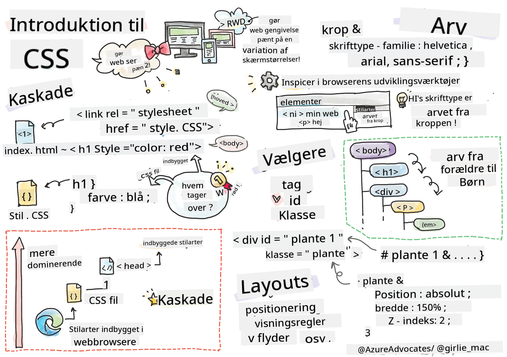
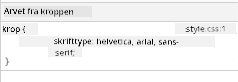
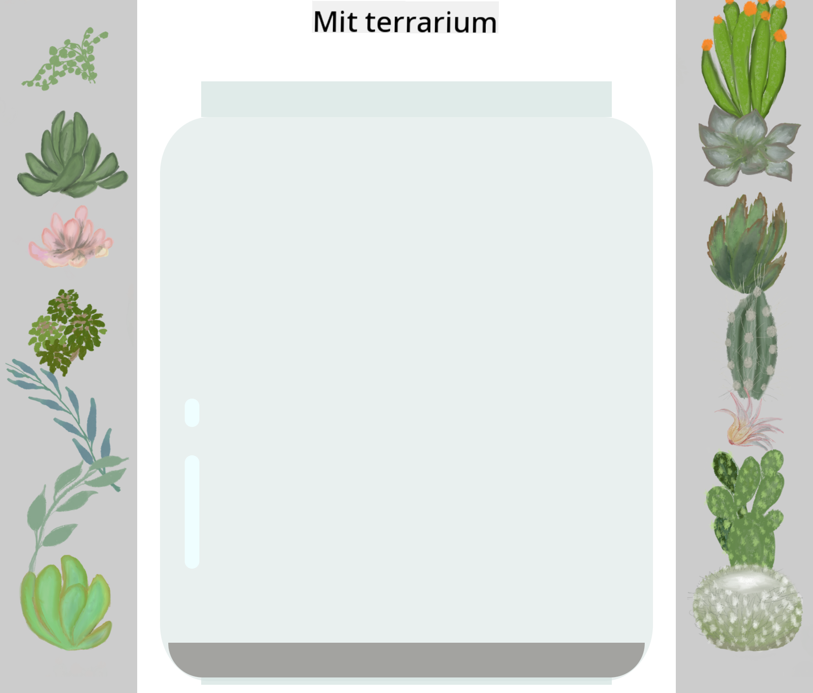

<!--
CO_OP_TRANSLATOR_METADATA:
{
  "original_hash": "e375c2aeb94e2407f2667633d39580bd",
  "translation_date": "2025-08-26T21:37:16+00:00",
  "source_file": "3-terrarium/2-intro-to-css/README.md",
  "language_code": "da"
}
-->
# Terrarium Projekt Del 2: Introduktion til CSS


> Sketchnote af [Tomomi Imura](https://twitter.com/girlie_mac)

## Quiz før lektionen

[Quiz før lektionen](https://ff-quizzes.netlify.app/web/quiz/17)

### Introduktion

CSS, eller Cascading Style Sheets, løser et vigtigt problem inden for webudvikling: hvordan man får sin hjemmeside til at se flot ud. Styling af dine apps gør dem mere brugervenlige og visuelt tiltalende; du kan også bruge CSS til at skabe Responsive Web Design (RWD) - så dine apps ser godt ud, uanset hvilken skærmstørrelse de vises på. CSS handler ikke kun om at få din app til at se flot ud; specifikationen inkluderer også animationer og transformationer, der kan muliggøre avancerede interaktioner for dine apps. CSS Working Group hjælper med at vedligeholde de aktuelle CSS-specifikationer; du kan følge deres arbejde på [World Wide Web Consortiums hjemmeside](https://www.w3.org/Style/CSS/members).

> Bemærk, CSS er et sprog, der udvikler sig, ligesom alt andet på nettet, og ikke alle browsere understøtter de nyeste dele af specifikationen. Tjek altid dine implementeringer ved at konsultere [CanIUse.com](https://caniuse.com).

I denne lektion vil vi tilføje styles til vores online terrarium og lære mere om flere CSS-koncepter: kaskade, arv, brug af selektorer, positionering og brug af CSS til at bygge layouts. Undervejs vil vi layoutet terrariet og skabe selve terrariet.

### Forudsætning

Du bør have HTML'en til dit terrarium klar og klar til at blive stylet.

> Se video

> 
> [](https://www.youtube.com/watch?v=6yIdOIV9p1I)

### Opgave

I din terrarium-mappe skal du oprette en ny fil kaldet `style.css`. Importer den fil i `<head>`-sektionen:

```html
<link rel="stylesheet" href="./style.css" />
```

---

## Kaskaden

Cascading Style Sheets inkorporerer ideen om, at styles 'kaskader', sådan at anvendelsen af en style styres af dens prioritet. Styles, der er sat af en websideforfatter, har prioritet over dem, der er sat af en browser. Styles, der er sat 'inline', har prioritet over dem, der er sat i et eksternt stylesheet.

### Opgave

Tilføj den inline style "color: red" til din `<h1>`-tag:

```HTML
<h1 style="color: red">My Terrarium</h1>
```

Tilføj derefter følgende kode til din `style.css`-fil:

```CSS
h1 {
 color: blue;
}
```

✅ Hvilken farve vises i din webapp? Hvorfor? Kan du finde en måde at tilsidesætte styles? Hvornår ville du ønske at gøre dette, eller hvorfor ikke?

---

## Arv

Styles arves fra en forfader til en efterkommer, sådan at indlejrede elementer arver deres forældres styles.

### Opgave

Sæt kroppens font til en given font, og tjek for at se en indlejret elements font:

```CSS
body {
	font-family: helvetica, arial, sans-serif;
}
```

Åbn din browsers konsol til 'Elements'-fanen og observer H1's font. Den arver sin font fra kroppen, som angivet inden for browseren:



✅ Kan du få en indlejret style til at arve en anden egenskab?

---

## CSS-selektorer

### Tags

Indtil videre har din `style.css`-fil kun få tags stylet, og appen ser ret mærkelig ud:

```CSS
body {
	font-family: helvetica, arial, sans-serif;
}

h1 {
	color: #3a241d;
	text-align: center;
}
```

Denne måde at style et tag på giver dig kontrol over unikke elementer, men du har brug for at kontrollere styles for mange planter i dit terrarium. For at gøre dette skal du bruge CSS-selektorer.

### Id'er

Tilføj noget style for at layoutet venstre og højre containere. Da der kun er én venstre container og én højre container, får de id'er i markupen. For at style dem skal du bruge `#`:

```CSS
#left-container {
	background-color: #eee;
	width: 15%;
	left: 0px;
	top: 0px;
	position: absolute;
	height: 100%;
	padding: 10px;
}

#right-container {
	background-color: #eee;
	width: 15%;
	right: 0px;
	top: 0px;
	position: absolute;
	height: 100%;
	padding: 10px;
}
```

Her har du placeret disse containere med absolut positionering yderst til venstre og højre på skærmen og brugt procenter for deres bredde, så de kan skalere til små mobilskærme.

✅ Denne kode er ret gentaget, og derfor ikke "DRY" (Don't Repeat Yourself); kan du finde en bedre måde at style disse id'er på, måske med et id og en klasse? Du ville skulle ændre markupen og refaktorere CSS'en:

```html
<div id="left-container" class="container"></div>
```

### Klasser

I eksemplet ovenfor styrede du to unikke elementer på skærmen. Hvis du vil have styles til at gælde for mange elementer på skærmen, kan du bruge CSS-klasser. Gør dette for at layoutet planterne i de venstre og højre containere.

Bemærk, at hver plante i HTML-markupen har en kombination af id'er og klasser. Id'erne her bruges af JavaScript, som du vil tilføje senere for at manipulere terrarium-plantens placering. Klasserne giver derimod alle planterne en given style.

```html
<div class="plant-holder">
	
</div>
```

Tilføj følgende til din `style.css`-fil:

```CSS
.plant-holder {
	position: relative;
	height: 13%;
	left: -10px;
}

.plant {
	position: absolute;
	max-width: 150%;
	max-height: 150%;
	z-index: 2;
}
```

Bemærkelsesværdigt i dette snippet er blandingen af relativ og absolut positionering, som vi vil dække i næste sektion. Tag et kig på, hvordan højder håndteres med procenter:

Du sætter højden på planteholderen til 13%, et godt tal for at sikre, at alle planterne vises i hver vertikal container uden behov for scrolling.

Du sætter planteholderen til at flytte til venstre for at gøre planterne mere centrerede inden for deres container. Billederne har en stor mængde gennemsigtig baggrund for at gøre dem mere dragbare, så de skal skubbes til venstre for at passe bedre på skærmen.

Derefter får selve planten en max-bredde på 150%. Dette gør det muligt for den at skalere ned, når browseren skaleres ned. Prøv at ændre størrelsen på din browser; planterne forbliver i deres containere, men skaleres ned for at passe.

Også bemærkelsesværdigt er brugen af z-index, som styrer den relative højde af et element (så planterne sidder oven på containeren og ser ud til at sidde inde i terrariet).

✅ Hvorfor har du brug for både en planteholder og en plante CSS-selektor?

## CSS-positionering

At blande positioneringsegenskaber (der er statiske, relative, faste, absolutte og klæbrige positioner) kan være lidt tricky, men når det gøres korrekt, giver det dig god kontrol over elementerne på dine sider.

Absolut positionerede elementer er positioneret relativt til deres nærmeste positionerede forfædre, og hvis der ikke er nogen, positioneres de i forhold til dokumentets krop.

Relativt positionerede elementer er positioneret baseret på CSS'ens instruktioner om at justere deres placering væk fra deres oprindelige position.

I vores eksempel er `plant-holder` et relativt positioneret element, der er positioneret inden for en absolut positioneret container. Den resulterende adfærd er, at sidebjælkecontainerne er fastgjort til venstre og højre, og planteholderen er indlejret, justerer sig selv inden for sidebjælkerne og giver plads til, at planterne kan placeres i en vertikal række.

> Selve `plant` har også absolut positionering, hvilket er nødvendigt for at gøre det dragbart, som du vil opdage i næste lektion.

✅ Eksperimenter med at skifte typerne af positionering af sidecontainerne og planteholderen. Hvad sker der?

## CSS-layouts

Nu vil du bruge det, du har lært, til at bygge selve terrariet, alt sammen ved hjælp af CSS!

Først skal du style `.terrarium` div-børnene som en afrundet rektangel ved hjælp af CSS:

```CSS
.jar-walls {
	height: 80%;
	width: 60%;
	background: #d1e1df;
	border-radius: 1rem;
	position: absolute;
	bottom: 0.5%;
	left: 20%;
	opacity: 0.5;
	z-index: 1;
}

.jar-top {
	width: 50%;
	height: 5%;
	background: #d1e1df;
	position: absolute;
	bottom: 80.5%;
	left: 25%;
	opacity: 0.7;
	z-index: 1;
}

.jar-bottom {
	width: 50%;
	height: 1%;
	background: #d1e1df;
	position: absolute;
	bottom: 0%;
	left: 25%;
	opacity: 0.7;
}

.dirt {
	width: 60%;
	height: 5%;
	background: #3a241d;
	position: absolute;
	border-radius: 0 0 1rem 1rem;
	bottom: 1%;
	left: 20%;
	opacity: 0.7;
	z-index: -1;
}
```

Bemærk brugen af procenter her. Hvis du skalerer din browser ned, kan du se, hvordan glasset også skaleres. Bemærk også bredderne og højderne i procenter for glaselementerne og hvordan hvert element er absolut positioneret i midten, fastgjort til bunden af visningsområdet.

Vi bruger også `rem` til border-radius, en font-relativ længde. Læs mere om denne type relative målinger i [CSS-specifikationen](https://www.w3.org/TR/css-values-3/#font-relative-lengths).

✅ Prøv at ændre glassets farver og opacitet i forhold til jordens. Hvad sker der? Hvorfor?

---

## 🚀Udfordring

Tilføj en 'boble'-glans til det nederste venstre område af glasset for at få det til at se mere glasagtigt ud. Du vil style `.jar-glossy-long` og `.jar-glossy-short` til at ligne en reflekteret glans. Sådan ville det se ud:



For at fuldføre quizzen efter lektionen, gå igennem dette Learn-modul: [Style din HTML-app med CSS](https://docs.microsoft.com/learn/modules/build-simple-website/4-css-basics/?WT.mc_id=academic-77807-sagibbon)

## Quiz efter lektionen

[Quiz efter lektionen](https://ff-quizzes.netlify.app/web/quiz/18)

## Gennemgang & Selvstudie

CSS virker tilsyneladende ligetil, men der er mange udfordringer, når man forsøger at style en app perfekt til alle browsere og alle skærmstørrelser. CSS-Grid og Flexbox er værktøjer, der er udviklet for at gøre arbejdet lidt mere struktureret og mere pålideligt. Lær om disse værktøjer ved at spille [Flexbox Froggy](https://flexboxfroggy.com/) og [Grid Garden](https://codepip.com/games/grid-garden/).

## Opgave

[CSS Refaktorering](assignment.md)

---

**Ansvarsfraskrivelse**:  
Dette dokument er blevet oversat ved hjælp af AI-oversættelsestjenesten [Co-op Translator](https://github.com/Azure/co-op-translator). Selvom vi bestræber os på at opnå nøjagtighed, skal du være opmærksom på, at automatiserede oversættelser kan indeholde fejl eller unøjagtigheder. Det originale dokument på dets oprindelige sprog bør betragtes som den autoritative kilde. For kritisk information anbefales professionel menneskelig oversættelse. Vi påtager os ikke ansvar for eventuelle misforståelser eller fejltolkninger, der måtte opstå som følge af brugen af denne oversættelse.