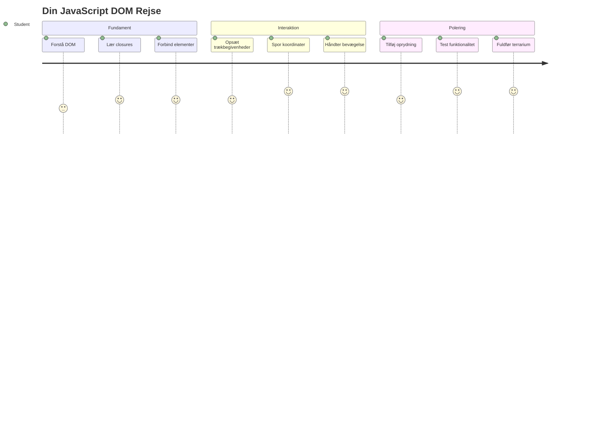
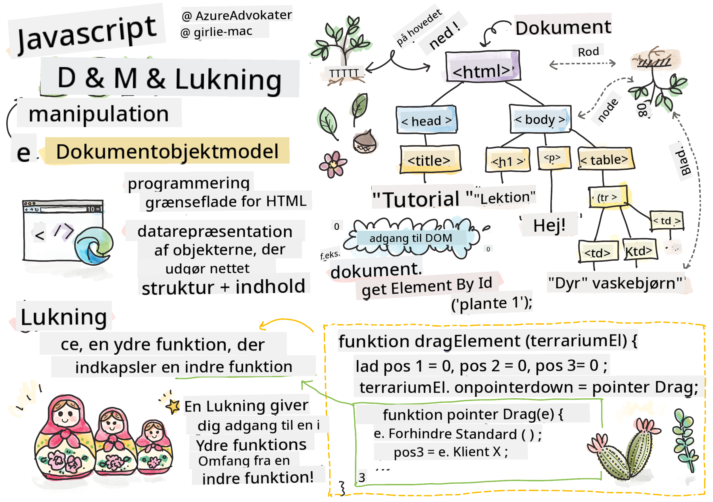
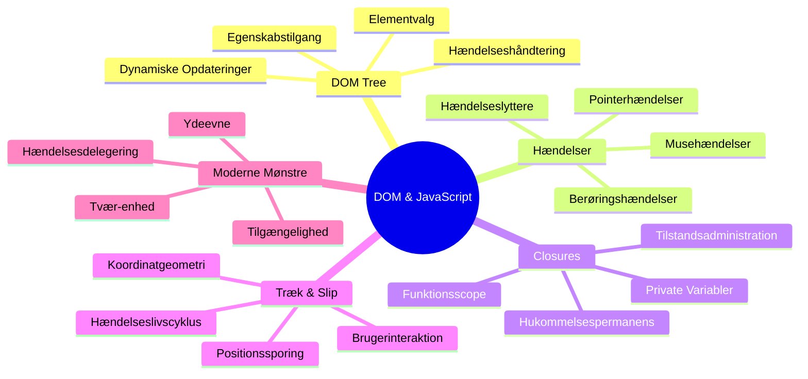
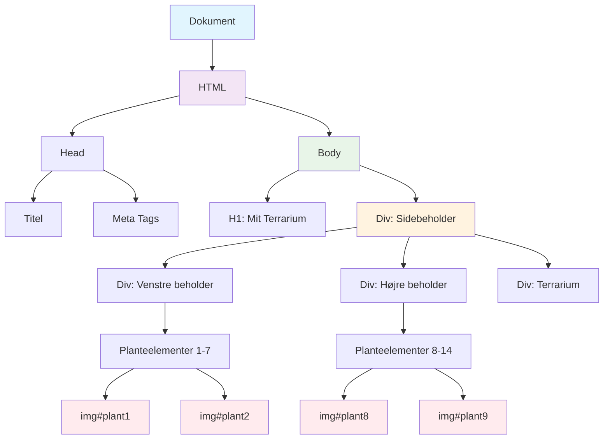
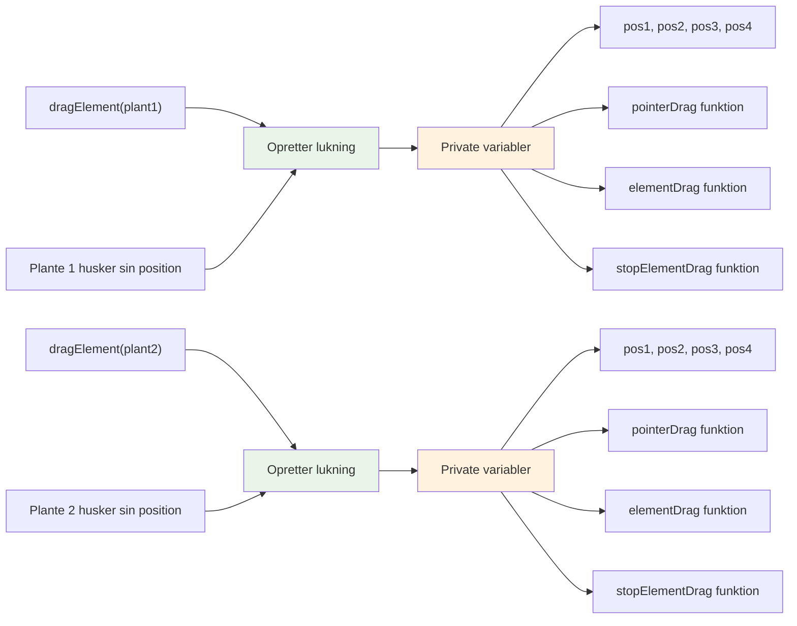
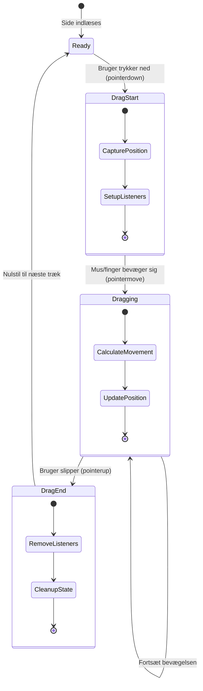
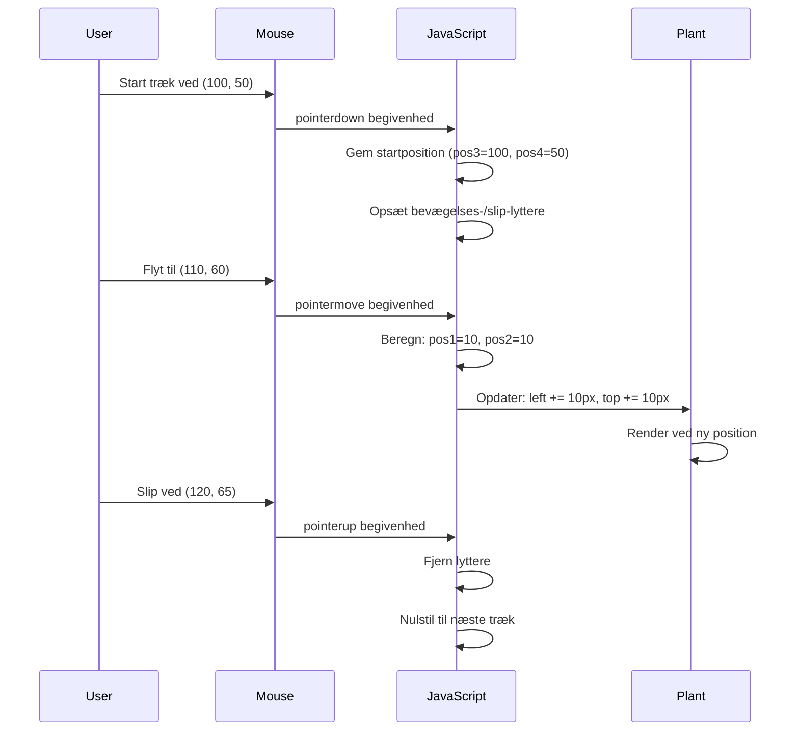
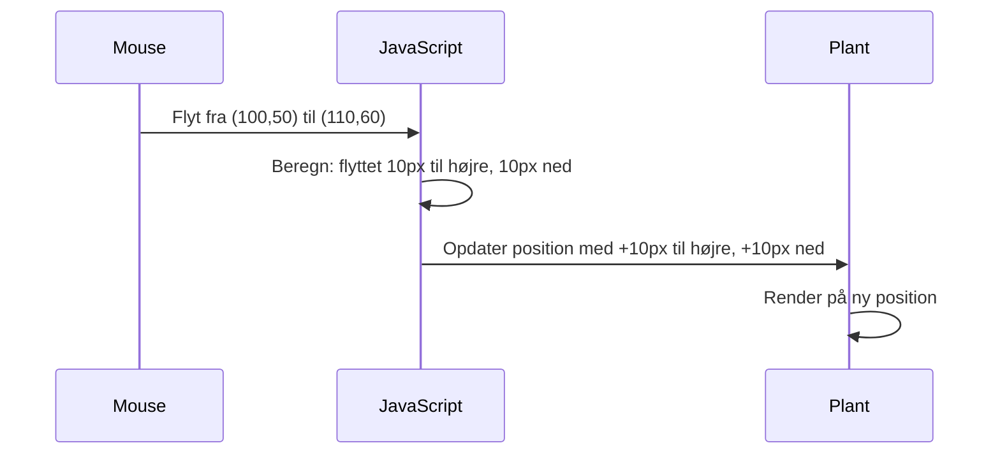
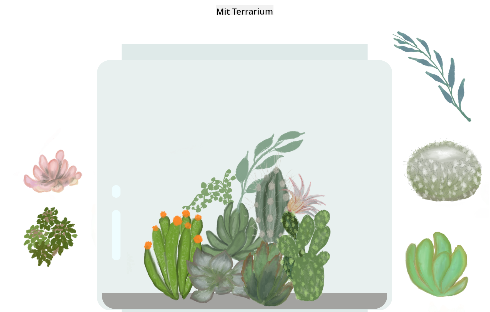
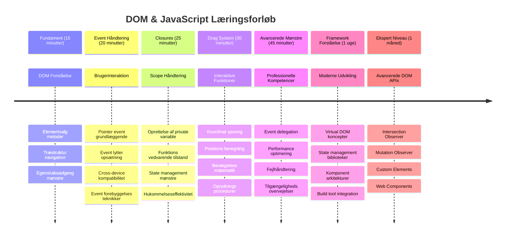

<!--
CO_OP_TRANSLATOR_METADATA:
{
  "original_hash": "973e48ad87d67bf5bb819746c9f8e302",
  "translation_date": "2026-01-06T23:58:12+00:00",
  "source_file": "3-terrarium/3-intro-to-DOM-and-closures/README.md",
  "language_code": "da"
}
-->
# Terrarium Projekt Del 3: DOM-manipulation og JavaScript Closures



> Sketchnote af [Tomomi Imura](https://twitter.com/girlie_mac)

Velkommen til en af de mest engagerende aspekter af webudvikling - at gøre ting interaktive! Document Object Model (DOM) er som en bro mellem dit HTML og JavaScript, og i dag bruger vi det til at bringe dit terrarium til live. Da Tim Berners-Lee skabte den første webbrowser, forestillede han sig et web, hvor dokumenter kunne være dynamiske og interaktive - DOM gør denne vision mulig.

Vi vil også udforske JavaScript closures, som måske lyder skræmmende til at begynde med. Tænk på closures som at skabe "hukommelseslommer", hvor dine funktioner kan huske vigtig information. Det er som om hver plante i dit terrarium har sin egen dataoptegnelse til at spore sin position. Ved slutningen af denne lektion vil du forstå, hvor naturlige og nyttige de er.

Her er, hvad vi bygger: et terrarium, hvor brugere kan trække og slippe planter hvor som helst de ønsker. Du vil lære DOM-manipulationsteknikker, som driver alt fra træk-og-slip filuploads til interaktive spil. Lad os få dit terrarium til at leve.


## Før-forelæsning Quiz

[Før-forelæsning quiz](https://ff-quizzes.netlify.app/web/quiz/19)

## Forståelse af DOM: Din port til interaktive websider

Document Object Model (DOM) er, hvordan JavaScript kommunikerer med dine HTML-elementer. Når din browser loader en HTML-side, skaber den en struktureret repræsentation af siden i hukommelsen - det er DOM'en. Tænk på det som et familie-træ, hvor hvert HTML-element er et familiemedlem, som JavaScript kan få adgang til, ændre eller omarrangere.

DOM-manipulation forvandler statiske sider til interaktive hjemmesider. Hver gang du ser en knap skifte farve ved hover, indhold opdatere uden sideopdatering, eller elementer du kan trække rundt, er det DOM-manipulation, der arbejder.




> En repræsentation af DOM og den HTML markup, som henviser til den. Fra [Olfa Nasraoui](https://www.researchgate.net/publication/221417012_Profile-Based_Focused_Crawler_for_Social_Media-Sharing_Websites)

**Det der gør DOM kraftfuld:**
- **Giver** en struktureret måde at få adgang til ethvert element på din side
- **Muliggør** dynamiske indholdsopdateringer uden sideopdateringer
- **Tillader** realtidsrespons til brugerinteraktioner som klik og træk
- **Skaber** fundamentet for moderne interaktive webapplikationer

## JavaScript Closures: Skabe organiseret, kraftfuld kode

En [JavaScript closure](https://developer.mozilla.org/docs/Web/JavaScript/Closures) er som at give en funktion sit eget private arbejdsområde med vedvarende hukommelse. Tænk på, hvordan Darwins finker på Galápagosøerne hver udviklede specialiserede næb baseret på deres specifikke miljø – closures fungerer på samme måde, ved at skabe specialiserede funktioner, der "husker" deres specifikke kontekst, selv efter deres overordnede funktion er færdig.

I vores terrarium hjælper closures hver plante med at huske sin egen position uafhængigt. Dette mønster optræder gennem hele professionel JavaScript-udvikling, og gør det til et værdifuldt koncept at forstå.


> 💡 **Forståelse af Closures**: Closures er et væsentligt emne i JavaScript, og mange udviklere bruger år på at forstå alle de teoretiske aspekter fuldt ud. I dag fokuserer vi på praktisk anvendelse – du vil se closures naturligt opstå, når vi bygger vores interaktive funktioner. Forståelsen udvikler sig, når du ser, hvordan de løser virkelige problemer.


> En repræsentation af DOM og den HTML markup, som henviser til den. Fra [Olfa Nasraoui](https://www.researchgate.net/publication/221417012_Profile-Based_Focused_Crawler_for_Social_Media-Sharing_Websites)

I denne lektion vil vi færdiggøre vores interaktive terrariumprojekt ved at skabe JavaScript, som tillader brugeren at manipulere planterne på siden.

## Før vi begynder: Forberedelse til succes

Du får brug for dine HTML- og CSS-filer fra de tidligere terrarium-lektioner - vi er ved at gøre det statiske design interaktivt. Hvis du er med for første gang, vil det være vigtigt at gennemføre disse før for vigtig kontekst.

Her er, hvad vi bygger:
- **Glidende træk-og-slip** for alle terrariumplanter
- **Koordinatsporing**, så planter husker deres positioner
- **Et komplet interaktivt interface** med vanilla JavaScript
- **Ren, organiseret kode** med closure-mønstre

## Opsætning af din JavaScript-fil

Lad os oprette JavaScript-filen, der vil gøre dit terrarium interaktivt.

**Trin 1: Opret din script-fil**

I din terrarium-mappe opret en ny fil kaldet `script.js`.

**Trin 2: Link JavaScript til dit HTML**

Tilføj dette script-tag til `<head>` sektionen i din `index.html` fil:

```html
<script src="./script.js" defer></script>
```

**Hvorfor `defer` attributten er vigtig:**
- **Sikrer**, at din JavaScript venter, indtil alt HTML er indlæst
- **Forhindrer** fejl, hvor JavaScript leder efter elementer, der ikke er klar endnu
- **Garantérer**, at alle dine planteelementer er tilgængelige for interaktion
- **Giver** bedre ydeevne end at placere scripts nederst på siden

> ⚠️ **Vigtig bemærkning**: `defer` attributten forhindrer almindelige timing-problemer. Uden den kan JavaScript forsøge at tilgå HTML-elementer, før de er indlæst, hvilket forårsager fejl.

---

## Tilslut JavaScript til dine HTML-elementer

Før vi kan gøre elementer trækbare, skal JavaScript finde dem i DOM’en. Tænk på dette som et bibliotekssystem - når du har katalognummeret, kan du finde præcis den bog, du har brug for, og få adgang til alt dens indhold.

Vi vil bruge `document.getElementById()` metoden til at skabe disse forbindelser. Det er som at have et præcist arkivsystem - du giver et ID, og det lokaliserer præcis det element, du har brug for i dit HTML.

### Aktivering af trækfunktionalitet for alle planter

Tilføj denne kode til din `script.js` fil:

```javascript
// Aktivér trækfunktionalitet for alle 14 planter
dragElement(document.getElementById('plant1'));
dragElement(document.getElementById('plant2'));
dragElement(document.getElementById('plant3'));
dragElement(document.getElementById('plant4'));
dragElement(document.getElementById('plant5'));
dragElement(document.getElementById('plant6'));
dragElement(document.getElementById('plant7'));
dragElement(document.getElementById('plant8'));
dragElement(document.getElementById('plant9'));
dragElement(document.getElementById('plant10'));
dragElement(document.getElementById('plant11'));
dragElement(document.getElementById('plant12'));
dragElement(document.getElementById('plant13'));
dragElement(document.getElementById('plant14'));
```

**Dette opnår denne kode:**
- **Lokaliserer** hvert planteelement i DOM med dets unikke ID
- **Henter** en JavaScript reference til hvert HTML-element
- **Videregiver** hvert element til en `dragElement` funktion (som vi opretter næste)
- **Forbereder** hver plante til træk-og-slip interaktion
- **Forbinder** din HTML-struktur med JavaScript funktionalitet

> 🎯 **Hvorfor bruge IDs i stedet for klasser?** IDs giver unikke identifikatorer til specifikke elementer, mens CSS-klasser er designet til at style grupper af elementer. Når JavaScript skal manipulere individuelle elementer, giver IDs den præcision og ydeevne, vi har brug for.

> 💡 **Pro tip**: Bemærk, hvordan vi kalder `dragElement()` for hver plante individuelt. Denne tilgang sikrer, at hver plante får sin egen uafhængige træk-opførsel, hvilket er essentielt for en glidende brugeroplevelse.

### 🔄 **Pædagogisk kontrol**
**Forståelse af DOM-forbindelse:** Før vi går videre til trækfunktionalitet, bekræft at du kan:
- ✅ Forklare, hvordan `document.getElementById()` lokaliserer HTML-elementer
- ✅ Forstå hvorfor vi bruger unikke IDs til hver plante
- ✅ Beskrive formålet med `defer` attributten i script-tags
- ✅ Genkende, hvordan JavaScript og HTML forbindes via DOM

**Hurtig selvtest:** Hvad vil ske, hvis to elementer har samme ID? Hvorfor returnerer `getElementById()` kun ét element?
*Svar: IDs skal være unikke; hvis duplikeret returneres kun det første element*

---

## Bygning af dragElement Closure

Nu vil vi skabe kernen i vores trækfunktionalitet: en closure, som styrer træk-adfærden for hver plante. Denne closure vil indeholde flere indre funktioner, som arbejder sammen om at spore musens bevægelser og opdatere elementpositioner.

Closures er perfekte til denne opgave, fordi de tillader os at skabe "private" variabler, der bevares mellem funktionskald og giver hver plante sit eget uafhængige koordinatsporingssystem.

### Forstå closures med et simpelt eksempel

Lad mig vise closures med et simpelt eksempel, som illustrerer konceptet:

```javascript
function createCounter() {
    let count = 0; // Dette er ligesom en privat variabel
    
    function increment() {
        count++; // Den indre funktion husker den ydre variabel
        return count;
    }
    
    return increment; // Vi giver den indre funktion tilbage
}

const myCounter = createCounter();
console.log(myCounter()); // 1
console.log(myCounter()); // 2
```

**Det der sker i dette closure-mønster:**
- **Opretter** en privat `count` variabel, som kun eksisterer inden for denne closure
- **Den indre funktion** kan tilgå og ændre denne ydre variabel (closure mekanismen)
- **Når vi returnerer** den indre funktion, bevares dens forbindelse til disse private data
- **Selv efter** `createCounter()` er færdig med at køre, bevares og huskes `count` sin værdi

### Hvorfor closures er perfekte til trækfunktionalitet

Til vores terrarium har hver plante brug for at huske sine aktuelle positionkoordinater. Closures giver den perfekte løsning:

**Vigtige fordele for vores projekt:**
- **Bevarer** private positionvariabler for hver plante uafhængigt
- **Opholder** koordinatdata mellem træk-begivenheder
- **Forhindrer** variabelkonflikter mellem forskellige trækbare elementer
- **Skaber** ren, organiseret kode

> 🎯 **Læringsmål**: Du behøver ikke mestre alle aspekter af closures lige nu. Fokuser på at se, hvordan de hjælper os med at organisere kode og bevare tilstand for vores trækfunktionalitet.


### Opret dragElement Funktionen

Lad os bygge hovedfunktionen, der håndterer al træk-logikken. Tilføj denne funktion under dine plante-elementer:

```javascript
function dragElement(terrariumElement) {
    // Initialiser positionstrackningsvariabler
    let pos1 = 0,  // Forrige muse X-position
        pos2 = 0,  // Forrige muse Y-position
        pos3 = 0,  // Nuværende muse X-position
        pos4 = 0;  // Nuværende muse Y-position
    
    // Opsæt den indledende træk-begivenhedslytter
    terrariumElement.onpointerdown = pointerDrag;
}
```

**Forstå positionsporingssystemet:**
- **`pos1` og `pos2`**: Gemmer forskellen mellem gamle og nye musepositioner
- **`pos3` og `pos4`**: Sporer aktuelle musekoordinater
- **`terrariumElement`**: Det specifikke planteelement, vi gør trækbart
- **`onpointerdown`**: Begivenheden, der trigges, når brugeren begynder at trække

**Sådan virker closure-mønsteret:**
- **Opretter** private positionvariabler for hvert planteelement
- **Bevarer** disse variabler gennem hele træk-livscyklussen
- **Sikrer** at hver plante sporer sine egne koordinater uafhængigt
- **Giver** en ren grænseflade via `dragElement` funktionen

### Hvorfor bruge pointer-events?

Du tænker måske, hvorfor vi bruger `onpointerdown` i stedet for det mere kendte `onclick`. Her er forklaringen:

| Begivenhedstype | Bedst til | Ulempen |
|------------|----------|-------------|
| `onclick` | Simpel knapklik | Kan ikke håndtere træk (kun klik og slip) |
| `onpointerdown` | Både mus og touch | Nyere, men godt understøttet i dag |
| `onmousedown` | Kun desktop mus | Udelukker mobilbrugere |

**Hvorfor pointer-events er perfekte til vores projekt:**
- **Fungerer godt** både med mus, finger eller stylus
- **Føles ens** på laptop, tablet eller telefon
- **Håndterer** selve trækbevægelserne (ikke bare klik og færdig)
- **Skaber** en glidende oplevelse, som moderne webapps forventer

> 💡 **Fremtidssikring**: Pointer-events er den moderne måde at håndtere brugerinteraktioner på. I stedet for at skrive separat kode til mus og touch får du begge dele gratis. Ret smart, ikke?

### 🔄 **Pædagogisk kontrol**
**Forståelse af begivenhedshåndtering:** Hold en pause og bekræft din forståelse af begivenheder:
- ✅ Hvorfor bruger vi pointer-events i stedet for mus-begivenheder?
- ✅ Hvordan bevares closure-variable mellem funktionskald?
- ✅ Hvilken rolle spiller `preventDefault()` i glidende træk?
- ✅ Hvorfor tilføjer vi event-lyttere til dokumentet i stedet for individuelle elementer?

**Virkelighedsforbindelse:** Tænk på træk-og-slip interfaces, du bruger dagligt:
- **Filuploads**: Træk filer ind i browseren
- **Kanban-tavler**: Flyt opgaver mellem kolonner
- **Billedgallerier**: Omarranger rækkefølgen på fotos
- **Mobile interfaces**: Swipe og træk på touchskærme

---

## pointerDrag Funktionen: Fanger starten på et træk

Når en bruger trykker ned på en plante (uanset om det er med mus eller finger), sættes `pointerDrag` funktionen i gang. Denne funktion fanger de indledende koordinater og forbereder træk-systemet.

Tilføj denne funktion inde i din `dragElement` closure, lige efter linjen `terrariumElement.onpointerdown = pointerDrag;`:

```javascript
function pointerDrag(e) {
    // Forhindre standard browseradfærd (som tekstmarkering)
    e.preventDefault();
    
    // Registrer den oprindelige mus-/berøringsposition
    pos3 = e.clientX;  // X koordinat hvor træk startede
    pos4 = e.clientY;  // Y koordinat hvor træk startede
    
    // Opsæt event-lyttere til trækprocessen
    document.onpointermove = elementDrag;
    document.onpointerup = stopElementDrag;
}
```

**Trin for trin sker følgende:**
- **Forhindrer** browserens standardadfærd, som kunne genere trækningen
- **Optager** de præcise koordinater, hvor brugeren startede træk-gestus
- **Opretter** event-lyttere til den igangværende trækbevægelse
- **Forbereder** systemet til at spore mus-/fingerbevægelse over hele dokumentet

### Forståelse af event prevention

Linjen `e.preventDefault()` er afgørende for glat træk:

**Uden prevention kan browsere:**
- **Markere** tekst, når der trækkes over siden
- **Åbne** kontekstmenuer ved højreklik træk
- **Forstyrre** vores brugerdefinerede trækadfærd
- **Skabe** visuelle artefakter under trækoperationen

> 🔍 **Eksperiment:** Når du har fuldført denne lektion, prøv at fjerne `e.preventDefault()` og se, hvordan det påvirker trækoplevelsen. Så forstår du hurtigt, hvorfor denne linje er vigtig!

### Koordinatsporingssystem

`e.clientX` og `e.clientY` egenskaberne giver os præcise mus-/touch-koordinater:

| Egenskab | Hvad måles | Brugssituation |
|----------|------------|---------------|
| `clientX` | Vandret position relativt til viewport | Sporing af venstre-højre bevægelse |
| `clientY` | Lodret position relativt til viewport | Sporing af op-ned bevægelse |
**Forstå disse koordinater:**
- **Giver** pixel-præcis placeringsinformation
- **Opdateres** i realtid, mens brugeren bevæger sin markør
- **Forbliver** konsistent på tværs af forskellige skærmstørrelser og zoomniveauer
- **Muliggør** glidende, responsive træk-interaktioner

### Opsætning af dokumentniveau event-lyttere

Bemærk, hvordan vi tilføjer move- og stop-events til hele `document`, ikke kun planteelementet:

```javascript
document.onpointermove = elementDrag;
document.onpointerup = stopElementDrag;
```

**Hvorfor tilføje til dokumentet:**
- **Fortsætter** sporing, selv når musen forlader planteelementet
- **Forhindrer** afbrydelse af træk, hvis brugeren bevæger sig hurtigt
- **Giver** glidende træk på tværs af hele skærmen
- **Håndterer** kanttilfælde, hvor cursoren bevæger sig uden for browser-vinduet

> ⚡ **Ydelsesnote**: Vi rydder op i disse dokumentniveau-lyttere, når træk stopper for at undgå hukommelseslækager og ydeevneproblemer.

## Fuldførelse af træk-systemet: Bevægelse og oprydning

Nu tilføjer vi de to sidste funktioner, der håndterer selve træk-bevægelsen og oprydningen, når trækket stopper. Disse funktioner arbejder sammen om at skabe glidende, responsive plantebevægelser på dit terrarium.

### elementDrag-funktionen: Sporing af bevægelse

Tilføj `elementDrag`-funktionen lige efter lukningen af `pointerDrag`-krølleparentesen:

```javascript
function elementDrag(e) {
    // Beregn den tilbagelagte afstand siden sidste begivenhed
    pos1 = pos3 - e.clientX;  // Vandret tilbagelagt afstand
    pos2 = pos4 - e.clientY;  // Lodret tilbagelagt afstand
    
    // Opdater den nuværende positionssporing
    pos3 = e.clientX;  // Ny nuværende X-position
    pos4 = e.clientY;  // Ny nuværende Y-position
    
    // Anvend bevægelsen på elementets position
    terrariumElement.style.top = (terrariumElement.offsetTop - pos2) + 'px';
    terrariumElement.style.left = (terrariumElement.offsetLeft - pos1) + 'px';
}
```

**Forstå koordinat-matematikken:**
- **`pos1` og `pos2`**: Beregner, hvor langt musen er flyttet siden sidste opdatering
- **`pos3` og `pos4`**: Gemmer musens nuværende position til næste beregning
- **`offsetTop` og `offsetLeft`**: Henter elementets aktuelle position på siden
- **Subtraktionslogik**: Flytter elementet med samme afstand, som musen er flyttet


**Her er bevægelsesberegningens opdeling:**
1. **Måler** forskellen mellem gamle og nye musepositioner
2. **Beregner** hvor meget elementet skal flyttes baseret på musebevægelsen
3. **Opdaterer** elementets CSS-positionsegenskaber i realtid
4. **Gemmer** den nye position som udgangspunkt for næste bevægelsesberegning

### Visuel repræsentation af matematikken


### stopElementDrag-funktionen: Oprydning

Tilføj oprydningsfunktionen efter lukningen af `elementDrag`-krølleparentesen:

```javascript
function stopElementDrag() {
    // Fjern dokumentniveauets begivenhedslyttere
    document.onpointerup = null;
    document.onpointermove = null;
}
```

**Hvorfor oprydning er vigtig:**
- **Forhindrer** hukommelseslækager fra hængende event-lyttere
- **Stopper** træk-adfærden, når brugeren slipper planten
- **Tillader** andre elementer at blive trukket uafhængigt
- **Nulstiller** systemet til næste trækoperation

**Hvad sker der uden oprydning:**
- Event-lyttere fortsætter med at køre, selv efter trækket er stoppet
- Ydelsen forringes, efterhånden som ubrugte lyttere hober sig op
- Uventet adfærd ved interaktion med andre elementer
- Browserressourcer spildes på unødvendig event-håndtering

### Forståelse af CSS-positions-egenskaber

Vores træk-system manipulerer to nøgle CSS-egenskaber:

| Egenskab | Hvad den styrer | Hvordan vi bruger den |
|----------|-----------------|----------------------|
| `top` | Afstand fra øverste kant | Vertikal position under træk |
| `left` | Afstand fra venstre kant | Horisontal position under træk |

**Vigtige indsigter om offset-egenskaber:**
- **`offsetTop`**: Aktuel afstand fra toppen af det positionerede overordnede element
- **`offsetLeft`**: Aktuel afstand fra venstre af det positionerede overordnede element
- **Positionskontekst**: Disse værdier er relative til nærmeste positionerede forfader
- **Real-time opdateringer**: Ændrer sig straks, når vi modificerer CSS-egenskaberne

> 🎯 **Designfilosofi**: Dette træk-system er bevidst fleksibelt – der er ingen "drop-zoner" eller begrænsninger. Brugere kan placere planter hvor som helst og have fuld kreativ kontrol over deres terrarium-design.

## Sammenfatning: Dit komplette træk-system

Tillykke! Du har lige bygget et avanceret drag-and-drop-system med vanilla JavaScript. Din komplette `dragElement` funktion indeholder nu et kraftfuldt closure, der håndterer:

**Hvad dit closure opnår:**
- **Bevarer** private positionsvariabler for hver plante uafhængigt
- **Håndterer** hele træk-livscyklussen fra start til slut
- **Giver** glidende, responsive bevægelser på hele skærmen
- **Rydder** op i ressourcer korrekt for at undgå hukommelseslækager
- **Skaber** en intuitiv, kreativ brugerflade til terrarium-design

### Test dit interaktive terrarium

Test nu dit interaktive terrarium! Åbn din `index.html` fil i en webbrowser og prøv funktionen:

1. **Klik og hold** på en plante for at starte trækket
2. **Bevæg musen eller fingeren**, og se planten følge glidende med
3. **Slip** for at placere planten i den nye position
4. **Eksperimenter** med forskellige arrangementer for at udforske brugerfladen

🥇 **Præstation**: Du har skabt en fuldt interaktiv webapplikation ved at bruge kernemekanismer, som professionelle udviklere anvender dagligt. Denne drag-and-drop-funktion bruger de samme principper som filuploads, kanban-tavler og mange andre interaktive brugerflader.

### 🔄 **Pædagogisk tjek**
**Fuld systemforståelse**: Verificer din beherskelse af hele træk-systemet:
- ✅ Hvordan bevarer closures uafhængig tilstand for hver plante?
- ✅ Hvorfor er koordinatberegningsmatematikken nødvendig for glidende bevægelse?
- ✅ Hvad ville ske, hvis vi glemte at rydde op i event-lyttere?
- ✅ Hvordan skalerer dette mønster til mere komplekse interaktioner?

**Refleksion over kodekvalitet**: Gennemgå din komplette løsning:
- **Modulært design**: Hver plante får sin egen closure-instans
- **Event-effektivitet**: Korrekt opsætning og oprydning af lyttere
- **Tvær-enheds support**: Virker på desktop og mobiler
- **Ydelsesbevidsthed**: Ingen hukommelseslækager eller overflødige beregninger



---

## GitHub Copilot Agent Challenge 🚀

Brug Agent-tilstand til at løse følgende udfordring:

**Beskrivelse:** Forbedr terrarium-projektet ved at tilføje en nulstillingsfunktion, som returnerer alle planter til deres oprindelige positioner med glidende animationer.

**Prompt:** Opret en nulstillingsknap, der ved klik animerer alle planter tilbage til deres oprindelige position i sidebaren ved hjælp af CSS-transitioner. Funktionen skal gemme de oprindelige positioner, når siden indlæses, og glidende flytte planterne tilbage til disse positioner over 1 sekund, når nulstillingsknappen trykkes.

Læs mere om [agent-tilstand](https://code.visualstudio.com/blogs/2025/02/24/introducing-copilot-agent-mode) her.

## 🚀 Ekstra udfordring: Udvid dine færdigheder

Klar til at løfte dit terrarium til næste niveau? Prøv at implementere disse forbedringer:

**Kreative udvidelser:**
- **Dobbeltklik** på en plante for at bringe den i front (z-indeks manipulation)
- **Tilføj visuel feedback** som et subtilt skær, når du holder musen over planter
- **Implementer grænser** for at forhindre planter i at blive trukket uden for terrariet
- **Lav en gemmefunktion** der husker plantepositioner ved hjælp af localStorage
- **Tilføj lydeffekter** ved afhentning og placering af planter

> 💡 **Læringsmulighed**: Hver af disse udfordringer vil lære dig nye aspekter af DOM-manipulation, event-håndtering og brugeroplevelsesdesign.

## Quiz efter forelæsning

[Quiz efter forelæsning](https://ff-quizzes.netlify.app/web/quiz/20)

## Gennemgang og selvstudie: Uddybe din forståelse

Du har mestret grundlæggende DOM-manipulation og closures, men der er altid mere at udforske! Her er nogle veje til at udvide din viden og dine færdigheder.

### Alternative drag and drop-tilgange

Vi brugte pointer events for maksimal fleksibilitet, men webudvikling tilbyder flere tilgange:

| Tilgang | Bedst til | Læringsværdi |
|----------|----------|--------------|
| [HTML Drag and Drop API](https://developer.mozilla.org/docs/Web/API/HTML_Drag_and_Drop_API) | Filuploads, formelle trækzoner | Forståelse af native browserfunktioner |
| [Touch Events](https://developer.mozilla.org/docs/Web/API/Touch_events) | Mobil-specifikke interaktioner | Mobil-først udviklingsmønstre |
| CSS `transform`-egenskaber | Glatte animationer | Ydelsesoptimeringsteknikker |

### Avancerede emner inden for DOM-manipulation

**Næste skridt i din læringsrejse:**
- **Event delegation**: Effektiv event-håndtering for flere elementer
- **Intersection Observer**: Registrere når elementer går ind/ud af viewport
- **Mutation Observer**: Observere ændringer i DOM-struktur
- **Web Components**: Skabe genanvendelige, indkapslede UI-elementer
- **Virtual DOM koncepter**: Forstå hvordan frameworks optimerer DOM-opdateringer

### Væsentlige ressourcer til fortsat læring

**Teknisk dokumentation:**
- [MDN Pointer Events Guide](https://developer.mozilla.org/docs/Web/API/Pointer_events) - Omfattende reference for pointer events
- [W3C Pointer Events-specifikation](https://www.w3.org/TR/pointerevents1/) - Officiel standarddokumentation
- [JavaScript Closures Deep Dive](https://developer.mozilla.org/docs/Web/JavaScript/Closures) - Avancerede closure-mønstre

**Browserkompatibilitet:**
- [CanIUse.com](https://caniuse.com/) - Tjek funktioners understøttelse i browsere
- [MDN Browser Compatibility Data](https://github.com/mdn/browser-compat-data) - Detaljerede kompatibilitetsoplysninger

**Øvelsesmuligheder:**
- **Byg** et puslespil med lignende træk-mekanikker
- **Lav** en kanban-tavle med drag-and-drop opgavestyring
- **Design** et billedgalleri med trækbare fotoarrangementer
- **Eksperimentér** med touch-gestures til mobilbrugerflader

> 🎯 **Læringsstrategi**: Den bedste måde at mestre disse koncepter er gennem praksis. Prøv at bygge variationer af trækbare brugerflader – hvert projekt vil lære dig noget nyt om brugerinteraktion og DOM-manipulation.

### ⚡ **Hvad du kan gøre i de næste 5 minutter**
- [ ] Åbn browserens DevTools og skriv `document.querySelector('body')` i konsollen
- [ ] Prøv at ændre tekst på en side ved hjælp af `innerHTML` eller `textContent`
- [ ] Tilføj en klik-eventlytter til en knap eller link på en side
- [ ] Inspicer DOM-strukturens træ i Elements-panelet

### 🎯 **Hvad du kan nå på en time**
- [ ] Fuldfør quizzen efter lektionen og gennemgå DOM-manipulationskoncepter
- [ ] Lav en interaktiv webside, der responderer på brugerklik
- [ ] Øv event-håndtering med forskellige event-typer (klik, mouseover, keypress)
- [ ] Byg en simpel to-do liste eller tæller med DOM-manipulation
- [ ] Udforsk relationen mellem HTML-elementer og JavaScript-objekter

### 📅 **Din uge-lange JavaScript-rejse**
- [ ] Fuldfør det interaktive terrarium-projekt med drag-and-drop funktionalitet
- [ ] Mest event delegation for effektiv event-håndtering
- [ ] Lær om event loop og asynkron JavaScript
- [ ] Øv closures ved at bygge moduler med privat tilstand
- [ ] Udforsk moderne DOM-API'er som Intersection Observer
- [ ] Byg interaktive komponenter uden frameworks

### 🌟 **Din månedslange JavaScript-mesterskab**
- [ ] Skab en kompleks single-page applikation med vanilla JavaScript
- [ ] Lær et moderne framework (React, Vue eller Angular) og sammenlign med vanilla DOM
- [ ] Bidrag til open source JavaScript-projekter
- [ ] Mest avancerede koncepter som web components og custom elements
- [ ] Byg ydedygtige webapplikationer med optimerede DOM-mønstre
- [ ] Undervis andre i DOM-manipulation og JavaScript-grundprincipper

## 🎯 Din JavaScript DOM-mesterskabs Tidslinje


### 🛠️ Din JavaScript værktøjskasse kort opsummering

Efter at have gennemført denne lektion, har du nu:
- **DOM-mesterskab**: Elementudvælgelse, ejendomshåndtering og trænavigation
- **Event-ekspertise**: Tvær-enheds interaktionshåndtering med pointer events
- **Closure-forståelse**: Privat tilstandsstyring og funktionspersistens
- **Interaktive systemer**: Kompleks drag-and-drop-implementering fra bunden
- **Ydelsesbevidsthed**: Korrekt oprydning af events og hukommelsesstyring
- **Moderne mønstre**: Kodeorganiseringsteknikker anvendt professionelt
- **Brugeroplevelse**: Skabelse af intuitive, responsive brugerflader

**Professionelle færdigheder opnået**: Du har bygget funktioner med samme teknikker som:
- **Trello/Kanban boards**: Korttræk mellem kolonner
- **Filupload-systemer**: Drag-and-drop filhåndtering
- **Billedgallerier**: Fotoarrangementsbrugerflader
- **Mobilapps**: Touch-baserede interaktionsmønstre

**Næste niveau**: Du er klar til at udforske moderne frameworks som React, Vue eller Angular, der bygger videre på disse grundlæggende DOM-manipulationskoncepter!

## Opgave

[Arbejd lidt mere med DOM](assignment.md)

---

<!-- CO-OP TRANSLATOR DISCLAIMER START -->
**Ansvarsfraskrivelse**:
Dette dokument er oversat ved hjælp af AI-oversættelsestjenesten [Co-op Translator](https://github.com/Azure/co-op-translator). Selvom vi bestræber os på nøjagtighed, bedes du være opmærksom på, at automatiserede oversættelser kan indeholde fejl eller unøjagtigheder. Det originale dokument på dets modersmål bør betragtes som den autoritative kilde. For kritisk information anbefales professionel menneskelig oversættelse. Vi påtager os intet ansvar for eventuelle misforståelser eller fejltolkninger, der opstår som følge af brugen af denne oversættelse.
<!-- CO-OP TRANSLATOR DISCLAIMER END -->