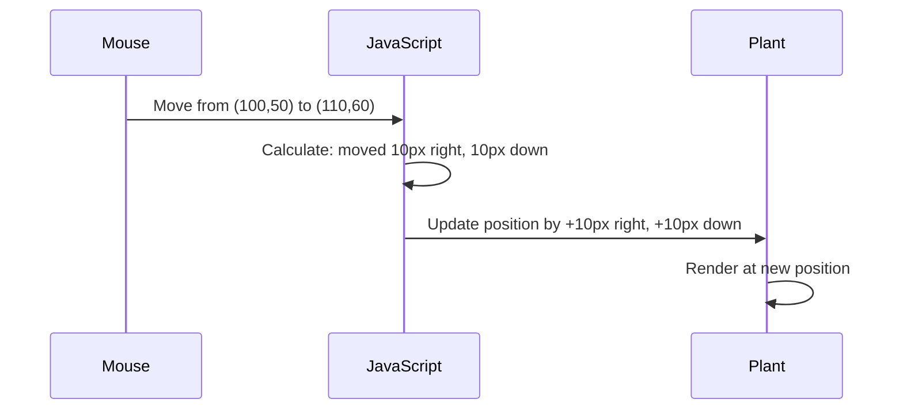

<!--
CO_OP_TRANSLATOR_METADATA:
{
  "original_hash": "bc93f6285423033ebf5b8abeb5282888",
  "translation_date": "2025-10-23T22:02:15+00:00",
  "source_file": "3-terrarium/3-intro-to-DOM-and-closures/README.md",
  "language_code": "da"
}
-->
# Terrarium Projekt Del 3: DOM-manipulation og JavaScript Closures


> Sketchnote af [Tomomi Imura](https://twitter.com/girlie_mac)

Velkommen til en af de mest engagerende aspekter af webudvikling - at gøre ting interaktive! Document Object Model (DOM) fungerer som en bro mellem din HTML og JavaScript, og i dag vil vi bruge det til at bringe dit terrarium til live. Da Tim Berners-Lee skabte den første webbrowser, forestillede han sig en web, hvor dokumenter kunne være dynamiske og interaktive - DOM gør den vision mulig.

Vi vil også udforske JavaScript closures, som måske lyder skræmmende i starten. Tænk på closures som "hukommelseslommer", hvor dine funktioner kan huske vigtig information. Det er som om hver plante i dit terrarium har sin egen dataregistrering til at spore sin position. Ved slutningen af denne lektion vil du forstå, hvor naturlige og nyttige de er.

Her er, hvad vi bygger: et terrarium, hvor brugere kan trække og slippe planter hvor som helst. Du vil lære DOM-manipulationsteknikker, der driver alt fra drag-and-drop filuploads til interaktive spil. Lad os få dit terrarium til at komme til live.

## Quiz før lektionen

[Quiz før lektionen](https://ff-quizzes.netlify.app/web/quiz/19)

## Forståelse af DOM: Din adgang til interaktive websider

Document Object Model (DOM) er, hvordan JavaScript kommunikerer med dine HTML-elementer. Når din browser indlæser en HTML-side, skaber den en struktureret repræsentation af den side i hukommelsen - det er DOM. Tænk på det som et stamtræ, hvor hvert HTML-element er et familiemedlem, som JavaScript kan få adgang til, ændre eller omarrangere.

DOM-manipulation forvandler statiske sider til interaktive websites. Hver gang du ser en knap skifte farve ved hover, indhold opdateres uden sideopfriskning, eller elementer du kan trække rundt, er det DOM-manipulation i aktion.


> En repræsentation af DOM og HTML-markeringen, der refererer til det. Fra [Olfa Nasraoui](https://www.researchgate.net/publication/221417012_Profile-Based_Focused_Crawler_for_Social_Media-Sharing_Websites)

**Her er, hvad der gør DOM kraftfuld:**
- **Giver** en struktureret måde at få adgang til ethvert element på din side
- **Muliggør** dynamiske indholdsopdateringer uden sideopfriskninger
- **Tillader** realtidsrespons på brugerinteraktioner som klik og træk
- **Skaber** fundamentet for moderne interaktive webapplikationer

## JavaScript Closures: Skab organiseret, kraftfuld kode

En [JavaScript closure](https://developer.mozilla.org/docs/Web/JavaScript/Closures) er som at give en funktion sin egen private arbejdsplads med vedvarende hukommelse. Tænk på, hvordan Darwins finker på Galápagos-øerne hver udviklede specialiserede næb baseret på deres specifikke miljø - closures fungerer på samme måde, og skaber specialiserede funktioner, der "husker" deres specifikke kontekst, selv efter deres overordnede funktion er afsluttet.

I vores terrarium hjælper closures hver plante med at huske sin egen position uafhængigt. Dette mønster optræder overalt i professionel JavaScript-udvikling, hvilket gør det til et værdifuldt koncept at forstå.

> 💡 **Forståelse af Closures**: Closures er et vigtigt emne i JavaScript, og mange udviklere bruger dem i årevis, før de fuldt ud forstår alle de teoretiske aspekter. I dag fokuserer vi på praktisk anvendelse - du vil se closures naturligt opstå, mens vi bygger vores interaktive funktioner. Forståelsen vil udvikle sig, når du ser, hvordan de løser reelle problemer.


> En repræsentation af DOM og HTML-markeringen, der refererer til det. Fra [Olfa Nasraoui](https://www.researchgate.net/publication/221417012_Profile-Based_Focused_Crawler_for_Social_Media-Sharing_Websites)

I denne lektion vil vi færdiggøre vores interaktive terrariumprojekt ved at skabe JavaScript, der giver en bruger mulighed for at manipulere planterne på siden.

## Før vi begynder: Forberedelse til succes

Du skal bruge dine HTML- og CSS-filer fra de tidligere terrarium-lektioner - vi er ved at gøre det statiske design interaktivt. Hvis du er med for første gang, vil det give vigtig kontekst at gennemføre de lektioner først.

Her er, hvad vi bygger:
- **Glidende drag-and-drop** for alle terrariumplanter
- **Koordinatsporing**, så planter husker deres positioner
- **Et komplet interaktivt interface** ved hjælp af vanilla JavaScript
- **Ren, organiseret kode** ved hjælp af closure-mønstre

## Opsætning af din JavaScript-fil

Lad os oprette JavaScript-filen, der gør dit terrarium interaktivt.

**Trin 1: Opret din script-fil**

I din terrarium-mappe skal du oprette en ny fil kaldet `script.js`.

**Trin 2: Link JavaScript til din HTML**

Tilføj denne script-tag til `<head>` sektionen af din `index.html` fil:

```html
<script src="./script.js" defer></script>
```

**Hvorfor `defer` attributten er vigtig:**
- **Sikrer**, at din JavaScript venter, indtil al HTML er indlæst
- **Forhindrer** fejl, hvor JavaScript leder efter elementer, der ikke er klar endnu
- **Garanterer**, at alle dine planteelementer er tilgængelige for interaktion
- **Giver** bedre ydeevne end at placere scripts nederst på siden

> ⚠️ **Vigtig Bemærkning**: `defer` attributten forhindrer almindelige timingproblemer. Uden den kan JavaScript forsøge at få adgang til HTML-elementer, før de er indlæst, hvilket forårsager fejl.

---

## Forbind JavaScript til dine HTML-elementer

Før vi kan gøre elementer dragbare, skal JavaScript finde dem i DOM. Tænk på dette som et bibliotekskatalogsystem - når du har katalognummeret, kan du finde præcis den bog, du har brug for, og få adgang til alt dens indhold.

Vi vil bruge metoden `document.getElementById()` til at lave disse forbindelser. Det er som at have et præcist arkiveringssystem - du giver et ID, og det lokaliserer præcis det element, du har brug for i din HTML.

### Aktivering af drag-funktionalitet for alle planter

Tilføj denne kode til din `script.js` fil:

```javascript
// Enable drag functionality for all 14 plants
dragElement(document.getElementById('plant1'));
dragElement(document.getElementById('plant2'));
dragElement(document.getElementById('plant3'));
dragElement(document.getElementById('plant4'));
dragElement(document.getElementById('plant5'));
dragElement(document.getElementById('plant6'));
dragElement(document.getElementById('plant7'));
dragElement(document.getElementById('plant8'));
dragElement(document.getElementById('plant9'));
dragElement(document.getElementById('plant10'));
dragElement(document.getElementById('plant11'));
dragElement(document.getElementById('plant12'));
dragElement(document.getElementById('plant13'));
dragElement(document.getElementById('plant14'));
```

**Her er, hvad denne kode opnår:**
- **Finder** hvert planteelement i DOM ved hjælp af dets unikke ID
- **Henter** en JavaScript-reference til hvert HTML-element
- **Sender** hvert element til en `dragElement` funktion (som vi vil oprette næste)
- **Forbereder** hver plante til drag-and-drop interaktion
- **Forbinder** din HTML-struktur med JavaScript-funktionalitet

> 🎯 **Hvorfor bruge IDs i stedet for klasser?** IDs giver unikke identifikatorer for specifikke elementer, mens CSS-klasser er designet til at style grupper af elementer. Når JavaScript skal manipulere individuelle elementer, giver IDs den præcision og ydeevne, vi har brug for.

> 💡 **Pro Tip**: Bemærk, hvordan vi kalder `dragElement()` for hver plante individuelt. Denne tilgang sikrer, at hver plante får sin egen uafhængige drag-adfærd, hvilket er essentielt for en glat brugerinteraktion.

---

## Bygning af Drag Element Closure

Nu vil vi oprette hjertet af vores drag-funktionalitet: en closure, der styrer drag-adfærden for hver plante. Denne closure vil indeholde flere indre funktioner, der arbejder sammen for at spore musebevægelser og opdatere elementpositioner.

Closures er perfekte til denne opgave, fordi de giver os mulighed for at skabe "private" variabler, der vedvarer mellem funktionskald, hvilket giver hver plante sit eget uafhængige koordinatsporingssystem.

### Forståelse af Closures med et simpelt eksempel

Lad mig demonstrere closures med et simpelt eksempel, der illustrerer konceptet:

```javascript
function createCounter() {
    let count = 0; // This is like a private variable
    
    function increment() {
        count++; // The inner function remembers the outer variable
        return count;
    }
    
    return increment; // We're giving back the inner function
}

const myCounter = createCounter();
console.log(myCounter()); // 1
console.log(myCounter()); // 2
```

**Her er, hvad der sker i dette closure-mønster:**
- **Opretter** en privat `count` variabel, der kun eksisterer inden for denne closure
- **Den indre funktion** kan få adgang til og ændre den ydre variabel (closure-mekanismen)
- **Når vi returnerer** den indre funktion, bevarer den sin forbindelse til de private data
- **Selv efter** `createCounter()` afslutter sin eksekvering, vedvarer `count` og husker sin værdi

### Hvorfor Closures er perfekte til Drag-funktionalitet

For vores terrarium skal hver plante huske sine aktuelle positionskoordinater. Closures giver den perfekte løsning:

**Nøglefordele for vores projekt:**
- **Bevarer** private positionsvariabler for hver plante uafhængigt
- **Vedvarer** koordinatdata mellem drag-events
- **Forhindrer** variabelkonflikter mellem forskellige dragbare elementer
- **Skaber** en ren, organiseret kode-struktur

> 🎯 **Læringsmål**: Du behøver ikke mestre alle aspekter af closures lige nu. Fokusér på at se, hvordan de hjælper os med at organisere kode og vedligeholde tilstand for vores drag-funktionalitet.

### Oprettelse af dragElement-funktionen

Nu skal vi bygge hovedfunktionen, der håndterer al drag-logik. Tilføj denne funktion under dine planteelementdeklarationer:

```javascript
function dragElement(terrariumElement) {
    // Initialize position tracking variables
    let pos1 = 0,  // Previous mouse X position
        pos2 = 0,  // Previous mouse Y position  
        pos3 = 0,  // Current mouse X position
        pos4 = 0;  // Current mouse Y position
    
    // Set up the initial drag event listener
    terrariumElement.onpointerdown = pointerDrag;
}
```

**Forståelse af positionssporingssystemet:**
- **`pos1` og `pos2`**: Gemmer forskellen mellem gamle og nye musepositioner
- **`pos3` og `pos4`**: Sporer de aktuelle musekoordinater
- **`terrariumElement`**: Det specifikke planteelement, vi gør dragbart
- **`onpointerdown`**: Eventet, der udløses, når brugeren begynder at trække

**Her er, hvordan closure-mønsteret fungerer:**
- **Opretter** private positionsvariabler for hvert planteelement
- **Bevarer** disse variabler gennem hele drag-livscyklussen
- **Sikrer**, at hver plante sporer sine egne koordinater uafhængigt
- **Giver** en ren grænseflade gennem `dragElement` funktionen

### Hvorfor bruge Pointer Events?

Du undrer dig måske over, hvorfor vi bruger `onpointerdown` i stedet for det mere velkendte `onclick`. Her er forklaringen:

| Eventtype | Bedst til | Udfordringen |
|-----------|-----------|--------------|
| `onclick` | Enkle knapklik | Kan ikke håndtere drag (kun klik og slip) |
| `onpointerdown` | Både mus og berøring | Nyere, men godt understøttet i dag |
| `onmousedown` | Kun desktop-mus | Udelukker mobilbrugere |

**Hvorfor pointer-events er perfekte til det, vi bygger:**
- **Fungerer godt**, uanset om nogen bruger en mus, finger eller endda en stylus
- **Føles ens** på en bærbar computer, tablet eller telefon
- **Håndterer** den faktiske drag-bevægelse (ikke kun klik-og-færdig)
- **Skaber** en glat oplevelse, som brugere forventer af moderne webapps

> 💡 **Fremtidssikring**: Pointer-events er den moderne måde at håndtere brugerinteraktioner på. I stedet for at skrive separat kode for mus og berøring, får du begge dele gratis. Ret smart, ikke?

---

## Funktionen pointerDrag: Fange starten på en drag

Når en bruger trykker ned på en plante (uanset om det er med et museklik eller en fingerberøring), aktiveres `pointerDrag`-funktionen. Denne funktion fanger de indledende koordinater og opsætter drag-systemet.

Tilføj denne funktion inde i din `dragElement` closure, lige efter linjen `terrariumElement.onpointerdown = pointerDrag;`:

```javascript
function pointerDrag(e) {
    // Prevent default browser behavior (like text selection)
    e.preventDefault();
    
    // Capture the initial mouse/touch position
    pos3 = e.clientX;  // X coordinate where drag started
    pos4 = e.clientY;  // Y coordinate where drag started
    
    // Set up event listeners for the dragging process
    document.onpointermove = elementDrag;
    document.onpointerup = stopElementDrag;
}
```

**Trin for trin, her er hvad der sker:**
- **Forhindrer** standardbrowseradfærd, der kan forstyrre drag
- **Registrerer** de præcise koordinater, hvor brugeren startede drag-bevægelsen
- **Etablerer** event listeners for den igangværende drag-bevægelse
- **Forbereder** systemet til at spore mus/fingerbevægelser over hele dokumentet

### Forståelse af Event Prevention

Linjen `e.preventDefault()` er afgørende for en glat drag-oplevelse:

**Uden forebyggelse kan browsere:**
- **Markere** tekst, når der trækkes hen over siden
- **Udløse** kontekstmenuer ved højreklik-drag
- **Forstyrre** vores tilpassede drag-adfærd
- **Skabe** visuelle artefakter under drag-operationen

> 🔍 **Eksperiment**: Efter at have afsluttet denne lektion, prøv at fjerne `e.preventDefault()` og se, hvordan det påvirker drag-oplevelsen. Du vil hurtigt forstå, hvorfor denne linje er essentiel!

### Koordinatsporingssystem

Egenskaberne `e.clientX` og `e.clientY` giver os præcise mus/berøringskoordinater:

| Egenskab | Hvad måler den | Anvendelse |
|----------|----------------|------------|
| `clientX` | Vandret position i forhold til viewport | Sporing af venstre-højre bevægelse |
| `clientY` | Lodret position i forhold til viewport | Sporing af op-ned bevægelse |

**Forståelse af disse koordinater:**
- **Giver** pixel-præcis positionsinformation
- **Opdateres** i realtid, mens brugeren bevæger sin pointer
- **Forbliver** konsistent på tværs af forskellige skærmstørrelser og zoomniveauer
- **Muliggør** glatte, responsive drag-interaktioner

### Opsætning af dokumentniveau event listeners

Bemærk, hvordan vi tilføjer move- og stop-events til hele `document`, ikke kun planteelementet:

```javascript
document.onpointermove = elementDrag;
document.onpointerup = stopElementDrag;
```

**Hvorfor tilføje til dokumentet:**
- **Fortsætter** med at spore, selv når musen forlader planteelementet
- **Forhindrer** afbrydelse af drag, hvis brugeren bevæger sig hurtigt
- **Giver** glat drag over hele skærmen
- **Håndterer** kanttilfælde, hvor cursoren bevæger sig uden for browservinduet

> ⚡ **Ydelsesnotat**: Vi rydder op i disse dokumentniveau lyttere, når drag stopper for at undgå hukommelseslækager og ydeevneproblemer.

## Afslutning af drag-systemet: Bevægelse og oprydning

Nu vil vi tilføje de to resterende funktioner, der håndterer den faktiske drag-bevægelse og oprydningen, når drag stopper. Disse funktioner arbejder sammen for at skabe glat, responsiv plantebevægelse over dit terrarium.

### Funktionen elementDrag: Sporing af bevægelse

Tilføj funktionen `elementDrag` lige efter den afsluttende krøllede parentes for `pointerDrag`:

```javascript
function elementDrag(e) {
    // Calculate the distance moved since the last event
    pos1 = pos3 - e.clientX;  // Horizontal distance moved
    pos2 = pos4 - e.clientY;  // Vertical distance moved
    
    // Update the current position tracking
    pos3 = e.clientX;  // New current X position
    pos4 = e.clientY;  // New current Y position
    
    // Apply the movement to the element's position
    terrariumElement.style.top = (terrariumElement.offsetTop - pos2) + 'px';
    terrariumElement.style.left = (terrariumElement.offsetLeft - pos1) + 'px';
}
```

**Forståelse af koordinatmatematikken:**
- **`pos1` og `pos2`**: Beregner, hvor langt musen er flyttet siden sidste opdatering
- **`pos3` og `pos4`**: Gem den aktuelle museposition til næste beregning
- **`offsetTop` og `offsetLeft`**: Hent elementets aktuelle position på siden
- **Subtraktionslogik**: Flytter elementet med samme afstand, som musen bevægede sig

**Her er en oversigt over bevægelsesberegningen:**
1. **Måler** forskellen mellem den gamle og nye museposition
2. **Beregner**, hvor meget elementet skal flyttes baseret på musebevægelsen
3. **Opdaterer** elementets CSS-positionsegenskaber i realtid
4. **Gemmer** den nye position som udgangspunkt for næste bevægelsesberegning

### Visuel repræsentation af matematikken



### stopElementDrag-funktionen: Ryd op

Tilføj oprydningsfunktionen efter den afsluttende krøllede parentes i `elementDrag`:

```javascript
function stopElementDrag() {
    // Remove the document-level event listeners
    document.onpointerup = null;
    document.onpointermove = null;
}
```

**Hvorfor oprydning er vigtig:**
- **Forhindrer** hukommelseslækager fra hængende event listeners
- **Stopper** trækadfærden, når brugeren slipper planten
- **Muliggør**, at andre elementer kan trækkes uafhængigt
- **Nulstiller** systemet til næste trækoperation

**Hvad der sker uden oprydning:**
- Event listeners fortsætter med at køre, selv efter trækning stopper
- Ydeevnen forringes, da ubrugte listeners hober sig op
- Uventet adfærd ved interaktion med andre elementer
- Browserressourcer spildes på unødvendig eventhåndtering

### Forståelse af CSS-positionsegenskaber

Vores træksystem manipulerer to nøgle-CSS-egenskaber:

| Egenskab | Hvad den styrer | Hvordan vi bruger den |
|----------|-----------------|-----------------------|
| `top` | Afstand fra den øverste kant | Lodret placering under træk |
| `left` | Afstand fra den venstre kant | Vandret placering under træk |

**Vigtige indsigter om offset-egenskaber:**
- **`offsetTop`**: Aktuel afstand fra toppen af det positionerede overordnede element
- **`offsetLeft`**: Aktuel afstand fra venstre side af det positionerede overordnede element
- **Positioneringskontekst**: Disse værdier er relative til den nærmeste positionerede forfader
- **Realtidsopdateringer**: Ændres straks, når vi modificerer CSS-egenskaberne

> 🎯 **Designfilosofi**: Dette træksystem er bevidst fleksibelt – der er ingen "drop-zoner" eller begrænsninger. Brugere kan placere planter hvor som helst og få fuld kreativ kontrol over deres terrariumdesign.

## Samlet oversigt: Dit komplette træksystem

Tillykke! Du har lige bygget et sofistikeret træk-og-slip-system ved hjælp af ren JavaScript. Din komplette `dragElement`-funktion indeholder nu en kraftfuld closure, der styrer:

**Hvad din closure opnår:**
- **Vedligeholder** private positionsvariabler for hver plante uafhængigt
- **Håndterer** hele træklivscyklussen fra start til slut
- **Sikrer** jævn, responsiv bevægelse over hele skærmen
- **Rydder** ressourcer korrekt for at forhindre hukommelseslækager
- **Skaber** en intuitiv, kreativ grænseflade til terrariumdesign

### Test dit interaktive terrarium

Test nu dit interaktive terrarium! Åbn din `index.html`-fil i en webbrowser og prøv funktionaliteten:

1. **Klik og hold** på en plante for at starte trækning
2. **Flyt musen eller fingeren**, og se planten følge med jævnt
3. **Slip**, for at placere planten i dens nye position
4. **Eksperimenter** med forskellige arrangementer for at udforske grænsefladen

🥇 **Resultat**: Du har skabt en fuldt interaktiv webapplikation ved hjælp af kernekoncepter, som professionelle udviklere bruger dagligt. Denne træk-og-slip-funktionalitet anvender de samme principper som filuploads, kanban-tavler og mange andre interaktive grænseflader.


---

## GitHub Copilot Agent Challenge 🚀

Brug Agent-tilstand til at fuldføre følgende udfordring:

**Beskrivelse:** Forbedr terrariumprojektet ved at tilføje en nulstillingsfunktion, der returnerer alle planter til deres oprindelige positioner med glatte animationer.

**Prompt:** Opret en nulstillingsknap, der, når den klikkes, animerer alle planter tilbage til deres oprindelige sidebar-positioner ved hjælp af CSS-overgange. Funktionen skal gemme de oprindelige positioner, når siden indlæses, og glat overføre planterne tilbage til disse positioner over 1 sekund, når nulstillingsknappen trykkes.

Læs mere om [agent mode](https://code.visualstudio.com/blogs/2025/02/24/introducing-copilot-agent-mode) her.

## 🚀 Ekstra udfordring: Udvid dine færdigheder

Klar til at tage dit terrarium til næste niveau? Prøv at implementere disse forbedringer:

**Kreative udvidelser:**
- **Dobbeltklik** på en plante for at bringe den foran (z-index-manipulation)
- **Tilføj visuel feedback** som en subtil glød ved hover over planter
- **Implementer grænser** for at forhindre planter i at blive trukket uden for terrariet
- **Opret en gemmefunktion**, der husker plantepositioner ved hjælp af localStorage
- **Tilføj lydeffekter** til at samle op og placere planter

> 💡 **Læringsmulighed**: Hver af disse udfordringer vil lære dig nye aspekter af DOM-manipulation, eventhåndtering og brugeroplevelsesdesign.

## Quiz efter forelæsning

[Quiz efter forelæsning](https://ff-quizzes.netlify.app/web/quiz/20)

## Gennemgang & Selvstudie: Uddyb din forståelse

Du har mestret grundlæggende DOM-manipulation og closures, men der er altid mere at udforske! Her er nogle veje til at udvide din viden og færdigheder.

### Alternative træk-og-slip-metoder

Vi brugte pointer events for maksimal fleksibilitet, men webudvikling tilbyder flere metoder:

| Metode | Bedst til | Læringsværdi |
|--------|-----------|--------------|
| [HTML Drag and Drop API](https://developer.mozilla.org/docs/Web/API/HTML_Drag_and_Drop_API) | Filuploads, formelle trækzoner | Forståelse af native browserfunktioner |
| [Touch Events](https://developer.mozilla.org/docs/Web/API/Touch_events) | Mobile-specifikke interaktioner | Mobile-first udviklingsmønstre |
| CSS `transform`-egenskaber | Glatte animationer | Teknikker til optimering af ydeevne |

### Avancerede DOM-manipulationsemner

**Næste skridt i din læringsrejse:**
- **Event delegation**: Effektiv håndtering af events for flere elementer
- **Intersection Observer**: Registrering af, hvornår elementer kommer ind/ud af visningsområdet
- **Mutation Observer**: Overvågning af ændringer i DOM-strukturen
- **Web Components**: Oprettelse af genanvendelige, indkapslede UI-elementer
- **Virtuelle DOM-koncepter**: Forståelse af, hvordan frameworks optimerer DOM-opdateringer

### Væsentlige ressourcer til fortsat læring

**Teknisk dokumentation:**
- [MDN Pointer Events Guide](https://developer.mozilla.org/docs/Web/API/Pointer_events) - Omfattende pointer event-reference
- [W3C Pointer Events Specification](https://www.w3.org/TR/pointerevents1/) - Officiel standarddokumentation
- [JavaScript Closures Deep Dive](https://developer.mozilla.org/docs/Web/JavaScript/Closures) - Avancerede closure-mønstre

**Browserkompatibilitet:**
- [CanIUse.com](https://caniuse.com/) - Tjek funktionssupport på tværs af browsere
- [MDN Browser Compatibility Data](https://github.com/mdn/browser-compat-data) - Detaljeret kompatibilitetsinformation

**Praktiske muligheder:**
- **Byg** et puslespil ved hjælp af lignende træk-mekanik
- **Opret** en kanban-tavle med træk-og-slip opgavestyring
- **Design** et billedgalleri med flytbare fotoarrangementer
- **Eksperimenter** med berøringsbevægelser til mobile grænseflader

> 🎯 **Læringsstrategi**: Den bedste måde at styrke disse koncepter på er gennem praksis. Prøv at bygge variationer af trækbare grænseflader – hvert projekt vil lære dig noget nyt om brugerinteraktion og DOM-manipulation.

## Opgave

[Arbejd lidt mere med DOM](assignment.md)

---

**Ansvarsfraskrivelse**:  
Dette dokument er blevet oversat ved hjælp af AI-oversættelsestjenesten [Co-op Translator](https://github.com/Azure/co-op-translator). Selvom vi bestræber os på nøjagtighed, skal du være opmærksom på, at automatiserede oversættelser kan indeholde fejl eller unøjagtigheder. Det originale dokument på dets oprindelige sprog bør betragtes som den autoritative kilde. For kritisk information anbefales professionel menneskelig oversættelse. Vi er ikke ansvarlige for eventuelle misforståelser eller fejltolkninger, der opstår som følge af brugen af denne oversættelse.