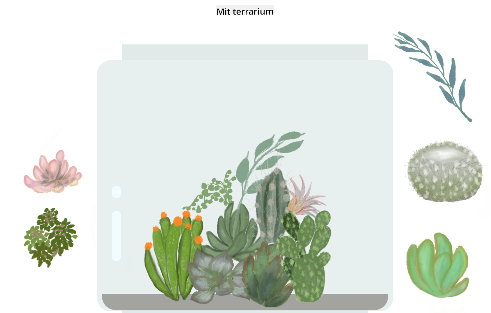

<!--
CO_OP_TRANSLATOR_METADATA:
{
  "original_hash": "7965cd2bc5dc92ad888dc4c6ab2ab70a",
  "translation_date": "2025-08-26T21:28:21+00:00",
  "source_file": "3-terrarium/README.md",
  "language_code": "da"
}
-->
# Mit Terrarium: Et projekt til at lære om HTML, CSS og DOM-manipulation med JavaScript 🌵🌱

En lille drag-and-drop kode-meditation. Med lidt HTML, JS og CSS vil du kunne bygge en webgrænseflade, style den og endda tilføje flere interaktioner efter eget valg.

# Lektioner

1. [Introduktion til HTML](./1-intro-to-html/README.md)
2. [Introduktion til CSS](./2-intro-to-css/README.md)
3. [Introduktion til DOM og JS Closures](./3-intro-to-DOM-and-closures/README.md)

## Kreditering

Skrevet med ♥️ af [Jen Looper](https://www.twitter.com/jenlooper)

Terrariet skabt via CSS er inspireret af Jakub Mandras glasbeholder [codepen](https://codepen.io/Rotarepmi/pen/rjpNZY).

Illustrationerne er håndtegnede af [Jen Looper](http://jenlooper.com) med hjælp fra Procreate.

## Udgiv dit Terrarium

Du kan udgive eller publicere dit terrarium på nettet ved hjælp af Azure Static Web Apps.

1. Fork dette repository

2. Tryk på denne knap

3. Gå igennem guiden for at oprette din app. Sørg for at sætte app-roden til enten `/solution` eller roden af din kodebase. Der er ingen API i denne app, så det behøver du ikke bekymre dig om. En GitHub-mappe vil blive oprettet i dit forkede repository, som vil hjælpe Azure Static Web Apps' build-tjenester med at bygge og publicere din app til en ny URL.

---

**Ansvarsfraskrivelse**:  
Dette dokument er blevet oversat ved hjælp af AI-oversættelsestjenesten [Co-op Translator](https://github.com/Azure/co-op-translator). Selvom vi bestræber os på nøjagtighed, skal du være opmærksom på, at automatiserede oversættelser kan indeholde fejl eller unøjagtigheder. Det originale dokument på dets oprindelige sprog bør betragtes som den autoritative kilde. For kritisk information anbefales professionel menneskelig oversættelse. Vi er ikke ansvarlige for eventuelle misforståelser eller fejltolkninger, der måtte opstå som følge af brugen af denne oversættelse.