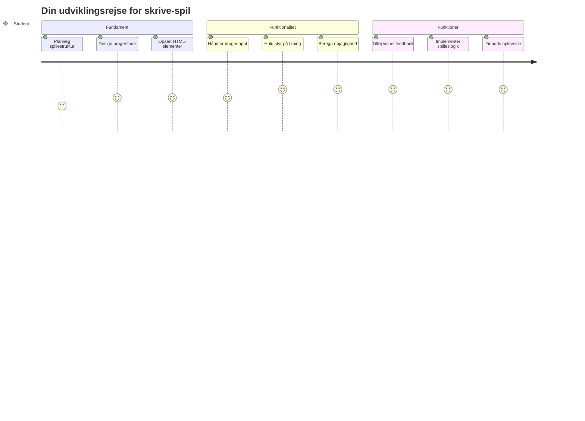
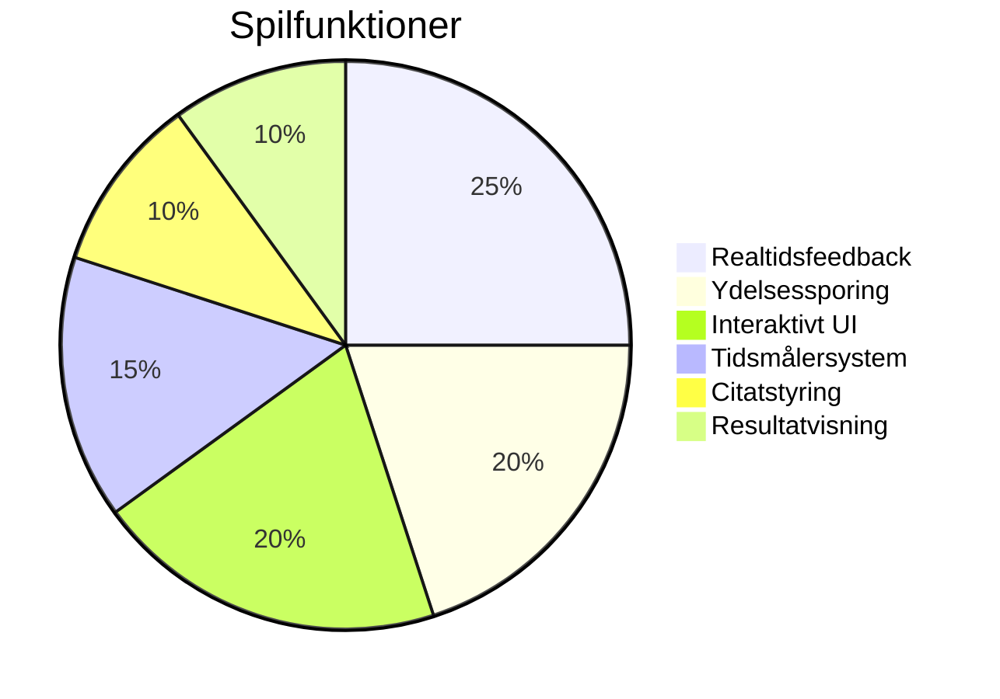
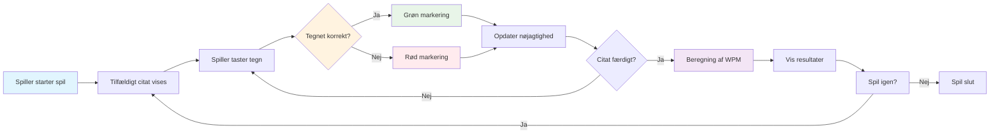
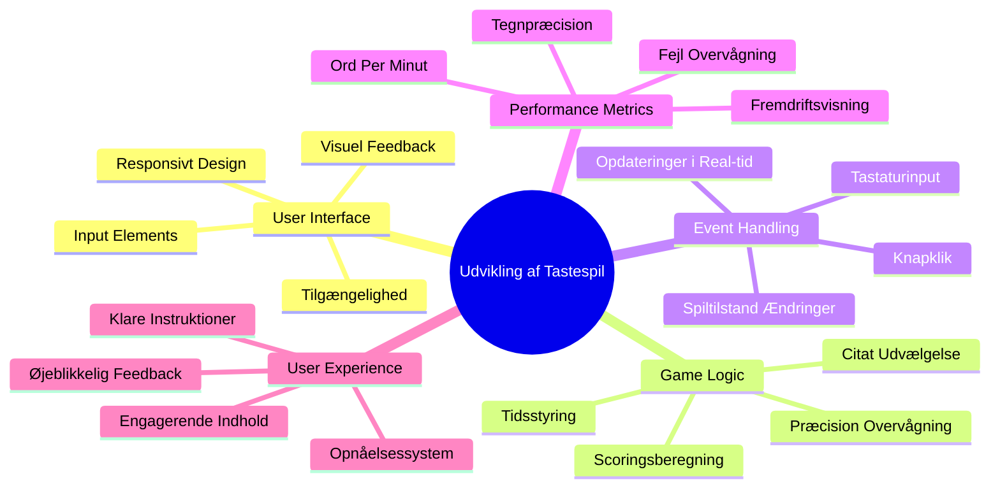
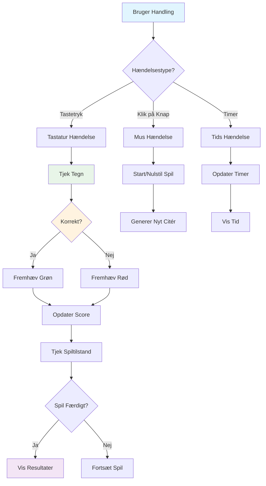
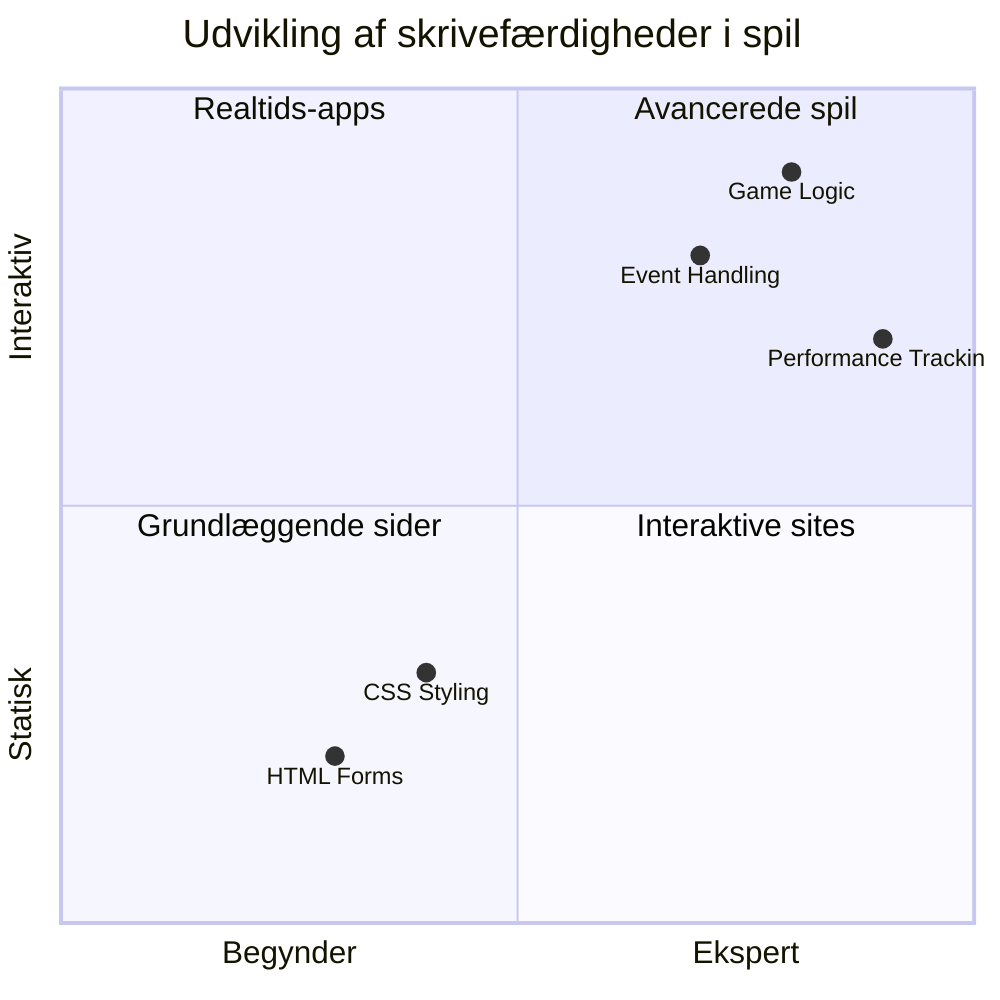
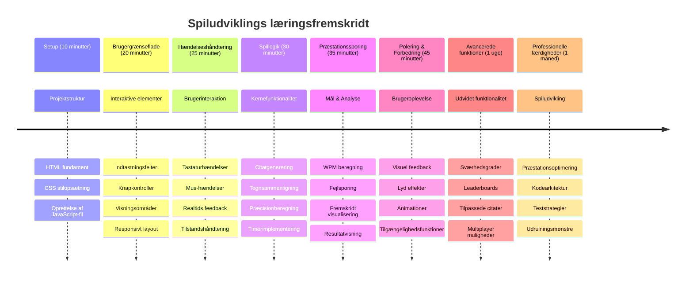

# Eventdreven Programmering - Byg et Typespil

## Introduktion

Her er noget, som alle udviklere kender til, men sjældent taler om: at skrive hurtigt er en superkraft! 🚀 Tænk over det - jo hurtigere du kan få dine idéer fra din hjerne til din kodeeditor, jo mere kan din kreativitet flyde. Det er som at have en direkte forbindelse mellem dine tanker og skærmen.

Vil du vide en af de bedste måder at opgradere denne færdighed på? Du gættede rigtigt - vi skal bygge et spil!

> Lad os skabe et fantastisk typespil sammen!

Klar til at sætte alle de JavaScript-, HTML- og CSS-færdigheder, du har lært, i spil? Vi skal bygge et typespil, der vil udfordre dig med tilfældige citater fra den legendariske detektiv [Sherlock Holmes](https://en.wikipedia.org/wiki/Sherlock_Holmes). Spillet vil holde styr på, hvor hurtigt og præcist du kan skrive - og tro mig, det er mere vanedannende, end du måske tror!

## Hvad Du Skal Vide

Før vi går i gang, så sørg for, at du er komfortabel med disse koncepter (bare rolig, hvis du har brug for en hurtig opfriskning - det har vi alle prøvet!):

- Oprettelse af tekstinput og knapkontroller  
- CSS og at sætte stilarter med klasser  
- Grundlæggende JavaScript  
  - Oprettelse af et array  
  - Oprettelse af et tilfældigt nummer  
  - At hente den aktuelle tid  

Hvis nogle af disse føles lidt rustne, er det helt i orden! Nogle gange er den bedste måde at konsolidere din viden på at kaste sig ud i et projekt og finde tingene ud af undervejs.

### 🔄 **Pædagogisk Status**
**Fundamentvurdering**: Før du starter udviklingen, skal du sikre dig, at du forstår:  
- ✅ Hvordan HTML-formularer og input-elementer fungerer  
- ✅ CSS-klasser og dynamisk styling  
- ✅ JavaScript event-lyttere og -håndterere  
- ✅ Array-manipulation og tilfældigt valg  
- ✅ Tidsmåling og beregninger  

**Hurtig Selvevaluering**: Kan du forklare, hvordan disse koncepter fungerer sammen i et interaktivt spil?  
- **Events** udløses, når brugerne interagerer med elementer  
- **Handlers** behandler disse events og opdaterer spillets tilstand  
- **CSS** giver visuel feedback på brugerhandlinger  
- **Timing** muliggør måling af præstation og spillets fremdrift  

## Lad Os Bygge Det Her!

[Oprettelse af et typespil ved brug af eventdrevet programmering](./typing-game/README.md)

### ⚡ **Det Kan Du Nå På 5 Minutter**
- [ ] Åbn din browserkonsol og prøv at lytte til tastatur-events med `addEventListener`  
- [ ] Opret en simpel HTML-side med et inputfelt og test skrivningsdetektion  
- [ ] Øv strengmanipulation ved at sammenligne skrevet tekst med målteksten  
- [ ] Eksperimenter med `setTimeout` for at forstå timing-funktioner  

### 🎯 **Det Kan Du Opnå På En Time**
- [ ] Fuldfør quizzen efter lektionen og forstå eventdrevet programmering  
- [ ] Byg en basal version af typespillet med ordvalidering  
- [ ] Tilføj visuel feedback ved korrekt og forkert skrivning  
- [ ] Implementer et simpelt pointsystem baseret på hastighed og nøjagtighed  
- [ ] Stil dit spil med CSS, så det bliver visuelt tiltalende  

### 📅 **Din Ugelange Spiludvikling**
- [ ] Udarbejd det fulde typespil med alle funktioner og finish  
- [ ] Tilføj sværhedsgrader med varierende ordkompleksitet  
- [ ] Implementer brugerstatistikker (WPM, nøjagtighed over tid)  
- [ ] Skab lydeffekter og animationer for bedre brugeroplevelse  
- [ ] Gør dit spil mobilvenligt til touch-enheder  
- [ ] Del dit spil online og indsamle feedback fra brugere  

### 🌟 **Din Månedslange Interaktive Udvikling**
- [ ] Byg flere spil, der udforsker forskellige interaktionsmønstre  
- [ ] Lær om spillelooper, tilstandshåndtering og performanceoptimering  
- [ ] Bidrag til open source-spiludviklingsprojekter  
- [ ] Mestre avancerede timing-koncepter og glidende animationer  
- [ ] Skab en portefølje med forskellige interaktive applikationer  
- [ ] Mentorér andre, der er interesserede i spiludvikling og brugerinteraktion  

## 🎯 Din Tidslinje for Mastery i Typespil

### 🛠️ Dit Spiludviklingsværktøjssæt Oversigt

Efter at have fuldført dette projekt, vil du have mestret:  
- **Eventdreven Programmering**: Reaktive brugerflader, der reagerer på input  
- **Feedback i Realtime**: Øjeblikkelige visuelle og performance-opdateringer  
- **Præstationsmåling**: Præcise timing- og pointsystemer  
- **Spil-tilstandshåndtering**: Kontrol over applikationens flow og brugeroplevelse  
- **Interaktivt Design**: Skabelse af engagerende, vanedannende brugeroplevelser  
- **Moderne Web-API’er**: Udnyttelse af browserfunktioner til rige interaktioner  
- **Tilgængelighedsmønstre**: Inklusivt design for alle brugere  

**Virkelige Anvendelser**: Disse færdigheder kan direkte anvendes på:  
- **Webapplikationer**: Enhver interaktiv brugerflade eller dashboard  
- **Uddannelsessoftware**: Læringsplatforme og færdighedsvurderingsværktøjer  
- **Produktivitetsværktøjer**: Teksteditorer, IDE’er og samarbejdsværktøjer  
- **Spilindustrien**: Browserspil og interaktiv underholdning  
- **Mobiludvikling**: Touch-baserede brugerflader og gestushåndtering  

**Næste Niveau**: Du er klar til at udforske avancerede spilframeworks, realtids multiplayer-systemer eller komplekse interaktive applikationer!

## Credits

Skrevet med ♥️ af [Christopher Harrison](http://www.twitter.com/geektrainer)

---

<!-- CO-OP TRANSLATOR DISCLAIMER START -->
**Ansvarsfraskrivelse**:
Dette dokument er oversat ved hjælp af AI-oversættelsestjenesten [Co-op Translator](https://github.com/Azure/co-op-translator). Selvom vi bestræber os på nøjagtighed, bedes du være opmærksom på, at automatiske oversættelser kan indeholde fejl eller unøjagtigheder. Det oprindelige dokument på dets modersmål bør betragtes som den autoritative kilde. For vigtig information anbefales professionel menneskelig oversættelse. Vi påtager os intet ansvar for misforståelser eller fejltolkninger, der måtte opstå som følge af brugen af denne oversættelse.
<!-- CO-OP TRANSLATOR DISCLAIMER END -->