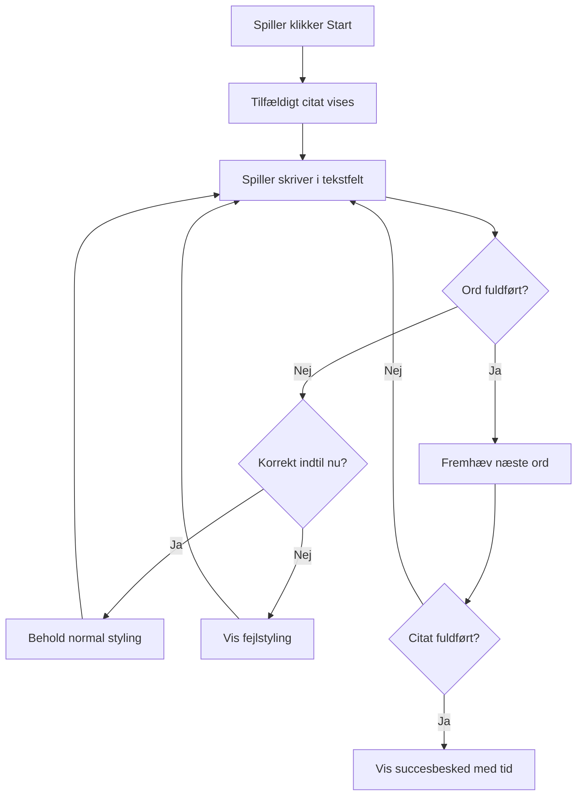
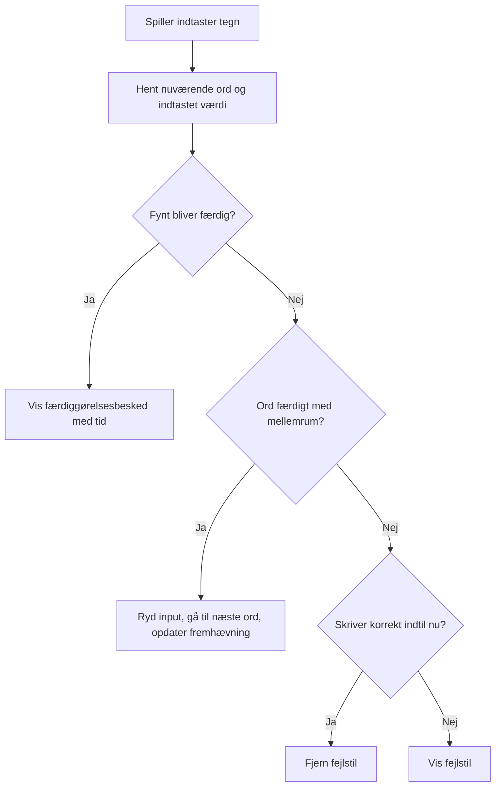
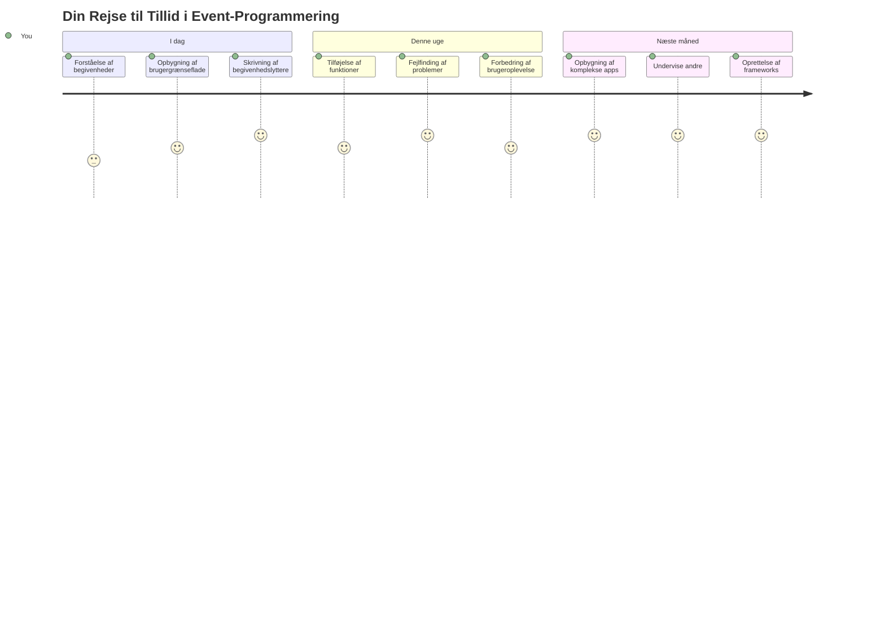

# Oprettelse af et spil ved hjælp af events

Har du nogensinde spekuleret på, hvordan hjemmesider ved, når du klikker på en knap eller skriver i en tekstboks? Det er magien ved begivenhedsdrevet programmering! Hvad er en bedre måde at lære denne essentielle færdighed på end ved at bygge noget nyttigt - et skrivehastighedsspil, der reagerer på hver eneste tasteanslag, du laver.

Du vil selv opleve, hvordan webbrowsere "taler" med din JavaScript-kode. Hver gang du klikker, skriver eller bevæger din mus, sender browseren små beskeder (vi kalder dem events) til din kode, og du bestemmer, hvordan du vil svare!

Når vi er færdige her, har du bygget et rigtigt skrivespil, der følger din hastighed og nøjagtighed. Endnu vigtigere, du vil forstå de grundlæggende koncepter, der driver hver interaktiv hjemmeside, du nogensinde har brugt. Lad os dykke ned i det!

## Forud-forelæsning Quiz

[Forud-forelæsning quiz](https://ff-quizzes.netlify.app/web/quiz/21)

## Begivenhedsdrevet programmering

Tænk på din yndlingsapp eller hjemmeside - hvad får den til at føles levende og lydhør? Det handler alt sammen om, hvordan den reagerer på det, du gør! Hvert tryk, klik, swipe eller tasteanslag skaber det, vi kalder en "begivenhed", og det er her den ægte magi i webudvikling sker.

Her er det, der gør programmering til web så interessant: vi ved aldrig, hvornår nogen vil klikke på den knap eller begynde at skrive i en tekstboks. De kan klikke med det samme, vente fem minutter eller måske aldrig klikke! Denne uforudsigelighed betyder, at vi skal tænke anderledes om, hvordan vi skriver vores kode.

I stedet for at skrive kode, der kører fra top til bund som en opskrift, skriver vi kode, der tålmodigt venter på, at noget skal ske. Det minder om, hvordan telegrafoperatører i 1800-tallet sad ved deres maskiner og var klar til at svare det øjeblik, en besked kom gennem ledningen.

Så hvad er egentlig en "begivenhed"? Kort sagt, det er noget, der sker! Når du klikker på en knap - det er en begivenhed. Når du skriver et bogstav - det er en begivenhed. Når du bevæger din mus - det er en anden begivenhed.

Begivenhedsdrevet programmering lader os sætte vores kode op til at lytte og reagere. Vi opretter specielle funktioner kaldet **event listeners**, som tålmodigt venter på at bestemte ting sker, og så springer i aktion, når de gør.

Tænk på event listeners som at have en dørklokke for din kode. Du sætter dørklokken op (`addEventListener()`), fortæller den, hvilken lyd den skal lytte efter (som et 'click' eller 'keypress'), og så specificerer du, hvad der skal ske, når nogen ringer på (din brugerdefinerede funktion).

**Sådan fungerer event listeners:**
- **Lytter** efter specifikke brugerhandlinger som klik, tasteanslag eller musebevægelser
- **Udfører** din brugerdefinerede kode, når den angivne begivenhed opstår
- **Reagerer** øjeblikkeligt på brugerinteraktioner og skaber en sømløs oplevelse
- **Håndterer** flere begivenheder på det samme element ved hjælp af forskellige lyttere

> **NOTE:** Det er værd at fremhæve, at der findes mange måder at oprette event listeners på. Du kan bruge anonyme funktioner eller oprette navngivne. Du kan bruge forskellige genveje, som at sætte `click`-egenskaben, eller bruge `addEventListener()`. I vores øvelse vil vi fokusere på `addEventListener()` og anonyme funktioner, da det sandsynligvis er den mest almindelige teknik, webudviklere bruger. Det er også den mest fleksible, da `addEventListener()` virker for alle begivenheder, og eventnavnet kan gives som en parameter.

### Almindelige begivenheder

Mens webbrowsere tilbyder dusinvis af forskellige begivenheder, du kan lytte efter, bygger de fleste interaktive applikationer kun på en håndfuld essentielle begivenheder. At forstå disse kernebegivenheder vil give dig fundamentet til at skabe sofistikerede brugerinteraktioner.

Der findes [dusiner af begivenheder](https://developer.mozilla.org/docs/Web/Events), du kan lytte efter, når du skaber en applikation. Grundlæggende rejser alle handlinger en bruger foretager på en side en begivenhed, hvilket giver dig stor magt til at sikre, at de får den oplevelse, du ønsker. Heldigvis behøver du normalt kun en lille håndfuld begivenheder. Her er nogle almindelige (inklusive de to, vi vil bruge til at skabe vores spil):

| Begivenhed | Beskrivelse | Almindelige brugssituationer |
|------------|-------------|------------------------------|
| `click`    | Brugeren klikkede på noget | Knapper, links, interaktive elementer |
| `contextmenu` | Brugeren klikkede med højre museknap | Tilpassede højrekliksmenuer |
| `select`   | Brugeren markerede noget tekst | Tekstredigering, kopiering |
| `input`    | Brugeren indtastede noget tekst | Formularvalidering, søgning i realtid |

**At forstå disse event-typer:**
- **Udløses** når brugere interagerer med specifikke elementer på din side
- **Giver** detaljeret information om brugerens handling via event-objekter
- **Gør det muligt** at skabe responsive, interaktive webapplikationer
- **Fungerer** konsekvent på tværs af forskellige browsere og enheder

## Oprettelse af spillet

Nu hvor du forstår, hvordan events fungerer, lad os sætte den viden i praksis ved at bygge noget nyttigt. Vi vil skabe et skrivehastighedsspil, der demonstrerer eventhåndtering samtidig med, at du udvikler en vigtig udviklerfærdighed.

Vi laver et spil for at udforske, hvordan events fungerer i JavaScript. Vores spil vil teste en spillers skrivefærdighed, hvilket er en af de mest undervurderede færdigheder, alle udviklere burde have. Sjov fakta: QWERTY-tastaturlayoutet, vi bruger i dag, blev faktisk designet i 1870'erne til skrivemaskiner - og gode skrivefærdigheder er stadig lige så værdifulde for programmører i dag! Det generelle forløb i spillet vil se således ud:


**Sådan vil vores spil virke:**
- **Starter** når spilleren klikker på startknappen og viser et tilfældigt citat
- **Sporer** spillerens skrivefremskridt ord for ord i realtid
- **Fremhæver** det aktuelle ord for at guide spillerens fokus
- **Giver** øjeblikkelig visuel feedback ved skrivefejl
- **Beregner** og viser den samlede tid, når citatet er færdigskrevet

Lad os bygge vores spil, og lære om events!

### Filstruktur

Før vi begynder at kode, lad os få styr på tingene! At have en ren filstruktur fra starten vil spare dig for hovedpine senere og gøre dit projekt mere professionelt. 😊

Vi holder det simpelt med kun tre filer: `index.html` til vores sidestruktur, `script.js` til al vores spislogik og `style.css` for at få det til at se godt ud. Det er det klassiske triptæm, der driver det meste af internettet!

**Opret en ny mappe til dit arbejde ved at åbne en konsol eller terminal og indsende følgende kommando:**

```bash
# Linux eller macOS
mkdir typing-game && cd typing-game

# Windows
md typing-game && cd typing-game
```

**Her er, hvad disse kommandoer gør:**
- **Opretter** en ny mappe kaldet `typing-game` til dine projektfiler
- **Navigerer** automatisk ind i den nyoprettede mappe
- **Opsætter** et rent arbejdsområde til din spiludvikling

**Åbn Visual Studio Code:**

```bash
code .
```

**Denne kommando:**
- **Starter** Visual Studio Code i den aktuelle mappe
- **Åbner** din projektmappe i editoren
- **Giver** adgang til alle udviklingsværktøjer, du får brug for

**Tilføj tre filer til mappen i Visual Studio Code med følgende navne:**
- `index.html` - Indeholder strukturen og indholdet af dit spil
- `script.js` - Håndterer al spislogikken og event listeners
- `style.css` - Definerer det visuelle udseende og styling

## Opret brugergrænsefladen

Lad os nu bygge scenen, hvor al vores spilhandling vil foregå! Tænk på det som at designe kontrolpanelet til et rumskib - vi skal sikre, at alt det, vores spillere har brug for, er lige, hvor de forventer det.

Lad os finde ud af, hvad vores spil egentlig har brug for. Hvis du spillede et skrive-spil, hvad ville du så gerne se på skærmen? Her er, hvad vi får brug for:

| UI-element | Formål | HTML-element |
|------------|---------|--------------|
| Citatvisning | Viser teksten, der skal tastes | `<p>` med `id="quote"` |
| Beskedområde | Viser status- og succesbeskeder | `<p>` med `id="message"` |
| Tekstinput | Hvor spillerne skriver citatet | `<input>` med `id="typed-value"` |
| Startknap | Starter spillet | `<button>` med `id="start"` |

**Forståelse af UI-strukturen:**
- **Organiserer** indhold logisk fra top til bund
- **Tildeler** unikke ID’er til elementer for JavaScript-målretning
- **Giver** klart visuelt hierarki for bedre brugeroplevelse
- **Inkluderer** semantiske HTML-elementer for tilgængelighed

Hver af disse skal have ID’er, så vi kan arbejde med dem i vores JavaScript. Vi vil også tilføje referencer til CSS- og JavaScript-filerne, vi skal oprette.

Opret en ny fil med navnet `index.html`. Tilføj følgende HTML:

```html
<!-- inside index.html -->
<html>
<head>
  <title>Typing game</title>
  <link rel="stylesheet" href="style.css">
</head>
<body>
  <h1>Typing game!</h1>
  <p>Practice your typing skills with a quote from Sherlock Holmes. Click **start** to begin!</p>
  <p id="quote"></p> <!-- This will display our quote -->
  <p id="message"></p> <!-- This will display any status messages -->
  <div>
    <input type="text" aria-label="current word" id="typed-value" /> <!-- The textbox for typing -->
    <button type="button" id="start">Start</button> <!-- To start the game -->
  </div>
  <script src="script.js"></script>
</body>
</html>
```

**Det denne HTML-struktur udfører:**
- **Linker** CSS-stylesheetet i `<head>` til styling
- **Opretter** en klar overskrift og instruktioner til brugerne
- **Etablerer** pladsholder-afsnit med specifikke ID’er til dynamisk indhold
- **Inkluderer** et inputfelt med tilgængelighedsattributter
- **Tilbyder** en startknap til at trigge spillet
- **Indlæser** JavaScript-filen til sidst for optimal ydeevne

### Start applikationen

Det hjælper at teste din applikation hyppigt under udviklingen for at fange problemer tidligt og følge din fremgang i realtid. Live Server er et uvurderligt værktøj, der automatisk opdaterer din browser, hver gang du gemmer ændringer, hvilket gør udviklingen meget mere effektiv.

Det er altid bedst at udvikle iterativt for at se, hvordan tingene ser ud. Lad os starte vores applikation. Der findes en fantastisk udvidelse til Visual Studio Code kaldet [Live Server](https://marketplace.visualstudio.com/items?itemName=ritwickdey.LiveServer&WT.mc_id=academic-77807-sagibbon), som både vil hoste din applikation lokalt og opdatere browseren, hver gang du gemmer.

**Installer [Live Server](https://marketplace.visualstudio.com/items?itemName=ritwickdey.LiveServer&WT.mc_id=academic-77807-sagibbon) ved at følge linket og klikke på Installer:**

**Sådan foregår installationen:**
- **Beder** din browser om at åbne Visual Studio Code
- **Guides** dig gennem installationsprocessen
- **Kan kræve** genstart af Visual Studio Code for at fuldføre opsætningen

**Når den er installeret, klik i Visual Studio Code på Ctrl-Shift-P (eller Cmd-Shift-P) for at åbne kommandopaletten:**

**Forståelse af kommandopaletten:**
- **Giver** hurtig adgang til alle VS Code-kommandoer
- **Søger** i kommandoer, mens du skriver
- **Tilbyder** tastaturgenveje for hurtigere udvikling

**Skriv "Live Server: Open with Live Server":**

**Hvad Live Server gør:**
- **Starter** en lokal udviklingsserver til dit projekt
- **Opdaterer automatisk** browseren, når du gemmer filer
- **Servidorer** dine filer fra en lokal URL (typisk `localhost:5500`)

**Åbn en browser og gå til `https://localhost:5500`:**

Du skulle nu kunne se den side, du har oprettet! Lad os tilføje noget funktionalitet.

## Tilføj CSS

Lad os nu gøre tingene pænere! Visuel feedback har været afgørende for brugerflader siden de tidlige dage med computerbrug. I 1980'erne opdagede forskere, at øjeblikkelig visuel feedback dramatisk forbedrer brugerens præstation og reducerer fejl. Det er lige præcis det, vi vil skabe.

Vores spil skal være krystalklart om, hvad der sker. Spillere skal med det samme kunne se, hvilket ord de skal skrive, og hvis de laver en fejl, skal de se det med det samme. Lad os lave enkel, men effektiv styling:

Opret en ny fil med navnet `style.css` og tilføj følgende syntaks.

```css
/* inside style.css */
.highlight {
  background-color: yellow;
}

.error {
  background-color: lightcoral;
  border: red;
}
```

**Forståelse af disse CSS-klasser:**
- **Fremhæver** det aktuelle ord med gul baggrund for klar visuel vejledning
- **Signalere** skrivefejl med en lys koralbaggrundsfarve
- **Giver** øjeblikkelig feedback uden at forstyrre brugerens skriveflow
- **Bruger** kontrasterende farver for tilgængelighed og klar visuel kommunikation

✅ Når det kommer til CSS, kan du indrette din side, som du vil. Tag dig lidt tid og gør siden mere tiltalende:

- Vælg en anden skrifttype
- Farvelæg overskrifterne
- Ændr størrelsen på elementer

## JavaScript

Her bliver det interessant! 🎉 Vi har vores HTML-struktur og vores CSS-styling, men lige nu er vores spil som en smuk bil uden en motor. JavaScript bliver motoren - det er det, der får alt til faktisk at fungere og reagere på, hvad spillerne gør.

Her vil du se dit værk komme til live. Vi går det igennem trin for trin, så det ikke føles overvældende:

| Trin | Formål | Hvad du lærer |
|-------|---------|---------------|
| [Opret konstanterne](../../../../4-typing-game/typing-game) | Sæt citater og DOM-referencer op | Variabelhåndtering og DOM-udvælgelse |
| [Event listener til at starte spillet](../../../../4-typing-game/typing-game) | Håndter spilinitialisering | Eventhåndtering og UI-opdateringer |
| [Event listener til skrivehandling](../../../../4-typing-game/typing-game) | Behandl brugerinput i realtid | Inputvalidering og dynamisk feedback |

**Denne strukturerede tilgang hjælper dig med at:**
- **Organisere** din kode i logiske, overskuelige sektioner
- **Bygge** funktionalitet trinvis for lettere fejlfinding
- **Forstå** hvordan forskellige dele af din applikation arbejder sammen
- **Skabe** genanvendelige mønstre til fremtidige projekter

Men først, opret en ny fil ved navn `script.js`.

### Tilføj konstanterne

Før vi går i gang, lad os samle alle vores ressourcer! Ligesom NASA's missionskontrol sætter alle deres overvågningssystemer op før opsendelse, er det meget nemmere, når du har alt klar på forhånd. Det sparer os for at lede efter ting senere og hjælper med at forhindre tastefejl.

Her er, hvad vi skal sætte op først:

| Datatype | Formål | Eksempel |
|----------|---------|---------|
| Array of quotes | Gem alle mulige citater til spillet | `['Quote 1', 'Quote 2', ...]` |
| Word array | Opdel det aktuelle citat i individuelle ord | `['When', 'you', 'have', ...]` |
| Word index | Spor hvilket ord spilleren skriver | `0, 1, 2, 3...` |
| Start time | Beregn forløbet tid til pointberegning | `Date.now()` |

**Vi får også brug for referencer til vores UI-elementer:**
| Element | ID | Formål |
|---------|----|---------|
| Tekstinput | `typed-value` | Hvor spillere skriver |
| Citatvisning | `quote` | Viser citatet der skal skrives |
| Beskedområde | `message` | Viser statusopdateringer |

```javascript
// inde i script.js
// alle vores citater
const quotes = [
    'When you have eliminated the impossible, whatever remains, however improbable, must be the truth.',
    'There is nothing more deceptive than an obvious fact.',
    'I ought to know by this time that when a fact appears to be opposed to a long train of deductions it invariably proves to be capable of bearing some other interpretation.',
    'I never make exceptions. An exception disproves the rule.',
    'What one man can invent another can discover.',
    'Nothing clears up a case so much as stating it to another person.',
    'Education never ends, Watson. It is a series of lessons, with the greatest for the last.',
];
// gem listen over ord og indekset for det ord, spilleren i øjeblikket skriver
let words = [];
let wordIndex = 0;
// starttiden
let startTime = Date.now();
// sideelementer
const quoteElement = document.getElementById('quote');
const messageElement = document.getElementById('message');
const typedValueElement = document.getElementById('typed-value');
```

**En gennemgang af hvad denne opsætningskode opnår:**
- **Gemmer** et array af Sherlock Holmes-citater med `const`, da citaterne ikke skal ændres
- **Initialiserer** sporingsvariabler med `let`, da disse værdier opdateres under gameplay
- **Indsamler** referencer til DOM-elementer med `document.getElementById()` for effektiv adgang
- **Opsætter** grundlaget for al spilstyring med klare, beskrivende variabelnavne
- **Organiserer** relaterede data og elementer logisk for lettere vedligeholdelse af koden

✅ Gå videre og tilføj flere citater til dit spil

> 💡 **Pro-tip**: Vi kan hente elementerne når som helst i koden ved at bruge `document.getElementById()`. Fordi vi henviser til disse elementer regelmæssigt, undgår vi tastefejl med strengliteral-konstanter. Frameworks som [Vue.js](https://vuejs.org/) eller [React](https://reactjs.org/) kan hjælpe med bedre central styring af koden.
>
**Derfor fungerer denne tilgang så godt:**
- **Forebygger** stavefejl når elementer refereres flere gange
- **Forbedrer** kodelæsbarhed med beskrivende konstanter
- **Muliggør** bedre IDE-understøttelse med autocomplete og fejlkontrol
- **Gør** refaktorering lettere hvis element-id’er senere ændres

Tag et minut til at se en video om brugen af `const`, `let` og `var`

[](https://youtube.com/watch?v=JNIXfGiDWM8 "Types of variables")

> 🎥 Klik på billedet ovenfor for en video om variabler.

### Tilføj startlogik

Her falder alting på plads! 🚀 Du er ved at skrive din første rigtige event listener, og der er noget særligt tilfredsstillende i at se din kode reagere på et klik på en knap.

Tænk over det: et sted derude klikker en spiller på “Start”-knappen, og din kode skal være klar til det. Vi ved ikke hvornår de klikker - måske med det samme, måske efter en kop kaffe - men når de gør, springer spillet i aktion.

Når brugeren klikker `start`, skal vi vælge et citat, sætte brugergrænsefladen op og begynde at spore det aktuelle ord og tid. Nedenfor finder du den JavaScript, du skal tilføje; vi gennemgår den lige efter script-blokken.

```javascript
// i slutningen af script.js
document.getElementById('start').addEventListener('click', () => {
  // få et citat
  const quoteIndex = Math.floor(Math.random() * quotes.length);
  const quote = quotes[quoteIndex];
  // Sæt citatet i en array af ord
  words = quote.split(' ');
  // nulstil ordindekset til sporing
  wordIndex = 0;

  // UI-opdateringer
  // Opret en array af span-elementer, så vi kan sætte en klasse
  const spanWords = words.map(function(word) { return `<span>${word} </span>`});
  // Konverter til streng og sæt som innerHTML på citatskærmen
  quoteElement.innerHTML = spanWords.join('');
  // Fremhæv det første ord
  quoteElement.childNodes[0].className = 'highlight';
  // Ryd eventuelle tidligere beskeder
  messageElement.innerText = '';

  // Opsæt tekstboksen
  // Ryd tekstboksen
  typedValueElement.value = '';
  // sæt fokus
  typedValueElement.focus();
  // sæt eventhandleren

  // Start timingen
  startTime = new Date().getTime();
});
```

**Lad os opdele koden i logiske afsnit:**

**📊 Opsætning af ordsporing:**
- **Vælger** et tilfældigt citat vha. `Math.floor()` og `Math.random()` for variation
- **Omformer** citatet til et array af individuelle ord med `split(' ')`
- **Nulstiller** `wordIndex` til 0, da spillerne starter med første ord
- **Forbereder** spillets tilstand til en frisk runde

**🎨 UI Opsætning og visning:**
- **Opretter** et array af `<span>` elementer, hvor hvert ord pakkes ind for individuel styling
- **Sammenføjer** span-elementerne til en enkelt streng for effektiv DOM-opdatering
- **Fremhæver** det første ord ved at tilføje CSS-klassen `highlight`
- **Fjerner** tidligere spilmeldinger for at give en ren start

**⌨️ Forberedelse af tekstfelt:**
- **Rydder** eksisterende tekst i inputfeltet
- **Sætter fokus** på tekstfeltet så spilleren kan begynde at skrive straks
- **Forbereder** indtastningsområdet til den nye spil-session

**⏱️ Timer initialisering:**
- **Fanger** det aktuelle tidsstempel med `new Date().getTime()`
- **Muliggør** præcis beregning af skrivehastighed og tid
- **Starter** performance-sporing for spillet

### Tilføj skrive-logik

Her håndterer vi kernen i vores spil! Bare rolig, hvis det virker meget i starten – vi gennemgår det hele trin for trin, og til sidst vil du se, hvor logisk det hele hænger sammen.

Det vi bygger her, er ret avanceret: hver gang nogen skriver et bogstav, tjekker koden hvad der blev skrevet, giver feedback og bestemmer hvad der skal ske næste gang. Det minder om hvordan tidlige tekstbehandlere som WordStar i 1970’erne gav realtids-feedback til skrivere.

```javascript
// i slutningen af script.js
typedValueElement.addEventListener('input', () => {
  // Hent det aktuelle ord
  const currentWord = words[wordIndex];
  // hent den aktuelle værdi
  const typedValue = typedValueElement.value;

  if (typedValue === currentWord && wordIndex === words.length - 1) {
    // slutningen af sætningen
    // Vis succes
    const elapsedTime = new Date().getTime() - startTime;
    const message = `CONGRATULATIONS! You finished in ${elapsedTime / 1000} seconds.`;
    messageElement.innerText = message;
  } else if (typedValue.endsWith(' ') && typedValue.trim() === currentWord) {
    // slutningen af ordet
    // ryd typedValueElement for det nye ord
    typedValueElement.value = '';
    // gå videre til det næste ord
    wordIndex++;
    // nulstil klassenavnet for alle elementer i citatet
    for (const wordElement of quoteElement.childNodes) {
      wordElement.className = '';
    }
    // fremhæv det nye ord
    quoteElement.childNodes[wordIndex].className = 'highlight';
  } else if (currentWord.startsWith(typedValue)) {
    // korrekt i øjeblikket
    // fremhæv det næste ord
    typedValueElement.className = '';
  } else {
    // fejltillstand
    typedValueElement.className = 'error';
  }
});
```

**Forståelse af skrive-logikkens flow:**

Funktionen bruger en trinvist faldende (waterfall) tilgang, der tjekker betingelser fra mest specifik til mest generel. Lad os gennemgå hver situation:


**🏁 Citat færdig (Scenario 1):**
- **Tjekker** om den indtastede værdi matcher det aktuelle ord OG vi er på sidste ord
- **Beregner** forløbet tid ved at trække starttidspunkt fra nuværende tid
- **Omregner** millisekunder til sekunder ved at dividere med 1.000
- **Viser** en tillykke-besked med afslutningstiden

**✅ Ord færdigt (Scenario 2):**
- **Registrerer** ordfærdiggørelse når input slutter med et mellemrum
- **Bekræfter** at trimmet input præcist matcher det nuværende ord
- **Rydder** inputfeltet til næste ord
- **Går videre** til næste ord ved at øge `wordIndex`
- **Opdaterer** visuel fremhævning ved at fjerne alle klasser og fremhæve det nye ord

**📝 Skriver fortsætter (Scenario 3):**
- **Sikrer** at det nuværende ord starter med det der er skrevet indtil nu
- **Fjerner** fejlstyling for at vise at input er korrekt
- **Tillader** fortsat skrivning uden afbrydelser

**❌ Fejltilstand (Scenario 4):**
- **Aktiveres** når indtastet tekst ikke matcher forventet begyndelse af ordet
- **Anvender** fejl-CSS-klasse for at give øjeblikkelig visuel feedback
- **Hjælper** spillere med hurtigt at identificere og rette fejl

## Test din applikation

Se hvad du har opnået! 🎉 Du har netop bygget et ægte, fungerende skrive-spil helt fra bunden med event-drevet programmering. Tag et øjeblik til at værdsætte det – det er ikke noget lille projekt!

Nu følger testfasen! Vil det virke som forventet? Har vi glemt noget? Det er helt normalt hvis noget ikke virker perfekt med det samme. Selv erfarne udviklere støder ofte på fejl undervejs. Det hører til processen!

Klik på `start` og begynd at skrive! Det skulle gerne ligne den animation, vi så tidligere.


**Hvad skal du teste i din applikation:**
- **Sikrer** at klik på Start viser et tilfældigt citat
- **Bekræfter** at skrivning fremhæver det aktuelle ord korrekt
- **Tjekker** at fejlstyling vises ved forkert skrivning
- **Sikrer** at færdiggørelse af ord skifter fremhævning korrekt
- **Tester** at afslutning af citatet viser færdiggørelsesbesked med tid

**Almindelige fejlfindingstips:**
- **Tjek** browserkonsollen (F12) for JavaScript-fejl
- **Verificer** at alle filnavne matcher præcist (store/små bogstaver betyder noget)
- **Sørg for** at Live Server kører og opdaterer korrekt
- **Test** forskellige citater for at sikre at tilfældig udvælgelse virker

---

## GitHub Copilot Agent Challenge 🎮

Brug Agent-tilstand til at løse følgende udfordring:

**Beskrivelse:** Udbyg skrive-spillet ved at implementere et sværhedsgradssystem, som justerer spillet baseret på spillerens præstation. Denne udfordring træner dig i avanceret eventhåndtering, dataanalyse og dynamiske UI-opdateringer.

**Opgave:** Opret et sværhedsgradssystem til skrive-spillet som:
1. Sporer spillerens skrivehastighed (ord pr. minut) og nøjagtighed i procent
2. Justerer automatisk mellem tre sværhedsgrader: Let (enkle citater), Medium (nuværende citater), Svær (komplekse citater med tegnsætning)
3. Viser den aktuelle sværhedsgrad og spillerstatistik på UI
4. Implementerer en række-tæller, der øger sværhedsgraden efter 3 på hinanden følgende gode præstationer
5. Tilføjer visuel feedback (farver, animationer) for at indikere sværhedsgradsskift

Tilføj de nødvendige HTML-elementer, CSS-styles og JavaScript-funktioner for at udføre denne funktionalitet. Inkluder korrekt fejlhåndtering og sørg for at spillet forbliver tilgængeligt med passende ARIA-labels.

Læs mere om [agent mode](https://code.visualstudio.com/blogs/2025/02/24/introducing-copilot-agent-mode) her.

## 🚀 Udfordring

Klar til at tage dit skrive-spil til næste niveau? Prøv at implementere disse avancerede funktioner for at styrke din forståelse af event-håndtering og DOM-manipulation:

**Tilføj mere funktionalitet:**

| Funktion | Beskrivelse | Færdigheder du øver |
|---------|-------------|---------------------|
| **Input Control** | Deaktiver `input` event listener ved færdiggørelse, og genaktiver ved knapklik | Eventstyring og statekontrol |
| **UI State Management** | Deaktiver tekstboksen når spilleren færdiggør citatet | DOM egenskabs-manipulation |
| **Modal Dialog** | Vis en modal dialogboks med succesbeskeden | Avancerede UI-mønstre og tilgængelighed |
| **High Score System** | Gem high scores med `localStorage` | Browserlagring og dataperistens |

**Implementeringstip:**
- **Undersøg** `localStorage.setItem()` og `localStorage.getItem()` til vedvarende lagring
- **Øv** dig i dynamisk at tilføje og fjerne event listeners
- **Udforsk** HTML-dialog elementer eller CSS modale patterns
- **Tænk på** tilgængelighed når form-kontroller aktiveres/deaktiveres

## Quiz efter lektionen

[Quiz efter lektionen](https://ff-quizzes.netlify.app/web/quiz/22)

---

## 🚀 Din tidslinje for mestre skrive-spillet

### ⚡ **Hvad du kan nå på de næste 5 minutter**
- [ ] Test dit skrive-spil med forskellige citater for at sikre det kører problemfrit
- [ ] Eksperimenter med CSS-styling - prøv at ændre fremhævnings- og fejlfarver
- [ ] Åbn browserens DevTools (F12) og følg Console mens du spiller
- [ ] Udfordr dig selv til at færdiggøre et citat så hurtigt som muligt

### ⏰ **Hvad du kan nå på en time**
- [ ] Tilføj flere citater til arrayet (måske fra dine yndlingsbøger eller film)
- [ ] Implementer localStorage high score systemet fra udfordringen
- [ ] Lav en ord-pr.-minut beregner som vises efter hvert spil
- [ ] Tilføj lydeffekter for korrekt skrivning, fejl og færdiggørelse

### 📅 **Din uge-lange rejse**
- [ ] Byg en multiplayer version hvor venner kan konkurrere side om side
- [ ] Skab forskellige sværhedsgrader med varierende citatkompleksitet
- [ ] Tilføj en statusbar, der viser hvor langt i citatet man er
- [ ] Implementer bruger-konti med personlig statistiksporing
- [ ] Design brugerdefinerede temaer og lad brugerne vælge deres foretrukne styling

### 🗓️ **Din måned-lange transformation**
- [ ] Opret et skrivekursus med lektioner der gradvist lærer korrekt fingerplacering
- [ ] Byg analyser som viser hvilke bogstaver eller ord der giver flest fejl
- [ ] Tilføj understøttelse af forskellige sprog og tastaturlayouter
- [ ] Integrer med uddannelses-API’er for at hente citater fra litteraturdatabaser
- [ ] Udgiv dit forbedrede skrive-spil, så andre kan bruge og nyde det

### 🎯 **Endeligt refleksions-tjek**

**Før du går videre, tag et øjeblik til at fejre:**
- Hvad var det mest tilfredsstillende øjeblik mens du byggede dette spil?
- Hvordan føler du om event-drevet programmering nu sammenlignet med da du startede?
- Hvilken funktion glæder du dig mest til at tilføje for at gøre spillet unikt for dig?
- Hvordan kan du anvende event-håndteringskoncepter til andre projekter?


> 🌟 **Husk**: Du har netop mestret et af de kernekoncepter, der driver alle interaktive hjemmesider og applikationer. Event-drevet programmering er det, der får nettet til at føles levende og responsivt. Hver gang du ser en dropdown-menu, en formular der valideres mens du skriver, eller et spil der reagerer på dine klik, forstår du nu magien bagved. Du lærer ikke bare at kode – du lærer at skabe oplevelser der føles intuitive og engagerende! 🎉

---

## Gennemgang & selvstudie

Læs op på [alle events tilgængelige](https://developer.mozilla.org/docs/Web/Events) for udviklere via browseren, og overvej scenarier hvor du kunne bruge hver af dem.

## Opgave

[Opret et nyt keyboard-spil](assignment.md)

---

<!-- CO-OP TRANSLATOR DISCLAIMER START -->
**Ansvarsfraskrivelse**:
Dette dokument er blevet oversat ved hjælp af AI-oversættelsestjenesten [Co-op Translator](https://github.com/Azure/co-op-translator). Selvom vi bestræber os på nøjagtighed, skal du være opmærksom på, at automatiserede oversættelser kan indeholde fejl eller unøjagtigheder. Det oprindelige dokument på dets modersmål bør betragtes som den autoritative kilde. For kritisk information anbefales professionel menneskelig oversættelse. Vi påtager os intet ansvar for misforståelser eller fejltolkninger, der opstår som følge af brugen af denne oversættelse.
<!-- CO-OP TRANSLATOR DISCLAIMER END -->