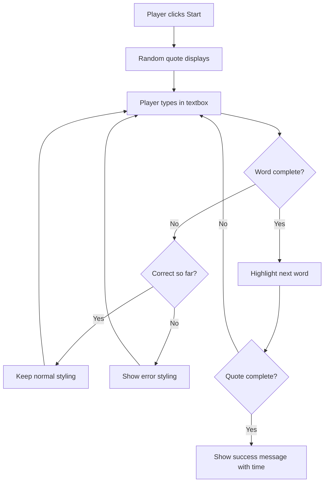
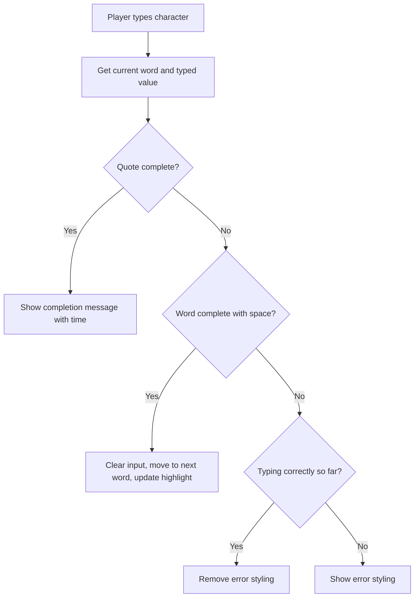

<!--
CO_OP_TRANSLATOR_METADATA:
{
  "original_hash": "e6b75e5b8caae906473a8a09d77b7121",
  "translation_date": "2025-10-23T22:08:45+00:00",
  "source_file": "4-typing-game/typing-game/README.md",
  "language_code": "da"
}
-->
# Oprettelse af et spil ved hjælp af events

Har du nogensinde undret dig over, hvordan hjemmesider ved, når du klikker på en knap eller skriver i en tekstboks? Det er magien ved event-drevet programmering! Hvilken bedre måde at lære denne essentielle færdighed på end ved at bygge noget nyttigt - et skrivehastighedsspil, der reagerer på hver tast, du trykker.

Du kommer til at se med egne øjne, hvordan webbrowsere "taler" med din JavaScript-kode. Hver gang du klikker, skriver eller bevæger musen, sender browseren små beskeder (vi kalder dem events) til din kode, og du bestemmer, hvordan du vil reagere!

Når vi er færdige her, har du bygget et rigtigt skrive-spil, der sporer din hastighed og nøjagtighed. Endnu vigtigere, du vil forstå de grundlæggende begreber, der driver hver interaktiv hjemmeside, du nogensinde har brugt. Lad os komme i gang!

## Quiz før forelæsning

[Quiz før forelæsning](https://ff-quizzes.netlify.app/web/quiz/21)

## Event-drevet programmering

Tænk på din yndlingsapp eller -hjemmeside - hvad får den til at føles levende og responsiv? Det handler om, hvordan den reagerer på det, du gør! Hver tryk, klik, swipe eller tastetryk skaber det, vi kalder en "event," og det er her, den virkelige magi i webudvikling sker.

Her er, hvad der gør programmering for nettet så interessant: vi ved aldrig, hvornår nogen vil klikke på den knap eller begynde at skrive i en tekstboks. De kan klikke med det samme, vente fem minutter eller måske aldrig klikke overhovedet! Denne uforudsigelighed betyder, at vi skal tænke anderledes om, hvordan vi skriver vores kode.

I stedet for at skrive kode, der kører fra top til bund som en opskrift, skriver vi kode, der tålmodigt venter på, at noget skal ske. Det er lidt som telegrafoperatører i 1800-tallet, der sad ved deres maskiner, klar til at reagere i det øjeblik, en besked kom igennem ledningen.

Så hvad er en "event" egentlig? Kort sagt, det er noget, der sker! Når du klikker på en knap - det er en event. Når du skriver et bogstav - det er en event. Når du bevæger musen - det er en anden event.

Event-drevet programmering giver os mulighed for at opsætte vores kode til at lytte og reagere. Vi skaber specielle funktioner kaldet **event listeners**, der tålmodigt venter på specifikke ting, der skal ske, og så springer de i aktion, når det sker.

Tænk på event listeners som at have en dørklokke til din kode. Du opsætter dørklokken (`addEventListener()`), fortæller den, hvilken lyd den skal lytte efter (som et 'klik' eller 'tastetryk'), og specificerer derefter, hvad der skal ske, når nogen ringer på den (din brugerdefinerede funktion).

**Sådan fungerer event listeners:**
- **Lytter** efter specifikke brugerhandlinger som klik, tastetryk eller musebevægelser
- **Udfører** din brugerdefinerede kode, når den specificerede event opstår
- **Reagerer** øjeblikkeligt på brugerinteraktioner og skaber en problemfri oplevelse
- **Håndterer** flere events på det samme element ved hjælp af forskellige lyttere

> **NOTE:** Det er værd at fremhæve, at der er mange måder at oprette event listeners på. Du kan bruge anonyme funktioner eller oprette navngivne. Du kan bruge forskellige genveje, som at indstille `click`-egenskaben eller bruge `addEventListener()`. I vores øvelse vil vi fokusere på `addEventListener()` og anonyme funktioner, da det sandsynligvis er den mest almindelige teknik, webudviklere bruger. Det er også den mest fleksible, da `addEventListener()` fungerer for alle events, og eventnavnet kan angives som en parameter.

### Almindelige events

Selvom webbrowsere tilbyder dusinvis af forskellige events, du kan lytte efter, er de fleste interaktive applikationer afhængige af blot en håndfuld essentielle events. At forstå disse kerne-events vil give dig fundamentet til at bygge sofistikerede brugerinteraktioner.

Der er [dusinvis af events](https://developer.mozilla.org/docs/Web/Events), du kan lytte til, når du opretter en applikation. Grundlæggende set udløser alt, hvad en bruger gør på en side, en event, hvilket giver dig stor magt til at sikre, at de får den oplevelse, du ønsker. Heldigvis har du normalt kun brug for en lille håndfuld events. Her er nogle almindelige (inklusive de to, vi vil bruge, når vi opretter vores spil):

| Event | Beskrivelse | Almindelige anvendelser |
|-------|-------------|--------------------------|
| `click` | Brugeren klikker på noget | Knapper, links, interaktive elementer |
| `contextmenu` | Brugeren klikker med højre museknap | Brugerdefinerede højreklik-menuer |
| `select` | Brugeren markerer noget tekst | Tekstredigering, kopieringsoperationer |
| `input` | Brugeren indtaster tekst | Formularvalidering, realtidssøgning |

**Forståelse af disse event-typer:**
- **Udløses**, når brugere interagerer med specifikke elementer på din side
- **Giver** detaljerede oplysninger om brugerens handling gennem event-objekter
- **Muliggør**, at du kan skabe responsive, interaktive webapplikationer
- **Fungerer** konsekvent på tværs af forskellige browsere og enheder

## Oprettelse af spillet

Nu hvor du forstår, hvordan events fungerer, lad os omsætte den viden til praksis ved at bygge noget nyttigt. Vi vil skabe et skrivehastighedsspil, der demonstrerer event-håndtering, mens det hjælper dig med at udvikle en vigtig udviklerfærdighed.

Vi skal lave et spil for at udforske, hvordan events fungerer i JavaScript. Vores spil vil teste en spillers skrivefærdigheder, som er en af de mest undervurderede færdigheder, alle udviklere bør have. Sjovt faktum: QWERTY-tastaturlayoutet, vi bruger i dag, blev faktisk designet i 1870'erne til skrivemaskiner - og gode skrivefærdigheder er stadig lige så værdifulde for programmører i dag! Den generelle struktur for spillet vil se sådan ud:



**Sådan fungerer vores spil:**
- **Starter**, når spilleren klikker på startknappen og viser et tilfældigt citat
- **Sporer** spillerens skrivefremskridt ord for ord i realtid
- **Fremhæver** det aktuelle ord for at guide spillerens fokus
- **Giver** øjeblikkelig visuel feedback for skrivefejl
- **Beregner** og viser den samlede tid, når citatet er fuldført

Lad os bygge vores spil og lære om events!

### Filstruktur

Før vi begynder at kode, lad os organisere os! At have en ren filstruktur fra starten vil spare dig for hovedpine senere og gøre dit projekt mere professionelt. 😊

Vi vil holde det enkelt med kun tre filer: `index.html` til vores sidestruktur, `script.js` til al vores spil-logik og `style.css` for at få det hele til at se godt ud. Dette er den klassiske trio, der driver det meste af nettet!

**Opret en ny mappe til dit arbejde ved at åbne en konsol eller terminal og udføre følgende kommando:**

```bash
# Linux or macOS
mkdir typing-game && cd typing-game

# Windows
md typing-game && cd typing-game
```

**Hvad disse kommandoer gør:**
- **Opretter** en ny mappe kaldet `typing-game` til dine projektfiler
- **Navigerer** automatisk ind i den nyoprettede mappe
- **Opsætter** et rent arbejdsområde til din spiludvikling

**Åbn Visual Studio Code:**

```bash
code .
```

**Denne kommando:**
- **Starter** Visual Studio Code i den aktuelle mappe
- **Åbner** din projektmappe i editoren
- **Giver** adgang til alle de udviklingsværktøjer, du har brug for

**Tilføj tre filer til mappen i Visual Studio Code med følgende navne:**
- `index.html` - Indeholder strukturen og indholdet af dit spil
- `script.js` - Håndterer al spil-logik og event listeners
- `style.css` - Definerer det visuelle udseende og styling

## Opret brugergrænsefladen

Nu skal vi bygge scenen, hvor al vores spilhandling vil finde sted! Tænk på dette som at designe kontrolpanelet til et rumskib - vi skal sikre, at alt, hvad vores spillere har brug for, er lige der, hvor de forventer det.

Lad os finde ud af, hvad vores spil faktisk har brug for. Hvis du spillede et skrive-spil, hvad ville du så gerne se på skærmen? Her er, hvad vi har brug for:

| UI-element | Formål | HTML-element |
|------------|--------|--------------|
| Citatvisning | Viser teksten, der skal skrives | `<p>` med `id="quote"` |
| Beskedområde | Viser status- og succesbeskeder | `<p>` med `id="message"` |
| Tekstinput | Hvor spillere skriver citatet | `<input>` med `id="typed-value"` |
| Startknap | Starter spillet | `<button>` med `id="start"` |

**Forståelse af UI-strukturen:**
- **Organiserer** indhold logisk fra top til bund
- **Tildeler** unikke IDs til elementer for JavaScript-målretning
- **Giver** klar visuel hierarki for bedre brugeroplevelse
- **Inkluderer** semantiske HTML-elementer for tilgængelighed

Hvert af disse elementer skal have IDs, så vi kan arbejde med dem i vores JavaScript. Vi vil også tilføje referencer til de CSS- og JavaScript-filer, vi skal oprette.

Opret en ny fil med navnet `index.html`. Tilføj følgende HTML:

```html
<!-- inside index.html -->
<html>
<head>
  <title>Typing game</title>
  <link rel="stylesheet" href="style.css">
</head>
<body>
  <h1>Typing game!</h1>
  <p>Practice your typing skills with a quote from Sherlock Holmes. Click **start** to begin!</p>
  <p id="quote"></p> <!-- This will display our quote -->
  <p id="message"></p> <!-- This will display any status messages -->
  <div>
    <input type="text" aria-label="current word" id="typed-value" /> <!-- The textbox for typing -->
    <button type="button" id="start">Start</button> <!-- To start the game -->
  </div>
  <script src="script.js"></script>
</body>
</html>
```

**Hvad denne HTML-struktur opnår:**
- **Linker** CSS-stylesheetet i `<head>` for styling
- **Skaber** en klar overskrift og instruktioner til brugerne
- **Etablerer** pladsholder-afsnit med specifikke IDs til dynamisk indhold
- **Inkluderer** et inputfelt med tilgængelighedsattributter
- **Giver** en startknap til at starte spillet
- **Indlæser** JavaScript-filen til sidst for optimal ydeevne

### Start applikationen

At teste din applikation ofte under udvikling hjælper dig med at opdage problemer tidligt og se din fremgang i realtid. Live Server er et uvurderligt værktøj, der automatisk opdaterer din browser, hver gang du gemmer ændringer, hvilket gør udviklingen meget mere effektiv.

Det er altid bedst at udvikle iterativt for at se, hvordan tingene ser ud. Lad os starte vores applikation. Der er en fantastisk udvidelse til Visual Studio Code kaldet [Live Server](https://marketplace.visualstudio.com/items?itemName=ritwickdey.LiveServer&WT.mc_id=academic-77807-sagibbon), som både hoster din applikation lokalt og opdaterer browseren, hver gang du gemmer.

**Installer [Live Server](https://marketplace.visualstudio.com/items?itemName=ritwickdey.LiveServer&WT.mc_id=academic-77807-sagibbon) ved at følge linket og klikke på Installér:**

**Hvad der sker under installationen:**
- **Åbner** din browser for at starte Visual Studio Code
- **Vejleder** dig gennem installationsprocessen for udvidelsen
- **Kan kræve**, at du genstarter Visual Studio Code for at fuldføre opsætningen

**Når det er installeret, skal du i Visual Studio Code trykke på Ctrl-Shift-P (eller Cmd-Shift-P) for at åbne kommandopaletten:**

**Forståelse af kommandopaletten:**
- **Giver** hurtig adgang til alle VS Code-kommandoer
- **Søger** kommandoer, mens du skriver
- **Tilbyder** genvejstaster for hurtigere udvikling

**Skriv "Live Server: Open with Live Server":**

**Hvad Live Server gør:**
- **Starter** en lokal udviklingsserver til dit projekt
- **Opdaterer** automatisk browseren, når du gemmer filer
- **Serverer** dine filer fra en lokal URL (typisk `localhost:5500`)

**Åbn en browser og naviger til `https://localhost:5500`:**

Du bør nu se den side, du har oprettet! Lad os tilføje noget funktionalitet.

## Tilføj CSS

Nu skal vi få tingene til at se godt ud! Visuel feedback har været afgørende for brugergrænseflader siden computingens tidlige dage. I 1980'erne opdagede forskere, at øjeblikkelig visuel feedback dramatisk forbedrer brugerens præstation og reducerer fejl. Det er præcis, hvad vi skal skabe.

Vores spil skal være krystalklart omkring, hvad der sker. Spillere skal straks vide, hvilket ord de skal skrive, og hvis de laver en fejl, skal de se det med det samme. Lad os lave noget simpelt, men effektivt styling:

Opret en ny fil med navnet `style.css` og tilføj følgende syntaks.

```css
/* inside style.css */
.highlight {
  background-color: yellow;
}

.error {
  background-color: lightcoral;
  border: red;
}
```

**Forståelse af disse CSS-klasser:**
- **Fremhæver** det aktuelle ord med en gul baggrund for klar visuel vejledning
- **Signaliserer** skrivefejl med en lys koralfarvet baggrund
- **Giver** øjeblikkelig feedback uden at forstyrre brugerens skriveflow
- **Bruger** kontrastfarver for tilgængelighed og klar visuel kommunikation

✅ Når det kommer til CSS, kan du designe din side, som du vil. Brug lidt tid på at gøre siden mere tiltalende:

- Vælg en anden skrifttype
- Farvelæg overskrifterne
- Juster størrelsen på elementerne

## JavaScript

Nu bliver det interessant! 🎉 Vi har vores HTML-struktur og vores CSS-styling, men lige nu er vores spil som en smuk bil uden motor. JavaScript bliver den motor - det er det, der får alting til at fungere og reagere på, hvad spillerne gør.

Her vil du se din kreation komme til live. Vi vil tackle dette trin for trin, så intet føles overvældende:

| Trin | Formål | Hvad du lærer |
|------|--------|---------------|
| [Opret konstanterne](../../../../4-typing-game/typing-game) | Opsæt citater og DOM-referencer | Variabelhåndtering og DOM-udvælgelse |
| [Event listener til at starte spillet](../../../../4-typing-game/typing-game) | Håndter spilinitialisering | Event-håndtering og UI-opdateringer |
| [Event listener til skrivning](../../../../4-typing-game/typing-game) | Behandl brugerinput i realtid | Inputvalidering og dynamisk feedback |

**Denne strukturerede tilgang hjælper dig med at:**
- **Organisere** din kode i logiske, håndterbare sektioner
- **Bygge** funktionalitet gradvist for lettere fejlfinding
- **Forstå**, hvordan forskellige dele af din applikation arbejder sammen
- **Skabe** genanvendelige mønstre til fremtidige projekter

Men først, opret en ny fil med navnet `script.js`.

### Opret konstanterne

Før vi dykker ned i handlingen, lad os samle alle vores ressourcer! Ligesom hvordan NASA's mission control opsætter alle deres overvågningssystemer før en opsendelse, er det meget nemmere, når du har alt forberedt og klar. Dette sparer os for at skulle lede efter ting senere og hjælper med at undgå tastefejl.

Her er, hvad vi først skal opsætte:

| Datatype | Formål | Eksempel |
|-----------|--------|----------|
| Array af citater | Gem alle mulige citater til spillet | `['Citat 1', 'Citat 2', ...]` |
| Ord-array | Opdel det aktuelle citat i individuelle ord | `['Når', 'du', 'har', ...]` |
| Ordindeks | Hold styr på hvilket ord spilleren skriver | `0, 1, 2, 3...` |
| Starttid | Beregn forløbet tid til scoring | `Date.now()` |

**Vi skal også bruge referencer til vores UI-elementer:**
| Element | ID | Formål |
|---------|----|---------|
| Tekstinput | `typed-value` | Hvor spillere skriver |
| Citatvisning | `quote` | Viser citatet, der skal skrives |
| Beskedområde | `message` | Viser statusopdateringer |

```javascript
// inside script.js
// all of our quotes
const quotes = [
    'When you have eliminated the impossible, whatever remains, however improbable, must be the truth.',
    'There is nothing more deceptive than an obvious fact.',
    'I ought to know by this time that when a fact appears to be opposed to a long train of deductions it invariably proves to be capable of bearing some other interpretation.',
    'I never make exceptions. An exception disproves the rule.',
    'What one man can invent another can discover.',
    'Nothing clears up a case so much as stating it to another person.',
    'Education never ends, Watson. It is a series of lessons, with the greatest for the last.',
];
// store the list of words and the index of the word the player is currently typing
let words = [];
let wordIndex = 0;
// the starting time
let startTime = Date.now();
// page elements
const quoteElement = document.getElementById('quote');
const messageElement = document.getElementById('message');
const typedValueElement = document.getElementById('typed-value');
```

**Hvad denne opsætningskode opnår:**
- **Gemmer** en array af Sherlock Holmes-citater ved hjælp af `const`, da citaterne ikke ændrer sig
- **Initialiserer** sporingsvariabler med `let`, da disse værdier vil opdateres under spillet
- **Fanger** referencer til DOM-elementer ved hjælp af `document.getElementById()` for effektiv adgang
- **Opsætter** fundamentet for al spilfunktionalitet med klare, beskrivende variabelnavne
- **Organiserer** relaterede data og elementer logisk for lettere vedligeholdelse af koden

✅ Gå videre og tilføj flere citater til dit spil

> 💡 **Pro Tip**: Vi kan hente elementerne, når som helst vi vil i koden, ved at bruge `document.getElementById()`. Fordi vi ofte vil referere til disse elementer, undgår vi tastefejl med strenglitteraler ved at bruge konstanter. Frameworks som [Vue.js](https://vuejs.org/) eller [React](https://reactjs.org/) kan hjælpe dig med bedre at centralisere din kode.
>
**Derfor fungerer denne tilgang så godt:**
- **Forhindrer** stavefejl, når elementer refereres til flere gange
- **Forbedrer** kodens læsbarhed med beskrivende konstantnavne
- **Muliggør** bedre IDE-support med autoudfyldning og fejlkontrol
- **Gør** refaktorering lettere, hvis element-ID'er ændres senere

Tag et øjeblik til at se en video om brugen af `const`, `let` og `var`

[](https://youtube.com/watch?v=JNIXfGiDWM8 "Typer af variabler")

> 🎥 Klik på billedet ovenfor for en video om variabler.

### Tilføj startlogik

Nu begynder det hele at falde på plads! 🚀 Du er ved at skrive din første rigtige event listener, og der er noget meget tilfredsstillende ved at se din kode reagere på et knaptryk.

Tænk over det: et sted derude vil en spiller trykke på "Start"-knappen, og din kode skal være klar til dem. Vi har ingen idé om, hvornår de vil trykke - det kan være med det samme, eller efter de har hentet en kop kaffe - men når de gør det, springer dit spil til live.

Når brugeren klikker på `start`, skal vi vælge et citat, opsætte brugergrænsefladen og opsætte sporingen for det aktuelle ord og tiden. Nedenfor er den JavaScript-kode, du skal tilføje; vi diskuterer den lige efter scriptblokken.

```javascript
// at the end of script.js
document.getElementById('start').addEventListener('click', () => {
  // get a quote
  const quoteIndex = Math.floor(Math.random() * quotes.length);
  const quote = quotes[quoteIndex];
  // Put the quote into an array of words
  words = quote.split(' ');
  // reset the word index for tracking
  wordIndex = 0;

  // UI updates
  // Create an array of span elements so we can set a class
  const spanWords = words.map(function(word) { return `<span>${word} </span>`});
  // Convert into string and set as innerHTML on quote display
  quoteElement.innerHTML = spanWords.join('');
  // Highlight the first word
  quoteElement.childNodes[0].className = 'highlight';
  // Clear any prior messages
  messageElement.innerText = '';

  // Setup the textbox
  // Clear the textbox
  typedValueElement.value = '';
  // set focus
  typedValueElement.focus();
  // set the event handler

  // Start the timer
  startTime = new Date().getTime();
});
```

**Lad os bryde koden ned i logiske sektioner:**

**📊 Opsætning af ordsporing:**
- **Vælger** et tilfældigt citat ved hjælp af `Math.floor()` og `Math.random()` for variation
- **Konverterer** citatet til en array af individuelle ord ved hjælp af `split(' ')`
- **Nulstiller** `wordIndex` til 0, da spillere starter med det første ord
- **Forbereder** spiltilstanden til en ny runde

**🎨 UI-opsætning og visning:**
- **Opretter** en array af `<span>`-elementer, der omslutter hvert ord for individuel styling
- **Samler** span-elementerne til en enkelt streng for effektiv DOM-opdatering
- **Fremhæver** det første ord ved at tilføje CSS-klassen `highlight`
- **Rydder** eventuelle tidligere spilbeskeder for at give en ren start

**⌨️ Forberedelse af tekstfelt:**
- **Rydder** eksisterende tekst i inputfeltet
- **Sætter fokus** på tekstfeltet, så spillere kan begynde at skrive med det samme
- **Forbereder** inputområdet til den nye spilsession

**⏱️ Initialisering af timer:**
- **Fanger** det aktuelle tidsstempel ved hjælp af `new Date().getTime()`
- **Muliggør** nøjagtig beregning af skrivehastighed og afslutningstid
- **Starter** performance-sporingen for spillet

### Tilføj skrive-logik

Her tackler vi kernen i vores spil! Bare rolig, hvis det virker som meget i starten - vi går igennem hver del, og til sidst vil du se, hvor logisk det hele er.

Det, vi bygger her, er ret sofistikeret: hver gang nogen skriver et bogstav, vil vores kode tjekke, hvad de har skrevet, give dem feedback og beslutte, hvad der skal ske næste gang. Det minder om, hvordan tidlige tekstbehandlingsprogrammer som WordStar i 1970'erne gav realtidsfeedback til skrivere.

```javascript
// at the end of script.js
typedValueElement.addEventListener('input', () => {
  // Get the current word
  const currentWord = words[wordIndex];
  // get the current value
  const typedValue = typedValueElement.value;

  if (typedValue === currentWord && wordIndex === words.length - 1) {
    // end of sentence
    // Display success
    const elapsedTime = new Date().getTime() - startTime;
    const message = `CONGRATULATIONS! You finished in ${elapsedTime / 1000} seconds.`;
    messageElement.innerText = message;
  } else if (typedValue.endsWith(' ') && typedValue.trim() === currentWord) {
    // end of word
    // clear the typedValueElement for the new word
    typedValueElement.value = '';
    // move to the next word
    wordIndex++;
    // reset the class name for all elements in quote
    for (const wordElement of quoteElement.childNodes) {
      wordElement.className = '';
    }
    // highlight the new word
    quoteElement.childNodes[wordIndex].className = 'highlight';
  } else if (currentWord.startsWith(typedValue)) {
    // currently correct
    // highlight the next word
    typedValueElement.className = '';
  } else {
    // error state
    typedValueElement.className = 'error';
  }
});
```

**Forstå flowet i skrive-logikken:**

Denne funktion bruger en vandfaldstilgang, hvor betingelser tjekkes fra mest specifik til mest generel. Lad os bryde hver situation ned:



**🏁 Citat fuldført (Scenario 1):**
- **Tjekker** om den indtastede værdi matcher det aktuelle ord, OG om vi er på det sidste ord
- **Beregner** forløbet tid ved at trække starttidspunktet fra det aktuelle tidspunkt
- **Konverterer** millisekunder til sekunder ved at dividere med 1.000
- **Viser** en gratulationsbesked med afslutningstid

**✅ Ord fuldført (Scenario 2):**
- **Registrerer** ordafslutning, når input slutter med et mellemrum
- **Validerer** at trimmet input matcher det aktuelle ord præcist
- **Rydder** inputfeltet for det næste ord
- **Går videre** til det næste ord ved at øge `wordIndex`
- **Opdaterer** visuel fremhævning ved at fjerne alle klasser og fremhæve det nye ord

**📝 Skriveprocessen (Scenario 3):**
- **Bekræfter** at det aktuelle ord starter med det, der er blevet skrevet indtil videre
- **Fjerner** eventuel fejlstyling for at vise, at input er korrekt
- **Tillader** fortsat skrivning uden afbrydelse

**❌ Fejltilstand (Scenario 4):**
- **Udløses** når den indtastede tekst ikke matcher starten af det forventede ord
- **Anvender** fejl-CSS-klassen for at give øjeblikkelig visuel feedback
- **Hjælper** spillere med hurtigt at identificere og rette fejl

## Test din applikation

Se, hvad du har opnået! 🎉 Du har lige bygget et rigtigt, fungerende skrive-spil fra bunden ved hjælp af event-drevet programmering. Tag et øjeblik til at værdsætte det - det er ikke nogen lille bedrift!

Nu kommer testfasen! Vil det fungere som forventet? Har vi overset noget? Her er sagen: hvis noget ikke fungerer perfekt med det samme, er det helt normalt. Selv erfarne udviklere finder regelmæssigt fejl i deres kode. Det er en del af udviklingsprocessen!

Klik på `start`, og begynd at skrive! Det skulle se lidt ud som animationen, vi så før.


**Hvad du skal teste i din applikation:**
- **Bekræfter** at klik på Start viser et tilfældigt citat
- **Bekræfter** at skrivning fremhæver det aktuelle ord korrekt
- **Tjekker** at fejlstyling vises ved forkert skrivning
- **Sikrer** at fuldførte ord flytter fremhævelsen korrekt
- **Tester** at afslutning af citatet viser afslutningsbeskeden med tid

**Almindelige fejlfindingsråd:**
- **Tjek** browserkonsollen (F12) for JavaScript-fejl
- **Bekræft** at alle filnavne matcher præcist (case-sensitive)
- **Sikrer** at Live Server kører og opdaterer korrekt
- **Test** forskellige citater for at verificere, at den tilfældige udvælgelse fungerer

---

## GitHub Copilot Agent Challenge 🎮

Brug Agent-tilstand til at fuldføre følgende udfordring:

**Beskrivelse:** Udvid skrive-spillet ved at implementere et sværhedssystem, der justerer spillet baseret på spillerens præstation. Denne udfordring vil hjælpe dig med at øve avanceret eventhåndtering, dataanalyse og dynamiske UI-opdateringer.

**Opgave:** Opret et sværhedssystem for skrive-spillet, der:
1. Sporer spillerens skrivehastighed (ord per minut) og nøjagtighedsprocent
2. Justerer automatisk til tre sværhedsgrader: Let (simple citater), Mellem (nuværende citater), Svær (komplekse citater med tegnsætning)
3. Viser den aktuelle sværhedsgrad og spillerstatistik på UI'en
4. Implementerer en streak-tæller, der øger sværhedsgraden efter 3 på hinanden følgende gode præstationer
5. Tilføjer visuel feedback (farver, animationer) for at indikere ændringer i sværhedsgrad

Tilføj de nødvendige HTML-elementer, CSS-stilarter og JavaScript-funktioner for at implementere denne funktion. Inkluder korrekt fejlhåndtering og sørg for, at spillet forbliver tilgængeligt med passende ARIA-labels.

Læs mere om [agent mode](https://code.visualstudio.com/blogs/2025/02/24/introducing-copilot-agent-mode) her.

## 🚀 Udfordring

Klar til at tage dit skrive-spil til næste niveau? Prøv at implementere disse avancerede funktioner for at uddybe din forståelse af eventhåndtering og DOM-manipulation:

**Tilføj mere funktionalitet:**

| Funktion | Beskrivelse | Færdigheder du vil øve |
|----------|-------------|------------------------|
| **Inputkontrol** | Deaktiver `input` event listener ved afslutning, og aktiver den igen, når knappen klikkes | Eventhåndtering og tilstandskontrol |
| **UI-tilstandsadministration** | Deaktiver tekstfeltet, når spilleren fuldfører citatet | DOM-egenskabsmanipulation |
| **Modal dialog** | Vis en modal dialogboks med succesbeskeden | Avancerede UI-mønstre og tilgængelighed |
| **Highscore-system** | Gem highscores ved hjælp af `localStorage` | Browser storage API'er og datavedholdenhed |

**Implementeringstips:**
- **Undersøg** `localStorage.setItem()` og `localStorage.getItem()` for vedholdende lagring
- **Øv** dig i at tilføje og fjerne event listeners dynamisk
- **Udforsk** HTML dialog-elementer eller CSS modal-mønstre
- **Overvej** tilgængelighed, når du deaktiverer og aktiverer formkontroller

## Quiz efter forelæsning

[Quiz efter forelæsning](https://ff-quizzes.netlify.app/web/quiz/22)

## Gennemgang & Selvstudie

Læs om [alle de tilgængelige events](https://developer.mozilla.org/docs/Web/Events) for udvikleren via webbrowseren, og overvej de scenarier, hvor du ville bruge hver enkelt.

## Opgave

[Opret et nyt tastaturspil](assignment.md)

---

**Ansvarsfraskrivelse**:  
Dette dokument er blevet oversat ved hjælp af AI-oversættelsestjenesten [Co-op Translator](https://github.com/Azure/co-op-translator). Selvom vi bestræber os på nøjagtighed, skal du være opmærksom på, at automatiserede oversættelser kan indeholde fejl eller unøjagtigheder. Det originale dokument på dets oprindelige sprog bør betragtes som den autoritative kilde. For kritisk information anbefales professionel menneskelig oversættelse. Vi er ikke ansvarlige for eventuelle misforståelser eller fejltolkninger, der opstår som følge af brugen af denne oversættelse.