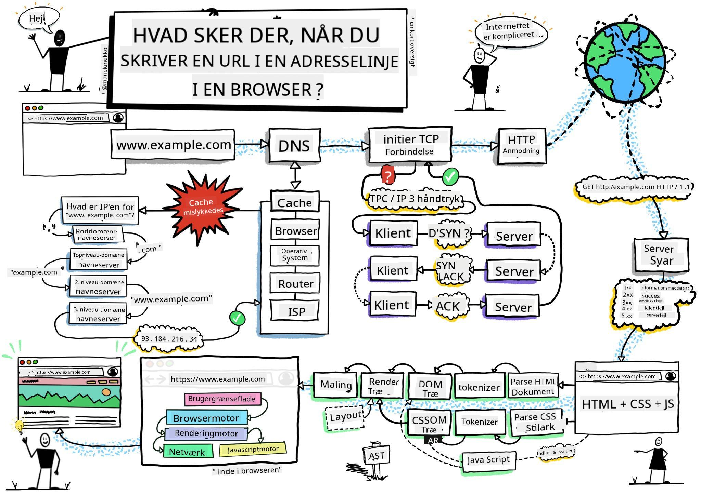
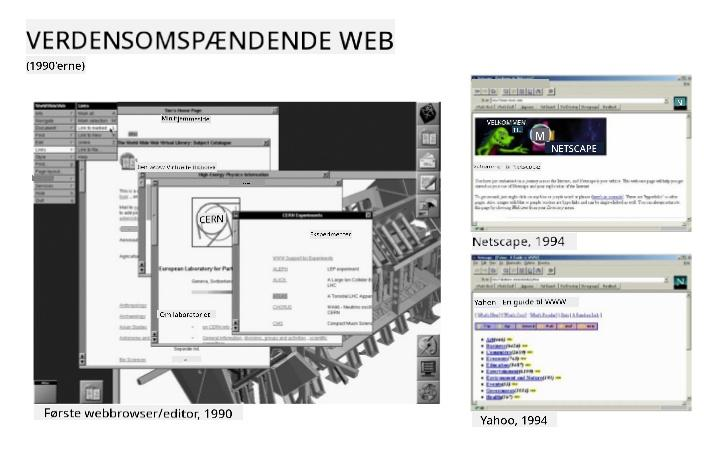

<!--
CO_OP_TRANSLATOR_METADATA:
{
  "original_hash": "0bb55e0b98600afab801eea115228873",
  "translation_date": "2025-08-26T22:39:25+00:00",
  "source_file": "5-browser-extension/1-about-browsers/README.md",
  "language_code": "da"
}
-->
# Browserudvidelsesprojekt Del 1: Alt om Browsere


> Sketchnote af [Wassim Chegham](https://dev.to/wassimchegham/ever-wondered-what-happens-when-you-type-in-a-url-in-an-address-bar-in-a-browser-3dob)

## Quiz før lektionen

[Quiz før lektionen](https://ashy-river-0debb7803.1.azurestaticapps.net/quiz/23)

### Introduktion

Browserudvidelser tilføjer ekstra funktionalitet til en browser. Men før du bygger en, bør du lære lidt om, hvordan browsere fungerer.

### Om browseren

I denne lektionsserie lærer du, hvordan du bygger en browserudvidelse, der fungerer på Chrome, Firefox og Edge. I denne del vil du opdage, hvordan browsere fungerer, og hvordan du opbygger elementerne i en browserudvidelse.

Men hvad er en browser egentlig? Det er en softwareapplikation, der giver en slutbruger mulighed for at få adgang til indhold fra en server og vise det på websider.

✅ Lidt historie: Den første browser hed 'WorldWideWeb' og blev skabt af Sir Timothy Berners-Lee i 1990.


> Nogle tidlige browsere, via [Karen McGrane](https://www.slideshare.net/KMcGrane/week-4-ixd-history-personal-computing)

Når en bruger forbinder til internettet ved hjælp af en URL (Uniform Resource Locator)-adresse, typisk via Hypertext Transfer Protocol med en `http` eller `https` adresse, kommunikerer browseren med en webserver og henter en webside.

På dette tidspunkt viser browserens rendering-motor siden på brugerens enhed, som kan være en mobiltelefon, en stationær computer eller en bærbar.

Browsere har også evnen til at cache indhold, så det ikke behøver at blive hentet fra serveren hver gang. De kan registrere en brugers browserhistorik, gemme 'cookies', som er små datastykker, der indeholder information om brugerens aktivitet, og meget mere.

En vigtig ting at huske om browsere er, at de ikke alle er ens! Hver browser har sine styrker og svagheder, og en professionel webudvikler skal forstå, hvordan man får websider til at fungere godt på tværs af browsere. Dette inkluderer at håndtere små skærmstørrelser som en mobiltelefons samt en bruger, der er offline.

En virkelig nyttig hjemmeside, som du sandsynligvis bør bogmærke i den browser, du foretrækker at bruge, er [caniuse.com](https://www.caniuse.com). Når du bygger websider, er det meget nyttigt at bruge caniuse's lister over understøttede teknologier, så du bedst kan støtte dine brugere.

✅ Hvordan kan du finde ud af, hvilke browsere der er mest populære blandt brugerne af din hjemmeside? Tjek din analyse - du kan installere forskellige analyseværktøjer som en del af din webudviklingsproces, og de vil fortælle dig, hvilke browsere der bruges mest af de forskellige populære browsere.

## Browserudvidelser

Hvorfor skulle du ønske at bygge en browserudvidelse? Det er en praktisk ting at tilføje til din browser, når du har brug for hurtig adgang til opgaver, som du ofte gentager. For eksempel, hvis du ofte har brug for at tjekke farver på de websider, du interagerer med, kan du installere en farvevælger-browserudvidelse. Hvis du har svært ved at huske adgangskoder, kan du bruge en adgangskodehåndterings-browserudvidelse.

Browserudvidelser er også sjove at udvikle. De har en tendens til at håndtere et begrænset antal opgaver, som de udfører godt.

✅ Hvad er dine yndlingsbrowserudvidelser? Hvilke opgaver udfører de?

### Installation af udvidelser

Før du begynder at bygge, skal du tage et kig på processen med at bygge og implementere en browserudvidelse. Selvom hver browser varierer lidt i, hvordan de håndterer denne opgave, er processen på Chrome og Firefox nogenlunde den samme som dette eksempel på Edge:


> Bemærk: Sørg for at slå udviklertilstand til og tillade udvidelser fra andre butikker.

I det væsentlige vil processen være:

- byg din udvidelse ved hjælp af `npm run build` 
- naviger i browseren til udvidelsespanelet ved hjælp af knappen "Indstillinger og mere" (ikonet `...`) øverst til højre
- hvis det er en ny installation, vælg `load unpacked` for at uploade en ny udvidelse fra dens build-mappe (i vores tilfælde er det `/dist`) 
- eller klik på `reload`, hvis du genindlæser en allerede installeret udvidelse

✅ Disse instruktioner gælder for udvidelser, du selv bygger; for at installere udvidelser, der er udgivet i browserens udvidelsesbutik, skal du navigere til disse [butikker](https://microsoftedge.microsoft.com/addons/Microsoft-Edge-Extensions-Home) og installere den udvidelse, du ønsker.

### Kom i gang

Du skal bygge en browserudvidelse, der viser dit områdes CO2-aftryk, herunder energiforbrug og energikilde. Udvidelsen vil have en formular, der indsamler en API-nøgle, så du kan få adgang til CO2 Signal's API.

**Du skal bruge:**

- [en API-nøgle](https://www.co2signal.com/); indtast din e-mail i boksen på denne side, og en nøgle vil blive sendt til dig
- koden for dit område fra [Electricity Map](http://api.electricitymap.org/v3/zones) (for eksempel bruger jeg 'US-NEISO' i Boston)
- [startkoden](../../../../5-browser-extension/start). Download `start`-mappen; du skal færdiggøre koden i denne mappe.
- [NPM](https://www.npmjs.com) - NPM er et værktøj til pakkehåndtering; installer det lokalt, og pakkerne, der er angivet i din `package.json`-fil, vil blive installeret til brug i dine webaktiver

✅ Lær mere om pakkehåndtering i dette [fremragende Learn-modul](https://docs.microsoft.com/learn/modules/create-nodejs-project-dependencies/?WT.mc_id=academic-77807-sagibbon)

Tag et øjeblik til at gennemgå kodebasen:

dist
    -|manifest.json (standardindstillinger her)
    -|index.html (HTML-markup til front-end her)
    -|background.js (baggrunds-JS her)
    -|main.js (bygget JS)
src
    -|index.js (din JS-kode går her)

✅ Når du har din API-nøgle og områdekode klar, skal du gemme dem et sted som en note til fremtidig brug.

### Byg HTML til udvidelsen

Denne udvidelse har to visninger. En til at indsamle API-nøglen og områdekoden:


Og den anden til at vise områdets CO2-forbrug:


Lad os starte med at bygge HTML til formularen og style den med CSS.

I `/dist`-mappen skal du bygge en formular og et resultatområde. I `index.html`-filen skal du udfylde det afgrænsede formularområde:

```HTML
<form class="form-data" autocomplete="on">
	<div>
		<h2>New? Add your Information</h2>
	</div>
	<div>
		<label for="region">Region Name</label>
		<input type="text" id="region" required class="region-name" />
	</div>
	<div>
		<label for="api">Your API Key from tmrow</label>
		<input type="text" id="api" required class="api-key" />
	</div>
	<button class="search-btn">Submit</button>
</form>	
```
Dette er formularen, hvor dine gemte oplysninger vil blive indtastet og gemt i lokal lagring.

Opret derefter resultatområdet; under den sidste form-tag skal du tilføje nogle divs:

```HTML
<div class="result">
	<div class="loading">loading...</div>
	<div class="errors"></div>
	<div class="data"></div>
	<div class="result-container">
		<p><strong>Region: </strong><span class="my-region"></span></p>
		<p><strong>Carbon Usage: </strong><span class="carbon-usage"></span></p>
		<p><strong>Fossil Fuel Percentage: </strong><span class="fossil-fuel"></span></p>
	</div>
	<button class="clear-btn">Change region</button>
</div>
```
På dette tidspunkt kan du prøve at bygge. Sørg for at installere udvidelsens pakkeafhængigheder:

```
npm install
```

Denne kommando vil bruge npm, Node Package Manager, til at installere webpack til din udvidelses byggeproces. Du kan se outputtet af denne proces ved at kigge i `/dist/main.js` - du vil se, at koden er blevet bundlet.

For nu bør udvidelsen bygge, og hvis du implementerer den i Edge som en udvidelse, vil du se en pænt vist formular.

Tillykke, du har taget de første skridt mod at bygge en browserudvidelse. I de næste lektioner vil du gøre den mere funktionel og nyttig.

---

## 🚀 Udfordring

Tag et kig på en browserudvidelsesbutik, og installer en udvidelse i din browser. Du kan undersøge dens filer på interessante måder. Hvad opdager du?

## Quiz efter lektionen

[Quiz efter lektionen](https://ashy-river-0debb7803.1.azurestaticapps.net/quiz/24)

## Gennemgang & Selvstudie

I denne lektion lærte du lidt om webbrowserens historie; benyt lejligheden til at lære om, hvordan opfinderne af World Wide Web forestillede sig dens brug, ved at læse mere om dens historie. Nogle nyttige sider inkluderer:

[Historien om webbrowsere](https://www.mozilla.org/firefox/browsers/browser-history/)

[Historien om nettet](https://webfoundation.org/about/vision/history-of-the-web/)

[Et interview med Tim Berners-Lee](https://www.theguardian.com/technology/2019/mar/12/tim-berners-lee-on-30-years-of-the-web-if-we-dream-a-little-we-can-get-the-web-we-want)

## Opgave 

[Restyle din udvidelse](assignment.md)

---

**Ansvarsfraskrivelse**:  
Dette dokument er blevet oversat ved hjælp af AI-oversættelsestjenesten [Co-op Translator](https://github.com/Azure/co-op-translator). Selvom vi bestræber os på nøjagtighed, skal du være opmærksom på, at automatiserede oversættelser kan indeholde fejl eller unøjagtigheder. Det originale dokument på dets oprindelige sprog bør betragtes som den autoritative kilde. For kritisk information anbefales professionel menneskelig oversættelse. Vi påtager os ikke ansvar for eventuelle misforståelser eller fejltolkninger, der måtte opstå som følge af brugen af denne oversættelse.