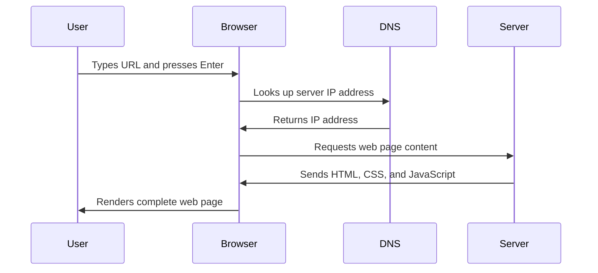

<!--
CO_OP_TRANSLATOR_METADATA:
{
  "original_hash": "33a875c522f237a2026e4653240dfc07",
  "translation_date": "2025-10-23T22:14:23+00:00",
  "source_file": "5-browser-extension/1-about-browsers/README.md",
  "language_code": "da"
}
-->
# Browserudvidelsesprojekt Del 1: Alt om Browsere


> Sketchnote af [Wassim Chegham](https://dev.to/wassimchegham/ever-wondered-what-happens-when-you-type-in-a-url-in-an-address-bar-in-a-browser-3dob)

## Quiz før forelæsning

[Quiz før forelæsning](https://ff-quizzes.netlify.app/web/quiz/23)

### Introduktion

Browserudvidelser er små applikationer, der forbedrer din webbrowseroplevelse. Ligesom Tim Berners-Lees oprindelige vision om en interaktiv web, udvider udvidelser browserens kapaciteter ud over simpel dokumentvisning. Fra adgangskodeadministratorer, der holder dine konti sikre, til farvevælgere, der hjælper designere med at finde de perfekte nuancer, løser udvidelser daglige browsingudfordringer.

Før vi bygger din første udvidelse, lad os forstå, hvordan browsere fungerer. Ligesom Alexander Graham Bell måtte forstå lydtransmission, før han opfandt telefonen, vil kendskab til browserens grundlæggende funktioner hjælpe dig med at skabe udvidelser, der integreres problemfrit med eksisterende browsersystemer.

Ved slutningen af denne lektion vil du forstå browserarkitektur og være begyndt at bygge din første udvidelse.

## Forståelse af webbrowsere

En webbrowser er i bund og grund en sofistikeret dokumentfortolker. Når du skriver "google.com" i adressefeltet, udfører browseren en kompleks række operationer - anmoder om indhold fra servere verden over, derefter analyserer og gengiver den kode til de interaktive websider, du ser.

Denne proces afspejler, hvordan den første webbrowser, WorldWideWeb, blev designet af Tim Berners-Lee i 1990 for at gøre hyperlinkede dokumenter tilgængelige for alle.

✅ **Lidt historie**: Den første browser blev kaldt 'WorldWideWeb' og blev skabt af Sir Timothy Berners-Lee i 1990.


> Nogle tidlige browsere, via [Karen McGrane](https://www.slideshare.net/KMcGrane/week-4-ixd-history-personal-computing)

### Hvordan browsere behandler webindhold

Processen fra at indtaste en URL til at se en webside involverer flere koordinerede trin, der sker inden for få sekunder:



**Dette opnår processen:**
- **Oversætter** den menneskeligt læsbare URL til en server-IP-adresse via DNS-opslag
- **Etablerer** en sikker forbindelse med webserveren ved hjælp af HTTP- eller HTTPS-protokoller
- **Anmoder** om det specifikke websideindhold fra serveren
- **Modtager** HTML-markup, CSS-styling og JavaScript-kode fra serveren
- **Gengiver** alt indhold til den interaktive webside, du ser

### Browserens kernefunktioner

Moderne browsere tilbyder adskillige funktioner, som udvidelsesudviklere kan udnytte:

| Funktion | Formål | Muligheder for udvidelser |
|----------|--------|---------------------------|
| **Gengivelsesmotor** | Viser HTML, CSS og JavaScript | Indholdsmodifikation, stylingindsprøjtning |
| **JavaScript-motor** | Udfører JavaScript-kode | Brugerdefinerede scripts, API-interaktioner |
| **Lokal lagring** | Gemmer data lokalt | Brugerpræferencer, cachelagrede data |
| **Netværksstak** | Håndterer webanmodninger | Anmodningsovervågning, dataanalyse |
| **Sikkerhedsmodel** | Beskytter brugere mod skadeligt indhold | Indholdsfiltrering, sikkerhedsforbedringer |

**At forstå disse funktioner hjælper dig med:**
- **Identificere** hvor din udvidelse kan tilføje mest værdi
- **Vælge** de rigtige browser-API'er til din udvidelses funktionalitet
- **Designe** udvidelser, der fungerer effektivt med browsersystemer
- **Sikre** at din udvidelse følger browserens sikkerhedsbedste praksis

### Overvejelser om udvikling på tværs af browsere

Forskellige browsere implementerer standarder med små variationer, ligesom forskellige programmeringssprog kan håndtere den samme algoritme forskelligt. Chrome, Firefox og Safari har hver deres unikke karakteristika, som udviklere skal tage højde for under udvidelsesudvikling.

> 💡 **Pro Tip**: Brug [caniuse.com](https://www.caniuse.com) til at tjekke, hvilke webteknologier der understøttes på tværs af forskellige browsere. Dette er uvurderligt, når du planlægger din udvidelses funktioner!

**Vigtige overvejelser for udvidelsesudvikling:**
- **Test** din udvidelse på tværs af Chrome, Firefox og Edge-browsere
- **Tilpas** til forskellige browserudvidelses-API'er og manifestformater
- **Håndter** varierende ydeevneegenskaber og begrænsninger
- **Tilbyd** alternativer for browserspecifikke funktioner, der måske ikke er tilgængelige

✅ **Analyseindsigt**: Du kan finde ud af, hvilke browsere dine brugere foretrækker, ved at installere analysepakker i dine webudviklingsprojekter. Disse data hjælper dig med at prioritere, hvilke browsere der skal understøttes først.

## Forståelse af browserudvidelser

Browserudvidelser løser almindelige webbrowserudfordringer ved at tilføje funktionalitet direkte til browserens grænseflade. I stedet for at kræve separate applikationer eller komplekse arbejdsgange, giver udvidelser øjeblikkelig adgang til værktøjer og funktioner.

Dette koncept afspejler, hvordan tidlige computerpionerer som Douglas Engelbart forestillede sig at forstærke menneskelige kapaciteter med teknologi - udvidelser forstærker browserens grundlæggende funktionalitet.

**Populære udvidelseskategorier og deres fordele:**
- **Produktivitetsværktøjer**: Opgavestyring, notatapps og tidsregistrering, der hjælper dig med at holde dig organiseret
- **Sikkerhedsforbedringer**: Adgangskodeadministratorer, annonceblokering og privatlivsværktøjer, der beskytter dine data
- **Udviklingsværktøjer**: Kodeformateringsværktøjer, farvevælgere og fejlfindingsværktøjer, der effektiviserer udviklingen
- **Indholdsforbedring**: Læsetilstande, videodownloadere og skærmbilledeværktøjer, der forbedrer din weboplevelse

✅ **Reflektionsspørgsmål**: Hvad er dine yndlingsbrowserudvidelser? Hvilke specifikke opgaver udfører de, og hvordan forbedrer de din browseroplevelse?

## Installation og administration af udvidelser

At forstå udvidelsesinstallationsprocessen hjælper dig med at forudse brugeroplevelsen, når folk installerer din udvidelse. Installationsprocessen er standardiseret på tværs af moderne browsere, med mindre variationer i grænsefladedesign.


> **Vigtigt**: Sørg for at aktivere udviklertilstand og tillade udvidelser fra andre butikker, når du tester dine egne udvidelser.

### Udviklingsudvidelses installationsproces

Når du udvikler og tester dine egne udvidelser, skal du følge denne arbejdsgang:

```bash
# Step 1: Build your extension
npm run build
```

**Hvad denne kommando opnår:**
- **Kompilerer** din kildekode til browserklare filer
- **Pakker** JavaScript-moduler i optimerede pakker
- **Genererer** de endelige udvidelsesfiler i `/dist`-mappen
- **Forbereder** din udvidelse til installation og test

**Trin 2: Naviger til browserudvidelser**
1. **Åbn** din browsers udvidelsesadministrationsside
2. **Klik** på "Indstillinger og mere"-knappen (ikonet `...`) øverst til højre
3. **Vælg** "Udvidelser" fra rullemenuen

**Trin 3: Indlæs din udvidelse**
- **For nye installationer**: Vælg `load unpacked` og vælg din `/dist`-mappe
- **For opdateringer**: Klik på `reload` ved siden af din allerede installerede udvidelse
- **For test**: Aktiver "Udviklertilstand" for at få adgang til yderligere fejlfindingsfunktioner

### Produktion Udvidelsesinstallation

> ✅ **Bemærk**: Disse udviklingsinstruktioner er specifikt for udvidelser, du selv bygger. For at installere offentliggjorte udvidelser, besøg de officielle browserudvidelsesbutikker som [Microsoft Edge Add-ons store](https://microsoftedge.microsoft.com/addons/Microsoft-Edge-Extensions-Home).

**Forstå forskellen:**
- **Udviklingsinstallationer** giver dig mulighed for at teste upublicerede udvidelser under udvikling
- **Butiksinstallationer** tilbyder godkendte, offentliggjorte udvidelser med automatiske opdateringer
- **Sideloading** tillader installation af udvidelser fra udenfor officielle butikker (kræver udviklertilstand)

## Bygning af din CO2-fodaftryk-udvidelse

Vi vil skabe en browserudvidelse, der viser CO2-fodaftrykket af din regions energiforbrug. Dette projekt demonstrerer essentielle udvidelsesudviklingskoncepter, mens det skaber et praktisk værktøj til miljøbevidsthed.

Denne tilgang følger princippet om "learning by doing", som har vist sig effektivt siden John Deweys uddannelsesteorier - kombinerer tekniske færdigheder med meningsfulde virkelige applikationer.

### Projektkrav

Før du begynder udviklingen, lad os samle de nødvendige ressourcer og afhængigheder:

**Påkrævet API-adgang:**
- **[CO2 Signal API-nøgle](https://www.co2signal.com/)**: Indtast din e-mailadresse for at modtage din gratis API-nøgle
- **[Regionskode](http://api.electricitymap.org/v3/zones)**: Find din regionskode ved hjælp af [Electricity Map](https://www.electricitymap.org/map) (for eksempel bruger Boston 'US-NEISO')

**Udviklingsværktøjer:**
- **[Node.js og NPM](https://www.npmjs.com)**: Pakkehåndteringsværktøj til installation af projektets afhængigheder
- **[Startkode](../../../../5-browser-extension/start)**: Download `start`-mappen for at begynde udviklingen

✅ **Lær Mere**: Forbedr dine færdigheder inden for pakkehåndtering med dette [omfattende Learn-modul](https://docs.microsoft.com/learn/modules/create-nodejs-project-dependencies/?WT.mc_id=academic-77807-sagibbon)

### Forståelse af projektstrukturen

At forstå projektstrukturen hjælper med at organisere udviklingsarbejdet effektivt. Ligesom hvordan Biblioteket i Alexandria blev organiseret for nem videnhentning, gør en velstruktureret kodebase udviklingen mere effektiv:

```
project-root/
├── dist/                    # Built extension files
│   ├── manifest.json        # Extension configuration
│   ├── index.html           # User interface markup
│   ├── background.js        # Background script functionality
│   └── main.js              # Compiled JavaScript bundle
└── src/                     # Source development files
    └── index.js             # Your main JavaScript code
```

**Hvad hver fil opnår:**
- **`manifest.json`**: **Definerer** udvidelses metadata, tilladelser og indgangspunkter
- **`index.html`**: **Skaber** brugergrænsefladen, der vises, når brugere klikker på din udvidelse
- **`background.js`**: **Håndterer** baggrundsopgaver og browserhændelseslyttere
- **`main.js`**: **Indeholder** den endelige bundtede JavaScript efter byggeprocessen
- **`src/index.js`**: **Indeholder** din hovedudviklingskode, der bliver kompileret til `main.js`

> 💡 **Organisations Tip**: Gem din API-nøgle og regionskode i en sikker note for nem reference under udviklingen. Du vil få brug for disse værdier for at teste din udvidelses funktionalitet.

✅ **Sikkerhedsnotat**: Undlad at gemme API-nøgler eller følsomme legitimationsoplysninger i dit koderepository. Vi viser dig, hvordan du håndterer disse sikkert i de næste trin.

## Skabelse af udvidelsesgrænsefladen

Nu bygger vi komponenterne til brugergrænsefladen. Udvidelsen bruger en to-skærms tilgang: en konfigurationsskærm til den første opsætning og en resultatskærm til datavisning.

Dette følger princippet om progressiv afsløring, der bruges i grænsefladedesign siden de tidlige dage af computing - at afsløre information og muligheder i en logisk rækkefølge for at undgå at overvælde brugerne.

### Oversigt over udvidelsesvisninger

**Opsætningsvisning** - Førstegangs brugeropsætning:


**Resultatvisning** - Visning af CO2-fodaftryksdata:


### Bygning af konfigurationsformularen

Opsætningsformularen indsamler brugerens konfigurationsdata under første brug. Når den er konfigureret, gemmes disse oplysninger i browserens lager til fremtidige sessioner.

I filen `/dist/index.html`, tilføj denne formularstruktur:

```html
<form class="form-data" autocomplete="on">
    <div>
        <h2>New? Add your Information</h2>
    </div>
    <div>
        <label for="region">Region Name</label>
        <input type="text" id="region" required class="region-name" />
    </div>
    <div>
        <label for="api">Your API Key from tmrow</label>
        <input type="text" id="api" required class="api-key" />
    </div>
    <button class="search-btn">Submit</button>
</form>
```

**Hvad denne formular opnår:**
- **Skaber** en semantisk formularstruktur med korrekte etiketter og inputforbindelser
- **Muliggør** browserens autofuldførelsesfunktionalitet for forbedret brugeroplevelse
- **Kræver** begge felter udfyldt før indsendelse ved hjælp af attributten `required`
- **Organiserer** input med beskrivende klassenavne for nem styling og JavaScript-målretning
- **Giver** klare instruktioner til brugere, der opsætter udvidelsen for første gang

### Bygning af resultatvisningen

Dernæst opretter vi resultatområdet, der viser CO2-fodaftryksdataene. Tilføj denne HTML under formularen:

```html
<div class="result">
    <div class="loading">loading...</div>
    <div class="errors"></div>
    <div class="data"></div>
    <div class="result-container">
        <p><strong>Region: </strong><span class="my-region"></span></p>
        <p><strong>Carbon Usage: </strong><span class="carbon-usage"></span></p>
        <p><strong>Fossil Fuel Percentage: </strong><span class="fossil-fuel"></span></p>
    </div>
    <button class="clear-btn">Change region</button>
</div>
```

**Hvad denne struktur tilbyder:**
- **`loading`**: **Viser** en indlæsningsmeddelelse, mens API-data hentes
- **`errors`**: **Viser** fejlmeddelelser, hvis API-opkald mislykkes eller data er ugyldige
- **`data`**: **Indeholder** rå data til fejlfinding under udvikling
- **`result-container`**: **Præsenterer** formateret CO2-fodaftryksinformation til brugere
- **`clear-btn`**: **Giver** brugere mulighed for at ændre deres region og rekonfigurere udvidelsen

### Opsætning af byggeprocessen

Lad os nu installere projektets afhængigheder og teste byggeprocessen:

```bash
npm install
```

**Hvad denne installationsproces opnår:**
- **Downloader** Webpack og andre udviklingsafhængigheder specificeret i `package.json`
- **Konfigurerer** byggeværktøjskæden til at kompilere moderne JavaScript
- **Forbereder** udviklingsmiljøet til udvidelsesbygning og test
- **Muliggør** kodebundtning, optimering og funktioner til kompatibilitet på tværs af browsere

> 💡 **Indsigt i byggeprocessen**: Webpack bundter din kildekode fra `/src/index.js` til `/dist/main.js`. Denne proces optimerer din kode til produktion og sikrer browserkompatibilitet.

### Test af din fremgang

På dette tidspunkt kan du teste din udvidelse:

1. **Kør** byggekommandoen for at kompilere din kode
2. **Indlæs** udvidelsen i din browser ved hjælp af udviklertilstand
3. **Bekræft** at formularen vises korrekt og ser professionel ud
4. **Kontroller** at alle formelementer er korrekt justeret og funktionelle

**Hvad du har opnået:**
- **Bygget** den grundlæggende HTML-struktur til din udvidelse
- **Skabt** både konfigurations- og resultatgrænseflader med korrekt semantisk markup
- **Opsat** en moderne udviklingsarbejdsgang ved hjælp af industristandardværktøjer
- **Forberedt** fundamentet til at tilføje interaktiv JavaScript-funktionalitet

Du har fuldført den første fase af browserudvidelsesudvikling. Ligesom hvordan Wright-brødrene først måtte forstå aerodynamik, før de opnåede flyvning, forbereder forståelsen af disse grundlæggende koncepter dig til at bygge mere komplekse interaktive funktioner i den næste lektion.

## GitHub Copilot Agent Challenge 🚀

Brug Agent-tilstand til at fuldføre følgende udfordring:
**Beskrivelse:** Forbedr browserudvidelsen ved at tilføje formularvalidering og brugerfeedbackfunktioner for at forbedre brugeroplevelsen, når der indtastes API-nøgler og regionskoder.

**Opgave:** Opret JavaScript-valideringsfunktioner, der kontrollerer, om API-nøglefeltet indeholder mindst 20 tegn, og om regionskoden følger det korrekte format (som 'US-NEISO'). Tilføj visuel feedback ved at ændre inputgrænsefarver til grøn for gyldige input og rød for ugyldige. Tilføj også en skiftefunktion til at vise/skjule API-nøglen af sikkerhedsmæssige årsager.

Læs mere om [agent mode](https://code.visualstudio.com/blogs/2025/02/24/introducing-copilot-agent-mode) her.

## 🚀 Udfordring

Tag et kig på en browserudvidelsesbutik og installer en udvidelse i din browser. Du kan undersøge dens filer på interessante måder. Hvad opdager du?

## Quiz efter lektionen

[Quiz efter lektionen](https://ff-quizzes.netlify.app/web/quiz/24)

## Gennemgang & Selvstudie

I denne lektion lærte du lidt om webbrowserens historie; benyt lejligheden til at lære om, hvordan opfinderne af World Wide Web forestillede sig dens anvendelse ved at læse mere om dens historie. Nogle nyttige sider inkluderer:

[Historien om webbrowsere](https://www.mozilla.org/firefox/browsers/browser-history/)

[Historien om nettet](https://webfoundation.org/about/vision/history-of-the-web/)

[Et interview med Tim Berners-Lee](https://www.theguardian.com/technology/2019/mar/12/tim-berners-lee-on-30-years-of-the-web-if-we-dream-a-little-we-can-get-the-web-we-want)

## Opgave 

[Restyle din udvidelse](assignment.md)

---

**Ansvarsfraskrivelse**:  
Dette dokument er blevet oversat ved hjælp af AI-oversættelsestjenesten [Co-op Translator](https://github.com/Azure/co-op-translator). Selvom vi bestræber os på nøjagtighed, skal du være opmærksom på, at automatiserede oversættelser kan indeholde fejl eller unøjagtigheder. Det originale dokument på dets oprindelige sprog bør betragtes som den autoritative kilde. For kritisk information anbefales professionel menneskelig oversættelse. Vi er ikke ansvarlige for eventuelle misforståelser eller fejltolkninger, der opstår som følge af brugen af denne oversættelse.