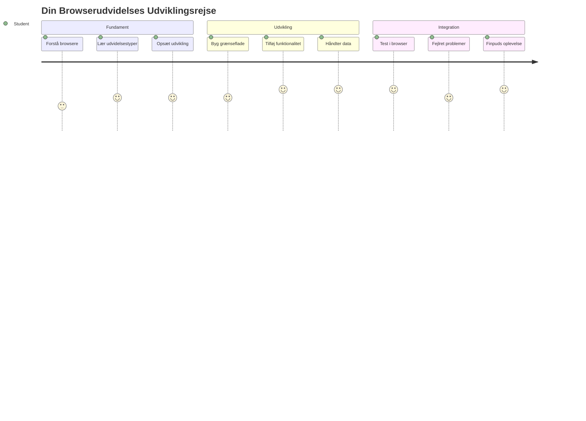
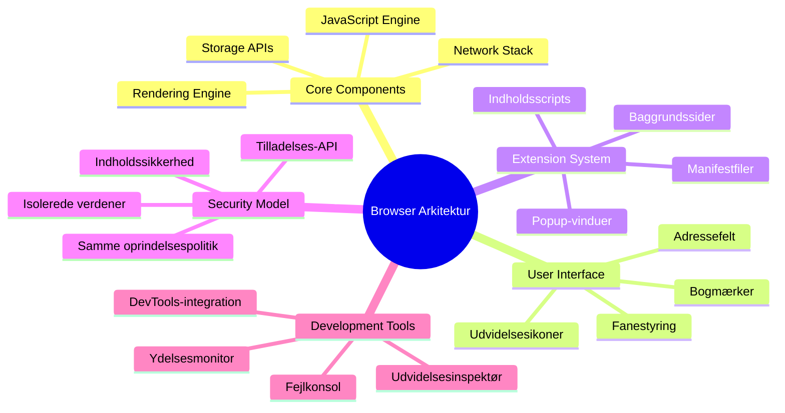
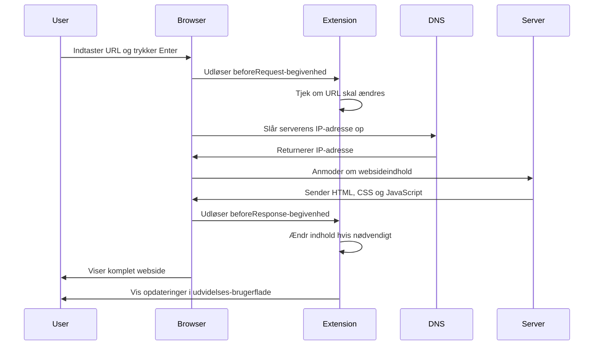
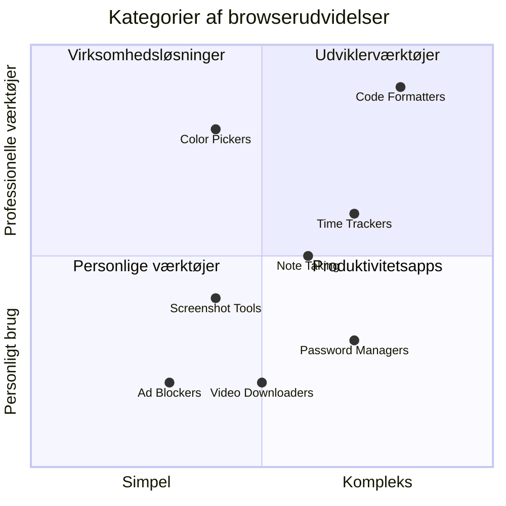
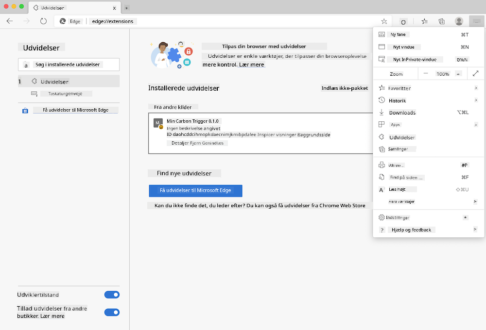
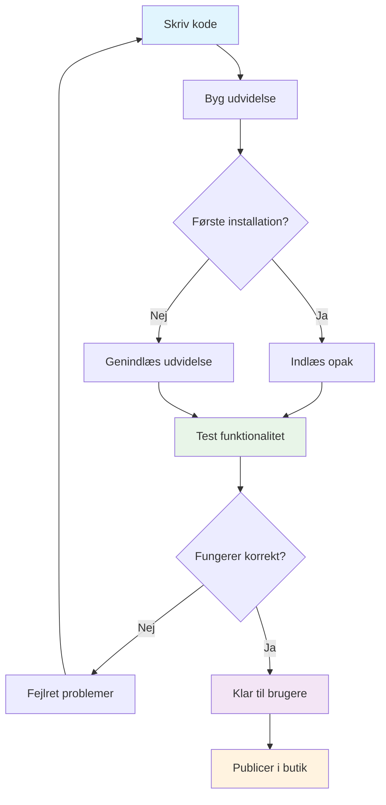
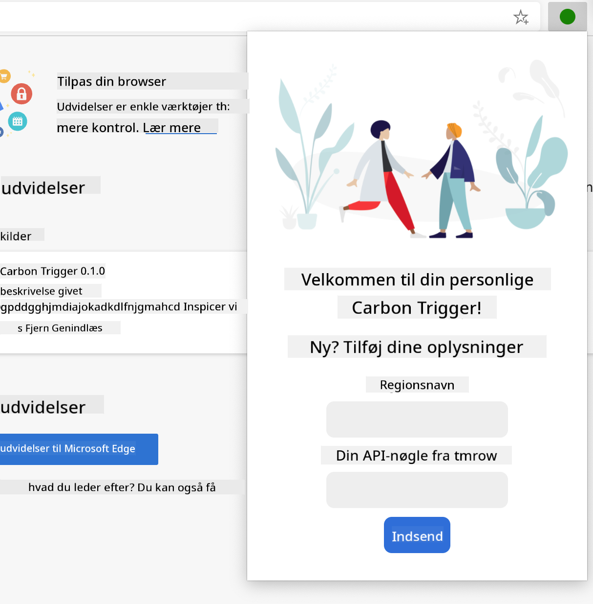
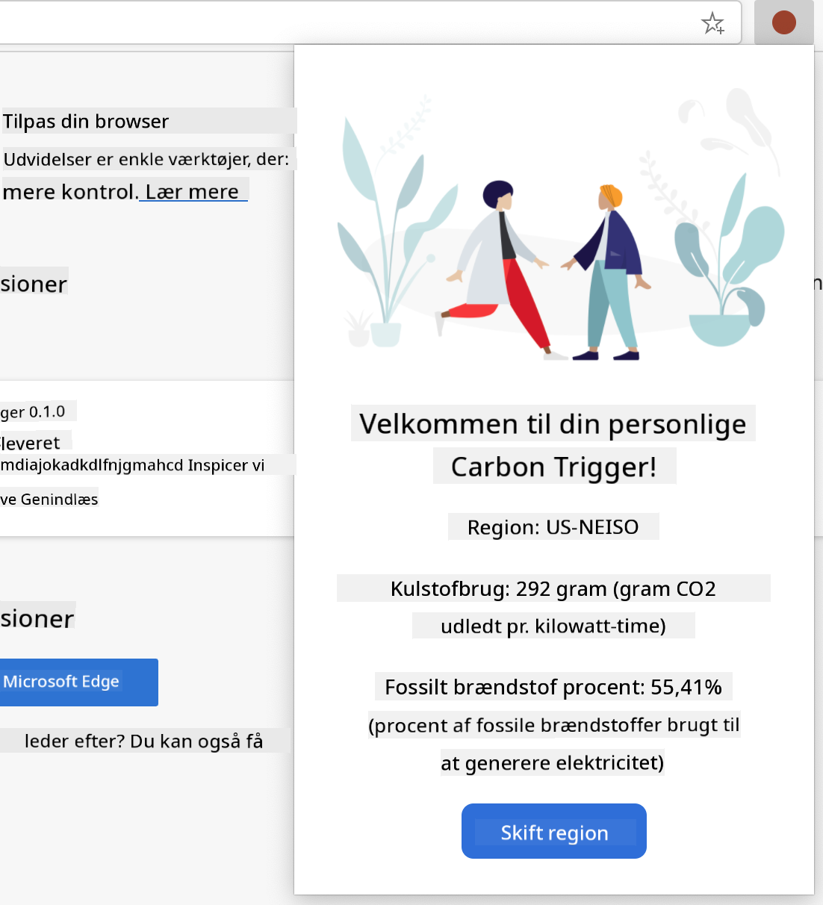
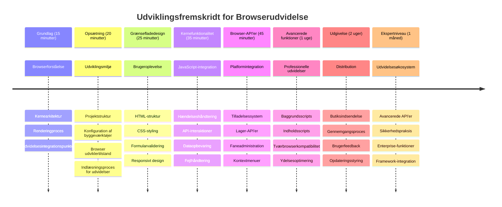

<!--
CO_OP_TRANSLATOR_METADATA:
{
  "original_hash": "00aa85715e1efd4930c17a23e3012e69",
  "translation_date": "2026-01-06T23:47:10+00:00",
  "source_file": "5-browser-extension/1-about-browsers/README.md",
  "language_code": "da"
}
-->
# Browser Extension Project Del 1: Alt om Browsere



> Sketchnote af [Wassim Chegham](https://dev.to/wassimchegham/ever-wondered-what-happens-when-you-type-in-a-url-in-an-address-bar-in-a-browser-3dob)

## Forudgående Quiz

[Forudgående quiz](https://ff-quizzes.netlify.app/web/quiz/23)

### Introduktion

Browser-udvidelser er mini-applikationer, der forbedrer din webbrowseroplevelse. Ligesom Tim Berners-Lees oprindelige vision om et interaktivt web, udvider udvidelser browserens kapaciteter ud over blot visning af dokumenter. Fra adgangskodeadministratorer, der holder dine konti sikre, til farvevælgere, der hjælper designere med at hente perfekte nuancer, løser udvidelser daglige browserudfordringer.

Før vi bygger din første udvidelse, lad os forstå, hvordan browsere fungerer. Ligesom Alexander Graham Bell måtte forstå lydtransmission, før han opfandt telefonen, vil kendskab til browsergrundlaget hjælpe dig med at skabe udvidelser, der integreres problemfrit med eksisterende browsersystemer.

Ved slutningen af denne lektion vil du forstå browserarkitektur og være startet med at bygge din første udvidelse.


## Forståelse af Webbrowsere

En webbrowser er essentielt en avanceret dokumentfortolker. Når du skriver "google.com" i adressebaren, udfører browseren en kompleks række operationer – anmoder om indhold fra servere over hele verden, og fortolker og renderer derefter koden til de interaktive websider, du ser.

Denne proces afspejler, hvordan den første webbrowser, WorldWideWeb, blev designet af Tim Berners-Lee i 1990 for at gøre hyperlinkede dokumenter tilgængelige for alle.

✅ **Lidt historie**: Den første browser hed 'WorldWideWeb' og blev skabt af Sir Timothy Berners-Lee i 1990.


> Nogle tidlige browsere, via [Karen McGrane](https://www.slideshare.net/KMcGrane/week-4-ixd-history-personal-computing)

### Hvordan Browsere Behandler Webindhold

Processen mellem at indtaste en URL og se en webside involverer flere koordinerede trin, der sker inden for sekunder:


**Dette opnår denne proces:**
- **Oversætter** den menneskelige læsbare URL til en server-IP-adresse via DNS opslag
- **Etablerer** en sikker forbindelse til webserveren ved brug af HTTP eller HTTPS protokoller
- **Anmoder** om den specifikke websideindhold fra serveren
- **Modtager** HTML markup, CSS styling og JavaScript kode fra serveren
- **Renderer** alt indhold til den interaktive webside, du ser

### Browsers Kernefunktioner

Moderne browsere tilbyder mange funktioner, som udvidelsesudviklere kan udnytte:

| Funktion | Formål | Udvidelsesmuligheder |
|---------|---------|------------------------|
| **Rendering Engine** | Viser HTML, CSS og JavaScript | Indholdsmodifikation, stylingindsprøjtning |
| **JavaScript Engine** | Udfører JavaScript kode | Egne scripts, API-interaktioner |
| **Local Storage** | Gemmer data lokalt | Brugerpræferencer, cachelagrede data |
| **Network Stack** | Håndterer webanmodninger | Anmodningsovervågning, dataanalyse |
| **Security Model** | Beskytter brugere mod ondsindet indhold | Indholdsfiltrering, sikkerhedsforbedringer |

**At forstå disse funktioner hjælper dig med at:**
- **Identificere** hvor din udvidelse kan tilføre mest værdi
- **Vælge** de rigtige browser-API'er til din udvidelses funktionalitet
- **Designe** udvidelser, der arbejder effektivt med browsersystemerne
- **Sikre** at din udvidelse følger browserens sikkerheds bedste praksis

### Overvejelser om Cross-Browser Udvikling

Forskellige browsere implementerer standarder med små variationer, ligesom forskellige programmeringssprog kan håndtere den samme algoritme forskelligt. Chrome, Firefox og Safari har hver unikke karakteristika, som udviklere må tage højde for under udvidelsesudvikling.

> 💡 **Pro Tip**: Brug [caniuse.com](https://www.caniuse.com) til at tjekke, hvilke webteknologier der understøttes på tværs af forskellige browsere. Dette er uvurderligt, når du planlægger din udvidelses funktioner!

**Vigtige overvejelser ved udvidelsesudvikling:**
- **Test** din udvidelse på Chrome, Firefox og Edge browsere
- **Tilpas** til forskellige browser-udvidelses-API'er og manifestformater
- **Håndter** forskellig ydelseskarakteristik og begrænsninger
- **Giv** fallback-løsninger for browser-specifikke funktioner, der måske ikke er tilgængelige

✅ **Analyseindsigt**: Du kan afgøre, hvilke browsere dine brugere foretrækker, ved at installere analysepakker i dine webudviklingsprojekter. Disse data hjælper dig med at prioritere, hvilke browsere du skal understøtte først.

## Forståelse af Browserudvidelser

Browserudvidelser løser almindelige webbrowseudfordringer ved at tilføje funktionalitet direkte i browserens interface. I stedet for at kræve separate applikationer eller komplekse arbejdsgange, giver udvidelser øjeblikkelig adgang til værktøjer og funktioner.

Dette koncept afspejler, hvordan tidlige computerpionerer som Douglas Engelbart forestillede sig at forstærke menneskelige evner med teknologi – udvidelser forstærker din browsers basisfunktionalitet.


**Populære udvidelseskategorier og deres fordele:**
- **Produktivitetsværktøjer**: Opgavestyring, notattagningsapps og tidsmålere, der hjælper dig med at holde styr på tingene
- **Sikkerhedsforbedringer**: Adgangskodeadministratorer, annonceblokkere og privatlivsværktøjer, der beskytter dine data
- **Udviklerværktøjer**: Kodeformaterere, farvevælgere og debug-værktøjer, der effektiviserer udvikling
- **Indholdsforbedring**: Læsetilstande, video-downloadere og screenshot-værktøjer, der forbedrer din weoplevelse

✅ **Refleksionsspørgsmål**: Hvilke browserudvidelser er dine favoritter? Hvilke specifikke opgaver udfører de, og hvordan forbedrer de din browseroplevelse?

### 🔄 **Pædagogisk Tjek-ind**
**Forståelse af Browserarkitektur**: Før du går i gang med udvidelsesudvikling, skal du sørge for, at du kan:
- ✅ Forklare, hvordan browsere håndterer webanmodninger og renderer indhold
- ✅ Identificere hovedkomponenterne i browserarkitekturen
- ✅ Forstå, hvordan udvidelser integreres med browserfunktionalitet
- ✅ Genkende sikkerhedsmodellen, der beskytter brugerne

**Hurtig Selvtest**: Kan du spore vejen fra det at indtaste en URL til at se en webside?
1. **DNS opslag** omdanner URL til IP-adresse
2. **HTTP-anmodning** henter indhold fra serveren
3. **Parsing** behandler HTML, CSS og JavaScript
4. **Rendering** viser den endelige webside
5. **Udvidelser** kan ændre indhold på flere trin

## Installation og Administration af Udvidelser

At forstå installationsprocessen for udvidelser hjælper dig med at forudse brugeroplevelsen, når folk installerer din udvidelse. Installationsprocessen er standardiseret på tværs af moderne browsere med mindre variationer i grænsefladedesign.



> **Vigtigt**: Sørg for at slå udviklertilstand til og tillade udvidelser fra andre butikker, når du tester dine egne udvidelser.

### Udviklingsinstallation af Udvidelser

Når du udvikler og tester dine egne udvidelser, følg denne arbejdsgang:


```bash
# Trin 1: Byg din udvidelse
npm run build
```

**Dette kommando opnår:**
- **Kompilerer** din kildekode til filer, der er klar til browseren
- **Pakker** JavaScript-moduler i optimerede pakker
- **Genererer** de endelige udvidelsesfiler i `/dist` mappen
- **Forbereder** din udvidelse til installation og test

**Trin 2: Naviger til Browser Udvidelser**
1. **Åbn** din browsers side til håndtering af udvidelser
2. **Klik** på knappen "Indstillinger og mere" (ikonet med `...`) øverst til højre
3. **Vælg** "Udvidelser" fra dropdown-menuen

**Trin 3: Indlæs din Udvidelse**
- **For nye installationer**: Vælg `load unpacked` og vælg din `/dist` mappe
- **For opdateringer**: Klik `reload` ved siden af din allerede installerede udvidelse
- **For test**: Aktiver "Udviklertilstand" for at få adgang til yderligere debugging-funktioner

### Produktionsinstallation af Udvidelser

> ✅ **Bemærk**: Disse udviklingsinstruktioner gælder specifikt for udvidelser, du selv bygger. For at installere offentliggjorte udvidelser, besøg de officielle browser-udvidelsesbutikker som [Microsoft Edge Add-ons store](https://microsoftedge.microsoft.com/addons/Microsoft-Edge-Extensions-Home).

**Forstå forskellen:**
- **Udviklingsinstallationer** giver mulighed for at teste upublicerede udvidelser under udvikling
- **Butiksinstallationer** leverer godkendte, offentliggjorte udvidelser med automatiske opdateringer
- **Sideindlæsning** tillader installation af udvidelser uden for officielle butikker (kræver udviklertilstand)

## Byg din Carbon Footprint Udvidelse

Vi vil skabe en browserudvidelse, der viser kulstofaftrykket for dit regions energiforbrug. Dette projekt demonstrerer essentielle konceptuelle principper i udvidelsesudvikling, samtidig med at det skaber et praktisk værktøj til miljøbevidsthed.

Denne tilgang følger princippet om "læring ved at gøre", der har vist sig effektivt siden John Deweys pædagogiske teorier – en kombination af tekniske færdigheder med meningsfulde, virkelige anvendelser.

### Projektkrav

Før begyndelsen af udviklingen, lad os samle de nødvendige ressourcer og afhængigheder:

**Påkrævet API-adgang:**
- **[CO2 Signal API nøgle](https://www.co2signal.com/)**: Indtast din e-mailadresse for at modtage din gratis API-nøgle
- **[Regionskode](http://api.electricitymap.org/v3/zones)**: Find din regionskode med [Electricity Map](https://www.electricitymap.org/map) (for eksempel bruger Boston 'US-NEISO')

**Udviklingsværktøjer:**
- **[Node.js og NPM](https://www.npmjs.com)**: Værktøj til pakkeadministration til installation af projektets afhængigheder
- **[Startkode](../../../../5-browser-extension/start)**: Download `start` mappen for at begynde udviklingen

✅ **Lær mere**: Forbedr dine færdigheder i pakkehåndtering med dette [omfattende Learn modul](https://docs.microsoft.com/learn/modules/create-nodejs-project-dependencies/?WT.mc_id=academic-77807-sagibbon)

### Forståelse af Projektstrukturen

At forstå projektstrukturen hjælper med at organisere udviklingsarbejdet effektivt. Ligesom Alexandria Biblioteket var organiseret for nem adgang til viden, gør en veldesignet kodebase udviklingen mere effektiv:

```
project-root/
├── dist/                    # Built extension files
│   ├── manifest.json        # Extension configuration
│   ├── index.html           # User interface markup
│   ├── background.js        # Background script functionality
│   └── main.js              # Compiled JavaScript bundle
├── src/                     # Source development files
│   └── index.js             # Your main JavaScript code
├── package.json             # Project dependencies and scripts
└── webpack.config.js        # Build configuration
```

**Hvad hver fil står for:**
- **`manifest.json`**: **Definerer** udvidelsens metadata, tilladelser og indgangspunkt
- **`index.html`**: **Skaber** brugergrænsefladen, der vises, når brugerne klikker på udvidelsen
- **`background.js`**: **Håndterer** baggrundsopgaver og browserens event-lyttere
- **`main.js`**: **Indeholder** den endelige bundlede JavaScript efter build-processen
- **`src/index.js`**: **Huser** din hovedudviklingskode, som kompileres til `main.js`

> 💡 **Organiseringstip**: Gem din API-nøgle og regionskode i en sikker note for nem reference under udvikling. Du får brug for disse værdier til at teste din udvidelses funktionalitet.

✅ **Sikkerhedsnote**: Indsend aldrig API-nøgler eller følsomme legitimationsoplysninger i dit kodearkiv. Vi vil vise dig, hvordan du håndterer disse sikkert i næste trin.

## Oprettelse af Udvidelsesinterfacet

Nu bygger vi brugergrænsefladekomponenterne. Udvidelsen bruger en to-skærms tilgang: en konfigurationsskærm til den indledende opsætning og en resultatskærm til visning af data.

Dette følger princippet om gradvis afsløring, brugt i interface design siden datidens tidlige dage – at afsløre information og muligheder i en logisk rækkefølge for at undgå at overvælde brugerne.

### Oversigt over Udvidelsesvisninger

**Opsætningsvisning** – første gangs bruger-konfiguration:


**Resultatvisning** – visning af kulstofaftrykdata:


### Bygning af Konfigurationsformularen

Opsætningsformularen indsamler brugerens konfigurationsdata under første brug. Når konfigureret, gemmes oplysningerne i browserens lager til fremtidige sessioner.

I filen `/dist/index.html`, tilføj denne struktur for formularen:

```html
<form class="form-data" autocomplete="on">
    <div>
        <h2>New? Add your Information</h2>
    </div>
    <div>
        <label for="region">Region Name</label>
        <input type="text" id="region" required class="region-name" />
    </div>
    <div>
        <label for="api">Your API Key from tmrow</label>
        <input type="text" id="api" required class="api-key" />
    </div>
    <button class="search-btn">Submit</button>
</form>
```

**Dette opnår formularen:**
- **Skaber** en semantisk formularstruktur med korrekte labels og input-associationer
- **Muliggør** browserens autocomplete-funktion for bedre brugervenlighed
- **Kræver**, at begge felter udfyldes før indsendelse ved brug af `required` attributten
- **Organiserer** inputs med beskrivende klassenavne for nem styling og JavaScript-målretning
- **Giver** klare instruktioner til brugere, der opsætter udvidelsen første gang

### Bygning af Resultatvisningen

Dernæst opretter du resultatområdet, som viser kulstofaftryksdataene. Tilføj denne HTML under formularen:

```html
<div class="result">
    <div class="loading">loading...</div>
    <div class="errors"></div>
    <div class="data"></div>
    <div class="result-container">
        <p><strong>Region: </strong><span class="my-region"></span></p>
        <p><strong>Carbon Usage: </strong><span class="carbon-usage"></span></p>
        <p><strong>Fossil Fuel Percentage: </strong><span class="fossil-fuel"></span></p>
    </div>
    <button class="clear-btn">Change region</button>
</div>
```

**Hvad denne struktur leverer:**
- **`loading`**: **Viser** en indlæsningsbesked, mens API-data hentes
- **`errors`**: **Viser** fejlbeskeder, hvis API-kald fejler eller data er ugyldige
- **`data`**: **Holder** rå data til debugging under udviklingen
- **`result-container`**: **Præsenterer** formateret kulstofaftryksinformation for brugerne
- **`clear-btn`**: **Tillader** brugere at ændre deres region og konfigurere udvidelsen igen

### Opsætning af Build-processen

Nu installerer vi projektets afhængigheder og tester build-processen:

```bash
npm install
```

**Hvad denne installationsproces opnår:**
- **Downloader** Webpack og andre udviklingsafhængigheder som specificeret i `package.json`
- **Konfigurerer** byggeværktøjskæden til kompilering af moderne JavaScript
- **Forbereder** udviklingsmiljøet til at bygge og teste udvidelsen
- **Muliggør** kodesamling, optimering og tværbrowserkompatibilitet

> 💡 **Build Process Indsigt**: Webpack samler din kildekode fra `/src/index.js` til `/dist/main.js`. Denne proces optimerer din kode til produktion og sikrer browserkompatibilitet.

### Test af din Fremgang

På dette tidspunkt kan du teste din udvidelse:
1. **Kør** build-kommandoen for at kompilere din kode  
2. **Indlæs** udvidelsen i din browser ved hjælp af udviklertilstand  
3. **Bekræft**, at formularen vises korrekt og ser professionel ud  
4. **Tjek**, at alle formelementer er korrekt justeret og funktionelle  

**Det du har opnået:**  
- **Bygget** den grundlæggende HTML-struktur til din udvidelse  
- **Oprettet** både konfigurations- og resultatgrænseflader med korrekt semantisk markup  
- **Opsat** en moderne udviklingsworkflow med brancheførende værktøjer  
- **Forberedt** fundamentet for at tilføje interaktiv JavaScript-funktionalitet  

### 🔄 **Pædagogisk status**
**Udvidelsesudviklingsfremskridt**: Bekræft din forståelse før du fortsætter:  
- ✅ Kan du forklare formålet med hver fil i projektstrukturen?  
- ✅ Forstår du, hvordan build-processen transformerer din kildekode?  
- ✅ Hvorfor adskiller vi konfiguration og resultater i forskellige UI-sektioner?  
- ✅ Hvordan understøtter formularstrukturen både brugervenlighed og tilgængelighed?  

**Forståelse af udviklingsworkflow**: Du bør nu kunne:  
1. **Ændre** HTML og CSS for din udvidelsesgrænseflade  
2. **Køre** build-kommandoen for at kompilere dine ændringer  
3. **Genindlæse** udvidelsen i din browser for at teste opdateringer  
4. **Fejlsøge** problemer ved hjælp af browserens udviklerværktøjer  

Du har gennemført den første fase af browserudvidelsesudvikling. Ligesom brødrene Wright først skulle forstå aerodynamik før de opnåede flyvning, forbereder forståelsen af disse grundlæggende koncepter dig på at bygge mere komplekse interaktive funktioner i næste lektion.  

## GitHub Copilot Agent Challenge 🚀

Brug Agent-tilstand til at fuldføre følgende udfordring:  

**Beskrivelse:** Forbedr browserudvidelsen ved at tilføje validering af formular og brugerfeedbackfunktioner for at forbedre brugeroplevelsen ved indtastning af API-nøgler og regionskoder.  

**Prompt:** Opret JavaScript-valideringsfunktioner, der kontrollerer, om API-nøgelfeltet indeholder mindst 20 tegn, og om regionskoden følger korrekt format (som 'US-NEISO'). Tilføj visuel feedback ved at ændre inputkantfarver til grøn for gyldige input og rød for ugyldige. Tilføj også en skiftemulighed til at vise/skjule API-nøglen for sikkerhedsformål.  

Lær mere om [agent-tilstand](https://code.visualstudio.com/blogs/2025/02/24/introducing-copilot-agent-mode) her.  

## 🚀 Udfordring

Tag et kig på en browserudvidelsesbutik og installer en udvidelse i din browser. Du kan undersøge dens filer på interessante måder. Hvad opdager du?  

## Quiz efter forelæsning  

[Quiz efter forelæsning](https://ff-quizzes.netlify.app/web/quiz/24)  

## Gennemgang & Selvlæring  

I denne lektion lærte du lidt om historien bag webbrowsere; benyt lejligheden til at lære, hvordan opfinderne af World Wide Web forestillede sig dets brug ved at læse mere om dets historie. Nogle nyttige sider inkluderer:  

[Historien om webbrowsere](https://www.mozilla.org/firefox/browsers/browser-history/)  

[Historien om Webben](https://webfoundation.org/about/vision/history-of-the-web/)  

[Et interview med Tim Berners-Lee](https://www.theguardian.com/technology/2019/mar/12/tim-berners-lee-on-30-years-of-the-web-if-we-dream-a-little-we-can-get-the-web-we-want)  

### ⚡ **Hvad du kan nå på de næste 5 minutter**  
- [ ] Åbn Chrome/Edge-udvidelsessiden (chrome://extensions) og udforsk, hvad du har installeret  
- [ ] Se på din browsers DevTools-netværksfane mens en webside indlæses  
- [ ] Prøv at se sidekilde (Ctrl+U) for at se HTML-strukturen  
- [ ] Inspicer et hvilket som helst websides element og ændr dets CSS i DevTools  

### 🎯 **Hvad du kan opnå i denne time**  
- [ ] Fuldfør quizzen efter lektionen og forstå browsergrundlag  
- [ ] Opret en grundlæggende manifest.json-fil til en browserudvidelse  
- [ ] Byg en simpel "Hello World" udvidelse med popup  
- [ ] Test at indlæse din udvidelse i udviklertilstand  
- [ ] Undersøg browserudvidelsesdokumentationen for din målbrowser  

### 📅 **Din ugelange udvidelsesrejse**  
- [ ] Fuldfør en funktionel browserudvidelse med reel nytte  
- [ ] Lær om content scripts, baggrundsscripts og popup-interaktioner  
- [ ] Mestre browser-API’er som storage, tabs og messaging  
- [ ] Design brugervenlige grænseflader til din udvidelse  
- [ ] Test din udvidelse på forskellige websites og scenarier  
- [ ] Udgiv din udvidelse i browserens udvidelsesbutik  

### 🌟 **Din månedlange browserudvikling**  
- [ ] Byg flere udvidelser, der løser forskellige brugerproblemer  
- [ ] Lær avancerede browser-API’er og sikkerhedspraksis  
- [ ] Bidrag til open source-browserudvidelsesprojekter  
- [ ] Mestre tværbrowser-kompatibilitet og progressiv forbedring  
- [ ] Skab udviklingsværktøjer og skabeloner til udvidelser for andre  
- [ ] Bliv en browserudvidelsekspert, der hjælper andre udviklere  

## 🎯 Din browserudvidelses-mestertidlinje  


### 🛠️ Oversigt over dit udvidelsesudviklingsværktøj  

Efter at have gennemført denne lektion har du nu:  
- **Viden om browserarkitektur**: Forståelse for gengivelsesmotorer, sikkerhedsmodeller og integration af udvidelser  
- **Udviklingsmiljø**: Moderne værktøjskæde med Webpack, NPM og fejlfinding  
- **UI/UX-fundament**: Semantisk HTML-struktur med progressiv afsløringsmønstre  
- **Sikkerhedsbevidsthed**: Forståelse for browser-tilladelser og sikker udvikling  
- **Tværbrowser-koncept**: Viden om kompatibilitetsbetragtninger og testmetoder  
- **API-integration**: Fundament for at arbejde med eksterne datakilder  
- **Professionelt workflow**: Brancheførende udviklings- og testprocedurer  

**Anvendelser i praksis**: Disse færdigheder gælder direkte for:  
- **Webudvikling**: Single-page apps og progressive web apps  
- **Desktop-applikationer**: Electron og webbaserede desktopsprogrammer  
- **Mobiludvikling**: Hybride apps og webbaserede mobil-løsninger  
- **Enterprise-værktøj**: Interne produktivitetsapplikationer og automatisering af workflows  
- **Open Source**: Bidrag til browserudvidelsesprojekter og webstandarder  

**Næste niveau**: Du er klar til at tilføje interaktiv funktionalitet, arbejde med browser-API’er og skabe udvidelser, der løser reelle brugerproblemer!  

## Opgave  

[Stil din udvidelse om](assignment.md)

---

<!-- CO-OP TRANSLATOR DISCLAIMER START -->
**Ansvarsfraskrivelse**:
Dette dokument er oversat ved hjælp af AI-oversættelsestjenesten [Co-op Translator](https://github.com/Azure/co-op-translator). Selvom vi bestræber os på nøjagtighed, skal du være opmærksom på, at automatiserede oversættelser kan indeholde fejl eller unøjagtigheder. Det oprindelige dokument på dets sprog bør betragtes som den autoritative kilde. Ved kritisk information anbefales professionel menneskelig oversættelse. Vi påtager os intet ansvar for misforståelser eller fejltolkninger, der opstår som følge af brugen af denne oversættelse.
<!-- CO-OP TRANSLATOR DISCLAIMER END -->