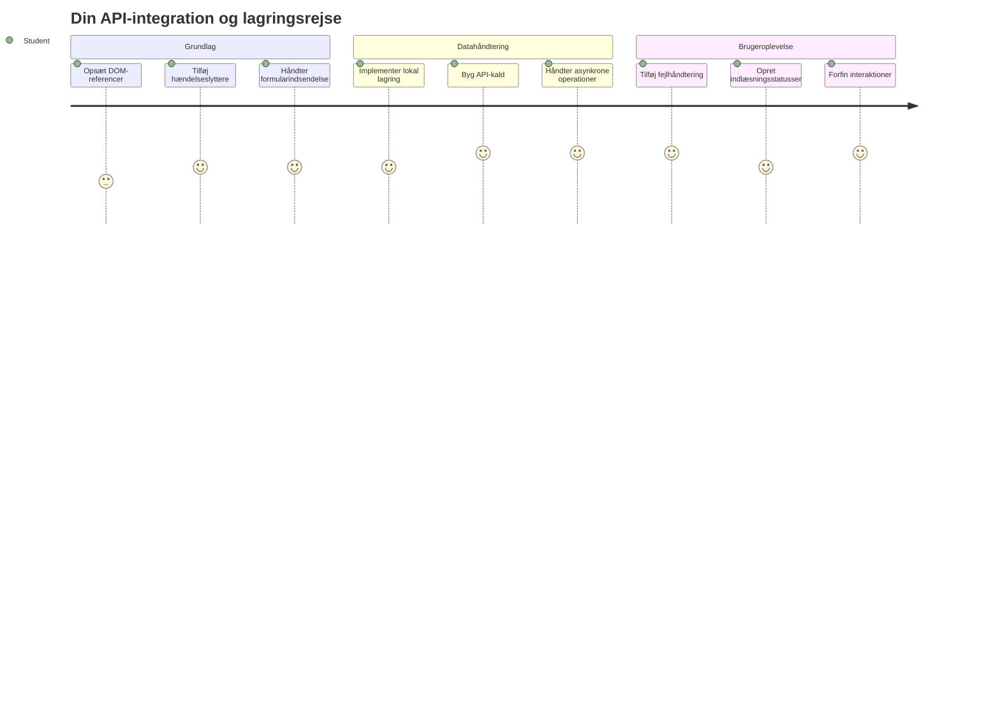
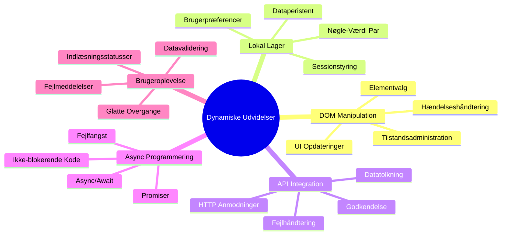
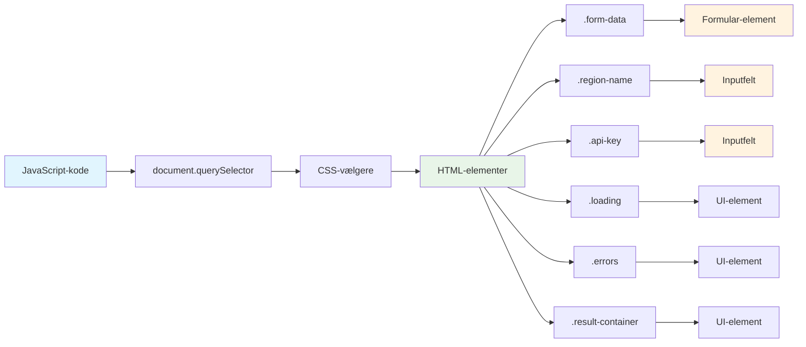
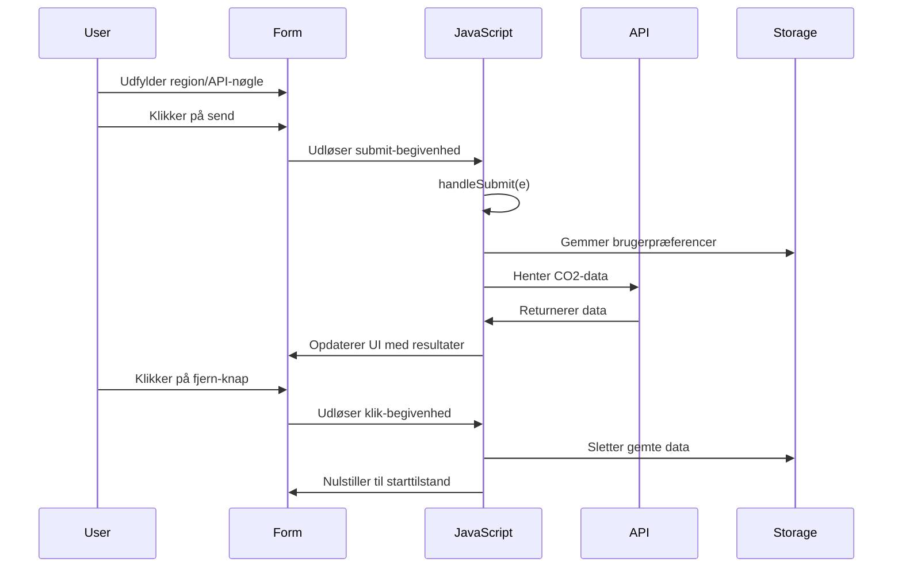
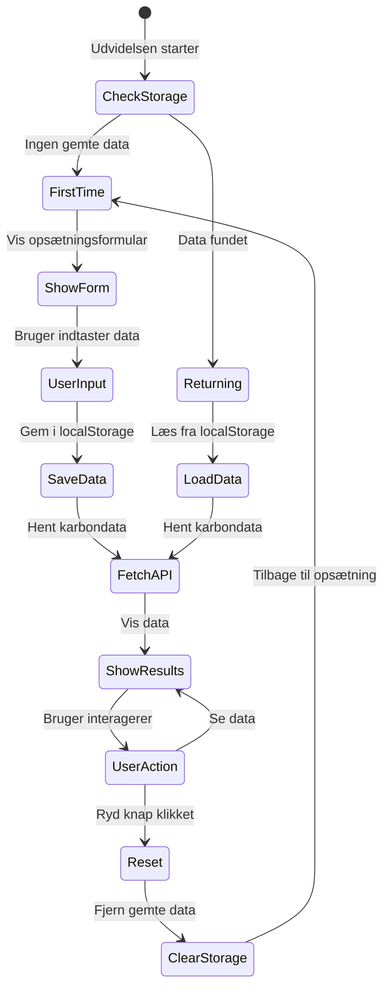
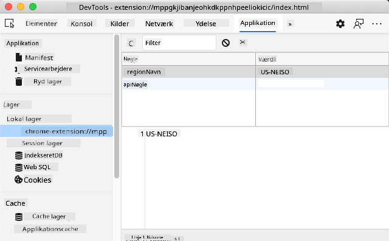
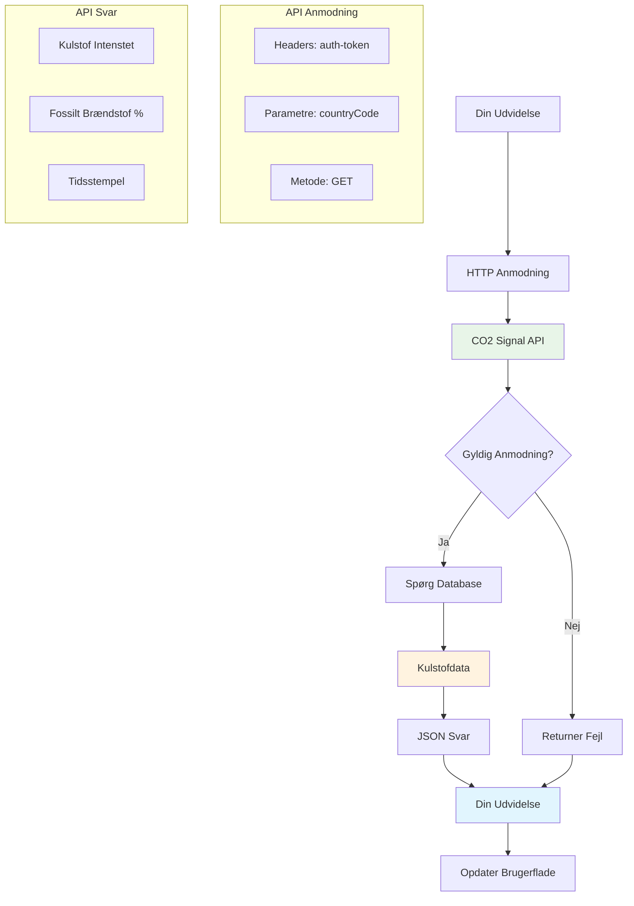
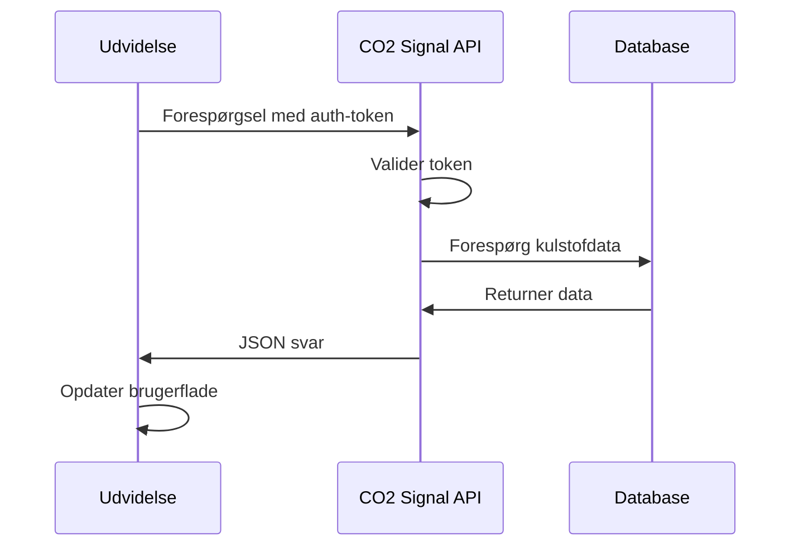
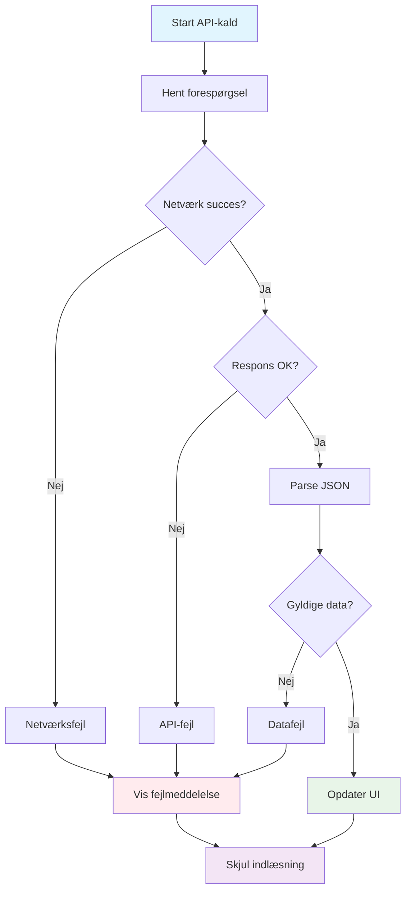
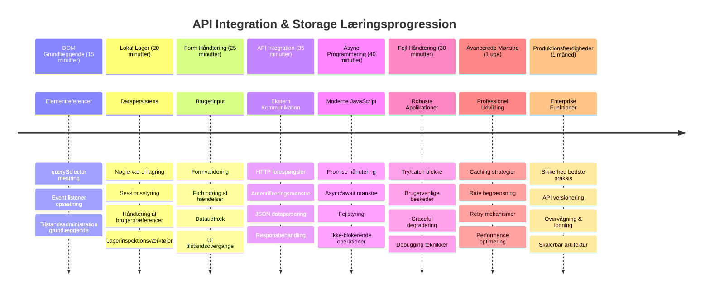

<!--
CO_OP_TRANSLATOR_METADATA:
{
  "original_hash": "2b6203a48c48d8234e0948353b47d84e",
  "translation_date": "2026-01-06T23:44:17+00:00",
  "source_file": "5-browser-extension/2-forms-browsers-local-storage/README.md",
  "language_code": "da"
}
-->
# Browserudvidelsesprojekt Del 2: Kald et API, brug Lokal Lager


## For-forelæsning Quiz

[For-forelæsning quiz](https://ff-quizzes.netlify.app/web/quiz/25)

## Introduktion

Kan du huske den browserudvidelse, du begyndte at bygge? Lige nu har du en pæn form, men den er i bund og grund statisk. I dag vil vi bringe den til live ved at forbinde den til rigtige data og give den hukommelse.

Tænk på Apollo-missionens kontrolcomputere - de viste ikke bare faste oplysninger. De kommunikerede konstant med rumfartøjer, opdaterede med telemetridata og huskede kritiske missionparametre. Det er den slags dynamisk opførsel, vi bygger i dag. Din udvidelse vil række ud på internettet, hente rigtige miljødata og huske dine indstillinger til næste gang.

API-integration kan lyde komplekst, men det handler egentlig bare om at lære din kode at kommunikere med andre tjenester. Uanset om du henter vejrudsigter, sociale mediefeeds eller CO2-aftryksinformation som vi vil gøre i dag, drejer det sig om at etablere disse digitale forbindelser. Vi vil også udforske, hvordan browsere kan gemme information - ligesom biblioteker tidligere har brugt kortkataloger til at huske, hvor bøgerne hører til.

Ved slutningen af denne lektion vil du have en browserudvidelse, der henter rigtige data, gemmer brugerpræferencer og leverer en glat brugeroplevelse. Lad os komme i gang!


✅ Følg de nummererede segmenter i de relevante filer for at vide, hvor du skal placere din kode

## Opsæt elementerne til manipulation i udvidelsen

Før din JavaScript kan manipulere interfacet, har den brug for referencer til specifikke HTML-elementer. Tænk på det som et teleskop, der skal rettes mod bestemte stjerner – før Galileo kunne studere Jupiters måner, måtte han finde og fokusere på Jupiter selv.

I din `index.js` fil vil vi oprette `const` variabler, der fanger referencer til hvert vigtigt formelement. Det svarer til, hvordan videnskabsfolk mærker deres udstyr – i stedet for at lede gennem hele laboratoriet hver gang, kan de direkte tilgå, hvad de behøver.


```javascript
// formularfelter
const form = document.querySelector('.form-data');
const region = document.querySelector('.region-name');
const apiKey = document.querySelector('.api-key');

// resultater
const errors = document.querySelector('.errors');
const loading = document.querySelector('.loading');
const results = document.querySelector('.result-container');
const usage = document.querySelector('.carbon-usage');
const fossilfuel = document.querySelector('.fossil-fuel');
const myregion = document.querySelector('.my-region');
const clearBtn = document.querySelector('.clear-btn');
```

**Dette gør koden:**
- **Fanger** formelementer ved hjælp af `document.querySelector()` med CSS-klassevælgere
- **Opretter** referencer til inputfelterne for regionsnavn og API-nøgle
- **Etablerer** forbindelse til resultatelementer for data om CO2-forbrug
- **Opsætter** adgang til UI-elementer som indlæsningsindikatorer og fejllmeddelelser
- **Gemmer** hver elementreference i en `const` variabel for nem genbrug gennem din kode

## Tilføj event listeners

Nu vil vi gøre din udvidelse reagerende på brugerhandlinger. Event listeners er din kodes måde at overvåge brugerinteraktioner på. Tænk på dem som telefoncentraloperatører i de tidlige telefonvekslinger – de lyttede efter indkommende opkald og forbindede de rette kredsløb, når nogen ønskede at etablere forbindelse.


```javascript
form.addEventListener('submit', (e) => handleSubmit(e));
clearBtn.addEventListener('click', (e) => reset(e));
init();
```

**Forståelse af disse koncepter:**
- **Tilføjer** en submit listener til formen, der udløses, når brugere trykker Enter eller klikker for at sende
- **Forbinder** en click listener til ryd-knappen for at nulstille formen
- **Sender** event-objektet `(e)` til håndteringsfunktioner for yderligere kontrol
- **Kalder** `init()` funktionen med det samme for at sætte den indledende tilstand for din udvidelse

✅ Bemærk den korte pilefunktionssyntaks, der bruges her. Denne moderne JavaScript-tilgang er renere end traditionelle funktionsudtryk, men begge fungerer lige godt!

### 🔄 **Pædagogisk Check-in**
**Forståelse af Event Handling**: Før vi går videre til initialisering, skal du kunne:
- ✅ Forklare hvordan `addEventListener` forbinder brugerhandlinger til JavaScript-funktioner
- ✅ Forstå hvorfor vi sender event-objektet `(e)` til håndteringsfunktionerne
- ✅ Genkende forskellen mellem `submit` og `click` events
- ✅ Beskrive hvornår `init()` funktionen kører og hvorfor

**Hurtig Selvtest**: Hvad ville der ske, hvis du glemte `e.preventDefault()` i en formindsendelse?
*Svar: Siden ville genindlæses og miste al JavaScript-tilstand, hvilket afbryder brugeroplevelsen*

## Byg initialiserings- og nulstillingsfunktioner

Lad os oprette initialiseringslogikken til din udvidelse. `init()` funktionen er som et skibs navigationssystem, der tjekker sine instrumenter – den vurderer den aktuelle tilstand og justerer interfacet tilsvarende. Den tjekker, om nogen har brugt din udvidelse før, og indlæser deres tidligere indstillinger.

`reset()` funktionen giver brugeren en frisk start – ligesom videnskabsfolk nulstiller deres instrumenter mellem eksperimenter for at sikre rene data.

```javascript
function init() {
	// Tjek om brugeren tidligere har gemt API-legitimationsoplysninger
	const storedApiKey = localStorage.getItem('apiKey');
	const storedRegion = localStorage.getItem('regionName');

	// Sæt udvidelsesikonet til generisk grøn (pladsholder til fremtidig lektion)
	// TODO: Implementer ikonopdatering i næste lektion

	if (storedApiKey === null || storedRegion === null) {
		// Førstegangsbruger: vis opsætningsformularen
		form.style.display = 'block';
		results.style.display = 'none';
		loading.style.display = 'none';
		clearBtn.style.display = 'none';
		errors.textContent = '';
	} else {
		// Tilbagevendende bruger: indlæs deres gemte data automatisk
		displayCarbonUsage(storedApiKey, storedRegion);
		results.style.display = 'none';
		form.style.display = 'none';
		clearBtn.style.display = 'block';
	}
}

function reset(e) {
	e.preventDefault();
	// Ryd gemt region for at tillade brugeren at vælge en ny placering
	localStorage.removeItem('regionName');
	// Genstart initialiseringsprocessen
	init();
}
```

**Hvad der sker her:**
- **Henter** gemt API-nøgle og region fra browserens local storage
- **Tjekker** om det er første gang brugeren (ingen gemte oplysninger) eller en tilbagevendende bruger
- **Viser** opsætningsformularen for nye brugere og skjuler andre interfaceelementer
- **Indlæser** automatisk gemte data for tilbagevendende brugere og viser nulstillingsmuligheden
- **Styrer** brugergrænsefladens tilstand baseret på tilgængelig data

**Vigtige koncepter om Local Storage:**
- **Gemmer** data mellem browser-sessioner (modsat session storage)
- **Gemmer** data som nøgle-værdi par ved hjælp af `getItem()` og `setItem()`
- **Returnerer** `null` hvis ingen data findes for en given nøgle
- **Giver** en enkel måde at huske brugerpræferencer og indstillinger på

> 💡 **Forståelse af browserlagring**: [LocalStorage](https://developer.mozilla.org/docs/Web/API/Window/localStorage) svarer til at give din udvidelse en vedvarende hukommelse. Tænk på, hvordan det gamle bibliotek i Alexandria lagrede skriftruller - information forblev tilgængelig, selv når lærde gik og vendte tilbage.
>
> **Nøglekarakteristika:**
> - **Bevarer** data, selv efter browseren lukkes
> - **Overlever** computer genstarter og browsernedbrud
> - **Giver** betydelig lagerplads til brugerindstillinger
> - **Tilbyder** øjeblikkelig adgang uden netværksforsinkelser

> **Vigtigt:** Din browserudvidelse har sin egen isolerede local storage, adskilt fra almindelige websider. Dette giver sikkerhed og forhindrer konflikter med andre websites.

Du kan se dine gemte data ved at åbne browserens udviklerværktøjer (F12), gå til fanen **Application** og udvide sektionen **Local Storage**.




> ⚠️ **Sikkerhedsovervejelse**: I produktionsapplikationer udgør lagring af API-nøgler i LocalStorage sikkerhedsrisici, da JavaScript kan tilgå disse data. Til læringsformål fungerer dette fint, men rigtige applikationer bør bruge sikker server-side lagring til følsomme oplysninger.

## Håndter formindsendelse

Nu håndterer vi, hvad der sker, når nogen indsender din form. Som standard genindlæser browsere siden ved formindsendelser, men vi vil opsnappe denne adfærd for at skabe en glattere oplevelse.

Denne tilgang afspejler, hvordan mission control håndterer rumfartøjskommunikation - i stedet for at nulstille hele systemet for hver transmission, opretholder de kontinuerlig drift, mens de behandler ny information.

Opret en funktion, der fanger formindsendelsesbegivenheden og udtrækker brugerens input:

```javascript
function handleSubmit(e) {
	e.preventDefault();
	setUpUser(apiKey.value, region.value);
}
```

**I ovenstående har vi:**
- **Forhindret** standard formindsendelsesadfærd, der ellers ville opdatere siden
- **Udtrukket** brugerinputværdier fra API-nøgle og region felterne
- **Sendt** formdata til `setUpUser()` funktionen til behandling
- **Opretholdt** single-page applikationsadfærd ved at undgå sidegenindlæsninger

✅ Husk at dine HTML-formfelter indeholder `required` attributten, så browseren automatisk validerer, at brugerne har angivet både API-nøgle og region, før denne funktion kører.

## Opsæt brugerpræferencer

`setUpUser` funktionen er ansvarlig for at gemme brugerens legitimationsoplysninger og igangsætte det første API-kald. Det skaber en glidende overgang fra opsætning til visning af resultater.

```javascript
function setUpUser(apiKey, regionName) {
	// Gem bruger legitimationsoplysninger til fremtidige sessioner
	localStorage.setItem('apiKey', apiKey);
	localStorage.setItem('regionName', regionName);
	
	// Opdater brugergrænsefladen for at vise indlæsningsstatus
	loading.style.display = 'block';
	errors.textContent = '';
	clearBtn.style.display = 'block';
	
	// Hent data om kulstofforbrug med brugerens legitimationsoplysninger
	displayCarbonUsage(apiKey, regionName);
}
```

**Trin for trin sker der her:**
- **Gemmer** API-nøglen og regionsnavnet i local storage til fremtidig brug
- **Viser** en indlæsningsindikator for at informere brugere om, at data hentes
- **Rydder** tidligere fejlbeskeder fra visningen
- **Viser** ryd-knappen, så brugere kan nulstille deres indstillinger senere
- **Starter** API-kaldet for at hente data om CO2-forbrug

Denne funktion skaber en sømløs brugeroplevelse ved at håndtere både datapersistering og brugerfladeopdateringer i en koordineret handling.

## Vis CO2-forbrugsdata

Nu forbinder vi din udvidelse til eksterne datakilder via API’er. Det forvandler din udvidelse fra et stand-alone værktøj til noget, der kan hente realtidsinformation fra hele internettet.

**Forståelse af API’er**

[API’er](https://www.webopedia.com/TERM/A/API.html) er, hvordan forskellige applikationer kommunikerer med hinanden. Tænk på dem som telegrafsystemet, der forbandt fjerne byer i 1800-tallet – operatører sendte forespørgsler til fjerne stationer og modtog svar med den ønskede information. Hver gang du tjekker sociale medier, spørger en stemmeassistent eller bruger en leveringsapp, faciliterer API’er disse dataudvekslinger.


**Vigtige koncepter om REST API’er:**
- **REST** står for 'Representational State Transfer'
- **Bruger** standard HTTP-metoder (GET, POST, PUT, DELETE) til at interagere med data
- **Returnerer** data i forudsigelige formater, typisk JSON
- **Tilbyder** konsistente, URL-baserede endepunkter for forskellige typer forespørgsler

✅ [CO2 Signal API](https://www.co2signal.com/), som vi bruger, leverer realtidsdata om kulstofintensitet fra elektricitetsnetværk verden over. Det hjælper brugere med at forstå miljøpåvirkningen af deres elforbrug!

> 💡 **Forståelse af Asynkron JavaScript**: [`async`-nøgleordet](https://developer.mozilla.org/docs/Web/JavaScript/Reference/Statements/async_function) gør det muligt for din kode at håndtere flere operationer samtidig. Når du anmoder data fra en server, ønsker du ikke, at hele din udvidelse fryser – det ville være som, hvis lufttrafikkontrol standsede alle operationer, mens den ventede på et enkelt flys svar.
>
> **Vigtige fordele:**
> - **Bevarer** udvidelsens responsivitet, mens data indlæses
> - **Tillader** anden kode at fortsætte under netværksanmodninger
> - **Forbedrer** kodeoverskuelighed sammenlignet med traditionelle callback-mønstre
> - **Muliggør** elegant fejlhåndtering ved netværksproblemer

Her er en hurtig video om `async`:

[](https://youtube.com/watch?v=YwmlRkrxvkk "Async and Await for managing promises")

> 🎥 Klik på billedet ovenfor for en video om async/await.

### 🔄 **Pædagogisk Check-in**
**Forståelse af Asynkron Programmering**: Før vi dykker ned i API-funktionen, skal du kunne:
- ✅ Hvorfor vi bruger `async/await` i stedet for at blokere hele udvidelsen
- ✅ Hvordan `try/catch` blokke håndterer netværksfejl elegant
- ✅ Forskellen på synkrone og asynkrone operationer
- ✅ Hvorfor API-kald kan fejle, og hvordan man håndterer sådanne fejl

**Virkelighedsnære eksempler på async:**
- **Bestilling af mad**: Du venter ikke i køkkenet – du får en kvittering og kan lave andre ting
- **Afsendelse af emails**: Din mailapp fryser ikke under afsendelse – du kan komponere flere mails
- **Indlæsning af websider**: Billeder indlæses løbende, mens du allerede kan læse teksten

**API Autentificeringsflow**:

Opret funktionen til at hente og vise CO2-forbrugsdata:

```javascript
// Moderne fetch API tilgang (ingen eksterne afhængigheder påkrævet)
async function displayCarbonUsage(apiKey, region) {
	try {
		// Hent data om kulstofintensitet fra CO2 Signal API
		const response = await fetch('https://api.co2signal.com/v1/latest', {
			method: 'GET',
			headers: {
				'auth-token': apiKey,
				'Content-Type': 'application/json'
			},
			// Tilføj forespørgselsparametre for den specifikke region
			...new URLSearchParams({ countryCode: region }) && {
				url: `https://api.co2signal.com/v1/latest?countryCode=${region}`
			}
		});

		// Tjek om API-forespørgslen var succesfuld
		if (!response.ok) {
			throw new Error(`API request failed: ${response.status}`);
		}

		const data = await response.json();
		const carbonData = data.data;

		// Beregn afrundet værdi for kulstofintensitet
		const carbonIntensity = Math.round(carbonData.carbonIntensity);

		// Opdater brugergrænsefladen med hentede data
		loading.style.display = 'none';
		form.style.display = 'none';
		myregion.textContent = region.toUpperCase();
		usage.textContent = `${carbonIntensity} grams (grams CO₂ emitted per kilowatt hour)`;
		fossilfuel.textContent = `${carbonData.fossilFuelPercentage.toFixed(2)}% (percentage of fossil fuels used to generate electricity)`;
		results.style.display = 'block';

		// TODO: calculateColor(carbonIntensity) - implementeres i næste lektion

	} catch (error) {
		console.error('Error fetching carbon data:', error);
		
		// Vis brugervenlig fejlmeddelelse
		loading.style.display = 'none';
		results.style.display = 'none';
		errors.textContent = 'Sorry, we couldn\'t fetch data for that region. Please check your API key and region code.';
	}
}
```

**Hvad der sker her:**
- **Bruger** det moderne `fetch()` API i stedet for eksterne biblioteker som Axios for renere, afhængighedsfri kode
- **Implementerer** korrekt fejltjek med `response.ok` for tidlig håndtering af API-fejl
- **Håndterer** asynkrone operationer med `async/await` for mere læselig kodeafvikling
- **Autentificerer** med CO2 Signal API ved at bruge `auth-token` headeren
- **Parser** JSON-responsdata og udtrækker kulstofintensitetsinformation
- **Opdaterer** flere UI-elementer med formaterede miljødata
- **Giver** brugervenlige fejlmeddelelser, når API-kald fejler

**Vigtige moderne JavaScript-koncept demonstreret:**
- **Template literals** med `${}` syntaks til ren strengformatering
- **Fejlhåndtering** med try/catch blokke for robuste applikationer
- **Async/await** mønster til flot håndtering af netværksanmodninger
- **Objektdestruktion** til at udtrække specifikke data fra API-svar
- **Metodekædning** til flere DOM-manipulationer

✅ Denne funktion demonstrerer flere vigtige webudviklingsfærdigheder – kommunikation med eksterne servere, håndtering af autentificering, databehandling, opdatering af interfaces og elegant fejlhåndtering. Det er grundlæggende kompetencer, som professionelle udviklere bruger dagligt.


### 🔄 **Pædagogisk Check-in**
**Helhedsoverblik over systemet**: Bekræft din mestring af hele flowet:
- ✅ Hvordan DOM-referencer gør det muligt for JavaScript at styre interfacet
- ✅ Hvorfor local storage skaber persistens mellem browser-sessioner
- ✅ Hvordan async/await gør API-kald uden at fryse udvidelsen
- ✅ Hvad der sker, når API-kald fejler, og hvordan fejl håndteres
- ✅ Hvorfor brugeroplevelsen inkluderer indlæsningsstatus og fejlmeddelelser

🎉 **Det har du opnået:** Du har skabt en browserudvidelse, der:
- **Forbinder** til internettet og henter ægte miljødata
- **Gemmer** brugerindstillinger mellem sessioner
- **Håndterer** fejl elegant uden at crashe
- **Leverer** en glat, professionel brugeroplevelse

Test dit arbejde ved at køre `npm run build` og opdatere din udvidelse i browseren. Du har nu en funktionel CO2-aftryksmåler. Næste lektion vil tilføje dynamisk ikonfunktionalitet for at færdiggøre udvidelsen.

---

## GitHub Copilot Agent Challenge 🚀

Brug Agent-tilstanden til at løse følgende udfordring:
**Beskrivelse:** Forbedr browserudvidelsen ved at tilføje fejlhåndteringsforbedringer og brugeroplevelsesfunktioner. Denne udfordring hjælper dig med at øve arbejde med API'er, lokal lagring og DOM-manipulation ved hjælp af moderne JavaScript-mønstre.

**Opgave:** Opret en forbedret version af funktionen displayCarbonUsage, der inkluderer: 1) En retry-mekanisme for mislykkede API-kald med eksponentiel backoff, 2) Inputvalidering for regionskoden inden API-kaldet foretages, 3) En loading-animation med fremdriftsindikatorer, 4) Caching af API-svar i localStorage med udløbstidspunkter (cache i 30 minutter), og 5) En funktion til at vise historiske data fra tidligere API-kald. Tilføj også passende TypeScript-style JSDoc-kommentarer til dokumentation af alle funktionsparametre og returværdier.

Lær mere om [agent mode](https://code.visualstudio.com/blogs/2025/02/24/introducing-copilot-agent-mode) her.

## 🚀 Udfordring

Udvid din forståelse af API'er ved at udforske de mange browserbaserede API'er, der findes til webudvikling. Vælg en af disse browser-API'er og byg en lille demonstration:

- [Geolocation API](https://developer.mozilla.org/docs/Web/API/Geolocation_API) - Få brugerens aktuelle placering
- [Notification API](https://developer.mozilla.org/docs/Web/API/Notifications_API) - Send desktop-notifikationer
- [HTML Drag and Drop API](https://developer.mozilla.org/docs/Web/API/HTML_Drag_and_Drop_API) - Opret interaktive drag-grænseflader
- [Web Storage API](https://developer.mozilla.org/docs/Web/API/Web_Storage_API) - Avancerede teknikker til lokal lagring
- [Fetch API](https://developer.mozilla.org/docs/Web/API/Fetch_API) - Moderne alternativ til XMLHttpRequest

**Forskningsspørgsmål at overveje:**
- Hvilke virkelige problemer løser denne API?
- Hvordan håndterer API'en fejl og kanttilfælde?
- Hvilke sikkerhedshensyn findes, når man bruger denne API?
- Hvor bredt understøttet er denne API på tværs af forskellige browsere?

Efter din forskning, identificer hvilke karakteristika der gør en API brugervenlig og pålidelig for udviklere.

## Quiz efter lektionen

[Quiz efter lektionen](https://ff-quizzes.netlify.app/web/quiz/26)

## Gennemgang & Selvstudie

Du lærte om LocalStorage og API'er i denne lektion, begge meget nyttige for den professionelle webudvikler. Kan du tænke over, hvordan disse to ting arbejder sammen? Overvej, hvordan du ville arkitekture en webside, der gemmer elementer til brug for en API.

### ⚡ **Hvad du kan gøre i de næste 5 minutter**
- [ ] Åbn DevTools Application-fanen og udforsk localStorage på en hvilken som helst hjemmeside
- [ ] Opret en simpel HTML-formular og test formularvalidering i browseren
- [ ] Prøv at gemme og hente data ved hjælp af localStorage i browserkonsollen
- [ ] Inspicér formulardata, der sendes, ved brug af Netværks-fanen

### 🎯 **Hvad du kan nå i denne time**
- [ ] Fuldfør quizzen efter lektionen og forstå formularhåndteringskonceptet
- [ ] Byg en browserudvidelsesformular, der gemmer brugerpræferencer
- [ ] Implementer klient-side formularvalidering med nyttige fejlmeddelelser
- [ ] Øv brug af chrome.storage API til lagring af data i udvidelsen
- [ ] Opret en brugergrænseflade, der reagerer på gemte brugerindstillinger

### 📅 **Din uge-lange udvidelsesudvikling**
- [ ] Fuldfør en fuldt funktionsdygtig browserudvidelse med formularfunktionalitet
- [ ] Mestre forskellige lagringsmuligheder: lokal, synkroniseret og session-lagring
- [ ] Implementer avancerede formularfunktioner som autoudfyldning og validering
- [ ] Tilføj import/eksport-funktionalitet for brugerdata
- [ ] Test din udvidelse grundigt på tværs af forskellige browsere
- [ ] Forbedr din udvidelses brugeroplevelse og fejlhåndtering

### 🌟 **Din månedslange mestring af web-API'er**
- [ ] Byg komplekse applikationer ved brug af forskellige browserlager-API'er
- [ ] Lær om offline-første udviklingsmønstre
- [ ] Bidrag til open source-projekter med fokus på dataperistens
- [ ] Mestre privatlivsfokuseret udvikling og GDPR-overholdelse
- [ ] Opret genanvendelige biblioteker til formularhåndtering og dataadministration
- [ ] Del viden om web-API'er og udvidelsesudvikling

## 🎯 Din tidslinje for mestring af udvidelsesudvikling


### 🛠️ Opsummering af dit full-stack udviklingsværktøjssæt

Efter at have gennemført denne lektion har du nu:
- **DOM-mesterskab**: Præcis målretning og manipulation af elementer
- **Lager-ekspertise**: Vedvarende datastyring med localStorage
- **API-integration**: Realtidsdatahentning og autentificering
- **Asynkron programmering**: Ikke-blokerende operationer med moderne JavaScript
- **Fejlhåndtering**: Robust applikationer, der håndterer fejl elegant
- **Brugeroplevelse**: Indlæsningsstatus, validering og glatte interaktioner
- **Moderne mønstre**: fetch API, async/await og ES6+ funktioner

**Professionelle færdigheder opnået**: Du har implementeret mønstre anvendt i:
- **Webapplikationer**: Single-page apps med eksterne datakilder
- **Mobiludvikling**: API-drevne apps med offline-muligheder
- **Desktop-software**: Electron-apps med vedvarende lagring
- **Virksomhedssystemer**: Autentificering, caching og fejlhåndtering
- **Moderne frameworks**: React/Vue/Angular datastyringsmønstre

**Næste niveau**: Du er klar til at udforske avancerede emner som caching-strategier, realtids WebSocket-forbindelser eller kompleks state management!

## Opgave

[Adopter en API](assignment.md)

---

<!-- CO-OP TRANSLATOR DISCLAIMER START -->
**Fraskrivelse**:
Dette dokument er blevet oversat ved hjælp af AI-oversættelsestjenesten [Co-op Translator](https://github.com/Azure/co-op-translator). Selvom vi bestræber os på nøjagtighed, skal du være opmærksom på, at automatiserede oversættelser kan indeholde fejl eller unøjagtigheder. Det oprindelige dokument på dets oprindelige sprog bør betragtes som den autoritative kilde. For kritisk information anbefales professionel menneskelig oversættelse. Vi påtager os intet ansvar for eventuelle misforståelser eller fejltolkninger, der måtte opstå som følge af brugen af denne oversættelse.
<!-- CO-OP TRANSLATOR DISCLAIMER END -->