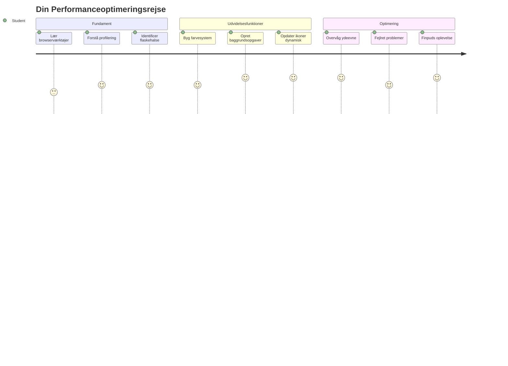
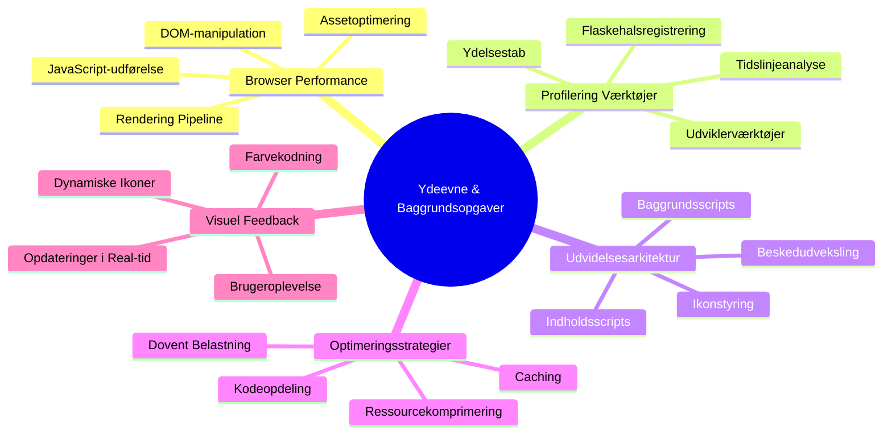
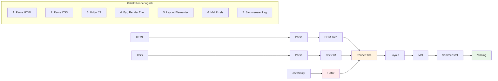
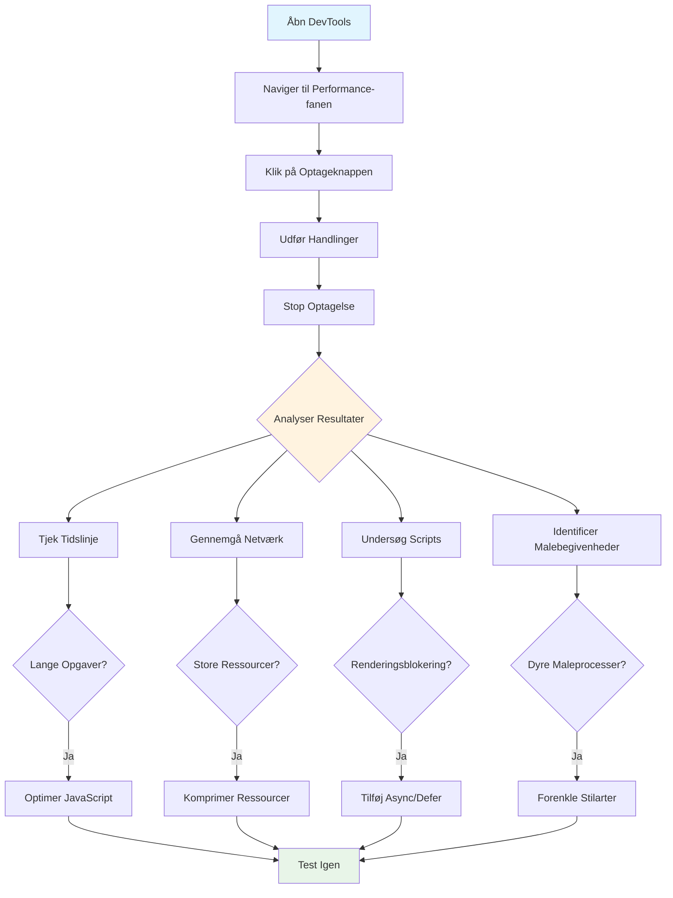
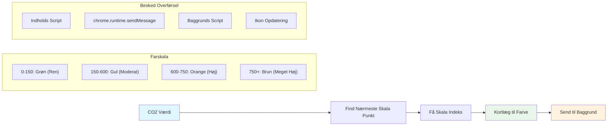
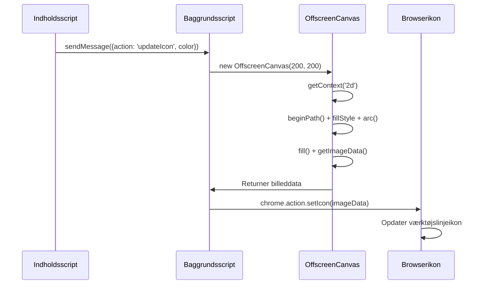
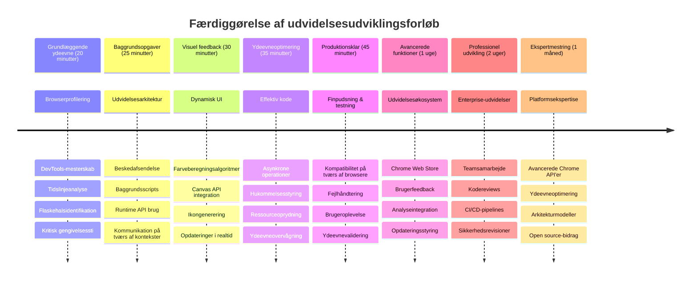

<!--
CO_OP_TRANSLATOR_METADATA:
{
  "original_hash": "b275fed2c6fc90d2b9b6661a3225faa2",
  "translation_date": "2026-01-06T23:45:43+00:00",
  "source_file": "5-browser-extension/3-background-tasks-and-performance/README.md",
  "language_code": "da"
}
-->
# Browserudvidelsesprojekt Del 3: Lær om Baggrundsopgaver og Ydeevne


Nogen sinde undret dig over, hvad der gør nogle browserudvidelser hurtige og lydhøre, mens andre virker træge? Hemmeligheden ligger i det, der foregår bag kulisserne. Mens brugere klikker rundt i din udvidelses interface, er der en hel verden af baggrundsprocesser, der stille håndterer datahentning, ikonopdateringer og systemressourcer.

Dette er vores sidste lektion i browserudvidelsesserien, og vi vil få din CO2-aftryksmåler til at fungere gnidningsløst. Du vil tilføje dynamiske ikonopdateringer og lære at spotte ydeevneproblemer før de bliver til problemer. Det er som at finjustere en racerbils motor – små optimeringer kan gøre en kæmpe forskel i, hvordan alt kører.

Når vi er færdige, har du en poleret udvidelse og forstår de ydeevneprincipper, der adskiller gode webapps fra fantastiske. Lad os dykke ned i browseroptimeringens verden.

## For-lektions quiz

[For-lektions quiz](https://ff-quizzes.netlify.app/web/quiz/27)

### Introduktion

I vores tidligere lektioner byggede du en formular, tilknyttede den til en API, og håndterede asynkron datahentning. Din udvidelse tager form på flot vis.

Nu skal vi tilføje de sidste detaljer - som at få udvidelsesikonet til at skifte farve baseret på CO2-dataene. Det minder mig om, hvordan NASA måtte optimere hvert system på Apollo-rumfartøjet. De havde ikke råd til spildte cyklusser eller hukommelse, fordi liv var afhængige af ydeevnen. Selvom vores browserudvidelse ikke er helt så kritisk, gælder de samme principper – effektiv kode skaber bedre brugeroplevelser.


## Grundlæggende Webydelse

Når din kode kører effektivt, kan folk rent faktisk *mærke* forskellen. Du kender det øjeblik, hvor en side loader med det samme, eller en animation kører flydende? Det er god ydeevne, der er på spil.

Ydeevne handler ikke kun om hastighed – det handler om at skabe weboplevelser, der føles naturlige i stedet for klodsede og frustrerende. Tilbage i de tidlige dage med computing havde Grace Hopper berømt en nanosekund (et stykke wire omkring en fod langt) på sit skrivebord til at vise, hvor langt lyset bevæger sig på en milliardtedel af et sekund. Det var hendes måde at forklare, hvorfor hvert mikrosekund tæller i computing. Lad os udforske detektiveredskaberne, der hjælper dig med at finde ud af, hvad der sænker tingene ned.

> "Websiders ydeevne handler om to ting: hvor hurtigt siden loader, og hvor hurtigt koden på den kører." -- [Zack Grossbart](https://www.smashingmagazine.com/2012/06/javascript-profiling-chrome-developer-tools/)

Emnet om, hvordan du gør dine websites lynhurtige på alle slags enheder, for alle slags brugere, i alle slags situationer, er ikke overraskende meget omfattende. Her er nogle punkter, du bør have i tankerne, når du bygger enten et almindeligt webprojekt eller en browserudvidelse.

Det første skridt i at optimere dit site er at forstå, hvad der faktisk sker under motorhjelmen. Heldigvis kommer din browser med kraftfulde detektivværktøjer indbygget.


For at åbne Udviklerværktøjer i Edge, klik på de tre prikker øverst til højre, og gå så til Flere værktøjer > Udviklerværktøjer. Eller brug tastaturgenvejen: `Ctrl` + `Shift` + `I` på Windows eller `Option` + `Command` + `I` på Mac. Når du er der, klik på fanen Ydeevne - det er her, du laver din undersøgelse.

**Her er dit ydeevne-detektiudstyr:**
- **Åbn** Udviklerværktøjer (du vil bruge disse hele tiden som udvikler!)
- **Gå til** fanen Ydeevne – tænk på den som din webapps fitness tracker
- **Tryk på** Optagelsesknappen og se din side i aktion
- **Studér** resultaterne for at spotte, hvad der sænker tingene

Lad os prøve det. Åbn en hjemmeside (Microsoft.com fungerer godt til dette) og klik på 'Optag' knappen. Opdater nu siden, og se profilen fange alt, hvad der sker. Når du stopper optagelsen, får du en detaljeret opdeling af, hvordan browseren ‘script’, ‘renderer’ og ‘maler’ sitet. Det minder mig om, hvordan mission control overvåger hvert system under en raketopsendelse – du får realtime-data om præcis, hvad der sker og hvornår.


✅ [Microsoft Dokumentationen](https://docs.microsoft.com/microsoft-edge/devtools-guide/performance/?WT.mc_id=academic-77807-sagibbon) har masser af flere detaljer, hvis du vil dykke dybere ned

> Profi-tip: Ryd din browsercache før test for at se, hvordan dit site performer for førstegangsbesøgende – det er som regel meget anderledes end gentagne besøg!

Vælg elementer i profilens tidslinje for at zoome ind på begivenheder, der sker, mens din side loader.

Få et øjebliksbillede af din sides ydeevne ved at vælge et stykke af profiltidslinjen og kigge på oversigtspanelet:


Tjek Event Log-panelet for at se, om nogen begivenhed tog længere tid end 15 ms:


✅ Lær din profiler at kende! Åbn udviklerværktøjerne på denne side og se, om der er nogen flaskehalse. Hvad er det langsomt indlæsende element? Hvad er det hurtigste?


## Hvad du skal kigge efter, når du profilerer

At køre profilen er kun begyndelsen – den rigtige færdighed er at vide, hvad de farverige diagrammer rent faktisk fortæller dig. Bare rolig, du vil lære at læse dem. Erfarne udviklere har lært at spotte advarselstegnene, før de udvikler sig til problemer.

Lad os tale om de sædvanlige mistænkte – ydelsesproblemerne, der plejer at snige sig ind i webprojekter. Ligesom Marie Curie måtte overvåge strålingsniveauerne omhyggeligt i sit laboratorium, skal vi holde øje med visse mønstre, der indikerer problemer under opsejling. At fange dem tidligt vil spare dig (og dine brugere) for meget frustration.

**Asset-størrelser**: Websites er blevet "tungere" gennem årene, og meget af den ekstra vægt kommer fra billeder. Det er som om, vi har pakket mere og mere i vores digitale kufferter.

✅ Tjek [Internet Archive](https://httparchive.org/reports/page-weight) for at se, hvordan sidestørrelser er vokset over tid – det er ret afslørende.

**Sådan holder du dine assets optimerede:**
- **Komprimer** dine billeder! Moderne formater som WebP kan skære drastisk i filstørrelserne
- **Server** den rette billedstørrelse til hver enhed – ikke brug kæmpestore desktop-billeder på telefoner
- **Minificér** dit CSS og JavaScript – hver byte tæller
- **Brug** lazy loading, så billeder kun hentes, når brugere rent faktisk scroller til dem

**DOM-gennemgange**: Browseren skal bygge sit Document Object Model baseret på den kode, du skriver, så det er i interesse for god sidetilstand at holde dine tags minimale, kun bruge og style, hvad siden har brug for. I den sammenhæng kunne overflødigt CSS, der tilhører en side, optimeres; stilarter, der kun skal bruges på én side, behøver ikke inkluderes i hovedstylesheetet, for eksempel.

**Nøglestrategier for DOM-optimering:**
- **Minimerer** antallet af HTML-elementer og indlejringstrin
- **Fjerner** ubrugte CSS-regler og konsoliderer stylesheets effektivt
- **Organiserer** CSS til kun at loade det, der er nødvendigt for hver side
- **Strukturerer** HTML semantisk for bedre browserparsing

**JavaScript**: Enhver JavaScript-udvikler bør holde øje med 'render-blokerende' scripts, som skal indlæses, før resten af DOM kan gennemgås og males i browseren. Overvej at bruge `defer` med dine inline scripts (som i Terrarium-modulet).

**Moderne JavaScript-optimeringsteknikker:**
- **Bruger** `defer` attributten til at loade scripts efter DOM-parsning
- **Implementerer** kodesplitning for kun at loade nødvendigt JavaScript
- **Anvender** lazy loading for ikke-kritisk funktionalitet
- **Minimerer** brugen af tunge biblioteker og frameworks, når det er muligt

✅ Prøv nogle sites på et [Site Speed Test website](https://www.webpagetest.org/) for at lære mere om de almindelige tests, der foretages for at afgøre websidens ydeevne.

### 🔄 **Pædagogisk tjek-ind**
**Ydeevneforståelse**: Før du bygger udvidelsesfunktioner, skal du kunne:
- ✅ Forklare den kritiske gengivelsessti fra HTML til pixels
- ✅ Identificere almindelige ydeevneflaskehalse i webapplikationer
- ✅ Bruge browserens udviklerværktøjer til at profilere sidens ydeevne
- ✅ Forstå, hvordan asset-størrelse og DOM-kompleksitet påvirker hastigheden

**Hurtig Selvtest**: Hvad sker der, når du har render-blokerende JavaScript?
*Svar: Browseren skal downloade og udføre scriptet, før den kan fortsætte med at parse HTML og gengive siden*

**Virkelighedens ydeevneeffekt**:
- **100 ms forsinkelse**: Brugere bemærker langsommere ydelse
- **1 sekund forsinkelse**: Brugere begynder at miste fokus
- **3+ sekunder**: 40% af brugere forlader siden
- **Mobilnetværk**: Ydelse betyder endnu mere

Nu hvor du har en idé om, hvordan browseren gengiver de assets, du sender, lad os se på de sidste ting, du skal gøre for at færdiggøre din udvidelse:

### Opret en funktion til at beregne farve

Nu opretter vi en funktion, der omsætter numeriske data til meningsfulde farver. Tænk på det som et trafiklys - grønt for ren energi, rødt for høj CO2-intensitet.

Denne funktion vil tage CO2-dataene fra vores API og bestemme, hvilken farve der bedst repræsenterer miljøpåvirkningen. Det minder om, hvordan forskere bruger farvekodning i varmekort til at visualisere komplekse datamønstre – fra ocean-temperaturer til stjernedannelse. Lad os tilføje dette til `/src/index.js`, lige efter de `const` variabler, vi satte op tidligere:


```javascript
function calculateColor(value) {
	// Definer CO2-intensitetsskala (gram pr. kWh)
	const co2Scale = [0, 150, 600, 750, 800];
	// Tilsvarende farver fra grøn (ren) til mørkebrun (høj kulstof)
	const colors = ['#2AA364', '#F5EB4D', '#9E4229', '#381D02', '#381D02'];

	// Find den nærmeste skaleværdi til vores input
	const closestNum = co2Scale.sort((a, b) => {
		return Math.abs(a - value) - Math.abs(b - value);
	})[0];
	
	console.log(`${value} is closest to ${closestNum}`);
	
	// Find indekset for farvekortlægning
	const num = (element) => element > closestNum;
	const scaleIndex = co2Scale.findIndex(num);

	const closestColor = colors[scaleIndex];
	console.log(scaleIndex, closestColor);

	// Send farveopdateringsbesked til baggrundsskriptet
	chrome.runtime.sendMessage({ action: 'updateIcon', value: { color: closestColor } });
}
```

**Lad os bryde denne smarte lille funktion ned:**
- **Opsætter** to arrays – ét for CO2-niveauer, ét for farver (grøn = ren, brun = beskidt!)
- **Finder** det tættest matchende tal til vores faktiske CO2-værdi ved hjælp af smart arraysortering
- **Henter** den matchende farve med findIndex()-metoden
- **Sender** en besked til Chromes baggrundsscript med den valgte farve
- **Bruger** template literals (de backticks) for flottere strengformatering
- **Holder** alt organiseret med const-deklarationer

`chrome.runtime` [API](https://developer.chrome.com/extensions/runtime) er som udvidelsens nervesystem – det håndterer al kommunikation og opgaver bag kulisserne:

> "Brug chrome.runtime API’en til at hente baggrundssiden, returnere detaljer om manifestet og lytte efter og reagere på begivenheder i app- eller udvidelseslivscyklussen. Du kan også bruge API’en til at konvertere relative URL-stier til fuldt kvalificerede URL’er."

**Hvorfor Chrome Runtime API’en er så smart:**
- **Lader** forskellige dele af din udvidelse tale sammen
- **Håndterer** baggrundsarbejde uden at fryse brugergrænsefladen
- **Administrerer** din udvidelses livscyklusbegivenheder
- **Gør** beskedudveksling mellem scripts super nemt

✅ Hvis du udvikler denne browserudvidelse til Edge, vil det måske overraske dig, at du bruger en chrome API. De nyere Edge-versioner kører på Chromium-browsermotoren, så du kan bruge disse værktøjer.

```mermaid
architecture-beta
    group browser(logos:chrome)[Browser]
    
    service popup(logos:html5)[Popup UI] in browser
    service content(logos:javascript)[Indholdsskript] in browser
    service background(database)[Baggrundsskript] in browser
    service api(logos:api)[Ekstern API] in browser
    
    popup:R -- L:content
    content:R -- L:background
    background:T -- B:api
    content:T -- B:api
    
    junction junctionCenter in browser
    popup:R -- L:junctionCenter
    junctionCenter:R -- L:background
```


> **Profi-tip**: Hvis du vil profilere en browserudvidelse, så start dev-værktøjerne fra udvidelsen selv, da det er en separat browserinstans. Det giver dig adgang til udvidelsesspecifikke ydeevnemålinger.

### Sæt en standard ikonfarve

Før vi begynder at hente rigtige data, lad os give vores udvidelse et udgangspunkt. Ingen kan lide at stirre på et tomt eller ødelagt ikon. Vi starter med en grøn farve, så brugerne ved, at udvidelsen virker allerede fra installationstidspunktet.

I din `init()` funktion, lad os sætte standardikonet til den grønne farve:

```javascript
chrome.runtime.sendMessage({
	action: 'updateIcon',
	value: {
		color: 'green',
	},
});
```

**Dette opnår initialiseringen:**
- **Sætter** en neutral grøn farve som standardtilstand
- **Giver** øjeblikkelig visuel feedback, når udvidelsen loader
- **Etablerer** kommunikationsmønsteret med baggrundsscriptet
- **Sikrer** at brugerne ser en funktionsdygtig udvidelse før data indlæses

### Kald funktionen, udfør kaldet

Lad os nu forbinde det hele, sådan at når friske CO2-data kommer ind, opdateres ikonet automatisk med den rette farve. Det er som at forbinde den sidste kreds i en elektronisk enhed – pludselig arbejder alle komponenterne som ét system.

Tilføj denne linje lige efter, at du har fået CO2-dataene fra API’en:

```javascript
// Efter at have hentet CO2-data fra API'en
// lad CO2 = data.data[0].intensity.actual;
calculateColor(CO2);
```

**Dette integrerer:**
- **Forbinder** API-datastreamen med det visuelle indikator-system
- **Trigger** ikonopdateringer automatisk ved nye data
- **Sikrer** realtime visuel feedback baseret på gældende CO2-intensitet
- **Bevarer** adskillelsen mellem datahentning og visningslogik

Og til sidst, i `/dist/background.js`, tilføj lytteren for disse baggrundsopkald:

```javascript
// Lyt efter beskeder fra indholdsscriptet
chrome.runtime.onMessage.addListener(function (msg, sender, sendResponse) {
	if (msg.action === 'updateIcon') {
		chrome.action.setIcon({ imageData: drawIcon(msg.value) });
	}
});

// Tegn dynamisk ikon ved hjælp af Canvas API
// Lånt fra energy lollipop-udvidelsen - flot funktion!
function drawIcon(value) {
	// Opret et offscreen canvas for bedre ydeevne
	const canvas = new OffscreenCanvas(200, 200);
	const context = canvas.getContext('2d');

	// Tegn en farvet cirkel, der repræsenterer kulstofintensitet
	context.beginPath();
	context.fillStyle = value.color;
	context.arc(100, 100, 50, 0, 2 * Math.PI);
	context.fill();

	// Returner billeddata til browserikonet
	return context.getImageData(50, 50, 100, 100);
}
```

**Dette baggrundsscripts opgaver:**
- **Lytter** efter beskeder fra dit hovedscript (som en receptionist der tager imod opkald)
- **Behandler** 'updateIcon'-anmodninger for at ændre toolbar-ikonet
- **Opretter** nye ikoner on-the-fly med Canvas API
- **Tegner** en simpel farvet cirkel, der viser den aktuelle CO2-intensitet
- **Opdaterer** din browser toolbar med det friske ikon
- **Bruger** OffscreenCanvas for jævn ydeevne (uden UI-blokering)

✅ Du vil lære mere om Canvas API’en i [Space Game lektionerne](../../6-space-game/2-drawing-to-canvas/README.md).


### 🔄 **Pædagogisk tjek-ind**
**Fuldstændig udvidelsesforståelse**: Bekræft din beherskelse af hele systemet:
- ✅ Hvordan fungerer beskedudveksling mellem forskellige udvidelsesscripts?
- ✅ Hvorfor bruger vi OffscreenCanvas i stedet for almindelig Canvas for ydeevne?
- ✅ Hvilken rolle spiller Chrome Runtime API i extensionsarkitekturen?
- ✅ Hvordan kortlægger farveberegningsalgoritmen data til visuel feedback?

**Ydeevneovervejelser**: Din extension demonstrerer nu:
- **Effektiv beskedudveksling**: Ren kommunikation mellem scriptkontekster
- **Optimeret rendering**: OffscreenCanvas forhindrer blokering af UI
- **Opdateringer i realtid**: Dynamiske ikonændringer baseret på live data
- **Hukommelsesstyring**: Korrekt oprydning og håndtering af ressourcer

**Tid til at teste din extension:**
- **Byg** alt med `npm run build`
- **Genindlæs** din extension i browseren (glem ikke dette trin)
- **Åbn** din extension og se ikonet skifte farve
- **Tjek** hvordan den reagerer på virkelig CO2-data fra hele verden

Nu kan du på et øjeblik se, om det er et godt tidspunkt til den vask eller om du skal vente på renere energi. Du har lige bygget noget virkelig nyttigt og lært om browserens ydeevne undervejs.

## GitHub Copilot Agent Challenge 🚀

Brug Agent-tilstanden til at gennemføre følgende udfordring:

**Beskrivelse:** Udvid browserextensionens ydeevneovervågningsfunktioner ved at tilføje en funktion, der sporer og viser indlæsningstider for forskellige komponenter i extensionen.

**Prompt:** Opret et ydeevneovervågningssystem til browserextensionen, som måler og logger den tid, det tager at hente CO2-data fra API'en, beregne farver og opdatere ikonet. Tilføj en funktion kaldet `performanceTracker`, der bruger Performance API til at måle disse operationer og viser resultaterne i browserkonsollen med tidsstempler og varighedsmål.

Læs mere om [agent-tilstand](https://code.visualstudio.com/blogs/2025/02/24/introducing-copilot-agent-mode) her.

## 🚀 Udfordring

Her er en interessant detektivmission: vælg et par open source-websteder, som har eksisteret i årevis (tænk Wikipedia, GitHub eller Stack Overflow), og kig i deres commit-historik. Kan du spotte, hvor de har lavet ydeevneforbedringer? Hvilke problemer dukkede gentagne gange op?

**Din undersøgelsesmetode:**
- **Søg** commit-beskeder efter ord som "optimize," "performance," eller "faster"
- **Se** efter mønstre – fortsætter de med at løse de samme typer problemer?
- **Identificer** de almindelige syndere, som sænker websteder
- **Del** dine opdagelser – andre udviklere lærer af virkelige tilfælde

## Post-Lecture Quiz

[Post-lecture quiz](https://ff-quizzes.netlify.app/web/quiz/28)

## Gennemgang & Selvstudium

Overvej at tilmelde dig et [ydeevnenyhedsbrev](https://perf.email/)

Undersøg nogle af de måder, browsere vurderer webperformance på ved at kigge igennem performancefanerne i deres webværktøjer. Finder du store forskelle?

### ⚡ **Hvad du kan gøre de næste 5 minutter**
- [ ] Åbn browserens Jobliste (Shift+Esc i Chrome) for at se extensionens ressourceforbrug
- [ ] Brug DevTools' Performance-fane til at optage og analysere websideydelse
- [ ] Tjek browserens Extension-side for at se, hvilke extensions der påvirker opstartstid
- [ ] Prøv midlertidigt at deaktivere extensions for at se ydelsesforskelle

### 🎯 **Hvad du kan nå denne time**
- [ ] Færdiggør post-lesson quizzen og forstå performancekoncepter
- [ ] Implementer et baggrundsscript til din browserextension
- [ ] Lær at bruge browser.alarms til effektive baggrundsopgaver
- [ ] Øv messaging mellem content scripts og background scripts
- [ ] Mål og optimer din extensions ressourceforbrug

### 📅 **Din ugentlige ydeevnerejse**
- [ ] Færdiggør en højtydende browserextension med baggrundsfunktionalitet
- [ ] Mestring af service workers og moderne extensionsarkitektur
- [ ] Implementer effektive datasynkroniserings- og cache-strategier
- [ ] Lær avancerede debuggingteknikker for extension-ydeevne
- [ ] Optimer din extension for både funktionalitet og ressourceeffektivitet
- [ ] Skab omfattende tests for ydeevnescenarier for extensions

### 🌟 **Din månedslange optimeringsmestring**
- [ ] Byg enterprise-grade browserextensions med optimal ydeevne
- [ ] Lær om Web Workers, Service Workers og moderne web-ydelse
- [ ] Bidrag til open source-projekter fokuseret på performanceoptimering
- [ ] Mestring af browserinternals og avancerede debuggingmetoder
- [ ] Skab ydeevneovervågningsværktøjer og best practice-guides
- [ ] Bliv en performanceekspert, som hjælper med at optimere webapplikationer

## 🎯 Din browserextensions mestringstidslinje


### 🛠️ Dit komplette værktøjssæt til extension-udvikling

Efter at have gennemført denne trilogi har du nu mestring af:
- **Browserarkitektur**: Dybt kendskab til, hvordan extensions integreres med browsersystemer
- **Ydeevneprofilering**: Evne til at identificere og rette flaskehalse med udviklerværktøjer
- **Asynkron programmering**: Moderne JavaScript-mønstre for responsive, ikke-blokerende operationer
- **API-integration**: Hentning af ekstern data med autentifikation og fejlbehandling
- **Visuelt design**: Dynamiske UI-opdateringer og Canvas-baseret grafikgenerering
- **Message Passing**: Kommunikation mellem scripts i extensionsarkitektur
- **Brugeroplevelse**: Indlæsningstilstande, fejlbehandling og intuitive interaktioner
- **Produktionsfærdigheder**: Testning, debugging og optimering til real-world deployment

**Virkelige anvendelser**: Dine extensionudviklingsevner anvendes direkte til:
- **Progressive Web Apps**: Lignende arkitektur og ydeevnemønstre
- **Electron Desktop Apps**: Cross-platform applikationer baseret på webteknologier
- **Mobile Hybrid Apps**: Cordova/PhoneGap-udvikling med web-API’er
- **Enterprise Webapplikationer**: Komplekse dashboards og produktivitetsværktøjer
- **Chrome DevTools Extensions**: Avancerede udviklerværktøjer og debugging
- **Web API-integration**: Enhver applikation, der kommunikerer med eksterne tjenester

**Professionel påvirkning**: Du kan nu:
- **Bygge** produktionsklare browserextensions fra koncept til deployment
- **Optimere** webapplikationers ydeevne vha. industristandard profileringværktøjer
- **Arkitektere** skalerbare systemer med korrekt separering af ansvar
- **Debugge** komplekse asynkrone operationer og kommunikation på tværs af kontekster
- **Bidrage** til open source extension-projekter og browserstandarder

**Næste niveau muligheder**:
- **Chrome Web Store-udvikler**: Publicer extensions til millioner af brugere
- **Web Performance Engineer**: Specialiser dig i optimering og brugeroplevelse
- **Browser Platform Developer**: Bidrag til udvikling af browsermotorer
- **Extension Framework Skaber**: Byg værktøjer, der hjælper andre udviklere
- **Developer Relations**: Del viden gennem undervisning og indholdsskabelse

🌟 **Præmie låst op**: Du har bygget en komplet, funktionel browserextension, som demonstrerer professionel udviklingspraksis og moderne webstandarder!

## Opgave

[Analyser et site for performance](assignment.md)

---

<!-- CO-OP TRANSLATOR DISCLAIMER START -->
**Ansvarsfraskrivelse**:  
Dette dokument er oversat ved hjælp af AI-oversættelsestjenesten [Co-op Translator](https://github.com/Azure/co-op-translator). Selvom vi bestræber os på nøjagtighed, bedes du være opmærksom på, at automatiserede oversættelser kan indeholde fejl eller unøjagtigheder. Det oprindelige dokument på dets oprindelige sprog bør betragtes som den autoritative kilde. For vigtig information anbefales professionel menneskelig oversættelse. Vi påtager os intet ansvar for misforståelser eller fejltolkninger, der opstår som følge af brugen af denne oversættelse.
<!-- CO-OP TRANSLATOR DISCLAIMER END -->