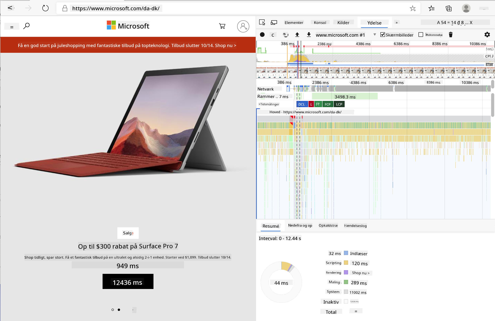
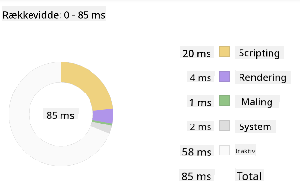
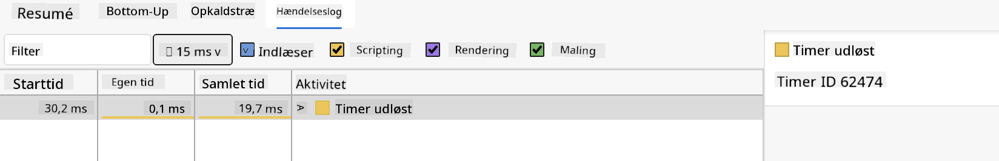

<!--
CO_OP_TRANSLATOR_METADATA:
{
  "original_hash": "f198c6b817b4b2a99749f4662e7cae98",
  "translation_date": "2025-08-26T22:44:12+00:00",
  "source_file": "5-browser-extension/3-background-tasks-and-performance/README.md",
  "language_code": "da"
}
-->
# Browserudvidelsesprojekt Del 3: Lær om baggrundsopgaver og ydeevne

## Quiz før lektionen

[Quiz før lektionen](https://ff-quizzes.netlify.app/web/quiz/27)

### Introduktion

I de sidste to lektioner i dette modul lærte du, hvordan man bygger en formular og et visningsområde til data hentet fra en API. Det er en meget standard måde at skabe en webtilstedeværelse på nettet. Du lærte endda, hvordan man håndterer asynkron datahentning. Din browserudvidelse er næsten færdig.

Det, der mangler, er at håndtere nogle baggrundsopgaver, herunder opdatering af farven på udvidelsens ikon. Derfor er det et godt tidspunkt at tale om, hvordan browseren håndterer denne type opgaver. Lad os tænke på disse browseropgaver i konteksten af ydeevnen for dine webressourcer, mens du bygger dem.

## Grundlæggende om webydeevne

> "Webstedets ydeevne handler om to ting: hvor hurtigt siden indlæses, og hvor hurtigt koden på den kører." -- [Zack Grossbart](https://www.smashingmagazine.com/2012/06/javascript-profiling-chrome-developer-tools/)

Emnet om, hvordan man gør sine websites lynhurtige på alle slags enheder, for alle slags brugere, i alle slags situationer, er ikke overraskende omfattende. Her er nogle punkter at huske på, når du bygger enten et standard webprojekt eller en browserudvidelse.

Det første, du skal gøre for at sikre, at dit websted kører effektivt, er at indsamle data om dets ydeevne. Det første sted at gøre dette er i udviklerværktøjerne i din webbrowser. I Edge kan du vælge knappen "Indstillinger og mere" (ikonet med de tre prikker øverst til højre i browseren), derefter navigere til Flere værktøjer > Udviklerværktøjer og åbne fanen Ydeevne. Du kan også bruge tastaturgenvejene `Ctrl` + `Shift` + `I` på Windows eller `Option` + `Command` + `I` på Mac for at åbne udviklerværktøjerne.

Fanen Ydeevne indeholder et profileringsværktøj. Åbn et websted (prøv for eksempel [https://www.microsoft.com](https://www.microsoft.com/?WT.mc_id=academic-77807-sagibbon)) og klik på 'Optag'-knappen, og opdater derefter webstedet. Stop optagelsen når som helst, og du vil kunne se de rutiner, der genereres for at 'script', 'render' og 'male' webstedet:



✅ Besøg [Microsoft Dokumentation](https://docs.microsoft.com/microsoft-edge/devtools-guide/performance/?WT.mc_id=academic-77807-sagibbon) om ydeevnepanelet i Edge

> Tip: For at få en nøjagtig aflæsning af dit websteds opstartstid, skal du rydde din browsers cache.

Vælg elementer i profilens tidslinje for at zoome ind på begivenheder, der sker, mens din side indlæses.

Få et snapshot af din sides ydeevne ved at vælge en del af profilens tidslinje og se på oversigtspanelet:



Tjek begivenhedslogpanelet for at se, om nogen begivenhed tog længere end 15 ms:



✅ Lær din profiler at kende! Åbn udviklerværktøjerne på dette websted og se, om der er nogen flaskehalse. Hvilken ressource indlæses langsomst? Hurtigst?

## Profileringstjek

Generelt er der nogle "problemområder", som enhver webudvikler bør holde øje med, når de bygger et websted, for at undgå ubehagelige overraskelser, når det er tid til at implementere i produktion.

**Ressourcestørrelser**: Internettet er blevet 'tungere' og dermed langsommere i løbet af de seneste år. Noget af denne vægt skyldes brugen af billeder.

✅ Gennemse [Internetarkivet](https://httparchive.org/reports/page-weight) for et historisk overblik over sidens vægt og mere.

En god praksis er at sikre, at dine billeder er optimerede og leveres i den rigtige størrelse og opløsning til dine brugere.

**DOM-gennemløb**: Browseren skal opbygge sin Document Object Model baseret på den kode, du skriver, så det er i interesse for god sideydeevne at holde dine tags minimale og kun bruge og style det, siden har brug for. I denne forbindelse kunne overskydende CSS, der er knyttet til en side, optimeres; stilarter, der kun skal bruges på én side, behøver for eksempel ikke at være inkluderet i hovedstilarket.

**JavaScript**: Enhver JavaScript-udvikler bør holde øje med 'render-blokerende' scripts, der skal indlæses, før resten af DOM'en kan gennemløbes og males til browseren. Overvej at bruge `defer` med dine inline scripts (som det gøres i Terrarium-modulet).

✅ Prøv nogle websteder på en [Site Speed Test-webside](https://www.webpagetest.org/) for at lære mere om de almindelige tjek, der udføres for at bestemme webstedets ydeevne.

Nu hvor du har en idé om, hvordan browseren gengiver de ressourcer, du sender til den, lad os se på de sidste par ting, du skal gøre for at fuldføre din udvidelse:

### Opret en funktion til at beregne farve

Arbejd i `/src/index.js`, og tilføj en funktion kaldet `calculateColor()` efter rækken af `const`-variabler, du har oprettet for at få adgang til DOM'en:

```JavaScript
function calculateColor(value) {
	let co2Scale = [0, 150, 600, 750, 800];
	let colors = ['#2AA364', '#F5EB4D', '#9E4229', '#381D02', '#381D02'];

	let closestNum = co2Scale.sort((a, b) => {
		return Math.abs(a - value) - Math.abs(b - value);
	})[0];
	console.log(value + ' is closest to ' + closestNum);
	let num = (element) => element > closestNum;
	let scaleIndex = co2Scale.findIndex(num);

	let closestColor = colors[scaleIndex];
	console.log(scaleIndex, closestColor);

	chrome.runtime.sendMessage({ action: 'updateIcon', value: { color: closestColor } });
}
```

Hvad sker der her? Du sender en værdi (kulstofintensiteten) fra API-kaldet, du fuldførte i sidste lektion, og derefter beregner du, hvor tæt dens værdi er på indekset præsenteret i farvearrayet. Derefter sender du den nærmeste farveværdi videre til chrome runtime.

Chrome.runtime har [en API](https://developer.chrome.com/extensions/runtime), der håndterer alle slags baggrundsopgaver, og din udvidelse udnytter dette:

> "Brug chrome.runtime API'en til at hente baggrundssiden, returnere detaljer om manifestet og lytte til og reagere på begivenheder i appens eller udvidelsens livscyklus. Du kan også bruge denne API til at konvertere den relative sti for URL'er til fuldt kvalificerede URL'er."

✅ Hvis du udvikler denne browserudvidelse til Edge, kan det overraske dig, at du bruger en chrome API. De nyere Edge-browserversioner kører på Chromium-browsermotoren, så du kan udnytte disse værktøjer.

> Bemærk, hvis du vil profilere en browserudvidelse, skal du starte udviklerværktøjerne fra selve udvidelsen, da den er sin egen separate browserinstans.

### Indstil en standardfarve for ikonet

Nu, i `init()`-funktionen, skal du indstille ikonet til at være generisk grønt til at starte med ved igen at kalde chromes `updateIcon`-handling:

```JavaScript
chrome.runtime.sendMessage({
	action: 'updateIcon',
		value: {
			color: 'green',
		},
});
```

### Kald funktionen, udfør kaldet

Dernæst skal du kalde den funktion, du lige har oprettet, ved at tilføje den til det løfte, der returneres af C02Signal API'en:

```JavaScript
//let CO2...
calculateColor(CO2);
```

Og endelig, i `/dist/background.js`, tilføj lytteren til disse baggrundsaktionskald:

```JavaScript
chrome.runtime.onMessage.addListener(function (msg, sender, sendResponse) {
	if (msg.action === 'updateIcon') {
		chrome.browserAction.setIcon({ imageData: drawIcon(msg.value) });
	}
});
//borrowed from energy lollipop extension, nice feature!
function drawIcon(value) {
	let canvas = document.createElement('canvas');
	let context = canvas.getContext('2d');

	context.beginPath();
	context.fillStyle = value.color;
	context.arc(100, 100, 50, 0, 2 * Math.PI);
	context.fill();

	return context.getImageData(50, 50, 100, 100);
}
```

I denne kode tilføjer du en lytter til eventuelle beskeder, der kommer til baggrundsopgavehåndteringen. Hvis den kaldes 'updateIcon', køres den næste kode for at tegne et ikon med den korrekte farve ved hjælp af Canvas API'en.

✅ Du lærer mere om Canvas API'en i [Space Game-lektionerne](../../6-space-game/2-drawing-to-canvas/README.md).

Nu skal du genopbygge din udvidelse (`npm run build`), opdatere og starte din udvidelse og se farven ændre sig. Er det et godt tidspunkt at tage en pause eller vaske op? Nu ved du det!

Tillykke, du har bygget en nyttig browserudvidelse og lært mere om, hvordan browseren fungerer, og hvordan man profilerer dens ydeevne.

---

## 🚀 Udfordring

Undersøg nogle open source-websteder, der har eksisteret i lang tid, og baseret på deres GitHub-historik, se om du kan afgøre, hvordan de blev optimeret gennem årene for ydeevne, hvis overhovedet. Hvad er det mest almindelige problemområde?

## Quiz efter lektionen

[Quiz efter lektionen](https://ff-quizzes.netlify.app/web/quiz/28)

## Gennemgang & Selvstudie

Overvej at tilmelde dig et [ydeevne-nyhedsbrev](https://perf.email/)

Undersøg nogle af de måder, browsere vurderer webydeevne ved at kigge gennem ydeevnefanerne i deres webværktøjer. Finder du nogen større forskelle?

## Opgave

[Analyser et websted for ydeevne](assignment.md)

---

**Ansvarsfraskrivelse**:  
Dette dokument er blevet oversat ved hjælp af AI-oversættelsestjenesten [Co-op Translator](https://github.com/Azure/co-op-translator). Selvom vi bestræber os på nøjagtighed, skal du være opmærksom på, at automatiserede oversættelser kan indeholde fejl eller unøjagtigheder. Det originale dokument på dets oprindelige sprog bør betragtes som den autoritative kilde. For kritisk information anbefales professionel menneskelig oversættelse. Vi er ikke ansvarlige for eventuelle misforståelser eller fejltolkninger, der måtte opstå som følge af brugen af denne oversættelse.