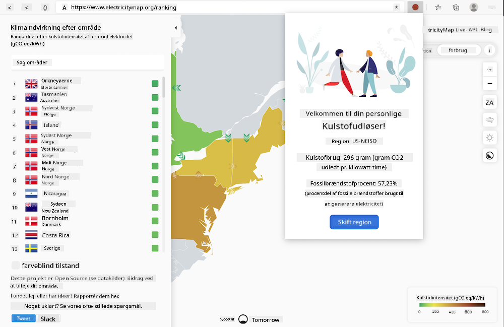

<!--
CO_OP_TRANSLATOR_METADATA:
{
  "original_hash": "dd58ae1b7707034f055718c1b68bc8de",
  "translation_date": "2025-08-26T22:48:08+00:00",
  "source_file": "5-browser-extension/solution/translation/README.hi.md",
  "language_code": "da"
}
-->
# Carbon Trigger Browser Extension: Færdiggjort kode

Ved at bruge tmrow's CO2 Signal API til at spore elforbrug, bygger vi en browserudvidelse, der kan minde dig om, hvor belastet strømforbruget i dit område er. Ved at bruge denne udvidelse kan du træffe beslutninger om dine aktiviteter baseret på denne information.



## Kom godt i gang

Du skal have [npm](https://npmjs.com) installeret. Download en kopi af denne kode til en mappe på din computer.

Installer alle nødvendige pakker:

```
npm install
```

Byg udvidelsen med Webpack:

```
npm run build
```

For at installere på Edge skal du bruge 'tre prikker'-menuen øverst til højre i browseren for at finde udvidelsespanelet. Derfra skal du vælge 'Load unpacked' for at indlæse en ny udvidelse. Når du bliver bedt om det, skal du åbne 'dist'-mappen, og udvidelsen vil blive indlæst. For at bruge den skal du have en API-nøgle til CO2 Signal ([fås her via e-mail](https://www.co2signal.com/) - indtast din e-mail i boksen på denne side) og [koden for dit område](http://api.electricitymap.org/v3/zones) fra [Electricity Map](https://www.electricitymap.org/map) (for eksempel bruger jeg 'US-NEISO' for Boston).


Når API-nøglen og området er indtastet i udvidelsens interface, bør den farvede prik i browserens udvidelsesbjælke ændre sig for at afspejle energiforbruget i dit område og give dig en indikator for, hvilke energiintensive aktiviteter der er passende. Konceptet bag dette 'prik'-system blev inspireret af [Energy Lollipop Extension](https://energylollipop.com/) for Californiske emissioner.

---

**Ansvarsfraskrivelse**:  
Dette dokument er blevet oversat ved hjælp af AI-oversættelsestjenesten [Co-op Translator](https://github.com/Azure/co-op-translator). Selvom vi bestræber os på nøjagtighed, skal du være opmærksom på, at automatiserede oversættelser kan indeholde fejl eller unøjagtigheder. Det originale dokument på dets oprindelige sprog bør betragtes som den autoritative kilde. For kritisk information anbefales professionel menneskelig oversættelse. Vi er ikke ansvarlige for eventuelle misforståelser eller fejltolkninger, der opstår som følge af brugen af denne oversættelse.