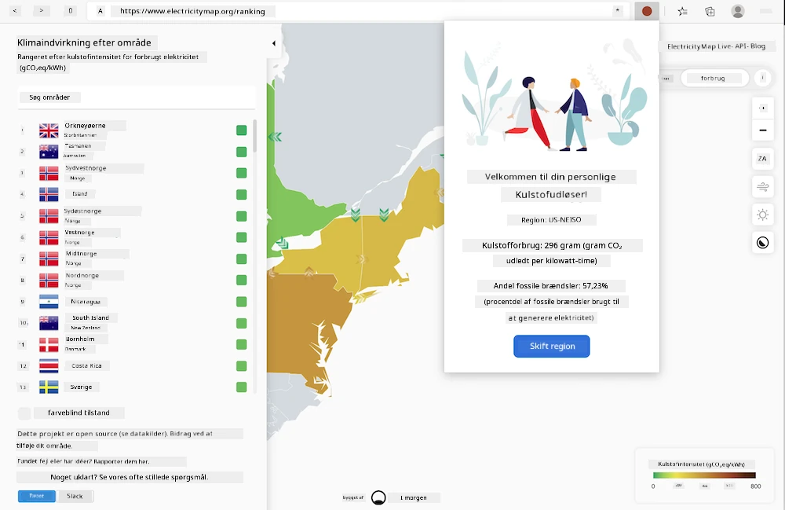
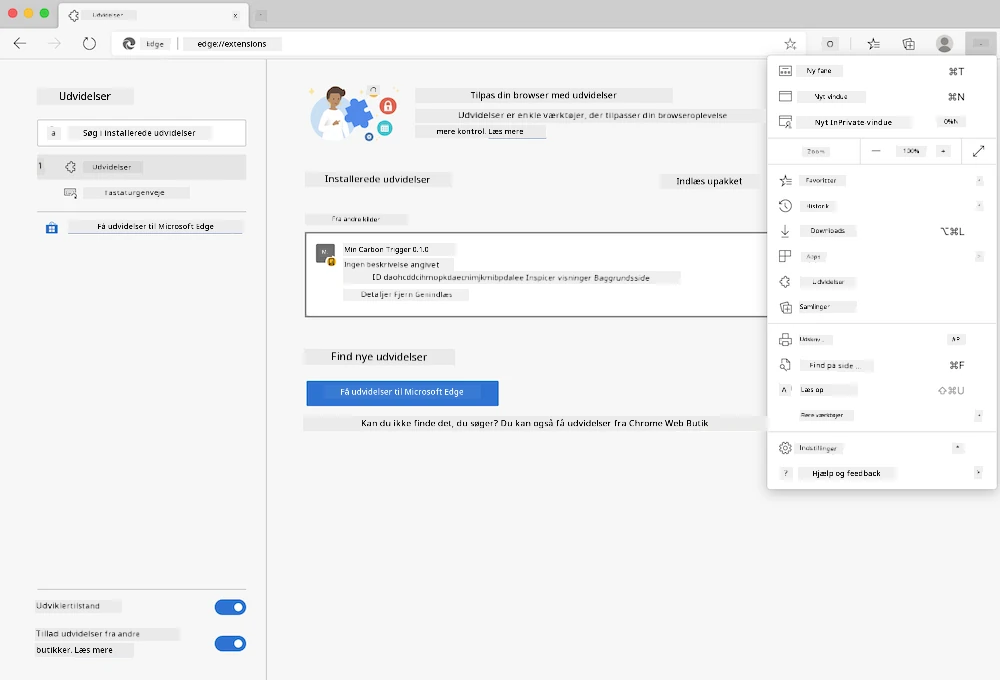

# Carbon Trigger Browserudvidelse: kode til at komme i gang

Du vil bruge tmrow's Signal CO2 API til at overvåge elforbruget og oprette en browserudvidelse, så du kan få en påmindelse direkte i din browser om, hvor tungt elforbruget er i din region. Brug af denne ad hoc-udvidelse vil hjælpe dig med at vurdere dine aktiviteter baseret på disse oplysninger.



## Kom godt i gang

Det er nødvendigt, at [npm](https://npmjs.com) er installeret. Download en kopi af denne kode til en mappe på din computer.

Installer alle nødvendige pakker:

```
npm install
```

Opret udvidelsen med webpack:

```
npm run build
```

For at installere på Edge skal du bruge "tre prikker"-menuen i øverste højre hjørne af browseren for at finde panelet Udvidelser. Hvis det ikke allerede er aktiveret, skal du aktivere Udviklertilstand (nederst til venstre). Vælg "Indlæs pakket udvidelse" for at tilføje en ny udvidelse. Åbn mappen "dist" ved prompten, og udvidelsen vil blive indlæst. For at bruge den skal du have en API-nøgle til CO2 Signal API'en (du kan [få den her via e-mail](https://www.co2signal.com/) - indtast din e-mail i feltet på denne side) og [koden for din region](http://api.electricitymap.org/v3/zones), som svarer til [elektricitetskortet](https://www.electricitymap.org/map) (for eksempel er koden for Boston "US-NEISO").



Når API-nøglen og regionen er indtastet i udvidelsens interface, bør den farvede prik i browserens udvidelsesbjælke ændre sig for at afspejle regionens energiforbrug og give en indikation af, hvilke aktiviteter med højt energiforbrug der ville være passende at udføre. Konceptet bag dette "prik"-system er inspireret af [Energy Lollipop-udvidelsen](https://energylollipop.com/) for Californiens emissioner.

---

**Ansvarsfraskrivelse**:  
Dette dokument er blevet oversat ved hjælp af AI-oversættelsestjenesten [Co-op Translator](https://github.com/Azure/co-op-translator). Selvom vi bestræber os på nøjagtighed, skal det bemærkes, at automatiserede oversættelser kan indeholde fejl eller unøjagtigheder. Det originale dokument på dets oprindelige sprog bør betragtes som den autoritative kilde. For kritisk information anbefales professionel menneskelig oversættelse. Vi påtager os intet ansvar for misforståelser eller fejltolkninger, der måtte opstå som følge af brugen af denne oversættelse.