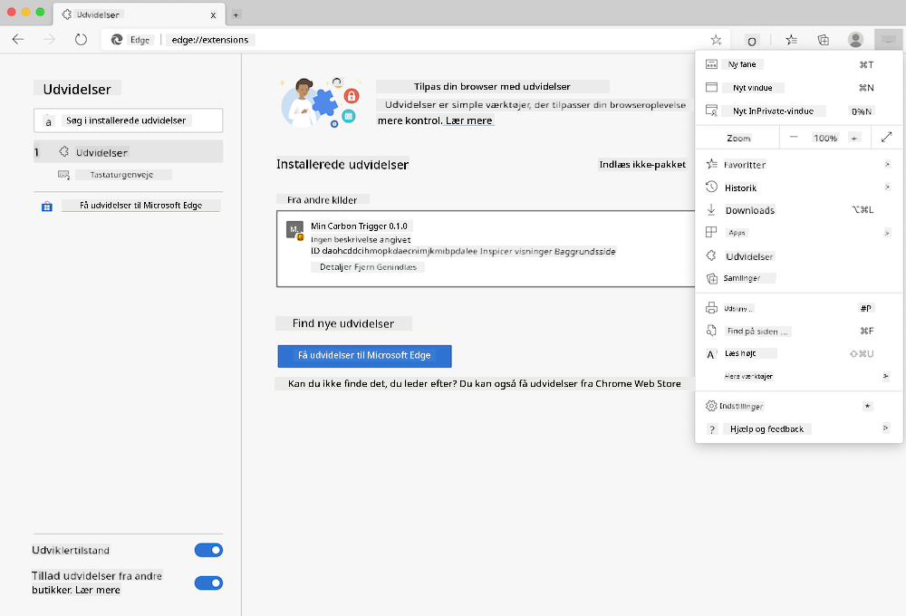

<!--
CO_OP_TRANSLATOR_METADATA:
{
  "original_hash": "26fd39046d264ba185dcb086d3a8cf3e",
  "translation_date": "2025-08-26T22:37:37+00:00",
  "source_file": "5-browser-extension/start/README.md",
  "language_code": "da"
}
-->
# Carbon Trigger Browser Extension: Startkode

Ved at bruge tmrow's CO2 Signal API til at spore elforbrug, kan du bygge en browserudvidelse, så du får en påmindelse direkte i din browser om, hvor belastet din regions elforbrug er. Ved at bruge denne udvidelse ad hoc kan du træffe beslutninger om dine aktiviteter baseret på denne information.


## Kom godt i gang

Du skal have [npm](https://npmjs.com) installeret. Download en kopi af denne kode til en mappe på din computer.

Installer alle nødvendige pakker:

```
npm install
```

Byg udvidelsen med webpack

```
npm run build
```

For at installere på Edge skal du bruge menuen med de 'tre prikker' øverst til højre i browseren for at finde panelet Udvidelser. Derfra skal du vælge 'Indlæs upakket' for at indlæse en ny udvidelse. Åbn mappen 'dist', når du bliver bedt om det, og udvidelsen vil blive indlæst. For at bruge den skal du have en API-nøgle til CO2 Signal's API ([få en her via e-mail](https://www.co2signal.com/) - indtast din e-mail i boksen på denne side) og koden for din region ([find den her](http://api.electricitymap.org/v3/zones)) svarende til [Electricity Map](https://www.electricitymap.org/map) (i Boston bruger jeg for eksempel 'US-NEISO').



Når API-nøglen og regionen er indtastet i udvidelsens grænseflade, bør den farvede prik i browserens udvidelsesbjælke ændre sig for at afspejle din regions energiforbrug og give dig en indikation af, hvilke energitunge aktiviteter der ville være passende at udføre. Konceptet bag dette 'prik'-system blev givet til mig af [Energy Lollipop-udvidelsen](https://energylollipop.com/) for Californiens emissioner.

---

**Ansvarsfraskrivelse**:  
Dette dokument er blevet oversat ved hjælp af AI-oversættelsestjenesten [Co-op Translator](https://github.com/Azure/co-op-translator). Selvom vi bestræber os på nøjagtighed, skal du være opmærksom på, at automatiserede oversættelser kan indeholde fejl eller unøjagtigheder. Det originale dokument på dets oprindelige sprog bør betragtes som den autoritative kilde. For kritisk information anbefales professionel menneskelig oversættelse. Vi er ikke ansvarlige for eventuelle misforståelser eller fejltolkninger, der måtte opstå som følge af brugen af denne oversættelse.