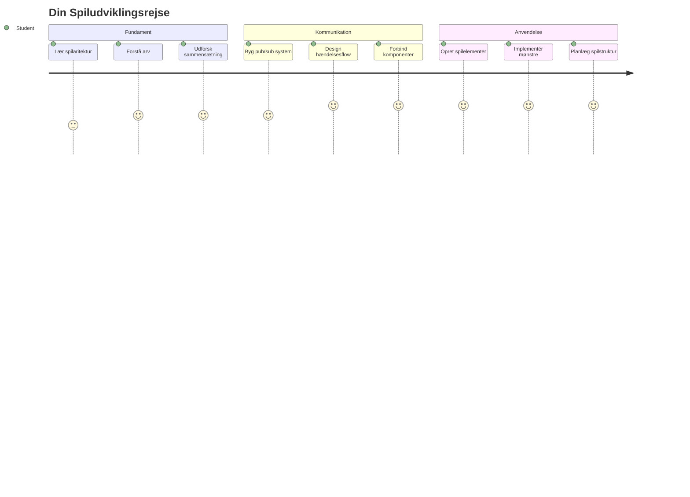
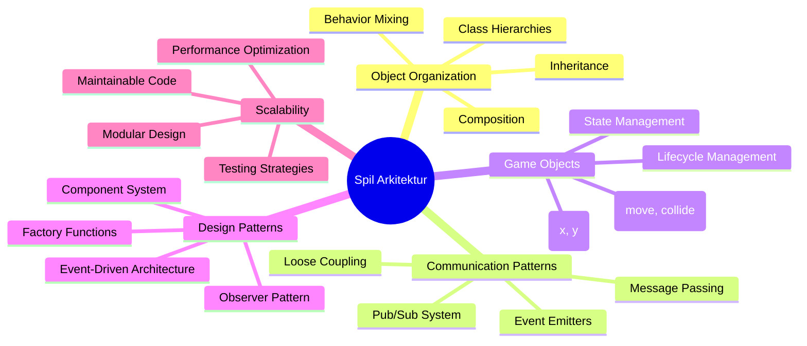
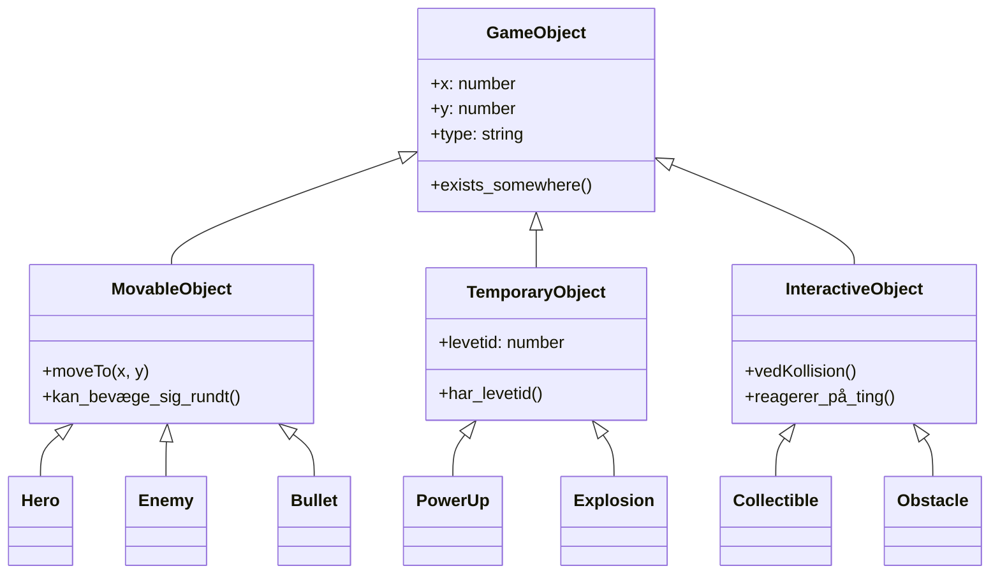
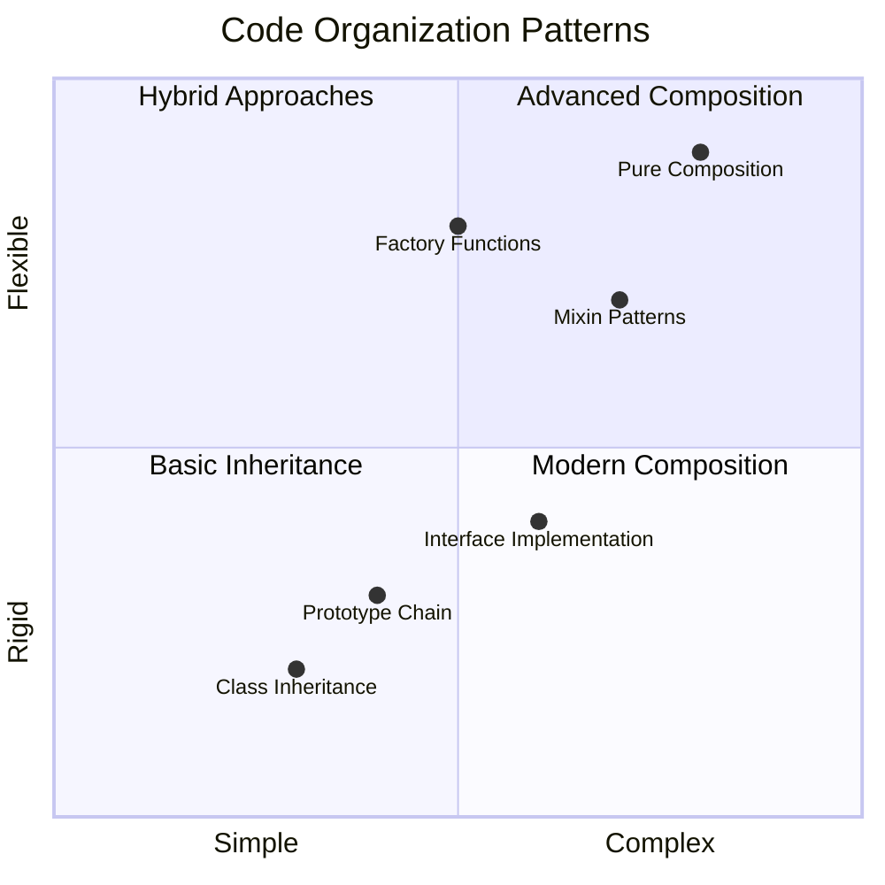
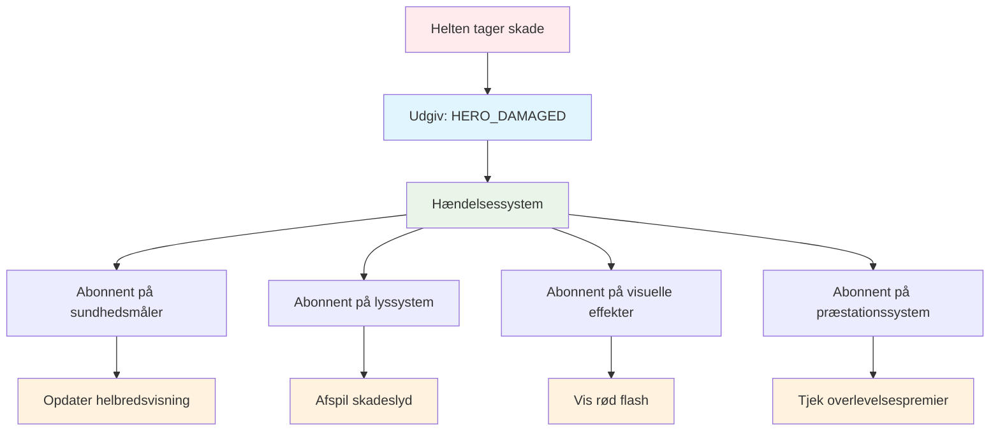
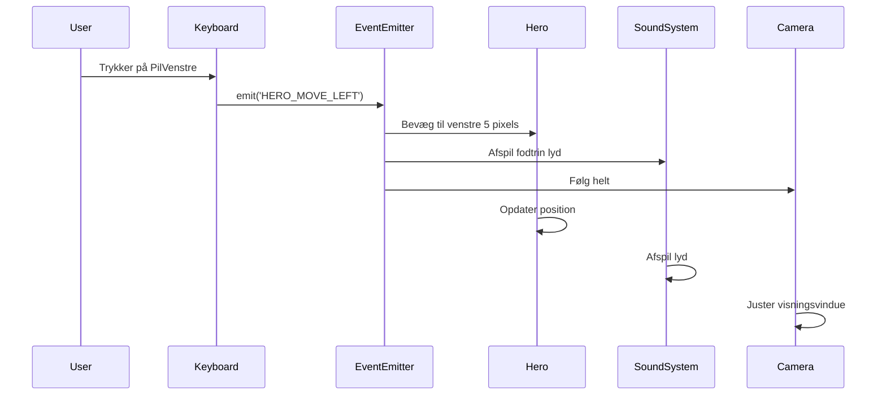
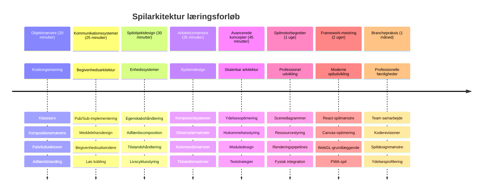

<!--
CO_OP_TRANSLATOR_METADATA:
{
  "original_hash": "a6332a7bb4d0be3bfd24199c83993777",
  "translation_date": "2026-01-06T23:41:14+00:00",
  "source_file": "6-space-game/1-introduction/README.md",
  "language_code": "da"
}
-->
# Byg et rumspil del 1: Introduktion




Ligesom NASAs mission control koordinerer flere systemer under en rumopsendelse, skal vi bygge et rumspil, der demonstrerer, hvordan forskellige dele af et program kan arbejde sammen problemfrit. Mens du skaber noget, du faktisk kan spille, vil du lære essentielle programmeringskoncepter, der gælder for ethvert softwareprojekt.

Vi vil udforske to grundlæggende tilgange til at organisere kode: arv og sammensætning. Disse er ikke bare akademiske koncepter – de er de samme mønstre, der driver alt fra videospil til banksystemer. Vi vil også implementere et kommunikationssystem kaldet pub/sub, som fungerer som kommunikationsnetværkene brugt i rumfartøjer, hvilket tillader forskellige komponenter at dele information uden at skabe afhængigheder.

Ved slutningen af denne serie vil du forstå, hvordan man bygger applikationer, der kan skaleres og udvikles – uanset om du udvikler spil, webapplikationer eller andre softwaresystemer.


## Quiz før forelæsning

[Quiz før forelæsning](https://ff-quizzes.netlify.app/web/quiz/29)

## Arv og sammensætning i spiludvikling

Efterhånden som projekter bliver mere komplekse, bliver kodeorganisering kritisk. Det, der begynder som et enkelt script, kan blive svært at vedligeholde uden ordentlig struktur – ligesom Apollo-missionerne krævede omhyggelig koordinering mellem tusindvis af komponenter.

Vi vil udforske to grundlæggende tilgange til at organisere kode: arv og sammensætning. Begge har distinkte fordele, og at forstå begge hjælper dig med at vælge den rigtige tilgang til forskellige situationer. Vi vil demonstrere disse koncepter gennem vores rumspil, hvor helte, fjender, power-ups og andre objekter skal interagere effektivt.

✅ En af de mest berømte programmeringsbøger nogensinde handler om [designmønstre](https://en.wikipedia.org/wiki/Design_Patterns).

I ethvert spil har du `spilobjekter` – de interaktive elementer, der befolker din spilverden. Helte, fjender, power-ups og visuelle effekter er alle spilobjekter. Hvert eksisterer ved specifikke skærmkoordinater ved brug af `x` og `y` værdier, ligesom at plotte punkter på et koordinatplan.

På trods af deres visuelle forskelle deler disse objekter ofte grundlæggende adfærd:

- **De eksisterer et sted** – Hvert objekt har x- og y-koordinater, så spillet ved, hvor det skal tegnes
- **Mange kan bevæge sig** – Helte løber, fjender forfølger, kugler flyver over skærmen
- **De har en levetid** – Nogle bliver omkring for evigt, andre (som eksplosioner) vises kortvarigt og forsvinder
- **De reagerer på ting** – Når ting kolliderer, samles power-ups op, opdateres helbredsbarer

✅ Tænk på et spil som Pac-Man. Kan du identificere de fire objekt-typer nævnt ovenfor i dette spil?


### At udtrykke adfærd gennem kode

Nu hvor du forstår de fælles adfærdsmønstre spilobjekter deler, lad os udforske, hvordan man implementerer disse adfærd i JavaScript. Du kan udtrykke objekters adfærd gennem metoder knyttet til enten klasser eller individuelle objekter, og der er flere tilgange at vælge imellem.

**Den klassebaserede tilgang**

Klasser og arv giver en struktureret måde at organisere spilobjekter på. Ligesom det taksonomiske klassifikationssystem udviklet af Carl Linnaeus, starter du med en basisklasse, der indeholder fælles egenskaber, og skaber derefter specialiserede klasser, der arver disse fundamentale træk og tilføjer specifikke kapaciteter.

✅ Arv er et vigtigt koncept at forstå. Lær mere i [MDNs artikel om arv](https://developer.mozilla.org/docs/Web/JavaScript/Inheritance_and_the_prototype_chain).

Sådan kan du implementere spilobjekter ved hjælp af klasser og arv:

```javascript
// Trin 1: Opret basis GameObject klassen
class GameObject {
  constructor(x, y, type) {
    this.x = x;
    this.y = y;
    this.type = type;
  }
}
```

**Lad os bryde det ned trin for trin:**
- Vi skaber en grundlæggende skabelon, som alle spilobjekter kan bruge
- Konstruktøren gemmer, hvor objektet er (`x`, `y`) og hvilken type det er
- Dette bliver fundamentet, som alle dine spilobjekter vil bygge videre på

```javascript
// Trin 2: Tilføj bevægelsesmulighed gennem arv
class Movable extends GameObject {
  constructor(x, y, type) {
    super(x, y, type); // Kald forældres konstruktør
  }

  // Tilføj evnen til at flytte til en ny position
  moveTo(x, y) {
    this.x = x;
    this.y = y;
  }
}
```

**I ovenstående har vi:**
- **Udvidet** GameObject-klassen for at tilføje bevægelsesfunktionalitet
- **Kaldt** forældrekonstruktøren ved brug af `super()` for at initialisere arvede egenskaber
- **Tilføjet** en `moveTo()` metode, som opdaterer objektets position

```javascript
// Trin 3: Opret specifikke spilobjekttyper
class Hero extends Movable {
  constructor(x, y) {
    super(x, y, 'Hero'); // Indstil type automatisk
  }
}

class Tree extends GameObject {
  constructor(x, y) {
    super(x, y, 'Tree'); // Træer behøver ikke at bevæge sig
  }
}

// Trin 4: Brug dine spilobjekter
const hero = new Hero(0, 0);
hero.moveTo(5, 5); // Helten kan bevæge sig!

const tree = new Tree(10, 15);
// tree.moveTo() ville forårsage en fejl - træer kan ikke bevæge sig
```

**At forstå disse koncepter:**
- **Skaber** specialiserede objekttyper, der arver passende adfærd
- **Demonstrerer**, hvordan arv tillader selektiv funktionsinklusion
- **Viser**, at helte kan bevæge sig, mens træer forbliver stationære
- **Illustrerer**, hvordan klassehierarkiet forhindrer upassende handlinger

✅ Tag et par minutter til at genoverveje en Pac-Man helt (Inky, Pinky eller Blinky for eksempel) og hvordan den ville blive skrevet i JavaScript.

**Den sammensatte tilgang**

Sammensætning følger en modulær designfilosofi, ligesom hvordan ingeniører designer rumfartøjer med udskiftelige komponenter. I stedet for at arve fra en forældrekasse kombinerer du specifikke adfærd for at skabe objekter med præcis den funktionalitet, de behøver. Denne tilgang tilbyder fleksibilitet uden stive hierarkiske begrænsninger.

```javascript
// Trin 1: Opret basis adfærdsobjekter
const gameObject = {
  x: 0,
  y: 0,
  type: ''
};

const movable = {
  moveTo(x, y) {
    this.x = x;
    this.y = y;
  }
};
```

**Dette gør koden:**
- **Definerer** et basis `gameObject` med position og typeegenskaber
- **Skaber** et separat `movable` adfærdsobjekt med bevægelsesfunktionalitet
- **Adskiller** bekymringer ved at holde positionsdata og bevægelseslogik uafhængige

```javascript
// Trin 2: Sammensæt objekter ved at kombinere adfærd
const movableObject = { ...gameObject, ...movable };

// Trin 3: Opret fabriksfunktioner for forskellige objekttyper
function createHero(x, y) {
  return {
    ...movableObject,
    x,
    y,
    type: 'Hero'
  };
}

function createStatic(x, y, type) {
  return {
    ...gameObject,
    x,
    y,
    type
  };
}
```

**I ovenstående har vi:**
- **Kombineret** basisobjektegenskaber med bevægelsesadfærd ved brug af spread-syntax
- **Skabt** fabrikationsfunktioner, der returnerer tilpassede objekter
- **Muliggjort** fleksibel objektoprettelse uden stive klassehierarkier
- **Givet** objekter præcis de adfærd, de behøver

```javascript
// Trin 4: Opret og brug dine sammensatte objekter
const hero = createHero(10, 10);
hero.moveTo(5, 5); // Fungerer perfekt!

const tree = createStatic(0, 0, 'Tree');
// tree.moveTo() er udefineret - ingen bevægelsesadfærd blev sammensat
```

**Vigtige punkter at huske:**
- **Sammensætter** objekter ved at blande adfærd fremfor at arve den
- **Giver** mere fleksibilitet end stive arvehierarkier
- **Tillader** objekter at have præcis de funktioner, de har brug for
- **Bruger** moderne JavaScript spread-syntax for ren kombination af objekter
```

**Which Pattern Should You Choose?**

**Which Pattern Should You Choose?**



> 💡 **Pro-tip**: Begge mønstre har deres plads i moderne JavaScript-udvikling. Klasser fungerer godt til klart definerede hierarkier, mens sammensætning skinner, når du har brug for maksimal fleksibilitet.
> 
**Her er hvornår du skal vælge hver tilgang:**
- **Vælg** arv, når du har klare "er-en" relationer (en Helt *er en* bevægelig genstand)
- **Vælg** sammensætning, når du har "har-en" relationer (en Helt *har* bevægelsesevner)
- **Overvej** dit teams præferencer og projektkrav
- **Husk**, at du kan blande begge tilgange i samme applikation

### 🔄 **Pædagogisk kontrol**
**Forståelse af objektorganisering**: Før vi bevæger os videre til kommunikationsmønstre, skal du sikre, at du kan:
- ✅ Forklare forskellen mellem arv og sammensætning
- ✅ Identificere hvornår man bruger klasser vs. fabrikationsfunktioner
- ✅ Forstå hvordan `super()` nøgleordet fungerer i arv
- ✅ Genkende fordelene ved hver tilgang i spiludvikling

**Hurtig selvtest**: Hvordan vil du skabe en flyvende fjende, der både kan bevæge sig og flyve?
- **Arvsmetode**: `class FlyingEnemy extends Movable`
- **Sammensætningsmetode**: `{ ...movable, ...flyable, ...gameObject }`

**Virkelighedsnær forbindelse**: Disse mønstre ses overalt:
- **React-komponenter**: Props (sammensætning) vs. klassearv
- **Spilmotorer**: Entity-component systemer bruger sammensætning
- **Mobilapps**: UI-rammer bruger ofte arvehierarkier

## Kommunikationsmønstre: Pub/Sub-systemet

Efterhånden som applikationer bliver komplekse, bliver det en udfordring at styre kommunikation mellem komponenter. Publish-subscribe-mønsteret (pub/sub) løser dette problem med principper, der ligner radioudsendelse – én sender kan nå flere modtagere uden at vide, hvem der lytter.

Tænk på, hvad der sker, når en helt tager skade: helbredsbaren opdateres, lydeffekter afspilles, visuel feedback vises. I stedet for at koble heltens objekt direkte til disse systemer, tillader pub/sub helten at udsende en "skade taget"-besked. Enhver system, der skal reagere, kan abonnere på denne meddelelsestype og reagere derefter.

✅ **Pub/Sub** står for 'publish-subscribe' (udgiv-abonnér)


### Forstå pub/sub-arkitekturen

Pub/sub-mønsteret holder forskellige dele af din applikation løst koblet, hvilket betyder, at de kan arbejde sammen uden direkte afhængighed af hinanden. Denne adskillelse gør din kode nemmere at vedligeholde, teste og fleksibel over for ændringer.

**De vigtigste aktører i pub/sub:**
- **Beskeder** – Enkle tekstlabels som `'PLAYER_SCORED'`, der beskriver, hvad der skete (plus eventuel ekstra info)
- **Udgivere** – De objekter, der råber "Noget skete!" til alle, der lytter
- **Abonnenter** – De objekter, der siger "Jeg interesserer mig for denne begivenhed" og reagerer, når den sker
- **Begivenhedssystem** – Mellemmanden, der sørger for, at beskeder når de rigtige lyttere

### Byg et begivenhedssystem

Lad os skabe et simpelt, men kraftfuldt begivenhedssystem, der demonstrerer disse koncepter:

```javascript
// Trin 1: Opret EventEmitter-klassen
class EventEmitter {
  constructor() {
    this.listeners = {}; // Gem alle begivenhedslyttere
  }
  
  // Registrer en lytter for en specifik beskedtype
  on(message, listener) {
    if (!this.listeners[message]) {
      this.listeners[message] = [];
    }
    this.listeners[message].push(listener);
  }
  
  // Send en besked til alle registrerede lyttere
  emit(message, payload = null) {
    if (this.listeners[message]) {
      this.listeners[message].forEach(listener => {
        listener(message, payload);
      });
    }
  }
}
```

**Nedbrydning af hvad der sker her:**
- **Skaber** et centralt event management system ved brug af en simpel klasse
- **Gemmer** lyttere i et objekt organiseret efter beskedtype
- **Registrerer** nye lyttere ved hjælp af `on()` metoden
- **Sender** beskeder til alle interesserede lyttere via `emit()`
- **Understøtter** valgfrie datapayloads til at sende relevant information

### Saml det hele: Et praktisk eksempel

Lad os se det i aktion! Vi bygger et simpelt bevægelsessystem, der viser, hvor rent og fleksibelt pub/sub kan være:

```javascript
// Trin 1: Definer dine beskedtyper
const Messages = {
  HERO_MOVE_LEFT: 'HERO_MOVE_LEFT',
  HERO_MOVE_RIGHT: 'HERO_MOVE_RIGHT',
  ENEMY_SPOTTED: 'ENEMY_SPOTTED'
};

// Trin 2: Opret dit begivenhedssystem og spilobjekter
const eventEmitter = new EventEmitter();
const hero = createHero(0, 0);
```

**Dette gør koden:**
- **Definerer** et konstant-objekt for at undgå tastefejl i meddelelsesnavne
- **Skaber** en event emitter-instans til at håndtere al kommunikation
- **Initialiserer** et helt-objekt på startpositionen

```javascript
// Trin 3: Opsæt begivenhedslyttere (abonnenter)
eventEmitter.on(Messages.HERO_MOVE_LEFT, () => {
  hero.moveTo(hero.x - 5, hero.y);
  console.log(`Hero moved to position: ${hero.x}, ${hero.y}`);
});

eventEmitter.on(Messages.HERO_MOVE_RIGHT, () => {
  hero.moveTo(hero.x + 5, hero.y);
  console.log(`Hero moved to position: ${hero.x}, ${hero.y}`);
});
```

**Vi har i ovenstående:**
- **Registreret** eventlyttere, der reagerer på bevægelsesbeskeder
- **Opdateret** heltens position baseret på bevægelsesretning
- **Tilføjet** konsollogning for at spore heltens positionsændringer
- **Adskilt** bevægelseslogik fra inputhåndtering

```javascript
// Trin 4: Forbind tastaturinput til hændelser (udgivere)
window.addEventListener('keydown', (event) => {
  switch(event.key) {
    case 'ArrowLeft':
      eventEmitter.emit(Messages.HERO_MOVE_LEFT);
      break;
    case 'ArrowRight':
      eventEmitter.emit(Messages.HERO_MOVE_RIGHT);
      break;
  }
});
```

**Forståelse af disse koncepter:**
- **Forbinder** tastaturinput med spilevents uden stram kobling
- **Muliggør**, at inputsystemet kommunikerer indirekte med spilobjekter
- **Tillader**, at flere systemer reagerer på de samme tastaturevents
- **Gør** det nemt at ændre tastaturbindinger eller tilføje nye inputmetoder


> 💡 **Pro-tip**: Skønheden ved dette mønster er fleksibilitet! Du kan nemt tilføje lydeffekter, skærmrystelser eller partikeleffekter ved blot at tilføje flere eventlyttere – uden at skulle ændre eksisterende tastatur- eller bevægelseskode.
> 
**Derfor vil du elske denne tilgang:**
- Tilføjelse af nye funktioner bliver super nemt – lyt bare til de events, du interesserer dig for
- Flere ting kan reagere på den samme event uden at forstyrre hinanden
- Testning bliver meget lettere, fordi hver del fungerer uafhængigt
- Når noget går galt, ved du præcis, hvor du skal kigge

### Hvorfor pub/sub skalerer effektivt

Pub/sub-mønsteret bevarer enkeltheden, mens applikationer vokser i kompleksitet. Uanset om du styrer dusinvis af fjender, dynamiske UI-opdateringer eller lydsystemer, håndterer mønsteret øget skala uden arkitektoniske ændringer. Nye funktioner integreres i det eksisterende eventsystem uden at påvirke etableret funktionalitet.

> ⚠️ **Almindelig fejl**: Opret ikke for mange specifikke beskedtyper tidligt. Start med brede kategorier og forfin dem, efterhånden som dit spils behov bliver klarere.
> 
**Bedste praksis at følge:**
- **Grupper** relaterede beskeder i logiske kategorier
- **Brug** beskrivende navne, der tydeligt angiver, hvad der skete
- **Hold** beskedens payloads simple og fokuserede
- **Dokumenter** dine beskedtyper for teamsamarbejde

### 🔄 **Pædagogisk kontrol**
**Forstå eventdrevet arkitektur**: Verificer din forståelse af hele systemet:
- ✅ Hvordan forhindrer pub/sub et stramt koblingsforhold mellem komponenter?
- ✅ Hvorfor er det nemmere at tilføje nye funktioner med eventdrevet arkitektur?
- ✅ Hvilken rolle spiller EventEmitter i kommunikationsflowet?
- ✅ Hvordan forhindrer beskedkonstanter fejl og forbedrer vedligeholdelse?

**Designudfordring**: Hvordan vil du håndtere disse spilsituationer med pub/sub?
1. **Fjende dør**: Opdater score, afspil lyd, spawn power-up, fjern fra skærm
2. **Niveau færdigt**: Stop musik, vis UI, gem fremgang, indlæs næste niveau
3. **Power-up samlet**: Forbedr evner, opdater UI, afspil effekt, start timer

**Professionel forbindelse**: Dette mønster ses i:
- **Frontend-rammer**: React/Vue event-systemer
- **Backend-services**: Mikrotjenestekommunikation
- **Spilmotorer**: Unitys eventsystem
- **Mobiludvikling**: iOS/Android notifikationssystemer

---

## GitHub Copilot Agent Udfordring 🚀

Brug Agent-tilstand til at fuldføre følgende udfordring:

**Beskrivelse:** Skab et simpelt spilobjektsystem ved brug af både arv og pub/sub-mønsteret. Du implementerer et grundlæggende spil, hvor forskellige objekter kan kommunikere gennem events uden at kende hinanden direkte.

**Prompt:** Opret et JavaScript-spilsystem med følgende krav: 1) Opret en basis GameObject-klasse med x, y-koordinater og en type-egenskab. 2) Opret en Hero-klasse, der udvider GameObject og kan bevæge sig. 3) Opret en Enemy-klasse, der udvider GameObject og kan forfølge helten. 4) Implementer en EventEmitter-klasse til pub/sub-mønsteret. 5) Opsæt eventlyttere, så når helten bevæger sig, modtager fjender i nærheden en 'HERO_MOVED'-begivenhed og opdaterer deres position for at bevæge sig mod helten. Inkluder console.log-udsagn for at vise kommunikationen mellem objekterne.

Lær mere om [agent-tilstand](https://code.visualstudio.com/blogs/2025/02/24/introducing-copilot-agent-mode) her.

## 🚀 Udfordring
Overvej, hvordan pub-sub-mønsteret kan forbedre spilarkitekturen. Identificer hvilke komponenter der skal udsende begivenheder, og hvordan systemet skal reagere. Design et spilkoncept og kortlæg kommunikationsmønstrene mellem dets komponenter.

## Post-Lecture Quiz

[Post-lecture quiz](https://ff-quizzes.netlify.app/web/quiz/30)

## Review & Self Study

Lær mere om Pub/Sub ved at [læse om det](https://docs.microsoft.com/azure/architecture/patterns/publisher-subscriber/?WT.mc_id=academic-77807-sagibbon).

### ⚡ **Hvad du kan gøre i de næste 5 minutter**
- [ ] Åbn et hvilket som helst HTML5-spil online og inspicer dets kode ved hjælp af DevTools
- [ ] Opret et simpelt HTML5 Canvas-element og tegn en grundlæggende form
- [ ] Prøv at bruge `setInterval` for at skabe en simpel animationssløjfe
- [ ] Udforsk Canvas API-dokumentationen og prøv en tegnefunktion

### 🎯 **Hvad du kan opnå denne time**
- [ ] Gennemfør post-lesson quizen og forstå spiludviklingskoncepter
- [ ] Opsæt din spilprojektstruktur med HTML-, CSS- og JavaScript-filer
- [ ] Opret en grundlæggende spil-sløjfe, der opdaterer og renderer kontinuerligt
- [ ] Tegn dine første spil-sprites på canvasen
- [ ] Implementer grundlæggende asset loading for billeder og lyde

### 📅 **Din ugentlige spils skabelse**
- [ ] Færdiggør det komplette rumspil med alle planlagte funktioner
- [ ] Tilføj polerede grafik, lydeffekter og glatte animationer
- [ ] Implementer spiltilstande (startskærm, gameplay, game over)
- [ ] Opret et scoringssystem og spillerprogressionssporing
- [ ] Gør dit spil responsivt og tilgængeligt på tværs af enheder
- [ ] Del dit spil online og indsamle feedback fra spillere

### 🌟 **Din månedlange spiludvikling**
- [ ] Byg flere spil, der udforsker forskellige genrer og mekanikker
- [ ] Lær et spiludviklingsframework som Phaser eller Three.js
- [ ] Bidrag til open source spiludviklingsprojekter
- [ ] Mestér avancerede spilprogrammeringsmønstre og optimering
- [ ] Skab en portefølje, der fremviser dine spiludviklingskompetencer
- [ ] Mentorér andre, der er interesserede i spiludvikling og interaktivt medie

## 🎯 Din tidslinje for spiludviklingsmestring


### 🛠️ Din opsummering af spilarkitekturværktøjskassen

Efter at have gennemført denne lektion har du nu:
- **Mesterskab i designmønstre**: Forståelse af arv vs. kompositions afvejninger
- **Begivenhedsdrevet arkitektur**: Pub/sub-implementering for skalerbar kommunikation
- **Objektorienteret design**: Klassehierarkier og adfærds-komposition
- **Moderne JavaScript**: Factory-funktioner, spread-syntaks og ES6+ mønstre
- **Skalerbar arkitektur**: Løs kobling og modulære designprincipper
- **Grundlag for spiludvikling**: Entitetssystemer og komponentmønstre
- **Professionelle mønstre**: Branche-standard tilgange til kodeorganisering

**Virkelige anvendelser**: Disse mønstre anvendes direkte til:
- **Frontend-frameworks**: React/Vue-komponentarkitektur og tilstandsadministration
- **Backend-tjenester**: Mikrotjenestekommunikation og begivenhedsdrevne systemer
- **Mobiludvikling**: iOS/Android app-arkitektur og notifikationssystemer
- **Spilmotorer**: Unity, Unreal og webbaseret spiludvikling
- **Enterprise-software**: Event sourcing og distribueret systemdesign
- **API-design**: RESTful tjenester og realtidskommunikation

**Professionelle færdigheder opnået**: Du kan nu:
- **Designe** skalerbare softwarearkitekturer ved hjælp af velafprøvede mønstre
- **Implementere** begivenhedsdrevne systemer, der håndterer komplekse interaktioner
- **Vælge** passende kodeorganisatoriske strategier til forskellige scenarier
- **Fejlsøge** og vedligeholde løst koblede systemer effektivt
- **Kommunikere** tekniske beslutninger ved hjælp af branchesprogeterminalogi

**Næste niveau**: Du er klar til at implementere disse mønstre i et rigtigt spil, udforske avancerede spiludviklingsemner eller anvende disse arkitekturkoncept på webapplikationer!

🌟 **Opnåelse opnået**: Du har mestret grundlæggende softwarearkitektur-mønstre, der driver alt fra simple spil til komplekse enterprise-systemer!

## Assignment

[Mock up a game](assignment.md)

---

<!-- CO-OP TRANSLATOR DISCLAIMER START -->
**Ansvarsfraskrivelse**:
Dette dokument er oversat ved brug af AI-oversættelsestjenesten [Co-op Translator](https://github.com/Azure/co-op-translator). Selvom vi bestræber os på nøjagtighed, skal du være opmærksom på, at automatiserede oversættelser kan indeholde fejl eller unøjagtigheder. Det oprindelige dokument på dets modersmål bør betragtes som den autoritative kilde. Ved kritisk information anbefales professionel menneskelig oversættelse. Vi påtager os intet ansvar for misforståelser eller fejltolkninger, der måtte opstå ved brug af denne oversættelse.
<!-- CO-OP TRANSLATOR DISCLAIMER END -->