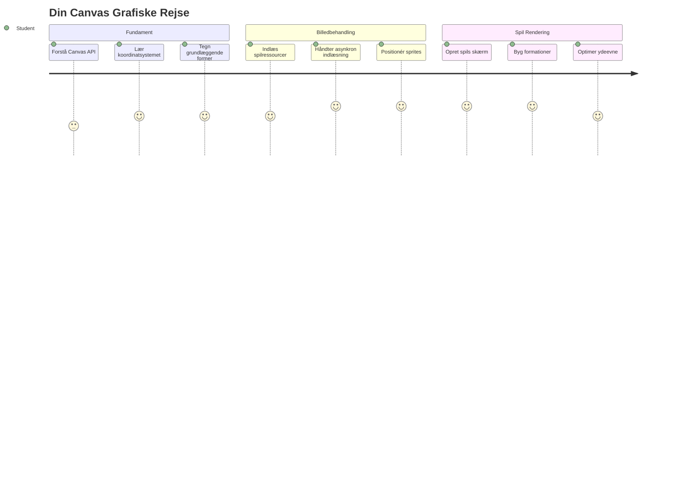
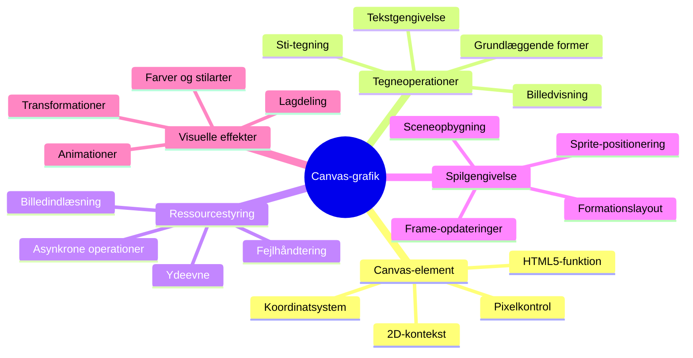
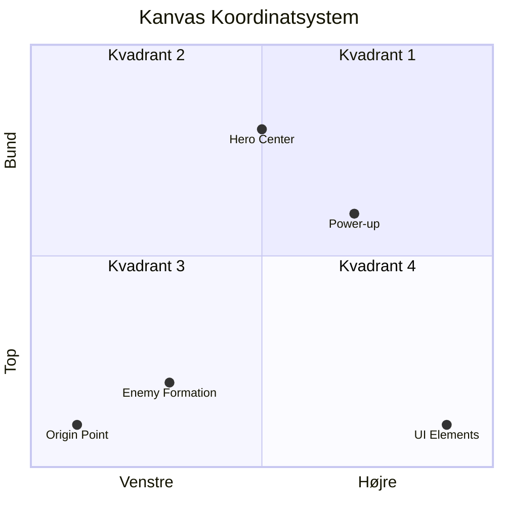
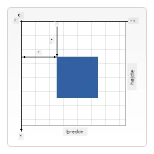
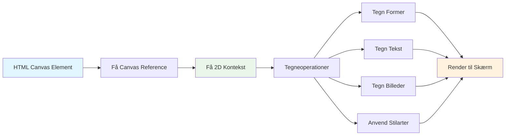
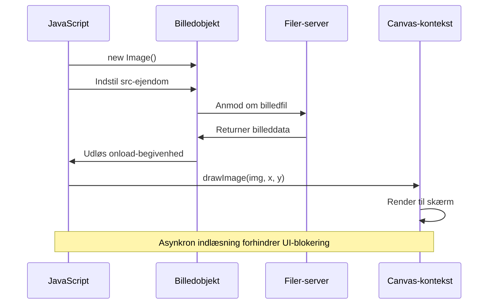
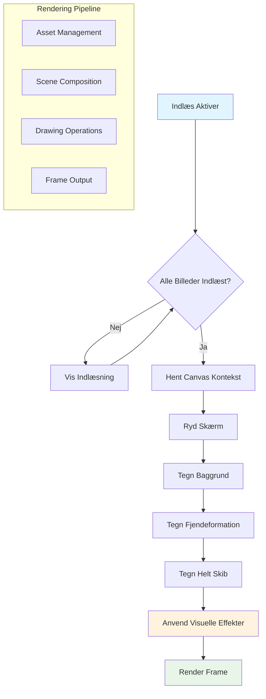
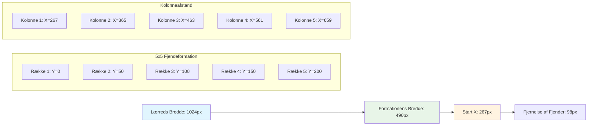
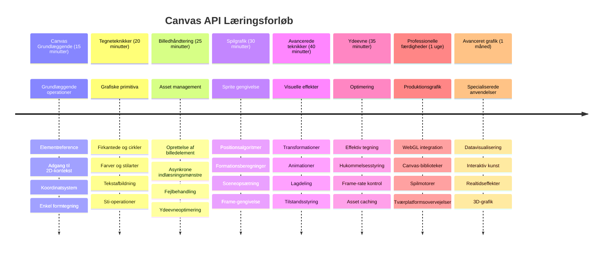

<!--
CO_OP_TRANSLATOR_METADATA:
{
  "original_hash": "7994743c5b21fdcceb36307916ef249a",
  "translation_date": "2026-01-06T23:37:35+00:00",
  "source_file": "6-space-game/2-drawing-to-canvas/README.md",
  "language_code": "da"
}
-->
# Byg et rumspil del 2: Tegn helt og monstre på Canvas


Canvas API'en er en af webudviklingens mest kraftfulde funktioner til at skabe dynamiske, interaktive grafik direkte i din browser. I denne lektion vil vi omdanne det tomme HTML `<canvas>` element til en spilverden fyldt med helte og monstre. Tænk på canvas som dit digitale lærred, hvor kode bliver til visuel fremstilling.

Vi bygger videre på, hvad du lærte i den forrige lektion, og nu dykker vi ned i de visuelle aspekter. Du vil lære at indlæse og vise spilsprites, placere elementer præcist og skabe det visuelle fundament for dit rumspil. Dette bygger bro mellem statiske websider og dynamiske, interaktive oplevelser.

I slutningen af denne lektion vil du have en komplet spilsccene med dit helteskib korrekt placeret og fjendeformationer klar til kamp. Du vil forstå, hvordan moderne spil gengiver grafik i browsere og få færdigheder til at skabe dine egne interaktive visuelle oplevelser. Lad os udforske canvas-grafik og bringe dit rumspil til live!


## For-forelæsning quiz

[For-forelæsningsquiz](https://ff-quizzes.netlify.app/web/quiz/31)

## Canvas

Så hvad er dette `<canvas>` element egentlig? Det er HTML5's løsning til at skabe dynamisk grafik og animationer i webbrowsere. I modsætning til almindelige billeder eller videoer, der er statiske, giver canvas dig pixel-niveau kontrol over alt, der vises på skærmen. Det gør det perfekt til spil, datavisualiseringer og interaktiv kunst. Tænk på det som en programmerbar tegneflade, hvor JavaScript bliver din pensel.

Som standard ligner et canvas-element en tom, transparent rektangel på din side. Men det er her potentialet ligger! Dets sande kraft dukker op, når du bruger JavaScript til at tegne former, indlæse billeder, skabe animationer og få ting til at reagere på brugerinteraktioner. Det minder om, hvordan tidlige computer-grafik pionerer hos Bell Labs i 1960'erne måtte programmere hver eneste pixel for at skabe de første digitale animationer.

✅ Læs [mere om Canvas API](https://developer.mozilla.org/docs/Web/API/Canvas_API) på MDN.

Sådan erklæres det normalt som en del af sidens body:

```html
<canvas id="myCanvas" width="200" height="100"></canvas>
```

**Dette gør koden:**
- **Sætter** `id` attributten, så du kan referere til dette specifikke canvas-element i JavaScript
- **Definerer** `width` i pixels for at kontrollere canvas’ens horisontale størrelse
- **Fastlægger** `height` i pixels for at bestemme canvas’ens vertikale dimensioner

## Tegn enkel geometri

Nu hvor du ved, hvad canvas-elementet er, så lad os udforske faktisk at tegne på det! Canvas bruger et koordinatsystem, der måske føles bekendt fra matematikundervisningen, men der er et vigtigt twist, som er særligt for computer-grafik.

Canvas bruger kartesiske koordinater med en x-akse (vandret) og y-akse (lodret) til at placere alt, hvad du tegner. Men her er hovedforskellen: i modsætning til koordinatsystemet i matematik starter origo `(0,0)` i øverste venstre hjørne, hvor x-værdierne stiger, når du bevæger dig mod højre, og y-værdierne stiger, når du bevæger dig nedad. Denne tilgang stammer fra tidlige computerskærme, hvor elektronstråler scannede fra top til bund, hvilket gjorde øverste venstre hjørne til det naturlige udgangspunkt.



> Billede fra [MDN](https://developer.mozilla.org/docs/Web/API/Canvas_API/Tutorial/Drawing_shapes)

For at tegne på canvas-elementet følger du den samme tre-trins proces, som udgør fundamentet for al canvas grafik. Når du har gjort det et par gange, bliver det anden natur:


1. **Hent en reference** til dit Canvas-element fra DOM’en (lige som ethvert andet HTML-element)
2. **Hent 2D rendering context** – dette giver alle tegne-metoderne
3. **Begynd at tegne!** Brug context’ens indbyggede metoder til at skabe din grafik

Sådan ser det ud i kode:

```javascript
// Trin 1: Hent canvas-elementet
const canvas = document.getElementById("myCanvas");

// Trin 2: Hent 2D-renderingskonteksten
const ctx = canvas.getContext("2d");

// Trin 3: Indstil fyldfarve og tegn en rektangel
ctx.fillStyle = 'red';
ctx.fillRect(0, 0, 200, 200); // x, y, bredde, højde
```

**Lad os bryde det ned trin for trin:**
- Vi **henter** vores canvas-element med dets ID og gemmer det i en variabel
- Vi **får fat i** 2D rendering context – det er vores værktøjskasse fyldt med tegne-metoder
- Vi **siger** til canvas, at vi vil fylde med rød ved at sætte `fillStyle` egenskaben
- Vi **tegner** et rektangel startende øverst til venstre (0,0) på 200 pixels bredt og højt

✅ Canvas API'en fokuserer mest på 2D former, men du kan også tegne 3D elementer på et websted; til det kan du bruge [WebGL API](https://developer.mozilla.org/docs/Web/API/WebGL_API).

Du kan tegne alle mulige ting med Canvas API som:

- **Geometriske former**, vi har allerede vist, hvordan man tegner et rektangel, men der er meget mere, du kan tegne.
- **Tekst**, du kan tegne tekst med enhver font og farve, du ønsker.
- **Billeder**, du kan tegne et billede baseret på en billedfil som f.eks. .jpg eller .png.

✅ Prøv det! Du ved, hvordan man tegner et rektangel, kan du tegne en cirkel på en side? Tag et kig på nogle interessante Canvas-tegninger på CodePen. Her er et [især imponerende eksempel](https://codepen.io/dissimulate/pen/KrAwx).

### 🔄 **Pædagogisk check-in**
**Forståelse af Canvas grundprincipper**: Før vi går videre til billedeindlæsning, sikre dig at du kan:
- ✅ Forklare, hvordan canvas koordinatsystem adskiller sig fra matematiske koordinater
- ✅ Forstå tre-trins processen for canvas tegnehandlinger
- ✅ Identificere, hvad 2D rendering context tilbyder
- ✅ Beskrive, hvordan fillStyle og fillRect arbejder sammen

**Hurtig selvtest**: Hvordan ville du tegne en blå cirkel ved position (100, 50) med radius 25?
```javascript
ctx.fillStyle = 'blue';
ctx.beginPath();
ctx.arc(100, 50, 25, 0, 2 * Math.PI);
ctx.fill();
```

**Canvas tegne-metoder du nu kender**:
- **fillRect()**: Tegner fyldte rektangler
- **fillStyle**: Sætter farver og mønstre
- **beginPath()**: Starter nye tegneveje
- **arc()**: Skaber cirkler og kurver

## Indlæs og tegn et billede

At tegne grundlæggende former er nyttigt til at komme i gang, men de fleste spil har brug for rigtige billeder! Sprites, baggrunde og teksturer er det, der giver spil visuel appel. Indlæsning og visning af billeder på canvas fungerer anderledes end at tegne geometriske former, men det er ligetil, når du forstår processen.

Vi skal oprette et `Image` objekt, indlæse vores billedfil (det sker asynkront, hvilket betyder "i baggrunden"), og derefter tegne det på canvas, når det er klar. Denne tilgang sikrer, at dine billeder vises korrekt uden at blokere din applikation, mens de indlæses.


### Grundlæggende billedeindlæsning

```javascript
const img = new Image();
img.src = 'path/to/my/image.png';
img.onload = () => {
  // Billedet er indlæst og klar til brug
  console.log('Image loaded successfully!');
};
```

**Det sker i denne kode:**
- Vi **opretter** et helt nyt Image-objekt til at holde vores sprite eller tekstur
- Vi **angiver** hvilken billedfil, der skal indlæses ved at sætte kilde-stien
- Vi **lytter** efter load-begivenheden, så vi ved præcis, hvornår billedet er klar til brug

### En bedre måde at indlæse billeder på

Her er en mere robust måde at håndtere billedeindlæsning, som professionelle udviklere ofte bruger. Vi pakker billedeindlæsningen ind i en Promise-baseret funktion – denne tilgang, som blev populær, da JavaScript Promises blev standard i ES6, gør din kode mere organiseret og håndterer fejl elegant:

```javascript
function loadAsset(path) {
  return new Promise((resolve, reject) => {
    const img = new Image();
    img.src = path;
    img.onload = () => {
      resolve(img);
    };
    img.onerror = () => {
      reject(new Error(`Failed to load image: ${path}`));
    };
  });
}

// Moderne brug med async/await
async function initializeGame() {
  try {
    const heroImg = await loadAsset('hero.png');
    const monsterImg = await loadAsset('monster.png');
    // Billeder er nu klar til brug
  } catch (error) {
    console.error('Failed to load game assets:', error);
  }
}
```

**Her har vi gjort:**
- **Pakket** al billedeindlæsningslogikken ind i en Promise, så vi kan håndtere det bedre
- **Tilføjet** fejlhåndtering, der faktisk fortæller os, når noget går galt
- **Brugt** moderne async/await syntaks fordi den er så meget nemmere at læse
- **Inkluderet** try/catch blokke for at håndtere eventuelle indlæsningsproblemer pænt

Når dine billeder er indlæst, er det faktisk meget enkelt at tegne dem på canvas:

```javascript
async function renderGameScreen() {
  try {
    // Indlæs spilressourcer
    const heroImg = await loadAsset('hero.png');
    const monsterImg = await loadAsset('monster.png');

    // Hent lærred og kontekst
    const canvas = document.getElementById("myCanvas");
    const ctx = canvas.getContext("2d");

    // Tegn billeder på specifikke positioner
    ctx.drawImage(heroImg, canvas.width / 2, canvas.height / 2);
    ctx.drawImage(monsterImg, 0, 0);
  } catch (error) {
    console.error('Failed to render game screen:', error);
  }
}
```

**Lad os gennemgå det trin for trin:**
- Vi **indlæser** både vores helt og monsterbilleder i baggrunden ved hjælp af await
- Vi **henter** vores canvas element og får den 2D rendering context, vi skal bruge
- Vi **placerer** heltens billede lige i midten ved hjælp af lidt hurtig koordinat-matematik
- Vi **lægger** monsterbilledet i øverste venstre hjørne for at starte vores fjendeformation
- Vi **fanger** eventuelle fejl, der kan opstå under indlæsning eller rendering


## Nu er det tid til at begynde at bygge dit spil

Nu samler vi det hele for at skabe det visuelle fundament i dit rumspil. Du har en solid forståelse for canvas grundprincipper og billedeindlæsningsteknikker, så denne praktiske sektion vil guide dig gennem at bygge en komplet spilscreen med korrekt placerede sprites.

### Hvad skal bygges

Du skal bygge en webside med et Canvas-element. Det skal gengive en sort skærm `1024*768`. Vi har leveret to billeder til dig:

- Helteskib

   

- 5*5 monstre

   

### Anbefalede trin for at starte udviklingen

Find startfilerne, som er oprettet for dig i undermappen `your-work`. Din projektstruktur bør indeholde:

```bash
your-work/
├── assets/
│   ├── enemyShip.png
│   └── player.png
├── index.html
├── app.js
└── package.json
```

**Det arbejder du med:**
- **Spil sprites** ligger i `assets/` mappen, så alt holder sig organiseret
- **Din hoved HTML fil** opsætter canvas elementet og forbereder det hele
- **En JavaScript fil** hvor du skal skrive al din spil-renderingsmagi
- **En package.json** som opsætter en udviklingsserver, så du kan teste lokalt

Åbn denne mappe i Visual Studio Code for at begynde udviklingen. Du skal have et lokalt udviklingsmiljø med Visual Studio Code, NPM og Node.js installeret. Hvis du ikke har `npm` sat op på din computer, [her er hvordan du installerer det](https://www.npmjs.com/get-npm).

Start din udviklingsserver ved at navigere til `your-work` mappen:

```bash
cd your-work
npm start
```

**Denne kommando gør nogle ret fede ting:**
- **Starter** en lokal server på `http://localhost:5000`, så du kan teste dit spil
- **Serverer** alle dine filer korrekt, så din browser kan loade dem rigtigt
- **Holder øje med** dine filer for ændringer, så du kan udvikle glat
- **Giver dig** et professionelt udviklingsmiljø til at teste det hele

> 💡 **Bemærk**: Din browser vil først vise en tom side – det er forventet! Når du tilføjer kode, opdater browseren for at se dine ændringer. Denne iterative udviklingsstil minder om, hvordan NASA byggede Apollo vejledningscomputeren – test hver komponent før de integrerede den i det større system.

### Tilføj kode

Tilføj den nødvendige kode i `your-work/app.js` for at fuldføre følgende opgaver:

1. **Tegn et canvas med sort baggrund**
   > 💡 **Sådan gør du**: Find TODO i `/app.js` og tilføj bare to linjer. Sæt `ctx.fillStyle` til sort, brug så `ctx.fillRect()` startende ved (0,0) med dine canvas-dimensioner. Nemt!

2. **Indlæs spilteksturer**
   > 💡 **Sådan gør du**: Brug `await loadAsset()` til at indlæse dine spiller- og fjendebilleder. Gem dem i variabler, så du kan bruge dem senere. Husk – de vises ikke, før du rent faktisk tegner dem!

3. **Tegn helteskibet i centrum-nederst position**
   > 💡 **Sådan gør du**: Brug `ctx.drawImage()` til at placere din helt. For x-koordinaten prøv `canvas.width / 2 - 45` for at centrere, og for y-koordinaten brug `canvas.height - canvas.height / 4` for at placere det i nederste område.

4. **Tegn en 5×5 formation af fjendtlige skibe**
   > 💡 **Sådan gør du**: Find `createEnemies` funktionen og opsæt en indlejret løkke. Du skal lave lidt matematik for afstand og placering, men bare rolig – jeg viser dig præcist hvordan!

Først, fastsæt konstanter for korrekt layout af fjendeformationen:

```javascript
const ENEMY_TOTAL = 5;
const ENEMY_SPACING = 98;
const FORMATION_WIDTH = ENEMY_TOTAL * ENEMY_SPACING;
const START_X = (canvas.width - FORMATION_WIDTH) / 2;
const STOP_X = START_X + FORMATION_WIDTH;
```

**Sådan bryder vi disse konstanter ned:**
- Vi **sætter** 5 fjender pr. række og kolonne (et flot 5×5 gitter)
- Vi **definerer** hvor meget plads, der skal være mellem fjenderne, så de ikke ser klemt ud
- Vi **beregner** hvor bred hele formationen bliver
- Vi **finder ud af**, hvor vi skal starte og slutte, så formationen ser centreret ud


Så laver du indlejrede løkker for at tegne fjendeformationen:

```javascript
for (let x = START_X; x < STOP_X; x += ENEMY_SPACING) {
  for (let y = 0; y < 50 * 5; y += 50) {
    ctx.drawImage(enemyImg, x, y);
  }
}
```

**Det gør denne indlejrede løkke:**
- Den ydre løkke **bevæger sig** fra venstre mod højre hen over vores formation
- Den indre løkke **går** fra top til bund for at skabe pæne rækker
- Vi **tegner** hver fjendesprite på de præcise x,y koordinater vi har beregnet
- Alt holdes **jævnt fordelt**, så det ser professionelt og organiseret ud

### 🔄 **Pædagogisk check-in**
**Mestring af spil-rendering**: Tjek din forståelse af det komplette rendering system:
- ✅ Hvordan forhindrer asynkron billedeindlæsning UI-blokering under spilopstart?
- ✅ Hvorfor beregner vi fjendeformationens positioner med konstanter i stedet for at hardkode?
- ✅ Hvilken rolle spiller 2D rendering context i tegneoperationer?
- ✅ Hvordan skaber indlejrede løkker organiserede sprite-formationer?

**Performance overvejelser**: Dit spil demonstrerer nu:
- **Effektiv asset indlæsning**: Promise-baseret billedhåndtering
- **Organiseret rendering**: Strukturerede tegnehandlinger
- **Matematisk placering**: Beregnet spriteplacering
- **Fejlhåndtering**: Elegant håndtering af fejl

**Visuelle programmeringskoncepter**: Du har lært:
- **Koordinatsystemer**: Oversættelse af matematik til skærmpositioner  
- **Sprite-administration**: Indlæsning og visning af spilstyringsgrafik  
- **Formationsalgoritmer**: Matematiske mønstre til organiserede layouts  
- **Async-operationer**: Moderne JavaScript for en glidende brugeroplevelse  

## Resultat

Det færdige resultat burde se sådan ud:


## Løsning

Prøv venligst først at løse det selv, men hvis du går i stå, kan du kigge på en [løsning](../../../../6-space-game/2-drawing-to-canvas/solution/app.js)

---

## GitHub Copilot Agent Challenge 🚀

Brug Agent-tilstand til at fuldføre følgende udfordring:

**Beskrivelse:** Forbedr dit rumspils canvas ved at tilføje visuelle effekter og interaktive elementer ved hjælp af Canvas API-teknikker, du har lært.

**Prompt:** Opret en ny fil kaldet `enhanced-canvas.html` med et canvas, der viser animerede stjerner i baggrunden, en pulserende helbredsindikator for helteskibet, og fjendtlige skibe, der langsomt bevæger sig nedad. Inkluder JavaScript-kode, der tegner blinkende stjerner ved brug af tilfældige positioner og opacitet, implementerer en helbredsindikator, der ændrer farve baseret på helbredsniveau (grøn > gul > rød), og animerer de fjendtlige skibe til at bevæge sig nedad på skærmen i forskellige hastigheder.

Læs mere om [agent-tilstand](https://code.visualstudio.com/blogs/2025/02/24/introducing-copilot-agent-mode) her.

## 🚀 Udfordring

Du har lært at tegne med det 2D-fokuserede Canvas API; tag et kig på [WebGL API](https://developer.mozilla.org/docs/Web/API/WebGL_API), og prøv at tegne et 3D-objekt.

## Quiz efter forelæsning

[Quiz efter forelæsning](https://ff-quizzes.netlify.app/web/quiz/32)

## Gennemgang & Selvstudium

Lær mere om Canvas API ved at [læse om det](https://developer.mozilla.org/docs/Web/API/Canvas_API).

### ⚡ **Hvad du kan gøre de næste 5 minutter**
- [ ] Åbn browserkonsollen og opret et canvas-element med `document.createElement('canvas')`  
- [ ] Prøv at tegne et rektangel ved hjælp af `fillRect()` på et canvas-kontekst  
- [ ] Eksperimenter med forskellige farver ved hjælp af `fillStyle`-egenskaben  
- [ ] Tegn en simpel cirkel med `arc()`-metoden  

### 🎯 **Hvad du kan nå i denne time**
- [ ] Fuldfør quizzen efter lektionen og forstå canvas-grundlaget  
- [ ] Opret en canvas-tegneapplikation med flere former og farver  
- [ ] Implementer billedindlæsning og sprite-rendering til dit spil  
- [ ] Byg en simpel animation, der flytter objekter hen over canvas  
- [ ] Øv dig i canvas-transformationer som skalering, rotation og translation  

### 📅 **Din ugentlige Canvas-rejse**
- [ ] Færdiggør rumspillet med polerede grafik og sprite-animationer  
- [ ] Mest avancerede canvas-teknikker som gradienter, mønstre og composite  
- [ ] Skab interaktive visualiseringer ved hjælp af canvas til datarepræsentation  
- [ ] Lær om canvas-optimeringsteknikker for jævn ydeevne  
- [ ] Byg en tegne- eller maleapplikation med forskellige værktøjer  
- [ ] Udforsk kreative kodningsmønstre og generativ kunst med canvas  

### 🌟 **Din månedlange grafik-mestre**
- [ ] Byg komplekse visuelle applikationer ved brug af Canvas 2D og WebGL  
- [ ] Lær grafikprogrammeringskoncepter og shader-grundlag  
- [ ] Bidrag til open source grafikbiblioteker og visualiseringsværktøjer  
- [ ] Mestre performance-optimering til grafikintensive applikationer  
- [ ] Skab undervisningsmateriale om canvas-programmering og computer-grafik  
- [ ] Bliv ekspert i grafikprogrammering og hjælp andre med at skabe visuelle oplevelser  

## 🎯 Din Canvas-grafikmesterskabs Tidslinje


### 🛠️ Dit Canvas-grafikværktøjssæt Resumé

Efter at have gennemført denne lektion har du nu:  
- **Canvas API-mesterskab**: Fuld forståelse af 2D-grafikprogrammering  
- **Koordinatmatematik**: Præcise positionerings- og layoutalgoritmer  
- **Asset Management**: Professionel billedindlæsning og fejlhåndtering  
- **Rendering Pipeline**: Struktureret tilgang til scenekomposition  
- **Spilgrafik**: Sprite-positionering og formationsberegning  
- **Async Programmering**: Moderne JavaScript-mønstre til glidende ydeevne  
- **Visuel Programmering**: Oversættelse af matematiske koncepter til skærmgrafik  

**Anvendelser i den virkelige verden**: Dine Canvas-færdigheder kan direkte bruges til:  
- **Datavisualisering**: Diagrammer, grafer og interaktive dashboards  
- **Spiludvikling**: 2D-spil, simuleringer og interaktive oplevelser  
- **Digital Kunst**: Kreativ kodning og generative kunstprojekter  
- **UI/UX Design**: Tilpassede grafikker og interaktive elementer  
- **Uddannelsessoftware**: Visuelle læringsværktøjer og simuleringer  
- **Webapplikationer**: Dynamisk grafik og realtidsvisualiseringer  

**Professionelle færdigheder du har opnået**: Du kan nu:  
- **Bygge** skræddersyede grafikløsninger uden eksterne biblioteker  
- **Optimere** renderingens ydeevne for glidende brugeroplevelser  
- **Fejlsøge** komplekse visuelle problemer ved hjælp af browserens udviklerværktøjer  
- **Designe** skalerbare grafiske systemer baseret på matematiske principper  
- **Integrere** Canvas-grafik med moderne webapplikationsrammer  

**Canvas API-metoder du mestrer**:  
- **Elementadministration**: getElementById, getContext  
- **Tegneoperationer**: fillRect, drawImage, fillStyle  
- **Asset-indlæsning**: Billedobjekter, Promise-mønstre  
- **Matematisk positionering**: Koordinatberegninger, formationsalgoritmer  

**Næste niveau**: Du er klar til at tilføje animation, brugerinteraktion, kollisionsregistrering eller udforske WebGL til 3D-grafik!

🌟 **Præstation opnået**: Du har bygget et komplet spilsystem til rendering ved brug af grundlæggende Canvas API-teknikker!

## Opgave

[Leg med Canvas API](assignment.md)

---

<!-- CO-OP TRANSLATOR DISCLAIMER START -->
**Ansvarsfraskrivelse**:  
Dette dokument er blevet oversat ved hjælp af AI-oversættelsestjenesten [Co-op Translator](https://github.com/Azure/co-op-translator). Selvom vi bestræber os på nøjagtighed, bedes du være opmærksom på, at automatiserede oversættelser kan indeholde fejl eller unøjagtigheder. Det oprindelige dokument på dets oprindelige sprog skal betragtes som den autoritative kilde. For vigtig information anbefales professionel menneskelig oversættelse. Vi påtager os intet ansvar for misforståelser eller fejltolkninger, der måtte opstå som følge af brugen af denne oversættelse.
<!-- CO-OP TRANSLATOR DISCLAIMER END -->