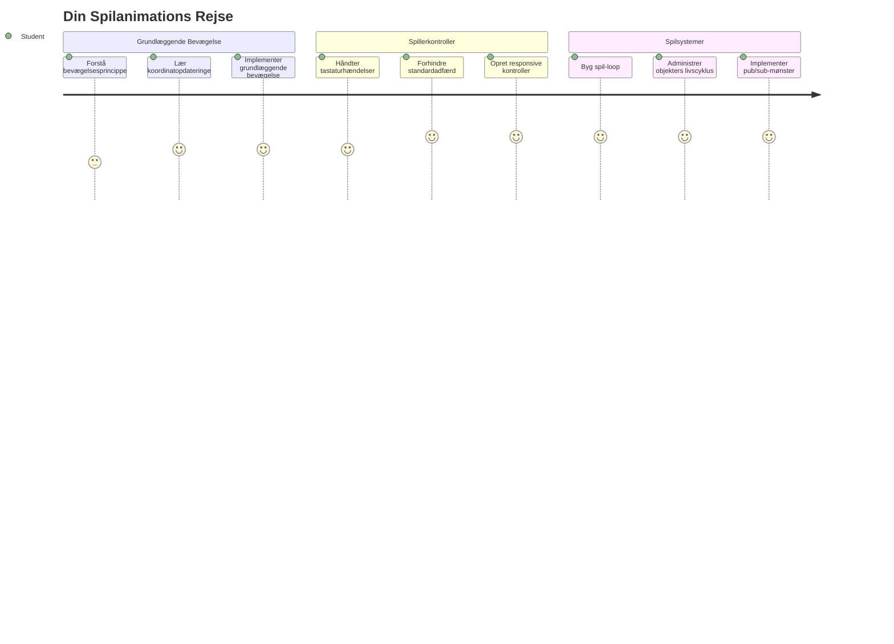
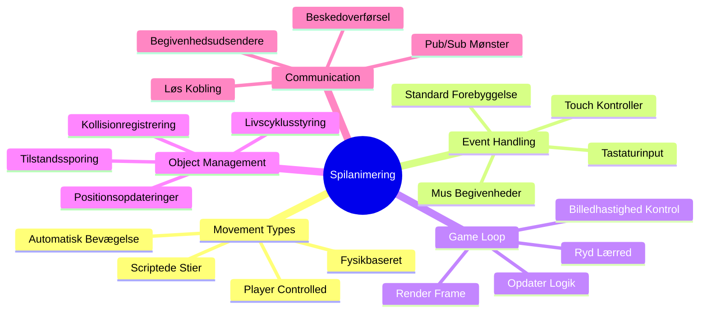
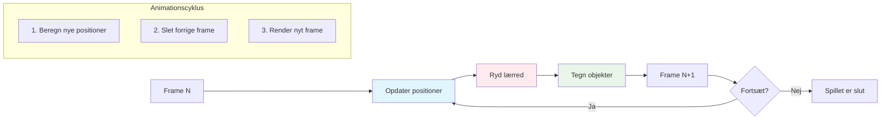
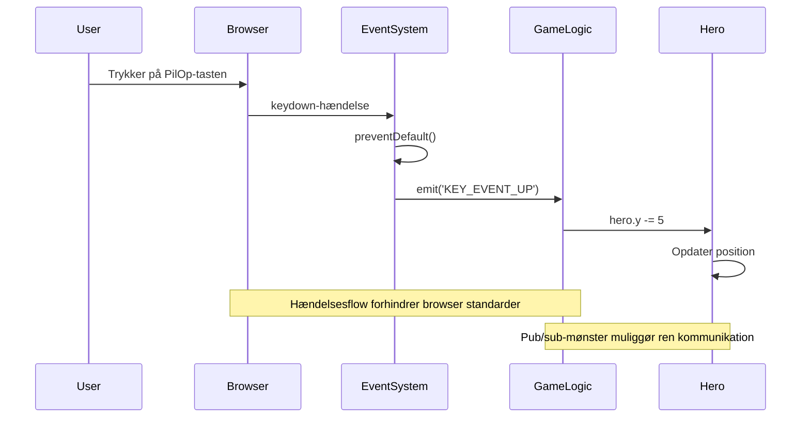
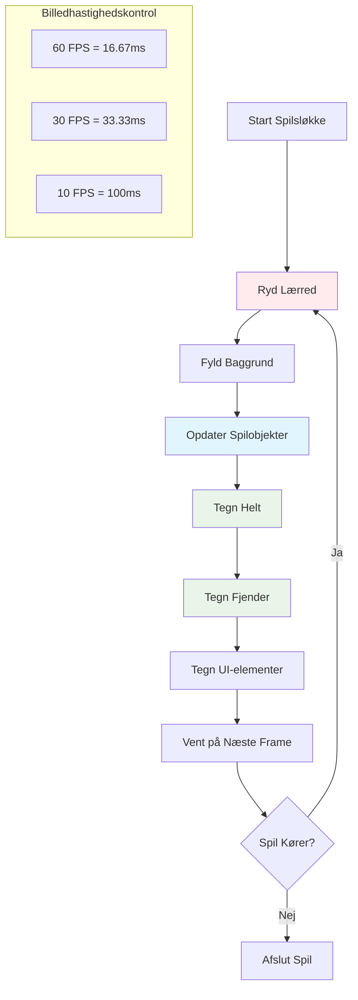
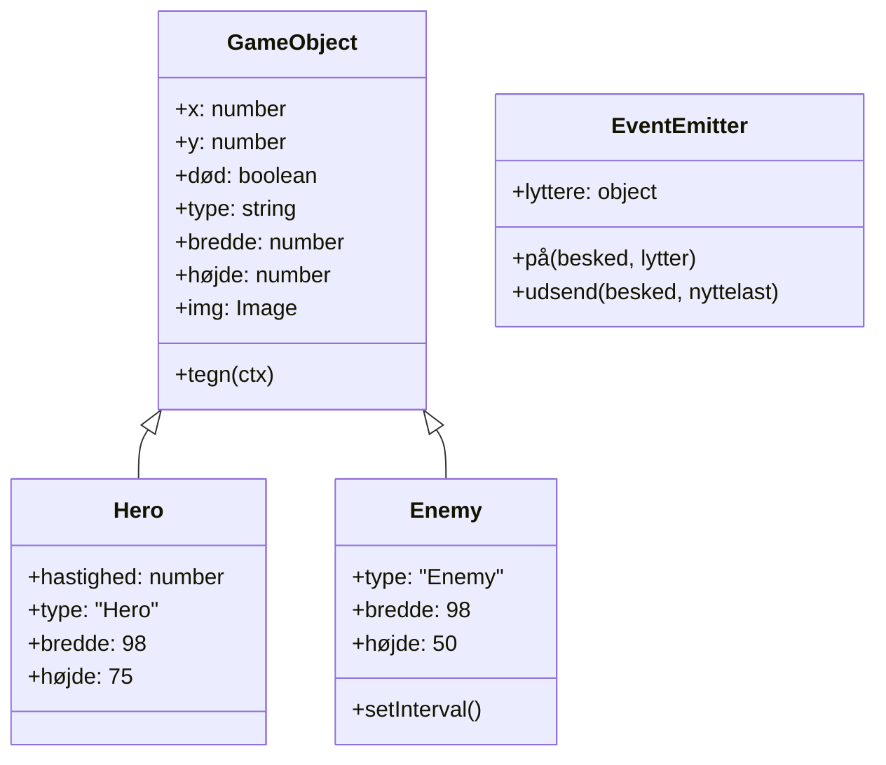
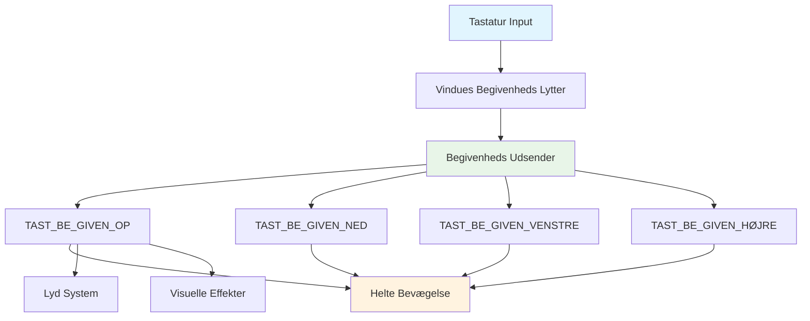
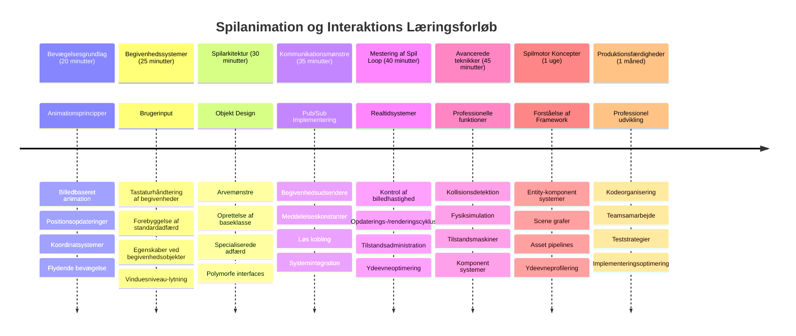

# Byg et rumspil del 3: Tilføj bevægelse


Tænk på dine yndlingsspil – det, der gør dem fængslende, er ikke kun flotte grafik, men måden alt bevæger sig og reagerer på dine handlinger. Lige nu er dit rumspil som et smukt maleri, men vi er ved at tilføje bevægelse, som bringer det til live.

Da NASAs ingeniører programmerede vejledningscomputeren til Apollo-missionerne, stod de over for en lignende udfordring: hvordan får man et rumfartøj til at reagere på pilotens input, mens det automatisk opretholder kurskorrektioner? De principper, vi skal lære i dag, afspejler netop disse koncepter – at styre spillerkontrolleret bevægelse sammen med automatiske systemadfærder.

I denne lektion lærer du, hvordan rumskibe svæver hen over skærmen, reagerer på spillerkommandoer og skaber glatte bevægelsesmønstre. Vi bryder det hele ned i håndterbare koncepter, der bygger naturligt på hinanden.

Når vi er færdige, vil spillere flyve deres helteskib rundt på skærmen, mens fjendtlige fartøjer patruljerer ovenover. Endnu vigtigere vil du forstå de grundlæggende principper, der styrer spils bevægelsessystemer.


## Quiz før forelæsning

[Quiz før forelæsning](https://ff-quizzes.netlify.app/web/quiz/33)

## Forståelse af spilbevægelse

Spil bliver levende, når ting begynder at bevæge sig rundt, og grundlæggende sker der to måder dette kan foregå på:

- **Spillerkontrolleret bevægelse**: Når du trykker på en tast eller klikker med musen, bevæger noget sig. Dette er den direkte forbindelse mellem dig og din spilverden.  
- **Automatisk bevægelse**: Når spillet selv bestemmer at flytte ting – som de fjendtlige skibe, der skal patruljere skærmen, uanset om du gør noget eller ej.

At få objekter til at bevæge sig på en computerskærm er enklere, end du måske tror. Kan du huske x- og y-koordinaterne fra matematik? Det er præcis det, vi arbejder med her. Da Galileo i 1610 fulgte Jupiters måner, gjorde han stort set det samme – plotte positioner over tid for at forstå bevægelsesmønstre.

At flytte ting på skærmen er som at skabe en flipbook-animation – du skal følge disse tre simple trin:


1. **Opdater positionen** – Ændr hvor objektet skal være (måske flyt det 5 pixels til højre)  
2. **Slet den gamle frame** – Ryd skærmen, så du ikke ser spøgelsesagtige spor overalt  
3. **Tegn den nye frame** – Placer dit objekt på dets nye sted  

Gør dette hurtigt nok, og bum! Så har du glidende bevægelse, der føles naturlig for spillere.

Sådan kan det se ud i kode:

```javascript
// Indstil heltenes placering
hero.x += 5;
// Ryd rektanglet, der huser helten
ctx.clearRect(0, 0, canvas.width, canvas.height);
// Tegn spillets baggrund og helten igen
ctx.fillRect(0, 0, canvas.width, canvas.height);
ctx.fillStyle = "black";
ctx.drawImage(heroImg, hero.x, hero.y);
```
  
**Det her gør koden:**  
- **Opdaterer** heltenes x-koordinat med 5 pixels for at flytte den horisontalt  
- **Rydder** hele canvasområdet for at fjerne den tidligere frame  
- **Fylder** canvas med en sort baggrundsfarve  
- **Tegner igen** heltebilledet på sin nye position  

✅ Kan du tænke på en grund til, at det at tegne din helt mange frames per sekund kan gå ud over ydeevnen? Læs om [alternativer til dette mønster](https://developer.mozilla.org/en-US/docs/Web/API/Canvas_API/Tutorial/Optimizing_canvas).

## Håndtering af tastaturhændelser

Her forbinder vi spillerens input med spillets handling. Når nogen trykker på mellemrumstasten for at skyde en laser eller trykker på piletaster for at undvige en asteroide, skal dit spil registrere og reagere på det input.

Tastaturhændelser sker på vinduesniveau, hvilket betyder, at hele din browserløsning lytter efter disse tastetryk. Musklik kan til gengæld knyttes til specifikke elementer (som at klikke på en knap). Til vores rumspil fokuserer vi på tastaturkontroller, da det giver spillere en klassisk arkadefølelse.

Det minder mig om, hvordan telegrafister i 1800-tallet måtte oversætte morsekodeinput til meningsfulde beskeder – vi gør noget lignende, ved at oversætte tastetryk til spilkommandoer.

For at håndtere en hændelse skal du bruge vinduets `addEventListener()`-metode og give den to parametre. Den første er navnet på hændelsen, for eksempel `keyup`. Den anden er den funktion, der skal kaldes, når hændelsen sker.

Her er et eksempel:

```javascript
window.addEventListener('keyup', (evt) => {
  // evt.key = strengrepræsentation af tasten
  if (evt.key === 'ArrowUp') {
    // gør noget
  }
});
```
  
**Dette sker her:**  
- **Lytter** efter tastaturhændelser på hele vinduet  
- **Fanger** hændelsesobjektet, som indeholder info om hvilken tast, der blev trykket  
- **Tjekker** om tasten matcher en bestemt tast (i dette tilfælde pil op)  
- **Udfører** kode, når betingelsen er opfyldt  

For tastaturhændelser kan du bruge to egenskaber på hændelsen for at se, hvilken tast der blev trykket:

- `key` - en strengrepræsentation af tasten, f.eks. `'ArrowUp'`  
- `keyCode` - et nummer, f.eks. `37`, som svarer til `ArrowLeft`  

✅ Tastaturhåndtering er nyttigt uden for spildesign. Hvilke andre anvendelser kan du tænke dig til denne teknik?


### Særlige taster: en advarsel!

Nogle taster har indbyggede browserfunktioner, der kan forstyrre dit spil. Piletaster ruller siden, og mellemrumstasten hopper ned – adfærder du ikke ønsker, når nogen forsøger at styre deres rumskib.

Vi kan forhindre disse standardadfærder og lade vores spil håndtere inputtet i stedet. Det ligner, hvordan tidlige computerprogrammører måtte tilsidesætte systemafbrydelser for at skabe brugerdefineret adfærd – vi gør det bare på browserniveau. Sådan:

```javascript
const onKeyDown = function (e) {
  console.log(e.keyCode);
  switch (e.keyCode) {
    case 37:
    case 39:
    case 38:
    case 40: // Piletaster
    case 32:
      e.preventDefault();
      break; // Mellemrum
    default:
      break; // blokerer ikke andre taster
  }
};

window.addEventListener('keydown', onKeyDown);
```
  
**Hvad denne blok gør:**  
- **Tjekker** for specifikke tastkoder, som kan skabe uønsket browseradfærd  
- **Forhindrer** browserens standardaktion for piletaster og mellemrumstasten  
- **Lader** andre taster fungere normalt  
- **Bruger** `e.preventDefault()` til at stoppe browserens indbyggede adfærd  

### 🔄 **Pædagogisk status**
**Forståelse af hændelseshåndtering**: Før vi går videre til automatisk bevægelse, sørg for at du kan:  
- ✅ Forklare forskellen på `keydown` og `keyup` hændelser  
- ✅ Forstå hvorfor vi forhindrer standard browserhandlinger  
- ✅ Beskrive hvordan event listeners forbinder brugerinput med spilogik  
- ✅ Identificere hvilke taster der kan forstyrre spilkontroller  

**Hurtig selvtest**: Hvad ville ske, hvis du ikke forhindrede standardadfærden for piletaster?  
*Svar: Browseren ville rulle siden, hvilket ville forstyrre spillets bevægelse*  

**Arkitektur for hændelsessystem**: Du forstår nu:  
- **Lytning på vinduesniveau**: Fangst af hændelser på browserniveau  
- **Hændelsesobjektets egenskaber**: `key` strenge versus `keyCode` tal  
- **Forhindring af standard**: Stoppe uønskede browseradfærd  
- **Betinget logik**: Reagere på specifikke tastkombinationer  

## Spilinduceret bevægelse

Lad os nu tale om objekter, der bevæger sig uden spillerinput. Tænk på fjendtlige skibe, der cruiser hen over skærmen, kugler, der flyver ligeud, eller skyer, der driver i baggrunden. Denne autonome bevægelse får din spilverden til at føles levende, selv når ingen rører ved kontrollerne.

Vi bruger JavaScripts indbyggede timere til at opdatere positioner med jævne mellemrum. Dette koncept er lig pendulure – en regelmæssig mekanisme, som udløser konsistente, tidsbestemte handlinger. Sådan kan det se ud i simpel form:

```javascript
const id = setInterval(() => {
  // Flyt fjenden på y-aksen
  enemy.y += 10;
}, 100);
```
  
**Denne bevægelseskode gør:**  
- **Opretter** en timer, der kører hver 100 millisekund  
- **Opdaterer** fjendens y-koordinat med 10 pixels hver gang  
- **Gemmer** interval-ID'et, så vi kan stoppe det senere, hvis nødvendigt  
- **Flytter** fjenden automatisk nedad på skærmen  

## Spil-loopen

Her er konceptet, der binder det hele sammen – spil-loopen. Hvis dit spil var en film, ville spil-loopen være filmprojektoren, der viser frame efter frame så hurtigt, at alt ser ud til at bevæge sig glat.

Alle spil har sådan en loop, der kører i baggrunden. Det er en funktion, der opdaterer alle spilelementer, tegner skærmen igen og gentager denne proces kontinuerligt. Den holder styr på din helt, alle fjenderne, eventuelle lasere – hele spillets tilstand.

Dette minder mig om, hvordan tidlige filmtegnere som Walt Disney måtte tegne figurer på ny frame for frame for at skabe bevægelsesillusionen. Vi gør det samme, bare med kode i stedet for blyanter.

Sådan kan en spil-loop typisk se ud, i kodeeksempel:


```javascript
const gameLoopId = setInterval(() => {
  function gameLoop() {
    ctx.clearRect(0, 0, canvas.width, canvas.height);
    ctx.fillStyle = "black";
    ctx.fillRect(0, 0, canvas.width, canvas.height);
    drawHero();
    drawEnemies();
    drawStaticObjects();
  }
  gameLoop();
}, 200);
```
  
**Forståelse af spil-loop-strukturen:**  
- **Rydder** hele canvas for at fjerne den forrige frame  
- **Fylder** baggrunden med en ensfarvet farve  
- **Tegner** alle spilelementer på deres aktuelle positioner  
- **Gentager** denne proces hver 200 millisekund for glat animation  
- **Styrer** billedhastigheden ved at kontrollere intervallets timing  

## Fortsættelse af rumspillet

Nu tilføjer vi bevægelse til den statiske scene, du byggede tidligere. Vi vil transformere den fra et screenshot til en interaktiv oplevelse. Vi arbejder igennem dette trin for trin, så hvert element bygger på det forrige.

Tag koden derfra, hvor vi slap i den tidligere lektion (eller start med koden i [Part II- starter](../../../../6-space-game/3-moving-elements-around/your-work)-mappen, hvis du har brug for en frisk start).

**Det vi bygger i dag:**  
- **Heltekontroller**: Piletasterne styrer dit rumskib rundt på skærmen  
- **Fjendebevægelse**: De fremmede skibe begynder deres fremmarch  

Lad os begynde at implementere disse funktioner.

## Anbefalede trin

Find filerne, som er blevet oprettet til dig i `your-work` undermappen. Den burde indeholde følgende:

```bash
-| assets
  -| enemyShip.png
  -| player.png
-| index.html
-| app.js
-| package.json
```
  
Du starter dit projekt i `your-work` mappen ved at skrive:

```bash
cd your-work
npm start
```
  
**Denne kommando gør:**  
- **Navigerer** til din projektmappe  
- **Starter** en HTTP-server på adressen `http://localhost:5000`  
- **Serverer** dine spildfiler så du kan teste dem i en browser  

Ovenstående starter en HTTP-server på adressen `http://localhost:5000`. Åbn en browser og indtast adressen; lige nu skulle du kunne se helten og alle fjenderne; ingenting bevæger sig – endnu!

### Tilføj kode

1. **Tilføj dedikerede objekter** for `hero`, `enemy` og `game object`; de skal have `x` og `y` egenskaber. (Husk delen om [Arv eller sammensætning](../README.md)).

   *TIP* `game object` skal være den med `x` og `y` og evnen til at tegne sig selv på et canvas.

   > **Tip**: Start med at tilføje en ny `GameObject` klasse med dens konstruktør som vist herunder, og tegn den derefter på canvas:

    ```javascript
    class GameObject {
      constructor(x, y) {
        this.x = x;
        this.y = y;
        this.dead = false;
        this.type = "";
        this.width = 0;
        this.height = 0;
        this.img = undefined;
      }
    
      draw(ctx) {
        ctx.drawImage(this.img, this.x, this.y, this.width, this.height);
      }
    }
    ```
  
    **Forståelse af denne baseklasse:**  
    - **Definerer** fælles egenskaber, som alle spilelementer deler (position, størrelse, billede)  
    - **Inkluderer** et `dead`-flag til at spore, om objektet skal fjernes  
    - **Tilbyder** en `draw()`-metode, der tegner objektet på canvas  
    - **Sætter** standardværdier for alle egenskaber, som underklasser kan overskrive  


    Udvid nu `GameObject` for at skabe `Hero` og `Enemy`:
    
    ```javascript
    class Hero extends GameObject {
      constructor(x, y) {
        super(x, y);
        this.width = 98;
        this.height = 75;
        this.type = "Hero";
        this.speed = 5;
      }
    }
    ```
  
    ```javascript
    class Enemy extends GameObject {
      constructor(x, y) {
        super(x, y);
        this.width = 98;
        this.height = 50;
        this.type = "Enemy";
        const id = setInterval(() => {
          if (this.y < canvas.height - this.height) {
            this.y += 5;
          } else {
            console.log('Stopped at', this.y);
            clearInterval(id);
          }
        }, 300);
      }
    }
    ```
  
    **Nøglekoncepter i disse klasser:**  
    - **Arver** fra `GameObject` med `extends` nøgleordet  
    - **Kalder** forældrekonstruktøren med `super(x, y)`  
    - **Sætter** specifikke dimensioner og egenskaber for hver objekttype  
    - **Implementerer** automatisk bevægelse for fjender med `setInterval()`  

2. **Tilføj tastaturhåndteringsfunktioner** til at flytte helten op/ned, til venstre/højre

   *HUSK* det er et kartesisk system, øverst til venstre er `0,0`. Husk også at tilføje kode, der stopper *standardadfærden*

   > **Tip**: Opret din `onKeyDown` funktion og bind den til vinduet:

   ```javascript
   const onKeyDown = function (e) {
     console.log(e.keyCode);
     // Tilføj koden fra lektionen ovenfor for at stoppe standardadfærd
     switch (e.keyCode) {
       case 37:
       case 39:
       case 38:
       case 40: // Piletaster
       case 32:
         e.preventDefault();
         break; // Mellemrum
       default:
         break; // bloker ikke andre taster
     }
   };

   window.addEventListener("keydown", onKeyDown);
   ```
  
   **Det denne hændelsesfunktion gør:**  
   - **Lytter** efter keydown-hændelser på hele vinduet  
   - **Logger** tastkoden til fejlsøgning for at se, hvilke taster der trykkes  
   - **Forhindrer** standardbrowseradfærd for piletaster og mellemrumstasten  
   - **Lader** andre taster fungere normalt  
   
   Tjek din browserkonsol nu, og se tastetrykkene blive logget.  

3. **Implementer** [Pub sub mønstret](../README.md), som holder din kode ren, mens du følger de sidste dele.

   Publish-Subscribe-mønstret hjælper med at organisere din kode ved at adskille hændelsesdetektion fra hændelseshåndtering. Det gør din kode mere modulær og lettere at vedligeholde.

   For at gøre denne sidste del kan du:

   1. **Tilføj en event listener** på vinduet:

       ```javascript
       window.addEventListener("keyup", (evt) => {
         if (evt.key === "ArrowUp") {
           eventEmitter.emit(Messages.KEY_EVENT_UP);
         } else if (evt.key === "ArrowDown") {
           eventEmitter.emit(Messages.KEY_EVENT_DOWN);
         } else if (evt.key === "ArrowLeft") {
           eventEmitter.emit(Messages.KEY_EVENT_LEFT);
         } else if (evt.key === "ArrowRight") {
           eventEmitter.emit(Messages.KEY_EVENT_RIGHT);
         }
       });
       ```
  
   **Det dette hændelsessystem gør:**  
   - **Registrerer** tastaturinput og omsætter det til egne spil-hændelser  
   - **Adskiller** inputregistrering fra spilogik  
   - **Gør** det nemt at ændre kontroller uden at påvirke spillets kode  
   - **Lader** flere systemer reagere på samme input  


   2. **Opret en EventEmitter-klasse** til at publicere og abonnere på beskeder:

       ```javascript
       class EventEmitter {
         constructor() {
           this.listeners = {};
         }
       
         on(message, listener) {
           if (!this.listeners[message]) {
             this.listeners[message] = [];
           }
           this.listeners[message].push(listener);
         }
       
  
   3. **Tilføj konstanter** og sæt EventEmitter op:

       ```javascript
       const Messages = {
         KEY_EVENT_UP: "KEY_EVENT_UP",
         KEY_EVENT_DOWN: "KEY_EVENT_DOWN",
         KEY_EVENT_LEFT: "KEY_EVENT_LEFT",
         KEY_EVENT_RIGHT: "KEY_EVENT_RIGHT",
       };
       
       let heroImg, 
           enemyImg, 
           laserImg,
           canvas, ctx, 
           gameObjects = [], 
           hero, 
           eventEmitter = new EventEmitter();
       ```
  
   **Forståelse af opsætningen:**  
   - **Definerer** beskedkonstanter for at undgå stavefejl og gøre refaktorering lettere  
   - **Deklarerer** variabler for billeder, canvas kontekst og spiltilstand  
   - **Opretter** en global event emitter til pub-sub systemet
   - **Initialiserer** et array til at holde alle spilobjekter

   4. **Initialiser spillet**

       ```javascript
       function initGame() {
         gameObjects = [];
         createEnemies();
         createHero();
       
         eventEmitter.on(Messages.KEY_EVENT_UP, () => {
           hero.y -= 5;
         });
       
         eventEmitter.on(Messages.KEY_EVENT_DOWN, () => {
           hero.y += 5;
         });
       
         eventEmitter.on(Messages.KEY_EVENT_LEFT, () => {
           hero.x -= 5;
         });
       
4. **Opsæt spilloopen**

   Refaktorer `window.onload` funktionen for at initialisere spillet og sætte en spilloop op med en god interval. Du vil også tilføje en laserstråle:

    ```javascript
    window.onload = async () => {
      canvas = document.getElementById("canvas");
      ctx = canvas.getContext("2d");
      heroImg = await loadTexture("assets/player.png");
      enemyImg = await loadTexture("assets/enemyShip.png");
      laserImg = await loadTexture("assets/laserRed.png");
    
      initGame();
      const gameLoopId = setInterval(() => {
        ctx.clearRect(0, 0, canvas.width, canvas.height);
        ctx.fillStyle = "black";
        ctx.fillRect(0, 0, canvas.width, canvas.height);
        drawGameObjects(ctx);
      }, 100);
    };
    ```

   **Forståelse af spilsætup:**
   - **Venter** på, at siden er fuldt indlæst før start
   - **Henter** canvas-elementet og dets 2D-rendering kontekst
   - **Loader** alle billede-assets asynkront ved brug af `await`
   - **Starter** spilloopen, der kører med 100ms intervaller (10 FPS)
   - **Rydder** og tegner hele skærmen om hver frame

5. **Tilføj kode** for at flytte fjender med et bestemt interval

    Refaktorer `createEnemies()` funktionen for at skabe fjenderne og skubbe dem ind i den nye gameObjects klasse:

    ```javascript
    function createEnemies() {
      const MONSTER_TOTAL = 5;
      const MONSTER_WIDTH = MONSTER_TOTAL * 98;
      const START_X = (canvas.width - MONSTER_WIDTH) / 2;
      const STOP_X = START_X + MONSTER_WIDTH;
    
      for (let x = START_X; x < STOP_X; x += 98) {
        for (let y = 0; y < 50 * 5; y += 50) {
          const enemy = new Enemy(x, y);
          enemy.img = enemyImg;
          gameObjects.push(enemy);
        }
      }
    }
    ```

    **Hvad fjendeskabelsen gør:**
    - **Beregner** positioner for at centrere fjenderne på skærmen
    - **Skaber** et grid af fjender ved hjælp af nestede loops
    - **Tildeler** fjendebilledet til hvert fjendeobjekt
    - **Tilføjer** hver fjende til det globale spilobjekter-array
    
    og tilføj en `createHero()` funktion til at gøre en lignende proces for helten.
    
    ```javascript
    function createHero() {
      hero = new Hero(
        canvas.width / 2 - 45,
        canvas.height - canvas.height / 4
      );
      hero.img = heroImg;
      gameObjects.push(hero);
    }
    ```

    **Hvad helteskabelsen gør:**
    - **Positionerer** helten i bunden midt på skærmen
    - **Tildeler** heltebilledet til helteobjektet
    - **Tilføjer** helten til spilobjekts-array’et til rendering

    og til sidst tilføj en `drawGameObjects()` funktion for at starte tegningen:

    ```javascript
    function drawGameObjects(ctx) {
      gameObjects.forEach(go => go.draw(ctx));
    }
    ```

    **Forståelse af tegnefunktionen:**
    - **Itererer** gennem alle spilobjekter i array’et
    - **Kalder** `draw()` metoden på hvert objekt
    - **Sender** canvas-konteksten, så objekter kan rendere sig selv

    ### 🔄 **Pædagogisk status**
    **Fuld forståelse af spilsystemet**: Bekræft din forståelse af hele arkitekturen:
    - ✅ Hvordan tillader arv at Hero og Enemy deler fælles GameObject egenskaber?
    - ✅ Hvorfor gør pub/sub-mønstret din kode mere vedligeholdelsesvenlig?
    - ✅ Hvilken rolle spiller spilloopen i at skabe glidende animation?
    - ✅ Hvordan forbinder event listeners brugerinput med spilobjekternes adfærd?

    **Systemintegration**: Dit spil demonstrerer nu:
    - **Objektorienteret design**: Basisklasser med specialiseret arv
    - **Event-drevet arkitektur**: Pub/sub-mønster for løs kobling
    - **Animationsrammeværk**: Spilloop med konsistente frame-opdateringer
    - **Inputhåndtering**: Tastatur-events med standardforbyggelse
    - **Asset management**: Billedindlæsning og sprite rendering

    **Professionelle mønstre**: Du har implementeret:
    - **Adskillelse af ansvar**: Input, logik og rendering adskilt
    - **Polymorfi**: Alle spilobjekter deler fælles tegneinterface
    - **Beskedoverførsel**: Ren kommunikation mellem komponenter
    - **Ressourcestyring**: Effektiv sprite- og animationshåndtering

    Dine fjender skulle nu begynde at rykke frem mod dit helteskib!
      }
    }
    ```
    
    and add a `createHero()` function to do a similar process for the hero.
    
    ```javascript
    function createHero() {
      hero = new Hero(
        canvas.width / 2 - 45,
        canvas.height - canvas.height / 4
      );
      hero.img = heroImg;
      gameObjects.push(hero);
    }
    ```

    og til sidst tilføj en `drawGameObjects()` funktion for at starte tegningen:

    ```javascript
    function drawGameObjects(ctx) {
      gameObjects.forEach(go => go.draw(ctx));
    }
    ```

    Dine fjender skulle nu begynde at rykke frem mod dit helteskib!

---

## GitHub Copilot Agent Challenge 🚀

Her er en udfordring, der vil forbedre dit spils polering: at tilføje grænser og glidende styring. Lige nu kan din helt flyve ud af skærmen, og bevægelsen kan føles hakkende.

**Din mission:** Lad dit rumskib føles mere realistisk ved at implementere skærmgrænser og flydende bevægelse. Det er ligesom hvordan NASAs flyvestyringssystemer forhindrer rumfartøjer i at overskride sikre driftsparametre.

**Dette skal du bygge:** Skab et system, der holder dit helterumskib på skærmen, og gør kontrollerne glatte. Når spillere holder en pil nede, skal skibet glide kontinuerligt i stedet for at bevæge sig i diskrete trin. Overvej at tilføje visuel feedback, når skibet rammer skærmgrænserne – måske en subtil effekt, der indikerer spilleområdets kant.

Læs mere om [agent mode](https://code.visualstudio.com/blogs/2025/02/24/introducing-copilot-agent-mode) her.

## 🚀 Udfordring

Kodeorganisation bliver mere og mere vigtigt, efterhånden som projekter vokser. Du har måske lagt mærke til, at din fil bliver overfyldt med funktioner, variabler og klasser, der alle er blandet sammen. Det minder mig om, hvordan ingeniørerne, der organiserede Apollo-missionens kode, måtte skabe klare, vedligeholdelsesvenlige systemer, som flere teams kunne arbejde på samtidigt.

**Din mission:**
Tænk som en softwarearkitekt. Hvordan ville du organisere din kode, så du om seks måneder, eller en kollega, kunne forstå, hvad der foregår? Selv hvis alt forbliver i én fil for nu, kan du skabe bedre organisering:

- **Grupper relaterede funktioner** sammen med klare kommentaroverskrifter
- **Adskil ansvarsområder** - hold spilslogik adskilt fra rendering
- **Brug konsekvente navngivningskonventioner** for variabler og funktioner
- **Skab moduler** eller namespaces for at organisere forskellige aspekter af dit spil
- **Tilføj dokumentation** som forklarer formålet med hver større sektion

**Refleksionsspørgsmål:**
- Hvilke dele af din kode er sværest at forstå, når du vender tilbage til dem?
- Hvordan kunne du organisere din kode, så det bliver nemmere for en anden at bidrage?
- Hvad ville der ske, hvis du ville tilføje nye funktioner som power-ups eller forskellige fjendetyper?

## Post-Lecture Quiz

[Post-lecture quiz](https://ff-quizzes.netlify.app/web/quiz/34)

## Gennemgang & Selvstudie

Vi har bygget alt fra bunden, hvilket er fantastisk til læring, men her er en lille hemmelighed – der findes nogle fantastiske JavaScript frameworks, som kan håndtere meget af det tunge arbejde for dig. Når du føler dig tryg ved de fundamentale ting, vi har dækket, er det værd at [udforske, hvad der findes](https://github.com/collections/javascript-game-engines).

Tænk på frameworks som at have en veludstyret værktøjskasse i stedet for at lave hvert værktøj i hånden. De kan løse mange af de kodeorganiseringsudfordringer, vi har talt om, plus tilbyde funktioner, der ville tage uger at bygge selv.

**Ting værd at udforske:**
- Hvordan spilengines organiserer kode – du vil blive imponeret over de smarte mønstre, de bruger
- Performance tricks til at få canvas-spil til at køre helt glat  
- Moderne JavaScript-funktioner, der kan gøre din kode renere og mere vedligeholdelsesvenlig
- Forskellige tilgange til at styre spilobjekter og deres relationer

## 🎯 Din tidslinje for mestring af spilanimation


### 🛠️ Opsummering af dit spiludviklingsværktøj

Efter at have gennemført denne lektion har du nu mestret:
- **Animationsprincipper**: Frame-baseret bevægelse og glidende overgange
- **Event-drevet programmering**: Tastaturinputhåndtering med korrekt eventstyring
- **Objektorienteret design**: Arvshierarkier og polymorfe interfaces
- **Kommunikationsmønstre**: Pub/sub arkitektur for vedligeholdelsesvenlig kode
- **Spilloop-arkitektur**: Real-time opdaterings- og renderingscyklusser
- **Inputsystemer**: Brugerkontroller med standardadfærdsforebyggelse
- **Asset management**: Sprite-indlæsning og effektiv renderingsteknik

### ⚡ **Hvad du kan gøre de næste 5 minutter**
- [ ] Åbn browserkonsollen og prøv `addEventListener('keydown', console.log)` for at se tastaturevents
- [ ] Opret et simpelt div-element og flyt det rundt med piletaster
- [ ] Eksperimenter med `setInterval` for at skabe kontinuerlig bevægelse
- [ ] Prøv at forhindre standardadfærd med `event.preventDefault()`

### 🎯 **Hvad du kan opnå denne time**
- [ ] Gennemfør post-lecture quizzen og forstå event-drevet programmering
- [ ] Byg det bevægelige helterumskib med fuld tastaturstyring
- [ ] Implementer glidende fjendebevægelsesmønstre
- [ ] Tilføj grænser for at forhindre, at spilobjekter forlader skærmen
- [ ] Skab grundlæggende kollisionsdetektion mellem spilobjekter

### 📅 **Din ugelange animationsrejse**
- [ ] Færdiggør det fulde rumspil med polerede bevægelser og interaktioner
- [ ] Tilføj avancerede bevægelsesmønstre som kurver, acceleration og fysik
- [ ] Implementer glidende overgange og easing-funktioner
- [ ] Skab partikeleffekter og visuelle feedback-systemer
- [ ] Optimer spillets ydeevne til glat 60fps gameplay
- [ ] Tilføj mobil touch-kontroller og responsivt design

### 🌟 **Din månedslange interaktive udvikling**
- [ ] Byg komplekse interaktive applikationer med avancerede animationssystemer
- [ ] Lær animationsbiblioteker som GSAP eller skab din egen animationsmotor
- [ ] Bidrag til open source spiludvikling og animationsprojekter
- [ ] Mestre performanceoptimering for grafikintensive applikationer
- [ ] Skab undervisningsindhold om spiludvikling og animation
- [ ] Byg en portfolio, der viser avancerede interaktive programmeringsfærdigheder

**Anvendelser i den virkelige verden**: Dine spilanimationsfærdigheder kan direkte bruges til:
- **Interaktive webapplikationer**: Dynamiske dashboards og realtidsgrænseflader
- **Datavisualisering**: Animerede diagrammer og interaktive grafik
- **Undervisningssoftware**: Interaktive simulationer og læringsværktøjer
- **Mobiludvikling**: Touch-baserede spil og gestushåndtering
- **Desktop-applikationer**: Electron-apps med glidende animationer
- **Webanimationer**: CSS og JavaScript animationsbiblioteker

**Professionelle færdigheder erhvervet**: Du kan nu:
- **Designe** event-drevne systemer, der skalerer med kompleksitet
- **Implementere** glidende animationer med matematiske principper
- **Fejlsøge** komplekse interaktionssystemer med browserudviklerværktøjer
- **Optimere** spilperformance til forskellige enheder og browsere
- **Designe** vedligeholdelsesvenlige kodestrukturer med gennemprøvede mønstre

**Spiludviklingskoncepter mestret**:
- **Frame rate styring**: Forståelse af FPS og timingkontrol
- **Inputhåndtering**: Tværsplatform tastatur- og eventsystemer
- **Objektlivscyklus**: Skabelse, opdatering og destruering
- **State-synkronisering**: Holde spiltilstanden konsistent på tværs af frames
- **Event-arkitektur**: Løst koblet kommunikation mellem spilsystemer

**Næste niveau**: Du er klar til at tilføje kollisionsdetektion, scoringssystemer, lydeffekter eller udforske moderne spilframeworks som Phaser eller Three.js!

🌟 **Præstation opnået**: Du har bygget et komplet interaktivt spilsystem med professionelle arkitekturmønstre!

## Opgave

[Kommenter din kode](assignment.md)

---

<!-- CO-OP TRANSLATOR DISCLAIMER START -->
**Ansvarsfraskrivelse**:  
Dette dokument er blevet oversat ved hjælp af AI-oversættelsestjenesten [Co-op Translator](https://github.com/Azure/co-op-translator). Selvom vi bestræber os på nøjagtighed, bedes du være opmærksom på, at automatiserede oversættelser kan indeholde fejl eller unøjagtigheder. Det oprindelige dokument på dets modersmål bør betragtes som den autoritative kilde. For kritisk information anbefales professionel menneskelig oversættelse. Vi påtager os intet ansvar for misforståelser eller fejltolkninger, der måtte opstå som følge af brugen af denne oversættelse.
<!-- CO-OP TRANSLATOR DISCLAIMER END -->