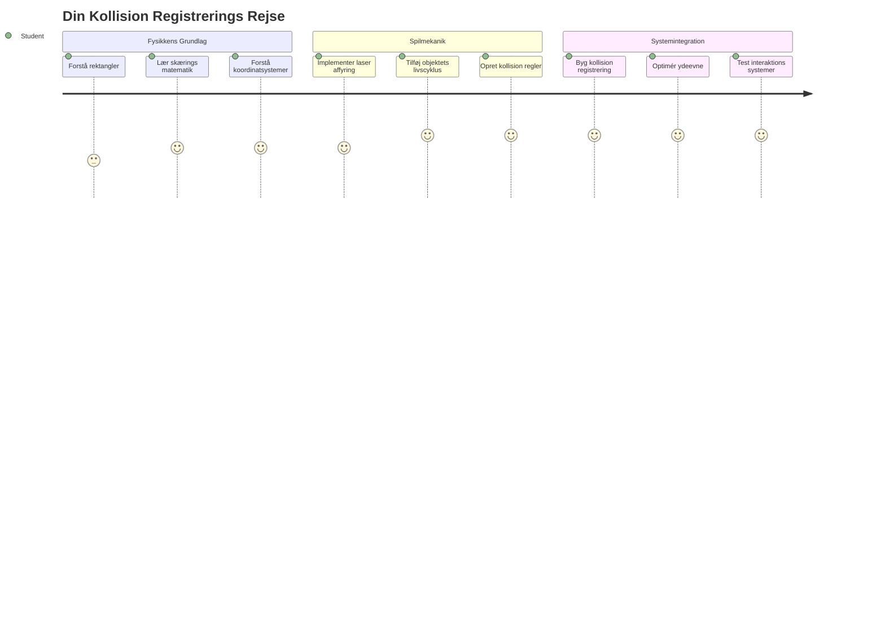
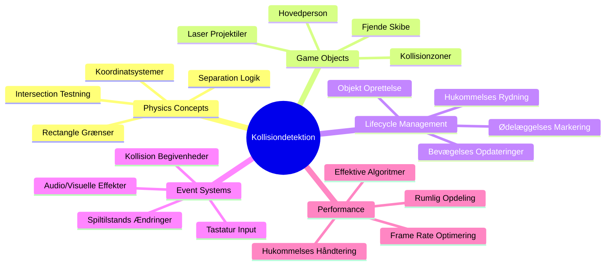
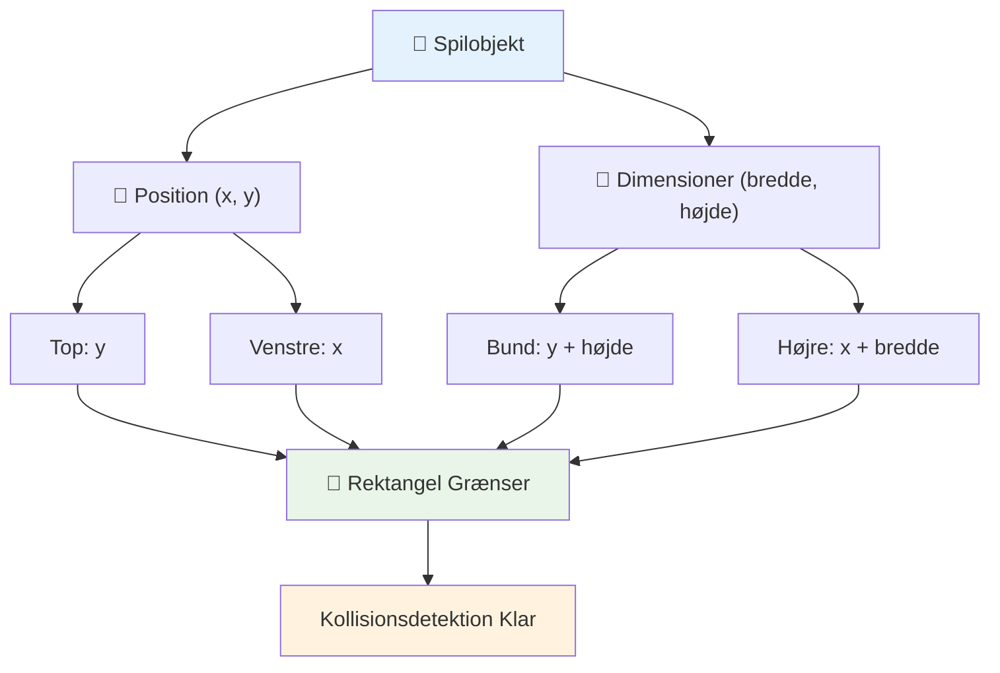
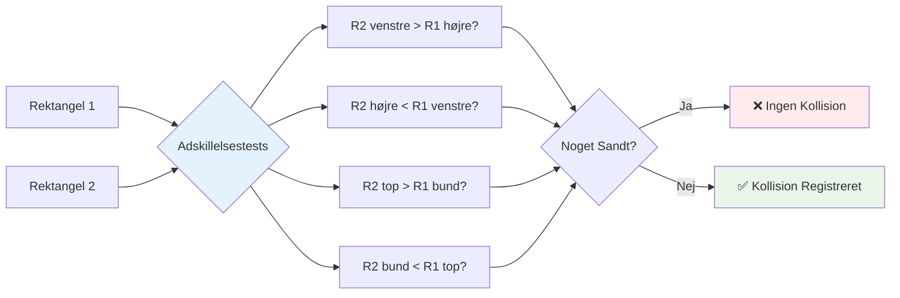
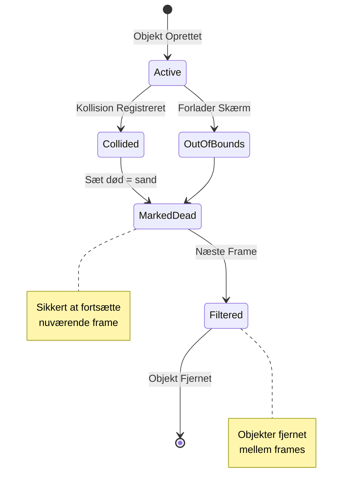
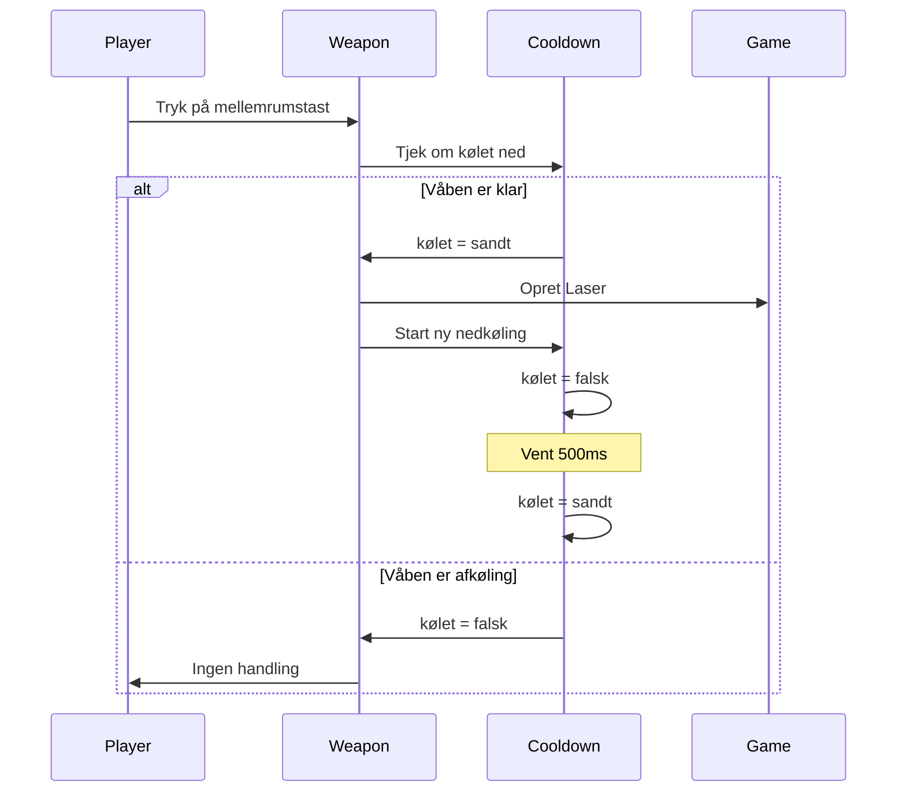
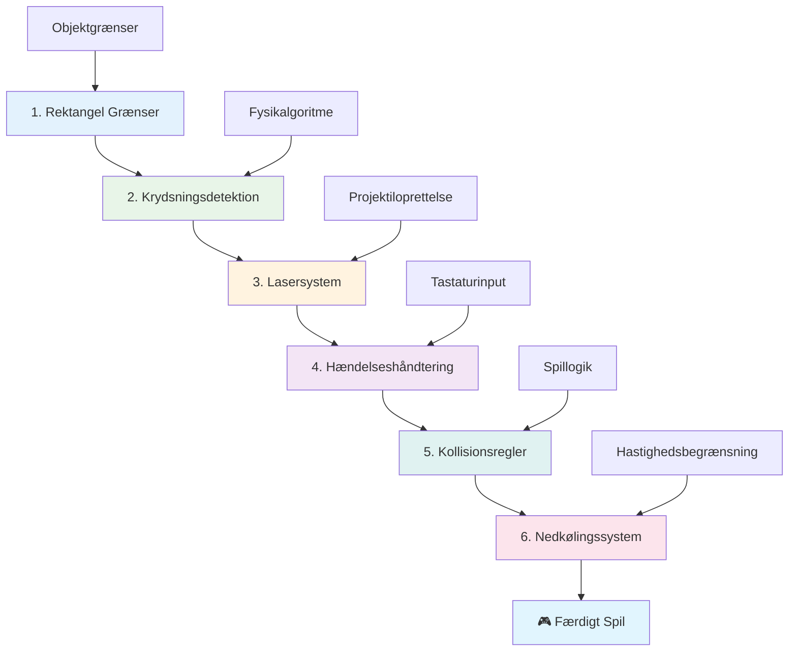
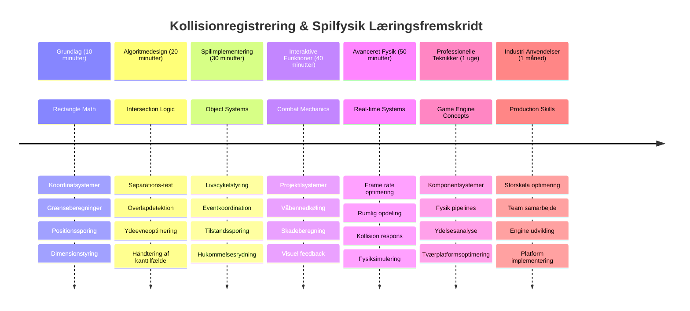

# Byg et rumspil Del 4: Tilføj en laser og opdag kollisioner


## For-forelæsning quiz

[For-forelæsnings quiz](https://ff-quizzes.netlify.app/web/quiz/35)

Tænk på øjeblikket i Star Wars, hvor Lukes protontorpedoer rammer Dødsstjernens udstødningsport. Den præcise kollisionsregistrering ændrede galaksens skæbne! I spil fungerer kollisionsregistrering på samme måde – den bestemmer, hvornår objekter interagerer, og hvad der sker næste gang.

I denne lektion tilføjer du laser-våben til dit rumspil og implementerer kollisionsregistrering. Ligesom NASAs missionplanlæggere beregner rumfartøjsbaner for at undgå rumskrot, lærer du at opdage, hvornår spilobjekter krydser hinandens veje. Vi opdeler det i håndterbare trin, der bygger ovenpå hinanden.

Ved lektionens afslutning har du et fungerende kampsystem, hvor lasere ødelægger fjender, og kollisioner udløser spilbegivenheder. De samme kollisionsprincipper anvendes i alt fra fysik-simuleringer til interaktive webløsninger.


✅ Lav en lille undersøgelse om det allerførste computerspil nogensinde skrevet. Hvad var dets funktionalitet?

## Kollisionsregistrering

Kollisionsregistrering virker som nærhedssensorerne på Apollo-månemodulet – det tjekker konstant afstande og udløser alarmer, når objekter kommer for tæt på hinanden. I spil afgør dette system, hvornår objekter interagerer, og hvad der skal ske næste gang.

Den tilgang, vi bruger, behandler hvert spilobjekt som et rektangel, på samme måde som flyveledelsessystemer bruger forenklede geometriske former til at spore fly. Denne rektangelmetode kan virke basal, men den er beregningseffektiv og fungerer godt i de fleste spilsituationer.

### Rektangelrepræsentation

Hvert spilobjekt har brug for koordinatgrænser, ligesom Mars Pathfinder-roveren kortlagde sin position på Mars’ overflade. Sådan definerer vi disse grænsekoordinater:


```javascript
rectFromGameObject() {
  return {
    top: this.y,
    left: this.x,
    bottom: this.y + this.height,
    right: this.x + this.width
  }
}
```

**Lad os bryde det ned:**
- **Topkant**: Det er bare, hvor dit objekt starter lodret (dets y-position)
- **Venstrekant**: Hvor det starter vandret (dets x-position)
- **Bundkant**: Læg højden til y-positionen – nu ved du, hvor det slutter!
- **Højrekant**: Læg bredden til x-positionen – og så har du hele grænsen

### Krydsningsalgoritme

Registrering af rektangelkrydsning bruger logik, der ligner den måde Hubble-rygteleskopet afgør, om himmellegemer overlapper i sit synsfelt. Algoritmen tjekker for adskillelse:


```javascript
function intersectRect(r1, r2) {
  return !(r2.left > r1.right ||
    r2.right < r1.left ||
    r2.top > r1.bottom ||
    r2.bottom < r1.top);
}
```

**Adskillelsestesten fungerer som radarsystemer:**
- Er rektangel 2 helt til højre for rektangel 1?
- Er rektangel 2 helt til venstre for rektangel 1?
- Er rektangel 2 helt under rektangel 1?
- Er rektangel 2 helt over rektangel 1?

Hvis ingen af disse betingelser er sande, må rektanglerne overlappe. Denne tilgang spejler, hvordan radaroperatører vurderer, om to fly er på sikre afstande.

## Håndtering af objektlivscyklusser

Når en laser rammer en fjende, skal begge objekter fjernes fra spillet. Dog kan sletning midt i en løkke forårsage nedbrud – en hårdt lært lektie fra tidlige computersystemer som Apollo Guidance Computer. I stedet bruger vi en "mærk til sletning"-metode, der sikkert fjerner objekter mellem frames.


Sådan markerer vi noget til fjernelse:

```javascript
// Marker objekt til fjernelse
enemy.dead = true;
```

**Hvorfor denne metode virker:**
- Vi markerer objektet som "dødt", men sletter det ikke med det samme
- Det lader den aktuelle spilframe afslutte sikkert
- Ingen nedbrud fra at forsøge at bruge noget, der allerede er væk!

Herefter filtreres markerede objekter væk før næste gengivelsescyklus:

```javascript
gameObjects = gameObjects.filter(go => !go.dead);
```

**Hvad denne filtrering gør:**
- Opretter en frisk liste med kun de "levende" objekter
- Kasserer alt, der er markeret som dødt
- Holder spillet kørende glat
- Forhindrer hukommelsesopsamling af ødelagte objekter

## Implementering af lasermekanik

Laserprojektiler i spil fungerer efter samme princip som fotontorpedoer i Star Trek – de er diskrete objekter, der bevæger sig i lige linjer, indtil de rammer noget. Hver tryk på mellemrumstasten skaber et nyt laserobjekt, der bevæger sig hen over skærmen.

For at få det til at fungere, skal vi koordinere flere forskellige dele:

**Vigtige komponenter at implementere:**
- **Skabe** laserobjekter, der spawner ud fra heltenes position
- **Håndtere** tastaturinput for at udløse laseroprettelse
- **Styres** laserbevægelser og livscyklus
- **Implementere** visuel repræsentation for laserprojektilerne

## Implementering af affyringshastighedskontrol

Ubegrænsede affyringshastigheder vil overbelaste spilmotoren og gøre spillet for let. Ægte våbensystemer har lignende begrænsninger – selv USS Enterprises phasere skulle oplades mellem skud.

Vi implementerer et cooldown-system, der forhindrer hurtig affyring, mens det bevarer responsive kontroller:


```javascript
class Cooldown {
  constructor(time) {
    this.cool = false;
    setTimeout(() => {
      this.cool = true;
    }, time);
  }
}

class Weapon {
  constructor() {
    this.cooldown = null;
  }
  
  fire() {
    if (!this.cooldown || this.cooldown.cool) {
      // Opret laserprojektil
      this.cooldown = new Cooldown(500);
    } else {
      // Våbenet er stadig ved at køle ned
    }
  }
}
```

**Sådan virker cooldown:**
- Når det bliver skabt, starter våbnet "varmt" (kan ikke affyre endnu)
- Efter timeout-perioden bliver det "køligt" (klar til at affyre)
- Før affyring tjekker vi: "Er våbnet køligt?"
- Det forhindrer spam-affyring og holder samtidig kontrollerne responsive

✅ Se lektion 1 i rumspilsserien for at genopfriske cooldowns.

## Opbygning af kollisionssystemet

Du skal udvide din eksisterende rumspilskode med et kollisionsdetekteringssystem. Ligesom Den Internationale Rumstations automatiske undgåelsessystem vil dit spil konstant overvåge objektpositioner og reagere på krydsninger.

Fra din tidligere lektionskode tilføjes kollisionsregistrering med specifikke regler, der styrer objektinteraktioner.

> 💡 **Pro Tip**: Lasersprite er allerede inkluderet i dine assets-mapper og refereret i din kode, klar til implementering.

### Kollisionsregler at implementere

**Spilmæssige mekanikker at tilføje:**
1. **Laser rammer fjende**: Fjendeobjektet ødelægges ved ramme af laserprojektilet
2. **Laser rammer skærmgrænse**: Laser fjernes, når den når skærmens topkant
3. **Fjende og helt kollision**: Begge objekter ødelægges ved krydsning
4. **Fjende når bunden**: Game over, når fjender når skærmens bund

### 🔄 **Pædagogisk Tjek-ind**
**Grundlag for Kollisionsregistrering**: Sørg for, at du forstår:
- ✅ Hvordan rektangelgrænser definerer kollisionszoner
- ✅ Hvorfor separationstest er mere effektiv end krydsningsberegning
- ✅ Vigtigheden af håndtering af objektlivscyklusser i spilloops
- ✅ Hvordan begivenhedsdrevne systemer koordinerer kollisionssvar

**Hurtig Selvevaluering**: Hvad ville ske, hvis du slettede objekter med det samme i stedet for at markere dem?
*Svar: Midt-loop sletning kunne forårsage nedbrud eller springe objekter over under iteration*

**Forståelse af fysik**: Nu mestrer du:
- **Koordinatsystemer**: Hvordan position og dimensioner skaber grænser
- **Krydsningslogik**: Matematiske principper bag kollisionsregistrering
- **Ydeevneoptimering**: Hvorfor effektive algoritmer betyder noget i realtidssystemer
- **Hukommelsesstyring**: Sikker håndtering af objektlivscyklusser for stabilitet

## Opsætning af dit udviklingsmiljø

Gode nyheder – vi har allerede sat det meste af fundamentet op for dig! Alle dine spilassets og grundlæggende struktur ligger klar i undermappen `your-work`, klar til at du kan tilføje fede kollisionsfunktioner.

### Projektstruktur

```bash
-| assets
  -| enemyShip.png
  -| player.png
  -| laserRed.png
-| index.html
-| app.js
-| package.json
```

**Forståelse af filstrukturen:**
- **Indeholder** alle spritebilleder, der skal bruges til spilobjekter
- **Inkluderer** hoved-HTML-dokument og JavaScript-applikationsfil
- **Leverer** package-konfiguration til lokal udviklingsserver

### Start den lokale server

Naviger til din projektmappe og start den lokale server:

```bash
cd your-work
npm start
```

**Denne kommando-sekvens:**
- **Skifter** til din arbejdsprojektmappe
- **Starter** en lokal HTTP-server på `http://localhost:5000`
- **Serverer** dine spilkoder til test og udvikling
- **Muliggør** liveudvikling med automatisk genindlæsning

Åbn din browser og naviger til `http://localhost:5000` for at se din nuværende spilstatus med helten og fjenderne vist på skærmen.

### Trin-for-trin implementering

Som den systematiske metode NASA brugte til at programmere Voyager-rumfartøjet, implementerer vi kollisionsdetektering metodisk, trin for trin.


#### 1. Tilføj rektangel-kollisionsgrænser

Først lærer vi vores spilobjekter, hvordan de beskriver deres grænser. Tilføj denne metode til din `GameObject`-klasse:

```javascript
rectFromGameObject() {
    return {
      top: this.y,
      left: this.x,
      bottom: this.y + this.height,
      right: this.x + this.width,
    };
  }
```

**Denne metode gør:**
- **Opretter** et rektangelobjekt med præcise grænsekoordinater
- **Beregner** bund- og højrekant med position plus dimensioner
- **Returnerer** et objekt klar til kollisionsdetekteringsalgoritmer
- **Giver** et standardiseret interface til alle spilobjekter

#### 2. Implementer krydsningsdetektion

Lad os nu skabe vores kollisionsdetektiv – en funktion, der kan afgøre, hvornår to rektangler overlapper:

```javascript
function intersectRect(r1, r2) {
  return !(
    r2.left > r1.right ||
    r2.right < r1.left ||
    r2.top > r1.bottom ||
    r2.bottom < r1.top
  );
}
```

**Algoritmen arbejder ved:**
- **Tester** fire adskillelsesbetingelser mellem rektangler
- **Returnerer** `false`, hvis nogen adskillelsesbetingelse er sand
- **Indikerer** kollision, når ingen adskillelse findes
- **Bruger** negationslogik for effektiv krydsningstest

#### 3. Implementer lasers affyringssystem

Her bliver det spændende! Lad os sætte lasers affyringssystem op.

##### Meddelelseskonstanter

Først definerer vi nogle beskedtyper, så forskellige dele af spillet kan kommunikere:

```javascript
KEY_EVENT_SPACE: "KEY_EVENT_SPACE",
COLLISION_ENEMY_LASER: "COLLISION_ENEMY_LASER",
COLLISION_ENEMY_HERO: "COLLISION_ENEMY_HERO",
```

**Disse konstanter giver:**
- **Standardisering** af hændelsesnavne i hele applikationen
- **Muliggør** ensartet kommunikation mellem spilsystemer
- **Forebygger** tastefejl i hændelsesregistrering

##### Tastaturinput håndtering

Tilføj rumtast-registrering til dit nøglehændelseslyttere:

```javascript
} else if(evt.keyCode === 32) {
  eventEmitter.emit(Messages.KEY_EVENT_SPACE);
}
```

**Denne inputhandler:**
- **Registrerer** rumtasttryk med keyCode 32
- **Sender** en standardiseret begivenhedsbesked
- **Muliggør** løs kobling af affyringslogik

##### Event listener-opsætning

Registrer affyringsadfærd i din `initGame()`-funktion:

```javascript
eventEmitter.on(Messages.KEY_EVENT_SPACE, () => {
 if (hero.canFire()) {
   hero.fire();
 }
});
```

**Denne eventlistener:**
- **Reagerer** på rumtast-begivenheder
- **Tjekker** affyrings-cooldown-status
- **Udløser** laseroprettelse, når det er tilladt

Tilføj kollisionshåndtering for laser-fjende interaktioner:

```javascript
eventEmitter.on(Messages.COLLISION_ENEMY_LASER, (_, { first, second }) => {
  first.dead = true;
  second.dead = true;
});
```

**Denne kollisionshåndtering:**
- **Modtager** kollisionsdata med begge objekter
- **Markerer** begge objekter til fjernelse
- **Sikrer** korrekt oprydning efter kollision

#### 4. Opret Laser-klassen

Implementer et laserprojektile, der bevæger sig opad og styrer sin egen livscyklus:

```javascript
class Laser extends GameObject {
  constructor(x, y) {
    super(x, y);
    this.width = 9;
    this.height = 33;
    this.type = 'Laser';
    this.img = laserImg;
    
    let id = setInterval(() => {
      if (this.y > 0) {
        this.y -= 15;
      } else {
        this.dead = true;
        clearInterval(id);
      }
    }, 100);
  }
}
```

**Denne klasseimplementering:**
- **Arver** fra GameObject for grundlæggende funktionalitet
- **Sætter** passende dimensioner til lasersprite
- **Opretter** automatisk opadgående bevægelse med `setInterval()`
- **Håndterer** selvdestruktion ved skærmens top
- **Styrer** sin egen animationstid og oprydning

#### 5. Implementer kollisionsdetekteringssystem

Opret en komplet kollisionsdetekteringsfunktion:

```javascript
function updateGameObjects() {
  const enemies = gameObjects.filter(go => go.type === 'Enemy');
  const lasers = gameObjects.filter(go => go.type === "Laser");
  
  // Test laser-fjende kollisioner
  lasers.forEach((laser) => {
    enemies.forEach((enemy) => {
      if (intersectRect(laser.rectFromGameObject(), enemy.rectFromGameObject())) {
        eventEmitter.emit(Messages.COLLISION_ENEMY_LASER, {
          first: laser,
          second: enemy,
        });
      }
    });
  });

  // Fjern ødelagte objekter
  gameObjects = gameObjects.filter(go => !go.dead);
}
```

**Dette kollisionssystem:**
- **Filtrerer** spilobjekter efter type for effektiv test
- **Tester** hver laser mod hver fjende for krydsninger
- **Sender** kollisionsbegivenheder ved registrerede sammenstød
- **Rydder** op i ødelagte objekter efter kollisionsprocessering

> ⚠️ **Vigtigt**: Tilføj `updateGameObjects()` til din hovedspil-løkke i `window.onload` for at aktivere kollisionsregistrering.

#### 6. Tilføj cooldown-system til Hero-klassen

Udvid Hero-klassen med affyringsmekanik og hastighedsbegrænsning:

```javascript
class Hero extends GameObject {
  constructor(x, y) {
    super(x, y);
    this.width = 99;
    this.height = 75;
    this.type = "Hero";
    this.speed = { x: 0, y: 0 };
    this.cooldown = 0;
  }
  
  fire() {
    gameObjects.push(new Laser(this.x + 45, this.y - 10));
    this.cooldown = 500;

    let id = setInterval(() => {
      if (this.cooldown > 0) {
        this.cooldown -= 100;
      } else {
        clearInterval(id);
      }
    }, 200);
  }
  
  canFire() {
    return this.cooldown === 0;
  }
}
```

**Forståelse af den forbedrede Hero-klasse:**
- **Initialiserer** cooldown-timer til nul (klar til affyring)
- **Skaber** laserobjekter placeret over helteskibet
- **Sætter** cooldown-periode for at forhindre hurtig affyring
- **Reducerer** cooldown-timer med interval-baserede opdateringer
- **Tilbyder** affyringsstatuskontrol via `canFire()` metode

### 🔄 **Pædagogisk Tjek-ind**
**Komplet Systemforståelse**: Bekræft din mestring af kollisionssystemet:
- ✅ Hvordan gør rektangelgrænser effektiv kollisionsregistrering mulig?
- ✅ Hvorfor er håndtering af objektlivscyklusser kritisk for spilstabilitet?
- ✅ Hvordan forhindrer cooldown-systemet performanceproblemer?
- ✅ Hvilken rolle spiller begivenhedsdrevet arkitektur i kollisionshåndtering?

**Systemintegration**: Din kollisionsregistrering demonstrerer:
- **Matematisk præcision**: Rektangel-krydsningsalgoritmer
- **Ydeevneoptimering**: Effektive kollisionstestmønstre
- **Hukommelsesstyring**: Sikker objektoprettelse og -nedbrydning
- **Eventkoordination**: Løst koblet systemkommunikation
- **Realtidsbehandling**: Frame-baserede opdateringscyklusser

**Professionelle mønstre**: Du har implementeret:
- **Separation af bekymringer**: Fysik, gengivelse og input adskilt
- **Objektorienteret design**: Arv og polymorfi
- **State management**: Objektlivscyklus og spiltilstandssporing
- **Ydeevneoptimering**: Effektive algoritmer til realtimebrug

### Test af din implementering

Dit rumspil har nu komplet kollisionsregistrering og kampelementer. 🚀 Test de nye muligheder:
- **Navigér** med piletasterne for at bekræfte bevægelseskontrol
- **Affyr lasere** med mellemrumstasten – bemærk hvordan cooldown forhindrer spam
- **Observer kollisioner**, når lasere rammer fjender og udløser fjernelse
- **Bekræft oprydning**, når ødelagte objekter forsvinder fra spillet

Du har med succes implementeret et kollisionsdetekteringssystem, der bruger samme matematiske principper som styrer rumfartøjsnavigation og robotik.

### ⚡ **Det kan du gøre på de næste 5 minutter**
- [ ] Åbn browserens DevTools og sæt breakpoint i din kollisionsdetektionsfunktion
- [ ] Prøv at ændre lasers hastighed eller fjendens bevægelse for at se kollisionseffekter
- [ ] Eksperimentér med forskellige cooldown-værdier for at teste affyringshastigheder
- [ ] Tilføj `console.log` udsagn for at spore kollisionsevents i realtid

### 🎯 **Hvad du kan opnå denne time**
- [ ] Gennemfør quizzen efter lektionen og forstå kollisiondetektionsalgoritmer
- [ ] Tilføj visuelle effekter som eksplosioner når kollisioner opstår
- [ ] Implementer forskellige typer projektiler med varierende egenskaber
- [ ] Skab power-ups der midlertidigt forbedrer spillerens evner
- [ ] Tilføj lydeffekter for at gøre kollisioner mere tilfredsstillende

### 📅 **Din uge-lange fysikprogrammering**
- [ ] Færdiggør det fulde rumspil med polerede kollisionssystemer
- [ ] Implementer avancerede kollisionsformer ud over rektangler (cirkler, polygoner)
- [ ] Tilføj partikeleffekter for realistiske eksplosioner
- [ ] Skab kompleks fjendeadfærd med kollisionsundgåelse
- [ ] Optimer kollisionsdetektion for bedre ydeevne med mange objekter
- [ ] Tilføj fysiksimulering såsom momentum og realistisk bevægelse

### 🌟 **Din månedslange mestring af spils fysik**
- [ ] Byg spil med avancerede fysikmotorer og realistiske simuleringer
- [ ] Lær 3D kollisionsdetektion og rumlig opdeling algoritmer
- [ ] Bidrag til open source fysikbiblioteker og spilmotorer
- [ ] Mestre performanceoptimering til grafikintensive applikationer
- [ ] Skab undervisningsindhold om spils fysik og kollisionsdetektion
- [ ] Byg en portefølje der viser avancerede fysikprogrammeringsfærdigheder

## 🎯 Din tidslinje for mestring af kollisionsdetektion


### 🛠️ Dit spilfysikværktøjssæt resumé

Efter at have gennemført denne lektion, har du nu mestret:
- **Kollisionsmatematik**: Rektangelintersektionsalgoritmer og koordinatsystemer
- **Performanceoptimering**: Effektiv kollisionsdetektion til realtidsapplikationer
- **Objektlivscyklusstyring**: Sikker oprettelse, opdatering og destruktion
- **Event-drevet arkitektur**: Afkoblede systemer til kollisionsrespons
- **Spil-loop integration**: Opdateringer af fysik pr. frame og render-koordinering
- **Inputsystemer**: Reagerende kontroller med ratebegrænsning og feedback
- **Hukommelsesstyring**: Effektiv objektpooling og oprydningsstrategier

**Anvendelser i virkeligheden**: Dine kollisionsdetektionsfærdigheder bruges direkte til:
- **Interaktive simuleringer**: Videnskabelig modellering og undervisningsværktøjer
- **Brugerfladedesign**: Drag-and-drop interaktioner og touch-detektion
- **Datavisualisering**: Interaktive diagrammer og klikbare elementer
- **Mobiludvikling**: Touchgestusgenkendelse og kollisionshåndtering
- **Robotprogrammering**: Ruteplanlægning og forhindringsundgåelse
- **Computergrafik**: Ray tracing og rumlige algoritmer

**Professionelle færdigheder opnået**: Nu kan du:
- **Designe** effektive algoritmer til realtids kollisionsdetektion
- **Implementere** fysiksystemer der skalerer med objektkompleksitet
- **Debugge** komplekse interaktionssystemer ved hjælp af matematiske principper
- **Optimere** ydeevnen for forskellige hardware- og browsermuligheder
- **Arkitektere** vedligeholdelige spilsystemer med gennemprøvede designmønstre

**Konceptmæssige spils udviklingsfærdigheder mestret**:
- **Fysiksimulering**: Realtids kollisionsdetektion og respons
- **Performance engineering**: Optimerede algoritmer til interaktive applikationer
- **Event-systemer**: Afkoblede kommunikationssystemer mellem spilkomponenter
- **Objekthåndtering**: Effektive livscyklusmønstre til dynamisk indhold
- **Inputhåndtering**: Reagerende kontroller med passende feedback

**Næste niveau**: Du er klar til at udforske avancerede fysikmotorer som Matter.js, implementere 3D kollisionsdetektion eller bygge komplekse partikelsystemer!

🌟 **Opnåelse låst op**: Du har bygget et komplet fysikbaseret interaktionssystem med professionel kollisionsdetektion!

## GitHub Copilot Agent Challenge 🚀

Brug Agent-tilstanden til at løse denne udfordring:

**Beskrivelse:** Forbedr kollisionsdetektionssystemet ved at implementere power-ups der spawner tilfældigt og giver midlertidige evner, når de samles op af helteskibet.

**Prompt:** Lav en PowerUp-klasse der udvider GameObject og implementer kollisionsdetektion mellem helten og power-ups. Tilføj mindst to typer power-ups: en som øger ildhastigheden (reducerer cooldown) og en anden som skaber et midlertidigt skjold. Inkluder spawn-logik der skaber power-ups på tilfældige intervaller og positioner.

---


## 🚀 Udfordring

Tilføj en eksplosion! Tag et kig på spillets assets i [the Space Art repo](../../../../6-space-game/solution/spaceArt/readme.txt) og prøv at tilføje en eksplosion når laseren rammer en alien

## Quiz efter forelæsning

[Post-lecture quiz](https://ff-quizzes.netlify.app/web/quiz/36)

## Gennemgang & Selvstudie

Eksperimenter med intervallerne i dit spil indtil nu. Hvad sker der, når du ændrer dem? Læs mere om [JavaScript timing events](https://www.freecodecamp.org/news/javascript-timing-events-settimeout-and-setinterval/).

## Opgave

[Udforsk kollisioner](assignment.md)

---

<!-- CO-OP TRANSLATOR DISCLAIMER START -->
**Ansvarsfraskrivelse**:
Dette dokument er blevet oversat ved hjælp af AI-oversættelsestjenesten [Co-op Translator](https://github.com/Azure/co-op-translator). Selvom vi bestræber os på nøjagtighed, bedes du være opmærksom på, at automatiserede oversættelser kan indeholde fejl eller unøjagtigheder. Det oprindelige dokument på originalsproget bør betragtes som den autoritative kilde. For kritisk information anbefales professionel menneskelig oversættelse. Vi påtager os intet ansvar for misforståelser eller fejltolkninger, der opstår som følge af brugen af denne oversættelse.
<!-- CO-OP TRANSLATOR DISCLAIMER END -->