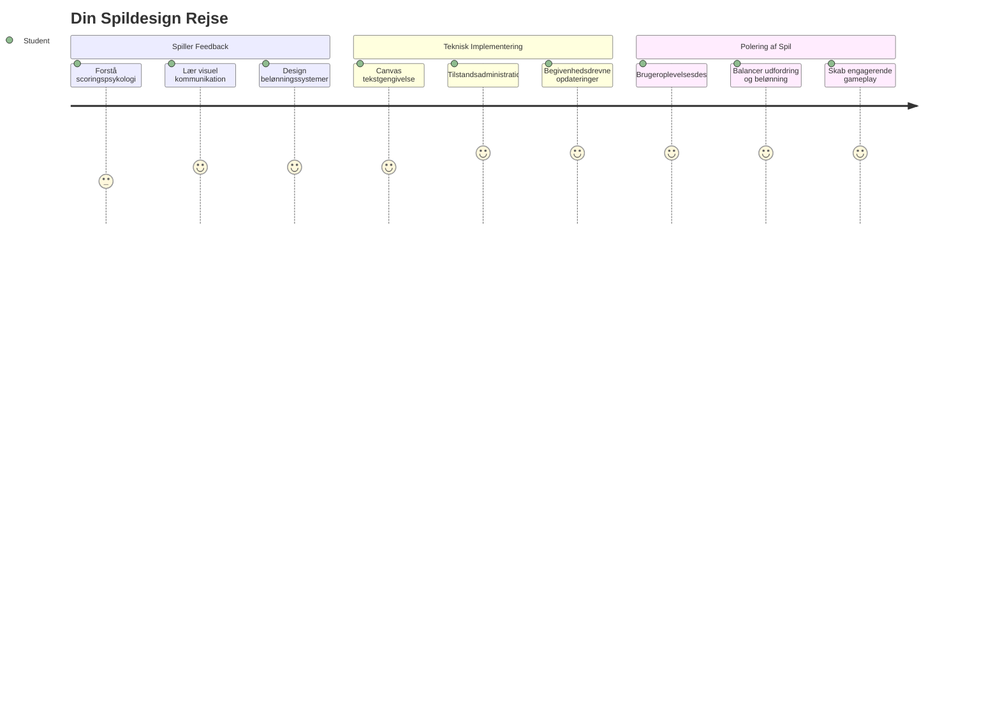
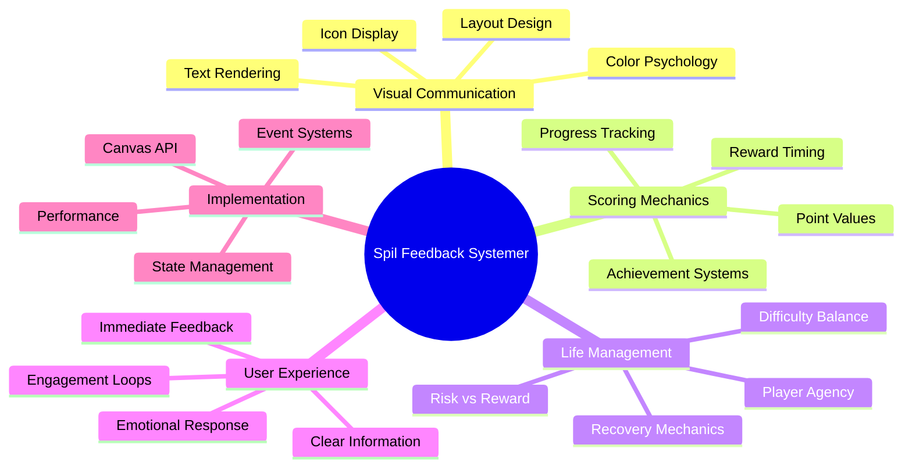
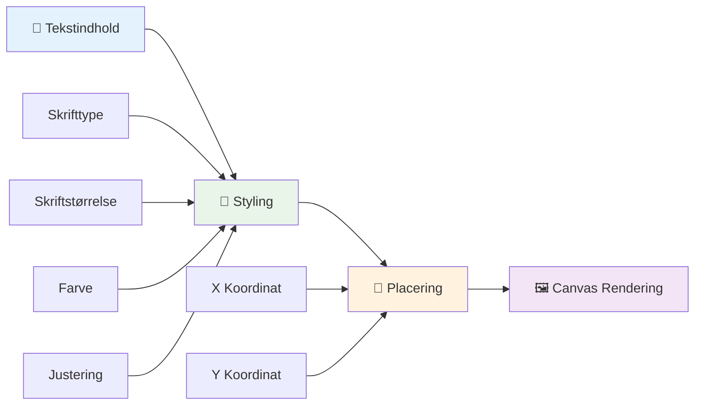
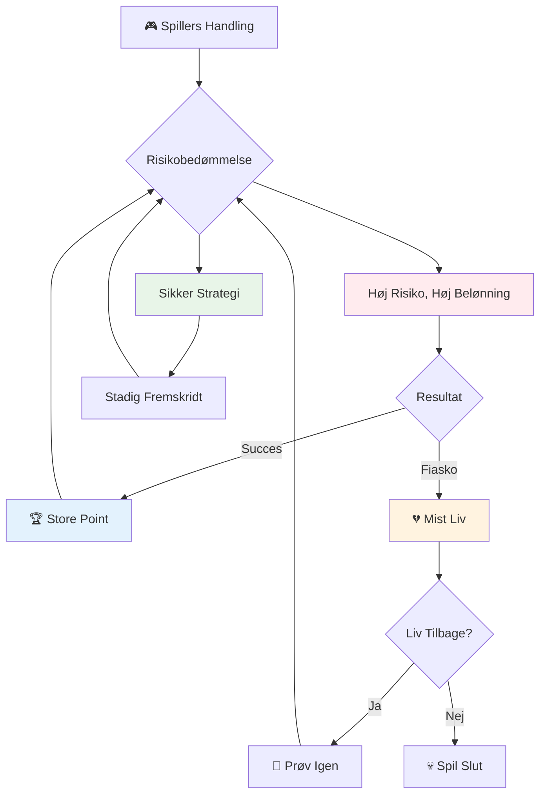
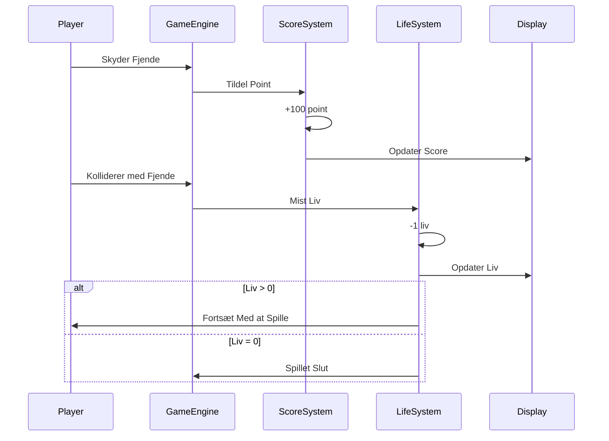
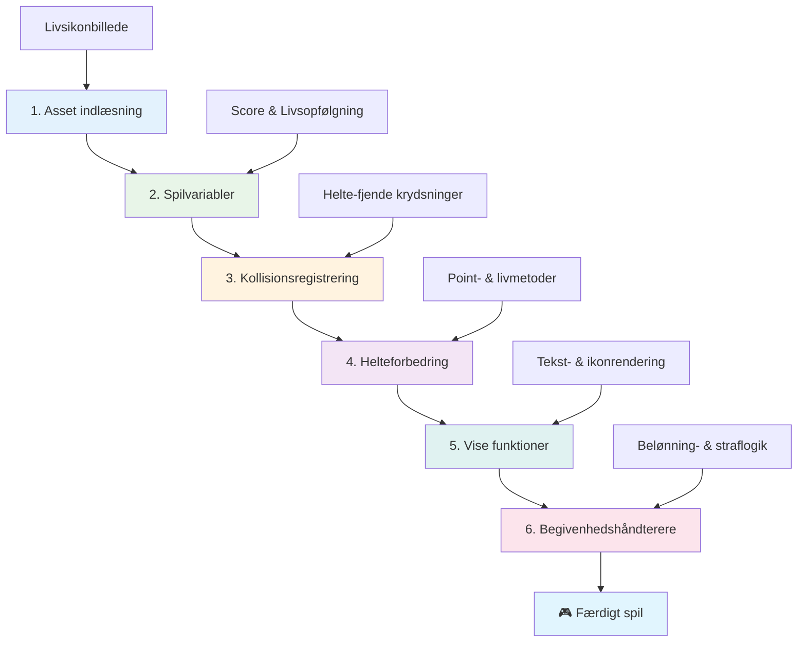
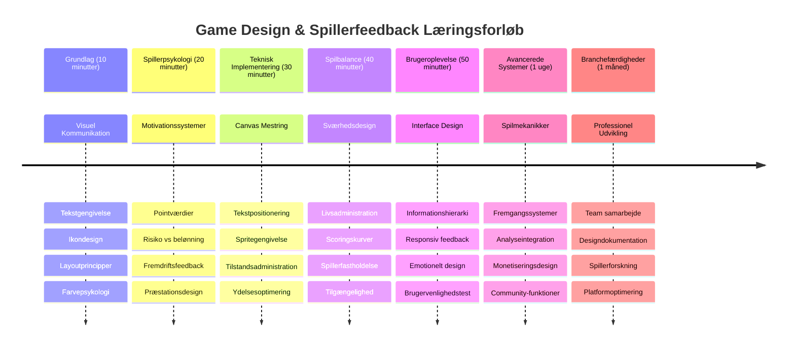

<!--
CO_OP_TRANSLATOR_METADATA:
{
  "original_hash": "2ed9145a16cf576faa2a973dff84d099",
  "translation_date": "2026-01-06T23:40:18+00:00",
  "source_file": "6-space-game/5-keeping-score/README.md",
  "language_code": "da"
}
-->
# Byg et rumspil Del 5: Point og liv


## Før-forelæsning quiz

[Før-forelæsning quiz](https://ff-quizzes.netlify.app/web/quiz/37)

Klar til at få dit rumspil til at føles som et rigtigt spil? Lad os tilføje pointsystem og livsstyring - de kerne-mekanikker, der forvandlede tidlige arkadespil som Space Invaders fra simple demonstrationer til vanedannende underholdning. Her bliver dit spil virkelig spilbart.


## Tegn tekst på skærmen - dit spils stemme

For at vise din score skal vi lære at tegne tekst på canvas. Metoden `fillText()` er dit primære værktøj til dette - det samme teknik som blev brugt i klassiske arkadespil til at vise scores og statusinformation.


Du har fuld kontrol over tekstens udseende:

```javascript
ctx.font = "30px Arial";
ctx.fillStyle = "red";
ctx.textAlign = "right";
ctx.fillText("show this on the screen", 0, 0);
```

✅ Dyk dybere ned i [at tilføje tekst til et canvas](https://developer.mozilla.org/docs/Web/API/Canvas_API/Tutorial/Drawing_text) - du vil måske blive overrasket over, hvor kreativ du kan være med fonte og styling!

## Liv - Mere end bare et tal

I spildesign repræsenterer et "liv" spillerens margin for fejl. Dette koncept går tilbage til flippermaskiner, hvor du fik flere bolde at spille med. I tidlige videospil som Asteroids gav liv spillerne tilladelse til at tage risici og lære af fejl.


Visuel repræsentation betyder meget - at vise skibsikoner i stedet for bare "Liv: 3" skaber øjeblikkelig visuel genkendelse, ligesom tidlige arkadeskabe brugte ikonografi for at kommunikere på tværs af sprogbarrierer.

## Byg dit spils belønningssystem

Nu implementerer vi de kerne feedbacksystemer, som holder spillere engagerede:


- **Pointsystem**: Hver ødelagt fjendtlige skib giver 100 point (runde tal er lettere for spillere at regne mentalt). Scoren vises i nederste venstre hjørne.
- **Livstæller**: Din helt starter med tre liv - en standard etableret af tidlige arkadespil for at balancere udfordring med spilbarhed. Hver kollision med en fjende koster et liv. Vi viser resterende liv nederst til højre med skibsikoner .

## Lad os komme i gang!

Først skal du sætte dit arbejdsområde op. Naviger til filerne i din `your-work` undermappe. Du skulle gerne se disse filer:

```bash
-| assets
  -| enemyShip.png
  -| player.png
  -| laserRed.png
-| index.html
-| app.js
-| package.json
```

For at teste dit spil skal du starte udviklingsserveren fra `your_work` mappen:

```bash
cd your-work
npm start
```

Dette kører en lokal server på `http://localhost:5000`. Åbn denne adresse i din browser for at se dit spil. Test kontrollerne med piletasterne og prøv at skyde fjender for at sikre, at alt virker.


### Tid til at kode!

1. **Hent de visuelle ressourcer du skal bruge**. Kopiér `life.png` ressourcen fra `solution/assets/` mappen ind i din `your-work` mappe. Tilføj derefter lifeImg til din window.onload funktion:

    ```javascript
    lifeImg = await loadTexture("assets/life.png");
    ```

1. Glem ikke at tilføje `lifeImg` til din ressourceliste:

    ```javascript
    let heroImg,
    ...
    lifeImg,
    ...
    eventEmitter = new EventEmitter();
    ```
  
2. **Opsæt dine spilvariabler**. Tilføj noget kode for at holde styr på din samlede score (starter på 0) og resterende liv (starter på 3). Vi viser disse på skærmen, så spillere altid ved, hvor de står.

3. **Implementer kollisionsdetektion**. Udvid din `updateGameObjects()` funktion til at registrere, når fjender kolliderer med din helt:

    ```javascript
    enemies.forEach(enemy => {
        const heroRect = hero.rectFromGameObject();
        if (intersectRect(heroRect, enemy.rectFromGameObject())) {
          eventEmitter.emit(Messages.COLLISION_ENEMY_HERO, { enemy });
        }
      })
    ```

4. **Tilføj livs- og pointregistrering til din helt**. 
   1. **Initialiser tællerne**. Under `this.cooldown = 0` i din `Hero` klasse, sæt liv og point op:

        ```javascript
        this.life = 3;
        this.points = 0;
        ```

   1. **Vis disse værdier til spilleren**. Opret funktioner til at tegne disse værdier på skærmen:

        ```javascript
        function drawLife() {
          // TODO, 35, 27
          const START_POS = canvas.width - 180;
          for(let i=0; i < hero.life; i++ ) {
            ctx.drawImage(
              lifeImg, 
              START_POS + (45 * (i+1) ), 
              canvas.height - 37);
          }
        }
        
        function drawPoints() {
          ctx.font = "30px Arial";
          ctx.fillStyle = "red";
          ctx.textAlign = "left";
          drawText("Points: " + hero.points, 10, canvas.height-20);
        }
        
        function drawText(message, x, y) {
          ctx.fillText(message, x, y);
        }

        ```

   1. **Kobl det hele sammen i din spilloop**. Tilføj disse funktioner til din window.onload funktion lige efter `updateGameObjects()`:

        ```javascript
        drawPoints();
        drawLife();
        ```

### 🔄 **Pædagogisk check-in**
**Forståelse af spildesign**: Før du implementerer konsekvenser, skal du sikre dig, at du forstår:
- ✅ Hvordan visuel feedback kommunikerer spillets tilstand til spillere
- ✅ Hvorfor konsekvent placering af UI-elementer forbedrer brugervenligheden
- ✅ Psykologien bag pointværdier og livsstyring
- ✅ Hvordan text rendering på canvas adskiller sig fra HTML tekst

**Hurtig selvtest**: Hvorfor bruger arkadespil typisk runde tal til pointværdier?
*Svar: Runde tal er lettere for spillere at regne mentalt og skaber tilfredsstillende psykologiske belønninger*

**Principper for brugeroplevelse**: Du anvender nu:
- **Visuel hierarki**: Vigtig information placeret fremtrædende
- **Umiddelbar feedback**: Opdatering i realtid på spillerhandlinger
- **Kognitiv belastning**: Enkel og klar informationspræsentation
- **Emotionelt design**: Ikoner og farver, der skaber spillerforbindelse

1. **Implementer spilkonsekvenser og belønninger**. Nu tilføjer vi feedbacksystemerne, der gør spillerhandlinger meningsfulde:

   1. **Kollisioner koster liv**. Hver gang din helt kolliderer med en fjende, mister du et liv.
   
      Tilføj denne metode til din `Hero` klasse:

        ```javascript
        decrementLife() {
          this.life--;
          if (this.life === 0) {
            this.dead = true;
          }
        }
        ```

   2. **At skyde fjender giver point**. Hvert vellykket skud giver 100 point og giver øjeblikkelig positiv feedback for præcis skydning.

      Udvid din Hero-klasse med denne increment metode:
    
        ```javascript
          incrementPoints() {
            this.points += 100;
          }
        ```

        Kobl nu disse funktioner til dine kollisionshændelser:

        ```javascript
        eventEmitter.on(Messages.COLLISION_ENEMY_LASER, (_, { first, second }) => {
           first.dead = true;
           second.dead = true;
           hero.incrementPoints();
        })

        eventEmitter.on(Messages.COLLISION_ENEMY_HERO, (_, { enemy }) => {
           enemy.dead = true;
           hero.decrementLife();
        });
        ```

✅ Nysgerrig efter andre spil bygget med JavaScript og Canvas? Gå på opdagelse - du vil måske blive overrasket over, hvad der er muligt!

Efter at have implementeret disse funktioner, test dit spil for at se det komplette feedbacksystem i aktion. Du bør se livsikoner nederst til højre, din score nederst til venstre, og se hvordan kollisioner reducerer liv, mens vellykkede skud øger din score.

Dit spil har nu de essentielle mekanikker, der gjorde tidlige arkadespil så fængslende - klare mål, øjeblikkelig feedback og meningsfulde konsekvenser for spillerhandlinger.

### 🔄 **Pædagogisk check-in**
**Komplet spildesign system**: Bekræft din mestring af spiller-feedbacksystemer:
- ✅ Hvordan skaber pointsystemer motivation og engagement hos spillere?
- ✅ Hvorfor er visuel konsistens vigtig for brugergrænsefladedesign?
- ✅ Hvordan balancerer livssystemet udfordring med fastholdelse af spillere?
- ✅ Hvilken rolle spiller øjeblikkelig feedback i at skabe tilfredsstillende gameplay?

**Systemintegration**: Dit feedbacksystem demonstrerer:
- **Brugeroplevelsesdesign**: Klar visuel kommunikation og informationshierarki
- **Event-driven arkitektur**: Responsiv opdatering på spillerhandlinger
- **State management**: Sporing og visning af dynamiske spildata
- **Canvas mestring**: Tekstrendering og spriteplacering
- **Spilpsykologi**: Forståelse af spiller-motivation og engagement

**Professionelle mønstre**: Du har implementeret:
- **MVC arkitektur**: Adskillelse af spil-logik, data og præsentation
- **Observer-pattern**: Event-drevne opdateringer af spiltilstande
- **Komponentdesign**: Genanvendelige funktioner til rendering og logik
- **Performanceoptimering**: Effektiv rendering i spilloops

### ⚡ **Hvad du kan nå på 5 minutter**
- [ ] Eksperimenter med forskellige fontstørrelser og farver til scorevisning
- [ ] Prøv at ændre pointværdier og se hvordan det påvirker spiloplevelsen
- [ ] Tilføj console.log udsagn for at spore, hvornår point og liv ændres
- [ ] Test kanttilfælde som at løbe tør for liv eller opnå høje scores

### 🎯 **Hvad du kan nå i denne time**
- [ ] Færdiggør quizzen efter lektionen og forstå spilpsykologi
- [ ] Tilføj lydeffekter for point og tab af liv
- [ ] Implementer et highscore system med localStorage
- [ ] Opret forskellige pointværdier for forskellige fjendetyper
- [ ] Tilføj visuelle effekter som f.eks. skærmrystelse ved tab af liv

### 📅 **Din uge-lange spildesign rejse**
- [ ] Fuldfør det komplette rumspil med polerede feedbacksystemer
- [ ] Implementer avancerede pointsystemer som combo-multiplikatorer
- [ ] Tilføj achievements og låsbart indhold
- [ ] Skab sværhedsprogression og balanceringssystemer
- [ ] Design brugergrænseflader til menuer og game over-skærme
- [ ] Studer andre spil for at forstå engagementsmekanismer

### 🌟 **Din måneds-lange spiludviklingsmestring**
- [ ] Byg komplette spil med sofistikerede progression systemer
- [ ] Lær spil-analyse og måling af spilleradfærd
- [ ] Bidrag til open source spiludviklingsprojekter
- [ ] Mestring af avancerede spildesignmønstre og monetisering
- [ ] Skab undervisningsindhold om spildesign og brugeroplevelse
- [ ] Byg en portfolio, der viser spildesign og udviklingsevner

## 🎯 Din spildesign mestringstidslinje


### 🛠️ Dine spildesign værktøjer - resumé

Efter at have gennemført denne lektion mestrer du nu:
- **Spillerpsykologi**: Forståelse af motivation, risiko/belønning og engagementsløjfer
- **Visuel kommunikation**: Effektivt UI-design med tekst, ikoner og layout
- **Feedbacksystemer**: Respons i realtid på spillerhandlinger og spilevents
- **State management**: Effektiv sporing og visning af dynamiske spildata
- **Canvas tekstrendering**: Professionel tekstvisning med styling og placering
- **Eventsintegration**: Kobling af brugerhandlinger med meningsfulde spilkonsekvenser
- **Spilbalance**: Design af sværhedskurver og spillerprogression

**Anvendelser i praksis**: Dine spildesignfærdigheder gælder direkte til:
- **Brugergrænsefladedesign**: Skabelse af engagerende og intuitive interfaces
- **Produktudvikling**: Forståelse af brugermotivation og feedbacksløjfer
- **Undervisningsteknologi**: Gamification og læringsengagementssystemer
- **Datavisualisering**: Gøre kompleks information tilgængelig og engagerende
- **Mobil app-udvikling**: Fastholdelsesmekanik og brugeroplevelsesdesign
- **Marketingteknologi**: Forståelse af brugeradfærd og konverteringsoptimering

**Professionelle færdigheder erhvervet**: Du kan nu:
- **Designe** brugeroplevelser, der motiverer og engagerer brugere
- **Implementere** feedbacksystemer, der effektivt styrer brugeradfærd
- **Balancere** udfordring og tilgængelighed i interaktive systemer
- **Skabe** visuel kommunikation, der virker på tværs af brugergrupper
- **Analysere** brugeradfærd og iterere på designforbedringer

**Spiludviklingsbegreber mestre**:
- **Spillermotivation**: Forstå, hvad der driver engagement og fastholdelse
- **Visuelt design**: Skabe klare, attraktive og funktionelle interfaces
- **Systemintegration**: Forbinde flere spilsystemer til en sammenhængende oplevelse
- **Performanceoptimering**: Effektiv rendering og state management
- **Tilgængelighed**: Design til forskellige færdighedsniveauer og spillerbehov

**Næste niveau**: Du er klar til at udforske avancerede spildesignmønstre, implementere analyssystemer eller studere spilmonetisering og spillerfastholdelsesstrategier!

🌟 **Præstation Opnået**: Du har bygget et komplet spiller-feedbacksystem med professionelle spildesignprincipper!

---

## GitHub Copilot Agent-udfordring 🚀

Brug Agent-tilstand til at løse følgende udfordring:

**Beskrivelse:** Forbedr rumspillets pointsystem ved at implementere et highscore-system med persistent lagring og bonuspointmekanikker.

**Prompt:** Opret et highscore-system, der gemmer spillerens bedste score i localStorage. Tilføj bonuspoint for på hinanden følgende fjendtdrab (combo-system) og implementer forskellige pointværdier for forskellige fjendetyper. Inkluder en visuel indikator, når spilleren opnår en ny highscore, og vis den aktuelle highscore på spilkærmen.


## 🚀 Udfordring

Du har nu et funktionelt spil med point og liv. Overvej hvilke ekstra funktioner der kunne forbedre spilleroplevelsen.

## Efter-forelæsning quiz

[Efter-forelæsning quiz](https://ff-quizzes.netlify.app/web/quiz/38)

## Gennemgang & Selvstudie

Vil du udforske mere? Undersøg forskellige tilgange til pointsystemer og livssystemer i spil. Der findes fascinerende spilengines som [PlayFab](https://playfab.com), der håndterer scoring, leaderboards og spillerprogression. Hvordan kunne integration af noget sådan løfte dit spil til næste niveau?

## Opgave

[Byg et pointsystem spil](assignment.md)

---

<!-- CO-OP TRANSLATOR DISCLAIMER START -->
**Ansvarsfraskrivelse**:  
Dette dokument er blevet oversat ved hjælp af AI-oversættelsestjenesten [Co-op Translator](https://github.com/Azure/co-op-translator). Selvom vi bestræber os på nøjagtighed, bedes du være opmærksom på, at automatiserede oversættelser kan indeholde fejl eller unøjagtigheder. Det oprindelige dokument på dets oprindelige sprog bør betragtes som den autoritative kilde. For kritisk information anbefales professionel menneskelig oversættelse. Vi påtager os intet ansvar for eventuelle misforståelser eller fejltolkninger, der opstår som følge af brugen af denne oversættelse.
<!-- CO-OP TRANSLATOR DISCLAIMER END -->