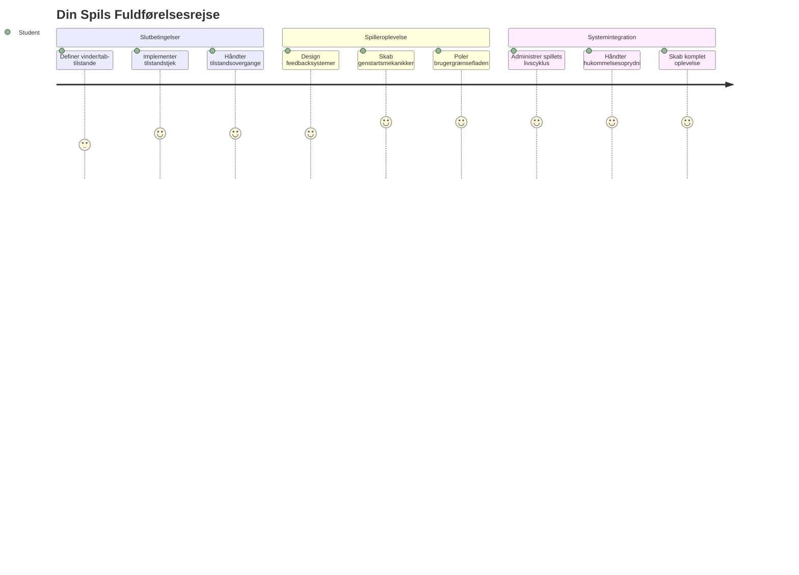
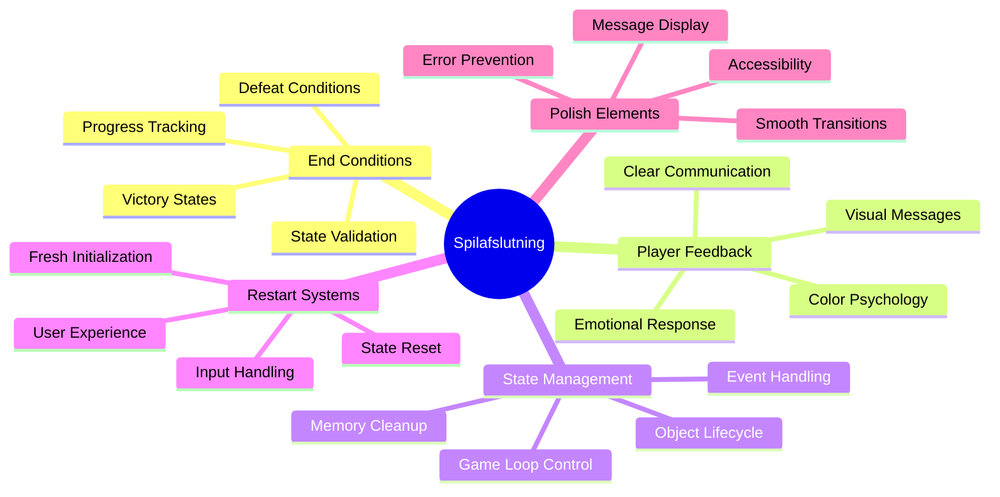
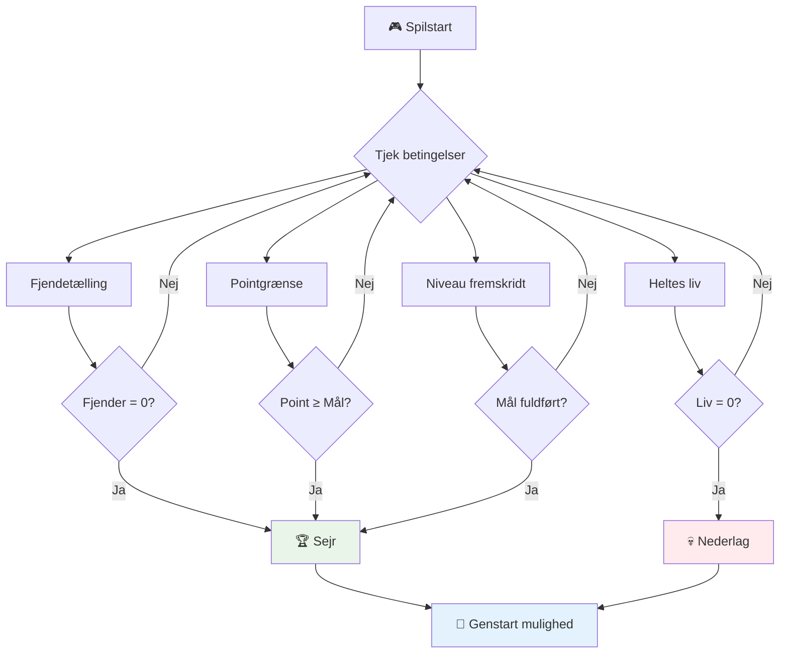
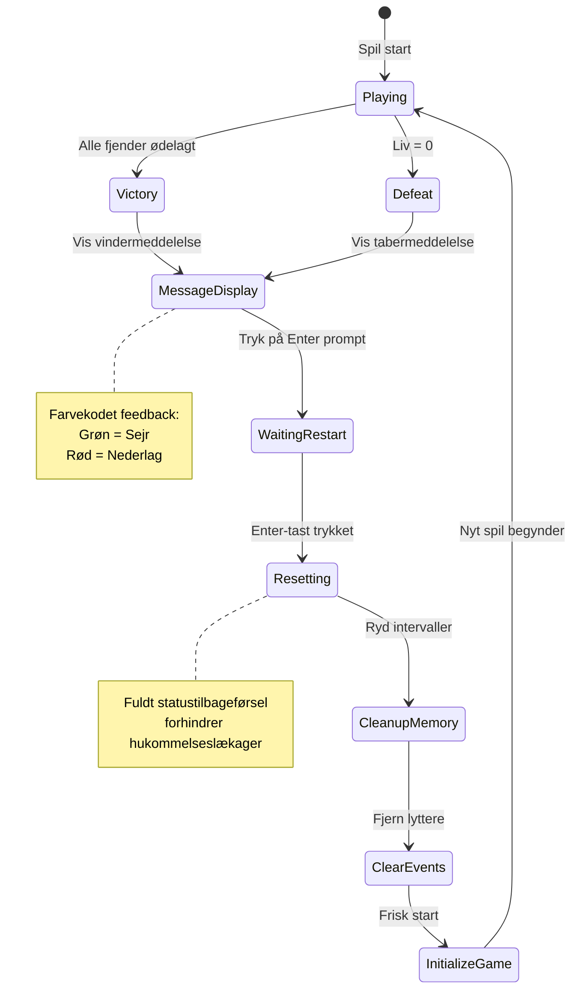
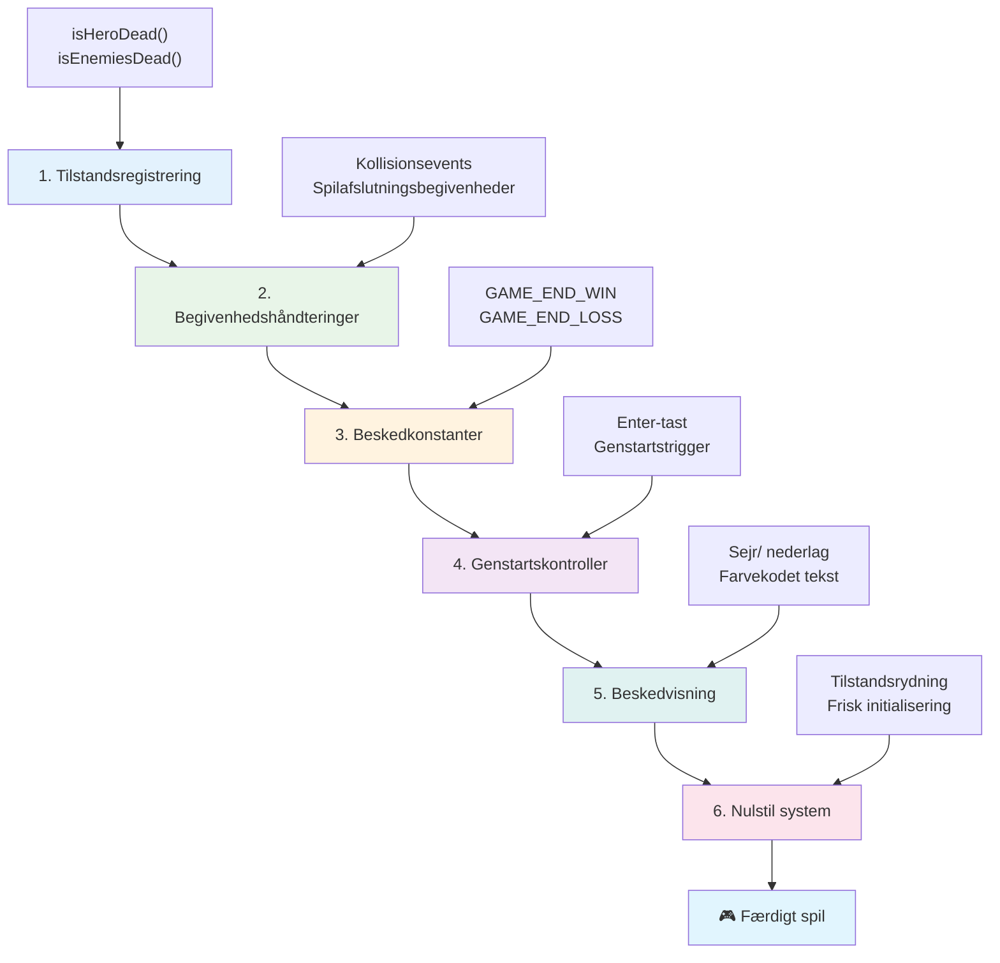
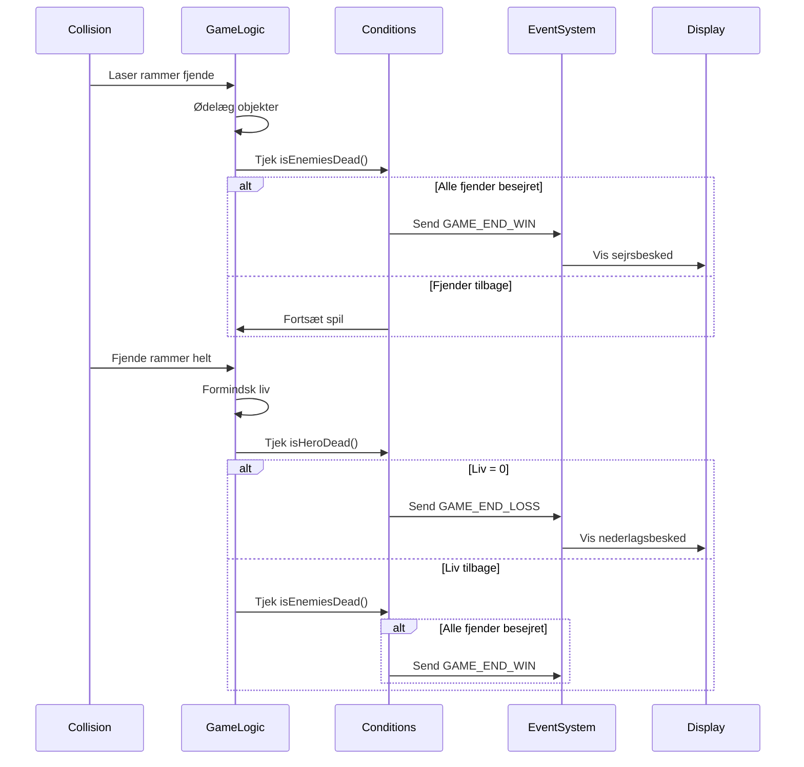
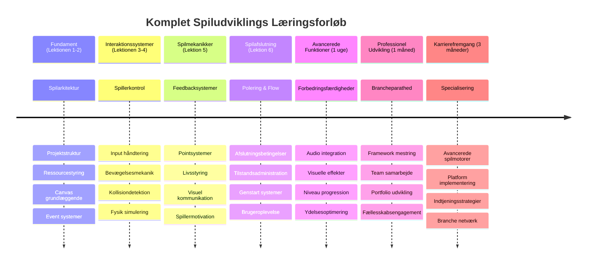

# Byg et rumspil del 6: Afslutning og genstart


Ethvert fantastisk spil har brug for klare slutbetingelser og en glidende genstartsmekanisme. Du har bygget et imponerende rumspil med bevægelse, kamp og scoring – nu er det tid til at tilføje de sidste elementer, der får det til at føles komplet.

Dit spil kører i øjeblikket uendeligt, ligesom Voyager-sonderne, som NASA sendte afsted i 1977 – stadig på rejse gennem rummet årtier senere. Mens det er fint til rumforskning, har spil brug for definerede slutpunkter for at skabe tilfredsstillende oplevelser.

I dag implementerer vi korrekte sejr/ nederlagsbetingelser og et genstartssystem. Ved afslutningen af denne lektion vil du have et poleret spil, som spillere kan gennemføre og spille igen, ligesom de klassiske arkadespil, der definerede mediet.


## Quiz inden forelæsningen

[Quiz inden forelæsningen](https://ff-quizzes.netlify.app/web/quiz/39)

## Forståelse af spillets slutbetingelser

Hvornår skal dit spil slutte? Dette grundlæggende spørgsmål har præget spildesign siden den tidlige arkade-æra. Pac-Man slutter, når du bliver fanget af spøgelser eller rydder alle prikker, mens Space Invaders slutter, når rumvæsnerne når bunden, eller du ødelægger dem alle.

Som spillets skaber definerer du sejrs- og nederlagsbetingelserne. For vores rumspil er her gennemprøvede tilgange, der skaber engagerende gameplay:


- **`N` fjendtlige skibe er blevet ødelagt**: Det er ganske almindeligt, hvis du opdeler et spil i forskellige niveauer, at du skal ødelægge `N` fjendtlige skibe for at gennemføre et niveau
- **Dit skib er blevet ødelagt**: Der findes uden tvivl spil, hvor du taber spillet, hvis dit skib ødelægges. En anden almindelig tilgang er, at du har et liv-system. Hver gang dit skib ødelægges, mister du et liv. Når alle liv er væk, taber du spillet.
- **Du har samlet `N` point**: En anden almindelig slutbetingelse er, at du samler point. Hvordan du får point, er op til dig, men det er ret almindeligt at tildele point for forskellige aktiviteter som at ødelægge et fjendtlige skib eller måske samle genstande, som *falder* når de ødelægges.
- **Gennemfør et niveau**: Dette kan involvere flere betingelser såsom `X` fjendtlige skibe ødelagt, `Y` point samlet, eller måske at en specifik genstand er blevet samlet.

## Implementering af spilgenstart-funktionalitet

Gode spil opfordrer til genafspilning gennem glidende genstartsmekanismer. Når spillere gennemfører et spil (eller møder nederlag), vil de ofte prøve igen med det samme — enten for at slå deres score eller forbedre deres præstation.


Tetris eksemplificerer dette perfekt: når dine blokke når toppen, kan du straks starte et nyt spil uden at navigere gennem komplekse menuer. Vi vil bygge et lignende genstartssystem, der renser spillets tilstand og får spillerne hurtigt tilbage i aktion.

✅ **Refleksion**: Tænk på de spil, du har spillet. Under hvilke betingelser slutter de, og hvordan bliver du opfordret til at genstarte? Hvad gør en genstartoplevelse glidende versus frustrerende?

## Hvad du vil bygge

Du vil implementere de sidste funktioner, der forvandler dit projekt til en komplet spiloplevelse. Disse elementer adskiller polerede spil fra grundlæggende prototyper.

**Her er, hvad vi tilføjer i dag:**

1. **Sejrsbetingelse**: Nedkæmp alle fjender og få en ordentlig fejring (det har du fortjent!)
2. **Nederlagsbetingelse**: Løb tør for liv og stå ansigt til ansigt med nederlaget på en nederlagsskærm
3. **Genstartsmekanisme**: Tryk på Enter for at hoppe direkte tilbage – for ét spil er aldrig nok
4. **Tilstandsstyring**: Ren tavle hver gang – ingen resterende fjender eller mærkelige fejl fra sidste spil

## Kom i gang

Lad os forberede dit udviklingsmiljø. Du bør have alle dine rumspilsfiler fra de tidligere lektioner klar.

**Dit projekt skulle gerne se nogenlunde sådan ud:**

```bash
-| assets
  -| enemyShip.png
  -| player.png
  -| laserRed.png
  -| life.png
-| index.html
-| app.js
-| package.json
```

**Start din udviklingsserver:**

```bash
cd your-work
npm start
```

**Denne kommando:**
- Kører en lokal server på `http://localhost:5000`
- Server dine filer korrekt
- Opdaterer automatisk, når du laver ændringer

Åbn `http://localhost:5000` i din browser og bekræft, at dit spil kører. Du bør kunne bevæge dig, skyde og interagere med fjender. Når det er bekræftet, kan vi fortsætte med implementeringen.

> 💡 **Pro tip**: For at undgå advarsler i Visual Studio Code, deklarér `gameLoopId` øverst i din fil som `let gameLoopId;` i stedet for at deklarere den inde i `window.onload`-funktionen. Dette følger moderne JavaScript bedste praksis for variabeldeklaration.


## Implementeringstrin

### Trin 1: Opret funktioner til overvågning af slutbetingelser

Vi har brug for funktioner, der overvåger, hvornår spillet skal slutte. Ligesom sensorer på den Internationale Rumstation, der konstant overvåger kritiske systemer, vil disse funktioner hele tiden tjekke spillets tilstand.

```javascript
function isHeroDead() {
  return hero.life <= 0;
}

function isEnemiesDead() {
  const enemies = gameObjects.filter((go) => go.type === "Enemy" && !go.dead);
  return enemies.length === 0;
}
```

**Her sker der følgende under motorhjelmen:**
- **Tjekker** om vores helt er løbet tør for liv (av!)
- **Tæller** hvor mange fjender der stadig lever og kæmper
- **Returnerer** `true`, når slagmarken er fri for fjender
- **Bruger** simpel sand/falsk logik for at holde det enkelt
- **Filtrerer** gennem alle spils objekter for at finde overlevende

### Trin 2: Opdater event handlers for slutbetingelser

Nu forbinder vi disse betingelsestjek til spillets eventsystem. Hver gang en kollision opstår, vurderer spillet, om det udløser en slutbetingelse. Dette skaber øjeblikkelig feedback på kritiske begivenheder.


```javascript
eventEmitter.on(Messages.COLLISION_ENEMY_LASER, (_, { first, second }) => {
    first.dead = true;
    second.dead = true;
    hero.incrementPoints();

    if (isEnemiesDead()) {
      eventEmitter.emit(Messages.GAME_END_WIN);
    }
});

eventEmitter.on(Messages.COLLISION_ENEMY_HERO, (_, { enemy }) => {
    enemy.dead = true;
    hero.decrementLife();
    if (isHeroDead())  {
      eventEmitter.emit(Messages.GAME_END_LOSS);
      return; // tab før sejr
    }
    if (isEnemiesDead()) {
      eventEmitter.emit(Messages.GAME_END_WIN);
    }
});

eventEmitter.on(Messages.GAME_END_WIN, () => {
    endGame(true);
});
  
eventEmitter.on(Messages.GAME_END_LOSS, () => {
  endGame(false);
});
```

**Her sker der:**
- **Laser rammer fjende**: Begge forsvinder, du får point, og vi tjekker om du har vundet
- **Fjende rammer dig**: Du mister et liv, og vi tjekker om du stadig er i live
- **Smart rækkefølge**: Vi tjekker nederlag først (ingen vil vinde og tabe samtidigt!)
- **Øjeblikkelig reaktion**: Så snart noget vigtigt sker, ved spillet det

### Trin 3: Tilføj nye besked-konstanter

Du skal tilføje nye besked-typer til dit `Messages`-konstants objekt. Disse konstanter hjælper med at bevare konsistens og forhindre stavefejl i dit eventsystem.

```javascript
GAME_END_LOSS: "GAME_END_LOSS",
GAME_END_WIN: "GAME_END_WIN",
```

**I ovenstående har vi:**
- **Tilføjet** konstanter til spillets slut-events for at bevare konsistens
- **Brugt** beskrivende navne, der tydeligt angiver eventets formål
- **Følger** den eksisterende navngivningskonvention for besked-typer

### Trin 4: Implementer genstartskontroller

Nu tilføjer du tastaturkontroller, der gør det muligt for spillere at genstarte spillet. Enter-tasten er et naturligt valg, da den ofte forbindes med at bekræfte handlinger og starte nye spil.

**Tilføj Enter-tast registrering til din eksisterende keydown-event listener:**

```javascript
else if(evt.key === "Enter") {
   eventEmitter.emit(Messages.KEY_EVENT_ENTER);
}
```

**Tilføj den nye besked-konstant:**

```javascript
KEY_EVENT_ENTER: "KEY_EVENT_ENTER",
```

**Det, du skal vide:**
- **Udvider** dit eksisterende tastaturhåndteringssystem
- **Bruger** Enter-tasten som genstartsudløser for intuitiv brugeroplevelse
- **Udsender** en brugerdefineret event, som andre dele af dit spil kan lytte på
- **Bevarer** samme mønster som dine øvrige tastaturkontroller

### Trin 5: Opret beskedsystemet til visning

Dit spil skal kommunikere resultater tydeligt til spillerne. Vi laver et beskedsystem, der viser sejrs- og nederlags-tilstande med farvekodet tekst, ligesom terminalinterfacer fra tidlige computersystemer, hvor grøn indikerede succes og rød tegnede fejl.

**Lav funktionen `displayMessage()`:**

```javascript
function displayMessage(message, color = "red") {
  ctx.font = "30px Arial";
  ctx.fillStyle = color;
  ctx.textAlign = "center";
  ctx.fillText(message, canvas.width / 2, canvas.height / 2);
}
```

**Trin for trin sker der:**
- **Sætter** skrifttype og størrelse for klar, læsbar tekst
- **Anvender** en farveparameter med "rød" som standard til advarsler
- **Centrerer** teksten horisontalt og vertikalt på canvas
- **Bruger** moderne JavaScript standardparametre for fleksible farvevalg
- **Udnytter** canvas’ 2D-kontekst til direkte tekstrendering

**Lav funktionen `endGame()`:**

```javascript
function endGame(win) {
  clearInterval(gameLoopId);

  // Sæt en forsinkelse for at sikre, at eventuelle ventende gengivelser fuldføres
  setTimeout(() => {
    ctx.clearRect(0, 0, canvas.width, canvas.height);
    ctx.fillStyle = "black";
    ctx.fillRect(0, 0, canvas.width, canvas.height);
    if (win) {
      displayMessage(
        "Victory!!! Pew Pew... - Press [Enter] to start a new game Captain Pew Pew",
        "green"
      );
    } else {
      displayMessage(
        "You died !!! Press [Enter] to start a new game Captain Pew Pew"
      );
    }
  }, 200)  
}
```

**Dette gør funktionen:**
- **Fryser** alt på plads – ingen flere bevægelige skibe eller lasere
- **Holder** en kort pause (200ms) for at lade sidste frame færdigtegne
- **Tømmer** skærmen og maler den sort for dramatisk effekt
- **Viser** forskellige beskeder for vindere og tabere
- **Farvekoder** nyhederne – grøn for godt, rød for… ikke så godt
- **Fortæller** spillerne præcis, hvordan de hopper tilbage ind

### 🔄 **Pædagogisk status**
**Spil-tilstandshåndtering**: Før du implementerer reset-funktionalitet, skal du sikre dig at du forstår:
- ✅ Hvordan slutbetingelser skaber klare gameplay-mål
- ✅ Hvorfor visuel feedback er essentiel for spillerforståelse
- ✅ Vigtigheden af korrekt oprydning for at undgå hukommelseslækager
- ✅ Hvordan event-drevet arkitektur muliggør rene tilstandsovergange

**Hurtig selvevaluering**: Hvad ville der ske, hvis du ikke fjernede event listeners under reset?
*Svar: Hukommelseslækager og duplikerede event handlers, der giver uforudsigelig opførsel*

**Spildesign-principper**: Du implementerer nu:
- **Klare mål**: Spillere ved præcist, hvad der definerer succes og fiasko
- **Øjeblikkelig feedback**: Spiltilstandsændringer kommunikeres straks
- **Brugerkontrol**: Spillere kan genstarte, når de er klar
- **Systempålidelighed**: Korrekt oprydning forhindrer fejl og ydelsesproblemer

### Trin 6: Implementer spil reset-funktionalitet

Reset-systemet skal fuldstændigt rydde op i den nuværende spiltilstand og initialisere en frisk spilsession. Dette sikrer, at spillere får en ren start uden resterende data fra det tidligere spil.

**Lav funktionen `resetGame()`:**

```javascript
function resetGame() {
  if (gameLoopId) {
    clearInterval(gameLoopId);
    eventEmitter.clear();
    initGame();
    gameLoopId = setInterval(() => {
      ctx.clearRect(0, 0, canvas.width, canvas.height);
      ctx.fillStyle = "black";
      ctx.fillRect(0, 0, canvas.width, canvas.height);
      drawPoints();
      drawLife();
      updateGameObjects();
      drawGameObjects(ctx);
    }, 100);
  }
}
```

**Lad os forstå hver del:**
- **Tjekker** om en spil-loop kører, før der resettes
- **Rydder** den eksisterende spil-loop for at stoppe al nuværende spilaktivitet
- **Fjerner** alle event listeners for at forhindre hukommelseslækager
- **Geninitialiserer** spiltilstanden med friske objekter og variabler
- **Starter** en ny spil-loop med alle essentielle spilfunktioner
- **Bevarer** samme 100ms interval for konsistent spilpræstation

**Tilføj Enter-tast eventhandler til din `initGame()`-funktion:**

```javascript
eventEmitter.on(Messages.KEY_EVENT_ENTER, () => {
  resetGame();
});
```

**Tilføj `clear()`-metoden til din EventEmitter-klasse:**

```javascript
clear() {
  this.listeners = {};
}
```

**Vigtigste punkter at huske:**
- **Forbinder** Enter-tasttryk med reset-funktionaliteten
- **Registrerer** denne eventlistener under spilinitialiseringen
- **Giver** en klar måde at fjerne alle event listeners ved reset
- **Forebygger** hukommelseslækager ved at rydde event handlers mellem spil
- **Resetter** listeners-objektet til en tom tilstand for frisk initialisering

## Tillykke! 🎉

👽 💥 🚀 Du har med succes bygget et komplet spil fra bunden. Ligesom programmørerne, der skabte de første videospil i 1970'erne, har du forvandlet linjer af kode til en interaktiv oplevelse med korrekte spilmekanikker og brugerfeedback. 🚀 💥 👽

**Du har opnået:**
- **Implementeret** komplette sejr- og nederlagsbetingelser med brugerfeedback
- **Skabt** et sømløst genstartssystem til kontinuerligt gameplay
- **Designet** klar visuel kommunikation af spiltilstande
- **Håndteret** komplekse spil-tilstandsovergange og oprydning
- **Samlet** alle komponenter til et sammenhængende, spilbart spil

### 🔄 **Pædagogisk status**
**Komplet spils udviklingssystem**: Fejr din mestring af hele spiludviklingscyklussen:
- ✅ Hvordan skaber slutbetingelser tilfredsstillende spilleroplevelser?
- ✅ Hvorfor er korrekt tilstands-styring kritisk for spillets stabilitet?
- ✅ Hvordan forbedrer visuel feedback spillerforståelse?
- ✅ Hvilken rolle spiller genstartssystemet for spillerfastholdelse?

**System-mestri**: Dit komplette spil demonstrerer:
- **Full-stack spildesign**: Fra grafik til input til tilstandsadministration
- **Professionel arkitektur**: Event-drevne systemer med korrekt oprydning
- **Brugeroplevelsesdesign**: Klar feedback og intuitive kontroller
- **Ydelsesoptimering**: Effektiv rendering og hukommelsesstyring
- **Polish og fuldstændighed**: Alle detaljer, der gør et spil færdigt

**Klar til branchen færdigheder**: Du har implementeret:
- **Spilloop-arkitektur**: Realtidssystemer med konsistent ydelse
- **Event-drevet programmering**: Decoupled systemer, der skalerer effektivt
- **Tilstandsstyring**: Komplekse datahåndteringer og livscyklusstyring
- **Brugerfladedesign**: Klar kommunikation og responsive kontroller
- **Test og fejlfinding**: Iterativ udvikling og problemløsning

### ⚡ **Hvad du kan gøre de næste 5 minutter**
- [ ] Spil dit komplette spil og test alle sejr- og nederlagsbetingelser
- [ ] Eksperimentér med forskellige parametre for slutbetingelser
- [ ] Prøv at tilføje console.log-udtryk for at spore spiltilstandsændringer
- [ ] Del dit spil med venner og indsamle feedback

### 🎯 **Hvad du kan nå på en time**
- [ ] Gennemfør quizzen efter lektionen og reflektér over din spiludviklingsrejse
- [ ] Tilføj lydeffekter for sejrs- og nederlagstilstande
- [ ] Implementer yderligere slutbetingelser som tidsbegrænsninger eller bonusmål
- [ ] Lav forskellige sværhedsgrader med varierende fjendetal
- [ ] Forfin den visuelle præsentation med bedre skrifttyper og farver

### 📅 **Din ugelange mestring af spiludvikling**
- [ ] Færdiggør det forbedrede rumspil med flere niveauer og progression
- [ ] Tilføj avancerede funktioner som power-ups, forskellige fjendetyper og specielle våben
- [ ] Lav et highscore-system med vedvarende lagring
- [ ] Design brugergrænseflader til menuer, indstillinger og spiloptioner
- [ ] Optimer performance til forskellige enheder og browsere
- [ ] Udgiv dit spil online og del det med fællesskabet
### 🌟 **Din månedslange karriere inden for spiludvikling**
- [ ] Byg flere komplette spil og udforsk forskellige genrer og mekanikker
- [ ] Lær avancerede spiludviklings-rammer som Phaser eller Three.js
- [ ] Bidrag til open source spiludviklingsprojekter
- [ ] Studer spildesignprincipper og spillerpsykologi
- [ ] Skab en portfolio, der viser dine færdigheder inden for spiludvikling
- [ ] Forbind dig med spiludviklingsfællesskabet og fortsæt med at lære

## 🎯 Din komplette tidslinje for mestring af spiludvikling


### 🛠️ Din komplette opsummering af spiludviklingsværktøjer

Efter at have gennemført hele denne rumspilsserie, mestrer du nu:
- **Spilarkitektur**: Begivenhedsdrevne systemer, spilsløjfer og tilstandsstyring
- **Grafikprogrammering**: Canvas API, sprite-rendering og visuelle effekter
- **Inputsystemer**: Tastaturhåndtering, kollisiondetektion og responsive kontroller
- **Spildesign**: Spillerfeedback, fremskridtsystemer og engagerende mekanikker
- **Ydelsesoptimering**: Effektiv rendering, hukommelsesstyring og billedfrekvenskontrol
- **Brugeroplevelse**: Klar kommunikation, intuitive kontroller og detaljeret finish
- **Professionelle mønstre**: Ren kode, fejlfindingsteknikker og projektorganisation

**Anvendelser i den virkelige verden**: Dine spiludviklingsfærdigheder kan direkte bruges til:
- **Interaktive webapplikationer**: Dynamiske grænseflader og realtidssystemer
- **Datavisualisering**: Animerede diagrammer og interaktive grafik
- **Undervisningsteknologi**: Gamification og engagerende læringsoplevelser
- **Mobiludvikling**: Touch-baserede interaktioner og ydelsesoptimering
- **Simulationssoftware**: Fysikmotorer og realtidsmodellering
- **Kreative industrier**: Interaktiv kunst, underholdning og digitale oplevelser

**Opnåede professionelle færdigheder**: Du kan nu:
- **Designe arkitektur** for komplekse interaktive systemer fra bunden
- **Fejlsøge** realtidsapplikationer med systematiske metoder
- **Optimere** ydeevne for glidende brugeroplevelser
- **Designe** engagerende brugergrænseflader og interaktionsmønstre
- **Samarbejde** effektivt om tekniske projekter med korrekt kodeorganisation

**Mestring af spiludviklingskoncepter**:
- **Realtidssystemer**: Spilsløjfer, billedfrekvensstyring og ydeevne
- **Begivenhedsdrevet arkitektur**: Løse koblinger mellem systemer og beskedudveksling
- **Tilstandsstyring**: Kompleks datahåndtering og livscyklusstyring
- **Brugergrænsefladeprogrammering**: Canvas-grafik og responsivt design
- **Spildesignteori**: Spillerpsykologi og engagerende mekanikker

**Næste niveau**: Du er klar til at udforske avancerede spilrammer, 3D-grafik, multiplayer-systemer eller gå over til professionelle roller inden for spiludvikling!

🌟 **Præstation opnået**: Du har gennemført en fuld spiludviklingsrejse og bygget en interaktiv oplevelse i professionel kvalitet fra bunden!

**Velkommen til spiludviklingsfællesskabet!** 🎮✨

## GitHub Copilot Agent Challenge 🚀

Brug Agent-tilstand til at løse følgende udfordring:

**Beskrivelse:** Forbedr rumspillet ved at implementere et niveau-fremgangssystem med stigende sværhedsgrad og bonusfunktioner.

**Prompt:** Lav et flerniveaus rumspilssystem, hvor hvert niveau har flere fjendtlige skibe med øget hastighed og sundhed. Tilføj en scoringsmultiplikator, der stiger med hvert niveau, og implementer power-ups (som hurtig ild eller skjold), der tilfældigt dukker op, når fjender ødelægges. Inkluder en bonus ved fuldførelse af niveau og vis det aktuelle niveau på skærmen sammen med den eksisterende score og liv.

Læs mere om [agent mode](https://code.visualstudio.com/blogs/2025/02/24/introducing-copilot-agent-mode) her.

## 🚀 Valgfri forbedringsudfordring

**Tilføj lyd til dit spil**: Forbedr din spilleoplevelse ved at implementere lydeffekter! Overvej at tilføje lyd for:

- **Laser-skud** når spilleren skyder
- **Fjendeødelæggelse** når skibe rammes
- **Helte-skade** når spilleren tager skade
- **Sejrs-musik** når spillet vindes
- **Nederlagslyd** når spillet tabes

**Eksempel på lydimplementering:**

```javascript
// Opret lydobjekter
const laserSound = new Audio('assets/laser.wav');
const explosionSound = new Audio('assets/explosion.wav');

// Afspil lyde under spilbegivenheder
function playLaserSound() {
  laserSound.currentTime = 0; // Nulstil til begyndelsen
  laserSound.play();
}
```

**Det du skal vide:**
- **Opretter** Audio-objekter til forskellige lydeffekter
- **Nulstiller** `currentTime` for at tillade hurtig gentagelseslyd
- **Håndterer** browser-autoplay-politikker ved at aktivere lyde fra brugerinteraktioner
- **Styrer** lydstyrke og timing for bedre spiloplevelse

> 💡 **Læringsressource**: Udforsk denne [audio sandbox](https://www.w3schools.com/jsref/tryit.asp?filename=tryjsref_audio_play) for at lære mere om at implementere lyd i JavaScript-spil.

## Quiz efter forelæsning

[Quiz efter forelæsning](https://ff-quizzes.netlify.app/web/quiz/40)

## Revision og selvstudie

Din opgave er at skabe et nyt eksempelspil, så undersøg nogle interessante spil derude for at se, hvilken slags spil du kunne bygge.

## Opgave

[Byg et eksempelspil](assignment.md)

---

<!-- CO-OP TRANSLATOR DISCLAIMER START -->
**Ansvarsfraskrivelse**:
Dette dokument er oversat ved hjælp af AI-oversættelsestjenesten [Co-op Translator](https://github.com/Azure/co-op-translator). Selvom vi bestræber os på nøjagtighed, bedes du være opmærksom på, at automatiserede oversættelser kan indeholde fejl eller unøjagtigheder. Det originale dokument på dets modersmål bør betragtes som den autoritative kilde. For kritisk information anbefales professionel menneskelig oversættelse. Vi påtager os intet ansvar for eventuelle misforståelser eller fejltolkninger, der opstår ved brug af denne oversættelse.
<!-- CO-OP TRANSLATOR DISCLAIMER END -->