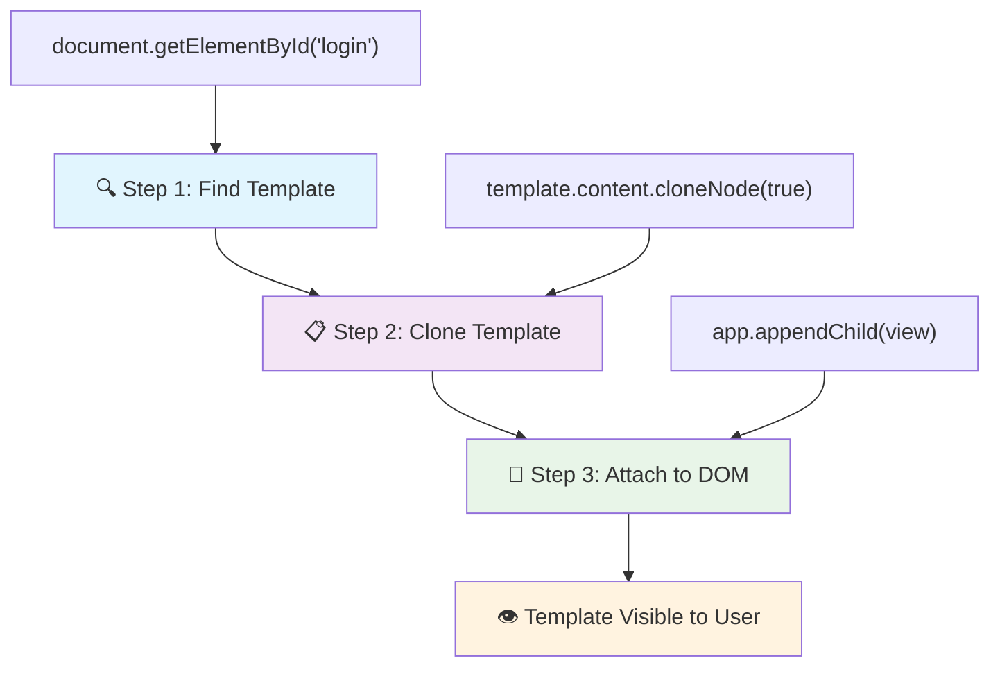
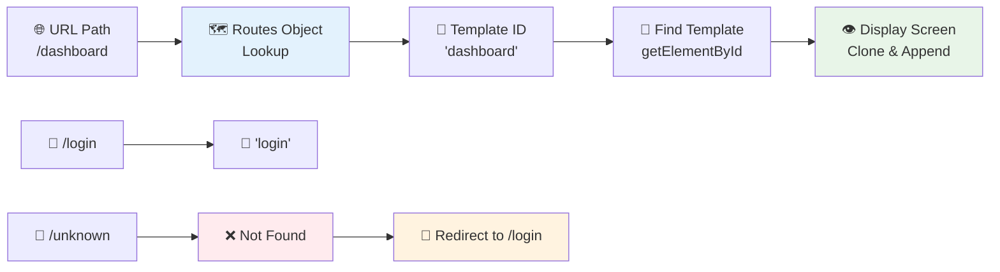
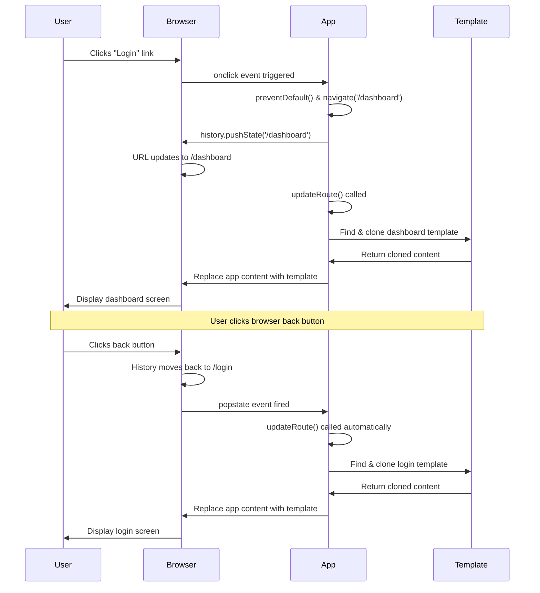

<!--
CO_OP_TRANSLATOR_METADATA:
{
  "original_hash": "5d259f6962464ad91e671083aa0398f4",
  "translation_date": "2025-10-23T22:06:50+00:00",
  "source_file": "7-bank-project/1-template-route/README.md",
  "language_code": "da"
}
-->
# Byg en Bankapp Del 1: HTML-skabeloner og Ruter i en Webapp

Da Apollo 11's navigationscomputer fløj til månen i 1969, måtte den skifte mellem forskellige programmer uden at genstarte hele systemet. Moderne webapplikationer fungerer på samme måde – de ændrer, hvad du ser, uden at genindlæse alt fra bunden. Dette skaber den glatte, responsive oplevelse, som brugerne forventer i dag.

I modsætning til traditionelle hjemmesider, der genindlæser hele sider ved hver interaktion, opdaterer moderne webapps kun de dele, der skal ændres. Denne tilgang, ligesom hvordan mission control skifter mellem forskellige skærme, mens de opretholder konstant kommunikation, skaber den flydende oplevelse, vi er blevet vant til.

Her er, hvad der gør forskellen så markant:

| Traditionelle Multi-Page Apps | Moderne Single-Page Apps |
|------------------------------|--------------------------|
| **Navigation** | Genindlæsning af hele siden for hver skærm | Øjeblikkelig indholdsskift |
| **Ydeevne** | Langsommere på grund af komplette HTML-downloads | Hurtigere med delvise opdateringer |
| **Brugeroplevelse** | Forstyrrende sideblink | Glatte, app-lignende overgange |
| **Dataudveksling** | Svært mellem sider | Nem tilstandshåndtering |
| **Udvikling** | Flere HTML-filer at vedligeholde | En enkelt HTML med dynamiske skabeloner |

**Forstå udviklingen:**
- **Traditionelle apps** kræver serveranmodninger for hver navigationshandling
- **Moderne SPAs** indlæses én gang og opdaterer indhold dynamisk med JavaScript
- **Brugerforventninger** favoriserer nu øjeblikkelige, problemfri interaktioner
- **Ydeevnefordele** inkluderer reduceret båndbredde og hurtigere svar

I denne lektion vil vi bygge en bankapp med flere skærme, der flyder sammen problemfrit. Ligesom hvordan forskere bruger modulære instrumenter, der kan omkonfigureres til forskellige eksperimenter, vil vi bruge HTML-skabeloner som genanvendelige komponenter, der kan vises efter behov.

Du vil arbejde med HTML-skabeloner (genanvendelige skabeloner til forskellige skærme), JavaScript-routing (systemet, der skifter mellem skærme), og browserens historik-API (som holder tilbage-knappen fungerende som forventet). Dette er de samme grundlæggende teknikker, som bruges af frameworks som React, Vue og Angular.

Ved slutningen vil du have en fungerende bankapp, der demonstrerer professionelle principper for single-page applikationer.

## Quiz før lektionen

[Quiz før lektionen](https://ff-quizzes.netlify.app/web/quiz/41)

### Hvad du skal bruge

Vi skal bruge en lokal webserver til at teste vores bankapp – bare rolig, det er nemmere, end det lyder! Hvis du ikke allerede har en opsat, skal du blot installere [Node.js](https://nodejs.org) og køre `npx lite-server` fra din projektmappe. Denne smarte kommando starter en lokal server og åbner automatisk din app i browseren.

### Forberedelse

På din computer skal du oprette en mappe kaldet `bank` med en fil kaldet `index.html` indeni. Vi starter med denne HTML [boilerplate](https://en.wikipedia.org/wiki/Boilerplate_code):

```html
<!DOCTYPE html>
<html lang="en">
  <head>
    <meta charset="UTF-8">
    <meta name="viewport" content="width=device-width, initial-scale=1.0">
    <title>Bank App</title>
  </head>
  <body>
    <!-- This is where you'll work -->
  </body>
</html>
```

**Her er, hvad denne boilerplate giver:**
- **Etablerer** HTML5-dokumentstrukturen med korrekt DOCTYPE-deklaration
- **Konfigurerer** tegnkodning som UTF-8 for international tekstunderstøttelse
- **Muliggør** responsivt design med viewport meta-tagget for mobilkompatibilitet
- **Sætter** en beskrivende titel, der vises i browserfanen
- **Skaber** en ren body-sektion, hvor vi bygger vores applikation

> 📁 **Projektstruktur Forhåndsvisning**
> 
> **Ved slutningen af denne lektion vil dit projekt indeholde:**
> ```
> bank/
> ├── index.html      <!-- Main HTML with templates -->
> ├── app.js          <!-- Routing and navigation logic -->
> └── style.css       <!-- (Optional for future lessons) -->
> ```
> 
> **Filansvar:**
> - **index.html**: Indeholder alle skabeloner og giver appens struktur
> - **app.js**: Håndterer routing, navigation og skabelonstyring
> - **Skabeloner**: Definerer UI for login, dashboard og andre skærme

---

## HTML-skabeloner

Skabeloner løser et grundlæggende problem i webudvikling. Da Gutenberg opfandt den bevægelige type trykning i 1440'erne, indså han, at i stedet for at udskære hele sider, kunne han skabe genanvendelige bogstavblokke og arrangere dem efter behov. HTML-skabeloner fungerer på samme princip – i stedet for at skabe separate HTML-filer for hver skærm, definerer du genanvendelige strukturer, der kan vises, når det er nødvendigt.

Tænk på skabeloner som tegninger for forskellige dele af din app. Ligesom en arkitekt skaber én tegning og bruger den flere gange i stedet for at tegne identiske rum igen, skaber vi skabeloner én gang og bruger dem efter behov. Browseren holder disse skabeloner skjult, indtil JavaScript aktiverer dem.

Hvis du vil oprette flere skærme til en webside, kunne en løsning være at oprette en HTML-fil for hver skærm, du vil vise. Men denne løsning har nogle ulemper:

- Du skal genindlæse hele HTML'en, når du skifter skærm, hvilket kan være langsomt.
- Det er svært at dele data mellem de forskellige skærme.

En anden tilgang er kun at have én HTML-fil og definere flere [HTML-skabeloner](https://developer.mozilla.org/docs/Web/HTML/Element/template) ved hjælp af `<template>`-elementet. En skabelon er en genanvendelig HTML-blok, der ikke vises af browseren og skal instansieres ved runtime ved hjælp af JavaScript.

### Lad os bygge det

Vi skal oprette en bankapp med to hovedskærme: en login-side og et dashboard. Først skal vi tilføje et pladsholder-element til vores HTML-body – her vil alle vores forskellige skærme blive vist:

```html
<div id="app">Loading...</div>
```

**Forstå denne pladsholder:**
- **Skaber** en container med ID'et "app", hvor alle skærme vil blive vist
- **Viser** en indlæsningsbesked, indtil JavaScript initialiserer den første skærm
- **Giver** et enkelt monteringspunkt for vores dynamiske indhold
- **Muliggør** nem målretning fra JavaScript ved hjælp af `document.getElementById()`

> 💡 **Tip**: Da indholdet af dette element vil blive erstattet, kan vi indsætte en indlæsningsbesked eller indikator, der vises, mens appen indlæses.

Dernæst tilføjer vi HTML-skabelonen for login-siden nedenfor. Indtil videre vil vi kun indsætte en titel og en sektion, der indeholder et link, som vi vil bruge til navigation.

```html
<template id="login">
  <h1>Bank App</h1>
  <section>
    <a href="/dashboard">Login</a>
  </section>
</template>
```

**Opdeling af denne login-skabelon:**
- **Definerer** en skabelon med det unikke identifikator "login" til JavaScript-målretning
- **Indeholder** en hovedoverskrift, der etablerer appens branding
- **Indeholder** et semantisk `<section>`-element til gruppering af relateret indhold
- **Giver** et navigationslink, der vil føre brugerne til dashboardet

Derefter tilføjer vi en anden HTML-skabelon til dashboard-siden. Denne side vil indeholde forskellige sektioner:

- En header med en titel og et logout-link
- Den aktuelle saldo på bankkontoen
- En liste over transaktioner, vist i en tabel

```html
<template id="dashboard">
  <header>
    <h1>Bank App</h1>
    <a href="/login">Logout</a>
  </header>
  <section>
    Balance: 100$
  </section>
  <section>
    <h2>Transactions</h2>
    <table>
      <thead>
        <tr>
          <th>Date</th>
          <th>Object</th>
          <th>Amount</th>
        </tr>
      </thead>
      <tbody></tbody>
    </table>
  </section>
</template>
```

**Lad os forstå hver del af dette dashboard:**
- **Strukturerer** siden med et semantisk `<header>`-element, der indeholder navigation
- **Viser** appens titel konsekvent på tværs af skærme for branding
- **Giver** et logout-link, der fører tilbage til login-skærmen
- **Viser** den aktuelle kontosaldo i en dedikeret sektion
- **Organiserer** transaktionsdata ved hjælp af en korrekt struktureret HTML-tabel
- **Definerer** tabeloverskrifter for kolonnerne Dato, Objekt og Beløb
- **Efterlader** tabelkroppen tom for dynamisk indholdsindsprøjtning senere

> 💡 **Tip**: Når du opretter HTML-skabeloner, hvis du vil se, hvordan det vil se ud, kan du kommentere `<template>` og `</template>` linjerne ved at omslutte dem med `<!-- -->`.

✅ Hvorfor tror du, vi bruger `id`-attributter på skabelonerne? Kunne vi bruge noget andet som klasser?

## Gør skabeloner levende med JavaScript

Nu skal vi gøre vores skabeloner funktionelle. Ligesom hvordan en 3D-printer tager en digital tegning og skaber et fysisk objekt, tager JavaScript vores skjulte skabeloner og skaber synlige, interaktive elementer, som brugerne kan se og bruge.

Processen følger tre konsekvente trin, der danner grundlaget for moderne webudvikling. Når du forstår dette mønster, vil du genkende det på tværs af mange frameworks og biblioteker.

Hvis du prøver din nuværende HTML-fil i en browser, vil du se, at den sidder fast med at vise `Loading...`. Det skyldes, at vi skal tilføje noget JavaScript-kode for at instantiere og vise HTML-skabelonerne.

Instantiationen af en skabelon udføres normalt i 3 trin:

1. Hent skabelonelementet i DOM'en, for eksempel ved hjælp af [`document.getElementById`](https://developer.mozilla.org/docs/Web/API/Document/getElementById).
2. Klon skabelonelementet ved hjælp af [`cloneNode`](https://developer.mozilla.org/docs/Web/API/Node/cloneNode).
3. Tilføj det til DOM'en under et synligt element, for eksempel ved hjælp af [`appendChild`](https://developer.mozilla.org/docs/Web/API/Node/appendChild).



**Visuel opdeling af processen:**
- **Trin 1** lokaliserer det skjulte skabelonelement i DOM-strukturen
- **Trin 2** skaber en fungerende kopi, der sikkert kan ændres
- **Trin 3** indsætter kopien i det synlige sideområde
- **Resultat** er en funktionel skærm, som brugerne kan interagere med

✅ Hvorfor skal vi klone skabelonen, før vi tilføjer den til DOM'en? Hvad tror du, der ville ske, hvis vi sprang dette trin over?

### Opgave

Opret en ny fil kaldet `app.js` i din projektmappe og importer den fil i `<head>`-sektionen af din HTML:

```html
<script src="app.js" defer></script>
```

**Forstå denne script-import:**
- **Linker** JavaScript-filen til vores HTML-dokument
- **Bruger** attributten `defer` for at sikre, at scriptet kører efter HTML-parsning er fuldført
- **Muliggør** adgang til alle DOM-elementer, da de er fuldt indlæst før scriptudførelse
- **Følger** moderne bedste praksis for scriptindlæsning og ydeevne

Nu i `app.js` opretter vi en ny funktion `updateRoute`:

```js
function updateRoute(templateId) {
  const template = document.getElementById(templateId);
  const view = template.content.cloneNode(true);
  const app = document.getElementById('app');
  app.innerHTML = '';
  app.appendChild(view);
}
```

**Trin for trin, her er hvad der sker:**
- **Lokaliserer** skabelonelementet ved hjælp af dets unikke ID
- **Skaber** en dyb kopi af skabelonens indhold ved hjælp af `cloneNode(true)`
- **Finder** app-containeren, hvor indholdet vil blive vist
- **Rydder** eksisterende indhold fra app-containeren
- **Indsætter** det klonede skabelonindhold i den synlige DOM

Nu kalder vi denne funktion med en af skabelonerne og ser på resultatet.

```js
updateRoute('login');
```

**Hvad denne funktionskald opnår:**
- **Aktiverer** login-skabelonen ved at sende dens ID som en parameter
- **Demonstrerer** hvordan man programmatisk skifter mellem forskellige app-skærme
- **Viser** login-skærmen i stedet for "Loading..."-beskeden

✅ Hvad er formålet med denne kode `app.innerHTML = '';`? Hvad sker der uden den?

## Oprettelse af ruter

Routing handler grundlæggende om at forbinde URL'er til det rigtige indhold. Tænk på, hvordan tidlige telefonoperatører brugte omstillingsborde til at forbinde opkald – de tog en indgående anmodning og dirigerede den til den korrekte destination. Web-routing fungerer på samme måde, idet den tager en URL-anmodning og bestemmer, hvilket indhold der skal vises.

Traditionelt håndterede webservere dette ved at levere forskellige HTML-filer til forskellige URL'er. Da vi bygger en single-page app, skal vi selv håndtere denne routing med JavaScript. Denne tilgang giver os mere kontrol over brugeroplevelsen og ydeevnen.



**Forstå routing-flowet:**
- **URL-ændringer** udløser en opslag i vores rute-konfiguration
- **Gyldige ruter** kortlægges til specifikke skabelon-ID'er til rendering
- **Ugyldige ruter** udløser fallback-adfærd for at forhindre brudte tilstande
- **Skabelon-rendering** følger den tre-trins proces, vi har lært tidligere

Når vi taler om en webapp, kalder vi *Routing* intentionen om at kortlægge **URL'er** til specifikke skærme, der skal vises. På en hjemmeside med flere HTML-filer sker dette automatisk, da filstierne afspejles i URL'en. For eksempel med disse filer i din projektmappe:

```
mywebsite/index.html
mywebsite/login.html
mywebsite/admin/index.html
```

Hvis du opretter en webserver med `mywebsite` som rod, vil URL-kortlægningen være:

```
https://site.com            --> mywebsite/index.html
https://site.com/login.html --> mywebsite/login.html
https://site.com/admin/     --> mywebsite/admin/index.html
```

Men for vores webapp bruger vi en enkelt HTML-fil, der indeholder alle skærme, så denne standardadfærd vil ikke hjælpe os. Vi skal manuelt oprette dette kort og opdatere den viste skabelon ved hjælp af JavaScript.

### Opgave

Vi vil bruge et simpelt objekt til at implementere et [kort](https://en.wikipedia.org/wiki/Associative_array) mellem URL-stier og vores skabeloner. Tilføj dette objekt øverst i din `app.js`-fil.

```js
const routes = {
  '/login': { templateId: 'login' },
  '/dashboard': { templateId: 'dashboard' },
};
```

**Forstå denne rute-konfiguration:**
- **Definerer** en kortlægning mellem URL-stier og skabelonidentifikatorer
- **Bruger** objekt-syntaks, hvor nøgler er URL-stier, og værdier indeholder skabeloninformation
- **Muliggør** nem opslag af, hvilken skabelon der skal vises for en given URL
- **Giver** en skalerbar struktur til at tilføje nye ruter i fremtiden

Nu skal vi ændre funktionen `updateRoute` lidt. I stedet for direkte at sende `templateId` som et argument, vil vi hente det ved først at kigge på den aktuelle URL og derefter bruge vores kort til at få den tilsvarende skabelon-ID-værdi. Vi kan bruge [`window.location.pathname`](https://developer.mozilla.org/docs/Web/API/Location/pathname) til kun at få stisektionen fra URL'en.

```js
function updateRoute() {
  const path = window.location.pathname;
  const route = routes[path];

  const template = document.getElementById(route.templateId);
  const view = template.content.cloneNode(true);
  const app = document.getElementById('app');
  app.innerHTML = '';
  app.appendChild(view);
}
```

**Opdeling af, hvad der sker her:**
- **Ekstraherer** den aktuelle sti fra browserens URL ved hjælp af `window.location.pathname`
- **Slår op** i den tilsvarende rute-konfiguration i vores rute-objekt
- **Henter** skabelon-ID'et fra rute-konfigurationen
- **Følger** den samme skabelon-renderingsproces som før
- **Skaber** et dynamisk system, der reagerer på URL-ændringer

Her har vi kortlagt de ruter, vi har erklæret, til den tilsvarende skabelon. Du kan prøve, at det fungerer korrekt ved manuelt at ændre URL'en i din browser.
✅ Hvad sker der, hvis du indtaster en ukendt sti i URL'en? Hvordan kan vi løse dette?

## Tilføjelse af navigation

Når routing er etableret, skal brugerne have en måde at navigere gennem appen på. Traditionelle websites genindlæser hele sider, når man klikker på links, men vi ønsker at opdatere både URL'en og indholdet uden sideopdateringer. Dette skaber en mere glidende oplevelse, der minder om, hvordan desktop-applikationer skifter mellem forskellige visninger.

Vi skal koordinere to ting: opdatere browserens URL, så brugerne kan bogmærke sider og dele links, og vise det relevante indhold. Når dette implementeres korrekt, skaber det den sømløse navigation, som brugerne forventer af moderne applikationer.

> 🏗️ **Arkitekturindsigt**: Navigationens systemkomponenter
>
> **Hvad du bygger:**
> - **🔄 URL-håndtering**: Opdaterer browserens adressefelt uden sideopdateringer
> - **📋 Templatesystem**: Skifter dynamisk indhold baseret på den aktuelle rute  
> - **📚 Historikintegration**: Bevarer browserens tilbage/frem-knap funktionalitet
> - **🛡️ Fejlhåndtering**: Elegante løsninger for ugyldige eller manglende ruter
>
> **Hvordan komponenterne arbejder sammen:**
> - **Lytter** til navigationsevents (klik, historikændringer)
> - **Opdaterer** URL'en ved hjælp af History API
> - **Render** den passende template for den nye rute
> - **Bevarer** en glidende brugeroplevelse hele vejen igennem

Næste skridt for vores app er at tilføje muligheden for at navigere mellem sider uden manuelt at ændre URL'en. Dette indebærer to ting:

  1. Opdatering af den aktuelle URL
  2. Opdatering af den viste template baseret på den nye URL

Vi har allerede taget os af den anden del med funktionen `updateRoute`, så vi skal finde ud af, hvordan vi opdaterer den aktuelle URL.

Vi skal bruge JavaScript og mere specifikt [`history.pushState`](https://developer.mozilla.org/docs/Web/API/History/pushState), som gør det muligt at opdatere URL'en og oprette en ny post i browserens historik uden at genindlæse HTML'en.

> ⚠️ **Vigtig Bemærkning**: Selvom HTML-anker-elementet [`<a href>`](https://developer.mozilla.org/docs/Web/HTML/Element/a) kan bruges alene til at oprette hyperlinks til forskellige URL'er, vil det som standard få browseren til at genindlæse HTML'en. Det er nødvendigt at forhindre denne adfærd, når man håndterer routing med brugerdefineret JavaScript, ved at bruge funktionen preventDefault() på klik-eventet.

### Opgave

Lad os oprette en ny funktion, som vi kan bruge til at navigere i vores app:

```js
function navigate(path) {
  window.history.pushState({}, path, path);
  updateRoute();
}
```

**Forståelse af denne navigationsfunktion:**
- **Opdaterer** browserens URL til den nye sti ved hjælp af `history.pushState`
- **Tilføjer** en ny post til browserens historikstack for korrekt tilbage/frem-knap support
- **Aktiverer** funktionen `updateRoute()` for at vise den tilsvarende template
- **Bevarer** single-page app oplevelsen uden sideopdateringer

Denne metode opdaterer først den aktuelle URL baseret på den givne sti og derefter opdaterer templaten. Egenskaben `window.location.origin` returnerer URL-roden, hvilket gør det muligt for os at rekonstruere en komplet URL fra en given sti.

Nu hvor vi har denne funktion, kan vi tage os af problemet, vi har, hvis en sti ikke matcher nogen defineret rute. Vi vil ændre funktionen `updateRoute` ved at tilføje en fallback til en af de eksisterende ruter, hvis vi ikke kan finde et match.

```js
function updateRoute() {
  const path = window.location.pathname;
  const route = routes[path];

  if (!route) {
    return navigate('/login');
  }

  const template = document.getElementById(route.templateId);
  const view = template.content.cloneNode(true);
  const app = document.getElementById('app');
  app.innerHTML = '';
  app.appendChild(view);
}
```

**Vigtige punkter at huske:**
- **Kontrollerer** om der findes en rute for den aktuelle sti
- **Omdirigerer** til login-siden, når en ugyldig rute tilgås
- **Tilbyder** en fallback-mekanisme, der forhindrer brudt navigation
- **Sikrer** at brugerne altid ser en gyldig skærm, selv med forkerte URL'er

Hvis en rute ikke kan findes, vil vi nu omdirigere til `login`-siden.

Nu skal vi oprette en funktion til at hente URL'en, når et link bliver klikket, og forhindre browserens standard linkadfærd:

```js
function onLinkClick(event) {
  event.preventDefault();
  navigate(event.target.href);
}
```

**Opdeling af denne klik-håndtering:**
- **Forhindrer** browserens standard linkadfærd ved hjælp af `preventDefault()`
- **Ekstraherer** destinations-URL'en fra det klikkede linkelement
- **Kalder** vores brugerdefinerede navigationsfunktion i stedet for at genindlæse siden
- **Bevarer** den glidende single-page applikationsoplevelse

```html
<a href="/dashboard" onclick="onLinkClick(event)">Login</a>
...
<a href="/login" onclick="onLinkClick(event)">Logout</a>
```

**Hvad denne onclick-binding opnår:**
- **Forbinder** hvert link til vores brugerdefinerede navigationssystem
- **Sender** klik-eventet til vores `onLinkClick`-funktion til behandling
- **Muliggør** glidende navigation uden sideopdateringer
- **Bevarer** korrekt URL-struktur, som brugerne kan bogmærke eller dele

Attributten [`onclick`](https://developer.mozilla.org/docs/Web/API/GlobalEventHandlers/onclick) binder `click`-eventet til JavaScript-kode, her kaldet til funktionen `navigate()`.

Prøv at klikke på disse links, du burde nu kunne navigere mellem de forskellige skærme i din app.

✅ Metoden `history.pushState` er en del af HTML5-standarden og implementeret i [alle moderne browsere](https://caniuse.com/?search=pushState). Hvis du bygger en webapp til ældre browsere, er der et trick, du kan bruge i stedet for dette API: ved at bruge et [hash (`#`)](https://en.wikipedia.org/wiki/URI_fragment) før stien kan du implementere routing, der fungerer med almindelig anker-navigation og ikke genindlæser siden, da dens formål var at skabe interne links inden for en side.

## Få tilbage- og frem-knapperne til at fungere

Tilbage- og frem-knapperne er fundamentale for web-browsing, ligesom NASA-missionens kontrolenheder kan gennemgå tidligere systemtilstande under rummissioner. Brugere forventer, at disse knapper fungerer, og når de ikke gør det, bryder det den forventede browsingoplevelse.

Vores single-page app har brug for yderligere konfiguration for at understøtte dette. Browseren opretholder en historikstack (som vi har tilføjet til med `history.pushState`), men når brugerne navigerer gennem denne historik, skal vores app reagere ved at opdatere det viste indhold tilsvarende.



**Vigtige interaktionspunkter:**
- **Brugerhandlinger** udløser navigation gennem klik eller browserknapper
- **Appen opfanger** linkklik for at forhindre sideopdateringer
- **History API** styrer URL-ændringer og browserens historikstack
- **Templates** giver indholdsstrukturen for hver skærm
- **Event listeners** sikrer, at appen reagerer på alle navigationstyper

Brugen af `history.pushState` skaber nye poster i browserens navigationshistorik. Du kan kontrollere dette ved at holde *tilbage-knappen* på din browser, det skulle vise noget som dette:


Hvis du prøver at klikke på tilbage-knappen et par gange, vil du se, at den aktuelle URL ændrer sig, og historikken opdateres, men den samme template bliver ved med at blive vist.

Det skyldes, at applikationen ikke ved, at vi skal kalde `updateRoute()` hver gang historikken ændrer sig. Hvis du kigger på dokumentationen for [`history.pushState`](https://developer.mozilla.org/docs/Web/API/History/pushState), kan du se, at hvis tilstanden ændrer sig - hvilket betyder, at vi er flyttet til en anden URL - udløses eventet [`popstate`](https://developer.mozilla.org/docs/Web/API/Window/popstate_event). Vi vil bruge dette til at løse problemet.

### Opgave

For at sikre, at den viste template opdateres, når browserens historik ændres, vil vi tilføje en ny funktion, der kalder `updateRoute()`. Vi gør dette nederst i vores `app.js`-fil:

```js
window.onpopstate = () => updateRoute();
updateRoute();
```

**Forståelse af denne historikintegration:**
- **Lytter** til `popstate`-events, der opstår, når brugere navigerer med browserknapper
- **Bruger** en arrow-funktion for kortfattet event handler-syntaks
- **Kalder** `updateRoute()` automatisk, hver gang historiktilstanden ændrer sig
- **Initialiserer** appen ved at kalde `updateRoute()` når siden først indlæses
- **Sikrer** at den korrekte template vises uanset, hvordan brugerne navigerer

> 💡 **Pro Tip**: Vi brugte en [arrow-funktion](https://developer.mozilla.org/docs/Web/JavaScript/Reference/Functions/Arrow_functions) her til at erklære vores `popstate` event handler for kortfattethed, men en almindelig funktion ville fungere på samme måde.

Her er en video om arrow-funktioner:

[](https://youtube.com/watch?v=OP6eEbOj2sc "Arrow Functions")

> 🎥 Klik på billedet ovenfor for en video om arrow-funktioner.

Prøv nu at bruge tilbage- og frem-knapperne i din browser, og kontroller, at den viste rute opdateres korrekt denne gang.

---

## GitHub Copilot Agent Challenge 🚀

Brug Agent-tilstand til at fuldføre følgende udfordring:

**Beskrivelse:** Forbedr bankappen ved at implementere fejlhåndtering og en 404-sidetemplate for ugyldige ruter, hvilket forbedrer brugeroplevelsen, når der navigeres til ikke-eksisterende sider.

**Opgave:** Opret en ny HTML-template med id'et "not-found", der viser en brugervenlig 404-fejlside med styling. Rediger derefter JavaScript-routing-logikken til at vise denne template, når brugere navigerer til ugyldige URL'er, og tilføj en "Gå til Hjem"-knap, der navigerer tilbage til login-siden.

Læs mere om [agent mode](https://code.visualstudio.com/blogs/2025/02/24/introducing-copilot-agent-mode) her.

## 🚀 Udfordring

Tilføj en ny template og rute for en tredje side, der viser credits for denne app.

**Udfordringsmål:**
- **Opret** en ny HTML-template med passende indholdsstruktur
- **Tilføj** den nye rute til din rute-konfigurationsobjekt
- **Inkluder** navigationslinks til og fra credits-siden
- **Test** at al navigation fungerer korrekt med browserhistorik

## Quiz efter forelæsning

[Quiz efter forelæsning](https://ff-quizzes.netlify.app/web/quiz/42)

## Gennemgang & Selvstudie

Routing er en af de overraskende vanskelige dele af webudvikling, især når nettet bevæger sig fra sideopdateringsadfærd til Single Page Application sideopdateringer. Læs lidt om [hvordan Azure Static Web App-tjenesten](https://docs.microsoft.com/azure/static-web-apps/routes/?WT.mc_id=academic-77807-sagibbon) håndterer routing. Kan du forklare, hvorfor nogle af de beslutninger, der er beskrevet i det dokument, er nødvendige?

**Yderligere læringsressourcer:**
- **Udforsk** hvordan populære frameworks som React Router og Vue Router implementerer klient-side routing
- **Undersøg** forskellene mellem hash-baseret routing og History API routing
- **Lær** om server-side rendering (SSR) og hvordan det påvirker routing-strategier
- **Undersøg** hvordan Progressive Web Apps (PWAs) håndterer routing og navigation

## Opgave

[Forbedr routing](assignment.md)

---

**Ansvarsfraskrivelse**:  
Dette dokument er blevet oversat ved hjælp af AI-oversættelsestjenesten [Co-op Translator](https://github.com/Azure/co-op-translator). Selvom vi bestræber os på nøjagtighed, skal det bemærkes, at automatiserede oversættelser kan indeholde fejl eller unøjagtigheder. Det originale dokument på dets oprindelige sprog bør betragtes som den autoritative kilde. For kritisk information anbefales professionel menneskelig oversættelse. Vi er ikke ansvarlige for eventuelle misforståelser eller fejltolkninger, der opstår som følge af brugen af denne oversættelse.