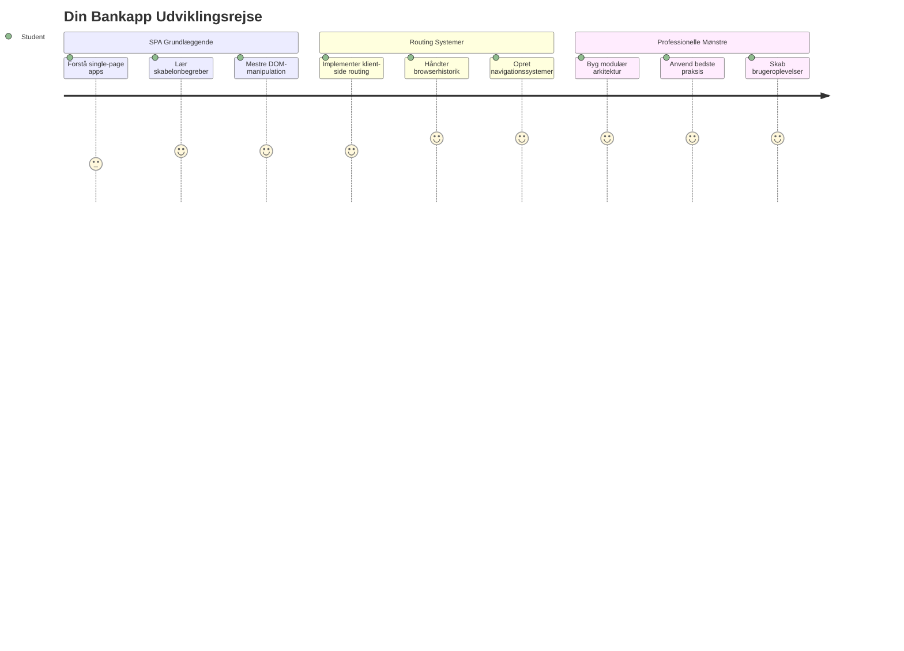
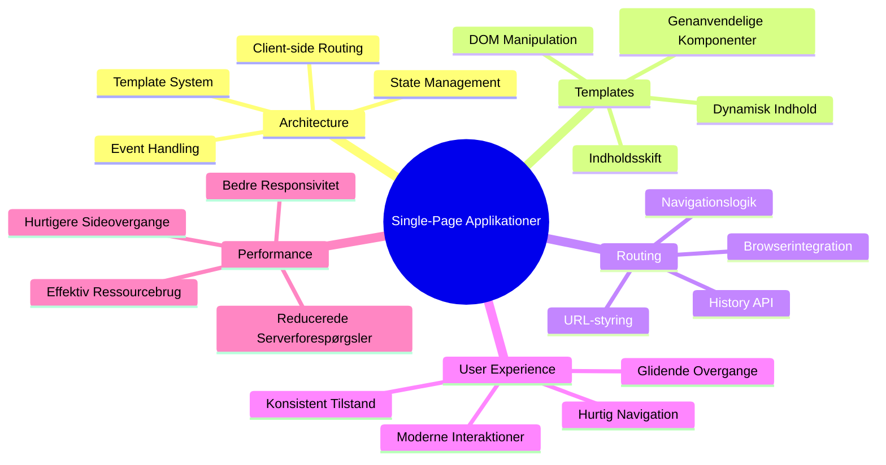
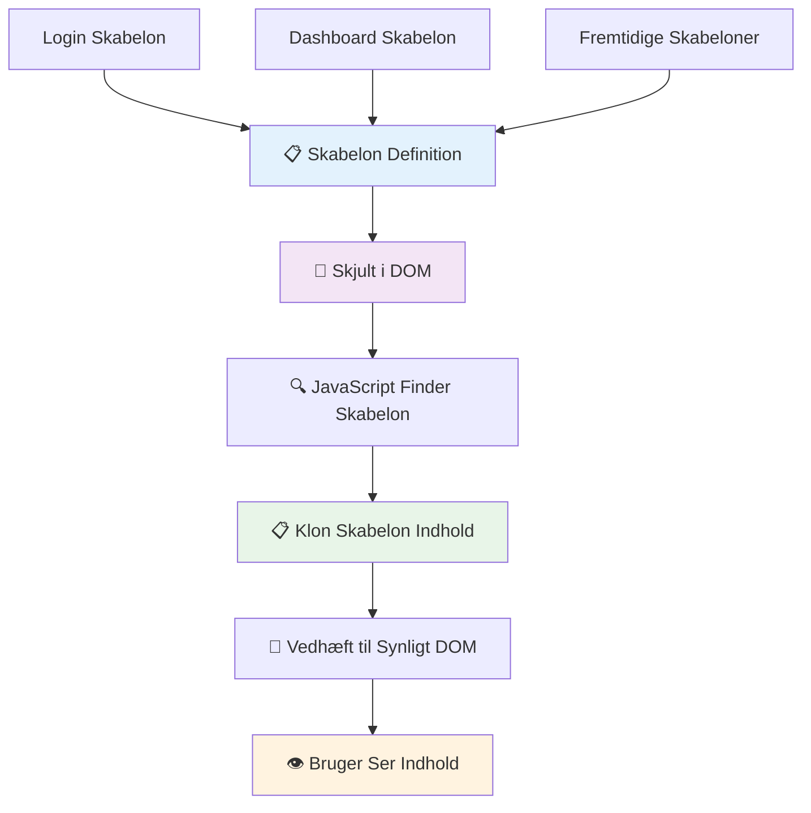
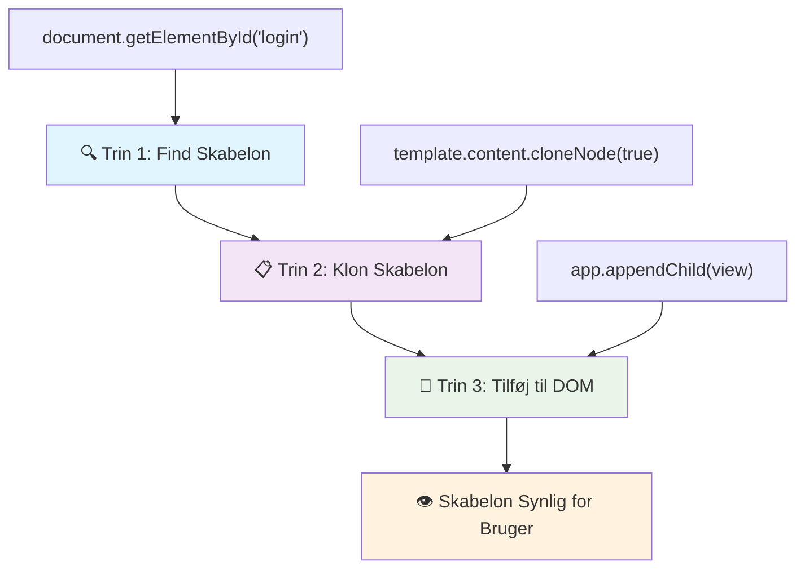
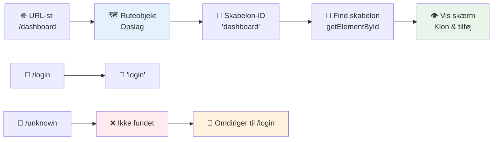
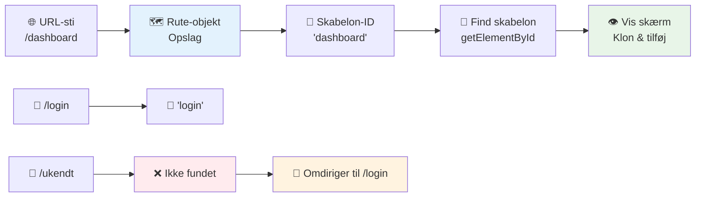
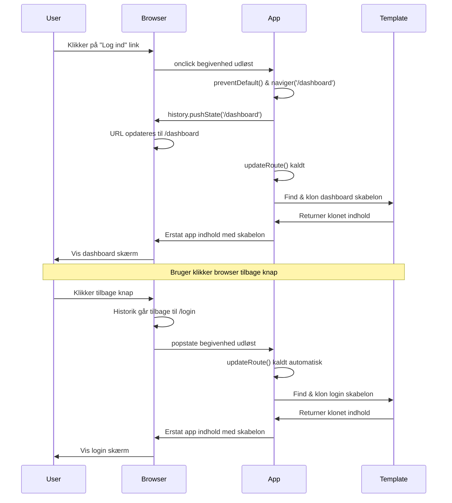
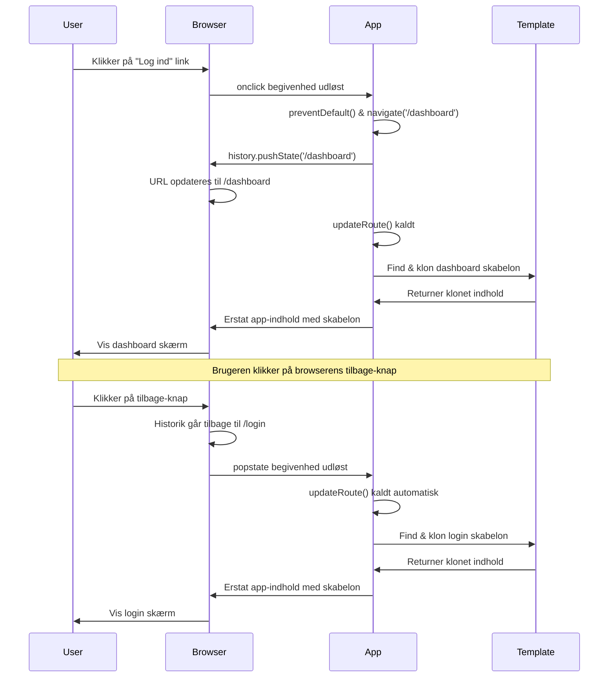
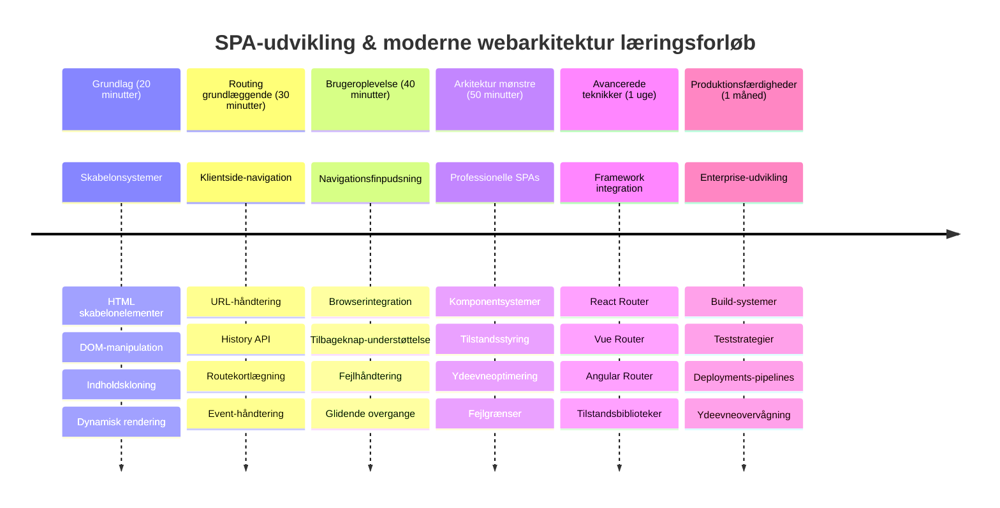

<!--
CO_OP_TRANSLATOR_METADATA:
{
  "original_hash": "351678bece18f07d9daa987a881fb062",
  "translation_date": "2026-01-06T23:50:11+00:00",
  "source_file": "7-bank-project/1-template-route/README.md",
  "language_code": "da"
}
-->
# Byg en bankapp del 1: HTML-skabeloner og ruter i en webapp


Da Apollo 11's styringscomputer navigerede til månen i 1969, skulle den skifte mellem forskellige programmer uden at genstarte hele systemet. Moderne webapplikationer fungerer på samme måde – de ændrer det, du ser, uden at genindlæse alt fra bunden. Det skaber den glatte, responsive oplevelse, brugere forventer i dag.

I modsætning til traditionelle hjemmesider, der genindlæser hele sider for hver interaktion, opdaterer moderne webapps kun de dele, der skal ændres. Denne tilgang, ligesom mission control, der skifter mellem forskellige skærmbilleder, mens de opretholder konstant kommunikation, skaber den flydende oplevelse, vi er blevet vant til.

Her er, hvad der gør forskellen så dramatisk:

| Traditionelle multi-sides apps | Moderne enkelt-sides apps |
|-------------------------------|--------------------------|
| **Navigation** | Genindlæsning af hele siden for hvert skærmbillede | Øjeblikkelig skift af indhold |
| **Ydeevne** | Langsommere pga. fulde HTML-downloads | Hurtigere med delvise opdateringer |
| **Brugeroplevelse** | Forstyrrende sideblink | Glatte, app-lignende overgange |
| **Datadeling** | Vanskelig mellem sider | Let tilstandsstyring |
| **Udvikling** | Flere HTML-filer at vedligeholde | En enkelt HTML med dynamiske skabeloner |

**Forstå udviklingen:**
- **Traditionelle apps** kræver serveranmodninger ved hver navigation
- **Moderne SPAs** loader én gang og opdaterer indhold dynamisk med JavaScript
- **Brugerforventninger** favoriserer nu øjeblikkelige og sømløse interaktioner
- **Ydeevnefordele** inkluderer mindre båndbredde og hurtigere responstid

I denne lektion bygger vi en bankapp med flere skærmbilleder, der flyder sammen problemfrit. Ligesom forskere bruger modulære instrumenter, der kan omkonfigureres til forskellige eksperimenter, bruger vi HTML-skabeloner som genanvendelige komponenter, der kan vises efter behov.

Du vil arbejde med HTML-skabeloner (genanvendelige blueprints til forskellige skærme), JavaScript-ruting (systemet der skifter mellem skærmbilleder), og browserens history API (som sørger for, at tilbage-knappen fungerer som forventet). Dette er de samme grundlæggende teknikker, som bruges af frameworks som React, Vue og Angular.

Til sidst vil du have en fungerende bankapp, der demonstrerer professionelle principper for enkelt-sides applikationer.


## For-forelæsning quiz

[For-forelæsning quiz](https://ff-quizzes.netlify.app/web/quiz/41)

### Hvad du får brug for

Vi får brug for en lokal webserver til at teste vores bankapp – bare rolig, det er nemmere end det lyder! Hvis du ikke allerede har en opsat, så installer bare [Node.js](https://nodejs.org) og kør `npx lite-server` fra din projektmappe. Denne smarte kommando starter en lokal server og åbner din app automatisk i browseren.

### Forberedelse

På din computer opret en mappe med navnet `bank` og en fil inde i den, der hedder `index.html`. Vi starter med denne HTML [skabelon](https://en.wikipedia.org/wiki/Boilerplate_code):

```html
<!DOCTYPE html>
<html lang="en">
  <head>
    <meta charset="UTF-8">
    <meta name="viewport" content="width=device-width, initial-scale=1.0">
    <title>Bank App</title>
  </head>
  <body>
    <!-- This is where you'll work -->
  </body>
</html>
```

**Dette tilbyder skabelonen:**
- **Etablerer** HTML5 dokumentstruktur med korrekt DOCTYPE deklaration
- **Konfigurerer** tegnkodning som UTF-8 for international tekstunderstøttelse
- **Muliggør** responsivt design med viewport meta-tag til mobilkompatibilitet
- **Sætter** en beskrivende titel, der vises i browserfanen
- **Opretter** en ren body-sektion, hvor vi bygger vores applikation

> 📁 **Projektstrukturoversigt**
> 
> **Ved slutningen af denne lektion vil dit projekt indeholde:**
> ```
> bank/
> ├── index.html      <!-- Main HTML with templates -->
> ├── app.js          <!-- Routing and navigation logic -->
> └── style.css       <!-- (Optional for future lessons) -->
> ```
> 
> **Filansvar:**
> - **index.html**: Indeholder alle skabeloner og strukturen til appen
> - **app.js**: Håndterer ruting, navigation og skabelonstyring
> - **Skabeloner**: Definerer UI til login, dashboard og andre skærme

---

## HTML-skabeloner

Skabeloner løser et grundlæggende problem i webudvikling. Da Gutenberg opfandt det bevægelige typesystem i 1440’erne, indså han, at i stedet for at udskære hele sider kunne han lave genanvendelige bogstavblokke og arrangere dem efter behov. HTML-skabeloner fungerer på samme princip – i stedet for at skabe separate HTML-filer til hver skærm definerer du genanvendelige strukturer, som kan vises efter behov.


Tænk på skabeloner som blueprints for forskellige dele af din app. Ligesom en arkitekt skaber ét blueprint og bruger det flere gange i stedet for at tegne identiske rum flere gange, laver vi skabeloner én gang og instansierer dem efter behov. Browseren holder disse skabeloner skjulte, indtil JavaScript aktiverer dem.

Hvis du vil lave flere skærme til en webside, kunne en løsning være at lave en HTML-fil for hver skærm, du vil vise. Denne løsning har dog nogle ulemper:

- Du skal genindlæse hele HTML'en, når du skifter skærm, hvilket kan være langsomt.
- Det er svært at dele data mellem de forskellige skærme.

En anden tilgang er at have kun én HTML-fil og definere flere [HTML-skabeloner](https://developer.mozilla.org/docs/Web/HTML/Element/template) ved hjælp af `<template>` elementet. En skabelon er et genanvendeligt HTML-blok, som ikke vises af browseren, og som skal instansieres under kørslen ved hjælp af JavaScript.

### Lad os bygge det

Vi skal lave en bankapp med to hovedskærme: en login-side og et dashboard. Først tilføjer vi et pladsholder-element til vores HTML body – her vil alle vores forskellige skærme fremkomme:

```html
<div id="app">Loading...</div>
```

**Forstå denne pladsholder:**
- **Opretter** en container med ID'et "app", hvor alle skærme vil blive vist
- **Viser** en loading-besked indtil JavaScript initialiserer den første skærm
- **Giver** ét monteringspunkt for vores dynamiske indhold
- **Muliggør** nem adgang fra JavaScript med `document.getElementById()`

> 💡 **Tips**: Da indholdet i dette element vil blive udskiftet, kan vi indsætte en loading-besked eller indikator, som vises, mens appen loader.

Dernæst tilføjer vi nedenfor HTML-skabelonen til login-siden. Lige nu indsætter vi kun en titel og en sektion med et link, som vi vil bruge til navigationen.

```html
<template id="login">
  <h1>Bank App</h1>
  <section>
    <a href="/dashboard">Login</a>
  </section>
</template>
```

**Opdeling af denne login-skabelon:**
- **Definerer** en skabelon med det unikke ID "login" til JavaScript-målretning
- **Indeholder** en hovedoverskrift, der etablerer appens branding
- **Indholder** et semantisk `<section>` element til gruppering af relateret indhold
- **Giver** et navigationslink, der sender brugerne til dashboardet

Så tilføjer vi en anden HTML-skabelon til dashboard-siden. Denne side indeholder forskellige sektioner:

- Et header med en titel og et logout-link
- Den aktuelle saldo på bankkontoen
- En liste over transaktioner vist i en tabel

```html
<template id="dashboard">
  <header>
    <h1>Bank App</h1>
    <a href="/login">Logout</a>
  </header>
  <section>
    Balance: 100$
  </section>
  <section>
    <h2>Transactions</h2>
    <table>
      <thead>
        <tr>
          <th>Date</th>
          <th>Object</th>
          <th>Amount</th>
        </tr>
      </thead>
      <tbody></tbody>
    </table>
  </section>
</template>
```

**Lad os forstå hver del af dashboardet:**
- **Strukturerer** siden med et semantisk `<header>` element, der indeholder navigation
- **Viser** app-titlen konsekvent på tværs af skærme for branding
- **Giver** et logout-link, der ruter tilbage til login-skærmen
- **Viser** den aktuelle kontosaldo i en dedikeret sektion
- **Organiserer** transaktionsdata ved hjælp af en korrekt struktureret HTML-tabel
- **Definerer** tabelhoveder for Dato, Objekt og Beløb
- **Lader** tabelkroppen være tom til dynamisk indhold senere

> 💡 **Tips**: Når du laver HTML-skabeloner, hvis du vil se, hvordan det vil se ud, kan du kommentere `<template>` og `</template>` linjerne ud ved at omslutte dem med `<!-- -->`.

### 🔄 **Pædagogisk tjek**
**Forståelse af skabelonsystemet**: Inden du implementerer JavaScript, sørg for at forstå:
- ✅ Hvordan skabeloner adskiller sig fra almindelige HTML-elementer
- ✅ Hvorfor skabeloner forbliver skjulte, indtil de aktiveres af JavaScript
- ✅ Vigtigheden af semantisk HTML-struktur i skabeloner
- ✅ Hvordan skabeloner muliggør genanvendelige UI-komponenter

**Hurtig selv-test**: Hvad sker der, hvis du fjerner `<template>` tags omkring dit HTML?
*Svar: Indholdet bliver synligt med det samme og mister sin skabelonfunktion*

**Arkitekturfordele**: Skabeloner giver:
- **Genanvendelighed**: Én definition, flere instanser
- **Ydeevne**: Ingen redundante HTML-parsninger
- **Vedligeholdelighed**: Centraliseret UI-struktur
- **Fleksibilitet**: Dynamisk indholdsskift

✅ Hvorfor tror du, vi bruger `id` attributter på skabelonerne? Kunne vi bruge noget andet som klasser?

## Gør skabeloner levende med JavaScript

Nu skal vi gøre vores skabeloner funktionelle. Ligesom en 3D-printer tager en digital blueprint og skaber et fysisk objekt, tager JavaScript vores skjulte skabeloner og laver synlige, interaktive elementer, som brugerne kan se og bruge.

Processen følger tre konsekvente trin, der udgør fundamentet for moderne webudvikling. Når du forstår dette mønster, vil du genkende det i mange frameworks og biblioteker.

Hvis du prøver din nuværende HTML-fil i en browser, vil du se, at den sidder fast i at vise `Loading...`. Det er fordi vi skal tilføje noget JavaScript-kode for at instantiere og vise HTML-skabelonerne.

At instantiere en skabelon gøres normalt i 3 trin:

1. Find skabelonelementet i DOM’en, for eksempel ved hjælp af [`document.getElementById`](https://developer.mozilla.org/docs/Web/API/Document/getElementById).
2. Klon skabelonelementet, brug [`cloneNode`](https://developer.mozilla.org/docs/Web/API/Node/cloneNode).
3. Vedhæft det til DOM under et synligt element, for eksempel ved hjælp af [`appendChild`](https://developer.mozilla.org/docs/Web/API/Node/appendChild).


**Visuel opdeling af processen:**
- **Trin 1** finder den skjulte skabelon i DOM-strukturen
- **Trin 2** laver en arbejdskopi, som kan ændres uden påvirkning af originalen
- **Trin 3** indsætter kopien i det synlige område på siden
- **Resultatet** er en funktionel skærm, som brugerne kan interagere med

✅ Hvorfor skal vi klone skabelonen før vi vedhæfter den til DOM’en? Hvad tror du ville ske, hvis vi sprang dette trin over?

### Opgave

Opret en ny fil med navnet `app.js` i din projektmappe og importer den fil i `<head>` sektionen i din HTML:

```html
<script src="app.js" defer></script>
```

**Forstå denne script-import:**
- **Forbinder** JavaScript-filen til vores HTML-dokument
- **Bruger** `defer` attributten for at sikre, at scriptet kører efter HTML-parsning er færdig
- **Muliggør** adgang til alle DOM-elementer, da de er fuldt indlæst før scriptudførelse
- **Følger** moderne bedste praksis for script-loading og ydeevne

Nu i `app.js` laver vi en ny funktion `updateRoute`:

```js
function updateRoute(templateId) {
  const template = document.getElementById(templateId);
  const view = template.content.cloneNode(true);
  const app = document.getElementById('app');
  app.innerHTML = '';
  app.appendChild(view);
}
```

**Trin for trin hvad der sker:**
- **Finder** skabelonelementet ved hjælp af dets unikke ID
- **Laver** en dyb kopi af skabelonens indhold med `cloneNode(true)`
- **Finder** app-containeren, hvor indholdet skal vises
- **Fjerner** eksisterende indhold i app-containeren
- **Indsætter** den klonede skabelon i den synlige DOM

Kald derefter denne funktion med en af skabelonerne og se resultatet.

```js
updateRoute('login');
```

**Hvad dette funktionskald opnår:**
- **Aktiverer** login-skabelonen ved at give dens ID som parameter
- **Demonstrerer** hvordan man programmæssigt skifter mellem forskellige app-skærme
- **Viser** login-skærmen i stedet for "Loading..." beskeden

✅ Hvad er formålet med koden `app.innerHTML = '';`? Hvad sker uden den?

## Opret ruter

Routing handler grundlæggende om at forbinde URL’er med det rette indhold. Forestil dig, hvordan tidlige telefonoperatører brugte koblingsanlæg for at forbinde opkald – de tog en indkommende anmodning og rute den til det korrekte sted. Webruting fungerer på samme måde, hvor en URL-anmodning bestemmer, hvilket indhold der vises.


Traditionelt håndterede webservere dette ved at servere forskellige HTML-filer til forskellige URL’er. Da vi bygger en enkelt-sides app, skal vi selv håndtere ruterne med JavaScript. Denne tilgang giver os mere kontrol over brugeroplevelsen og ydeevnen.


**Forstå routing-flowet:**
- **URL-ændringer** udløser opslag i vores rute-konfiguration
- **Gyldige ruter** knyttes til specifikke skabelon-ID’er til gengivelse
- **Ugyldige ruter** udløser fallback-adfærd for at undgå fejltilstande
- **Gengivelse af skabelon** følger den tretrinsproces, vi lærte tidligere

Når man taler om en webapp, kalder vi *Routing* intentionen om at kortlægge **URL’er** til specifikke skærmbilleder, der skal vises. På en hjemmeside med flere HTML-filer gøres dette automatisk, idet filstier afspejles i URL’en. For eksempel med disse filer i din projektmappe:

```
mywebsite/index.html
mywebsite/login.html
mywebsite/admin/index.html
```

Hvis du opretter en webserver med `mywebsite` som rod, bliver URL-kortlægningen:

```
https://site.com            --> mywebsite/index.html
https://site.com/login.html --> mywebsite/login.html
https://site.com/admin/     --> mywebsite/admin/index.html
```

Men i vores webapp bruger vi en enkelt HTML-fil, der indeholder alle skærme, så denne standardadfærd hjælper os ikke. Vi skal skabe dette kort manuelt og opdatere den viste skabelon med JavaScript.

### Opgave

Vi bruger et simpelt objekt til at implementere et [kort](https://en.wikipedia.org/wiki/Associative_array) mellem URL-stier og vores skabeloner. Tilføj dette objekt øverst i din `app.js` fil.

```js
const routes = {
  '/login': { templateId: 'login' },
  '/dashboard': { templateId: 'dashboard' },
};
```

**Forstå denne rute-konfiguration:**
- **Definerer** en kortlægning mellem URL-stier og skabelon-id’er
- **Bruger** objekt-syntaks, hvor nøgler er URL-stier og værdier indeholder skabeloninformation
- **Muliggør** nem opslag af, hvilken skabelon der skal vises for en given URL
- **Giver** en skalerbar struktur til at tilføje nye ruter i fremtiden
Lad os nu ændre lidt på funktionen `updateRoute`. I stedet for at sende `templateId` direkte som et argument, vil vi hente det ved først at kigge på den aktuelle URL og derefter bruge vores kort til at få den tilsvarende template ID-værdi. Vi kan bruge [`window.location.pathname`](https://developer.mozilla.org/docs/Web/API/Location/pathname) til kun at få paths-delen fra URL'en.

```js
function updateRoute() {
  const path = window.location.pathname;
  const route = routes[path];

  const template = document.getElementById(route.templateId);
  const view = template.content.cloneNode(true);
  const app = document.getElementById('app');
  app.innerHTML = '';
  app.appendChild(view);
}
```

**Opdelt hvad der sker her:**
- **Ekstraherer** det aktuelle path fra browserens URL ved hjælp af `window.location.pathname`
- **Slår op** den tilsvarende rute-konfiguration i vores routes-objekt op
- **Henter** template ID fra rute-konfigurationen
- **Følger** samme skabelonrendereringsproces som før
- **Opretter** et dynamisk system, der reagerer på URL-ændringer

Her har vi koblet de ruter, vi har erklæret, til deres tilsvarende template. Du kan prøve selv at ændre URL'en manuelt i din browser for at se, at det virker korrekt.

✅ Hvad sker der, hvis du indtaster et ukendt path i URL'en? Hvordan kunne vi løse det?

## Tilføjelse af Navigation

Med routing på plads har brugerne brug for en måde at navigere rundt i appen på. Traditionelle hjemmesider genindlæser hele sider, når der klikkes på links, men vi ønsker at opdatere både URL og indhold uden at genindlæse siden. Det skaber en glattere oplevelse, som minder om hvordan desktop-applikationer skifter mellem forskellige visninger.

Vi skal koordinere to ting: opdatere browserens URL, så brugerne kan bogmærke sider og dele links, og vise det passende indhold. Når det implementeres korrekt, skaber det den sømløse navigation, brugerne forventer af moderne applikationer.


### 🔄 **Pædagogisk Check-in**
**Single-Page Application Arkitektur**: Bekræft din forståelse af hele systemet:
- ✅ Hvordan adskiller klient-side routing sig fra traditionel server-side routing?
- ✅ Hvorfor er History API vigtigt for korrekt SPA-navigation?
- ✅ Hvordan muliggør templates dynamisk indhold uden sideopdateringer?
- ✅ Hvilken rolle spiller event-håndtering for at opfange navigation?

**Systemintegration**: Din SPA demonstrerer:
- **Template-styring**: Genanvendelige UI-komponenter med dynamisk indhold
- **Klient-side Routing**: URL-styring uden serverforespørgsler
- **Event-drevet Arkitektur**: Responsiv navigation og brugerinteraktioner
- **Browserintegration**: Korrekt historik og bagud/forud-knap support
- **Performance-optimering**: Hurtige overgange og reduceret serverbelastning

**Professionelle Mønstre**: Du har implementeret:
- **Model-View Separation**: Templates adskilt fra applikationslogik
- **State Management**: URL-tilstand synkroniseret med vist indhold
- **Progressiv Forbedring**: JavaScript forbedrer grundlæggende HTML-funktionalitet
- **Brugeroplevelse**: Glat, app-lignende navigation uden sideopdateringer

> � **Arkitekturindsigt**: Navigation Systemkomponenter
>
> **Det du bygger:**
> - **🔄 URL-styring**: Opdaterer browserens adresselinje uden sideopdateringer
> - **📋 Template-system**: Udskifter indhold dynamisk baseret på aktuel rute  
> - **📚 Historik-integration**: Vedligeholder browserens bagud/forud-knap funktionalitet
> - **🛡️ Fejlhåndtering**: Smidige fallback-mekanismer til ugyldige eller manglende ruter
>
> **Hvordan komponenter arbejder sammen:**
> - **Lytter** efter navigationsevents (klik, historikændringer)
> - **Opdaterer** URL med History API
> - **Renderer** den passende template for den nye rute
> - **Opretholder** en sømløs brugeroplevelse hele vejen igennem

Det næste skridt for vores app er at tilføje muligheden for navigation mellem sider uden at skulle ændre URL'en manuelt. Det indebærer to ting:

  1. Opdatering af den aktuelle URL
  2. Opdatering af den viste template baseret på den nye URL

Vi har allerede håndteret det andet med `updateRoute` funktionen, så vi skal finde ud af hvordan vi opdaterer den aktuelle URL.

Vi bliver nødt til at bruge JavaScript og mere specifikt [`history.pushState`](https://developer.mozilla.org/docs/Web/API/History/pushState), som tillader at opdatere URL'en og tilføje en ny post i browserens historik, uden at genindlæse HTML'en.

> ⚠️ **Vigtig Note**: Mens HTML-anker elementet [`<a href>`](https://developer.mozilla.org/docs/Web/HTML/Element/a) kan bruges til at lave hyperlinks til forskellige URL'er, vil det som standard få browseren til at genindlæse HTML'en. Det er nødvendigt at forhindre denne opførsel, når man håndterer routing med brugerdefineret JavaScript, ved at bruge preventDefault() funktionen på klik-eventet.

### Opgave

Lad os oprette en ny funktion, vi kan bruge til navigation i vores app:

```js
function navigate(path) {
  window.history.pushState({}, path, path);
  updateRoute();
}
```

**Forståelse af denne navigationsfunktion:**
- **Opdaterer** browserens URL til den nye sti ved hjælp af `history.pushState`
- **Tilføjer** en ny post til browserens historikhistorik for korrekt bagud/forud-knap support
- **Aktiverer** `updateRoute()` funktionen for at vise den tilsvarende template
- **Opretholder** single-page app-oplevelsen uden sidereloads

Denne metode opdaterer først den aktuelle URL baseret på den givne sti, derefter opdateres templaten. Egenskaben `window.location.origin` returnerer rod-URL'en, så vi kan rekonstruere en komplet URL ud fra en given sti.

Nu hvor vi har denne funktion, kan vi tage hånd om problemet, hvis et path ikke matcher nogen defineret rute. Vi vil modificere `updateRoute` funktionen ved at tilføje et fallback til en af de eksisterende ruter, hvis vi ikke kan finde et match.

```js
function updateRoute() {
  const path = window.location.pathname;
  const route = routes[path];

  if (!route) {
    return navigate('/login');
  }

  const template = document.getElementById(route.templateId);
  const view = template.content.cloneNode(true);
  const app = document.getElementById('app');
  app.innerHTML = '';
  app.appendChild(view);
}
```

**Vigtige punkter at huske:**
- **Tjekker** om en rute eksisterer for den aktuelle sti
- **Omdirigerer** til login-siden, når en ugyldig rute tilgås
- **Sikrer** en fallback-mekanisme, der forhindrer brudt navigation
- **Sørger for** at brugerne altid ser en gyldig skærm, selv med forkerte URL'er

Hvis en rute ikke kan findes, omdirigerer vi nu til `login`-siden.

Lad os nu oprette en funktion til at hente URL'en, når et link klikkes på, og forhindre browserens standard linkadfærd:

```js
function onLinkClick(event) {
  event.preventDefault();
  navigate(event.target.href);
}
```

**Opdelt denne klikhåndtering:**
- **Forhindrer** browserens standard linkadfærd ved brug af `preventDefault()`
- **Ekstraherer** destinations-URL'en fra det klikkede linkelement
- **Kalder** vores brugerdefinerede navigate-funktion i stedet for at genindlæse siden
- **Opretholder** den glatte single-page app-oplevelse

```html
<a href="/dashboard" onclick="onLinkClick(event)">Login</a>
...
<a href="/login" onclick="onLinkClick(event)">Logout</a>
```

**Hvad denne onclick-binding opnår:**
- **Forbinder** hvert link til vores brugerdefinerede navigationssystem
- **Sender** klik-eventet til vores `onLinkClick` funktion til behandling
- **Muliggør** glat navigation uden sidereloads
- **Opretholder** korrekt URL-struktur, som brugerne kan bogmærke eller dele

[`onclick`](https://developer.mozilla.org/docs/Web/API/GlobalEventHandlers/onclick) attributten binder `click` eventet til JavaScript-kode, her kaldet til `navigate()` funktionen.

Prøv at klikke på disse links, du burde nu kunne navigere mellem de forskellige skærmbilleder i din app.

✅ `history.pushState` metoden er en del af HTML5-standarden og implementeret i [alle moderne browsere](https://caniuse.com/?search=pushState). Hvis du bygger en webapp til ældre browsere, er der et trick, du kan bruge i stedet for denne API: Ved at bruge en [hash (`#`)](https://en.wikipedia.org/wiki/URI_fragment) før path'en kan du implementere routing, der virker med almindelig anker-navigation og ikke genindlæser siden, da det oprindeligt var tiltænkt at skabe interne links i en side.

## Få Tilbage- og Fremad-Knapperne til at Virke

Tilbage- og fremad-knapperne er fundamentale for webbrowsing, ligesom NASA-mission controllers kan gennemse tidligere systemtilstande under rumfart. Brugere forventer, at disse knapper virker, og hvis de ikke gør, bryder det den forventede browsingoplevelse.

Vores single-page app har brug for ekstra konfiguration for at understøtte dette. Browseren opretholder en historikstak (som vi har tilføjet til med `history.pushState`), men når brugerne navigerer gennem denne historik, skal vores app reagere ved at opdatere det viste indhold tilsvarende.


**Vigtige interaktionspunkter:**
- **Brugerhandlinger** udløser navigation gennem klik eller browserknapper
- **App opfanger** linkklik for at forhindre sidereloads
- **History API** styrer URL-ændringer og browserens historikstak
- **Templates** tilbyder indholdsstruktur for hver skærm
- **Event-lyttere** sikrer appens reaktion på alle navigationstyper

Brug af `history.pushState` skaber nye poster i browserens navigationshistorik. Du kan tjekke det ved at holde *tilbage-knappen* på din browser nede; den skulle vise noget som dette:


Hvis du prøver at klikke tilbage-knappen et par gange, vil du se, at den aktuelle URL ændres, og historikken opdateres, men den samme template bliver ved med at blive vist.

Det skyldes, at applikationen ikke ved, at vi skal kalde `updateRoute()` hver gang historikken ændres. Hvis du kigger på [`history.pushState` dokumentationen](https://developer.mozilla.org/docs/Web/API/History/pushState), kan du se, at hvis tilstanden ændres – altså vi bevæger os til en anden URL – bliver [`popstate`](https://developer.mozilla.org/docs/Web/API/Window/popstate_event) eventet udløst. Det bruger vi til at løse problemet.

### Opgave

For at sikre at den viste template opdateres, når browserens historik ændres, tilknytter vi en ny funktion, der kalder `updateRoute()`. Det gør vi nederst i vores `app.js` fil:

```js
window.onpopstate = () => updateRoute();
updateRoute();
```

**Forståelse af denne historikintegration:**
- **Lytter** efter `popstate` events, der opstår, når brugere navigerer via browserknapper
- **Bruger** en arrow-funktion for kortere event-handler syntaks
- **Kalder** automatisk `updateRoute()` hver gang historiktilstanden ændres
- **Initialiserer** appen ved at kalde `updateRoute()` når siden først indlæses
- **Sikrer** korrekt templates vises uanset hvordan brugere navigerer

> 💡 **Pro Tip**: Vi brugte en [arrow-funktion](https://developer.mozilla.org/docs/Web/JavaScript/Reference/Functions/Arrow_functions) her til at deklarere vores `popstate` event-handler for kortfattethed, men en almindelig funktion ville fungere på samme måde.

Her er en opfriskningsvideo om arrow-funktioner:

[](https://youtube.com/watch?v=OP6eEbOj2sc "Arrow Functions")

> 🎥 Klik på billedet ovenfor for en video om arrow-funktioner.

Prøv nu at bruge browserens tilbage- og fremad-knapper, og tjek at den viste rute opdateres korrekt denne gang.

### ⚡ **Hvad du kan nå på de næste 5 minutter**
- [ ] Test navigationen i din bankapp med browserens tilbage/frem-knapper
- [ ] Prøv at taste forskellige URL'er manuelt i adresselinjen for at teste routing
- [ ] Åbn browserens DevTools og undersøg, hvordan templates kopieres ind i DOM
- [ ] Eksperimenter med at tilføje console.log-udtryk for at spore routing flow

### 🎯 **Hvad du kan opnå på denne time**
- [ ] Gennemfør quizzen efter lektionen og forstå SPA-arkitekturkoncepter
- [ ] Tilføj CSS-styling, så dine bankapp-templates ser professionelle ud
- [ ] Implementer 404-fejlside-udfordringen med korrekt fejlhåndtering
- [ ] Opret credits-side-udfordringen med ekstra routingfunktionalitet
- [ ] Tilføj loading-tilstande og overgange mellem templater

### 📅 **Din uge-lange SPA-udviklingsrejse**
- [ ] Byg hele bankappen med formularer, datastyring og persistens
- [ ] Tilføj avancerede routingfunktioner som ruteparametre og indlejrede ruter
- [ ] Implementer navigation guards og routing baseret på autentifikation
- [ ] Skab genanvendelige template-komponenter og et komponentbibliotek
- [ ] Tilføj animationer og overgange for en glattere brugeroplevelse
- [ ] Deploy din SPA til en hosting-platform og konfigurer routing korrekt

### 🌟 **Din måned-lange frontend arkitektur mestring**
- [ ] Byg komplekse SPAs med moderne frameworks som React, Vue eller Angular
- [ ] Lær avancerede state management mønstre og biblioteker
- [ ] Mestring af build-værktøjer og udviklingsworkflows til SPA-udvikling
- [ ] Implementer Progressive Web App funktioner og offline funktionalitet
- [ ] Studér performanceoptimeringsteknikker til store SPAs
- [ ] Bidrag til open source SPA-projekter og del din viden

## 🎯 Din Single-Page Application Mastery Tidslinje


### 🛠️ Din SPA-udviklingsværktøjskasse opsummering

Efter at have fuldført denne lektion har du nu mestret:
- **Templatearkitektur**: Genanvendelige HTML-komponenter med dynamisk indholds-rendering
- **Klient-side Routing**: URL-styring og navigation uden sideopdateringer
- **Browserintegration**: History API brug og bagud/forud knap support
- **Event-drevne Systemer**: Navigation og brugerinteraktionsstyring
- **DOM-manipulation**: Template-kloning, indholdsskift og elementhåndtering
- **Fejlhåndtering**: Smidige fallback-løsninger til ugyldige ruter og manglende indhold
- **Performance-mønstre**: Effektiv indlæsning og rendering af indhold

**Virkelige Anvendelser**: Dine SPA-udviklingsfærdigheder gælder direkte for:
- **Moderne Webapplikationer**: React, Vue, Angular og andre framework-udviklinger
- **Progressive Web Apps**: Offline-kapable applikationer med app-lignende oplevelser
- **Enterprise Dashboards**: Kompleks forretningssoftware med flere visninger
- **E-handelsplatforme**: Produktkataloger, indkøbskurve og checkout flows
- **Indholdsstyring**: Dynamisk oprettelse og redigering af indhold
- **Mobiludvikling**: Hybrid-apps baseret på web-teknologier

**Professionelle Kompetencer Opnået**: Du kan nu:
- **Arkitekter** enkelt-sides applikationer med korrekt adskillelse af bekymringer
- **Implementer** klient-side routing systemer, der skalerer med applikationens kompleksitet
- **Fejlret** komplekse navigationsflows ved hjælp af browserens udviklerværktøjer
- **Optimer** applikationsydelse gennem effektiv skabelonstyring
- **Design** brugeroplevelser, der føles native og responsive

**Frontend Udviklingskoncepter Mestret**:
- **Komponentarkitektur**: Genanvendelige UI-mønstre og skabelonsystemer
- **Tilstandssynkronisering**: URL-tilstandshåndtering og browserhistorik
- **Hændelsesdrevet programmering**: Håndtering af brugerinteraktioner og navigation
- **Ydelsesoptimering**: Effektiv DOM-manipulation og indholdsindlæsning
- **Brugeroplevelsesdesign**: Glidende overgange og intuitiv navigation

**Næste Niveau**: Du er klar til at udforske moderne frontend-frameworks, avanceret tilstandshåndtering eller bygge komplekse enterprise-applikationer!

🌟 **Bedrift Opnået**: Du har opbygget et professionelt grundlag for enkelt-sides applikationer med moderne webarkitektur mønstre!

---

## GitHub Copilot Agent Udfordring 🚀

Brug Agent-tilstand til at gennemføre følgende udfordring:

**Beskrivelse:** Forbedr bankappen ved at implementere fejlhåndtering og en 404-side skabelon til ugyldige ruter, og forbedr brugeroplevelsen, når man navigerer til ikke-eksisterende sider.

**Prompt:** Opret en ny HTML-skabelon med id "not-found", der viser en brugervenlig 404-fejlside med styling. Ændr derefter JavaScript routing-logikken, så denne skabelon vises, når brugere navigerer til ugyldige URL'er, og tilføj en "Gå Hjem" knap, der navigerer tilbage til login-siden.

Lær mere om [agent-tilstand](https://code.visualstudio.com/blogs/2025/02/24/introducing-copilot-agent-mode) her.

## 🚀 Udfordring

Tilføj en ny skabelon og rute til en tredje side, der viser kreditterne for denne app.

**Udfordringsmål:**
- **Opret** en ny HTML-skabelon med passende indholdsstruktur
- **Tilføj** den nye rute til din rute-konfigurationsobjekt
- **Inkluder** navigationslinks til og fra kredit-siden
- **Test** at al navigation fungerer korrekt med browserhistorik

## Quiz efter forelæsning

[Quiz efter forelæsning](https://ff-quizzes.netlify.app/web/quiz/42)

## Review & Selvstudie

Routing er en af de overraskende vanskelige dele af webudvikling, især efterhånden som nettet bevæger sig fra sideopdateringer til enkelt-sides applikationers sideopdateringer. Læs lidt om [hvordan Azure Static Web App servicen](https://docs.microsoft.com/azure/static-web-apps/routes/?WT.mc_id=academic-77807-sagibbon) håndterer routing. Kan du forklare, hvorfor nogle af beslutningerne beskrevet i det dokument er nødvendige?

**Yderligere læringsressourcer:**
- **Udforsk** hvordan populære frameworks som React Router og Vue Router implementerer klient-side routing
- **Undersøg** forskellene mellem hash-baseret routing og history API routing
- **Lær** om server-side rendering (SSR) og hvordan det påvirker routingstrategier
- **Undersøg** hvordan Progressive Web Apps (PWAs) håndterer routing og navigation

## Opgave

[Forbedr routingen](assignment.md)

---

<!-- CO-OP TRANSLATOR DISCLAIMER START -->
**Ansvarsfraskrivelse**:
Dette dokument er blevet oversat ved hjælp af AI-oversættelsestjenesten [Co-op Translator](https://github.com/Azure/co-op-translator). Selvom vi stræber efter nøjagtighed, bedes du være opmærksom på, at automatiserede oversættelser kan indeholde fejl eller unøjagtigheder. Det oprindelige dokument på dets oprindelige sprog bør betragtes som den autoritative kilde. For vigtig information anbefales professionel menneskelig oversættelse. Vi påtager os intet ansvar for eventuelle misforståelser eller fejltolkninger, der opstår som følge af brugen af denne oversættelse.
<!-- CO-OP TRANSLATOR DISCLAIMER END -->