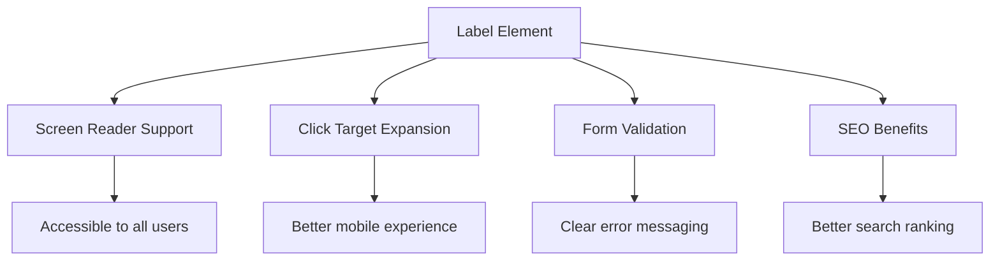
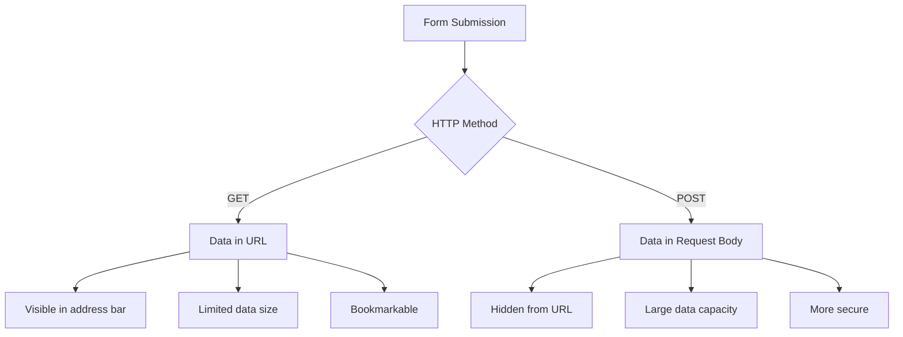
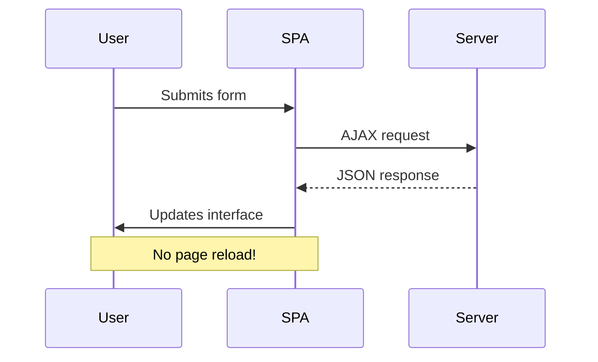
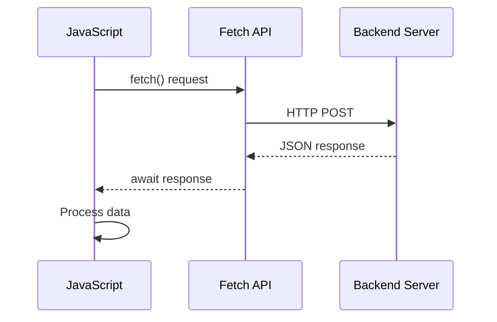
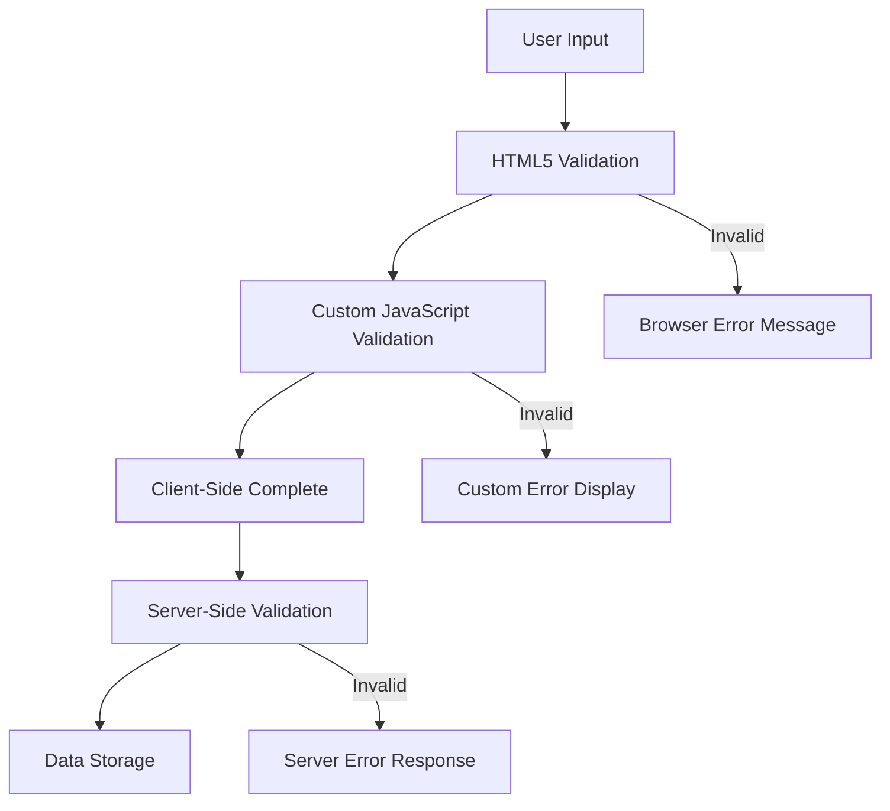
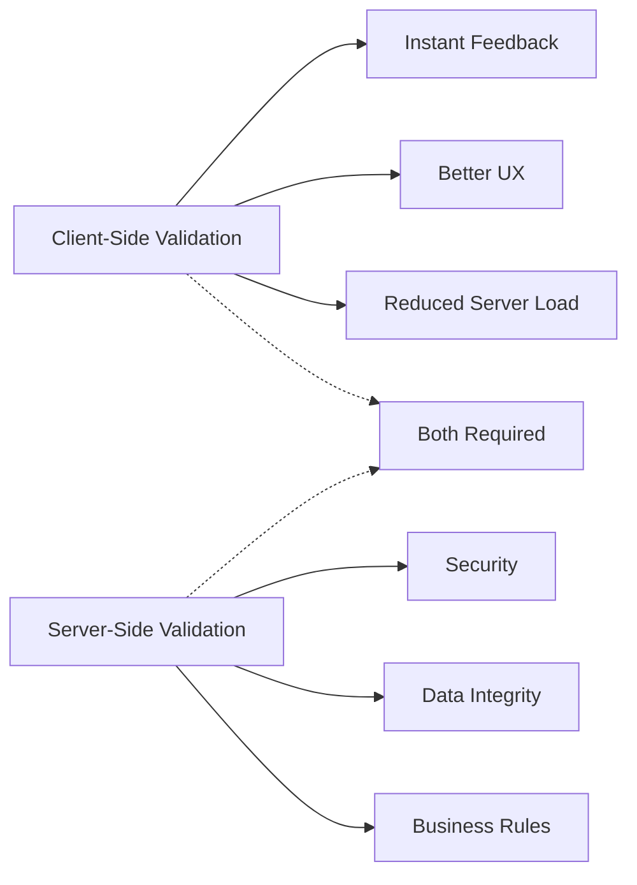

<!--
CO_OP_TRANSLATOR_METADATA:
{
  "original_hash": "b24f28fc46dd473aa9080f174182adde",
  "translation_date": "2025-10-23T22:07:43+00:00",
  "source_file": "7-bank-project/2-forms/README.md",
  "language_code": "da"
}
-->
# Byg en bankapp del 2: Opret en login- og registreringsformular

## Quiz før lektionen

[Quiz før lektionen](https://ff-quizzes.netlify.app/web/quiz/43)

Har du nogensinde udfyldt en formular online og fået afvist din e-mailadresse? Eller mistet alle dine oplysninger, da du trykkede på "send"? Vi har alle oplevet disse frustrerende situationer.

Formularer er broen mellem dine brugere og din applikations funktionalitet. Ligesom de omhyggelige protokoller, som flyveledere bruger til at guide fly sikkert til deres destinationer, giver veludformede formularer klar feedback og forhindrer dyre fejl. Dårlige formularer kan derimod skræmme brugere væk hurtigere end en misforståelse i en travl lufthavn.

I denne lektion vil vi forvandle din statiske bankapp til en interaktiv applikation. Du vil lære at oprette formularer, der validerer brugerinput, kommunikerer med servere og giver nyttig feedback. Tænk på det som at bygge kontrolgrænsefladen, der lader brugerne navigere i din applikations funktioner.

Når vi er færdige, vil du have et komplet login- og registreringssystem med validering, der guider brugerne mod succes frem for frustration.

## Forudsætninger

Før vi begynder at bygge formularer, skal vi sikre os, at du har alt sat korrekt op. Denne lektion fortsætter lige der, hvor vi slap i den forrige, så hvis du sprang frem, vil du måske gå tilbage og få det grundlæggende på plads først.

### Nødvendig opsætning

| Komponent | Status | Beskrivelse |
|-----------|--------|-------------|
| [HTML-skabeloner](../1-template-route/README.md) | ✅ Påkrævet | Din grundlæggende bankapp-struktur |
| [Node.js](https://nodejs.org) | ✅ Påkrævet | JavaScript runtime til serveren |
| [Bank API-server](../api/README.md) | ✅ Påkrævet | Backend-tjeneste til datalagring |

> 💡 **Udviklingstip**: Du vil køre to separate servere samtidig – en til din front-end bankapp og en anden til backend-API'en. Denne opsætning afspejler den virkelige verden, hvor frontend- og backend-tjenester fungerer uafhængigt.

### Serverkonfiguration

**Dit udviklingsmiljø vil inkludere:**
- **Frontend-server**: Serverer din bankapp (typisk port `3000`)
- **Backend API-server**: Håndterer datalagring og -hentning (port `5000`)
- **Begge servere** kan køre samtidig uden konflikter

**Test din API-forbindelse:**
```bash
curl http://localhost:5000/api
# Expected response: "Bank API v1.0.0"
```

**Hvis du ser API-versionens svar, er du klar til at fortsætte!**

---

## Forstå HTML-formularer og kontroller

HTML-formularer er måden, hvorpå brugere kommunikerer med din webapplikation. Tænk på dem som telegrafsystemet, der forbandt fjerne steder i det 19. århundrede – de er kommunikationsprotokollen mellem brugerens intention og applikationens respons. Når de er designet med omtanke, fanger de fejl, guider inputformatet og giver nyttige forslag.

Moderne formularer er betydeligt mere sofistikerede end grundlæggende tekstinput. HTML5 introducerede specialiserede inputtyper, der automatisk håndterer e-mailvalidering, nummerformattering og datovalg. Disse forbedringer gavner både tilgængelighed og mobilbrugeroplevelser.

### Vigtige form-elementer

**Byggesten, som enhver formular har brug for:**

```html
<!-- Basic form structure -->
<form id="userForm" method="POST">
  <label for="username">Username</label>
  <input id="username" name="username" type="text" required>
  
  <button type="submit">Submit</button>
</form>
```

**Dette kode gør følgende:**
- **Opretter** en formularcontainer med en unik identifikator
- **Angiver** HTTP-metoden til datasendelse
- **Associerer** labels med input for tilgængelighed
- **Definerer** en send-knap til at behandle formularen

### Moderne inputtyper og attributter

| Inputtype | Formål | Eksempel på brug |
|-----------|--------|------------------|
| `text` | Generelt tekstinput | `<input type="text" name="username">` |
| `email` | E-mailvalidering | `<input type="email" name="email">` |
| `password` | Skjult tekstindtastning | `<input type="password" name="password">` |
| `number` | Numerisk input | `<input type="number" name="balance" min="0">` |
| `tel` | Telefonnummer | `<input type="tel" name="phone">` |

> 💡 **Fordel ved moderne HTML5**: Brug af specifikke inputtyper giver automatisk validering, passende mobil-tastaturer og bedre tilgængelighed uden ekstra JavaScript!

### Knaptyper og adfærd

```html
<!-- Different button behaviors -->
<button type="submit">Save Data</button>     <!-- Submits the form -->
<button type="reset">Clear Form</button>    <!-- Resets all fields -->
<button type="button">Custom Action</button> <!-- No default behavior -->
```

**Dette gør hver knaptype:**
- **Send-knapper**: Udløser formularsendelse og sender data til det angivne endpoint
- **Nulstil-knapper**: Gendanner alle formularfelter til deres oprindelige tilstand
- **Almindelige knapper**: Giver ingen standardadfærd og kræver brugerdefineret JavaScript for funktionalitet

> ⚠️ **Vigtig bemærkning**: `<input>`-elementet er selv-lukkende og kræver ikke en afsluttende tag. Moderne bedste praksis er at skrive `<input>` uden skråstreg.

### Oprettelse af din loginformular

Lad os nu oprette en praktisk loginformular, der demonstrerer moderne HTML-formularpraksis. Vi starter med en grundlæggende struktur og forbedrer den gradvist med tilgængelighedsfunktioner og validering.

```html
<template id="login">
  <h1>Bank App</h1>
  <section>
    <h2>Login</h2>
    <form id="loginForm" novalidate>
      <div class="form-group">
        <label for="username">Username</label>
        <input id="username" name="user" type="text" required 
               autocomplete="username" placeholder="Enter your username">
      </div>
      <button type="submit">Login</button>
    </form>
  </section>
</template>
```

**Hvad der sker her:**
- **Strukturerer** formularen med semantiske HTML5-elementer
- **Grupperer** relaterede elementer ved hjælp af `div`-containere med meningsfulde klasser
- **Associerer** labels med input ved hjælp af `for`- og `id`-attributter
- **Inkluderer** moderne attributter som `autocomplete` og `placeholder` for bedre brugeroplevelse
- **Tilføjer** `novalidate` for at håndtere validering med JavaScript i stedet for browserens standardindstillinger

### Vigtigheden af korrekte labels

**Hvorfor labels er vigtige for moderne webudvikling:**



**Hvad korrekte labels opnår:**
- **Muliggør** tydelig annoncering af formularfelter med skærmlæsere
- **Udvider** det klikbare område (klik på label fokuserer input)
- **Forbedrer** mobilbrugervenlighed med større berøringsmål
- **Understøtter** formularvalidering med meningsfulde fejlmeddelelser
- **Forbedrer** SEO ved at give semantisk betydning til formelementer

> 🎯 **Tilgængelighedsmål**: Hvert formularinput bør have en tilknyttet label. Denne enkle praksis gør dine formularer brugbare for alle, inklusive brugere med handicap, og forbedrer oplevelsen for alle brugere.

### Oprettelse af registreringsformularen

Registreringsformularen kræver mere detaljerede oplysninger for at oprette en komplet brugerkonto. Lad os bygge den med moderne HTML5-funktioner og forbedret tilgængelighed.

```html
<hr/>
<h2>Register</h2>
<form id="registerForm" novalidate>
  <div class="form-group">
    <label for="user">Username</label>
    <input id="user" name="user" type="text" required 
           autocomplete="username" placeholder="Choose a username">
  </div>
  
  <div class="form-group">
    <label for="currency">Currency</label>
    <input id="currency" name="currency" type="text" value="$" 
           required maxlength="3" placeholder="USD, EUR, etc.">
  </div>
  
  <div class="form-group">
    <label for="description">Account Description</label>
    <input id="description" name="description" type="text" 
           maxlength="100" placeholder="Personal savings, checking, etc.">
  </div>
  
  <div class="form-group">
    <label for="balance">Starting Balance</label>
    <input id="balance" name="balance" type="number" value="0" 
           min="0" step="0.01" placeholder="0.00">
  </div>
  
  <button type="submit">Create Account</button>
</form>
```

**I ovenstående har vi:**
- **Organiseret** hvert felt i container-divs for bedre styling og layout
- **Tilføjet** passende `autocomplete`-attributter for browserens autofyldningssupport
- **Inkluderet** nyttig placeholder-tekst for at guide brugerinput
- **Sat** fornuftige standardværdier ved hjælp af `value`-attributten
- **Anvendt** valideringsattributter som `required`, `maxlength` og `min`
- **Brugt** `type="number"` til balancefeltet med decimalstøtte

### Udforskning af inputtyper og adfærd

**Moderne inputtyper giver forbedret funktionalitet:**

| Funktion | Fordel | Eksempel |
|----------|--------|----------|
| `type="number"` | Numerisk tastatur på mobil | Nem balanceindtastning |
| `step="0.01"` | Kontrol af decimalpræcision | Tillader cent i valuta |
| `autocomplete` | Browserens autofyldning | Hurtigere formularudfyldning |
| `placeholder` | Kontekstuelle hints | Vejleder brugerens forventninger |

> 🎯 **Tilgængelighedsudfordring**: Prøv at navigere i formularerne ved kun at bruge dit tastatur! Brug `Tab` til at flytte mellem felter, `Space` til at markere afkrydsningsfelter og `Enter` til at sende. Denne oplevelse hjælper dig med at forstå, hvordan skærmlæserbrugere interagerer med dine formularer.

## Forståelse af metoder til formularsendelse

Når nogen udfylder din formular og trykker på send, skal disse data sendes et sted hen – normalt til en server, der kan gemme dem. Der er et par forskellige måder, dette kan ske på, og at vide, hvilken man skal bruge, kan spare dig for nogle hovedpiner senere.

Lad os se på, hvad der faktisk sker, når nogen klikker på send-knappen.

### Standardadfærd for formularer

Lad os først observere, hvad der sker med grundlæggende formularsendelse:

**Test dine nuværende formularer:**
1. Klik på *Registrer*-knappen i din formular
2. Observer ændringerne i din browsers adressefelt
3. Bemærk, hvordan siden genindlæses, og dataene vises i URL'en


### Sammenligning af HTTP-metoder



**Forstå forskellene:**

| Metode | Anvendelse | Data placering | Sikkerhedsniveau | Størrelsesbegrænsning |
|--------|------------|----------------|------------------|-----------------------|
| `GET` | Søgeforespørgsler, filtre | URL-parametre | Lav (synlig) | ~2000 tegn |
| `POST` | Brugerkonti, følsomme data | Anmodningskrop | Højere (skjult) | Ingen praktisk grænse |

**Forstå de grundlæggende forskelle:**
- **GET**: Tilføjer formulardata til URL'en som forespørgselsparametre (passende til søgeoperationer)
- **POST**: Inkluderer data i anmodningskroppen (essentielt for følsomme oplysninger)
- **GET-begrænsninger**: Størrelsesbegrænsninger, synlige data, vedvarende browserhistorik
- **POST-fordele**: Stor datakapacitet, beskyttelse af privatliv, understøttelse af filupload

> 💡 **Bedste praksis**: Brug `GET` til søgeformularer og filtre (datahentning), brug `POST` til brugerregistrering, login og dataskabelse.

### Konfiguration af formularsendelse

Lad os konfigurere din registreringsformular til korrekt at kommunikere med backend-API'en ved hjælp af POST-metoden:

```html
<form id="registerForm" action="//localhost:5000/api/accounts" 
      method="POST" novalidate>
```

**Dette gør konfigurationen:**
- **Dirigerer** formularsendelse til dit API-endpoint
- **Bruger** POST-metoden til sikker dataoverførsel
- **Inkluderer** `novalidate` for at håndtere validering med JavaScript

### Test af formularsendelse

**Følg disse trin for at teste din formular:**
1. **Udfyld** registreringsformularen med dine oplysninger
2. **Klik** på "Opret konto"-knappen
3. **Observer** serverens svar i din browser


**Hvad du bør se:**
- **Browseren omdirigerer** til API-endpointets URL
- **JSON-svar** indeholder dine nyoprettede kontodata
- **Serverbekræftelse** på, at kontoen blev oprettet med succes

> 🧪 **Eksperimenttid**: Prøv at registrere igen med samme brugernavn. Hvilket svar får du? Dette hjælper dig med at forstå, hvordan serveren håndterer duplikerede data og fejltilstande.

### Forståelse af JSON-svar

**Når serveren behandler din formular med succes:**
```json
{
  "user": "john_doe",
  "currency": "$",
  "description": "Personal savings",
  "balance": 100,
  "id": "unique_account_id"
}
```

**Dette svar bekræfter:**
- **Opretter** en ny konto med dine angivne data
- **Tildeler** en unik identifikator til fremtidig reference
- **Returnerer** alle kontooplysninger til verifikation
- **Angiver** vellykket databaselagring

## Moderne formularhåndtering med JavaScript

Traditionel formularsendelse forårsager fuldstændige sideopdateringer, ligesom tidlige rumfartsmissioner krævede fuldstændige systemnulstillinger for kurskorrektioner. Denne tilgang forstyrrer brugeroplevelsen og mister applikationstilstand.

JavaScript-formularhåndtering fungerer som de kontinuerlige vejledningssystemer, der bruges af moderne rumfartøjer – foretager justeringer i realtid uden at miste navigationskonteksten. Vi kan opfange formularsendelser, give øjeblikkelig feedback, håndtere fejl elegant og opdatere grænsefladen baseret på serverens svar, mens vi bevarer brugerens position i applikationen.

### Hvorfor undgå sideopdateringer?



**Fordele ved JavaScript-formularhåndtering:**
- **Bevarer** applikationstilstand og brugerkontekst
- **Giver** øjeblikkelig feedback og indlæsningsindikatorer
- **Muliggør** dynamisk fejlhåndtering og validering
- **Skaber** glatte, app-lignende brugeroplevelser
- **Tillader** betinget logik baseret på serverens svar

### Overgang fra traditionelle til moderne formularer

**Udfordringer ved traditionel tilgang:**
- **Omdirigerer** brugere væk fra din applikation
- **Mister** den aktuelle applikationstilstand og kontekst
- **Kræver** fuldstændige sideopdateringer for simple operationer
- **Giver** begrænset kontrol over brugerfeedback

**Fordele ved moderne JavaScript-tilgang:**
- **Holder** brugere inden for din applikation
- **Bevarer** al applikationstilstand og data
- **Muliggør** realtidsvalidering og feedback
- **Understøtter** progressiv forbedring og tilgængelighed

### Implementering af JavaScript-formularhåndtering

Lad os erstatte den traditionelle formularsendelse med moderne JavaScript-hændelseshåndtering:

```html
<!-- Remove the action attribute and add event handling -->
<form id="registerForm" method="POST" novalidate>
```

**Tilføj registreringslogikken til din `app.js`-fil:**

```javascript
// Modern event-driven form handling
function register() {
  const registerForm = document.getElementById('registerForm');
  const formData = new FormData(registerForm);
  const data = Object.fromEntries(formData);
  const jsonData = JSON.stringify(data);
  
  console.log('Form data prepared:', data);
}

// Attach event listener when the page loads
document.addEventListener('DOMContentLoaded', () => {
  const registerForm = document.getElementById('registerForm');
  registerForm.addEventListener('submit', (event) => {
    event.preventDefault(); // Prevent default form submission
    register();
  });
});
```

**Hvad der sker her:**
- **Forhindrer** standardformularsendelse ved hjælp af `event.preventDefault()`
- **Henter** form-elementet ved hjælp af moderne DOM-selektion
- **Ekstraherer** formulardata ved hjælp af den kraftfulde `FormData`-API
- **Konverterer** FormData til et almindeligt objekt med `Object.fromEntries()`
- **Serialiserer** dataene til JSON-format for serverkommunikation
- **Logger** de behandlede data til fejlfinding og verifikation

### Forståelse af FormData API

**FormData API giver kraftfuld formularhåndtering:**

```javascript
// Example of what FormData captures
const formData = new FormData(registerForm);

// FormData automatically captures:
// {
//   "user": "john_doe",
//   "currency": "$", 
//   "description": "Personal account",
//   "balance": "100"
// }
```

**Fordele ved FormData API:**
- **Omfattende indsamling**: Fanger alle formelementer inklusive tekst, filer og komplekse input
- **Typebevidsthed**: Håndterer forskellige inputtyper automatisk uden brugerdefineret kodning
- **Effektivitet**: Eliminerer manuel feltindsamling med en enkelt API-kald
- **Tilpasningsevne**: Bevarer funktionalitet, når formularstrukturen udvikler sig

### Oprettelse af serverkommunikationsfunktionen

Lad os nu bygge en robust funktion til at kommunikere med din API-server ved hjælp af moderne JavaScript-mønstre:

```javascript
async function createAccount(account) {
  try {
    const response = await fetch('//localhost:5000/api/accounts', {
      method: 'POST',
      headers: { 
        'Content-Type': 'application/json',
        'Accept': 'application/json'
      },
      body: account
    });
    
    // Check if the response was successful
    if (!response.ok) {
      throw new Error(`HTTP error! status: ${response.status}`);
    }
    
    return await response.json();
  } catch (error) {
    console.error('Account creation failed:', error);
    return { error: error.message || 'Network error occurred' };
  }
}
```

**Forståelse af asynkron JavaScript:**



**Hvad denne moderne implementering opnår:**
- **Bruger** `async/await` for læsbar asynkron kode
- **Inkluderer** korrekt fejlhåndtering med try/catch-blokke
- **Kontrollerer** svarstatus før databehandling
- **Indstiller** passende headers til JSON-kommunikation
- **Giver** detaljerede fejlmeddelelser til fejlfinding  
- **Returnerer** konsistente datastrukturer for succes- og fejlsituationer  

### Kraften i den moderne Fetch API  

**Fordele ved Fetch API i forhold til ældre metoder:**  

| Funktion | Fordel | Implementering |  
|----------|--------|----------------|  
| Promise-baseret | Ren asynkron kode | `await fetch()` |  
| Tilpasning af forespørgsel | Fuld kontrol over HTTP | Headers, metoder, body |  
| Håndtering af svar | Fleksibel databehandling | `.json()`, `.text()`, `.blob()` |  
| Fejlhåndtering | Omfattende fejlopsamling | Try/catch blokke |  

> 🎥 **Lær mere**: [Async/Await Tutorial](https://youtube.com/watch?v=YwmlRkrxvkk) - Forstå asynkrone JavaScript-mønstre til moderne webudvikling.  

**Vigtige begreber for serverkommunikation:**  
- **Asynkrone funktioner** giver mulighed for at pause eksekvering for at vente på serverrespons  
- **Await nøgleordet** gør asynkron kode mere læsbar som synkron kode  
- **Fetch API** tilbyder moderne, promise-baserede HTTP-forespørgsler  
- **Fejlhåndtering** sikrer, at din app reagerer elegant på netværksproblemer  

### Færdiggørelse af registreringsfunktionen  

Lad os samle det hele med en komplet, produktionsklar registreringsfunktion:  

```javascript
async function register() {
  const registerForm = document.getElementById('registerForm');
  const submitButton = registerForm.querySelector('button[type="submit"]');
  
  try {
    // Show loading state
    submitButton.disabled = true;
    submitButton.textContent = 'Creating Account...';
    
    // Process form data
    const formData = new FormData(registerForm);
    const jsonData = JSON.stringify(Object.fromEntries(formData));
    
    // Send to server
    const result = await createAccount(jsonData);
    
    if (result.error) {
      console.error('Registration failed:', result.error);
      alert(`Registration failed: ${result.error}`);
      return;
    }
    
    console.log('Account created successfully!', result);
    alert(`Welcome, ${result.user}! Your account has been created.`);
    
    // Reset form after successful registration
    registerForm.reset();
    
  } catch (error) {
    console.error('Unexpected error:', error);
    alert('An unexpected error occurred. Please try again.');
  } finally {
    // Restore button state
    submitButton.disabled = false;
    submitButton.textContent = 'Create Account';
  }
}
```
  
**Denne forbedrede implementering inkluderer:**  
- **Giver** visuel feedback under formularindsendelse  
- **Deaktiverer** send-knappen for at forhindre dobbeltindsendelser  
- **Håndterer** både forventede og uventede fejl elegant  
- **Viser** brugervenlige succes- og fejlmeddelelser  
- **Nulstiller** formularen efter vellykket registrering  
- **Gendanner** UI-tilstanden uanset resultat  

### Test din implementering  

**Åbn din browsers udviklerværktøjer og test registreringen:**  

1. **Åbn** browserkonsollen (F12 → Console-fanen)  
2. **Udfyld** registreringsformularen  
3. **Klik** på "Opret konto"  
4. **Observer** konsolmeddelelserne og brugerfeedback  

  

**Hvad du bør se:**  
- **Indlæsningsstatus** vises på send-knappen  
- **Konsollogs** viser detaljeret information om processen  
- **Succesmeddelelse** vises, når kontooprettelsen lykkes  
- **Formularen nulstilles** automatisk efter vellykket indsendelse  

> 🔒 **Sikkerhedsovervejelse**: I øjeblikket sendes data via HTTP, hvilket ikke er sikkert til produktion. I virkelige applikationer skal du altid bruge HTTPS til at kryptere datatransmission. Læs mere om [HTTPS-sikkerhed](https://en.wikipedia.org/wiki/HTTPS) og hvorfor det er vigtigt for at beskytte brugerdata.  

## Omfattende formularvalidering  

Formularvalidering forhindrer den frustrerende oplevelse af at opdage fejl først efter indsendelse. Ligesom de mange redundante systemer på den internationale rumstation anvender effektiv validering flere lag af sikkerhedskontroller.  

Den optimale tilgang kombinerer browserbaseret validering for øjeblikkelig feedback, JavaScript-validering for forbedret brugeroplevelse og server-side validering for sikkerhed og dataintegritet. Denne redundans sikrer både brugerens tilfredshed og systemets beskyttelse.  

### Forståelse af valideringslag  


  
**Strategi for multilagsvalidering:**  
- **HTML5 validering**: Øjeblikkelige browserbaserede kontroller  
- **JavaScript validering**: Tilpasset logik og brugeroplevelse  
- **Servervalidering**: Endelige sikkerheds- og dataintegritetskontroller  
- **Progressiv forbedring**: Fungerer selv hvis JavaScript er deaktiveret  

### HTML5 valideringsattributter  

**Moderne valideringsværktøjer til rådighed:**  

| Attribut | Formål | Eksempel på brug | Browseradfærd |  
|----------|--------|------------------|---------------|  
| `required` | Obligatoriske felter | `<input required>` | Forhindrer tom indsendelse |  
| `minlength`/`maxlength` | Tekstlængdebegrænsninger | `<input maxlength="20">` | Håndhæver tegnbegrænsninger |  
| `min`/`max` | Numeriske grænser | `<input min="0" max="1000">` | Validerer talgrænser |  
| `pattern` | Tilpassede regex-regler | `<input pattern="[A-Za-z]+">` | Matcher specifikke formater |  
| `type` | Datatypevalidering | `<input type="email">` | Format-specifik validering |  

### CSS-valideringsstil  

**Skab visuel feedback for valideringstilstande:**  

```css
/* Valid input styling */
input:valid {
  border-color: #28a745;
  background-color: #f8fff9;
}

/* Invalid input styling */
input:invalid {
  border-color: #dc3545;
  background-color: #fff5f5;
}

/* Focus states for better accessibility */
input:focus:valid {
  box-shadow: 0 0 0 0.2rem rgba(40, 167, 69, 0.25);
}

input:focus:invalid {
  box-shadow: 0 0 0 0.2rem rgba(220, 53, 69, 0.25);
}
```
  
**Hvad disse visuelle signaler opnår:**  
- **Grønne kanter**: Indikerer vellykket validering, som grønne lys i kontrolcenteret  
- **Røde kanter**: Signaliserer valideringsfejl, der kræver opmærksomhed  
- **Fokusmarkeringer**: Giver klar visuel kontekst for den aktuelle inputplacering  
- **Konsistent styling**: Etablerer forudsigelige grænseflademønstre, som brugerne kan lære  

> 💡 **Pro Tip**: Brug `:valid` og `:invalid` CSS pseudo-klasser til at give øjeblikkelig visuel feedback, mens brugerne skriver, og skab en responsiv og hjælpsom grænseflade.  

### Implementering af omfattende validering  

Lad os forbedre din registreringsformular med robust validering, der giver en fremragende brugeroplevelse og datakvalitet:  

```html
<form id="registerForm" method="POST" novalidate>
  <div class="form-group">
    <label for="user">Username <span class="required">*</span></label>
    <input id="user" name="user" type="text" required 
           minlength="3" maxlength="20" 
           pattern="[a-zA-Z0-9_]+" 
           autocomplete="username"
           title="Username must be 3-20 characters, letters, numbers, and underscores only">
    <small class="form-text">Choose a unique username (3-20 characters)</small>
  </div>
  
  <div class="form-group">
    <label for="currency">Currency <span class="required">*</span></label>
    <input id="currency" name="currency" type="text" required 
           value="$" maxlength="3" 
           pattern="[A-Z$€£¥₹]+" 
           title="Enter a valid currency symbol or code">
    <small class="form-text">Currency symbol (e.g., $, €, £)</small>
  </div>
  
  <div class="form-group">
    <label for="description">Account Description</label>
    <input id="description" name="description" type="text" 
           maxlength="100" 
           placeholder="Personal savings, checking, etc.">
    <small class="form-text">Optional description (up to 100 characters)</small>
  </div>
  
  <div class="form-group">
    <label for="balance">Starting Balance</label>
    <input id="balance" name="balance" type="number" 
           value="0" min="0" step="0.01" 
           title="Enter a positive number for your starting balance">
    <small class="form-text">Initial account balance (minimum $0.00)</small>
  </div>
  
  <button type="submit">Create Account</button>
</form>
```
  
**Forståelse af den forbedrede validering:**  
- **Kombinerer** indikatorer for obligatoriske felter med hjælpsomme beskrivelser  
- **Inkluderer** `pattern` attributter for formatvalidering  
- **Giver** `title` attributter for tilgængelighed og værktøjstip  
- **Tilføjer** hjælpetekst for at vejlede brugerinput  
- **Bruger** semantisk HTML-struktur for bedre tilgængelighed  

### Avancerede valideringsregler  

**Hvad hver valideringsregel opnår:**  

| Felt | Valideringsregler | Brugerfordel |  
|------|-------------------|--------------|  
| Brugernavn | `required`, `minlength="3"`, `maxlength="20"`, `pattern="[a-zA-Z0-9_]+"` | Sikrer gyldige, unikke identifikatorer |  
| Valuta | `required`, `maxlength="3"`, `pattern="[A-Z$€£¥₹]+"` | Accepterer almindelige valutasymboler |  
| Saldo | `min="0"`, `step="0.01"`, `type="number"` | Forhindrer negative saldi |  
| Beskrivelse | `maxlength="100"` | Rimelige længdebegrænsninger |  

### Test af valideringsadfærd  

**Prøv disse valideringsscenarier:**  
1. **Indsend** formularen med tomme obligatoriske felter  
2. **Indtast** et brugernavn kortere end 3 tegn  
3. **Prøv** specialtegn i brugernavnsfeltet  
4. **Indtast** et negativt saldo beløb  

  

**Hvad du vil observere:**  
- **Browseren viser** native valideringsmeddelelser  
- **Styling ændres** baseret på `:valid` og `:invalid` tilstande  
- **Formularindsendelse** forhindres, indtil alle valideringer er opfyldt  
- **Fokus flyttes automatisk** til det første ugyldige felt  

### Klient-side vs Server-side validering  


  
**Hvorfor du har brug for begge lag:**  
- **Klient-side validering**: Giver øjeblikkelig feedback og forbedrer brugeroplevelsen  
- **Server-side validering**: Sikrer sikkerhed og håndterer komplekse forretningsregler  
- **Kombineret tilgang**: Skaber robuste, brugervenlige og sikre applikationer  
- **Progressiv forbedring**: Fungerer selv når JavaScript er deaktiveret  

> 🛡️ **Sikkerhedspåmindelse**: Stol aldrig kun på klient-side validering! Ondsindede brugere kan omgå klient-side kontroller, så server-side validering er afgørende for sikkerhed og dataintegritet.  

---  

## GitHub Copilot Agent Challenge 🚀  

Brug Agent-tilstand til at fuldføre følgende udfordring:  

**Beskrivelse:** Forbedr registreringsformularen med omfattende klient-side validering og brugerfeedback. Denne udfordring vil hjælpe dig med at øve formularvalidering, fejlhåndtering og forbedring af brugeroplevelsen med interaktiv feedback.  

**Opgave:** Opret et komplet system til formularvalidering for registreringsformularen, der inkluderer: 1) Real-time valideringsfeedback for hvert felt, mens brugeren skriver, 2) Tilpassede valideringsmeddelelser, der vises under hvert inputfelt, 3) Et felt til bekræftelse af adgangskode med matchende validering, 4) Visuelle indikatorer (som grønne flueben for gyldige felter og røde advarsler for ugyldige), 5) En send-knap, der kun bliver aktiveret, når alle valideringer er opfyldt. Brug HTML5 valideringsattributter, CSS til styling af valideringstilstande og JavaScript til den interaktive adfærd.  

Lær mere om [agent mode](https://code.visualstudio.com/blogs/2025/02/24/introducing-copilot-agent-mode) her.  

## 🚀 Udfordring  

Vis en fejlmeddelelse i HTML, hvis brugeren allerede eksisterer.  

Her er et eksempel på, hvordan den endelige login-side kan se ud efter lidt styling:  

  

## Quiz efter forelæsning  

[Quiz efter forelæsning](https://ff-quizzes.netlify.app/web/quiz/44)  

## Gennemgang & Selvstudie  

Udviklere har været meget kreative med deres formularopbygning, især hvad angår valideringsstrategier. Lær om forskellige formularflows ved at kigge gennem [CodePen](https://codepen.com); kan du finde nogle interessante og inspirerende formularer?  

## Opgave  

[Style din bankapp](assignment.md)  

---

**Ansvarsfraskrivelse**:  
Dette dokument er blevet oversat ved hjælp af AI-oversættelsestjenesten [Co-op Translator](https://github.com/Azure/co-op-translator). Selvom vi bestræber os på nøjagtighed, skal du være opmærksom på, at automatiserede oversættelser kan indeholde fejl eller unøjagtigheder. Det originale dokument på dets oprindelige sprog bør betragtes som den autoritative kilde. For kritisk information anbefales professionel menneskelig oversættelse. Vi er ikke ansvarlige for eventuelle misforståelser eller fejltolkninger, der opstår som følge af brugen af denne oversættelse.