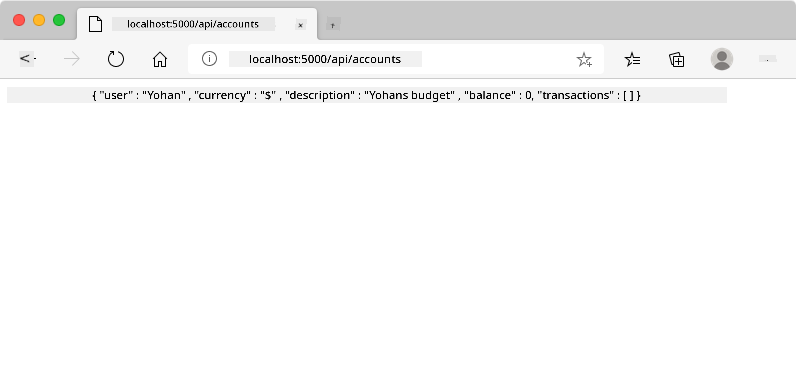
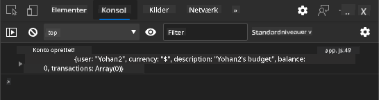
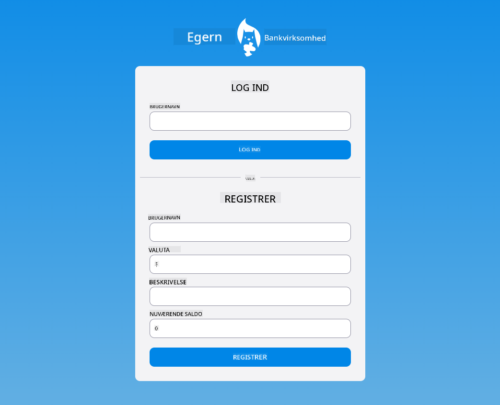

<!--
CO_OP_TRANSLATOR_METADATA:
{
  "original_hash": "b667b7d601e2ee19acb5aa9d102dc9f3",
  "translation_date": "2025-08-26T22:55:57+00:00",
  "source_file": "7-bank-project/2-forms/README.md",
  "language_code": "da"
}
-->
# Byg en Bankapp Del 2: Opret en Login- og Registreringsformular

## Quiz før lektionen

[Quiz før lektionen](https://ashy-river-0debb7803.1.azurestaticapps.net/quiz/43)

### Introduktion

I næsten alle moderne webapps kan du oprette en konto for at få dit eget private område. Da flere brugere kan tilgå en webapp samtidig, har du brug for en mekanisme til at gemme hver brugers personlige data separat og vælge, hvilken information der skal vises. Vi vil ikke dække, hvordan man [håndterer brugeridentitet sikkert](https://en.wikipedia.org/wiki/Authentication), da det er et omfattende emne i sig selv, men vi vil sikre, at hver bruger kan oprette en (eller flere) bankkonti i vores app.

I denne del vil vi bruge HTML-formularer til at tilføje login og registrering til vores webapp. Vi vil se, hvordan man sender data til en server-API programmæssigt, og til sidst hvordan man definerer grundlæggende valideringsregler for brugerinput.

### Forudsætninger

Du skal have gennemført [HTML-skabeloner og routing](../1-template-route/README.md) af webappen for denne lektion. Du skal også installere [Node.js](https://nodejs.org) og [køre server-API'en](../api/README.md) lokalt, så du kan sende data for at oprette konti.

**Bemærk**
Du vil have to terminaler kørende samtidig som angivet nedenfor:
1. For den primære bankapp, vi byggede i lektionen [HTML-skabeloner og routing](../1-template-route/README.md)
2. For [Bank APP server-API'en](../api/README.md), som vi lige har opsat ovenfor.

Du skal have begge servere oppe og køre for at følge resten af lektionen. De lytter på forskellige porte (port `3000` og port `5000`), så alt burde fungere fint.

Du kan teste, om serveren kører korrekt, ved at udføre denne kommando i en terminal:

```sh
curl http://localhost:5000/api
# -> should return "Bank API v1.0.0" as a result
```

---

## Formular og kontroller

`<form>`-elementet indkapsler en sektion af et HTML-dokument, hvor brugeren kan indtaste og indsende data med interaktive kontroller. Der findes alle mulige brugergrænseflade (UI)-kontroller, der kan bruges inden for en formular, hvor de mest almindelige er `<input>`- og `<button>`-elementerne.

Der er mange forskellige [typer](https://developer.mozilla.org/docs/Web/HTML/Element/input) af `<input>`. For eksempel kan du oprette et felt, hvor brugeren kan indtaste sit brugernavn, ved at bruge:

```html
<input id="username" name="username" type="text">
```

`name`-attributten vil blive brugt som egenskabsnavn, når formularens data sendes videre. `id`-attributten bruges til at associere en `<label>` med formularens kontrol.

> Tag et kig på hele listen over [`<input>`-typer](https://developer.mozilla.org/docs/Web/HTML/Element/input) og [andre formularkontroller](https://developer.mozilla.org/docs/Learn/Forms/Other_form_controls) for at få en idé om alle de indbyggede UI-elementer, du kan bruge, når du bygger din brugergrænseflade.

✅ Bemærk, at `<input>` er et [tomt element](https://developer.mozilla.org/docs/Glossary/Empty_element), som du *ikke* bør tilføje en matchende afsluttende tag til. Du kan dog bruge den selv-lukkende `<input/>`-notation, men det er ikke nødvendigt.

`<button>`-elementet inden for en formular er lidt specielt. Hvis du ikke angiver dets `type`-attribut, vil det automatisk indsende formularens data til serveren, når det trykkes. Her er de mulige `type`-værdier:

- `submit`: Standard inden for en `<form>`, knappen udløser formularens indsendelseshandling.
- `reset`: Knappen nulstiller alle formularens kontroller til deres oprindelige værdier.
- `button`: Tildeler ikke en standardadfærd, når knappen trykkes. Du kan derefter tildele brugerdefinerede handlinger til den ved hjælp af JavaScript.

### Opgave

Lad os starte med at tilføje en formular til `login`-skabelonen. Vi skal bruge et *brugernavn*-felt og en *Login*-knap.

```html
<template id="login">
  <h1>Bank App</h1>
  <section>
    <h2>Login</h2>
    <form id="loginForm">
      <label for="username">Username</label>
      <input id="username" name="user" type="text">
      <button>Login</button>
    </form>
  </section>
</template>
```

Hvis du ser nærmere på, kan du bemærke, at vi også har tilføjet et `<label>`-element her. `<label>`-elementer bruges til at tilføje et navn til UI-kontroller, såsom vores brugernavnfelt. Labels er vigtige for læsbarheden af dine formularer, men de har også yderligere fordele:

- Ved at associere en label med en formularkontrol hjælper det brugere, der bruger hjælpemidler (som en skærmlæser), med at forstå, hvilke data de forventes at indtaste.
- Du kan klikke på labelen for direkte at sætte fokus på den tilknyttede input, hvilket gør det lettere at nå på enheder med berøringsskærm.

> [Tilgængelighed](https://developer.mozilla.org/docs/Learn/Accessibility/What_is_accessibility) på nettet er et meget vigtigt emne, der ofte overses. Takket være [semantiske HTML-elementer](https://developer.mozilla.org/docs/Learn/Accessibility/HTML) er det ikke svært at skabe tilgængeligt indhold, hvis du bruger dem korrekt. Du kan [læse mere om tilgængelighed](https://developer.mozilla.org/docs/Web/Accessibility) for at undgå almindelige fejl og blive en ansvarlig udvikler.

Nu tilføjer vi en anden formular til registrering, lige under den forrige:

```html
<hr/>
<h2>Register</h2>
<form id="registerForm">
  <label for="user">Username</label>
  <input id="user" name="user" type="text">
  <label for="currency">Currency</label>
  <input id="currency" name="currency" type="text" value="$">
  <label for="description">Description</label>
  <input id="description" name="description" type="text">
  <label for="balance">Current balance</label>
  <input id="balance" name="balance" type="number" value="0">
  <button>Register</button>
</form>
```

Ved hjælp af `value`-attributten kan vi definere en standardværdi for en given input.
Bemærk også, at input for `balance` har typen `number`. Ser det anderledes ud end de andre inputs? Prøv at interagere med det.

✅ Kan du navigere og interagere med formularerne ved hjælp af kun et tastatur? Hvordan ville du gøre det?

## Indsendelse af data til serveren

Nu hvor vi har en funktionel brugergrænseflade, er næste skridt at sende dataene videre til vores server. Lad os lave en hurtig test med vores nuværende kode: hvad sker der, hvis du klikker på *Login*- eller *Register*-knappen?

Bemærkede du ændringen i browserens URL-sektion?


Standardhandlingen for en `<form>` er at indsende formularen til den aktuelle server-URL ved hjælp af [GET-metoden](https://www.w3.org/Protocols/rfc2616/rfc2616-sec9.html#sec9.3), hvor formularens data tilføjes direkte til URL'en. Denne metode har dog nogle begrænsninger:

- De data, der sendes, er meget begrænsede i størrelse (ca. 2000 tegn)
- Dataene er direkte synlige i URL'en (ikke ideelt for adgangskoder)
- Det fungerer ikke med filuploads

Derfor kan du ændre det til at bruge [POST-metoden](https://www.w3.org/Protocols/rfc2616/rfc2616-sec9.html#sec9.5), som sender formularens data til serveren i HTTP-anmodningens body, uden nogen af de tidligere begrænsninger.

> Selvom POST er den mest almindeligt anvendte metode til at sende data, [i nogle specifikke scenarier](https://www.w3.org/2001/tag/doc/whenToUseGet.html) er det bedre at bruge GET-metoden, for eksempel når man implementerer et søgefelt.

### Opgave

Tilføj `action`- og `method`-egenskaber til registreringsformularen:

```html
<form id="registerForm" action="//localhost:5000/api/accounts" method="POST">
```

Prøv nu at registrere en ny konto med dit navn. Efter at have klikket på *Register*-knappen, bør du se noget som dette:



Hvis alt går godt, bør serveren svare på din anmodning med et [JSON](https://www.json.org/json-en.html)-svar, der indeholder de kontodata, der blev oprettet.

✅ Prøv at registrere igen med det samme navn. Hvad sker der?

## Indsendelse af data uden at genindlæse siden

Som du sikkert har bemærket, er der et lille problem med den tilgang, vi lige brugte: når formularen indsendes, forlader vi vores app, og browseren omdirigerer til serverens URL. Vi forsøger at undgå alle sidegenindlæsninger med vores webapp, da vi laver en [Single-page application (SPA)](https://en.wikipedia.org/wiki/Single-page_application).

For at sende formularens data til serveren uden at tvinge en sidegenindlæsning skal vi bruge JavaScript-kode. I stedet for at sætte en URL i `action`-egenskaben for et `<form>`-element, kan du bruge enhver JavaScript-kode, der er foranstillet med `javascript:`-strengen, til at udføre en brugerdefineret handling. Ved at bruge dette betyder det også, at du skal implementere nogle opgaver, som tidligere blev udført automatisk af browseren:

- Hente formularens data
- Konvertere og kode formularens data til et passende format
- Oprette HTTP-anmodningen og sende den til serveren

### Opgave

Erstat registreringsformularens `action` med:

```html
<form id="registerForm" action="javascript:register()">
```

Åbn `app.js` og tilføj en ny funktion kaldet `register`:

```js
function register() {
  const registerForm = document.getElementById('registerForm');
  const formData = new FormData(registerForm);
  const data = Object.fromEntries(formData);
  const jsonData = JSON.stringify(data);
}
```

Her henter vi formularens element ved hjælp af `getElementById()` og bruger [`FormData`](https://developer.mozilla.org/docs/Web/API/FormData)-hjælperen til at udtrække værdierne fra formularens kontroller som et sæt af nøgle/værdi-par. Derefter konverterer vi dataene til et almindeligt objekt ved hjælp af [`Object.fromEntries()`](https://developer.mozilla.org/docs/Web/JavaScript/Reference/Global_Objects/Object/fromEntries) og til sidst serialiserer dataene til [JSON](https://www.json.org/json-en.html), et format, der ofte bruges til udveksling af data på nettet.

Dataene er nu klar til at blive sendt til serveren. Opret en ny funktion kaldet `createAccount`:

```js
async function createAccount(account) {
  try {
    const response = await fetch('//localhost:5000/api/accounts', {
      method: 'POST',
      headers: { 'Content-Type': 'application/json' },
      body: account
    });
    return await response.json();
  } catch (error) {
    return { error: error.message || 'Unknown error' };
  }
}
```

Hvad gør denne funktion? Bemærk først `async`-nøgleordet her. Det betyder, at funktionen indeholder kode, der vil blive udført [**asynkront**](https://developer.mozilla.org/docs/Web/JavaScript/Reference/Statements/async_function). Når det bruges sammen med `await`-nøgleordet, giver det mulighed for at vente på, at asynkron kode udføres - som at vente på serverens svar her - før man fortsætter.

Her er en kort video om brugen af `async/await`:

[](https://youtube.com/watch?v=YwmlRkrxvkk "Async og Await til håndtering af promises")

> 🎥 Klik på billedet ovenfor for en video om async/await.

Vi bruger `fetch()`-API'en til at sende JSON-data til serveren. Denne metode tager 2 parametre:

- Serverens URL, så vi sætter `//localhost:5000/api/accounts` her igen.
- Indstillingerne for anmodningen. Det er her, vi sætter metoden til `POST` og angiver `body` for anmodningen. Da vi sender JSON-data til serveren, skal vi også sætte `Content-Type`-headeren til `application/json`, så serveren ved, hvordan den skal fortolke indholdet.

Da serveren vil svare på anmodningen med JSON, kan vi bruge `await response.json()` til at analysere JSON-indholdet og returnere det resulterende objekt. Bemærk, at denne metode er asynkron, så vi bruger `await`-nøgleordet her før returnering for at sikre, at eventuelle fejl under analysen også fanges.

Tilføj nu noget kode til `register`-funktionen for at kalde `createAccount()`:

```js
const result = await createAccount(jsonData);
```

Fordi vi bruger `await`-nøgleordet her, skal vi tilføje `async`-nøgleordet før register-funktionen:

```js
async function register() {
```

Til sidst, lad os tilføje nogle logs for at kontrollere resultatet. Den endelige funktion bør se sådan ud:

```js
async function register() {
  const registerForm = document.getElementById('registerForm');
  const formData = new FormData(registerForm);
  const jsonData = JSON.stringify(Object.fromEntries(formData));
  const result = await createAccount(jsonData);

  if (result.error) {
    return console.log('An error occurred:', result.error);
  }

  console.log('Account created!', result);
}
```

Det var lidt langt, men vi kom i mål! Hvis du åbner dine [browserudviklerværktøjer](https://developer.mozilla.org/docs/Learn/Common_questions/What_are_browser_developer_tools) og prøver at registrere en ny konto, bør du ikke se nogen ændring på websiden, men en besked vil dukke op i konsollen, der bekræfter, at alt fungerer.



✅ Tror du, at dataene sendes til serveren sikkert? Hvad hvis nogen kunne opsnappe anmodningen? Du kan læse om [HTTPS](https://en.wikipedia.org/wiki/HTTPS) for at lære mere om sikker datakommunikation.

## Datavalidering

Hvis du prøver at registrere en ny konto uden først at angive et brugernavn, kan du se, at serveren returnerer en fejl med statuskode [400 (Bad Request)](https://developer.mozilla.org/docs/Web/HTTP/Status/400#:~:text=The%20HyperText%20Transfer%20Protocol%20(HTTP,%2C%20or%20deceptive%20request%20routing).).

Før du sender data til en server, er det en god praksis at [validere formularens data](https://developer.mozilla.org/docs/Learn/Forms/Form_validation) på forhånd, når det er muligt, for at sikre, at du sender en gyldig anmodning. HTML5-formularkontroller tilbyder indbygget validering ved hjælp af forskellige attributter:

- `required`: Feltet skal udfyldes, ellers kan formularen ikke indsendes.
- `minlength` og `maxlength`: Definerer det minimale og maksimale antal tegn i tekstfelter.
- `min` og `max`: Definerer den minimale og maksimale værdi for et numerisk felt.
- `type`: Definerer den type data, der forventes, såsom `number`, `email`, `file` eller [andre indbyggede typer](https://developer.mozilla.org/docs/Web/HTML/Element/input). Denne attribut kan også ændre den visuelle rendering af formularens kontrol.
- `pattern`: Tillader at definere et [regulært udtryk](https://developer.mozilla.org/docs/Web/JavaScript/Guide/Regular_Expressions) mønster for at teste, om de indtastede data er gyldige eller ej.
> Tip: du kan tilpasse udseendet af dine formularkontroller afhængigt af, om de er gyldige eller ej, ved at bruge CSS-pseudoklasserne `:valid` og `:invalid`.
### Opgave

Der er 2 obligatoriske felter for at oprette en gyldig ny konto: brugernavn og valuta. De øvrige felter er valgfrie. Opdater formularens HTML ved at bruge både attributten `required` og tekst i feltets label, så det ser sådan ud:

```html
<label for="user">Username (required)</label>
<input id="user" name="user" type="text" required>
...
<label for="currency">Currency (required)</label>
<input id="currency" name="currency" type="text" value="$" required>
```

Selvom denne specifikke serverimplementering ikke håndhæver specifikke grænser for felternes maksimale længde, er det altid en god praksis at definere rimelige grænser for enhver tekstindtastning fra brugeren.

Tilføj attributten `maxlength` til tekstfelterne:

```html
<input id="user" name="user" type="text" maxlength="20" required>
...
<input id="currency" name="currency" type="text" value="$" maxlength="5" required>
...
<input id="description" name="description" type="text" maxlength="100">
```

Hvis du nu trykker på *Registrer* knappen, og et felt ikke overholder en valideringsregel, vi har defineret, vil du se noget som dette:


Validering som denne, der udføres *før* data sendes til serveren, kaldes **klient-side** validering. Men bemærk, at det ikke altid er muligt at udføre alle tjek uden at sende data. For eksempel kan vi her ikke kontrollere, om en konto allerede eksisterer med samme brugernavn, uden at sende en forespørgsel til serveren. Yderligere validering, der udføres på serveren, kaldes **server-side** validering.

Normalt skal begge implementeres, og mens brugen af klient-side validering forbedrer brugeroplevelsen ved at give øjeblikkelig feedback til brugeren, er server-side validering afgørende for at sikre, at de brugerdata, du arbejder med, er korrekte og sikre.

---

## 🚀 Udfordring

Vis en fejlmeddelelse i HTML, hvis brugeren allerede eksisterer.

Her er et eksempel på, hvordan den endelige login-side kan se ud efter lidt styling:



## Quiz efter forelæsning

[Quiz efter forelæsning](https://ashy-river-0debb7803.1.azurestaticapps.net/quiz/44)

## Gennemgang & Selvstudie

Udviklere er blevet meget kreative med deres formularopbygning, især når det gælder valideringsstrategier. Lær om forskellige formularflows ved at kigge på [CodePen](https://codepen.com); kan du finde nogle interessante og inspirerende formularer?

## Opgave

[Style din bankapp](assignment.md)

---

**Ansvarsfraskrivelse**:  
Dette dokument er blevet oversat ved hjælp af AI-oversættelsestjenesten [Co-op Translator](https://github.com/Azure/co-op-translator). Selvom vi bestræber os på at opnå nøjagtighed, skal du være opmærksom på, at automatiserede oversættelser kan indeholde fejl eller unøjagtigheder. Det originale dokument på dets oprindelige sprog bør betragtes som den autoritative kilde. For kritisk information anbefales professionel menneskelig oversættelse. Vi er ikke ansvarlige for eventuelle misforståelser eller fejltolkninger, der måtte opstå som følge af brugen af denne oversættelse.