# Byg en Bank-app Del 2: Byg en Login- og Registreringsformular

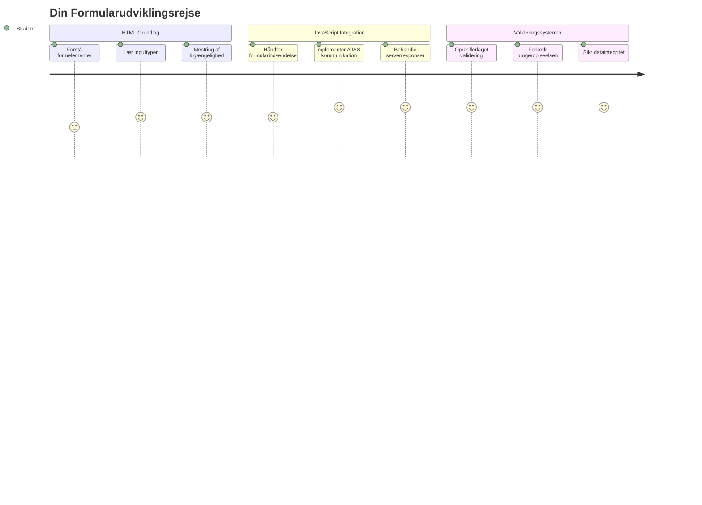
## For-forelæsning Quiz

[For-forelæsning quiz](https://ff-quizzes.netlify.app/web/quiz/43)

Har du nogensinde udfyldt en formular online, og fået den til at afvise dit e-mailformat? Eller mistet alle dine oplysninger, da du trykkede på send? Vi har alle oplevet disse frustrerende situationer.

Formularer er broen mellem dine brugere og din applikations funktionalitet. Ligesom de omhyggelige protokoller, som flyvekontrollører bruger til sikkert at styre fly til deres destinationer, giver veldesignede formularer klar feedback og forhindrer dyre fejl. Dårlige formularer kan derimod drive brugere væk hurtigere end en misforståelse i en travl lufthavn.

I denne lektion vil vi transformere din statiske bank-app til en interaktiv applikation. Du vil lære at bygge formularer, der validerer brugerinput, kommunikerer med servere og giver nyttig feedback. Tænk på det som at bygge kontrolgrænsefladen, der lader brugerne navigere i din applikations funktioner.

Ved slutningen vil du have et komplet login- og registreringssystem med validering, der guider brugere mod succes i stedet for frustration.

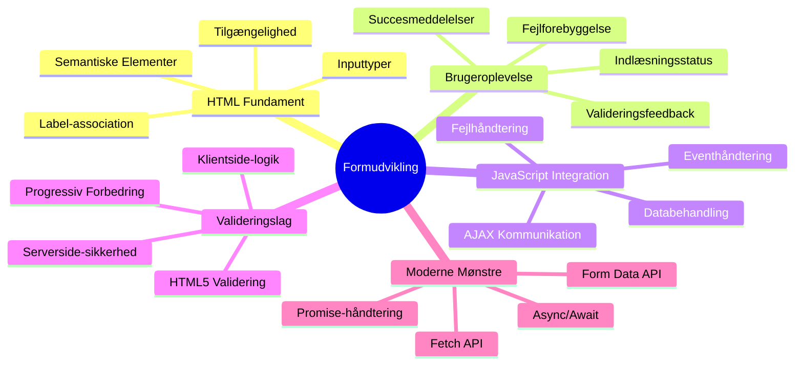
## Forudsætninger

Før vi starter med at bygge formularer, lad os sikre os, at du har alt sat op korrekt. Denne lektion tager fat præcis hvor vi slap i den foregående, så hvis du er sprunget frem, vil du måske gå tilbage og få det grundlæggende til at fungere først.

### Nødvendig Opsætning

| Komponent | Status | Beskrivelse |
|-----------|--------|-------------|
| [HTML Skabeloner](../1-template-route/README.md) | ✅ Nødvendig | Din grundlæggende bank-app struktur |
| [Node.js](https://nodejs.org) | ✅ Nødvendig | JavaScript runtime til serveren |
| [Bank API Server](../api/README.md) | ✅ Nødvendig | Backend service til datalagring |

> 💡 **Udviklingstip**: Du vil køre to separate servere samtidigt – en til din frontend bank-app og en anden til backend API’en. Denne opsætning afspejler den virkelige udvikling, hvor frontend- og backend-tjenester opererer uafhængigt.

### Serverkonfiguration

**Dit udviklingsmiljø vil inkludere:**
- **Frontend server**: Leverer din bank-app (typisk port `3000`)
- **Backend API server**: Håndterer datalagring og hentning (port `5000`)
- **Begge servere** kan køre samtidig uden konflikter

**Test din API-forbindelse:**
```bash
curl http://localhost:5000/api
# Forventet svar: "Bank API v1.0.0"
```

**Hvis du ser API versions svaret, er du klar til at fortsætte!**

---

## Forståelse af HTML Formularer og Kontroller

HTML-formularer er, hvordan brugere kommunikerer med din webapplikation. Tænk på dem som telegrafsystemet, der forbinder fjerne steder i 1800-tallet – de er kommunikationsprotokollen mellem brugerens hensigt og applikationens svar. Når de designes med omhu, fanger de fejl, guider inputformatering og giver nyttige forslag.

Moderne formularer er betydeligt mere sofistikerede end basale tekstfelter. HTML5 introducerede specialiserede inputtyper, der automatisk håndterer e-mailvalidering, talformat og datovalg. Disse forbedringer gavner både tilgængelighed og mobilbrugers oplevelse.

### Væsentlige Formelementer

**Byggeklodser, som alle formularer behøver:**

```html
<!-- Basic form structure -->
<form id="userForm" method="POST">
  <label for="username">Username</label>
  <input id="username" name="username" type="text" required>
  
  <button type="submit">Submit</button>
</form>
```

**Dette er, hvad koden gør:**
- **Opretter** en formular-beholder med en unik identifikator
- **Angiver** HTTP-metoden til datainput
- **Associerer** labels med inputs for tilgængelighed
- **Definerer** en send-knap til at behandle formularen

### Moderne Inputtyper og Attributter

| Inputtype | Formål | Eksempel |
|------------|---------|---------------|
| `text` | Generelt tekstinput | `<input type="text" name="username">` |
| `email` | E-mail validering | `<input type="email" name="email">` |
| `password` | Skjult tekstindtastning | `<input type="password" name="password">` |
| `number` | Numerisk input | `<input type="number" name="balance" min="0">` |
| `tel` | Telefonnummer | `<input type="tel" name="phone">` |

> 💡 **Moderne HTML5 Fordel**: Ved at bruge specifikke inputtyper får du automatisk validering, passende mobiltastaturer og bedre tilgængelighed uden ekstra JavaScript!

### Knap-typer og Adfærd

```html
<!-- Different button behaviors -->
<button type="submit">Save Data</button>     <!-- Submits the form -->
<button type="reset">Clear Form</button>    <!-- Resets all fields -->
<button type="button">Custom Action</button> <!-- No default behavior -->
```

**Dette er, hvad hver knap-type gør:**
- **Send-knapper**: Udløser formularafsendelse og sender data til den angivne endpoint
- **Nulstil-knapper**: Gendanner alle felter til deres oprindelige tilstand
- **Almindelige knapper**: Har ingen standardadfærd, kræver tilpasset JavaScript for funktionalitet

> ⚠️ **Vigtig Note**: `<input>`-elementet er selv-lukkende og behøver ikke en lukketag. Moderne bedste praksis er at skrive `<input>` uden skråstreg.

### Byg din Loginformular

Lad os nu skabe en praktisk loginformular, der demonstrerer moderne HTML form praksisser. Vi starter med en basal struktur og forbedrer den gradvist med tilgængelighedsfunktioner og validering.

```html
<template id="login">
  <h1>Bank App</h1>
  <section>
    <h2>Login</h2>
    <form id="loginForm" novalidate>
      <div class="form-group">
        <label for="username">Username</label>
        <input id="username" name="user" type="text" required 
               autocomplete="username" placeholder="Enter your username">
      </div>
      <button type="submit">Login</button>
    </form>
  </section>
</template>
```

**Hvad der sker her:**
- **Strukturerer** formen med semantiske HTML5 elementer
- **Grupperer** relaterede elementer i `div` containere med meningsfulde klasser
- **Associerer** labels med inputs ved hjælp af `for` og `id` attributter
- **Inkluderer** moderne attributter som `autocomplete` og `placeholder` for bedre brugeroplevelse
- **Tilføjer** `novalidate` for at håndtere validering med JavaScript i stedet for browserens standard

### Kraften af Korrekte Labels

**Hvorfor labels er vigtige for moderne webudvikling:**

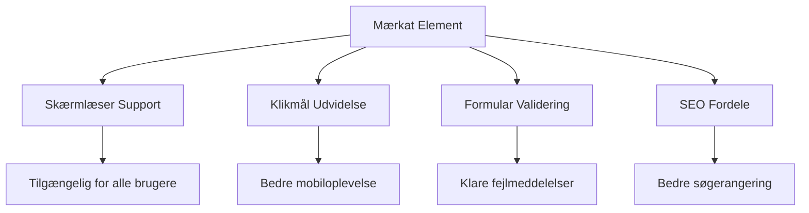
**Hvad korrekte labels opnår:**
- **Muliggør** at skærmlæsere kan annoncere formularfelter klart
- **Udvider** det klikbare område (klik på label fokuserer inputfeltet)
- **Forbedrer** mobilbrugbarhed med større touch-mål
- **Understøtter** formularvalidering med meningsfulde fejlmeddelelser
- **Forbedrer** SEO ved at give semantisk mening til formelementer

> 🎯 **Tilgængelighedsmål**: Hvert formularinput bør have en tilknyttet label. Denne simple praksis gør dine formularer brugbare for alle, inklusive brugere med handicap, og forbedrer oplevelsen for alle brugere.

### Opret Registreringsformularen

Registreringsformularen kræver mere detaljerede oplysninger for at oprette en komplet brugerprofil. Lad os bygge den med moderne HTML5-funktioner og forbedret tilgængelighed.

```html
<hr/>
<h2>Register</h2>
<form id="registerForm" novalidate>
  <div class="form-group">
    <label for="user">Username</label>
    <input id="user" name="user" type="text" required 
           autocomplete="username" placeholder="Choose a username">
  </div>
  
  <div class="form-group">
    <label for="currency">Currency</label>
    <input id="currency" name="currency" type="text" value="$" 
           required maxlength="3" placeholder="USD, EUR, etc.">
  </div>
  
  <div class="form-group">
    <label for="description">Account Description</label>
    <input id="description" name="description" type="text" 
           maxlength="100" placeholder="Personal savings, checking, etc.">
  </div>
  
  <div class="form-group">
    <label for="balance">Starting Balance</label>
    <input id="balance" name="balance" type="number" value="0" 
           min="0" step="0.01" placeholder="0.00">
  </div>
  
  <button type="submit">Create Account</button>
</form>
```

**I ovenstående har vi:**
- **Organiseret** hvert felt i container-divs for bedre styling og layout
- **Tilføjet** passende `autocomplete` attributter til browser autofyld støtte
- **Indsat** hjælpsom pladsholdertekst til at guide brugerinput
- **Sat** fornuftige standardværdier med `value` attributten
- **Anvendt** valideringsattributter som `required`, `maxlength`, og `min`
- **Brugt** `type="number"` for balance-feltet med decimalunderstøttelse

### Udforskning af Inputtyper og Adfærd

**Moderne inputtyper tilbyder forbedret funktionalitet:**

| Funktion | Fordel | Eksempel |
|---------|---------|----------|
| `type="number"` | Numerisk tastatur på mobil | Nemmer balanceindtastning |
| `step="0.01"` | Decimalpræcisionskontrol | Tillader cent i valuta |
| `autocomplete` | Browser autofyld | Hurtigere formularudfyldning |
| `placeholder` | Kontekstuelle hints | Guidede brugerforventninger |

> 🎯 **Tilgængelighedsudfordring**: Prøv at navigere i formularerne kun med dit tastatur! Brug `Tab` til at bevæge dig mellem felter, `Space` til at sætte kryds i bokse, og `Enter` til at sende. Denne oplevelse hjælper dig med at forstå, hvordan skærmlæserbrugere interagerer med dine formularer.

### 🔄 **Pædagogisk Check-in**
**Forståelse af Formular fundamenter**: Før du implementerer JavaScript, skal du sikre dig, at du forstår:
- ✅ Hvordan semantisk HTML skaber tilgængelige formstrukturer
- ✅ Hvorfor inputtyper betyder noget for mobilkeyboard og validering
- ✅ Forholdet mellem labels og formkontroller
- ✅ Hvordan formattributter påvirker browserens standardadfærd

**Kort Selvtest**: Hvad sker der, hvis du sender en formular uden JavaScript håndtering?
*Svar: Browseren udfører den standardiserede afsendelse, typisk ved at omdirigere til action-URL’en*

**HTML5 Formularfordele**: Moderne formularer tilbyder:
- **Indbygget Validering**: Automatisk tjek af e-mail- og talformater
- **Mobiloptimering**: Passende tastaturer for forskellige inputtyper
- **Tilgængelighed**: Skærmlæsersupport og tastaturnavigation
- **Progressiv Forbedring**: Fungerer også når JavaScript er deaktiveret

## Forståelse af Formularers Afsendelsesmetoder

Når nogen udfylder din formular og trykker på send, skal disse data sendes et sted hen – normalt til en server, der kan gemme dem. Der findes et par forskellige måder at gøre det på, og at vide, hvilken man skal bruge, kan spare dig for en del hovedpine senere.

Lad os se på, hvad der faktisk sker, når nogen klikker på send-knappen.

### Standardformular-adfærd

Først, lad os observere hvad der sker ved basal formularafsendelse:

**Test dine nuværende formularer:**
1. Klik på *Registrer* knappen i din formular
2. Observer ændringerne i din browsers adressebjælke
3. Læg mærke til, hvordan siden genindlæses og data vises i URL’en


### HTTP Metoder Sammenligning

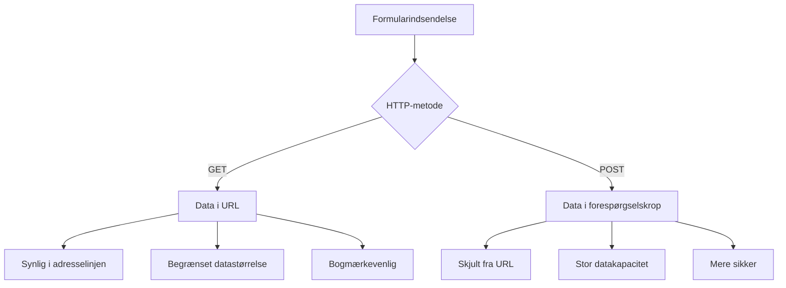
**Forstå forskellene:**

| Metode | Anvendelse | Data Placering | Sikkerhedsniveau | Størrelsesgrænse |
|--------|------------|---------------|------------------|------------------|
| `GET`  | Søgeforespørgsler, filtre | URL-parametre | Lav (synlig) | ~2000 tegn |
| `POST` | Bruger-konti, sensitive data | Request body | Højere (skjult) | Ingen praktisk grænse |

**Fundamentale forskelle forklaret:**
- **GET**: Tilføjer formularens data til URL’en som query-parametre (passende til søgninger)
- **POST**: Inkluderer data i request-body (nødvendigt for følsomme oplysninger)
- **GET begrænsninger**: Størrelsesgrænser, synlige data, gemmes i browserhistorik
- **POST fordele**: Stor datakapacitet, privatlivsbeskyttelse, understøtter filupload

> 💡 **Bedste praksis**: Brug `GET` til søgeformularer og filtre (datahentning), brug `POST` til brugerregistrering, login og dataoprettelse.

### Konfigurering af Formularafsendelse

Lad os sætte din registreringsformular til at kommunikere korrekt med backend API’en ved brug af POST metoden:

```html
<form id="registerForm" action="//localhost:5000/api/accounts" 
      method="POST" novalidate>
```

**Dette gør konfigurationen:**
- **Sender** formularafsendelsen til din API endpoint
- **Bruger** POST metode til sikker dataoverførsel
- **Indeholder** `novalidate` for at håndtere validering via JavaScript

### Test af Formularafsendelse

**Følg disse trin for at teste din formular:**
1. **Udfyld** registreringsformularen med dine oplysninger
2. **Klik** på "Opret Konto" knappen
3. **Observer** serverens svar i din browser

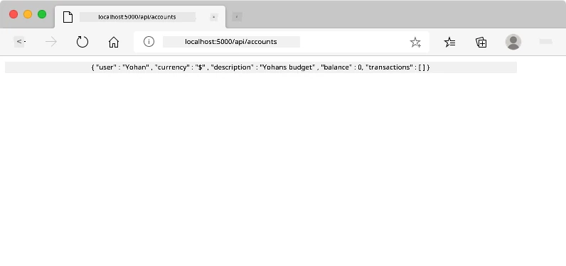

**Det du bør se:**
- **Browseren omdirigerer** til API endpoint URL’en
- **JSON svar** indeholdende dine nyoprettede kontooplysninger
- **Serverbekræftelse** på at kontoen blev oprettet succesfuldt

> 🧪 **Eksperiment tid**: Prøv at registrere igen med samme brugernavn. Hvilket svar får du? Det hjælper dig med at forstå, hvordan serveren håndterer dublerede data og fejltilstande.

### Forståelse af JSON-svar

**Når serveren behandler din formular succesfuldt:**
```json
{
  "user": "john_doe",
  "currency": "$",
  "description": "Personal savings",
  "balance": 100,
  "id": "unique_account_id"
}
```

**Dette svar bekræfter:**
- **Opretter** en ny konto med de angivne data
- **Tildeler** et unikt ID til fremtidig reference
- **Returnerer** alle kontooplysninger til verifikation
- **Indikerer** vellykket databasegemning

## Moderne Formularhåndtering med JavaScript

Traditionelle formularafsendelser medfører fuld side-genindlæsning, ligesom tidlige rumfartsmissioner krævede komplette systemresets for kurskorrektioner. Denne tilgang forstyrrer brugeroplevelsen og mister applikationens tilstand.

JavaScript formularhåndtering fungerer som de kontinuerlige guidance-systemer brugt af moderne rumfartøjer – foretager realtidsjusteringer uden at miste navigationskontekst. Vi kan afbryde formularafsendelser, give øjeblikkelig feedback, håndtere fejl elegant og opdatere brugergrænsefladen baseret på serverresponser, samtidig med at brugerens placering i applikationen bevares.

### Hvorfor undgå side-genindlæsninger?

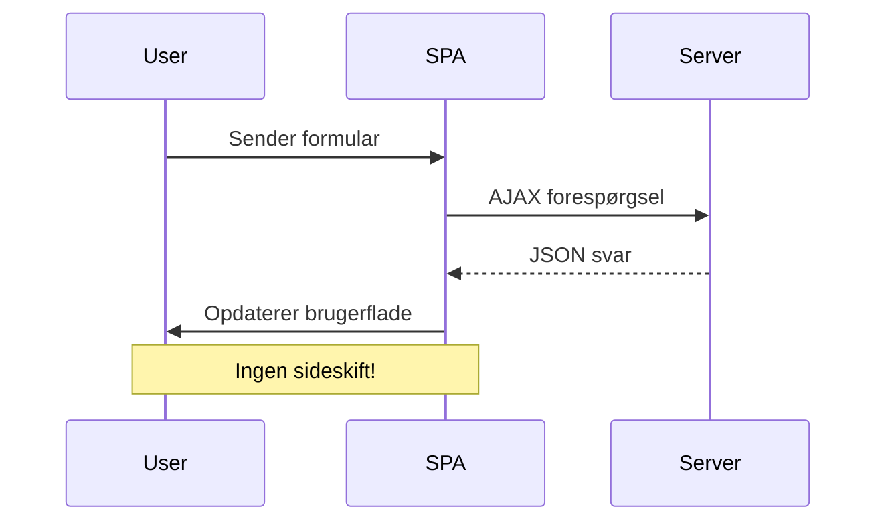
**Fordele ved JavaScript formularhåndtering:**
- **Bevarer** applikationens tilstand og brugerens kontekst
- **Giver** hurtig feedback og loaderindikatorer
- **Muliggør** dynamisk fejlbehandling og validering
- **Skaber** glatte, app-lignende brugeroplevelser
- **Tillader** betinget logik baseret på serverresponser

### Overgang fra Traditionelle til Moderne Formularer

**Udfordringer ved traditionel tilgang:**
- **Sender** brugere væk fra din applikation
- **Mister** nuværende applikationsstatus og kontekst
- **Kræver** fuld sidegenindlæsning for simple operationer
- **Giver** begrænset kontrol over brugerfeedback

**Fordele ved moderne JavaScript tilgang:**
- **Holder** brugere indenfor din applikation
- **Bevarer** al applikationsstatus og data
- **Muliggør** realtidsvalidering og feedback
- **Understøtter** progressiv forbedring og tilgængelighed

### Implementering af JavaScript Formularhåndtering

Lad os erstatte den traditionelle formularafsendelse med moderne JavaScript event-håndtering:

```html
<!-- Remove the action attribute and add event handling -->
<form id="registerForm" method="POST" novalidate>
```

**Tilføj registreringslogikken til din `app.js` fil:**

```javascript
// Moderne hændelsesdrevet formularhåndtering
function register() {
  const registerForm = document.getElementById('registerForm');
  const formData = new FormData(registerForm);
  const data = Object.fromEntries(formData);
  const jsonData = JSON.stringify(data);
  
  console.log('Form data prepared:', data);
}

// Tilføj hændelseslytter når siden indlæses
document.addEventListener('DOMContentLoaded', () => {
  const registerForm = document.getElementById('registerForm');
  registerForm.addEventListener('submit', (event) => {
    event.preventDefault(); // Forhindre standard formularindsendelse
    register();
  });
});
```

**Dette sker her:**
- **Forhindrer** standard formularafsendelse med `event.preventDefault()`
- **Henter** formular-elementet vha. moderne DOM-selektion
- **Udtrækker** formdata med den kraftfulde `FormData` API
- **Konverterer** FormData til et almindeligt objekt med `Object.fromEntries()`
- **Serialiserer** data til JSON-format for serverkommunikation
- **Logger** de behandlede data til debugging og verifikation

### Forståelse af FormData API

**FormData API'en tilbyder kraftfuld formularhåndtering:**
```javascript
// Eksempel på hvad FormData indsamler
const formData = new FormData(registerForm);

// FormData indsamler automatisk:
// {
//   "user": "john_doe",
//   "currency": "$",
//   "description": "Personlig konto",
//   "balance": "100"
// }
```

**Fordele ved FormData API:**
- **Omfattende indsamling**: Fanger alle formelementer inklusive tekst, filer og komplekse input
- **Typebevidsthed**: Håndterer automatisk forskellige inputtyper uden specialkodning
- **Effektivitet**: Eliminierer manuel feltindsamling med ét API-kald
- **Tilpasningsevne**: Opretholder funktionalitet, mens formstrukturen udvikler sig

### Oprettelse af serverkommunikationsfunktionen

Lad os nu bygge en robust funktion til kommunikation med din API-server ved at bruge moderne JavaScript-mønstre:

```javascript
async function createAccount(account) {
  try {
    const response = await fetch('//localhost:5000/api/accounts', {
      method: 'POST',
      headers: { 
        'Content-Type': 'application/json',
        'Accept': 'application/json'
      },
      body: account
    });
    
    // Kontroller, om svaret var vellykket
    if (!response.ok) {
      throw new Error(`HTTP error! status: ${response.status}`);
    }
    
    return await response.json();
  } catch (error) {
    console.error('Account creation failed:', error);
    return { error: error.message || 'Network error occurred' };
  }
}
```

**Forståelse af asynkron JavaScript:**

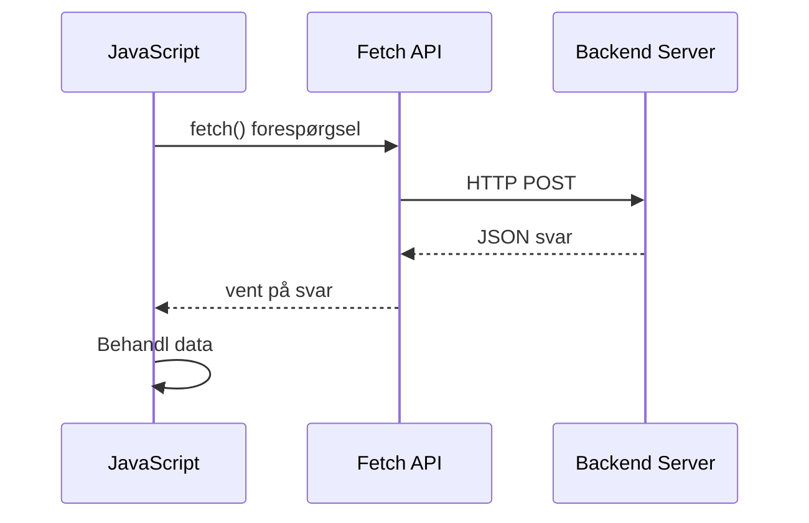
**Hvad denne moderne implementering opnår:**
- **Bruger** `async/await` for læsbar asynkron kode
- **Inkluderer** korrekt fejlhåndtering med try/catch-blokke
- **Tjekker** responstatus før behandling af data
- **Sætter** passende headers for JSON-kommunikation
- **Giver** detaljerede fejlmeddelelser til fejlfinding
- **Returnerer** konsekvent datastruktur for succes- og fejlsituationer

### Kraften i moderne Fetch API

**Fordele ved Fetch API i forhold til ældre metoder:**

| Funktion | Fordel | Implementering |
|---------|---------|----------------|
| Promise-baseret | Ren asynkron kode | `await fetch()` |
| Tilpasning af forespørgsler | Fuld HTTP-kontrol | Headers, metoder, body |
| Håndtering af svar | Fleksibel dataparsering | `.json()`, `.text()`, `.blob()` |
| Fejlhåndtering | Omfattende fejlfangst | Try/catch-blokke |

> 🎥 **Lær mere**: [Async/Await Tutorial](https://youtube.com/watch?v=YwmlRkrxvkk) - Forstå asynkrone JavaScript-mønstre til moderne webudvikling.

**Nøglekoncepter til serverkommunikation:**
- **Async-funktioner** tillader at pause kørsel for at vente på serversvar
- **Await-nøgleordet** får asynkron kode til at læse som synkron kode
- **Fetch API** leverer moderne, promise-baserede HTTP-forespørgsler
- **Fejlhåndtering** sikrer, at din app reagerer elegant på netværksproblemer

### Afslutning af registreringsfunktionen

Lad os samle det hele med en komplet, produktionsklar registreringsfunktion:

```javascript
async function register() {
  const registerForm = document.getElementById('registerForm');
  const submitButton = registerForm.querySelector('button[type="submit"]');
  
  try {
    // Vis indlæsningsstatus
    submitButton.disabled = true;
    submitButton.textContent = 'Creating Account...';
    
    // Behandl formular data
    const formData = new FormData(registerForm);
    const jsonData = JSON.stringify(Object.fromEntries(formData));
    
    // Send til server
    const result = await createAccount(jsonData);
    
    if (result.error) {
      console.error('Registration failed:', result.error);
      alert(`Registration failed: ${result.error}`);
      return;
    }
    
    console.log('Account created successfully!', result);
    alert(`Welcome, ${result.user}! Your account has been created.`);
    
    // Nulstil formular efter vellykket registrering
    registerForm.reset();
    
  } catch (error) {
    console.error('Unexpected error:', error);
    alert('An unexpected error occurred. Please try again.');
  } finally {
    // Gendan knapstatus
    submitButton.disabled = false;
    submitButton.textContent = 'Create Account';
  }
}
```

**Denne forbedrede implementering inkluderer:**
- **Giver** visuel feedback under formularindsendelse
- **Deaktiverer** submit-knappen for at forhindre dobbelte indsendelser
- **Håndterer** både forventede og uventede fejl på en pæn måde
- **Viser** brugervenlige succes- og fejlmeddelelser
- **Nulstiller** formularen efter succesfuld registrering
- **Genskaber** UI-tilstand uanset resultat

### Test af din implementering

**Åbn browserens udviklerværktøjer og test registreringen:**

1. **Åbn** browserkonsollen (F12 → Konsol-fanen)
2. **Udfyld** registreringsformularen
3. **Klik** på "Opret konto"
4. **Observer** konsolmeddelelser og brugerfeedback

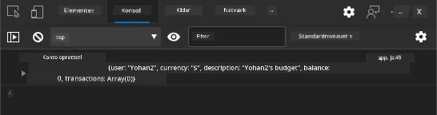

**Det du bør se:**
- **Indlæsningsstatus** vises på submit-knappen
- **Konsollogs** viser detaljerede oplysninger om processen
- **Succesmeddelelse** vises, når kontooprettelse lykkes
- **Formularen nulstilles** automatisk efter vellykket indsendelse

> 🔒 **Sikkerhedsovervejelse**: Data sendes i øjeblikket over HTTP, hvilket ikke er sikkert i produktion. I virkelige applikationer skal du altid bruge HTTPS for at kryptere datatransmission. Læs mere om [HTTPS-sikkerhed](https://en.wikipedia.org/wiki/HTTPS) og hvorfor det er essentielt for at beskytte brugerdata.

### 🔄 **Pædagogisk check-in**
**Moderne JavaScript-integration**: Bekræft din forståelse af asynkron formularhåndtering:
- ✅ Hvordan ændrer `event.preventDefault()` standardformularadfærd?
- ✅ Hvorfor er FormData API mere effektiv end manuel feltindsamling?
- ✅ Hvordan forbedrer async/await-mønstre kode-læsbarheden?
- ✅ Hvilken rolle spiller fejlhåndtering i brugeroplevelsen?

**Systemarkitektur**: Din formularhåndtering demonstrerer:
- **Event-Driven Programming**: Formularer reagerer på brugerhandlinger uden sideopdatering
- **Asynkron kommunikation**: Serverforespørgsler blokerer ikke brugergrænsefladen
- **Fejlhåndtering**: Pæn nedtrapning når netværksforespørgsler fejler
- **State Management**: UI-opdateringer afspejler serversvar korrekt
- **Progressive Enhancement**: Basisfunktionalitet virker, JavaScript forbedrer den

**Professionelle mønstre**: Du har implementeret:
- **Single Responsibility**: Funktioner har klare, fokuserede formål
- **Error Boundaries**: Try/catch-blokke forhindrer applikationsnedbrud
- **Brugerfeedback**: Indlæsningsstatus og succes-/fejlmeddelelser
- **Data Transformation**: FormData til JSON for serverkommunikation

## Omfattende formvalidering

Formvalidering forhindrer den frustrerende oplevelse at opdage fejl først efter indsendelse. Ligesom de mange redundante systemer på den internationale rumstation anvender effektiv validering flere lag af sikkerhedstjek.

Den optimale tilgang kombinerer browserbaseret validering for øjeblikkelig feedback, JavaScript-validering for forbedret brugeroplevelse og servervalidering for sikkerhed og dataintegritet. Denne redundans sikrer både brugerens tilfredshed og systemets beskyttelse.

### Forstå valideringslag

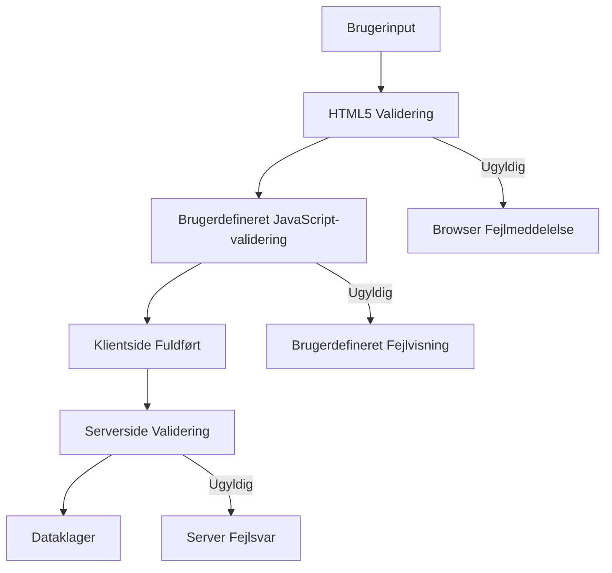
**Strategi med flere lag validering:**
- **HTML5-validering**: Øjeblikkelige browserbaserede tjek
- **JavaScript-validering**: Egen logik og brugeroplevelse
- **Servervalidering**: Endelig sikkerheds- og dataintegritetskontrol
- **Progressiv forbedring**: Fungerer selv hvis JavaScript er deaktiveret

### HTML5 valideringsattributter

**Moderne valideringsværktøjer til rådighed:**

| Attribut | Formål | Eksempelbrug | Browseradfærd |
|-----------|---------|---------------|------------------|
| `required` | Obligatoriske felter | `<input required>` | Forhindrer tom indsendelse |
| `minlength`/`maxlength` | Tekstlængdebegrænsninger | `<input maxlength="20">` | Håndhæver tegnbegrænsninger |
| `min`/`max` | Numeriske intervaller | `<input min="0" max="1000">` | Validerer talgrænser |
| `pattern` | Egen regex-regler | `<input pattern="[A-Za-z]+">` | Matcher specifikke formater |
| `type` | Datatypevalidering | `<input type="email">` | Format-specifik validering |

### CSS valideringsstyling

**Skab visuel feedback for valideringsstatus:**

```css
/* Valid input styling */
input:valid {
  border-color: #28a745;
  background-color: #f8fff9;
}

/* Invalid input styling */
input:invalid {
  border-color: #dc3545;
  background-color: #fff5f5;
}

/* Focus states for better accessibility */
input:focus:valid {
  box-shadow: 0 0 0 0.2rem rgba(40, 167, 69, 0.25);
}

input:focus:invalid {
  box-shadow: 0 0 0 0.2rem rgba(220, 53, 69, 0.25);
}
```

**Hvad disse visuelle signaler opnår:**
- **Grønne kanter**: Angiver vellykket validering, som grønne lys i mission control
- **Røde kanter**: Indikerer valideringsfejl der kræver opmærksomhed
- **Fokusfremhævninger**: Giver klar visuel kontekst for nuværende inputsted
- **Konsistent styling**: Etablerer forudsigelige interface-mønstre brugere kan lære

> 💡 **Pro Tip**: Brug CSS pseudo-klasserne `:valid` og `:invalid` for at give øjeblikkelig visuel feedback under indtastning og skabe en responsiv og hjælpsom brugerflade.

### Implementering af omfattende validering

Lad os forbedre din registreringsformular med robust validering, der giver fremragende brugeroplevelse og datakvalitet:

```html
<form id="registerForm" method="POST" novalidate>
  <div class="form-group">
    <label for="user">Username <span class="required">*</span></label>
    <input id="user" name="user" type="text" required 
           minlength="3" maxlength="20" 
           pattern="[a-zA-Z0-9_]+" 
           autocomplete="username"
           title="Username must be 3-20 characters, letters, numbers, and underscores only">
    <small class="form-text">Choose a unique username (3-20 characters)</small>
  </div>
  
  <div class="form-group">
    <label for="currency">Currency <span class="required">*</span></label>
    <input id="currency" name="currency" type="text" required 
           value="$" maxlength="3" 
           pattern="[A-Z$€£¥₹]+" 
           title="Enter a valid currency symbol or code">
    <small class="form-text">Currency symbol (e.g., $, €, £)</small>
  </div>
  
  <div class="form-group">
    <label for="description">Account Description</label>
    <input id="description" name="description" type="text" 
           maxlength="100" 
           placeholder="Personal savings, checking, etc.">
    <small class="form-text">Optional description (up to 100 characters)</small>
  </div>
  
  <div class="form-group">
    <label for="balance">Starting Balance</label>
    <input id="balance" name="balance" type="number" 
           value="0" min="0" step="0.01" 
           title="Enter a positive number for your starting balance">
    <small class="form-text">Initial account balance (minimum $0.00)</small>
  </div>
  
  <button type="submit">Create Account</button>
</form>
```

**Forstå den udvidede validering:**
- **Kombinerer** obligatoriske felter med hjælpetekster
- **Inkluderer** `pattern`-attributter til formatvalidering
- **Giver** `title`-attributter til tilgængelighed og tooltips
- **Tilføjer** hjælpetekst til at guide brugerinput
- **Bruger** semantisk HTML-struktur for bedre tilgængelighed

### Avancerede valideringsregler

**Hvad hver valideringsregel opnår:**

| Felt | Valideringsregler | Brugerfordel |
|-------|------------------|--------------|
| Brugernavn | `required`, `minlength="3"`, `maxlength="20"`, `pattern="[a-zA-Z0-9_]+"` | Sikrer gyldige, unikke identifikatorer |
| Valuta | `required`, `maxlength="3"`, `pattern="[A-Z$€£¥₹]+"` | Accepterer almindelige valutasymboler |
| Saldo | `min="0"`, `step="0.01"`, `type="number"` | Forhindrer negative saldi |
| Beskrivelse | `maxlength="100"` | Rimelige længdebegrænsninger |

### Test valideringsadfærd

**Prøv disse valideringsscenarier:**
1. **Indsend** formularen med tomme obligatoriske felter
2. **Indtast** et brugernavn kortere end 3 tegn
3. **Prøv** specialtegn i brugernavnfeltet
4. **Indtast** et negativt beløb i saldo-feltet

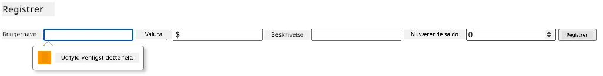

**Det du vil observere:**
- **Browseren viser** native valideringsmeddelelser
- **Stylingen ændres** baseret på `:valid` og `:invalid` tilstande
- **Formularindsendelse** blokeres, indtil alle valideringer er bestået
- **Fokus flyttes automatisk** til det første ugyldige felt

### Klientside vs serverside validering

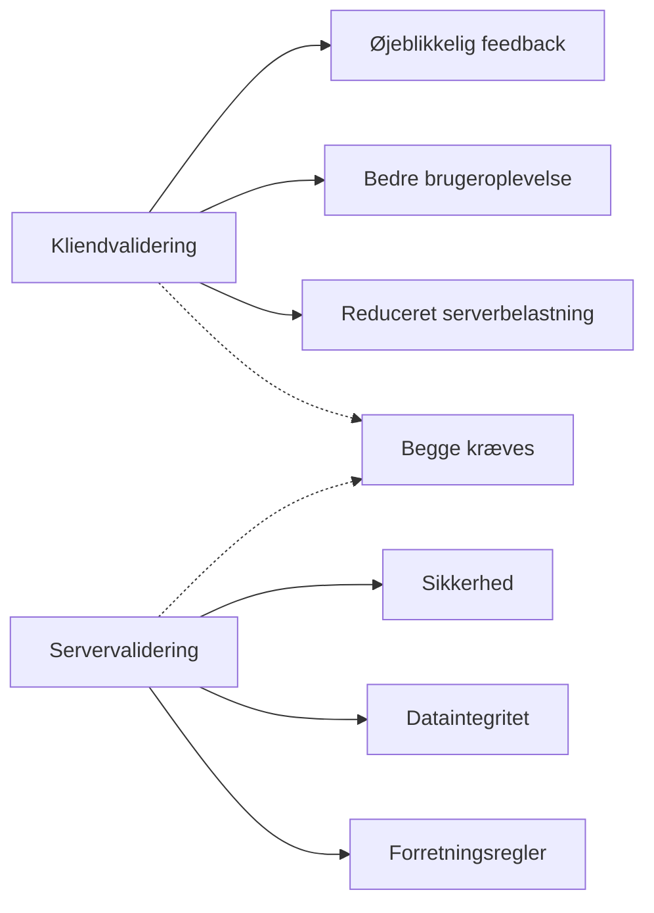
**Hvorfor du har brug for begge lag:**
- **Klientsidevalidering**: Giver øjeblikkelig feedback og forbedrer brugeroplevelsen
- **Serversidevalidering**: Sikrer sikkerhed og håndterer komplekse forretningsregler
- **Kombineret tilgang**: Skaber robuste, brugervenlige og sikre applikationer
- **Progressiv forbedring**: Fungerer også når JavaScript er deaktiveret

> 🛡️ **Sikkerhedspåmindelse**: Stol aldrig kun på klientsidevalidering! Ondsindede brugere kan omgå disse tjek, så serversidevalidering er essentiel for sikkerhed og dataintegritet.

### ⚡ **Hvad du kan gøre på de næste 5 minutter**
- [ ] Test din formular med ugyldige data for at se valideringsmeddelelser
- [ ] Prøv at indsende formularen med deaktiveret JavaScript for at se HTML5-validering
- [ ] Åbn browserens DevTools og undersøg formdata sendt til serveren
- [ ] Eksperimenter med forskellige inputtyper og se tastaturændringer på mobil

### 🎯 **Hvad du kan opnå denne time**
- [ ] Gennemfør quizzen efter lektionen og forstå formhåndteringskoncepter
- [ ] Implementer omfattende valideringsudfordring med realtidsfeedback
- [ ] Tilføj CSS-styling for professionelt udseende formularer
- [ ] Opret fejlhåndtering for dublerede brugernavne og serverfejl
- [ ] Tilføj felter til bekræftelse af adgangskode med matchede valideringer

### 📅 **Din ugelange form-mestre rejse**
- [ ] Færdiggør hele bankappen med avancerede formfunktioner
- [ ] Implementer funktion til filupload til profilbilleder eller dokumenter
- [ ] Tilføj flertrinsformularer med fremdriftsindikatorer og tilstandsstyring
- [ ] Opret dynamiske formularer, der tilpasser sig brugerens valg
- [ ] Implementer autosave og genopretning af formularer for bedre brugeroplevelse
- [ ] Tilføj avanceret validering som e-mailverifikation og telefonnummerformatering

### 🌟 **Din månedslange frontend-udviklingsmester**
- [ ] Byg komplekse formapplikationer med betinget logik og workflows
- [ ] Lær formbiblioteker og frameworks til hurtig udvikling
- [ ] Mestre tilgængelighedsrutiner og inklusiv designprincipper
- [ ] Implementer internationalisering og lokalisering til globale formularer
- [ ] Opret genanvendelige formkomponentbiblioteker og designsystemer
- [ ] Bidrag til open source formprojekter og del bedste praksis

## 🎯 Din tidslinje for formudviklingsekspertise

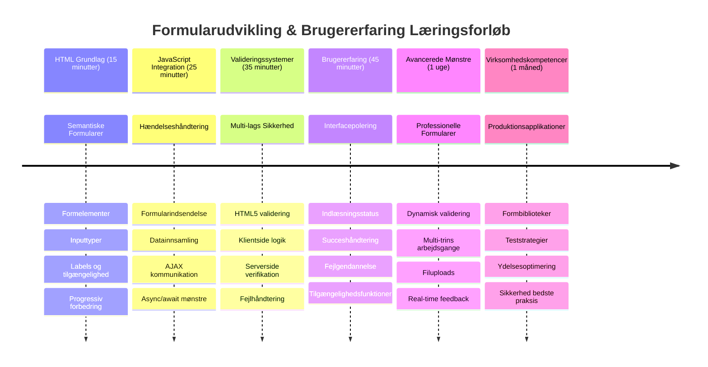
### 🛠️ Dit resumé af værktøjskassen til formudvikling

Efter at have gennemført denne lektion har du nu mestret:
- **HTML5-forms**: Semantisk struktur, inputtyper og tilgængelighedsfunktioner
- **JavaScript formhåndtering**: Eventhåndtering, dataindsamling og AJAX-kommunikation
- **Valideringsarkitektur**: Flersidet validering for sikkerhed og brugeroplevelse
- **Asynkron programmering**: Moderne fetch API og async/await-mønstre
- **Fejlhåndtering**: Omfattende håndtering af fejl og brugerfeedbacksystemer
- **Brugeroplevelsesdesign**: Indlæsningsstatus, succesbeskeder og fejlgenskabelse
- **Progressiv forbedring**: Formularer der virker på tværs af browsere og kapabiliteter

**Anvendelser i virkeligheden**: Dine formudviklingsfærdigheder gælder direkte for:
- **E-handel**: Checkout-processer, kontoregistrering og betalingsformularer
- **Virksomhedssoftware**: Dataindtastningssystemer, rapporteringsinterfaces og workflow-applikationer
- **Content Management**: Publiceringsplatforme, brugergenereret indhold og administrationsinterfaces
- **Finansielle applikationer**: Bankgrænseflader, investeringsplatforme og transaktionssystemer
- **Sundhedssystemer**: Patientportaler, aftalebooking og medicinske formularer
- **Uddannelsesplatforme**: Kursustilmelding, vurderingsværktøjer og læringsstyring

**Professionelle færdigheder opnået**: Du kan nu:
- **Designe** tilgængelige formularer der virker for alle brugere inklusive handicappede
- **Implementere** sikker formvalidering der hindrer datakorruption og sikkerhedsbrud
- **Skabe** responsive brugergrænseflader med klar feedback og vejledning
- **Fejlsøge** komplekse forminteraktioner med browserdevtools og netværksanalyse
- **Optimere** formperformance via effektiv datahåndtering og valideringsstrategier

**Frontend-udviklingskoncepter mestret**:
- **Event-drevet arkitektur**: Håndtering af brugerinteraktion og responssystemer
- **Asynkron programmering**: Ikke-blokerende serverkommunikation og fejlhåndtering
- **Datavalidering**: Klientside- og serversidesikkerhed og integritetskontrol
- **Brugeroplevelsesdesign**: Intuitive interfaces der guider brugerne til succes
- **Tilgængelighedsteknik**: Inklusivt design der fungerer for forskellige brugerbehov

**Næste niveau**: Du er klar til at udforske avancerede formbiblioteker, implementere komplekse valideringsregler eller bygge datainnsamlingssystemer i virksomhedsstandard!

🌟 **Bedrift opnået**: Du har bygget et komplet formhåndteringssystem med professionel validering, fejlhåndtering og brugeroplevelsesmønstre!

---


---

## GitHub Copilot Agent Challenge 🚀

Brug agent-tilstand til at fuldføre følgende udfordring:

**Beskrivelse:** Forbedr registreringsformularen med omfattende klientsidevalidering og brugerfeedback. Denne udfordring hjælper dig med at øve formvalidering, fejlhåndtering og forbedring af brugeroplevelsen med interaktiv feedback.
**Prompt:** Opret et komplet valideringssystem for registreringsformularen, der inkluderer: 1) Realtidsvalideringsfeedback for hvert felt, mens brugeren skriver, 2) Egne valideringsbeskeder, som vises under hvert inputfelt, 3) Et bekræftelsesfelt for kodeord med validering af match, 4) Visuelle indikatorer (som grønne flueben for gyldige felter og røde advarsler for ugyldige), 5) En knap til indsendelse, som kun aktiveres, når alle valideringer passer. Brug HTML5-valideringsattributter, CSS til styling af valideringstilstande og JavaScript til den interaktive funktionalitet.

Lær mere om [agent mode](https://code.visualstudio.com/blogs/2025/02/24/introducing-copilot-agent-mode) her.

## 🚀 Udfordring

Vis en fejlmeddelelse i HTML, hvis brugeren allerede eksisterer.

Her er et eksempel på, hvordan den endelige login-side kan se ud efter lidt styling:

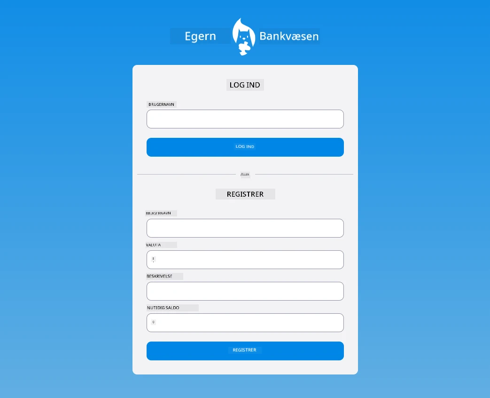

## Post-Lecture Quiz

[Post-lecture quiz](https://ff-quizzes.netlify.app/web/quiz/44)

## Gennemgang & Selvstudie

Udviklere er blevet meget kreative med deres formbygning, især med hensyn til valideringsstrategier. Lær om forskellige formflows ved at kigge gennem [CodePen](https://codepen.com); kan du finde nogle interessante og inspirerende formularer?

## Opgave

[Style din bankapp](assignment.md)

---

<!-- CO-OP TRANSLATOR DISCLAIMER START -->
**Ansvarsfraskrivelse**:
Dette dokument er blevet oversat ved hjælp af AI-oversættelsestjenesten [Co-op Translator](https://github.com/Azure/co-op-translator). Selvom vi bestræber os på nøjagtighed, skal du være opmærksom på, at automatiserede oversættelser kan indeholde fejl eller unøjagtigheder. Det oprindelige dokument på dets oprindelige sprog bør betragtes som den autoritative kilde. For vigtig information anbefales professionel menneskelig oversættelse. Vi påtager os intet ansvar for eventuelle misforståelser eller fejltolkninger, der opstår ved brug af denne oversættelse.
<!-- CO-OP TRANSLATOR DISCLAIMER END -->