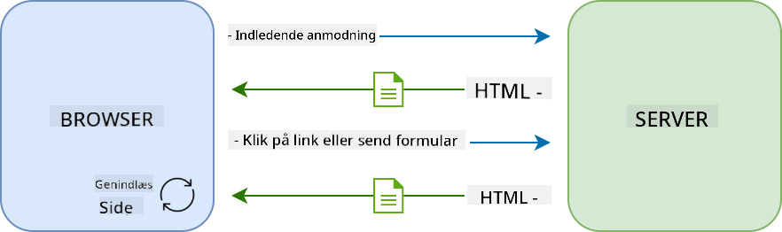
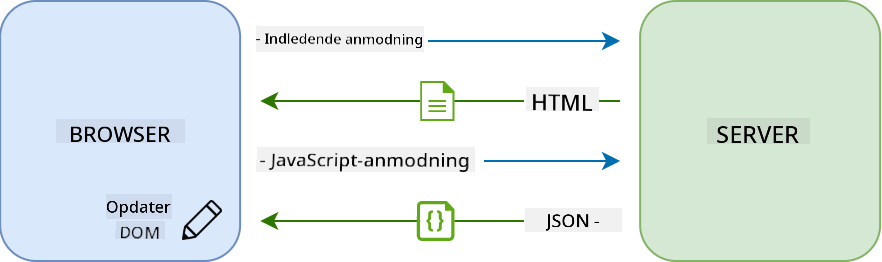
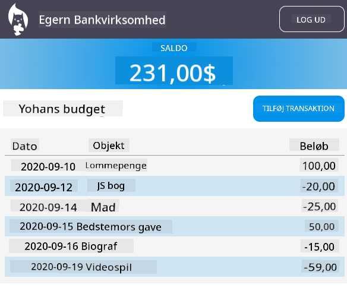

<!--
CO_OP_TRANSLATOR_METADATA:
{
  "original_hash": "f587e913e3f7c0b1c549a05dd74ee8e5",
  "translation_date": "2025-08-26T23:01:35+00:00",
  "source_file": "7-bank-project/3-data/README.md",
  "language_code": "da"
}
-->
# Byg en Bankapp Del 3: Metoder til Hentning og Brug af Data

## Quiz før forelæsning

[Quiz før forelæsning](https://ashy-river-0debb7803.1.azurestaticapps.net/quiz/45)

### Introduktion

Kernen i enhver webapplikation er *data*. Data kan have mange former, men dens hovedformål er altid at vise information til brugeren. Med webapps, der bliver stadig mere interaktive og komplekse, er måden, brugeren tilgår og interagerer med information på, nu en vigtig del af webudvikling.

I denne lektion vil vi se, hvordan man henter data fra en server asynkront og bruger disse data til at vise information på en webside uden at genindlæse HTML'en.

### Forudsætninger

Du skal have bygget [Login- og Registreringsformularen](../2-forms/README.md) som en del af webappen for denne lektion. Du skal også installere [Node.js](https://nodejs.org) og [køre server-API'et](../api/README.md) lokalt, så du kan få kontodata.

Du kan teste, om serveren kører korrekt, ved at udføre denne kommando i en terminal:

```sh
curl http://localhost:5000/api
# -> should return "Bank API v1.0.0" as a result
```

---

## AJAX og datahentning

Traditionelle websites opdaterer det viste indhold, når brugeren vælger et link eller sender data via en formular, ved at genindlæse hele HTML-siden. Hver gang nye data skal indlæses, returnerer webserveren en helt ny HTML-side, som skal behandles af browseren, hvilket afbryder den aktuelle brugerhandling og begrænser interaktioner under genindlæsningen. Denne arbejdsgang kaldes også en *Multi-Page Application* eller *MPA*.



Da webapplikationer begyndte at blive mere komplekse og interaktive, opstod en ny teknik kaldet [AJAX (Asynchronous JavaScript and XML)](https://en.wikipedia.org/wiki/Ajax_(programming)). Denne teknik gør det muligt for webapps at sende og hente data fra en server asynkront ved hjælp af JavaScript, uden at skulle genindlæse HTML-siden, hvilket resulterer i hurtigere opdateringer og mere glidende brugerinteraktioner. Når nye data modtages fra serveren, kan den aktuelle HTML-side også opdateres med JavaScript ved hjælp af [DOM](https://developer.mozilla.org/docs/Web/API/Document_Object_Model)-API'en. Over tid har denne tilgang udviklet sig til det, der nu kaldes en [*Single-Page Application* eller *SPA*](https://en.wikipedia.org/wiki/Single-page_application).



Da AJAX først blev introduceret, var den eneste API tilgængelig for asynkron datahentning [`XMLHttpRequest`](https://developer.mozilla.org/docs/Web/API/XMLHttpRequest/Using_XMLHttpRequest). Men moderne browsere implementerer nu også den mere praktiske og kraftfulde [`Fetch` API](https://developer.mozilla.org/docs/Web/API/Fetch_API), som bruger promises og er bedre egnet til at manipulere JSON-data.

> Selvom alle moderne browsere understøtter `Fetch API`, er det altid en god idé at tjekke [kompatibilitetstabellen på caniuse.com](https://caniuse.com/fetch), hvis du vil have din webapplikation til at fungere på ældre browsere.

### Opgave

I [den forrige lektion](../2-forms/README.md) implementerede vi registreringsformularen for at oprette en konto. Nu vil vi tilføje kode til at logge ind med en eksisterende konto og hente dens data. Åbn filen `app.js` og tilføj en ny `login`-funktion:

```js
async function login() {
  const loginForm = document.getElementById('loginForm')
  const user = loginForm.user.value;
}
```

Her starter vi med at hente formular-elementet med `getElementById()`, og derefter får vi brugernavnet fra inputfeltet med `loginForm.user.value`. Hvert formularfelt kan tilgås via dets navn (sat i HTML med attributten `name`) som en egenskab af formularen.

På samme måde som vi gjorde for registreringen, vil vi oprette en anden funktion til at udføre en serverforespørgsel, men denne gang for at hente kontodata:

```js
async function getAccount(user) {
  try {
    const response = await fetch('//localhost:5000/api/accounts/' + encodeURIComponent(user));
    return await response.json();
  } catch (error) {
    return { error: error.message || 'Unknown error' };
  }
}
```

Vi bruger `fetch`-API'et til at anmode om data asynkront fra serveren, men denne gang behøver vi ikke andre parametre end URL'en, da vi kun forespørger data. Som standard opretter `fetch` en [`GET`](https://developer.mozilla.org/docs/Web/HTTP/Methods/GET) HTTP-forespørgsel, hvilket er det, vi søger her.

✅ `encodeURIComponent()` er en funktion, der undgår specialtegn i en URL. Hvilke problemer kunne vi muligvis få, hvis vi ikke kalder denne funktion og bruger `user`-værdien direkte i URL'en?

Lad os nu opdatere vores `login`-funktion til at bruge `getAccount`:

```js
async function login() {
  const loginForm = document.getElementById('loginForm')
  const user = loginForm.user.value;
  const data = await getAccount(user);

  if (data.error) {
    return console.log('loginError', data.error);
  }

  account = data;
  navigate('/dashboard');
}
```

Først, da `getAccount` er en asynkron funktion, skal vi matche den med nøgleordet `await` for at vente på serverresultatet. Som med enhver serverforespørgsel skal vi også håndtere fejltilfælde. For nu vil vi kun tilføje en logbesked for at vise fejlen og vende tilbage til det senere.

Derefter skal vi gemme dataene et sted, så vi senere kan bruge dem til at vise dashboard-information. Da variablen `account` endnu ikke eksisterer, opretter vi en global variabel til den øverst i vores fil:

```js
let account = null;
```

Efter brugerdataene er gemt i en variabel, kan vi navigere fra *login*-siden til *dashboard*-siden ved hjælp af funktionen `navigate()`, som vi allerede har.

Endelig skal vi kalde vores `login`-funktion, når loginformularen sendes, ved at ændre HTML'en:

```html
<form id="loginForm" action="javascript:login()">
```

Test, at alt fungerer korrekt ved at registrere en ny konto og forsøge at logge ind med den samme konto.

Før vi går videre til næste del, kan vi også fuldføre `register`-funktionen ved at tilføje dette nederst i funktionen:

```js
account = result;
navigate('/dashboard');
```

✅ Vidste du, at du som standard kun kan kalde server-API'er fra *samme domæne og port* som den webside, du ser? Dette er en sikkerhedsmekanisme, der håndhæves af browsere. Men vent, vores webapp kører på `localhost:3000`, mens server-API'et kører på `localhost:5000`. Hvorfor virker det? Ved at bruge en teknik kaldet [Cross-Origin Resource Sharing (CORS)](https://developer.mozilla.org/docs/Web/HTTP/CORS) er det muligt at udføre cross-origin HTTP-forespørgsler, hvis serveren tilføjer specielle headers til svaret, der tillader undtagelser for specifikke domæner.

> Lær mere om API'er ved at tage denne [lektion](https://docs.microsoft.com/learn/modules/use-apis-discover-museum-art/?WT.mc_id=academic-77807-sagibbon)

## Opdater HTML for at vise data

Nu hvor vi har brugerdataene, skal vi opdatere den eksisterende HTML for at vise dem. Vi ved allerede, hvordan man henter et element fra DOM'en, for eksempel ved hjælp af `document.getElementById()`. Når du har et baseelement, er her nogle API'er, du kan bruge til at ændre det eller tilføje underordnede elementer til det:

- Ved hjælp af egenskaben [`textContent`](https://developer.mozilla.org/docs/Web/API/Node/textContent) kan du ændre teksten i et element. Bemærk, at ændring af denne værdi fjerner alle elementets underordnede (hvis der er nogen) og erstatter det med den angivne tekst. Som sådan er det også en effektiv metode til at fjerne alle underordnede elementer af et givet element ved at tildele en tom streng `''` til det.

- Ved hjælp af [`document.createElement()`](https://developer.mozilla.org/docs/Web/API/Document/createElement) sammen med metoden [`append()`](https://developer.mozilla.org/docs/Web/API/ParentNode/append) kan du oprette og vedhæfte et eller flere nye underordnede elementer.

✅ Ved hjælp af egenskaben [`innerHTML`](https://developer.mozilla.org/docs/Web/API/Element/innerHTML) for et element er det også muligt at ændre dets HTML-indhold, men denne bør undgås, da den er sårbar over for [cross-site scripting (XSS)](https://developer.mozilla.org/docs/Glossary/Cross-site_scripting)-angreb.

### Opgave

Før vi går videre til dashboard-skærmen, er der én ting mere, vi bør gøre på *login*-siden. I øjeblikket, hvis du forsøger at logge ind med et brugernavn, der ikke eksisterer, vises en besked i konsollen, men for en almindelig bruger ændres der ingenting, og du ved ikke, hvad der foregår.

Lad os tilføje et pladsholderelement i loginformularen, hvor vi kan vise en fejlmeddelelse, hvis det er nødvendigt. Et godt sted ville være lige før login-`<button>`:

```html
...
<div id="loginError"></div>
<button>Login</button>
...
```

Dette `<div>`-element er tomt, hvilket betyder, at der ikke vises noget på skærmen, før vi tilføjer noget indhold til det. Vi giver det også et `id`, så vi nemt kan hente det med JavaScript.

Gå tilbage til filen `app.js` og opret en ny hjælpefunktion `updateElement`:

```js
function updateElement(id, text) {
  const element = document.getElementById(id);
  element.textContent = text;
}
```

Denne er ret ligetil: givet et element-*id* og *tekst*, vil den opdatere tekstindholdet i DOM-elementet med det matchende `id`. Lad os bruge denne metode i stedet for den tidligere fejlmeddelelse i `login`-funktionen:

```js
if (data.error) {
  return updateElement('loginError', data.error);
}
```

Nu, hvis du forsøger at logge ind med en ugyldig konto, bør du se noget som dette:


Nu har vi en fejltekst, der vises visuelt, men hvis du prøver det med en skærmlæser, vil du bemærke, at der ikke bliver annonceret noget. For at tekst, der dynamisk tilføjes til en side, kan blive annonceret af skærmlæsere, skal den bruge noget, der kaldes en [Live Region](https://developer.mozilla.org/docs/Web/Accessibility/ARIA/ARIA_Live_Regions). Her vil vi bruge en specifik type live region kaldet en alert:

```html
<div id="loginError" role="alert"></div>
```

Implementer den samme adfærd for fejl i `register`-funktionen (husk at opdatere HTML'en).

## Vis information på dashboardet

Ved hjælp af de samme teknikker, vi lige har set, vil vi også tage os af at vise kontoinformationen på dashboard-siden.

Sådan ser et kontoobjekt modtaget fra serveren ud:

```json
{
  "user": "test",
  "currency": "$",
  "description": "Test account",
  "balance": 75,
  "transactions": [
    { "id": "1", "date": "2020-10-01", "object": "Pocket money", "amount": 50 },
    { "id": "2", "date": "2020-10-03", "object": "Book", "amount": -10 },
    { "id": "3", "date": "2020-10-04", "object": "Sandwich", "amount": -5 }
  ],
}
```

> Bemærk: for at gøre dit liv lettere kan du bruge den foruddefinerede `test`-konto, der allerede er fyldt med data.

### Opgave

Lad os starte med at erstatte sektionen "Balance" i HTML for at tilføje pladsholderelementer:

```html
<section>
  Balance: <span id="balance"></span><span id="currency"></span>
</section>
```

Vi tilføjer også en ny sektion lige nedenunder for at vise kontobeskrivelsen:

```html
<h2 id="description"></h2>
```

✅ Da kontobeskrivelsen fungerer som en titel for indholdet nedenunder, er den semantisk markeret som en overskrift. Lær mere om, hvordan [overskriftsstruktur](https://www.nomensa.com/blog/2017/how-structure-headings-web-accessibility) er vigtig for tilgængelighed, og tag et kritisk kig på siden for at afgøre, hvad der ellers kunne være en overskrift.

Derefter opretter vi en ny funktion i `app.js` for at udfylde pladsholderen:

```js
function updateDashboard() {
  if (!account) {
    return navigate('/login');
  }

  updateElement('description', account.description);
  updateElement('balance', account.balance.toFixed(2));
  updateElement('currency', account.currency);
}
```

Først tjekker vi, at vi har de kontodata, vi har brug for, før vi går videre. Derefter bruger vi funktionen `updateElement()`, som vi oprettede tidligere, til at opdatere HTML'en.

> For at gøre balancevisningen pænere bruger vi metoden [`toFixed(2)`](https://developer.mozilla.org/docs/Web/JavaScript/Reference/Global_Objects/Number/toFixed) for at sikre, at værdien vises med 2 decimaler.

Nu skal vi kalde vores `updateDashboard()`-funktion hver gang dashboardet indlæses. Hvis du allerede har afsluttet [lektion 1-opgaven](../1-template-route/assignment.md), bør dette være ligetil, ellers kan du bruge følgende implementering.

Tilføj denne kode til slutningen af funktionen `updateRoute()`:

```js
if (typeof route.init === 'function') {
  route.init();
}
```

Og opdater rute-definitionerne med:

```js
const routes = {
  '/login': { templateId: 'login' },
  '/dashboard': { templateId: 'dashboard', init: updateDashboard }
};
```

Med denne ændring kaldes funktionen `updateDashboard()` hver gang dashboard-siden vises. Efter login bør du derefter kunne se kontobalancen, valutaen og beskrivelsen.

## Opret tabelrækker dynamisk med HTML-skabeloner

I [den første lektion](../1-template-route/README.md) brugte vi HTML-skabeloner sammen med metoden [`appendChild()`](https://developer.mozilla.org/docs/Web/API/Node/appendChild) til at implementere navigationen i vores app. Skabeloner kan også være mindre og bruges til dynamisk at udfylde gentagne dele af en side.

Vi vil bruge en lignende tilgang til at vise listen over transaktioner i HTML-tabellen.

### Opgave

Tilføj en ny skabelon i HTML-`<body>`:

```html
<template id="transaction">
  <tr>
    <td></td>
    <td></td>
    <td></td>
  </tr>
</template>
```

Denne skabelon repræsenterer en enkelt tabelrække med de 3 kolonner, vi vil udfylde: *dato*, *objekt* og *beløb* for en transaktion.

Tilføj derefter denne `id`-egenskab til `<tbody>`-elementet i tabellen inden for dashboard-skabelonen for at gøre det lettere at finde med JavaScript:

```html
<tbody id="transactions"></tbody>
```

Vores HTML er klar, lad os skifte til JavaScript-kode og oprette en ny funktion `createTransactionRow`:

```js
function createTransactionRow(transaction) {
  const template = document.getElementById('transaction');
  const transactionRow = template.content.cloneNode(true);
  const tr = transactionRow.querySelector('tr');
  tr.children[0].textContent = transaction.date;
  tr.children[1].textContent = transaction.object;
  tr.children[2].textContent = transaction.amount.toFixed(2);
  return transactionRow;
}
```

Denne funktion gør præcis, hvad dens navn antyder: ved hjælp af skabelonen, vi oprettede tidligere, opretter den en ny tabelrække og udfylder dens indhold med transaktionsdata. Vi vil bruge denne i vores `updateDashboard()`-funktion til at udfylde tabellen:

```js
const transactionsRows = document.createDocumentFragment();
for (const transaction of account.transactions) {
  const transactionRow = createTransactionRow(transaction);
  transactionsRows.appendChild(transactionRow);
}
updateElement('transactions', transactionsRows);
```

Her bruger vi metoden [`document.createDocumentFragment()`](https://developer.mozilla.org/docs/Web/API/Document/createDocumentFragment), der opretter et nyt DOM-fragment, som vi kan arbejde på, før vi endelig vedhæfter det til vores HTML-tabel.

Der er stadig én ting, vi skal gøre, før denne kode kan fungere, da vores `updateElement()`-funktion i øjeblikket kun understøtter tekstindhold. Lad os ændre dens kode en smule:

```js
function updateElement(id, textOrNode) {
  const element = document.getElementById(id);
  element.textContent = ''; // Removes all children
  element.append(textOrNode);
}
```

Vi bruger metoden [`append()`](https://developer.mozilla.org/docs/Web/API/ParentNode/append), da den gør det muligt at vedhæfte enten tekst eller [DOM Nodes](https://developer.mozilla.org/docs/Web/API/Node) til et overordnet element, hvilket er perfekt til alle vores anvendelser.
Hvis du prøver at bruge `test`-kontoen til at logge ind, bør du nu se en transaktionsliste på dashboardet 🎉.

---

## 🚀 Udfordring

Arbejd sammen om at få dashboard-siden til at ligne en rigtig bankapp. Hvis du allerede har stylet din app, så prøv at bruge [media queries](https://developer.mozilla.org/docs/Web/CSS/Media_Queries) til at skabe et [responsivt design](https://developer.mozilla.org/docs/Web/Progressive_web_apps/Responsive/responsive_design_building_blocks), der fungerer godt både på desktop og mobile enheder.

Her er et eksempel på en stylet dashboard-side:



## Quiz efter forelæsning

[Quiz efter forelæsning](https://ashy-river-0debb7803.1.azurestaticapps.net/quiz/46)

## Opgave

[Refaktorer og kommenter din kode](assignment.md)

---

**Ansvarsfraskrivelse**:  
Dette dokument er blevet oversat ved hjælp af AI-oversættelsestjenesten [Co-op Translator](https://github.com/Azure/co-op-translator). Selvom vi bestræber os på at sikre nøjagtighed, skal det bemærkes, at automatiserede oversættelser kan indeholde fejl eller unøjagtigheder. Det originale dokument på dets oprindelige sprog bør betragtes som den autoritative kilde. For kritisk information anbefales professionel menneskelig oversættelse. Vi påtager os ikke ansvar for eventuelle misforståelser eller fejltolkninger, der måtte opstå som følge af brugen af denne oversættelse.