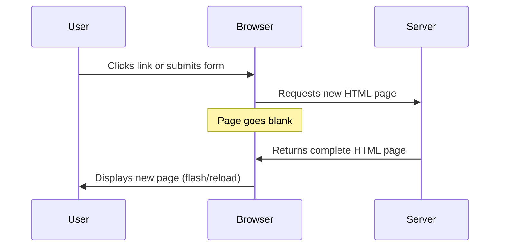
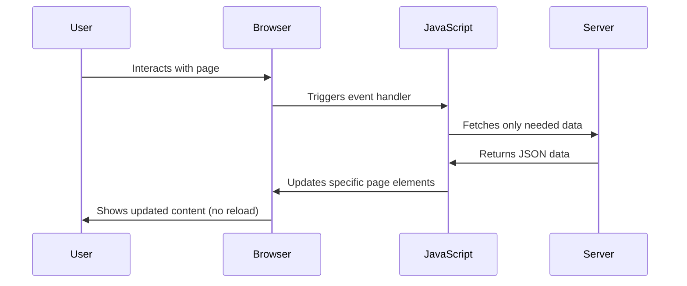
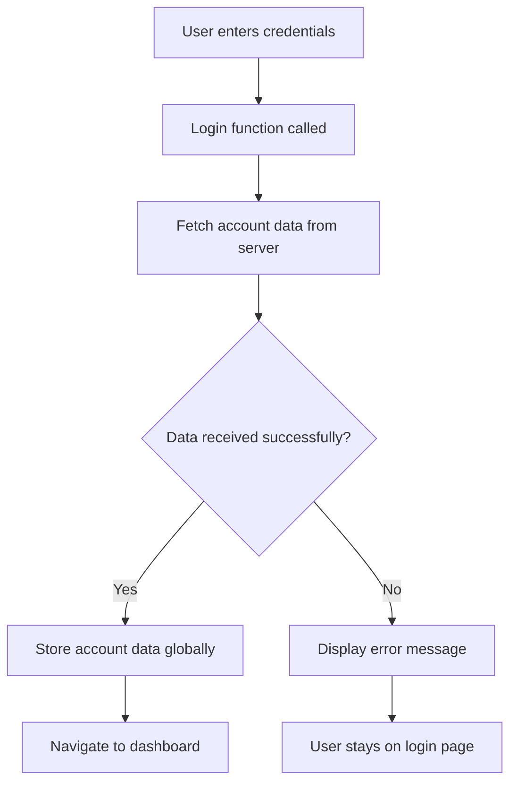
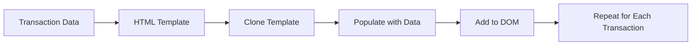

<!--
CO_OP_TRANSLATOR_METADATA:
{
  "original_hash": "2c1164912414820c8efd699b43f64954",
  "translation_date": "2025-10-23T22:05:43+00:00",
  "source_file": "7-bank-project/3-data/README.md",
  "language_code": "da"
}
-->
# Byg en bankapp del 3: Metoder til at hente og bruge data

Tænk på Enterprise's computer i Star Trek - når kaptajn Picard spørger om skibets status, vises informationen øjeblikkeligt uden at hele grænsefladen lukker ned og genopbygges. Den sømløse informationsstrøm er præcis, hvad vi bygger her med dynamisk datahentning.

Lige nu er din bankapp som en trykt avis - informativ, men statisk. Vi vil transformere den til noget mere som mission control hos NASA, hvor data flyder kontinuerligt og opdateres i realtid uden at forstyrre brugerens arbejdsflow.

Du vil lære, hvordan man kommunikerer med servere asynkront, håndterer data, der ankommer på forskellige tidspunkter, og omdanner rå information til noget meningsfuldt for dine brugere. Dette er forskellen mellem en demo og software, der er klar til produktion.

## Quiz før lektionen

[Quiz før lektionen](https://ff-quizzes.netlify.app/web/quiz/45)

### Forudsætninger

Før du dykker ned i datahentning, skal du sikre dig, at du har disse komponenter klar:

- **Forrige lektion**: Fuldfør [Login- og registreringsformularen](../2-forms/README.md) - vi bygger videre på dette fundament
- **Lokal server**: Installer [Node.js](https://nodejs.org) og [kør server-API'en](../api/README.md) for at levere kontodata
- **API-forbindelse**: Test din serverforbindelse med denne kommando:

```bash
curl http://localhost:5000/api
# Expected response: "Bank API v1.0.0"
```

Denne hurtige test sikrer, at alle komponenter kommunikerer korrekt:
- Bekræfter, at Node.js kører korrekt på dit system
- Bekræfter, at din API-server er aktiv og reagerer
- Validerer, at din app kan nå serveren (som at tjekke radiokontakt før en mission)

---

## Forstå datahentning i moderne webapps

Måden, webapplikationer håndterer data på, har udviklet sig dramatisk over de sidste to årtier. At forstå denne udvikling vil hjælpe dig med at værdsætte, hvorfor moderne teknikker som AJAX og Fetch API er så kraftfulde og hvorfor de er blevet essentielle værktøjer for webudviklere.

Lad os udforske, hvordan traditionelle websites fungerede sammenlignet med de dynamiske, responsive applikationer, vi bygger i dag.

### Traditionelle multi-side applikationer (MPA)

I internettets tidlige dage var hvert klik som at skifte kanal på et gammelt fjernsyn - skærmen blev sort, og derefter tunede den langsomt ind på det nye indhold. Dette var virkeligheden for tidlige webapplikationer, hvor hver interaktion betød, at hele siden blev genopbygget fra bunden.




**Hvorfor denne tilgang føltes klodset:**
- Hvert klik betød, at hele siden blev genopbygget fra bunden
- Brugere blev afbrudt midt i deres tanker af de irriterende sideblink
- Din internetforbindelse arbejdede overtid med at downloade den samme header og footer igen og igen
- Apps føltes mere som at klikke gennem et arkivskab end at bruge software

### Moderne single-side applikationer (SPA)

AJAX (Asynchronous JavaScript and XML) ændrede denne paradigme fuldstændigt. Ligesom det modulære design af den internationale rumstation, hvor astronauter kan udskifte individuelle komponenter uden at genopbygge hele strukturen, giver AJAX os mulighed for at opdatere specifikke dele af en webside uden at genindlæse alt. Selvom navnet nævner XML, bruger vi mest JSON i dag, men grundprincippet forbliver: opdater kun det, der skal ændres.




**Hvorfor SPAs føles så meget bedre:**
- Kun de dele, der faktisk ændres, bliver opdateret (smart, ikke?)
- Ingen flere forstyrrende afbrydelser - dine brugere forbliver i deres flow
- Mindre data, der rejser over nettet, betyder hurtigere indlæsning
- Alt føles hurtigt og responsivt, som apps på din telefon

### Udviklingen til moderne Fetch API

Moderne browsere tilbyder [`Fetch` API](https://developer.mozilla.org/docs/Web/API/Fetch_API), som erstatter den ældre [`XMLHttpRequest`](https://developer.mozilla.org/docs/Web/API/XMLHttpRequest/Using_XMLHttpRequest). Ligesom forskellen mellem at betjene en telegraf og bruge e-mail, bruger Fetch API promises for renere asynkron kode og håndterer JSON naturligt.

| Funktion | XMLHttpRequest | Fetch API |
|----------|----------------|-----------|
| **Syntaks** | Kompliceret callback-baseret | Ren promise-baseret |
| **JSON-håndtering** | Kræver manuel parsing | Indbygget `.json()`-metode |
| **Fejlhåndtering** | Begrænset fejlinformation | Omfattende fejldetaljer |
| **Moderne support** | Legacy-kompatibilitet | ES6+ promises og async/await |

> 💡 **Browserkompatibilitet**: Gode nyheder - Fetch API fungerer i alle moderne browsere! Hvis du er nysgerrig på specifikke versioner, har [caniuse.com](https://caniuse.com/fetch) den komplette kompatibilitetshistorik.
> 
**Konklusionen:**
- Fungerer godt i Chrome, Firefox, Safari og Edge (grundlæggende overalt, hvor dine brugere er)
- Kun Internet Explorer har brug for ekstra hjælp (og ærligt talt, det er tid til at sige farvel til IE)
- Forbereder dig perfekt til de elegante async/await-mønstre, vi vil bruge senere

### Implementering af brugerlogin og datahentning

Lad os nu implementere login-systemet, der forvandler din bankapp fra en statisk visning til en funktionel applikation. Ligesom autentifikationsprotokoller, der bruges i sikre militæranlæg, vil vi verificere brugerens legitimationsoplysninger og derefter give adgang til deres specifikke data.

Vi bygger dette trin for trin, startende med grundlæggende autentifikation og derefter tilføje datahentningsfunktioner.

#### Trin 1: Opret fundamentet for login-funktionen

Åbn din `app.js`-fil og tilføj en ny `login`-funktion. Denne vil håndtere brugerens autentifikationsproces:

```javascript
async function login() {
  const loginForm = document.getElementById('loginForm');
  const user = loginForm.user.value;
}
```

**Lad os bryde dette ned:**
- Det `async` nøgleord? Det fortæller JavaScript "hey, denne funktion skal måske vente på ting"
- Vi henter vores formular fra siden (ikke noget fancy, bare finder den via dens ID)
- Derefter trækker vi det ud, som brugeren har indtastet som deres brugernavn
- Her er et smart trick: du kan få adgang til enhver formularinput via dens `name`-attribut - ingen grund til ekstra getElementById-opkald!

> 💡 **Formularadgangsmønster**: Hver formularkontrol kan tilgås via dens navn (angivet i HTML ved hjælp af `name`-attributten) som en egenskab af form-elementet. Dette giver en ren, læsbar måde at få formulardata på.

#### Trin 2: Opret funktionen til at hente kontodata

Dernæst opretter vi en dedikeret funktion til at hente kontodata fra serveren. Dette følger samme mønster som din registreringsfunktion, men fokuserer på datahentning:

```javascript
async function getAccount(user) {
  try {
    const response = await fetch('//localhost:5000/api/accounts/' + encodeURIComponent(user));
    return await response.json();
  } catch (error) {
    return { error: error.message || 'Unknown error' };
  }
}
```

**Her er, hvad denne kode opnår:**
- **Bruger** det moderne `fetch` API til at anmode om data asynkront
- **Konstruerer** en GET-anmodnings-URL med brugernavnparameteren
- **Anvender** `encodeURIComponent()` for sikkert at håndtere specialtegn i URL'er
- **Konverterer** svaret til JSON-format for nem datamanipulation
- **Håndterer** fejl elegant ved at returnere et fejlobjekt i stedet for at gå ned

> ⚠️ **Sikkerhedsnotat**: Funktionen `encodeURIComponent()` håndterer specialtegn i URL'er. Ligesom kodningssystemer, der bruges i flådekommunikation, sikrer den, at din besked ankommer præcis som tilsigtet, og forhindrer tegn som "#" eller "&" i at blive misfortolket.
> 
**Hvorfor dette er vigtigt:**
- Forhindrer specialtegn i at ødelægge URL'er
- Beskytter mod URL-manipulationsangreb
- Sikrer, at din server modtager de tilsigtede data
- Følger sikre kodningspraksisser

#### Forstå HTTP GET-anmodninger

Her er noget, der måske overrasker dig: når du bruger `fetch` uden ekstra muligheder, opretter den automatisk en [`GET`](https://developer.mozilla.org/docs/Web/HTTP/Methods/GET)-anmodning. Dette er perfekt til det, vi gør - spørger serveren "hey, kan jeg se denne brugers kontodata?"

Tænk på GET-anmodninger som høfligt at bede om at låne en bog fra biblioteket - du anmoder om at se noget, der allerede eksisterer. POST-anmodninger (som vi brugte til registrering) er mere som at indsende en ny bog, der skal tilføjes til samlingen.

| GET-anmodning | POST-anmodning |
|---------------|----------------|
| **Formål** | Hente eksisterende data | Sende nye data til serveren |
| **Parametre** | I URL-sti/spørgsmålstegn | I anmodningskroppen |
| **Caching** | Kan caches af browsere | Typisk ikke cached |
| **Sikkerhed** | Synlig i URL/logs | Skjult i anmodningskroppen |

#### Trin 3: Samle det hele

Nu til den tilfredsstillende del - lad os forbinde din kontohentningsfunktion til login-processen. Dette er, hvor alt falder på plads:

```javascript
async function login() {
  const loginForm = document.getElementById('loginForm');
  const user = loginForm.user.value;
  const data = await getAccount(user);

  if (data.error) {
    return console.log('loginError', data.error);
  }

  account = data;
  navigate('/dashboard');
}
```

Denne funktion følger en klar sekvens:
- Udtrækker brugernavnet fra formularinputtet
- Anmoder om brugerens kontodata fra serveren
- Håndterer eventuelle fejl, der opstår under processen
- Gemmer kontodataene og navigerer til dashboardet ved succes

> 🎯 **Async/Await-mønster**: Da `getAccount` er en asynkron funktion, bruger vi nøgleordet `await` for at pause udførelsen, indtil serveren svarer. Dette forhindrer koden i at fortsætte med udefinerede data.

#### Trin 4: Opret et hjem for dine data

Din app har brug for et sted at huske kontoinformationen, når den er indlæst. Tænk på dette som appens korttidshukommelse - et sted at holde den aktuelle brugers data lige ved hånden. Tilføj denne linje øverst i din `app.js`-fil:

```javascript
// This holds the current user's account data
let account = null;
```

**Hvorfor vi har brug for dette:**
- Holder kontodataene tilgængelige fra hvor som helst i din app
- Start med `null` betyder "ingen er logget ind endnu"
- Bliver opdateret, når nogen logger ind eller registrerer sig med succes
- Fungerer som en enkelt sandhedskilde - ingen forvirring om, hvem der er logget ind

#### Trin 5: Tilslut din formular

Lad os nu forbinde din nye login-funktion til din HTML-formular. Opdater din formular-tag sådan her:

```html
<form id="loginForm" action="javascript:login()">
  <!-- Your existing form inputs -->
</form>
```

**Hvad denne lille ændring gør:**
- Stopper formularen fra at udføre sin standard "genindlæs hele siden"-adfærd
- Kalder din brugerdefinerede JavaScript-funktion i stedet
- Holder alt glat og single-page-app-lignende
- Giver dig fuld kontrol over, hvad der sker, når brugerne trykker på "Login"

#### Trin 6: Forbedr din registreringsfunktion

For konsistens, opdater din `register`-funktion til også at gemme kontodata og navigere til dashboardet:

```javascript
// Add these lines at the end of your register function
account = result;
navigate('/dashboard');
```

**Denne forbedring giver:**
- **Sømløs** overgang fra registrering til dashboard
- **Konsistent** brugeroplevelse mellem login- og registreringsforløb
- **Øjeblikkelig** adgang til kontodata efter vellykket registrering

#### Test din implementering



**Tid til at prøve det af:**
1. Opret en ny konto for at sikre, at alt fungerer
2. Prøv at logge ind med de samme legitimationsoplysninger
3. Kig på din browsers konsol (F12), hvis noget virker forkert
4. Sørg for, at du lander på dashboardet efter en vellykket login

Hvis noget ikke fungerer, så gå ikke i panik! De fleste problemer er simple rettelser som tastefejl eller at glemme at starte API-serveren.

#### Et hurtigt ord om Cross-Origin magi

Du undrer dig måske: "Hvordan taler min webapp med denne API-server, når de kører på forskellige porte?" Godt spørgsmål! Dette berører noget, som enhver webudvikler støder på før eller siden.

> 🔒 **Cross-Origin sikkerhed**: Browsere håndhæver en "same-origin policy" for at forhindre uautoriseret kommunikation mellem forskellige domæner. Ligesom kontrolsystemet ved Pentagon verificerer de, at kommunikationen er autoriseret, før de tillader dataoverførsel.
> 
**I vores opsætning:**
- Din webapp kører på `localhost:3000` (udviklingsserver)
- Din API-server kører på `localhost:5000` (backend-server)
- API-serveren inkluderer [CORS headers](https://developer.mozilla.org/docs/Web/HTTP/CORS), der eksplicit autoriserer kommunikation fra din webapp

Denne konfiguration afspejler virkelighedens udvikling, hvor frontend- og backend-applikationer typisk kører på separate servere.

> 📚 **Lær mere**: Dyk dybere ned i API'er og datahentning med dette omfattende [Microsoft Learn modul om API'er](https://docs.microsoft.com/learn/modules/use-apis-discover-museum-art/?WT.mc_id=academic-77807-sagibbon).

## Bring dine data til live i HTML

Nu vil vi gøre de hentede data synlige for brugerne gennem DOM-manipulation. Ligesom processen med at fremkalde fotografier i et mørkekammer, tager vi usynlige data og gør dem til noget, brugerne kan se og interagere med.

DOM-manipulation er teknikken, der forvandler statiske websider til dynamiske applikationer, der opdaterer deres indhold baseret på brugerinteraktioner og serverrespons.

### Vælg det rigtige værktøj til opgaven

Når det kommer til at opdatere din HTML med JavaScript, har du flere muligheder. Tænk på disse som forskellige værktøjer i en værktøjskasse - hver perfekt til specifikke opgaver:

| Metode | Hvad det er godt til | Hvornår man skal bruge det | Sikkerhedsniveau |
|--------|----------------------|---------------------------|------------------|
| `textContent` | Vise brugerdata sikkert | Når som helst du viser tekst | ✅ Stensikkert |
| `createElement()` + `append()` | Bygge komplekse layouts | Oprette nye sektioner/lister | ✅ Skudsikkert |
| `innerHTML` | Indstille HTML-indhold | ⚠️ Prøv at undgå denne | ❌ Risikabelt |

#### Den sikre måde at vise tekst på: textContent

Egenskaben [`textContent`](https://developer.mozilla.org/docs/Web/API/Node/textContent) er din bedste ven, når du viser brugerdata. Det er som at have en dørmand for din webside - intet skadeligt slipper igennem:

```javascript
// The safe, reliable way to update text
const balanceElement = document.getElementById('balance');
balanceElement.textContent = account.balance;
```

**Fordele ved textContent:**
- Behandler alt som almindelig tekst (forhindrer script-eksekvering)
- Rydder automatisk eksisterende indhold
- Effektivt til enkle tekstopdateringer
- Giver indbygget sikkerhed mod skadeligt indhold

#### Oprettelse af dynamiske HTML-elementer
For mere komplekse indhold, kombiner [`document.createElement()`](https://developer.mozilla.org/docs/Web/API/Document/createElement) med metoden [`append()`](https://developer.mozilla.org/docs/Web/API/ParentNode/append):

```javascript
// Safe way to create new elements
const transactionItem = document.createElement('div');
transactionItem.className = 'transaction-item';
transactionItem.textContent = `${transaction.date}: ${transaction.description}`;
container.append(transactionItem);
```

**Forstå denne tilgang:**
- **Opretter** nye DOM-elementer programmatisk
- **Giver** fuld kontrol over elementattributter og indhold
- **Muliggør** komplekse, indlejrede elementstrukturer
- **Bevarer** sikkerheden ved at adskille struktur fra indhold

> ⚠️ **Sikkerhedsovervejelse**: Selvom [`innerHTML`](https://developer.mozilla.org/docs/Web/API/Element/innerHTML) ofte ses i tutorials, kan det udføre indlejrede scripts. Ligesom sikkerhedsprotokollerne på CERN, der forhindrer uautoriseret kodeudførelse, giver brugen af `textContent` og `createElement` sikrere alternativer.
> 
**Risici ved innerHTML:**
- Udfører eventuelle `<script>` tags i brugerdata
- Sårbar over for kodeinjektionsangreb
- Skaber potentielle sikkerhedsproblemer
- De sikrere alternativer, vi bruger, tilbyder tilsvarende funktionalitet

### Gør fejlmeddelelser brugervenlige

I øjeblikket vises login-fejl kun i browserens konsol, hvilket er usynligt for brugerne. Ligesom forskellen mellem en pilots interne diagnostik og passagerinformationssystemet, skal vi kommunikere vigtig information gennem den rette kanal.

Implementering af synlige fejlmeddelelser giver brugerne øjeblikkelig feedback om, hvad der gik galt, og hvordan de kan gå videre.

#### Trin 1: Tilføj et sted til fejlmeddelelser

Først skal vi give fejlmeddelelser et hjem i din HTML. Tilføj dette lige før din login-knap, så brugerne naturligt vil se det:

```html
<!-- This is where error messages will appear -->
<div id="loginError" role="alert"></div>
<button>Login</button>
```

**Hvad der sker her:**
- Vi opretter en tom container, der forbliver usynlig, indtil den er nødvendig
- Den er placeret, hvor brugerne naturligt kigger efter at have klikket på "Login"
- `role="alert"` er en fin detalje for skærmlæsere - det fortæller hjælpemidler "hey, dette er vigtigt!"
- Den unikke `id` giver vores JavaScript et nemt mål

#### Trin 2: Opret en praktisk hjælpefunktion

Lad os lave en lille hjælpefunktion, der kan opdatere teksten i et hvilket som helst element. Dette er en af de funktioner, du skriver én gang og bruger overalt, og som vil spare dig tid:

```javascript
function updateElement(id, text) {
  const element = document.getElementById(id);
  element.textContent = text;
}
```

**Fordele ved funktionen:**
- Enkel grænseflade, der kun kræver et element-ID og tekstindhold
- Finder og opdaterer DOM-elementer sikkert
- Genanvendeligt mønster, der reducerer kode-duplikering
- Bevarer ensartet opdateringsadfærd på tværs af applikationen

#### Trin 3: Vis fejl, hvor brugerne kan se dem

Nu skal vi erstatte den skjulte konsolmeddelelse med noget, som brugerne faktisk kan se. Opdater din login-funktion:

```javascript
// Instead of just logging to console, show the user what's wrong
if (data.error) {
  return updateElement('loginError', data.error);
}
```

**Denne lille ændring gør en stor forskel:**
- Fejlmeddelelser vises lige der, hvor brugerne kigger
- Ingen flere mystiske, tavse fejl
- Brugerne får øjeblikkelig, handlingsrettet feedback
- Din app begynder at føles professionel og gennemtænkt

Nu, når du tester med en ugyldig konto, vil du se en nyttig fejlmeddelelse direkte på siden!


#### Trin 4: Vær inkluderende med tilgængelighed

Her er noget sejt ved det `role="alert"`, vi tilføjede tidligere - det er ikke bare pynt! Denne lille attribut skaber det, der kaldes en [Live Region](https://developer.mozilla.org/docs/Web/Accessibility/ARIA/ARIA_Live_Regions), som straks annoncerer ændringer til skærmlæsere:

```html
<div id="loginError" role="alert"></div>
```

**Hvorfor dette er vigtigt:**
- Brugere af skærmlæsere hører fejlmeddelelsen, så snart den vises
- Alle får den samme vigtige information, uanset hvordan de navigerer
- Det er en enkel måde at få din app til at fungere for flere mennesker
- Viser, at du bekymrer dig om at skabe inkluderende oplevelser

Små detaljer som denne adskiller gode udviklere fra fremragende!

#### Trin 5: Anvend det samme mønster til registrering

For konsistens skal du implementere identisk fejlhåndtering i din registreringsformular:

1. **Tilføj** et fejlvisningselement til din registrerings-HTML:
```html
<div id="registerError" role="alert"></div>
```

2. **Opdater** din register-funktion til at bruge det samme fejlvisningsmønster:
```javascript
if (data.error) {
  return updateElement('registerError', data.error);
}
```

**Fordele ved ensartet fejlhåndtering:**
- **Giver** en ensartet brugeroplevelse på tværs af alle formularer
- **Reducerer** kognitiv belastning ved at bruge velkendte mønstre
- **Forenkler** vedligeholdelse med genanvendelig kode
- **Sikrer**, at tilgængelighedsstandarder opfyldes i hele appen

## Skab dit dynamiske dashboard

Nu vil vi forvandle dit statiske dashboard til en dynamisk grænseflade, der viser reelle kontooplysninger. Ligesom forskellen mellem en trykt flyplan og de live afgangstavler i lufthavne, går vi fra statisk information til realtids, responsive visninger.

Ved at bruge de DOM-manipulationsteknikker, du har lært, vil vi skabe et dashboard, der automatisk opdateres med aktuelle kontooplysninger.

### Lær dine data at kende

Før vi begynder at bygge, lad os kigge på, hvilken slags data din server sender tilbage. Når nogen logger ind med succes, her er den skattekiste af information, du får at arbejde med:

```json
{
  "user": "test",
  "currency": "$",
  "description": "Test account",
  "balance": 75,
  "transactions": [
    { "id": "1", "date": "2020-10-01", "object": "Pocket money", "amount": 50 },
    { "id": "2", "date": "2020-10-03", "object": "Book", "amount": -10 },
    { "id": "3", "date": "2020-10-04", "object": "Sandwich", "amount": -5 }
  ]
}
```

**Denne datastruktur giver:**
- **`user`**: Perfekt til at personliggøre oplevelsen ("Velkommen tilbage, Sarah!")
- **`currency`**: Sikrer, at vi viser pengebeløb korrekt
- **`description`**: Et venligt navn til kontoen
- **`balance`**: Den altafgørende aktuelle saldo
- **`transactions`**: Den komplette transaktionshistorik med alle detaljer

Alt, hvad du behøver for at bygge et professionelt udseende bankdashboard!

> 💡 **Pro Tip**: Vil du se dit dashboard i aktion med det samme? Brug brugernavnet `test`, når du logger ind - det kommer forudindlæst med eksempeldata, så du kan se alt fungere uden først at skulle oprette transaktioner.
> 
**Hvorfor testkontoen er praktisk:**
- Kommer med realistiske eksempeldata allerede indlæst
- Perfekt til at se, hvordan transaktioner vises
- Fantastisk til at teste dine dashboardfunktioner
- Sparer dig for at skulle oprette dummy-data manuelt

### Oprettelse af dashboard-visningselementer

Lad os bygge dit dashboard trin for trin, startende med kontosammendraget og derefter gå videre til mere komplekse funktioner som transaktionslister.

#### Trin 1: Opdater din HTML-struktur

Først skal du erstatte den statiske "Saldo"-sektion med dynamiske pladsholderelementer, som din JavaScript kan udfylde:

```html
<section>
  Balance: <span id="balance"></span><span id="currency"></span>
</section>
```

Dernæst skal du tilføje en sektion til kontobeskrivelsen. Da dette fungerer som en titel for dashboard-indholdet, skal du bruge semantisk HTML:

```html
<h2 id="description"></h2>
```

**Forstå HTML-strukturen:**
- **Bruger** separate `<span>` elementer til saldo og valuta for individuel kontrol
- **Anvender** unikke ID'er til hvert element for JavaScript-målretning
- **Følger** semantisk HTML ved at bruge `<h2>` til kontobeskrivelsen
- **Skaber** en logisk hierarki for skærmlæsere og SEO

> ✅ **Tilgængelighedsindsigt**: Kontobeskrivelsen fungerer som en titel for dashboard-indholdet, så den er markeret semantisk som en overskrift. Lær mere om, hvordan [overskriftsstruktur](https://www.nomensa.com/blog/2017/how-structure-headings-web-accessibility) påvirker tilgængelighed. Kan du identificere andre elementer på din side, der kunne drage fordel af overskriftstags?

#### Trin 2: Opret dashboard-opdateringsfunktionen

Opret nu en funktion, der udfylder dit dashboard med reelle kontodata:

```javascript
function updateDashboard() {
  if (!account) {
    return navigate('/login');
  }

  updateElement('description', account.description);
  updateElement('balance', account.balance.toFixed(2));
  updateElement('currency', account.currency);
}
```

**Trin for trin, her er hvad denne funktion gør:**
- **Validerer**, at kontodata eksisterer, før den fortsætter
- **Omdirigerer** uautentificerede brugere tilbage til login-siden
- **Opdaterer** kontobeskrivelsen ved hjælp af den genanvendelige `updateElement`-funktion
- **Formaterer** saldoen til altid at vise to decimaler
- **Viser** det passende valutasymbol

> 💰 **Pengeformatering**: Metoden [`toFixed(2)`](https://developer.mozilla.org/docs/Web/JavaScript/Reference/Global_Objects/Number/toFixed) er en livredder! Den sikrer, at din saldo altid ser ud som rigtige penge - "75.00" i stedet for bare "75". Dine brugere vil sætte pris på at se velkendt valutaformatering.

#### Trin 3: Sørg for, at dit dashboard opdateres

For at sikre, at dit dashboard opdateres med aktuelle data, hver gang nogen besøger det, skal vi koble det til dit navigationssystem. Hvis du har fuldført [lektion 1-opgaven](../1-template-route/assignment.md), bør dette føles bekendt. Hvis ikke, bare rolig - her er hvad du skal gøre:

Tilføj dette til slutningen af din `updateRoute()`-funktion:

```javascript
if (typeof route.init === 'function') {
  route.init();
}
```

Opdater derefter dine ruter til at inkludere dashboard-initialisering:

```javascript
const routes = {
  '/login': { templateId: 'login' },
  '/dashboard': { templateId: 'dashboard', init: updateDashboard }
};
```

**Hvad denne smarte opsætning gør:**
- Tjekker, om en rute har speciel initialiseringskode
- Kører den kode automatisk, når ruten indlæses
- Sikrer, at dit dashboard altid viser friske, aktuelle data
- Holder din routing-logik ren og organiseret

#### Test dit dashboard

Efter implementering af disse ændringer skal du teste dit dashboard:

1. **Log ind** med en testkonto
2. **Bekræft**, at du bliver omdirigeret til dashboardet
3. **Tjek**, at kontobeskrivelsen, saldoen og valutaen vises korrekt
4. **Prøv at logge ud og ind igen** for at sikre, at data opdateres korrekt

Dit dashboard bør nu vise dynamiske kontooplysninger, der opdateres baseret på den indloggede brugers data!

## Byg smarte transaktionslister med skabeloner

I stedet for manuelt at oprette HTML for hver transaktion, vil vi bruge skabeloner til automatisk at generere ensartet formatering. Ligesom de standardiserede komponenter, der bruges i rumfartsproduktion, sikrer skabeloner, at hver transaktionsrække følger samme struktur og udseende.

Denne teknik skalerer effektivt fra få transaktioner til tusinder, samtidig med at den opretholder ensartet ydeevne og præsentation.



### Trin 1: Opret transaktionsskabelonen

Først skal du tilføje en genanvendelig skabelon til transaktionsrækker i din HTML `<body>`:

```html
<template id="transaction">
  <tr>
    <td></td>
    <td></td>
    <td></td>
  </tr>
</template>
```

**Forstå HTML-skabeloner:**
- **Definerer** strukturen for en enkelt tabelrække
- **Forbliver** usynlig, indtil den klones og udfyldes med JavaScript
- **Indeholder** tre celler til dato, beskrivelse og beløb
- **Tilbyder** et genanvendeligt mønster for ensartet formatering

### Trin 2: Forbered din tabel til dynamisk indhold

Tilføj derefter et `id` til din tabelkrop, så JavaScript nemt kan målrette den:

```html
<tbody id="transactions"></tbody>
```

**Hvad dette opnår:**
- **Skaber** et klart mål for indsættelse af transaktionsrækker
- **Adskiller** tabelstrukturen fra det dynamiske indhold
- **Muliggør** nem rydning og genopfyldning af transaktionsdata

### Trin 3: Byg fabriksfunktionen for transaktionsrækker

Opret nu en funktion, der transformerer transaktionsdata til HTML-elementer:

```javascript
function createTransactionRow(transaction) {
  const template = document.getElementById('transaction');
  const transactionRow = template.content.cloneNode(true);
  const tr = transactionRow.querySelector('tr');
  tr.children[0].textContent = transaction.date;
  tr.children[1].textContent = transaction.object;
  tr.children[2].textContent = transaction.amount.toFixed(2);
  return transactionRow;
}
```

**Opdeling af denne fabriksfunktion:**
- **Henter** skabelonelementet via dets ID
- **Kloner** skabelonindholdet for sikker manipulation
- **Vælger** tabelrækken inden for det klonede indhold
- **Udfylder** hver celle med transaktionsdata
- **Formaterer** beløbet til at vise korrekte decimaler
- **Returnerer** den færdige række klar til indsættelse

### Trin 4: Generer flere transaktionsrækker effektivt

Tilføj denne kode til din `updateDashboard()`-funktion for at vise alle transaktioner:

```javascript
const transactionsRows = document.createDocumentFragment();
for (const transaction of account.transactions) {
  const transactionRow = createTransactionRow(transaction);
  transactionsRows.appendChild(transactionRow);
}
updateElement('transactions', transactionsRows);
```

**Forstå denne effektive tilgang:**
- **Opretter** et dokumentfragment for at samle DOM-operationer
- **Itererer** gennem alle transaktioner i kontodataene
- **Genererer** en række for hver transaktion ved hjælp af fabriksfunktionen
- **Samler** alle rækker i fragmentet, før de tilføjes til DOM'en
- **Udfører** en enkelt DOM-opdatering i stedet for flere individuelle indsættelser

> ⚡ **Ydelsesoptimering**: [`document.createDocumentFragment()`](https://developer.mozilla.org/docs/Web/API/Document/createDocumentFragment) fungerer som samlingsprocessen hos Boeing - komponenter forberedes uden for hovedlinjen og installeres derefter som en komplet enhed. Denne batch-tilgang minimerer DOM-omstruktureringer ved at udføre en enkelt indsættelse i stedet for flere individuelle operationer.

### Trin 5: Forbedr opdateringsfunktionen til blandet indhold

Din `updateElement()`-funktion håndterer i øjeblikket kun tekstindhold. Opdater den, så den fungerer med både tekst og DOM-noder:

```javascript
function updateElement(id, textOrNode) {
  const element = document.getElementById(id);
  element.textContent = ''; // Removes all children
  element.append(textOrNode);
}
```

**Vigtige forbedringer i denne opdatering:**
- **Rydder** eksisterende indhold, før nyt indhold tilføjes
- **Accepterer** enten tekststrenge eller DOM-noder som parametre
- **Bruger** metoden [`append()`](https://developer.mozilla.org/docs/Web/API/ParentNode/append) for fleksibilitet
- **Bevarer** bagudkompatibilitet med eksisterende tekstbaseret brug

### Test dit dashboard

Tid til sandhedens øjeblik! Lad os se dit dynamiske dashboard i aktion:

1. Log ind med testkontoen (den har eksempeldata klar til brug)
2. Naviger til dit dashboard
3. Tjek, at transaktionsrækker vises med korrekt formatering
4. Sørg for, at datoer, beskrivelser og beløb ser godt ud

Hvis alt fungerer, bør du se en fuldt funktionel transaktionsliste på dit dashboard! 🎉

**Hvad du har opnået:**
- Bygget et dashboard, der skalerer med enhver mængde data
- Oprettet genanvendelige skabeloner for ensartet formatering
- Implementeret effektive DOM-manipulationsteknikker
- Udviklet funktionalitet, der kan sammenlignes med produktionsbankapplikationer

Du har med succes forvandlet en statisk webside til en dynamisk webapplikation.

---

## GitHub Copilot Agent Challenge 🚀

Brug Agent-tilstand til at fuldføre følgende udfordring:

**Beskrivelse:** Forbedr bankappen ved at implementere en søge- og filtreringsfunktion for transaktioner, der giver brugerne mulighed for at finde specifikke transaktioner efter datointerval, beløb eller beskrivelse.
**Prompt:** Opret en søgefunktionalitet til bankappen, der inkluderer: 1) En søgeformular med inputfelter for datointerval (fra/til), minimum/maksimum beløb og nøgleord for transaktionsbeskrivelse, 2) En `filterTransactions()`-funktion, der filtrerer account.transactions-arrayet baseret på søgekriterierne, 3) Opdater `updateDashboard()`-funktionen til at vise filtrerede resultater, og 4) Tilføj en "Ryd filtre"-knap for at nulstille visningen. Brug moderne JavaScript-arraymetoder som `filter()` og håndter kanttilfælde for tomme søgekriterier.

Lær mere om [agent mode](https://code.visualstudio.com/blogs/2025/02/24/introducing-copilot-agent-mode) her.

## 🚀 Udfordring

Klar til at tage din bankapp til det næste niveau? Lad os gøre den til noget, du faktisk har lyst til at bruge. Her er nogle idéer til at inspirere din kreativitet:

**Gør den smuk**: Tilføj CSS-styling for at forvandle dit funktionelle dashboard til noget visuelt tiltalende. Tænk på rene linjer, god afstand og måske endda nogle subtile animationer.

**Gør den responsiv**: Prøv at bruge [media queries](https://developer.mozilla.org/docs/Web/CSS/Media_Queries) til at skabe et [responsivt design](https://developer.mozilla.org/docs/Web/Progressive_web_apps/Responsive/responsive_design_building_blocks), der fungerer godt på telefoner, tablets og desktops. Dine brugere vil takke dig!

**Tilføj lidt flair**: Overvej farvekodning af transaktioner (grøn for indkomst, rød for udgifter), tilføj ikoner eller skab hover-effekter, der gør interfacet mere interaktivt.

Sådan kunne et poleret dashboard se ud:


Du behøver ikke at matche dette præcist - brug det som inspiration og skab din egen version!

## Quiz efter forelæsning

[Quiz efter forelæsning](https://ff-quizzes.netlify.app/web/quiz/46)

## Opgave

[Refaktorer og kommenter din kode](assignment.md)

---

**Ansvarsfraskrivelse**:  
Dette dokument er blevet oversat ved hjælp af AI-oversættelsestjenesten [Co-op Translator](https://github.com/Azure/co-op-translator). Selvom vi bestræber os på nøjagtighed, skal du være opmærksom på, at automatiserede oversættelser kan indeholde fejl eller unøjagtigheder. Det originale dokument på dets oprindelige sprog bør betragtes som den autoritative kilde. For kritisk information anbefales professionel menneskelig oversættelse. Vi er ikke ansvarlige for eventuelle misforståelser eller fejltolkninger, der opstår som følge af brugen af denne oversættelse.