# Byg en bank-app del 3: Metoder til at hente og bruge data

Tænk på Enterprises computer i Star Trek – når kaptajn Picard spørger efter skibets status, dukker informationen straks op uden at hele interfacet lukker ned og genopbygger sig selv. Den fejlfri informationsstrøm er præcis det, vi bygger her med dynamisk datahentning.

Lige nu er din bankapp som en trykt avis – informativ, men statisk. Vi vil forvandle den til noget mere som NASA's mission control, hvor data strømmer kontinuerligt og opdateres i realtid uden at afbryde brugerens arbejdsflow.

Du vil lære at kommunikere asynkront med servere, håndtere data, der ankommer på forskellige tidspunkter, og omdanne rå information til noget meningsfuldt for dine brugere. Det er forskellen på en demo og et produktionsklart software.

## ⚡ Hvad du kan nå på de næste 5 minutter

**Hurtigstartvej for travle udviklere**

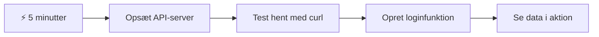
- **Minut 1-2**: Start din API-server (`cd api && npm start`) og test forbindelsen
- **Minut 3**: Opret en basal `getAccount()` funktion ved brug af fetch
- **Minut 4**: Kobl loginformularen til med `action="javascript:login()"`
- **Minut 5**: Test login og se kontodata dukke op i konsollen

**Hurtige testkommandoer**:
```bash
# Bekræft, at API kører
curl http://localhost:5000/api

# Test hentning af kontodata
curl http://localhost:5000/api/accounts/test
```

**Hvorfor det betyder noget**: På 5 minutter vil du opleve magien ved asynkron datahentning, som driver alle moderne webapplikationer. Det er fundamentet, der får apps til at føles hurtige og levende.

## 🗺️ Din læringsrejse gennem datadrevne webapplikationer

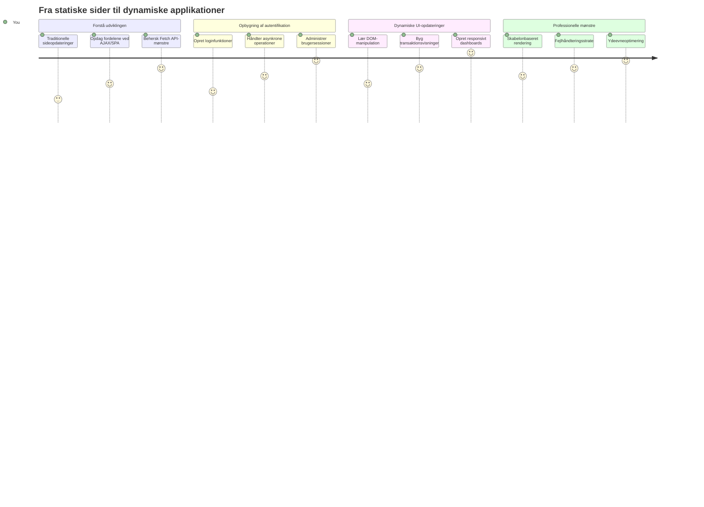
**Dit læringsmål**: Ved slutningen af denne lektion vil du forstå, hvordan moderne webapplikationer henter, behandler og viser data dynamisk og skaber de fejlfri brugeroplevelser, vi forventer af professionelle applikationer.

## Præ-forelæsning quiz

[Præ-forelæsning quiz](https://ff-quizzes.netlify.app/web/quiz/45)

### Forudsætninger

Før du dykker ned i datahentning, skal du have disse komponenter klar:

- **Forrige lektion**: Færdiggør [Login- og registreringsformularen](../2-forms/README.md) – vi bygger videre på denne base
- **Lokal server**: Installer [Node.js](https://nodejs.org) og [kør API-serveren](../api/README.md) for at levere kontodata
- **API-forbindelse**: Test din serverforbindelse med denne kommando:

```bash
curl http://localhost:5000/api
# Forventet svar: "Bank API v1.0.0"
```

Denne hurtige test sikrer, at alle komponenter kommunikerer korrekt:
- Verificerer, at Node.js kører korrekt på dit system
- Bekræfter at din API-server er aktiv og svarer
- Validerer, at din app kan nå serveren (som at tjekke radiokontakt før en mission)

## 🧠 Overblik over datastyringsøkosystemet

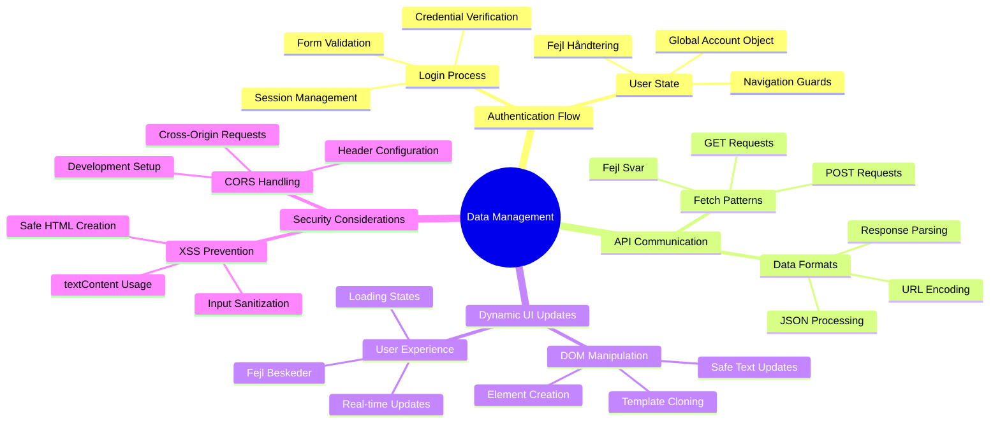
**Kerneprincip**: Moderne webapplikationer er dataorkestreringssystemer – de koordinerer mellem brugerflader, server-API’er og browserens sikkerhedsmodeller for at skabe fejlfri og responsive oplevelser.

---

## Forståelse af datahentning i moderne webapps

Måden webapplikationer håndterer data på har ændret sig dramatisk de sidste to årtier. At forstå denne udvikling hjælper dig med at værdsætte, hvorfor moderne teknikker som AJAX og Fetch API er så kraftfulde, og hvorfor de er blevet uundværlige værktøjer for webudviklere.

Lad os udforske, hvordan traditionelle websites fungerede sammenlignet med de dynamiske, responsive applikationer, vi bygger i dag.

### Traditionelle multi-side applikationer (MPA)

I de tidlige dage af webben var hvert klik som at skifte kanal på et gammelt fjernsyn – skærmen blev sort, og så sad man og ventede på den nye side. Det var virkeligheden for tidlige webapplikationer, hvor hver interaktion betød, at hele siden blev genopbygget fra bunden.

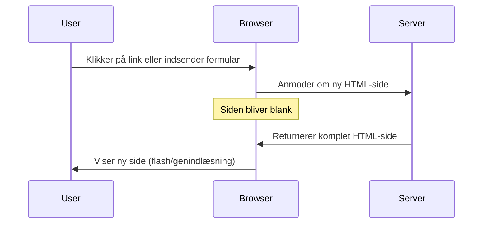
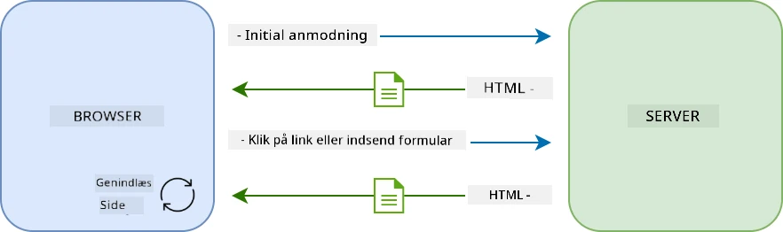

**Hvorfor denne tilgang føltes klodset:**
- Hvert klik betød, at hele siden skulle bygges op fra bunden
- Brugerne blev forstyrret midt i tankerne af de irriterende sideblink
- Dit internet arbejdede overtid med at downloade den samme header og footer igen og igen
- Apps føltes mere som at bladre i et arkivskab end at bruge software

### Moderne single-page applikationer (SPA)

AJAX (Asynchronous JavaScript and XML) ændrede paradigmet fuldstændigt. Ligesom den modulopbyggede design af Den Internationale Rumstation, hvor astronauter kan udskifte enkeltkomponenter uden at bygge hele strukturen om, tillader AJAX os at opdatere specifikke dele af en webside uden at genindlæse hele siden. På trods af navnet, der inkluderer XML, bruger vi mest JSON i dag, men grundprincippet er det samme: opdater kun det, der skal ændres.

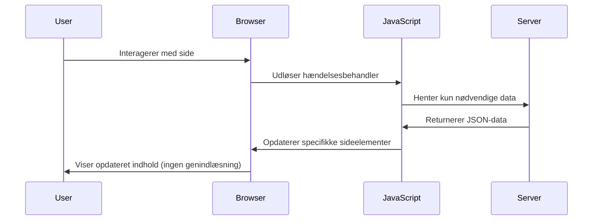
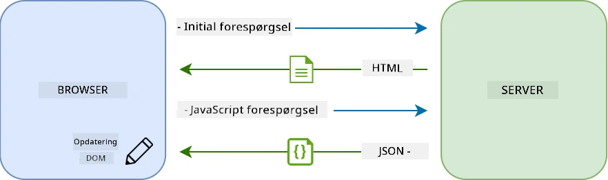

**Hvorfor SPAs føles meget bedre:**
- Kun de dele, der rent faktisk ændrer sig, opdateres (smart, ikke?)
- Ingen mere forstyrrende afbrydelser – dine brugere forbliver i deres flow
- Mindre data over nettet betyder hurtigere indlæsning
- Alting føles hurtigt og responsivt, som apps på din telefon

### Udviklingen til moderne Fetch API

Moderne browsere tilbyder [`Fetch` API](https://developer.mozilla.org/docs/Web/API/Fetch_API), som erstatter den ældre [`XMLHttpRequest`](https://developer.mozilla.org/docs/Web/API/XMLHttpRequest/Using_XMLHttpRequest). Som forskellen på at bruge telegraf og sende email, bruger Fetch API promises for renere asynkron kode og håndterer JSON naturligt.

| Funktion | XMLHttpRequest | Fetch API |
|---------|----------------|----------|
| **Syntax** | Kompleks callback-baseret | Ren promise-baseret |
| **JSON-håndtering** | Kræver manuel parsing | Indbygget `.json()` metode |
| **Fejlhåndtering** | Begrænset fejlinfo | Omfattende fejlbeskrivelser |
| **Moderne support** | Bagudkompatibel | ES6+ promises og async/await |

> 💡 **Browserkompatibilitet**: Godt nyt – Fetch API virker i alle moderne browsere! Hvis du er nysgerrig på specifikke versioner, har [caniuse.com](https://caniuse.com/fetch) hele kompatibilitetshistorikken.
> 
**Kort sagt:**
- Virker fantastisk i Chrome, Firefox, Safari og Edge (faktisk overalt, hvor dine brugere er)
- Kun Internet Explorer har behov for ekstra hjælp (og ærligt talt, det er tid at sige farvel til IE)
- Forbereder dig perfekt til elegante async/await-mønstre, vi bruger senere

### Implementering af brugerlogin og datahentning

Lad os nu implementere loginsystemet, der forvandler din bankapp fra en statisk visning til en funktionel applikation. Ligesom autentifikationsprotokoller i sikre militære faciliteter, skal vi bekræfte brugerens oplysninger og derefter give adgang til deres specifikke data.

Vi bygger dette trinvis, starter med basal autentifikation og tilføjer derefter datahentningsfunktionaliteten.

#### Trin 1: Opret grundlaget for login-funktionen

Åbn din `app.js` fil og tilføj en ny `login` funktion. Den skal håndtere brugerautentifikationen:

```javascript
async function login() {
  const loginForm = document.getElementById('loginForm');
  const user = loginForm.user.value;
}
```

**Lad os bryde det ned:**
- Det `async` nøgleord? Det fortæller JavaScript "denne funktion kan komme til at skulle vente på noget"
- Vi henter vores form fra siden (intet fancy, bare finder den via dens ID)
- Så trækker vi den indtastede brugernavn-værdi ud
- Her er et smart trick: du kan få adgang til et hvilket som helst input i en form via dens `name` attribut – ingen behov for ekstra getElementById kald!

> 💡 **Form-adgangsmønster**: Alle formkontroller kan tilgås via deres navn (sat i HTML med `name` attributten) som egenskaber på form-elementet. Det giver en ren og læsbar måde at hente formdata på.

#### Trin 2: Opret kontodata-hentningsfunktionen

Dernæst opretter vi en dedikeret funktion til at hente kontodata fra serveren. Den følger samme mønster som din registreringsfunktion, men fokuserer på dataindhentning:

```javascript
async function getAccount(user) {
  try {
    const response = await fetch('//localhost:5000/api/accounts/' + encodeURIComponent(user));
    return await response.json();
  } catch (error) {
    return { error: error.message || 'Unknown error' };
  }
}
```

**Det her opnår koden:**
- **Bruger** det moderne `fetch` API til at anmode om data asynkront
- **Bygger** en GET-forespørgsel med brugernavn som parameter
- **Anvender** `encodeURIComponent()` for sikkert at håndtere specialtegn i URL’er
- **Konverterer** svaret til JSON-format for nem datahåndtering
- **Håndterer** fejl elegant ved at returnere et fejlobjekt i stedet for at crashe

> ⚠️ **Sikkerhedsnote**: `encodeURIComponent()` håndterer specialtegn i URL’er. Ligesom kodningssystemer brugt i marinekommunikation sikrer den, at din besked ankommer ubeskadiget, og forhindrer at tegn som "#" eller "&" fejltolkes.
> 
**Hvorfor det er vigtigt:**
- Forhindrer specialtegn i at bryde URL’er
- Beskytter mod URL-manipulationsangreb
- Sikrer at serveren modtager de forventede data
- Følger sikre udviklingsprincipper

#### Forståelse af HTTP GET-forespørgsler

Her er noget, der måske overrasker dig: når du bruger `fetch` uden ekstra indstillinger, laver den automatisk en [`GET`](https://developer.mozilla.org/docs/Web/HTTP/Methods/GET) forespørgsel. Det passer perfekt til, hvad vi laver – spørger serveren "hey, kan jeg se denne brugers kontodata?"

Tænk på GET som høfligt at låne en bog på biblioteket – du beder om noget, der allerede findes. POST-forespørgsler (som vi brugte ved registrering) svarer mere til at indsende en ny bog til samlingen.

| GET-forespørgsel | POST-forespørgsel |
|-------------|-------------|
| **Formål** | Hente eksisterende data | Sende nye data til server |
| **Parametre** | I URL-sti/spørgestreng | I forespørgselsbody |
| **Caching** | Kan caches af browsere | Typisk ikke cached |
| **Sikkerhed** | Synlige i URL/logfiler | Skjult i body |

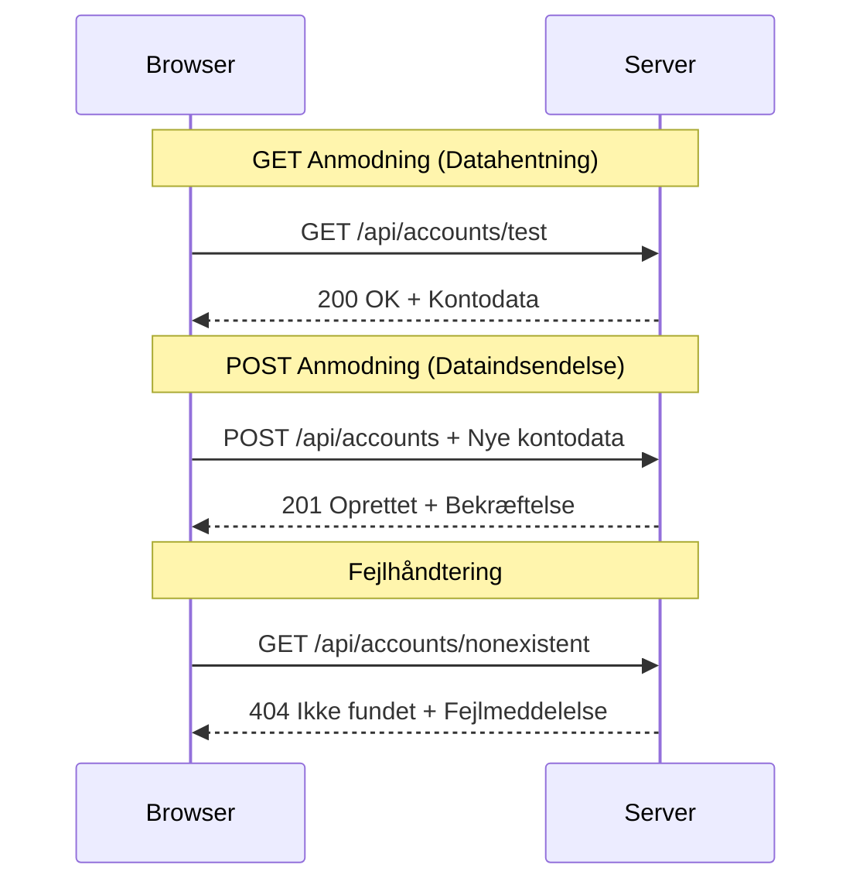
#### Trin 3: Samling af det hele

Nu til den tilfredsstillende del – lad os forbinde din konto-hentningsfunktion med login-processen. Her klikker det hele sammen:

```javascript
async function login() {
  const loginForm = document.getElementById('loginForm');
  const user = loginForm.user.value;
  const data = await getAccount(user);

  if (data.error) {
    return console.log('loginError', data.error);
  }

  account = data;
  navigate('/dashboard');
}
```

Denne funktion følger en klar rækkefølge:
- Trækker brugernavnet ud fra form-inputtet
- Anmoder om brugerkontoens data fra serveren
- Håndterer eventuelle fejl undervejs
- Gemmer kontodata og navigerer til dashboard ved succes

> 🎯 **Async/Await-mønster**: Da `getAccount` er asynkron, bruger vi `await` nøgleordet for at vente på serverens svar, inden koden fortsætter. Det forhindrer, at koden læser udefinerede data.

#### Trin 4: Opret et hjem til dine data

Din app har brug for et sted at huske kontoinformationen, når den er hentet. Tænk på det som din apps korttidshukommelse – et sted at holde styr på den nuværende brugers data. Tilføj denne linje øverst i din `app.js` fil:

```javascript
// Dette indeholder den aktuelle brugers kontodata
let account = null;
```

**Hvorfor vi skal bruge det:**
- Holder kontodata tilgængelig overalt i appen
- Starter med `null`, som betyder "ingen er logget ind endnu"
- Opdateres, når en bruger logger ind eller registrerer sig med succes
- Fungerer som en enkelt sandhedskilde – ingen forvirring om, hvem der er logget ind

#### Trin 5: Kobl din formular til

Lad os nu forbinde din flotte nye loginfunktion til din HTML-formular. Opdater dit form-tag sådan her:

```html
<form id="loginForm" action="javascript:login()">
  <!-- Your existing form inputs -->
</form>
```

**Hvad denne lille ændring gør:**
- Stopper formen fra at genindlæse hele siden som standard
- Kalder din brugerdefinerede JavaScript-funktion i stedet
- Holder alt glat og SPA-lignende
- Giver dig fuld kontrol over, hvad der sker, når brugerne klikker "Login"

#### Trin 6: Forbedr din registreringsfunktion

For konsistens, opdater også din `register` funktion til at gemme kontodata og navigere til dashboardet:

```javascript
// Tilføj disse linjer i slutningen af din registreringsfunktion
account = result;
navigate('/dashboard');
```

**Denne forbedring giver:**
- **Problemfri** overgang fra registrering til dashboard
- **Konsistent** brugeroplevelse mellem login- og registreringsflow
- **Øjeblikkelig** adgang til kontodata efter en succesfuld registrering

#### Test af din implementering

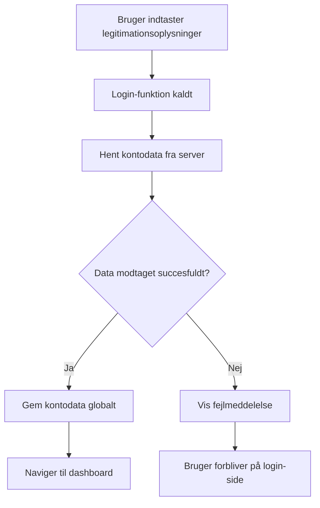
**Tid til at prøve det af:**
1. Opret en ny konto for at sikre, at alt fungerer
2. Prøv at logge ind med de samme oplysninger
3. Kig i browserens konsol (F12) hvis noget virker mærkeligt
4. Bekræft at du kommer ind på dashboardet efter succesfuld login

Hvis noget ikke virker, så panik ikke! De fleste problemer er simple fejl som tastefejl eller glemt at starte API-serveren.

#### En hurtig bemærkning om Cross-Origin magi

Du tænker måske: "Hvordan kan min webapp tale med denne API-server, når de kører på forskellige porte?" Godt spørgsmål! Det kommer vi alle webudviklere til at støde på.

> 🔒 **Cross-Origin Sikkerhed**: Browsere håndhæver en "same-origin policy" for at forhindre uautoriseret kommunikation mellem forskellige domæner. Ligesom checkpointsystemet ved Pentagon verifierer de, at kommunikationen er godkendt, før dataoverførsel tillades.
> 
**I vores opsætning:**
- Din webapp kører på `localhost:3000` (udviklingsserver)
- Din API-server kører på `localhost:5000` (backend-server)
- API-serveren inkluderer [CORS headers](https://developer.mozilla.org/docs/Web/HTTP/CORS), som eksplicit autoriserer kommunikation fra din webapp

Denne konfiguration afspejler virkelige udviklingsmiljøer, hvor frontend og backend typisk kører på separate servere.

> 📚 **Lær mere**: Dyk dybere ned i API’er og datahentning med denne omfattende [Microsoft Learn modul om API’er](https://docs.microsoft.com/learn/modules/use-apis-discover-museum-art/?WT.mc_id=academic-77807-sagibbon).

## Gør dine data levende i HTML

Nu vil vi gøre de hentede data synlige for brugerne via DOM-manipulation. Ligesom processen med at fremkalde fotografier i et mørkekammer, tager vi usynlige data og gengiver dem til noget, brugerne kan se og interagere med.
DOM-manipulation er teknikken, der forvandler statiske websider til dynamiske applikationer, som opdaterer deres indhold baseret på brugerinteraktioner og serverrespons.

### Valg af det rigtige værktøj til opgaven

Når det kommer til opdatering af dit HTML med JavaScript, har du flere muligheder. Tænk på disse som forskellige værktøjer i en værktøjskasse - hver enkelt perfekt til specifikke opgaver:

| Metode | Hvad den er god til | Hvornår den skal bruges | Sikkerhedsniveau |
|--------|---------------------|------------------------|------------------|
| `textContent` | Sikker visning af brugerdata | Når du viser tekst | ✅ Stærkt som en klippe |
| `createElement()` + `append()` | Bygning af komplekse layouts | Oprettelse af nye sektioner/lister | ✅ Bullitproof |
| `innerHTML` | Indstilling af HTML-indhold | ⚠️ Prøv at undgå denne | ❌ Risikabelt |

#### Den sikre måde at vise tekst på: textContent

Egenskaben [`textContent`](https://developer.mozilla.org/docs/Web/API/Node/textContent) er din bedste ven, når du viser brugerdata. Det er som at have en dørmand til din side – intet skadeligt slipper igennem:

```javascript
// Den sikre og pålidelige måde at opdatere tekst på
const balanceElement = document.getElementById('balance');
balanceElement.textContent = account.balance;
```

**Fordele ved textContent:**
- Behandler al tekst som almindelig tekst (forhindrer script-eksekvering)
- Rydder automatisk eksisterende indhold
- Effektiv til simple tekstopdateringer
- Giver indbygget sikkerhed mod skadeligt indhold

#### Oprettelse af dynamiske HTML-elementer

For mere komplekst indhold kan du kombinere [`document.createElement()`](https://developer.mozilla.org/docs/Web/API/Document/createElement) med [`append()`](https://developer.mozilla.org/docs/Web/API/ParentNode/append)-metoden:

```javascript
// Sikker måde at oprette nye elementer på
const transactionItem = document.createElement('div');
transactionItem.className = 'transaction-item';
transactionItem.textContent = `${transaction.date}: ${transaction.description}`;
container.append(transactionItem);
```

**Forståelse af denne tilgang:**
- **Opretter** nye DOM-elementer programmatisk
- **Bevarer** fuld kontrol over elementattributter og indhold
- **Tillader** komplekse, indlejrede elementstrukturer
- **Bevarer** sikkerheden ved at adskille struktur fra indhold

> ⚠️ **Sikkerhedsovervejelse**: Selvom [`innerHTML`](https://developer.mozilla.org/docs/Web/API/Element/innerHTML) optræder i mange vejledninger, kan det eksekvere indlejrede scripts. Ligesom sikkerhedsprotokollerne ved CERN, der forhindrer uautoriseret kodeeksekvering, giver brug af `textContent` og `createElement` sikrere alternativer.
> 
**Risici ved innerHTML:**
- Eksekverer enhver `<script>`-tag i brugerdata
- Sårbart overfor kodeinjektionsangreb
- Skaber potentielle sikkerhedssårbarheder
- De sikrere alternativer vi bruger tilbyder tilsvarende funktionalitet

### Gør fejl brugervenlige

Lige nu vises login-fejl kun i browserens konsol, som brugere ikke kan se. Ligesom forskellen mellem pilotens interne diagnosticering og passagerinformationssystemet, skal vi kommunikere vigtig information via de rette kanaler.

Implementering af synlige fejlbeskeder giver brugerne øjeblikkelig feedback om, hvad der gik galt, og hvordan de skal fortsætte.

#### Trin 1: Tilføj et sted til fejlmeddelelser

Først giver vi fejlmeddelelser et hjem i dit HTML. Tilføj dette lige før din login-knap, så brugerne naturligt vil se det:

```html
<!-- This is where error messages will appear -->
<div id="loginError" role="alert"></div>
<button>Login</button>
```

**Hvad der sker her:**
- Vi opretter en tom container, der forbliver usynlig, indtil den skal bruges
- Den placeres, hvor brugere naturligt kigger efter at have klikket på "Login"
- `role="alert"` er en fin detalje for skærmlæsere - det fortæller hjælpe-teknologi "hey, det her er vigtigt!"
- Det unikke `id` giver vores JavaScript en nem målrettet reference

#### Trin 2: Opret en praktisk hjælpefunktion

Lad os lave en lille hjælpefunktion, der kan opdatere tekst i ethvert element. Det er en af de "skriv én gang, brug alle steder"-funktioner, der sparer dig tid:

```javascript
function updateElement(id, text) {
  const element = document.getElementById(id);
  element.textContent = text;
}
```

**Fordele ved funktionen:**
- Simpelt interface, der kun kræver et element-ID og tekstindhold
- Finder og opdaterer DOM-elementer sikkert
- Genanvendeligt mønster, der mindsker kode-duplication
- Opretholder ensartet opdateringsadfærd på tværs af applikationen

#### Trin 3: Vis fejl, hvor brugerne kan se dem

Nu erstatter vi den skjulte konsolbesked med noget, brugerne rent faktisk kan se. Opdater din loginfunktion:

```javascript
// I stedet for blot at logge til konsollen, vis brugeren hvad der er galt
if (data.error) {
  return updateElement('loginError', data.error);
}
```

**Denne lille ændring gør en stor forskel:**
- Fejlmeddelelser vises lige, hvor brugerne kigger
- Ikke flere mystiske, tavse fejl
- Brugerne får øjeblikkelig, brugbar feedback
- Din app føles nu professionel og gennemtænkt

Når du nu tester med en ugyldig konto, vil du se en hjælpsom fejlmeddelelse direkte på siden!


#### Trin 4: Vær inkluderende med tilgængelighed

Her er noget smart ved det `role="alert"` vi tilføjede tidligere - det er ikke bare pynt! Denne lille attribut skaber et såkaldt [Live Region](https://developer.mozilla.org/docs/Web/Accessibility/ARIA/ARIA_Live_Regions), der straks annoncerer ændringer til skærmlæsere:

```html
<div id="loginError" role="alert"></div>
```

**Hvorfor det betyder noget:**
- Skærmlæserbrugere hører fejlmeddelelsen, så snart den vises
- Alle får den samme vigtige information, uanset hvordan de navigerer
- En simpel måde at gøre din app brugbar for flere mennesker
- Viser, at du bekymrer dig om at skabe inkluderende oplevelser

Små detaljer som denne adskiller gode udviklere fra fantastiske!

### 🎯 Pædagogisk tjek-ind: Autentificeringsmønstre

**Pause og refleksion**: Du har lige implementeret et komplet autentificeringsflow. Det er et fundamentalt mønster inden for webudvikling.

**Hurtig selvevaluering**:
- Kan du forklare, hvorfor vi bruger async/await til API-kald?
- Hvad ville ske, hvis vi glemte `encodeURIComponent()`-funktionen?
- Hvordan forbedrer vores fejlhåndtering brugeroplevelsen?

**Reel verden-forbindelse**: De mønstre, du har lært her (asynkron datahentning, fejlhåndtering, brugerfeedback) bruges i alle større webapplikationer, fra sociale medieplatforme til e-handelssider. Du opbygger færdigheder på produktionsniveau!

**Udfordrende spørgsmål**: Hvordan kunne du ændre dette autentificeringssystem til at håndtere flere brugerroller (kunde, administrator, kasserer)? Tænk på dat strukturen og UI-ændringer, der skal til.

#### Trin 5: Anvend det samme mønster til registrering

For konsekvens, implementer identisk fejlhåndtering i din registreringsformular:

1. **Tilføj** et fejlvisningselement til dit registrerings-HTML:
```html
<div id="registerError" role="alert"></div>
```

2. **Opdater** din registreringsfunktion til at bruge samme fejldisplaymønster:
```javascript
if (data.error) {
  return updateElement('registerError', data.error);
}
```

**Fordele ved konsekvent fejlhåndtering:**
- **Sikrer** ensartet brugeroplevelse på tværs af alle formularer
- **Reducerer** mental belastning ved at bruge kendte mønstre
- **Forenkler** vedligeholdelse med genanvendelig kode
- **Sikrer** at tilgængelighedsstandarder overholdes over hele appen

## Oprettelse af dit dynamiske dashboard

Nu vil vi forvandle dit statiske dashboard til et dynamisk interface, der viser reel kontodata. Ligesom forskellen mellem en trykt flyvetidsplan og de levende afgangstavler i lufthavne, bevæger vi os fra statisk information til realtids-, responsive visninger.

Ved hjælp af de DOM-manipulations teknikker, du har lært, skaber vi et dashboard, der opdaterer sig automatisk med aktuelle kontooplysninger.

### Lær dine data at kende

Før vi går i gang med at bygge, lad os kigge på, hvilken slags data din server sender tilbage. Når nogen logger ind med succes, får du en sand skattekiste af information til at arbejde med:

```json
{
  "user": "test",
  "currency": "$",
  "description": "Test account",
  "balance": 75,
  "transactions": [
    { "id": "1", "date": "2020-10-01", "object": "Pocket money", "amount": 50 },
    { "id": "2", "date": "2020-10-03", "object": "Book", "amount": -10 },
    { "id": "3", "date": "2020-10-04", "object": "Sandwich", "amount": -5 }
  ]
}
```

**Denne datastruktur indeholder:**
- **`user`**: Perfekt til at personliggøre oplevelsen ("Velkommen tilbage, Sarah!")
- **`currency`**: Sørger for, at vi viser pengebeløb korrekt
- **`description`**: Et venligt navn for kontoen
- **`balance`**: Den altafgørende aktuelle saldo
- **`transactions`**: Den komplette historik over transaktioner med alle detaljer

Alt hvad du behøver for at bygge et professionelt bank-dashboard!

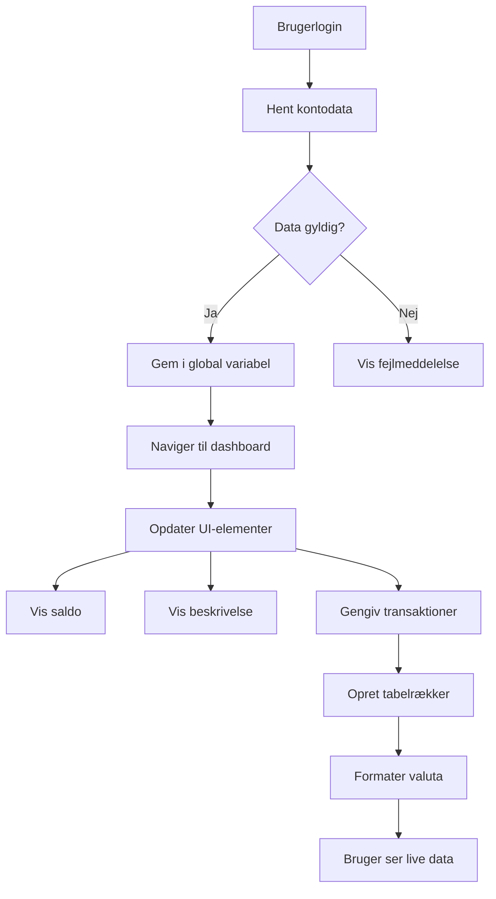
> 💡 **Pro tip**: Vil du se dit dashboard i aktion med det samme? Brug brugernavnet `test`, når du logger ind – det kommer forudindlæst med eksempeldata, så du kan se alt fungere uden at skulle oprette transaktioner først.
> 
**Hvorfor testkontoen er praktisk:**
- Kommer allerede med realistiske eksempler
- Perfekt til at se, hvordan transaktioner vises
- God til at teste dine dashboard-funktioner
- Spar dig selv besværet med manuelt at oprette testdata

### Oprettelse af dashboard visningselementer

Lad os bygge dit dashboard-interface trin for trin, begyndende med kontosammendraget og derefter gå videre til mere komplekse funktioner som transaktionslister.

#### Trin 1: Opdater din HTML-struktur

Først udskift det statiske "Balance"-afsnit med dynamiske pladsholdere, som din JavaScript kan udfylde:

```html
<section>
  Balance: <span id="balance"></span><span id="currency"></span>
</section>
```

Dernæst tilføj en sektion for kontobeskrivelsen. Da det fungerer som en titel for dashboard-indholdet, brug semantisk HTML:

```html
<h2 id="description"></h2>
```

**Forstå HTML-strukturen:**
- **Bruger** separate `<span>`-elementer til saldo og valuta for individuel kontrol
- **Anvender** unikke ID'er til hvert element til målrettet JavaScript
- **Følger** semantisk HTML ved at bruge `<h2>` til kontobeskrivelsen
- **Skaber** en logisk hierarki for skærmlæsere og SEO

> ✅ **Tilgængelighedsindsigt**: Kontobeskrivelsen fungerer som titel for dashboard-indholdet, så den er semantisk markeret som en overskrift. Læs mere om, hvordan [overskriftsstruktur](https://www.nomensa.com/blog/2017/how-structure-headings-web-accessibility) påvirker tilgængelighed. Kan du identificere andre elementer på din side, der kunne have gavn af overskriftstags?

#### Trin 2: Opret dashboard-opdateringsfunktionen

Lav nu en funktion, der fylder dit dashboard med reel kontodata:

```javascript
function updateDashboard() {
  if (!account) {
    return navigate('/login');
  }

  updateElement('description', account.description);
  updateElement('balance', account.balance.toFixed(2));
  updateElement('currency', account.currency);
}
```

**Trin for trin, hvad denne funktion gør:**
- **Validerer**, at kontodata findes, før den fortsætter
- **Omdirigerer** uautoriserede brugere tilbage til login-siden
- **Opdaterer** kontobeskrivelsen med den genanvendelige `updateElement`-funktion
- **Formaterer** saldoen, så den altid viser to decimaler
- **Viser** det korrekte valutasymbol

> 💰 **Valutaformatering**: Den [`toFixed(2)`](https://developer.mozilla.org/docs/Web/JavaScript/Reference/Global_Objects/Number/toFixed)-metode er en livredder! Den sikrer, at din saldo altid ligner rigtige penge - "75.00" i stedet for bare "75". Dine brugere vil sætte pris på at se velkendt valutaformattering.

#### Trin 3: Sikr at dit dashboard opdateres

For at sikre, at dit dashboard opdateres med aktuelle data, hver gang nogen besøger det, skal vi hægte os på dit navigationssystem. Hvis du har gennemført [lektion 1 opgaven](../1-template-route/assignment.md), burde det føles bekendt. Hvis ikke, så bare rolig - her er hvad du skal gøre:

Tilføj dette til slutningen af din `updateRoute()`-funktion:

```javascript
if (typeof route.init === 'function') {
  route.init();
}
```

Opdater derefter dine ruter til at inkludere dashboard-initialisering:

```javascript
const routes = {
  '/login': { templateId: 'login' },
  '/dashboard': { templateId: 'dashboard', init: updateDashboard }
};
```

**Hvad denne smarte opsætning gør:**
- Tjekker om en rute har særlig initialiseringskode
- Kører denne kode automatisk, når ruten indlæses
- Sikrer, at dit dashboard altid viser friske, aktuelle data
- Holder din routing-logik ren og organiseret

#### Test dit dashboard

Efter implementering af disse ændringer, test dit dashboard:

1. **Log ind** med en testkonto
2. **Bekræft**, at du bliver omdirigeret til dashboardet
3. **Tjek**, at kontobeskrivelsen, saldo og valuta vises korrekt
4. **Prøv at logge ud og ind igen** for at sikre, at data opdateres korrekt

Dit dashboard skulle nu vise dynamisk kontoinformation, der opdateres baseret på den indloggede brugers data!

## Byg smarte transaktionslister med skabeloner

I stedet for manuelt at skabe HTML for hver transaktion bruger vi skabeloner til automatisk at generere konsekvent formatering. Ligesom standardiserede komponenter brugt i rumfart, sikrer skabeloner, at hver transaktionsrække følger samme struktur og udseende.

Denne teknik skalerer effektivt fra få transaktioner til tusinder, samtidig med at ydeevne og præsentation holdes ensartet.

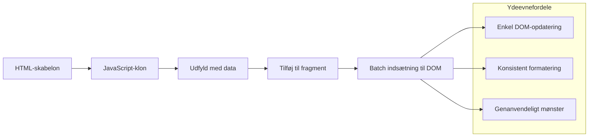
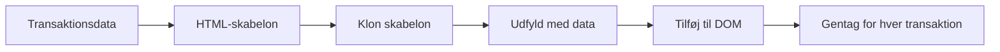
### Trin 1: Opret transaktionsskabelonen

Tilføj først en genanvendelig skabelon til transaktionsrækker i dit HTML `<body>`:

```html
<template id="transaction">
  <tr>
    <td></td>
    <td></td>
    <td></td>
  </tr>
</template>
```

**Forståelse af HTML-skabeloner:**
- **Definerer** strukturen for en enkelt tabelrække
- **Forbliver** usynlig indtil den klones og udfyldes med JavaScript
- **Indeholder** tre celler til dato, beskrivelse og beløb
- **Giver** et genanvendeligt mønster for ensartet formatering

### Trin 2: Forbered din tabel til dynamisk indhold

Tilføj dernæst et `id` til tabelkroppen, så JavaScript let kan målrette den:

```html
<tbody id="transactions"></tbody>
```

**Hvad dette opnår:**
- **Opretter** et klart mål for indsættelse af transaktionsrækker
- **Adskiller** tabelstruktur fra det dynamiske indhold
- **Muliggør** nem rydning og genopfyldning af transaktionsdata

### Trin 3: Byg fabrikationsfunktionen for transaktionsrækker

Lav nu en funktion, der omdanner transaktionsdata til HTML-elementer:

```javascript
function createTransactionRow(transaction) {
  const template = document.getElementById('transaction');
  const transactionRow = template.content.cloneNode(true);
  const tr = transactionRow.querySelector('tr');
  tr.children[0].textContent = transaction.date;
  tr.children[1].textContent = transaction.object;
  tr.children[2].textContent = transaction.amount.toFixed(2);
  return transactionRow;
}
```

**Opdeling af denne fabrikationsfunktion:**
- **Finder** skabelonelementet via dets ID
- **Kloner** skabelonens indhold for sikker manipulation
- **Vælger** tabelrække-elementet i den klonede kopi
- **Udfylder** hver celle med transaktionsdata
- **Formaterer** beløbet til korrekt decimalvisning
- **Returnerer** den færdige række klar til indsættelse

### Trin 4: Generer flere transaktionsrækker effektivt

Tilføj denne kode til din `updateDashboard()`-funktion for at vise alle transaktioner:

```javascript
const transactionsRows = document.createDocumentFragment();
for (const transaction of account.transactions) {
  const transactionRow = createTransactionRow(transaction);
  transactionsRows.appendChild(transactionRow);
}
updateElement('transactions', transactionsRows);
```

**Forståelse af denne effektive tilgang:**
- **Opretter** en dokumentfragment til at samle DOM-operationer
- **Går igennem** alle transaktioner i kontodataene
- **Genererer** en række for hver transaktion ved hjælp af fabrikfunktionen
- **Samler** alle rækker i fragmentet, før de føjes til DOM
- **Udfører** én samlet DOM-opdatering i stedet for flere individuelle indsættelser
> ⚡ **Ydeevneoptimering**: [`document.createDocumentFragment()`](https://developer.mozilla.org/docs/Web/API/Document/createDocumentFragment) fungerer som samleprocessen hos Boeing – komponenter klargøres uden for hovedlinjen og installeres derefter som en komplet enhed. Denne batch-tilgang minimerer DOM-omflytninger ved at udføre én enkelt indsættelse i stedet for flere individuelle operationer.

### Trin 5: Forbedr opdateringsfunktionen til blandet indhold

Din `updateElement()` funktion håndterer i øjeblikket kun tekstindhold. Opdater den til at arbejde med både tekst og DOM-noder:

```javascript
function updateElement(id, textOrNode) {
  const element = document.getElementById(id);
  element.textContent = ''; // Fjerner alle børn
  element.append(textOrNode);
}
```

**Nøgleforbedringer i denne opdatering:**
- **Rydder** eksisterende indhold, før nyt indhold tilføjes
- **Accepterer** enten tekststrenge eller DOM-noder som parametre
- **Bruger** [`append()`](https://developer.mozilla.org/docs/Web/API/ParentNode/append) metoden for fleksibilitet
- **Bevarer** bagudkompatibilitet med eksisterende tekstbaseret brug

### Tag dit dashboard på en prøvetur

Tid til sandhedens øjeblik! Lad os se dit dynamiske dashboard i aktion:

1. Log ind med `test` kontoen (den har eksempeldata klar)
2. Naviger til dit dashboard
3. Tjek at transaktionsrækker vises med korrekt formatering
4. Sørg for at datoer, beskrivelser og beløb alle ser rigtige ud

Hvis alt virker, burde du se en fuldt funktionel transaktionsliste på dit dashboard! 🎉

**Det har du opnået:**
- Bygget et dashboard, der kan håndtere enhver mængde data
- Oprettet genanvendelige skabeloner til ensartet formatering
- Implementeret effektive DOM-manipulationsteknikker
- Udviklet funktionalitet svarende til produktionsbankapplikationer

Du har med succes forvandlet en statisk webside til en dynamisk webapplikation.

### 🎯 Pædagogisk status: Dynamisk indholdsgenerering

**Forståelse af arkitektur**: Du har implementeret en sofistikeret data-til-UI-pipeline, som afspejler mønstre brugt i frameworks som React, Vue og Angular.

**Nøglekoncepter mestret**:
- **Skabelonbaseret rendering**: Oprettelse af genanvendelige UI-komponenter
- **Dokumentfragmenter**: Optimering af DOM-ydeevne
- **Sikker DOM-manipulation**: Undgåelse af sikkerhedsrisici
- **Datatransformation**: Omdannelse af serverdata til brugergrænseflader

**Brancheforbindelse**: Disse teknikker danner grundlaget for moderne frontend-frameworks. Reacts virtuelle DOM, Vues skabelonsystem og Angulars komponentarkitektur bygger alle oven på disse kernemekanismer.

**Refleksionsspørgsmål**: Hvordan ville du udvide dette system til at håndtere opdateringer i realtid (f.eks. nye transaktioner der automatisk dukker op)? Overvej WebSockets eller Server-Sent Events.

---

## 📈 Din tidslinje for datastyringsekspertise

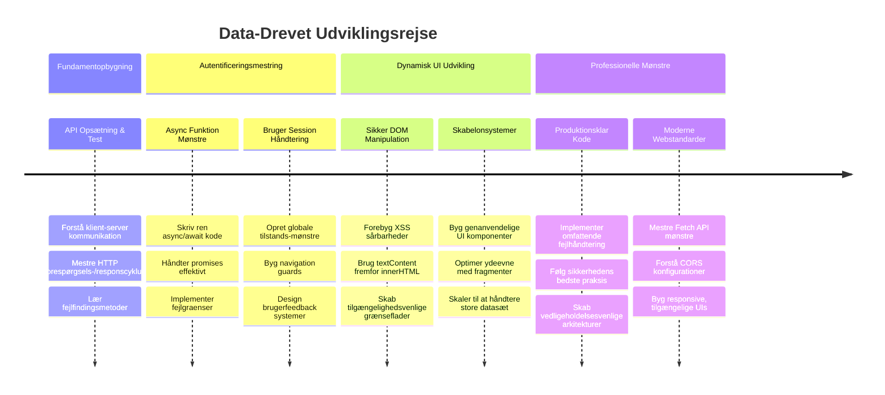
**🎓 Afgangsmilepæl**: Du har med succes bygget en komplet datadrevet webapplikation ved hjælp af moderne JavaScript-mønstre. Disse færdigheder kan direkte overføres til arbejde med frameworks som React, Vue eller Angular.

**🔄 Næste niveau kompetencer**:
- Klar til at udforske frontend-frameworks, der bygger på disse koncepter
- Forberedt på at implementere realtidsfunktioner med WebSockets
- Udstyret til at bygge Progressive Web Apps med offline kapabiliteter
- Fundamentet lagt for at lære avancerede state management-mønstre

## GitHub Copilot Agent Udfordring 🚀

Brug Agent-tilstanden til at løse følgende udfordring:

**Beskrivelse:** Forbedr bankappen ved at implementere en søge- og filterfunktion, som gør det muligt for brugere at finde specifikke transaktioner via datointerval, beløb eller beskrivelsesord.

**Prompt:** Opret en søgefunktionalitet for bankappen, der inkluderer: 1) Et søgeformular med inputfelter til datointerval (fra/til), minimum/maximum beløb, og søgeord i transaktionsbeskrivelser, 2) En `filterTransactions()` funktion, der filtrerer account.transactions arrayet baseret på søgekriterierne, 3) Opdatering af `updateDashboard()` funktionen til at vise filtrerede resultater, og 4) Tilføj en "Ryd filtre" knap til at nulstille visningen. Brug moderne JavaScript array metoder som `filter()` og håndter kanttilfælde for tomme søgekriterier.

Læs mere om [agent-tilstand](https://code.visualstudio.com/blogs/2025/02/24/introducing-copilot-agent-mode) her.

## 🚀 Udfordring

Klar til at tage din bankapp til næste niveau? Lad os få den til at se ud og føles som noget, du virkelig vil bruge. Her er nogle idéer til at starte din kreativitet:

**Gør den smuk**: Tilføj CSS-styling for at forvandle dit funktionelle dashboard til noget visuelt appellerende. Tænk rene linjer, god afstand og måske endda subtile animationer.

**Gør den responsiv**: Prøv at bruge [media queries](https://developer.mozilla.org/docs/Web/CSS/Media_Queries) til at skabe et [responsivt design](https://developer.mozilla.org/docs/Web/Progressive_web_apps/Responsive/responsive_design_building_blocks), der fungerer godt på telefoner, tablets og desktops. Dine brugere vil takke dig!

**Tilføj lidt flair**: Overvej at farvekode transaktioner (grøn for indkomst, rød for udgifter), tilføje ikoner eller skabe hover-effekter der får interfacet til at føles interaktivt.

Sådan kunne et poleret dashboard se ud:

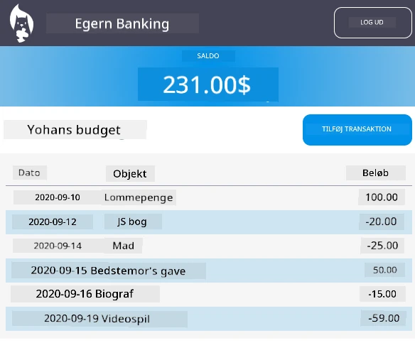

Føl dig ikke forpligtet til at matche det præcist – brug det som inspiration og gør det til dit eget!

## Post-forelæsning quiz

[Post-forelæsningsquiz](https://ff-quizzes.netlify.app/web/quiz/46)

## Opgave

[Refactor og kommenter din kode](assignment.md)

---

<!-- CO-OP TRANSLATOR DISCLAIMER START -->
**Ansvarsfraskrivelse**:
Dette dokument er blevet oversat ved hjælp af AI-oversættelsestjenesten [Co-op Translator](https://github.com/Azure/co-op-translator). Selvom vi bestræber os på nøjagtighed, bedes du være opmærksom på, at automatiserede oversættelser kan indeholde fejl eller unøjagtigheder. Det originale dokument på dets oprindelige sprog bør betragtes som den autoritative kilde. For vigtig information anbefales professionel menneskelig oversættelse. Vi påtager os intet ansvar for misforståelser eller fejltolkninger, der opstår som følge af brugen af denne oversættelse.
<!-- CO-OP TRANSLATOR DISCLAIMER END -->