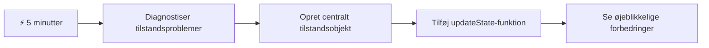
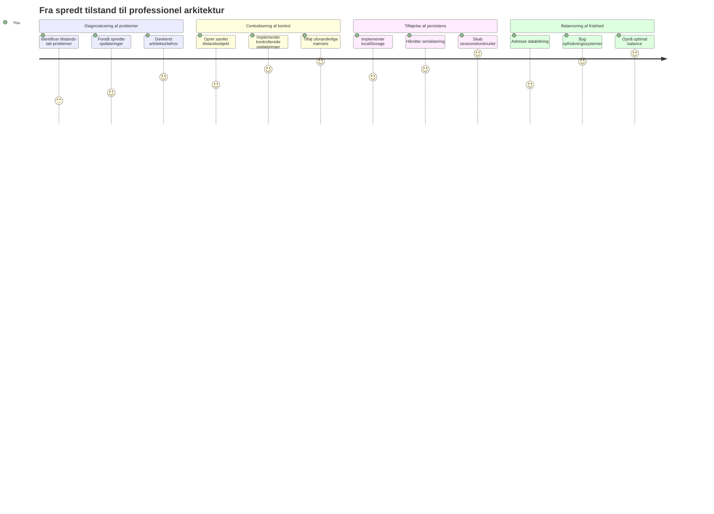
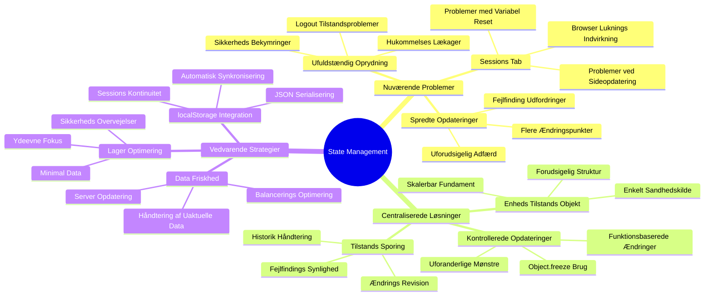
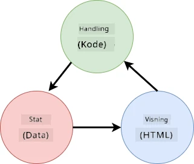
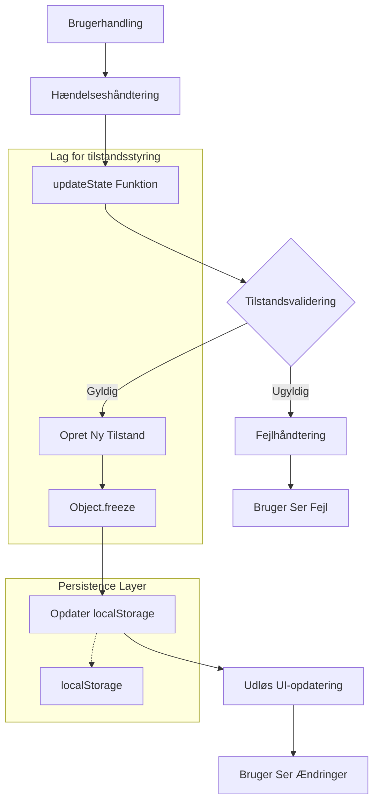
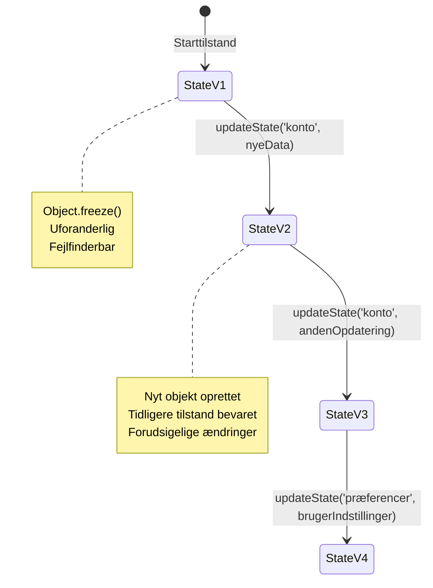
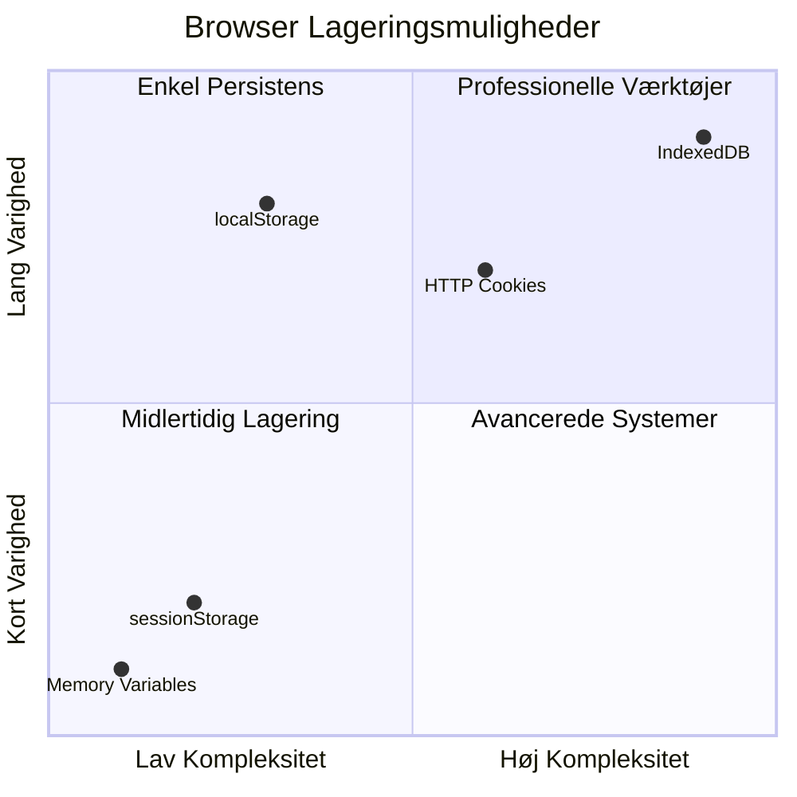
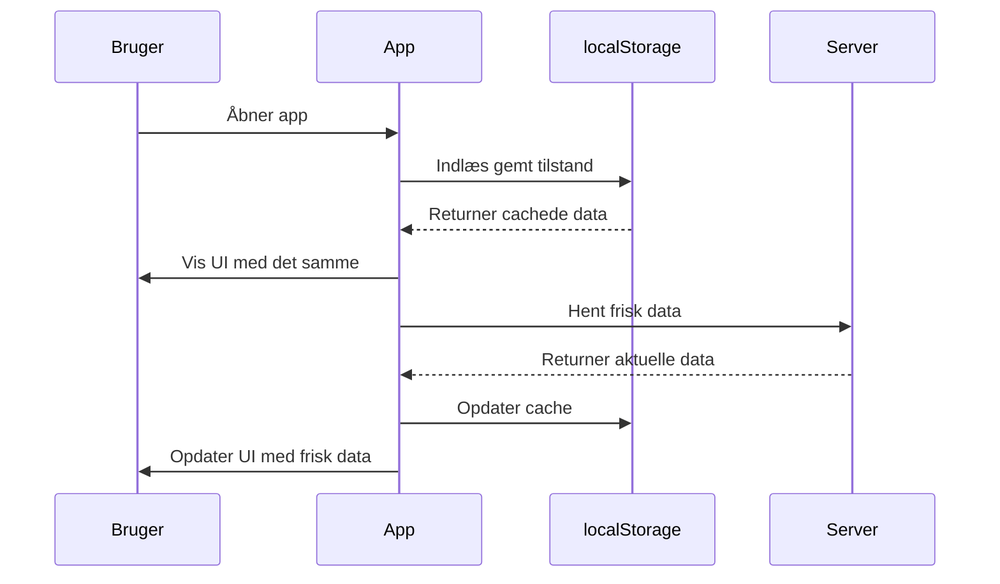
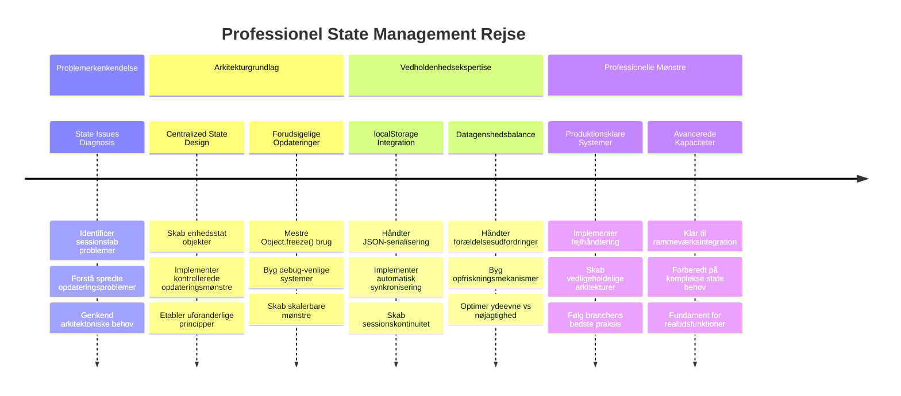

<!--
CO_OP_TRANSLATOR_METADATA:
{
  "original_hash": "b807b09df716dc48a2b750835bf8e933",
  "translation_date": "2026-01-06T23:53:55+00:00",
  "source_file": "7-bank-project/4-state-management/README.md",
  "language_code": "da"
}
-->
# Byg en Bankapp Del 4: Begreber om Tilstandsstyring

## ⚡ Hvad Du Kan Nå på de Næste 5 Minutter

**Hurtigstart for Travle Udviklere**


- **Minut 1**: Test det nuværende tilstandsproblem - log ind, opdater siden, bemærk udlogning
- **Minut 2**: Erstat `let account = null` med `let state = { account: null }`
- **Minut 3**: Opret en simpel `updateState()` funktion til kontrollerede opdateringer
- **Minut 4**: Opdater én funktion til at bruge det nye mønster
- **Minut 5**: Test den forbedrede forudsigelighed og fejlsøgningsmulighed

**Hurtig Diagnostisk Test**:
```javascript
// Før: Spredt tilstand
let account = null; // Mistet ved opdatering!

// Efter: Centraliseret tilstand
let state = Object.freeze({ account: null }); // Kontrolleret og sporbar!
```

**Hvorfor det er vigtigt**: På 5 minutter vil du opleve overgangen fra kaotisk tilstandsstyring til forudsigelige, fejlfri mønstre. Det er fundamentet, der gør komplekse applikationer vedligeholdelsesvenlige.

## 🗺️ Din Læringsrejse Gennem Mesterskabet i Tilstandsstyring


**Din Målsætning**: Ved slutningen af denne lektion vil du have bygget et professionelt tilstandsstyringssystem, der håndterer vedvarende data, friskhed og forudsigelige opdateringer – de samme mønstre som bruges i produktionsapplikationer.

## Forud for Forelæsning Quiz

[Forud for forelæsning quiz](https://ff-quizzes.netlify.app/web/quiz/47)

## Introduktion

Tilstandsstyring er som navigationssystemet på Voyager-rumskibet – når alt fungerer glat, bemærker man det næsten ikke. Men når noget går galt, er det forskellen mellem at nå det interstellare rum og at drive tabt i det kosmiske tomrum. I webudvikling repræsenterer tilstand alt, hvad din applikation skal huske: bruger-loginstatus, formularoplysninger, navigationshistorik og midlertidige grænsefladestatusser.

Efterhånden som din bankapp har udviklet sig fra en simpel loginformular til en mere sofistikeret applikation, har du sandsynligvis stødt på nogle almindelige udfordringer. Opdater siden, og brugere bliver uventet logget ud. Luk browseren, og alt fremskridt forsvinder. Fejlsøg et problem, og du leder gennem flere funktioner, der alle ændrer de samme data på forskellige måder.

Disse er ikke tegn på dårlig kodning – de er de naturlige vækstsmerter, der opstår, når applikationer når et vist kompleksitetsniveau. Hver udvikler møder disse udfordringer, når deres apps bevæger sig fra "proof of concept" til "klar til produktion."

I denne lektion vil vi implementere et centraliseret tilstandsstyringssystem, der forvandler din bankapp til en pålidelig, professionel applikation. Du vil lære at styre dataflow forudsigeligt, vedvarende brugersessioner passende og skabe en glat brugeroplevelse, som moderne webapplikationer kræver.

## Forudsætninger

Før du dykker ned i tilstandsstyringsbegreber, skal du have dit udviklingsmiljø korrekt sat op og fundamentet for din bankapp på plads. Denne lektion bygger direkte videre på koncepterne og koden fra tidligere dele af denne serie.

Sørg for at have følgende komponenter klar, inden du fortsætter:

**Nødvendig Opsætning:**
- Gennemfør [datahentningslektionen](../3-data/README.md) – din app bør kunne indlæse og vise kontodata korrekt
- Installer [Node.js](https://nodejs.org) på dit system for at køre backend-API'en
- Start [server-API'en](../api/README.md) lokalt for at håndtere kontodataoperationer

**Test dit Miljø:**

Bekræft at din API-server kører korrekt ved at køre denne kommando i et terminalvindue:

```sh
curl http://localhost:5000/api
# -> skal returnere "Bank API v1.0.0" som resultat
```

**Hvad denne kommando gør:**
- **Sender** en GET-forespørgsel til din lokale API-server
- **Tester** forbindelsen og bekræfter at serveren svarer
- **Returnerer** API-versionen, hvis alt fungerer korrekt

## 🧠 Oversigt over Tilstandsstyringsarkitektur


**Kerneprincip**: Professionel tilstandsstyring balancerer forudsigelighed, vedholdenhed og ydeevne for at skabe pålidelige brugeroplevelser, der kan skalere fra simple interaktioner til komplekse applikationsarbejdsgange.

---

## Diagnostisering af Nuværende Tilstandsproblemer

Som Sherlock Holmes, der undersøger en gerningssted, skal vi forstå præcis hvad der foregår i vores nuværende implementering, før vi kan løse mysteriet om forsvindende brugersessioner.

Lad os lave et simpelt eksperiment, der afslører de underliggende tilstandsstyringsudfordringer:

**🧪 Prøv Denne Diagnostiske Test:**
1. Log ind i din bankapp og gå til dashboardet
2. Opdater browseren
3. Observer hvad der sker med din loginstatus

Hvis du bliver sendt tilbage til login-skærmen, har du opdaget det klassiske problem med tilstandsvedholdenhed. Denne adfærd sker, fordi vores nuværende implementering gemmer brugerdata i JavaScript-variabler, som nulstilles ved hver sideindlæsning.

**Nuværende Implementeringsproblemer:**

Den simple `account` variabel fra vores [tidligere lektion](../3-data/README.md) skaber tre væsentlige problemer, der påvirker både brugeroplevelse og kodevedligeholdelse:

| Problem | Teknisk Årsag | Brugerpåvirkning |
|---------|---------------|------------------|
| **Sessions-tab** | Sideopdatering nulstiller JavaScript-variabler | Brugere skal ofte logge ind igen |
| **Spredte Opdateringer** | Flere funktioner ændrer tilstanden direkte | Fejlsøgning bliver mere og mere vanskelig |
| **Ufultstændig Oprydning** | Logout sletter ikke alle tilstandsreferencer | Potentielle sikkerheds- og privatlivsproblemer |

**Den Arkitektoniske Udfordring:**

Som Titanics afdelingsopdeling, der virkede robust indtil flere skibsrum pludselig blev oversvømmet, vil det ikke løse disse problemer blot at rette dem individuelt. Vi har brug for en omfattende tilstandsstyringsløsning.

> 💡 **Hvad prøver vi egentlig at opnå her?**

[Tilstandsstyring](https://en.wikipedia.org/wiki/State_management) handler i bund og grund om at løse to fundamentale gåder:

1. **Hvor er mine data?**: Holde styr på hvilken information vi har og hvor den kommer fra
2. **Er alle på samme side?**: Sikre at det brugerne ser stemmer overens med hvad der rent faktisk sker

**Vores Spilplan:**

I stedet for at løbe i ring, vil vi skabe et **centraliseret tilstandsstyringssystem**. Tænk på det som én virkelig organiseret person, der har ansvaret for alt det vigtige:




**Forstå dette dataflow:**
- **Centraliserer** al applikationstilstand ét sted
- **Router** alle tilstandsændringer gennem kontrollerede funktioner
- **Sikrer** at brugergrænsefladen forbliver synkroniseret med den aktuelle tilstand
- **Tilbyder** et klart, forudsigeligt mønster til datastyring

> 💡 **Professionel indsigt**: Denne lektion fokuserer på grundlæggende begreber. For komplekse applikationer tilbyder biblioteker som [Redux](https://redux.js.org) mere avancerede tilstandsstyringsfunktioner. At forstå disse kerneprincipper hjælper dig med at mestre ethvert tilstandsstyringsbibliotek.

> ⚠️ **Avanceret Emne**: Vi kommer ikke til at dække automatiske UI-opdateringer udløst af tilstandsændringer, da dette involverer [Reaktiv Programmering](https://en.wikipedia.org/wiki/Reactive_programming) koncepter. Overvej dette som et fremragende næste skridt på din læringsrejse!

### Opgave: Centraliser Tilstandsstruktur

Lad os begynde at omdanne vores spredte tilstandsstyring til et centraliseret system. Dette første skridt lægger fundamentet for alle efterfølgende forbedringer.

**Trin 1: Opret et Centraliseret Tilstandsobjekt**

Erstat den simple `account` deklaration:

```js
let account = null;
```

Med et struktureret tilstandsobjekt:

```js
let state = {
  account: null
};
```

**Her er hvorfor denne ændring er vigtig:**
- **Centraliserer** al applikationsdata ét sted
- **Forbereder** strukturen til at tilføje flere tilstands-egenskaber senere
- **Skaber** en klar afgrænsning mellem tilstand og andre variabler
- **Etablerer** et mønster der skalerer efterhånden som din app vokser

**Trin 2: Opdater Tilgangsmønstre til Tilstand**

Opdater dine funktioner til at bruge den nye tilstandsstruktur:

**I `register()`- og `login()`-funktionerne**, erstat:
```js
account = ...
```

Med:
```js
state.account = ...
```

**I `updateDashboard()`-funktionen**, tilføj denne linje øverst:
```js
const account = state.account;
```

**Hvad disse opdateringer opnår:**
- **Opretholder** eksisterende funktionalitet mens strukturen forbedres
- **Forbereder** din kode til mere sofistikeret tilstandsstyring
- **Skaber** konsekvente mønstre for at tilgå tilstandsdata
- **Etablerer** fundamentet for centraliserede tilstandsopdateringer

> 💡 **Note**: Denne refaktorering løser ikke straks vores problemer, men skaber det essentielle fundament for de kraftfulde forbedringer, der følger!

### 🎯 Pædagogisk Tjek-ind: Centraliseringsprincipper

**Pause og Reflektér**: Du har netop implementeret fundamentet for centraliseret tilstandsstyring. Det er en afgørende arkitektonisk beslutning.

**Hurtig Selv-vurdering**:
- Kan du forklare, hvorfor centralisering af tilstand i ét objekt er bedre end spredte variabler?
- Hvad ville ske, hvis du glemte at opdatere en funktion til at bruge `state.account`?
- Hvordan forbereder dette mønster din kode til mere avancerede funktioner?

**Virkelighedsforbindelse**: Centraliseringsmønstret du har lært er fundamentet for moderne frameworks som Redux, Vuex og React Context. Du bygger samme arkitektoniske tænkning, som bruges i store applikationer.

**Udfordrende spørgsmål**: Hvis du skulle tilføje brugerpræferencer (tema, sprog) til din app, hvor ville du så tilføje dem i tilstandsstrukturen? Hvordan ville det kunne skaleres?

## Implementering af Kontrollerede Tilstandsopdateringer

Med vores tilstand centraliseret går næste skridt ud på at etablere kontrollerede mekanismer for dataændringer. Denne tilgang sikrer forudsigelige tilstandsændringer og lettere fejlsøgning.

Kerneprincippet minder om lufttrafikstyring: i stedet for at lade flere funktioner ændre tilstanden uafhængigt, kanaliserer vi alle ændringer gennem én kontrolleret funktion. Dette mønster giver klart overblik over hvornår og hvordan data ændres.

**Immutable Tilstandsstyring:**

Vi behandler vores `state` objekt som [*immutable*](https://en.wikipedia.org/wiki/Immutable_object), hvilket betyder, at vi aldrig ændrer det direkte. I stedet skaber hver ændring et nyt tilstandsobjekt med de opdaterede data.

Selvom denne tilgang i starten kan virke ineffektiv sammenlignet med direkte ændringer, giver den store fordele for fejlsøgning, testning og opretholdelse af applikationens forudsigelighed.

**Fordele ved immutable tilstandsstyring:**

| Fordel | Beskrivelse | Indvirkning |
|--------|-------------|------------|
| **Forudsigelighed** | Ændringer sker kun gennem kontrollerede funktioner | Nemmere at fejlsøge og teste |
| **Historiksporing** | Hver tilstandsændring skaber et nyt objekt | Muliggør fortryd/redo funktionalitet |
| **Forebyggelse af Sideeffekter** | Ingen utilsigtede ændringer | Forhindrer mystiske fejl |
| **Ydelsesoptimering** | Let at opdage virkelig tilstandsændringer | Muliggør effektiv UI-opdatering |

**JavaScript Immutability med `Object.freeze()`:**

JavaScript leverer [`Object.freeze()`](https://developer.mozilla.org/docs/Web/JavaScript/Reference/Global_Objects/Object/freeze) til at forhindre objektændringer:

```js
const immutableState = Object.freeze({ account: userData });
// Ethvert forsøg på at ændre immutableState vil forårsage en fejl
```

**Fordeling af hvad der sker her:**
- **Forhindrer** direkte egenskabstildelinger eller sletninger
- **Kaster** fejl hvis der forsøges at ændre
- **Sikrer** at tilstandsændringer skal gå gennem kontrollerede funktioner
- **Skaber** en klar kontrakt for hvordan tilstand kan opdateres

> 💡 **Dybdegående**: Lær om forskellen mellem *shallow* og *deep* immutable objekter i [MDN-dokumentationen](https://developer.mozilla.org/docs/Web/JavaScript/Reference/Global_Objects/Object/freeze#What_is_shallow_freeze). At forstå denne forskel er afgørende for komplekse tilstandsstrukturer.


### Opgave

Lad os skabe en ny `updateState()` funktion:

```js
function updateState(property, newData) {
  state = Object.freeze({
    ...state,
    [property]: newData
  });
}
```

I denne funktion opretter vi et nyt tilstandsobjekt og kopierer data fra den forrige tilstand ved hjælp af [*spread (`...`) operatoren*](https://developer.mozilla.org/docs/Web/JavaScript/Reference/Operators/Spread_syntax#Spread_in_object_literals). Derefter overskriver vi en specifik egenskab i tilstandsobjektet med de nye data ved brug af [braketsyntaksen](https://developer.mozilla.org/docs/Web/JavaScript/Guide/Working_with_Objects#Objects_and_properties) `[property]` til tildeling. Til sidst låser vi objektet for at forhindre ændringer med `Object.freeze()`. Vi har lige nu kun `account` egenskaben gemt i tilstanden, men med denne tilgang kan du tilføje så mange egenskaber som nødvendigt i tilstanden.

Vi opdaterer også `state` initialiseringen for at sikre, at den oprindelige tilstand også fryses:

```js
let state = Object.freeze({
  account: null
});
```

Dernæst opdaterer du `register` funktionen ved at erstatte tildelingen `state.account = result;` med:

```js
updateState('account', result);
```

Gør det samme i `login` funktionen, hvor `state.account = data;` erstattes med:

```js
updateState('account', data);
```

Vi benytter nu chancen til at løse problemet med, at kontodata ikke bliver ryddet, når brugeren klikker på *Logout*.

Opret en ny funktion `logout()`:

```js
function logout() {
  updateState('account', null);
  navigate('/login');
}
```

I `updateDashboard()` erstatter du omdirigeringen `return navigate('/login');` med `return logout()`;

Prøv at registrere en ny konto, logge ud og igen ind for at sikre, at alt stadig fungerer korrekt.

> Tip: du kan se alle tilstandsændringer ved at tilføje `console.log(state)` nederst i `updateState()` og åbne konsollen i din browsers udviklingsværktøjer.

## Implementering af Datapersistens

Det sessions tab-problem vi tidligere identificerede kræver en vedvarende løsning, der bevarer brugertilstanden på tværs af browsersessioner. Dette forvandler vores applikation fra en midlertidig oplevelse til et pålideligt, professionelt værktøj.

Tænk på hvordan atomure bevarer præcis tid selv gennem strømafbrydelser ved at lagre kritisk tilstand i ikke-flygtig hukommelse. På samme måde har webapplikationer brug for vedvarende lagringsmekanismer for at bevare vigtig brugerdata på tværs af browsersessioner og sideopdateringer.

**Strategiske Spørgsmål for Datapersistens:**

Før implementering af vedholdenhed, overvej disse kritiske faktorer:

| Spørgsmål | Bankapp Kontekst | Beslutningens Indvirkning |
|-----------|------------------|--------------------------|
| **Er data følsomt?** | Kontosaldo, transaktionshistorik | Vælg sikre lagringsmetoder |
| **Hvor længe skal det vedvare?** | Login-tilstand vs. midlertidige UI-præferencer | Vælg passende lagringsvarighed |
| **Har serveren brug for det?** | Autentificeringstokens vs. UI-indstillinger | Bestem delingsbehov |

**Browserlagringsmuligheder:**

Moderne browsere tilbyder flere lagringsmekanismer, hver designet til forskellige anvendelsestilfælde:

**Primære lagrings-API'er:**

1. **[`localStorage`](https://developer.mozilla.org/docs/Web/API/Window/localStorage)**: Vedvarende [Nøgle/Værdi-lagring](https://en.wikipedia.org/wiki/Key%E2%80%93value_database)
   - **Vedvarer** data på tværs af browsersessioner på ubestemt tid  
   - **Overlever** browsergenstarter og computergenstarter
   - **Afgrænset** til det specifikke webstedsdomæne
   - **Perfekt** til brugerpræferencer og login-tilstande

2. **[`sessionStorage`](https://developer.mozilla.org/docs/Web/API/Window/sessionStorage)**: Midlertidig sessionslagring
   - **Fungerer** identisk med localStorage under aktive sessioner
   - **Rydder** automatisk op, når browsertab lukkes
   - **Ideel** til midlertidige data, der ikke skal vedvare

3. **[HTTP Cookies](https://developer.mozilla.org/docs/Web/HTTP/Cookies)**: Server-delt lagring
   - **Sendes automatisk** med hver serverforespørgsel
   - **Perfekte** til [autentificerings](https://en.wikipedia.org/wiki/Authentication)tokens
   - **Begrænsede** i størrelse og kan påvirke ydeevnen

**Krav til dataserialisering:**

Både `localStorage` og `sessionStorage` gemmer kun [strenge](https://developer.mozilla.org/docs/Web/JavaScript/Reference/Global_Objects/String):

```js
// Konverter objekter til JSON-strenge til lagring
const accountData = { user: 'john', balance: 150 };
localStorage.setItem('account', JSON.stringify(accountData));

// Fortolk JSON-strenge tilbage til objekter ved hentning
const savedAccount = JSON.parse(localStorage.getItem('account'));
```

**Forståelse af serialisering:**
- **Konverterer** JavaScript-objekter til JSON-strenge ved hjælp af [`JSON.stringify()`](https://developer.mozilla.org/docs/Web/JavaScript/Reference/Global_Objects/JSON/stringify)
- **Genskaber** objekter fra JSON ved at bruge [`JSON.parse()`](https://developer.mozilla.org/docs/Web/JavaScript/Reference/Global_Objects/JSON/parse)
- **Håndterer** komplekse, indlejrede objekter og arrays automatisk
- **Fejler** på funktioner, undefined værdier og cirkulære referencer

> 💡 **Avanceret mulighed**: For komplekse offline-applikationer med store datasæt, overvej [`IndexedDB` API](https://developer.mozilla.org/docs/Web/API/IndexedDB_API). Det tilbyder en fuld klient-side database, men kræver en mere kompleks implementering.


### Opgave: Implementer localStorage-Vedvarende lagring

Lad os implementere vedvarende lagring, så brugere forbliver logget ind, indtil de eksplicit logger ud. Vi vil bruge `localStorage` til at gemme kontodata på tværs af browsersessioner.

**Trin 1: Definer lagringskonfiguration**

```js
const storageKey = 'savedAccount';
```

**Hvad denne konstant leverer:**
- **Opretter** et konsistent id for vores gemte data
- **Forhindrer** tastefejl i lagringsnøglehenvisninger
- **Gør det nemt** at ændre lagringsnøglen om nødvendigt
- **Følger** bedste praksis for vedligeholdelsesvenlig kode

**Trin 2: Tilføj automatisk vedvarende lagring**

Tilføj denne linje i slutningen af `updateState()` funktionen:

```js
localStorage.setItem(storageKey, JSON.stringify(state.account));
```

**Gennemgang af hvad der sker her:**
- **Konverterer** kontobjektet til en JSON-streng til lagring
- **Gemmer** data ved at bruge vores konsistente lagringsnøgle
- **Eksekverer** automatisk, når der sker ændringer i tilstanden
- **Sikrer** at gemte data altid er synkroniseret med den aktuelle tilstand

> 💡 **Arkitekturfordel**: Fordi vi centraliserede alle tilstandsopdateringer via `updateState()`, krævede tilføjelse af vedvarende lagring kun én kode linje. Dette demonstrerer styrken i gode arkitekturvalg!

**Trin 3: Gendan tilstand ved app-load**

Opret en initialiseringsfunktion til at gendanne gemte data:

```js
function init() {
  const savedAccount = localStorage.getItem(storageKey);
  if (savedAccount) {
    updateState('account', JSON.parse(savedAccount));
  }

  // Vores tidligere initialiseringskode
  window.onpopstate = () => updateRoute();
  updateRoute();
}

init();
```

**Forståelse af initialiseringsprocessen:**
- **Henter** tidligere gemte kontodata fra localStorage
- **Parser** JSON-strengen tilbage til et JavaScript-objekt
- **Opdaterer** tilstanden via vores kontrollerede opdateringsfunktion
- **Gendanner** brugerens session automatisk ved sideindlæsning
- **Eksekverer** før ruteopdateringer for at sikre at tilstanden er tilgængelig

**Trin 4: Optimer standardruten**

Opdater standardruten for at udnytte vedvarende lager:

I `updateRoute()`, erstat:
```js
// Erstat: returner naviger('/login');
return navigate('/dashboard');
```

**Hvorfor denne ændring giver mening:**
- **Udnytter** vores nye vedvarende system effektivt
- **Tillader** dashboardet at håndtere autentificeringskontrol
- **Omdirigerer** automatisk til login, hvis der ikke findes nogen gemt session
- **Skaber** en mere sammenhængende brugeroplevelse

**Test af din implementering:**

1. Log ind på din bankapp
2. Opdater browser-siden
3. Bekræft at du stadig er logget ind og på dashboardet
4. Luk og genåbn din browser
5. Naviger tilbage til din app og bekræft at du stadig er logget ind

🎉 **Præstation opnået**: Du har med succes implementeret vedvarende tilstandsadministration! Din app opfører sig nu som en professionel webapplikation.

### 🎯 Pædagogisk status: Arkitektur for persistence

**Arkitekturforståelse**: Du har implementeret et sofistikeret persistence-lag, som balancerer brugeroplevelse med kompleksitet i datastyring.

**Nøglekoncepter mestret**:
- **JSON-serialisering**: Konvertering af komplekse objekter til lagringsvenlige strenge
- **Automatisk synkronisering**: Tilstandsændringer udløser vedvarende lagring
- **Sessionsgendannelse**: Apps kan genskabe brugerens kontekst efter afbrydelser
- **Centraliseret persistence**: Én opdateringsfunktion håndterer al lagring

**Branchens forbindelse**: Dette persistence-mønster er grundlæggende i Progressive Web Apps (PWA), offline-first applikationer og moderne mobile weboplevelser. Du bygger funktionsdygtigheder på produktionsniveau.

**Refleksionsspørgsmål**: Hvordan ville du ændre dette system for at håndtere flere brugerkonti på samme enhed? Overvej privatlivs- og sikkerhedsmæssige konsekvenser.

## Balancering af persistence med datafriskhed

Vores persistence-system opretholder med succes bruger-sessioner, men introducerer en ny udfordring: forældet data. Når flere brugere eller applikationer ændrer samme serverdata, bliver lokalt cachelagret information forældet.

Denne situation minder om vikingernes navigatører, som stolede både på lagrede stjernekort og aktuelle himmelske observationer. Kortene gav konsistens, men navigatørerne havde brug for nye observationer for at tage højde for ændrede forhold. På samme måde har vores applikation både brug for vedvarende bruger-tilstand og aktuelle serverdata.

**🧪 Opdagelse af problemet med datafriskhed:**

1. Log ind på dashboardet med `test` kontoen
2. Kør denne kommando i en terminal for at simulere en transaktion fra en anden kilde:

```sh
curl --request POST \
     --header "Content-Type: application/json" \
     --data "{ \"date\": \"2020-07-24\", \"object\": \"Bought book\", \"amount\": -20 }" \
     http://localhost:5000/api/accounts/test/transactions
```

3. Opdater din dashboard-side i browseren
4. Observer om du ser den nye transaktion

**Hvad denne test demonstrerer:**
- **Viser** hvordan lokal lagring kan blive "forældet" (udateret)
- **Simulerer** virkelige scenarier, hvor data ændres uden for din app
- **Afslører** spændingen mellem persistence og datafriskhed

**Udfordringen ved datagammelhed:**

| Problem | Årsag | Brugerpåvirkning |
|---------|-------|------------------|
| **Forældet data** | localStorage udløber aldrig automatisk | Brugere ser forældet information |
| **Serverændringer** | Andre apps/brugere ændrer samme data | Uoverensstemmende visninger på tværs af platforme |
| **Cache vs. virkelighed** | Lokal cache matcher ikke servertilstand | Dårlig brugeroplevelse og forvirring |

**Løsningsstrategi:**

Vi implementerer et "opdater ved indlæsning" mønster, som balancerer fordelene ved persistence med behovet for frisk data. Denne tilgang bevarer en glidende brugeroplevelse samtidig med at sikre datanøjagtighed.


### Opgave: Implementer datafriskheds-system

Vi laver et system, som automatisk henter frisk data fra serveren, mens vi bevarer fordelene ved vores vedvarende tilstandsadministration.

**Trin 1: Opret konto-dataopdaterer**

```js
async function updateAccountData() {
  const account = state.account;
  if (!account) {
    return logout();
  }

  const data = await getAccount(account.user);
  if (data.error) {
    return logout();
  }

  updateState('account', data);
}
```

**Forståelse af denne funktions logik:**
- **Tjekker** om en bruger er logget ind (state.account findes)
- **Omdirigerer** til logout, hvis ingen gyldig session findes
- **Henter** frisk kontodata fra serveren ved brug af eksisterende `getAccount()` funktion
- **Håndterer** serverfejl yndefuldt ved at logge ud ugyldige sessioner
- **Opdaterer** tilstanden med frisk data via vores kontrollerede opdateringssystem
- **Udvikler** automatisk localStorage-persistence via `updateState()` funktionen

**Trin 2: Opret dashboard-opdateringshandler**

```js
async function refresh() {
  await updateAccountData();
  updateDashboard();
}
```

**Hvad denne opdateringsfunktion opnår:**
- **Koordinerer** dataopdaterings- og UI-opdateringsprocessen
- **Venter** på at frisk data er hentet, før display opdateres
- **Sikrer** at dashboardet viser den mest aktuelle information
- **Opretholder** ren adskillelse mellem datastyring og UI-opdateringer

**Trin 3: Integrer med rutesystemet**

Opdater din rutekonfiguration for automatisk at udløse opdatering:

```js
const routes = {
  '/login': { templateId: 'login' },
  '/dashboard': { templateId: 'dashboard', init: refresh }
};
```

**Sådan virker denne integration:**
- **Kører** opdateringsfunktionen hver gang dashboard-ruten indlæses
- **Sikrer** at frisk data altid vises, når brugere navigerer til dashboardet
- **Bevarer** eksisterende rutestruktur mens der tilføjes datafriskhed
- **Leverer** et konsistent mønster for rutespecifik initialisering

**Test dit datafriskhedssystem:**

1. Log ind på din bankapp
2. Kør curl-kommandoen fra tidligere for at oprette en ny transaktion
3. Opdater din dashboard-side eller naviger væk og tilbage
4. Bekræft at den nye transaktion vises straks

🎉 **Perfekt balance opnået**: Din app kombinerer nu en glidende oplevelse med vedvarende tilstand og nøjagtigheden af frisk serverdata!

## 📈 Din tidslinje for tilstandsadministration-mesterskab


**🎓 Eksamenstrin**: Du har med succes bygget et komplet tilstandsadministrationssystem ved hjælp af de samme principper, der driver Redux, Vuex og andre professionelle tilstandsbiblioteker. Disse mønstre skalerer fra simple apps til virksomhedsapplikationer.

**🔄 Næste niveau færdigheder**:
- Klar til at mestre tilstandsadministrationsrammer (Redux, Zustand, Pinia)
- Forberedt på at implementere realtidsfunktioner med WebSockets
- Udstyret til at bygge offline-først Progressive Web Apps
- Grundlag lagt for avancerede mønstre som tilstandsmaskiner og observatører

## GitHub Copilot Agent-udfordring 🚀

Brug Agent-tilstand for at løse følgende udfordring:

**Beskrivelse:** Implementer et omfattende tilstandsadministrationssystem med fortryd/annuller-funktionalitet til bankappen. Denne udfordring hjælper dig med at øve avancerede tilstandsadministrationskoncepter, herunder tilstandshistoriksporing, immutabel opdatering og synkronisering af brugergrænsefladen.

**Prompt:** Skab et forbedret tilstandsadministrationssystem, der inkluderer: 1) Et tilstandshistorik-array, som sporer alle tidligere tilstande, 2) Fortryd- og annuller-funktioner, der kan gendanne tidligere tilstande, 3) UI-knapper til fortryd/annuller-operationer på dashboardet, 4) En maksimum historikgrænse på 10 tilstande for at forhindre hukommelsesproblemer, og 5) Korrekt oprydning af historik, når brugeren logger ud. Sørg for, at fortryd/annuller funktionaliteten fungerer med kontoens saldoændringer og vedvarer på tværs af sides opdateringer.

Lær mere om [agent-tilstand](https://code.visualstudio.com/blogs/2025/02/24/introducing-copilot-agent-mode) her.

## 🚀 Udfordring: Optimering af lagring

Din implementering håndterer nu effektivt brugersessioner, dataopdatering og tilstandsadministration. Overvej dog, om vores nuværende tilgang optimalt balancerer lagringseffektivitet med funktionalitet.

Ligesom skakmestre, der skelner mellem essentielle brikker og ofrende bønder, kræver effektiv tilstandsadministration, at man identificerer, hvilke data der skal vedvare, versus hvilke der altid bør være friske fra serveren.

**Optimeringsanalyse:**

Evaluer din nuværende localStorage-implementering og overvej disse strategiske spørgsmål:
- Hvad er de minimale oplysninger, der kræves for at opretholde brugerautentificering?
- Hvilke data ændrer sig hyppigt nok til, at lokal caching har lille fordel?
- Hvordan kan optimering af lagring forbedre ydeevnen uden at forringe brugeroplevelsen?

Denne type arkitekturanalyse adskiller erfarne udviklere, som betragter både funktionalitet og effektivitet i deres løsninger.

**Implementeringsstrategi:**
- **Identificer** de essentielle data, som skal vedvare (sandsynligvis kun brugeridentifikation)
- **Ændr** din localStorage-implementering til kun at gemme kritiske sessionsdata
- **Sørg for** at frisk data altid hentes fra serveren ved dashboardbesøg
- **Test** at din optimerede tilgang opretholder samme brugeroplevelse

**Avanceret overvejelse:**
- **Sammenlign** fordele og ulemper ved at gemme fulde kontodata versus kun autentificeringstokens
- **Dokumenter** dine beslutninger og begrundelser til fremtidige teammedlemmer

Denne udfordring hjælper dig med at tænke som en professionel udvikler, som både tager hensyn til brugeroplevelse og applikationseffektivitet. Tag dig tid til at eksperimentere med forskellige tilgange!

## Quiz efter forelæsning

[Quiz efter forelæsning](https://ff-quizzes.netlify.app/web/quiz/48)

## Opgave

[Implementer dialogen "Tilføj transaktion"](assignment.md)

Her er et eksempel på resultat efter opgaven er gennemført:


---

<!-- CO-OP TRANSLATOR DISCLAIMER START -->
**Ansvarsfraskrivelse**:
Dette dokument er blevet oversat ved hjælp af AI-oversættelsestjenesten [Co-op Translator](https://github.com/Azure/co-op-translator). Selvom vi bestræber os på nøjagtighed, skal du være opmærksom på, at automatiske oversættelser kan indeholde fejl eller unøjagtigheder. Det originale dokument på dets oprindelige sprog bør betragtes som den autoritative kilde. For kritisk information anbefales professionel menneskelig oversættelse. Vi påtager os intet ansvar for misforståelser eller fejltolkninger, der måtte opstå som følge af brugen af denne oversættelse.
<!-- CO-OP TRANSLATOR DISCLAIMER END -->